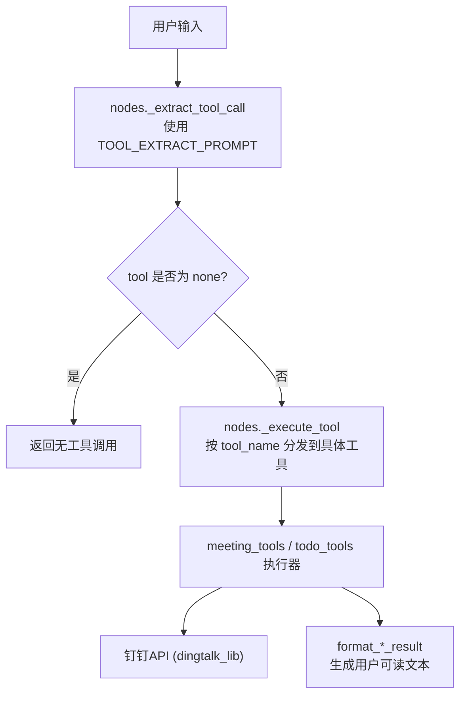
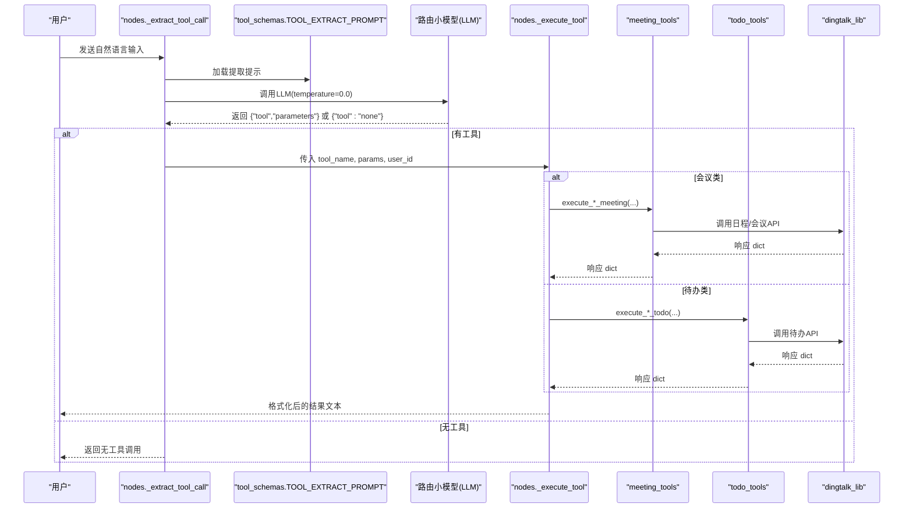
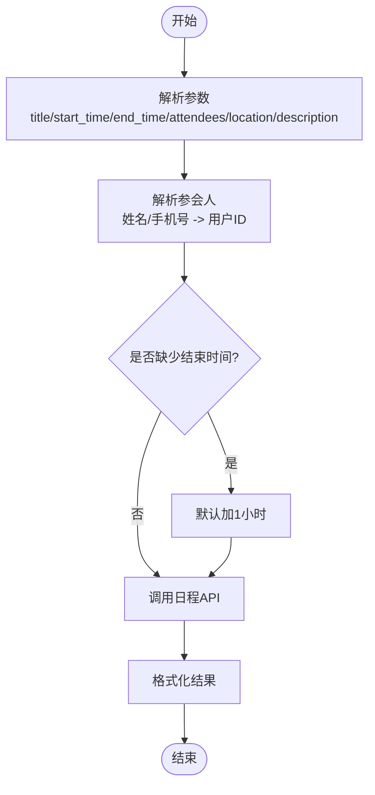
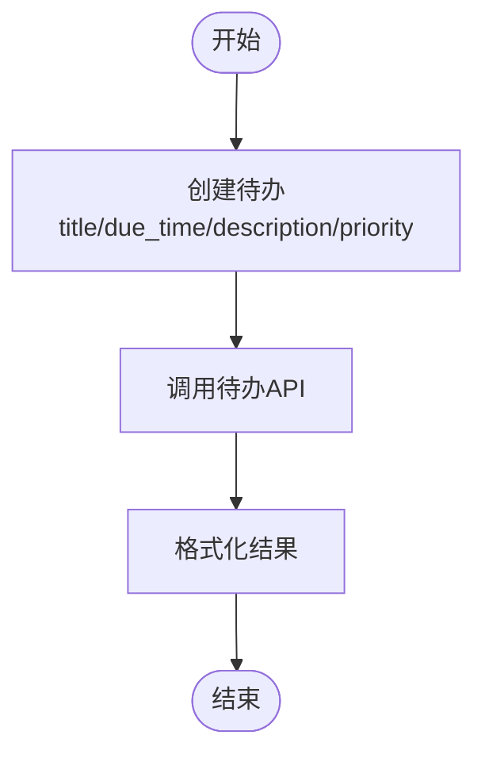
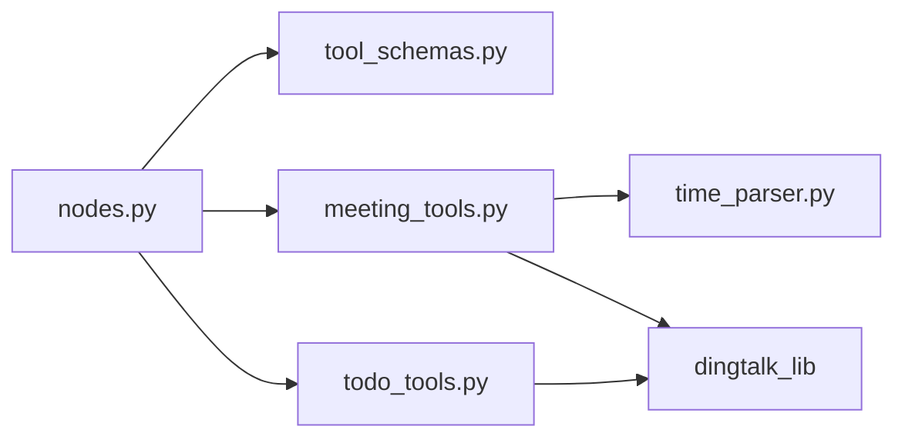

# 工具Schema定义

<cite>
**本文引用的文件**
- [agent/tools/tool_schemas.py](file://agent/tools/tool_schemas.py)
- [agent/nodes.py](file://agent/nodes.py)
- [agent/tools/meeting_tools.py](file://agent/tools/meeting_tools.py)
- [agent/tools/todo_tools.py](file://agent/tools/todo_tools.py)
- [agent/tools/time_parser.py](file://agent/tools/time_parser.py)
</cite>

## 目录
1. [简介](#简介)
2. [项目结构](#项目结构)
3. [核心组件](#核心组件)
4. [架构总览](#架构总览)
5. [详细组件分析](#详细组件分析)
6. [依赖关系分析](#依赖关系分析)
7. [性能考虑](#性能考虑)
8. [故障排查指南](#故障排查指南)
9. [结论](#结论)
10. [附录：Schema模板与最佳实践](#附录schemaschema模板与最佳实践)

## 简介
本技术文档围绕“工具Schema定义”展开，聚焦于钉钉AI智能体助手中的工具参数Schema设计规范、JSON Schema在工具调用中的作用（参数验证、自动补全、错误提示）、复杂类型参数的定义方式、版本管理与向后兼容策略，并提供会议工具、待办工具的完整Schema模板示例。同时给出为自定义工具编写符合规范的Schema定义的指导，确保工具调用的安全性与可靠性。

## 项目结构
本项目将工具Schema集中定义在工具模块中，并通过节点层进行工具提取与执行分发。关键路径如下：
- 工具Schema与工具分类集合：agent/tools/tool_schemas.py
- 工具提取与执行调度：agent/nodes.py
- 具体工具实现与结果格式化：agent/tools/meeting_tools.py、agent/tools/todo_tools.py
- 时间解析辅助：agent/tools/time_parser.py

图表来源
- [agent/nodes.py:693-746](file://agent/nodes.py#L693-L746)
- [agent/tools/meeting_tools.py:17-128](file://agent/tools/meeting_tools.py#L17-L128)
- [agent/tools/todo_tools.py:18-44](file://agent/tools/todo_tools.py#L18-L44)

章节来源
- [agent/tools/tool_schemas.py:1-121](file://agent/tools/tool_schemas.py#L1-L121)
- [agent/nodes.py:693-780](file://agent/nodes.py#L693-L780)

## 核心组件
- 工具Schema列表与提取提示：集中定义了6个工具的名称、描述、参数结构与必填字段，并提供了用于LLM参数提取的提示词。
- 读写操作分类：通过集合区分写操作（需确认）与读操作（直接执行），便于后续安全控制。
- 工具执行与格式化：根据工具名路由到对应执行器，并将API响应格式化为人类可读文本。

章节来源
- [agent/tools/tool_schemas.py:29-121](file://agent/tools/tool_schemas.py#L29-L121)
- [agent/nodes.py:712-780](file://agent/nodes.py#L712-L780)

## 架构总览
下图展示了从用户输入到工具执行的端到端流程，以及Schema在各环节的作用点。

图表来源
- [agent/nodes.py:693-746](file://agent/nodes.py#L693-L746)
- [agent/tools/meeting_tools.py:17-128](file://agent/tools/meeting_tools.py#L17-L128)
- [agent/tools/todo_tools.py:18-44](file://agent/tools/todo_tools.py#L18-L44)

## 详细组件分析

### 工具Schema设计规范与标准
- 字段类型
  - 字符串：用于标题、描述、地点、时间等；时间统一采用ISO 8601格式。
  - 数字：用于优先级等数值型参数。
  - 布尔值：用于开关型选项，如是否通知参会人。
  - 数组：用于多值参数，如参会人姓名或手机号列表。
  - 对象：用于嵌套更新结构，如会议更新的子对象。
- 必填性与默认值
  - 必填字段通过 required 声明，例如创建待办需要标题与截止时间；创建会议需要主题与开始时间。
  - 可选字段可设置默认值，例如取消会议时是否通知参会人的默认行为。
- 验证规则
  - 枚举约束：如查询待办的状态限定为 all/pending/done。
  - 时间格式：通过提示与解析器保证ISO 8601一致性。
  - 非空校验：由Schema required 与执行器共同保障。
- 设计原则
  - 最小必要参数：仅暴露必要的输入，减少歧义。
  - 明确描述：每个字段提供清晰的 description，便于自动补全与错误提示。
  - 类型安全：严格使用 JSON Schema 类型，避免隐式转换。

章节来源
- [agent/tools/tool_schemas.py:30-114](file://agent/tools/tool_schemas.py#L30-L114)

### JSON Schema在工具调用中的作用
- 参数验证：Schema 的 type、required、enum 等约束在LLM输出阶段作为强约束，降低非法参数进入执行器的概率。
- 自动补全：基于 properties 与 description，前端或IDE可提供字段建议与说明。
- 错误提示：当LLM输出不符合Schema时，可在节点层捕获并提示修正，提升交互体验。
- 结构化提取：通过提示词强制输出JSON结构，便于程序化解析与路由。

章节来源
- [agent/nodes.py:693-709](file://agent/nodes.py#L693-L709)
- [agent/tools/tool_schemas.py:7-26](file://agent/tools/tool_schemas.py#L7-L26)

### 不同类型参数的定义方式
- 字符串
  - 用途：标题、描述、地点、时间等。
  - 示例参考：创建待办/会议的标题与描述字段。
- 数字
  - 用途：优先级等数值型参数。
  - 示例参考：待办优先级范围。
- 布尔值
  - 用途：开关型选项。
  - 示例参考：取消会议时是否通知参会人。
- 数组
  - 用途：多值参数，如参会人列表。
  - 示例参考：会议参会人姓名或手机号。
- 对象
  - 用途：嵌套更新结构。
  - 示例参考：会议更新的子对象，包含标题、时间、地点等可更新字段。

章节来源
- [agent/tools/tool_schemas.py:30-114](file://agent/tools/tool_schemas.py#L30-L114)

### 版本管理与向后兼容性策略
- 版本标识
  - 建议在Schema对象中加入 version 字段，便于追踪与演进。
- 向后兼容
  - 新增可选字段：保持旧客户端可用。
  - 废弃字段：保留但标记 deprecated，逐步迁移。
  - 变更必填性：谨慎调整，必要时提供过渡期与默认值。
- 迁移策略
  - 在节点层增加兼容逻辑，对旧版参数进行映射与补齐。
  - 在提示词中明确时间格式与字段含义，减少歧义。

章节来源
- [agent/tools/tool_schemas.py:29-121](file://agent/tools/tool_schemas.py#L29-L121)

### 会议工具Schema与执行流程
- Schema要点
  - 创建会议：必填 title、start_time；可选 end_time、attendees、location、description。
  - 取消会议：可选 meeting_id 或 meeting_title；notify_attendees 默认True。
  - 更新会议：支持 updates 对象，包含 title、start_time、end_time、location。
  - 查询会议：可选 date_from、date_to，未指定时默认本周。
- 执行流程
  - 参数解析：参会人姓名/手机号解析为钉钉用户ID；时间默认时长处理。
  - API调用：调用日程/会议相关接口。
  - 结果格式化：生成用户可读文本。

图表来源
- [agent/tools/meeting_tools.py:17-47](file://agent/tools/meeting_tools.py#L17-L47)
- [agent/tools/meeting_tools.py:185-225](file://agent/tools/meeting_tools.py#L185-L225)

章节来源
- [agent/tools/tool_schemas.py:55-102](file://agent/tools/tool_schemas.py#L55-L102)
- [agent/tools/meeting_tools.py:17-128](file://agent/tools/meeting_tools.py#L17-L128)

### 待办工具Schema与执行流程
- Schema要点
  - 创建待办：必填 title、due_time；可选 description、priority。
  - 查询待办：可选 status，限定 all/pending/done。
- 执行流程
  - 参数传递：直接透传到待办API。
  - 结果格式化：生成用户可读文本，包括待办列表展示。

图表来源
- [agent/tools/todo_tools.py:18-36](file://agent/tools/todo_tools.py#L18-L36)

章节来源
- [agent/tools/tool_schemas.py:30-54](file://agent/tools/tool_schemas.py#L30-L54)
- [agent/tools/todo_tools.py:18-69](file://agent/tools/todo_tools.py#L18-L69)

### 时间解析与Schema配合
- 时间格式：统一使用ISO 8601，便于跨系统一致性与解析。
- 自然语言解析：支持中文表达转换为ISO时间，降低用户输入成本。
- 默认范围：查询会议未指定日期范围时默认本周。

章节来源
- [agent/tools/time_parser.py:11-63](file://agent/tools/time_parser.py#L11-L63)
- [agent/tools/meeting_tools.py:116-128](file://agent/tools/meeting_tools.py#L116-L128)

## 依赖关系分析
- 节点层依赖工具Schema的提示词进行参数提取。
- 工具执行器依赖 dingtalk_lib 进行API调用。
- 时间解析器为工具执行提供时间转换能力。

图表来源
- [agent/nodes.py:693-746](file://agent/nodes.py#L693-L746)
- [agent/tools/meeting_tools.py:17-128](file://agent/tools/meeting_tools.py#L17-L128)
- [agent/tools/todo_tools.py:18-44](file://agent/tools/todo_tools.py#L18-L44)
- [agent/tools/time_parser.py:11-63](file://agent/tools/time_parser.py#L11-L63)

章节来源
- [agent/nodes.py:693-746](file://agent/nodes.py#L693-L746)
- [agent/tools/tool_schemas.py:29-121](file://agent/tools/tool_schemas.py#L29-L121)

## 性能考虑
- LLM调用温度设置为0.0，提高输出稳定性，减少随机性带来的解析失败。
- 时间解析与参会人解析在本地完成，减少外部依赖调用次数。
- 批量查询与会话缓存可用于优化高频查询场景（可扩展）。

章节来源
- [agent/nodes.py:702-703](file://agent/nodes.py#L702-L703)
- [agent/tools/meeting_tools.py:185-225](file://agent/tools/meeting_tools.py#L185-L225)

## 故障排查指南
- LLM提取失败
  - 现象：无法解析工具名或参数。
  - 处理：记录异常并返回无工具调用，提示用户重新表述。
- 未知工具
  - 现象：tool_name不在已知集合。
  - 处理：返回错误码与消息，提示检查工具名。
- API调用失败
  - 现象：errcode非0。
  - 处理：格式化错误信息并返回给用户。
- 时间解析异常
  - 现象：ISO时间格式不正确。
  - 处理：回退原值或提示用户修正时间格式。

章节来源
- [agent/nodes.py:707-709](file://agent/nodes.py#L707-L709)
- [agent/nodes.py:742-746](file://agent/nodes.py#L742-L746)
- [agent/tools/meeting_tools.py:131-159](file://agent/tools/meeting_tools.py#L131-L159)
- [agent/tools/todo_tools.py:47-69](file://agent/tools/todo_tools.py#L47-L69)

## 结论
本项目的工具Schema定义以JSON Schema为核心，结合明确的字段类型、必填性与默认值、验证规则，实现了高可靠性的工具参数提取与执行。通过节点层的统一调度与工具执行器的模块化实现，确保了扩展性与可维护性。遵循本文档的设计规范与最佳实践，开发者可以为自定义工具编写符合标准的Schema定义，保障工具调用的安全性与可靠性。

## 附录：Schema模板与最佳实践

### 会议工具Schema模板
- 创建会议
  - 必填：标题、开始时间
  - 可选：结束时间、参会人、地点、描述
- 取消会议
  - 可选：会议ID或标题、是否通知参会人（默认True）
- 更新会议
  - 可选：会议ID或标题、updates对象（标题、开始时间、结束时间、地点）
- 查询会议
  - 可选：起始日期、结束日期（默认本周）

章节来源
- [agent/tools/tool_schemas.py:55-114](file://agent/tools/tool_schemas.py#L55-L114)

### 待办工具Schema模板
- 创建待办
  - 必填：标题、截止时间
  - 可选：描述、优先级
- 查询待办
  - 可选：状态（all/pending/done）

章节来源
- [agent/tools/tool_schemas.py:30-54](file://agent/tools/tool_schemas.py#L30-L54)

### 自定义工具Schema编写指南
- 明确工具职责与边界，仅暴露必要参数。
- 使用JSON Schema类型与约束，确保类型安全。
- 为每个字段提供清晰描述，便于自动补全与错误提示。
- 对写操作引入确认机制，提升安全性。
- 制定版本管理策略，确保向后兼容。
- 在节点层增加异常处理与错误提示，提升用户体验。

章节来源
- [agent/tools/tool_schemas.py:29-121](file://agent/tools/tool_schemas.py#L29-L121)
- [agent/nodes.py:712-780](file://agent/nodes.py#L712-L780)