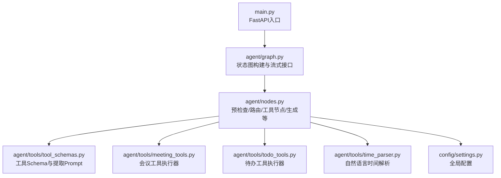
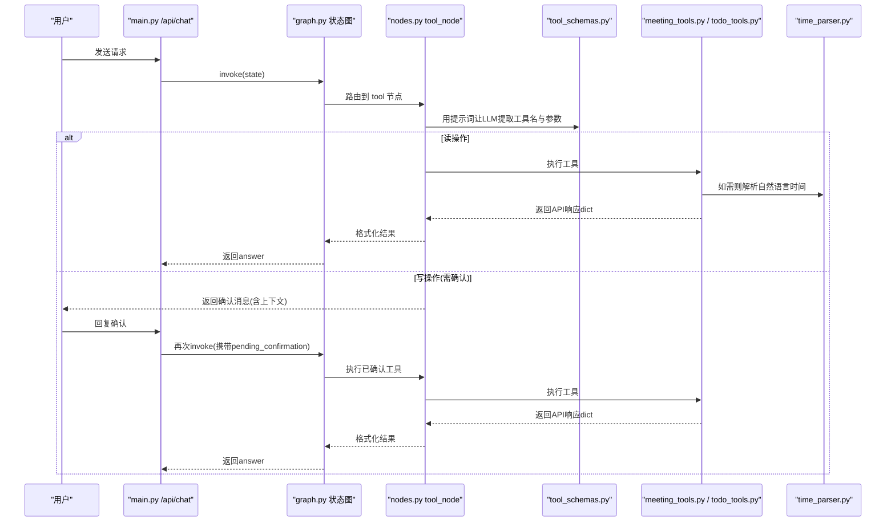
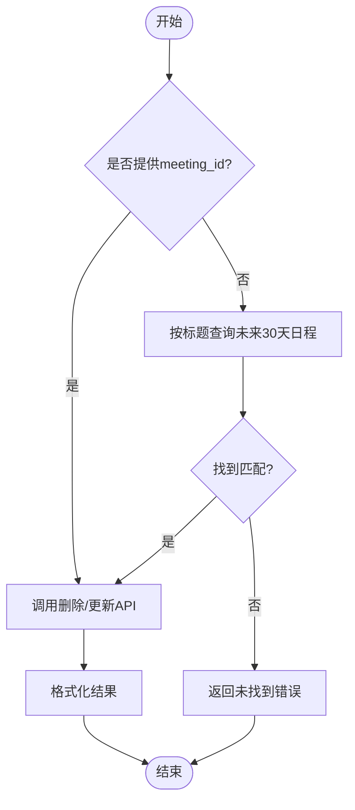
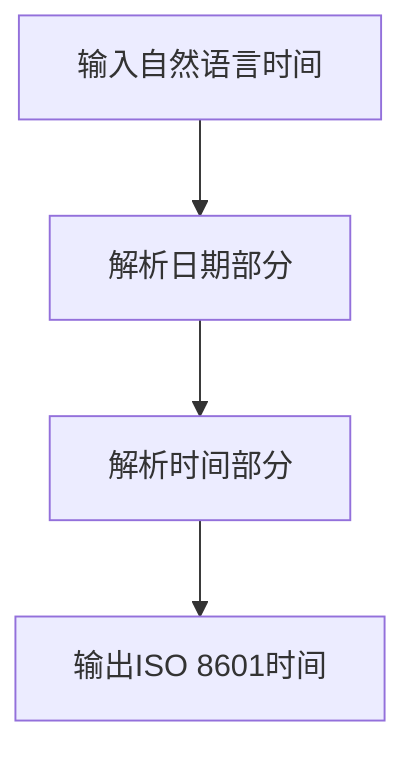
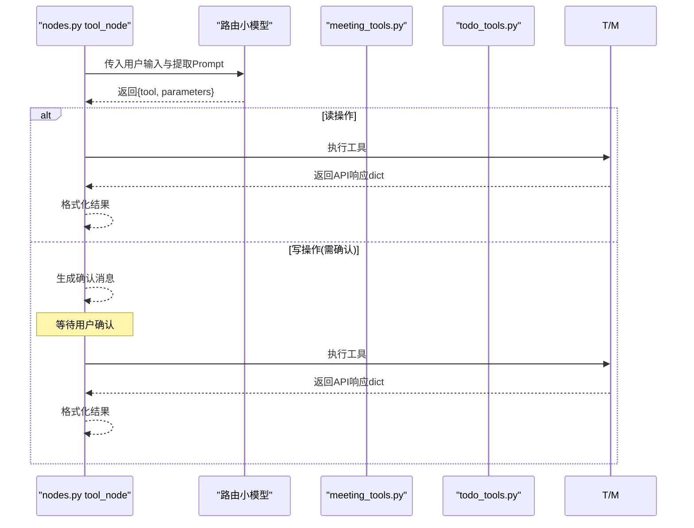
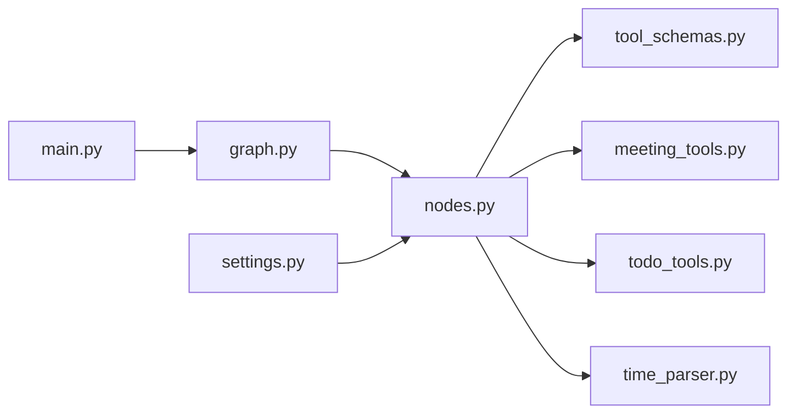

# 工具调用系统

<cite>
**本文引用的文件**
- [agent/tools/meeting_tools.py](file://agent/tools/meeting_tools.py)
- [agent/tools/todo_tools.py](file://agent/tools/todo_tools.py)
- [agent/tools/time_parser.py](file://agent/tools/time_parser.py)
- [agent/tools/tool_schemas.py](file://agent/tools/tool_schemas.py)
- [agent/nodes.py](file://agent/nodes.py)
- [agent/graph.py](file://agent/graph.py)
- [config/settings.py](file://config/settings.py)
- [main.py](file://main.py)
</cite>

## 目录
1. [简介](#简介)
2. [项目结构](#项目结构)
3. [核心组件](#核心组件)
4. [架构总览](#架构总览)
5. [详细组件分析](#详细组件分析)
6. [依赖关系分析](#依赖关系分析)
7. [性能考量](#性能考量)
8. [故障排查指南](#故障排查指南)
9. [结论](#结论)
10. [附录：扩展开发指南与最佳实践](#附录：扩展开发指南与最佳实践)

## 简介
本技术文档围绕“钉钉AI智能体助手”的工具调用系统，系统性阐述其架构设计与执行机制，覆盖工具注册、参数解析、执行调度、结果处理；重点说明钉钉企业级工具的集成实现（会议管理、待办事项管理）以及时间解析工具的智能处理能力（自然语言时间理解、时区/日期计算）。同时给出工具Schema定义规范、参数验证机制、错误处理策略，并提供工具扩展开发指南与最佳实践。

## 项目结构
工具调用系统位于 agent/tools 目录下，包含会议工具、待办工具、时间解析工具与工具Schema；工作流编排在 agent/graph.py 中通过 LangGraph StateGraph 构建，节点逻辑集中在 agent/nodes.py；配置项集中于 config/settings.py；Web入口与流式接口在 main.py。

图表来源
- [main.py:154-210](file://main.py#L154-L210)
- [agent/graph.py:44-102](file://agent/graph.py#L44-L102)
- [agent/nodes.py:647-780](file://agent/nodes.py#L647-L780)
- [agent/tools/tool_schemas.py:1-121](file://agent/tools/tool_schemas.py#L1-L121)
- [agent/tools/meeting_tools.py:1-225](file://agent/tools/meeting_tools.py#L1-L225)
- [agent/tools/todo_tools.py:1-84](file://agent/tools/todo_tools.py#L1-L84)
- [agent/tools/time_parser.py:1-120](file://agent/tools/time_parser.py#L1-L120)
- [config/settings.py:151-156](file://config/settings.py#L151-L156)

章节来源
- [main.py:154-210](file://main.py#L154-L210)
- [agent/graph.py:44-102](file://agent/graph.py#L44-L102)
- [agent/nodes.py:647-780](file://agent/nodes.py#L647-L780)
- [agent/tools/tool_schemas.py:1-121](file://agent/tools/tool_schemas.py#L1-L121)
- [agent/tools/meeting_tools.py:1-225](file://agent/tools/meeting_tools.py#L1-L225)
- [agent/tools/todo_tools.py:1-84](file://agent/tools/todo_tools.py#L1-L84)
- [agent/tools/time_parser.py:1-120](file://agent/tools/time_parser.py#L1-L120)
- [config/settings.py:151-156](file://config/settings.py#L151-L156)

## 核心组件
- 工具Schema与参数提取：tool_schemas.py 定义了6个工具的JSON Schema与用于LLM参数提取的提示词，并区分读写操作集合。
- 工具执行器：meeting_tools.py 提供创建/取消/修改/查询会议的执行与格式化；todo_tools.py 提供创建/查询待办的执行与格式化。
- 时间解析：time_parser.py 将中文自然语言时间转换为ISO 8601，支持相对日期、时间段、半点和常见表达。
- 工作流编排：graph.py 使用LangGraph构建状态图，将工具调用作为独立分支直接返回结果，不经过生成节点。
- 节点调度：nodes.py 中的 tool_node 负责LLM参数提取、确认流程（写操作）、分发执行、结果格式化与确认消息构造。
- 配置开关：settings.py 提供工具调用总开关、写操作确认开关等。

章节来源
- [agent/tools/tool_schemas.py:1-121](file://agent/tools/tool_schemas.py#L1-L121)
- [agent/tools/meeting_tools.py:1-225](file://agent/tools/meeting_tools.py#L1-L225)
- [agent/tools/todo_tools.py:1-84](file://agent/tools/todo_tools.py#L1-L84)
- [agent/tools/time_parser.py:1-120](file://agent/tools/time_parser.py#L1-L120)
- [agent/graph.py:44-102](file://agent/graph.py#L44-L102)
- [agent/nodes.py:647-780](file://agent/nodes.py#L647-L780)
- [config/settings.py:151-156](file://config/settings.py#L151-L156)

## 架构总览
工具调用系统在预检查阶段进行缓存匹配与路由判断；当识别到工具意图且开启工具调用时，进入 tool 节点，完成参数提取、确认（写操作）、执行与结果返回。会议工具在查询时默认使用“本周”时间范围，并通过时间解析工具将自然语言转为ISO时间。

图表来源
- [main.py:154-210](file://main.py#L154-L210)
- [agent/graph.py:44-102](file://agent/graph.py#L44-L102)
- [agent/nodes.py:647-780](file://agent/nodes.py#L647-L780)
- [agent/tools/tool_schemas.py:1-121](file://agent/tools/tool_schemas.py#L1-L121)
- [agent/tools/meeting_tools.py:1-225](file://agent/tools/meeting_tools.py#L1-L225)
- [agent/tools/todo_tools.py:1-84](file://agent/tools/todo_tools.py#L1-L84)
- [agent/tools/time_parser.py:1-120](file://agent/tools/time_parser.py#L1-L120)

## 详细组件分析

### 工具Schema与参数提取
- 工具列表与描述：包含 create_todo、query_todos、create_meeting、cancel_meeting、update_meeting、query_meetings。
- 参数约束：必填字段、可选字段、类型与枚举值明确定义，便于LLM稳定输出结构化参数。
- 提取提示词：TOOL_EXTRACT_PROMPT 指导LLM从用户输入中识别工具与参数，并以JSON形式输出。
- 读写分类：WRITE_TOOLS 与 READ_TOOLS 用于控制是否需要用户确认。

章节来源
- [agent/tools/tool_schemas.py:1-121](file://agent/tools/tool_schemas.py#L1-L121)

### 会议管理工具（创建、查询、修改、取消）
- 创建会议：解析参会人（姓名/手机号→钉钉用户ID），自动补全结束时间（默认+1小时），调用底层API创建日程。
- 取消会议：优先按 meeting_id 取消；若无ID则按标题在未来30天内检索匹配后取消。
- 修改会议：优先按 meeting_id 修改；若无ID则按标题检索匹配后更新指定字段。
- 查询会议：未指定时间范围时默认查询“本周”，使用 time_parser.parse_natural_date_range 获取起止时间。
- 结果格式化：统一封装为友好文本，失败时返回错误信息。

图表来源
- [agent/tools/meeting_tools.py:50-113](file://agent/tools/meeting_tools.py#L50-L113)

章节来源
- [agent/tools/meeting_tools.py:17-128](file://agent/tools/meeting_tools.py#L17-L128)
- [agent/tools/meeting_tools.py:131-183](file://agent/tools/meeting_tools.py#L131-L183)
- [agent/tools/meeting_tools.py:185-225](file://agent/tools/meeting_tools.py#L185-L225)

### 待办事项管理工具（创建、查询）
- 创建待办：接收标题、截止时间、详情、优先级，调用底层API创建。
- 查询待办：支持按状态筛选（all/pending/done），返回待办列表。
- 结果格式化：成功时展示待办数量与关键信息；失败时返回错误信息。

章节来源
- [agent/tools/todo_tools.py:18-44](file://agent/tools/todo_tools.py#L18-L44)
- [agent/tools/todo_tools.py:47-84](file://agent/tools/todo_tools.py#L47-L84)

### 时间解析工具（自然语言时间理解与时区/日期计算）
- 单点时间解析：parse_natural_time 将自然语言时间转换为ISO 8601字符串，内部先解析日期再解析时间。
- 日期范围解析：parse_natural_date_range 支持“今天/明天/本周/下周/本月”等语义，返回(start, end)元组。
- 时间片段解析：支持“上午/下午/晚上/早上 + X点/X点半/HH:MM”等格式，自动处理12/24小时制转换。
- 应用示例：会议查询默认“本周”即通过该模块解析为起止时间。

图表来源
- [agent/tools/time_parser.py:11-63](file://agent/tools/time_parser.py#L11-L63)
- [agent/tools/time_parser.py:66-120](file://agent/tools/time_parser.py#L66-L120)

章节来源
- [agent/tools/time_parser.py:1-120](file://agent/tools/time_parser.py#L1-L120)
- [agent/tools/meeting_tools.py:116-128](file://agent/tools/meeting_tools.py#L116-L128)

### 工具执行调度与确认流程
- 参数提取：tool_node 通过路由小模型与 TOOL_EXTRACT_PROMPT 从用户输入中提取工具名与参数。
- 读操作直执：query_todos、query_meetings 直接执行并返回结果。
- 写操作确认：create_todo、create_meeting、cancel_meeting、update_meeting 在未关闭确认开关时返回确认消息，等待用户确认后执行。
- 执行分发：_execute_tool 根据工具名动态导入对应执行器并调用。
- 结果格式化：_format_tool_result 调用各工具模块的 format_* 函数，统一返回用户可读文本。

图表来源
- [agent/nodes.py:647-780](file://agent/nodes.py#L647-L780)
- [agent/tools/tool_schemas.py:1-121](file://agent/tools/tool_schemas.py#L1-L121)
- [agent/tools/meeting_tools.py:1-225](file://agent/tools/meeting_tools.py#L1-L225)
- [agent/tools/todo_tools.py:1-84](file://agent/tools/todo_tools.py#L1-L84)

章节来源
- [agent/nodes.py:647-780](file://agent/nodes.py#L647-L780)

## 依赖关系分析
- 工作流层：graph.py 定义节点与边，tool 节点直接到 END，避免不必要的生成步骤。
- 节点层：nodes.py 集中工具调用逻辑，依赖 tool_schemas.py 的Schema与提示词，依赖 meeting_tools.py、todo_tools.py 的具体执行器，依赖 time_parser.py 的时间解析能力。
- 配置层：settings.py 提供工具调用开关与确认开关，影响路由与确认流程。
- 外部依赖：meeting_tools.py 与 todo_tools.py 通过 sys.path.insert 引入 dingtalk_lib（skill脚本目录），保持自包含特性。

图表来源
- [agent/graph.py:44-102](file://agent/graph.py#L44-L102)
- [agent/nodes.py:647-780](file://agent/nodes.py#L647-L780)
- [agent/tools/tool_schemas.py:1-121](file://agent/tools/tool_schemas.py#L1-L121)
- [agent/tools/meeting_tools.py:1-225](file://agent/tools/meeting_tools.py#L1-L225)
- [agent/tools/todo_tools.py:1-84](file://agent/tools/todo_tools.py#L1-L84)
- [agent/tools/time_parser.py:1-120](file://agent/tools/time_parser.py#L1-L120)
- [config/settings.py:151-156](file://config/settings.py#L151-L156)
- [main.py:154-210](file://main.py#L154-L210)

章节来源
- [agent/graph.py:44-102](file://agent/graph.py#L44-L102)
- [agent/nodes.py:647-780](file://agent/nodes.py#L647-L780)
- [agent/tools/tool_schemas.py:1-121](file://agent/tools/tool_schemas.py#L1-L121)
- [agent/tools/meeting_tools.py:1-225](file://agent/tools/meeting_tools.py#L1-L225)
- [agent/tools/todo_tools.py:1-84](file://agent/tools/todo_tools.py#L1-L84)
- [agent/tools/time_parser.py:1-120](file://agent/tools/time_parser.py#L1-L120)
- [config/settings.py:151-156](file://config/settings.py#L151-L156)
- [main.py:154-210](file://main.py#L154-L210)

## 性能考量
- 路由短路：预检查命中问答记忆或工具关键词可快速分流，减少大模型调用。
- 工具直返：tool 节点直接返回结果，不经过 generate，降低延迟。
- 时间解析轻量：自然语言时间解析基于正则与日期运算，开销低。
- 参会人解析容错：解析失败保留原值，避免阻塞整体流程。
- 流式接口超时保护：主入口对整体流式响应设置超时，防止连接卡死。

[本节为通用性能讨论，不直接分析具体代码行]

## 故障排查指南
- 工具调用失败：nodes.py 在执行工具时捕获异常并返回统一错误结构，可通过 errmsg 定位问题。
- 会议未找到：取消/修改会议在无ID时按标题检索未来30天，若未找到会返回明确错误信息。
- 参会人解析失败：手机号/姓名解析失败会保留原值，后续API可能跳过无效ID，需检查输入是否正确。
- 时间解析异常：时间解析失败会回退到默认行为（如默认一周），建议检查自然语言表达是否符合预期。
- 配置开关：确保 settings.py 中 tool_calling_enabled 与 tool_confirmation_required 符合预期。

章节来源
- [agent/nodes.py:712-746](file://agent/nodes.py#L712-L746)
- [agent/tools/meeting_tools.py:50-113](file://agent/tools/meeting_tools.py#L50-L113)
- [agent/tools/meeting_tools.py:185-225](file://agent/tools/meeting_tools.py#L185-L225)
- [agent/tools/time_parser.py:11-63](file://agent/tools/time_parser.py#L11-L63)
- [config/settings.py:151-156](file://config/settings.py#L151-L156)

## 结论
本工具调用系统以LangGraph状态图为骨架，结合明确的工具Schema与提示词驱动LLM参数提取，实现了会议与待办的企业级集成。通过读操作直执与写操作确认机制，兼顾效率与安全；时间解析工具提升了自然语言交互体验。整体架构清晰、可扩展性强，适合持续迭代与企业场景落地。

[本节为总结性内容，不直接分析具体代码行]

## 附录：扩展开发指南与最佳实践
- 新增工具步骤
  - 在 tool_schemas.py 中添加新工具的Schema与描述，更新 WRITE_TOOLS/READ_TOOLS 集合。
  - 在 tools 目录下新增执行器模块，实现 execute_* 与 format_* 函数。
  - 在 nodes.py 的 _execute_tool 与 _format_tool_result 中注册新工具的分发与格式化逻辑。
  - 如需时间解析，复用 time_parser.py 的能力，并在执行器中按需调用。
- 参数验证与错误处理
  - 利用Schema的required与type约束，配合LLM提示词保证参数完整性。
  - 在执行器中对边界条件做防御性编程（如空参、非法时间、缺失ID）。
  - 统一返回errcode/errmsg结构，便于上层统一处理。
- 安全与确认
  - 写操作默认需要用户确认，可在配置中关闭但需谨慎。
  - 对敏感操作增加二次确认或审批流程（可扩展确认消息模板）。
- 性能优化
  - 批量操作尽量合并API调用，减少网络往返。
  - 对耗时操作（如参会人解析）采用容错与降级策略。
  - 合理设置流式超时与重试策略。
- 测试与调试
  - 使用 main.py 的REPL模式进行交互式测试。
  - 针对时间解析与参会人解析编写单元测试，覆盖常见自然语言表达。
  - 监控日志与错误码，快速定位问题。

章节来源
- [agent/tools/tool_schemas.py:1-121](file://agent/tools/tool_schemas.py#L1-L121)
- [agent/nodes.py:647-780](file://agent/nodes.py#L647-L780)
- [agent/tools/meeting_tools.py:1-225](file://agent/tools/meeting_tools.py#L1-L225)
- [agent/tools/todo_tools.py:1-84](file://agent/tools/todo_tools.py#L1-L84)
- [agent/tools/time_parser.py:1-120](file://agent/tools/time_parser.py#L1-L120)
- [config/settings.py:151-156](file://config/settings.py#L151-L156)
- [main.py:329-362](file://main.py#L329-L362)