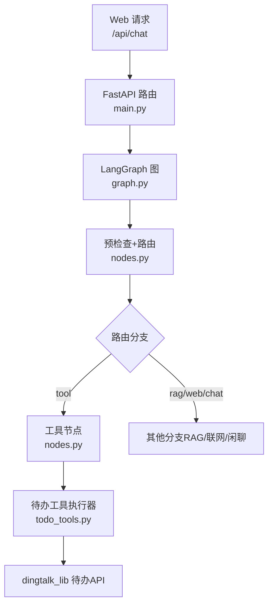
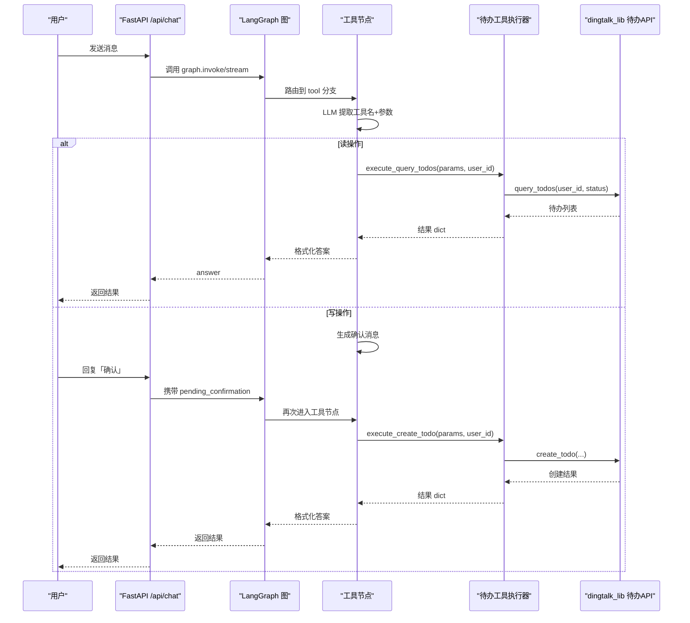
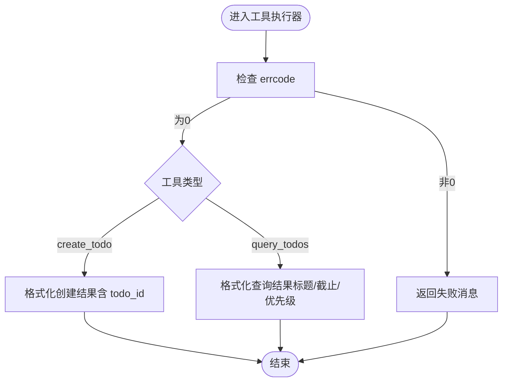
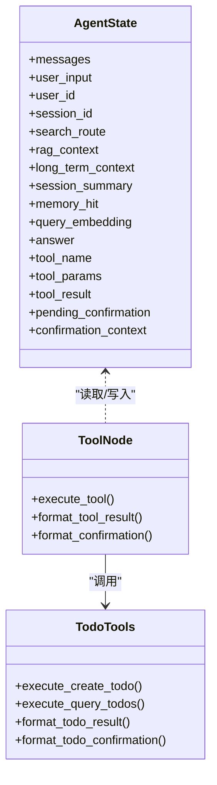
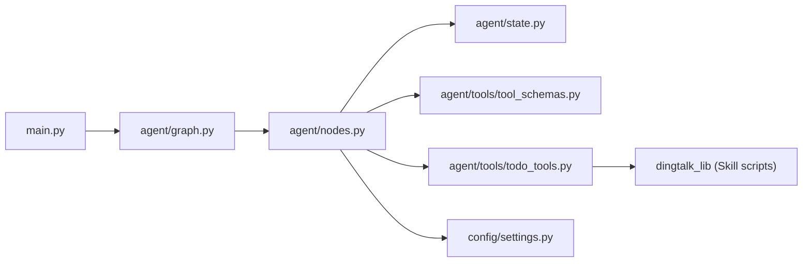

# 待办事项管理工具

<cite>
**本文引用的文件**
- [agent/tools/todo_tools.py](file://agent/tools/todo_tools.py)
- [agent/tools/tool_schemas.py](file://agent/tools/tool_schemas.py)
- [agent/nodes.py](file://agent/nodes.py)
- [agent/graph.py](file://agent/graph.py)
- [agent/state.py](file://agent/state.py)
- [config/settings.py](file://config/settings.py)
- [main.py](file://main.py)
- [需求分析文档.md](file://需求分析文档.md)
</cite>

## 目录
1. [简介](#简介)
2. [项目结构](#项目结构)
3. [核心组件](#核心组件)
4. [架构总览](#架构总览)
5. [详细组件分析](#详细组件分析)
6. [依赖关系分析](#依赖关系分析)
7. [性能与可靠性](#性能与可靠性)
8. [故障排查指南](#故障排查指南)
9. [结论](#结论)
10. [附录：API 调用示例与集成模式](#附录api-调用示例与集成模式)

## 简介
本技术文档聚焦“待办事项管理工具”，围绕待办的创建、查询、完成与删除等能力，结合智能体工作流（LangGraph）与钉钉待办 API 的集成方式，给出数据模型、状态管理、优先级处理、搜索过滤、错误处理与批量操作支持等方面的完整说明。同时提供在智能体工作流中集成待办管理的最佳实践与常见问题排查建议。

## 项目结构
本项目采用模块化设计，待办功能由“工具层 + 节点编排 + 配置 + 主入口”组成：
- 工具层：封装对 dingtalk_lib 的调用，负责参数转换与结果格式化
- 节点编排：通过 LangGraph 将意图识别、工具调用、确认机制串联为工作流
- 配置：集中管理开关与行为策略（如是否启用工具调用、是否需要用户确认）
- 主入口：FastAPI 服务暴露聊天接口，驱动智能体执行

图表来源
- [main.py:154-209](file://main.py#L154-L209)
- [agent/graph.py:44-102](file://agent/graph.py#L44-L102)
- [agent/nodes.py:647-746](file://agent/nodes.py#L647-L746)
- [agent/tools/todo_tools.py:18-44](file://agent/tools/todo_tools.py#L18-L44)

章节来源
- [main.py:154-209](file://main.py#L154-L209)
- [agent/graph.py:44-102](file://agent/graph.py#L44-L102)
- [agent/nodes.py:647-746](file://agent/nodes.py#L647-L746)
- [agent/tools/todo_tools.py:18-44](file://agent/tools/todo_tools.py#L18-L44)

## 核心组件
- 工具 Schema 定义：描述 LLM Function Calling 的工具名、描述与参数结构，用于从自然语言中提取工具调用意图与参数
- 工具执行器：封装具体工具实现，调用 dingtalk_lib 的待办 API，并返回统一格式的结果
- 工具节点：工作流中的工具调用节点，负责参数提取、写操作确认、执行与结果格式化
- 状态定义：AgentState 包含工具名、参数、执行结果、确认上下文等字段，贯穿工作流
- 配置项：控制工具调用总开关、写操作是否需要用户确认等

章节来源
- [agent/tools/tool_schemas.py:30-54](file://agent/tools/tool_schemas.py#L30-L54)
- [agent/tools/todo_tools.py:18-44](file://agent/tools/todo_tools.py#L18-L44)
- [agent/nodes.py:647-746](file://agent/nodes.py#L647-L746)
- [agent/state.py:12-51](file://agent/state.py#L12-L51)
- [config/settings.py:151-156](file://config/settings.py#L151-L156)

## 架构总览
待办管理的工作流基于 LangGraph 的状态图编排，关键路径如下：
- 预检查：问答缓存匹配 + 路由判断（关键词短路、LLM 路由、兜底）
- 分流：根据 search_route 进入 tool/retrieve/web_search/load_memory/generate
- 工具调用：LLM 提取工具名与参数 → 读操作直接执行，写操作需确认 → 执行后格式化结果返回
- 记忆更新：后台异步抽取与长期记忆更新，不阻塞响应

图表来源
- [agent/nodes.py:647-746](file://agent/nodes.py#L647-L746)
- [agent/tools/todo_tools.py:18-44](file://agent/tools/todo_tools.py#L18-L44)
- [main.py:154-209](file://main.py#L154-L209)

## 详细组件分析

### 待办工具执行器（todo_tools.py）
- 创建待办：接收 title、due_time、description、priority，调用 dingtalk_lib.create_todo
- 查询待办：接收 status（all/pending/done），调用 dingtalk_lib.query_todos
- 结果格式化：统一 errcode 检查；创建成功返回 ID；查询结果按标题、截止时间、优先级展示
- 确认消息：写操作时输出待办信息摘要，提示用户回复「确认」执行

图表来源
- [agent/tools/todo_tools.py:47-69](file://agent/tools/todo_tools.py#L47-L69)

章节来源
- [agent/tools/todo_tools.py:18-44](file://agent/tools/todo_tools.py#L18-L44)
- [agent/tools/todo_tools.py:47-83](file://agent/tools/todo_tools.py#L47-L83)

### 工具 Schema 与参数提取（tool_schemas.py）
- 工具定义：create_todo（必填 title、due_time；可选 description、priority）、query_todos（可选 status）
- 时间格式：ISO 8601
- 读写分类：write_tools（需确认）、read_tools（直接执行）
- 参数提取 Prompt：供路由小模型从自然语言中解析工具名与参数

章节来源
- [agent/tools/tool_schemas.py:8-26](file://agent/tools/tool_schemas.py#L8-L26)
- [agent/tools/tool_schemas.py:30-54](file://agent/tools/tool_schemas.py#L30-L54)
- [agent/tools/tool_schemas.py:116-121](file://agent/tools/tool_schemas.py#L116-L121)

### 工具节点与工作流（nodes.py + graph.py）
- 工具节点职责：
  - LLM 提取工具名与参数
  - 读操作直接执行，写操作生成确认消息
  - 用户确认后执行工具，格式化结果返回
- 条件路由：pre_check_condition 将 memory_hit 或 search_route 映射到对应节点
- 图构建：注册节点、添加边与条件边，编译后作为单例复用

图表来源
- [agent/state.py:12-51](file://agent/state.py#L12-L51)
- [agent/nodes.py:647-746](file://agent/nodes.py#L647-L746)
- [agent/tools/todo_tools.py:18-83](file://agent/tools/todo_tools.py#L18-L83)

章节来源
- [agent/nodes.py:93-151](file://agent/nodes.py#L93-L151)
- [agent/nodes.py:647-746](file://agent/nodes.py#L647-L746)
- [agent/graph.py:44-102](file://agent/graph.py#L44-L102)

### 配置与开关（settings.py）
- 工具调用总开关：TOOL_CALLING_ENABLED 控制是否启用工具路由（关闭则降级为 chat）
- 写操作确认：TOOL_CONFIRMATION_REQUIRED 控制是否需要用户确认后再执行写操作
- 这些配置影响路由判断与工具节点行为

章节来源
- [config/settings.py:151-156](file://config/settings.py#L151-L156)

### 主入口与服务（main.py）
- FastAPI 提供 /api/chat 与 /api/chat/stream 两个接口
- 安全校验、限流、熔断前置检查
- 调用 LangGraph 图执行，返回结构化结果或流式事件

章节来源
- [main.py:154-209](file://main.py#L154-L209)
- [main.py:228-314](file://main.py#L228-L314)

## 依赖关系分析
- 工具层依赖 dingtalk_lib（位于 Skill 脚本目录），通过 sys.path.insert 动态导入，保持自包含
- 工具节点依赖路由小模型进行参数提取，依赖配置模块控制行为
- 工作流依赖 LangGraph StateGraph 与 checkpointer，维护会话状态
- 主入口依赖 FastAPI、LangGraph 与配置模块

图表来源
- [main.py:154-209](file://main.py#L154-L209)
- [agent/graph.py:44-102](file://agent/graph.py#L44-L102)
- [agent/nodes.py:647-746](file://agent/nodes.py#L647-L746)
- [agent/tools/todo_tools.py:10-15](file://agent/tools/todo_tools.py#L10-L15)
- [config/settings.py:151-156](file://config/settings.py#L151-L156)

章节来源
- [agent/tools/todo_tools.py:10-15](file://agent/tools/todo_tools.py#L10-L15)
- [agent/nodes.py:647-746](file://agent/nodes.py#L647-L746)
- [agent/graph.py:44-102](file://agent/graph.py#L44-L102)
- [config/settings.py:151-156](file://config/settings.py#L151-L156)

## 性能与可靠性
- 路由三层判断：关键词短路 → LLM 路由 → 关键词兜底，兼顾速度与准确率
- 工具调用性能目标：参数提取 < 3s，API 调用 < 5s
- 流式超时保护：整体超时后返回已生成内容，避免连接卡死
- 容错与降级：检索失败回退空上下文；工具调用失败返回友好错误；LLM 失败多模型降级
- 记忆系统：短期 MemorySaver（进程内），长期 SQLite（WAL 模式），减少外部依赖

章节来源
- [agent/nodes.py:161-211](file://agent/nodes.py#L161-L211)
- [main.py:228-314](file://main.py#L228-L314)
- [需求分析文档.md:265-293](file://需求分析文档.md#L265-L293)

## 故障排查指南
- 工具未识别：检查 TOOL_KEYWORDS 与 TOOL_EXTRACT_PROMPT，确认 LLM 能正确解析工具名与参数
- 写操作未执行：确认 TOOL_CONFIRMATION_REQUIRED 是否为 True，用户是否回复「确认」
- 查询无结果：检查 status 参数（all/pending/done），确认用户ID与权限
- API 调用失败：查看 errcode 与 errmsg，定位 dingtalk_lib 返回的错误信息
- 路由异常：临时关闭 TOOL_CALLING_ENABLED，降级为 chat 以验证链路

章节来源
- [agent/tools/tool_schemas.py:8-26](file://agent/tools/tool_schemas.py#L8-L26)
- [agent/tools/todo_tools.py:47-69](file://agent/tools/todo_tools.py#L47-L69)
- [config/settings.py:151-156](file://config/settings.py#L151-L156)

## 结论
待办事项管理工具通过 LangGraph 工作流与 dingtalk_lib 的集成，实现了创建、查询等核心能力，并提供写操作确认机制与友好的结果格式化。当前实现覆盖参数提取、状态管理、优先级展示与基础过滤。后续可扩展完成与删除操作、更丰富的搜索过滤条件以及批量操作支持。

## 附录：API 调用示例与集成模式

### Web 聊天接口
- POST /api/chat
  - 请求体：{user_input, user_id, session_id}
  - 响应：{errcode, errmsg, answer}
- POST /api/chat/stream（SSE）
  - 事件类型：status、token、error、done

章节来源
- [main.py:154-209](file://main.py#L154-L209)
- [main.py:228-314](file://main.py#L228-L314)

### 待办工具调用流程（示例）
- 创建待办
  - 工具名：create_todo
  - 参数：title（必填）、due_time（必填）、description（可选）、priority（可选，1-5）
  - 流程：LLM 提取参数 → 生成确认消息 → 用户回复「确认」→ 执行 create_todo → 返回结果
- 查询待办
  - 工具名：query_todos
  - 参数：status（可选，all/pending/done）
  - 流程：LLM 提取参数 → 直接执行 query_todos → 返回格式化列表

章节来源
- [agent/tools/tool_schemas.py:30-54](file://agent/tools/tool_schemas.py#L30-L54)
- [agent/tools/todo_tools.py:18-44](file://agent/tools/todo_tools.py#L18-L44)
- [agent/nodes.py:647-746](file://agent/nodes.py#L647-L746)

### 数据结构与状态管理
- 待办数据字段：title、due_time、description、priority
- 状态字段：tool_name、tool_params、tool_result、pending_confirmation、confirmation_context
- 优先级处理：显示时使用星号数量表示优先级强度（1-5）

章节来源
- [agent/tools/todo_tools.py:60-67](file://agent/tools/todo_tools.py#L60-L67)
- [agent/state.py:40-51](file://agent/state.py#L40-L51)

### 搜索与过滤
- 当前支持按状态过滤（all/pending/done）
- 未来可扩展：按时间范围、优先级区间、关键词标题模糊匹配等

章节来源
- [agent/tools/todo_tools.py:39-44](file://agent/tools/todo_tools.py#L39-L44)

### 错误处理模式
- 统一 errcode 检查：非 0 时返回失败消息
- 工具调用异常捕获：记录日志并返回友好错误
- 流式超时保护：超时后返回已生成内容并标记成功

章节来源
- [agent/tools/todo_tools.py:47-50](file://agent/tools/todo_tools.py#L47-L50)
- [agent/nodes.py:744-746](file://agent/nodes.py#L744-L746)
- [main.py:262-304](file://main.py#L262-L304)

### 智能体工作流集成要点
- 路由判断：关键词短路 + LLM 路由 + 兜底，工具优先
- 写操作确认：确保用户明确同意后再执行变更
- 结果格式化：统一返回人类可读文本，便于前端渲染
- 记忆更新：后台异步执行，不阻塞响应

章节来源
- [agent/nodes.py:161-211](file://agent/nodes.py#L161-L211)
- [agent/nodes.py:647-746](file://agent/nodes.py#L647-L746)
- [agent/graph.py:44-102](file://agent/graph.py#L44-L102)