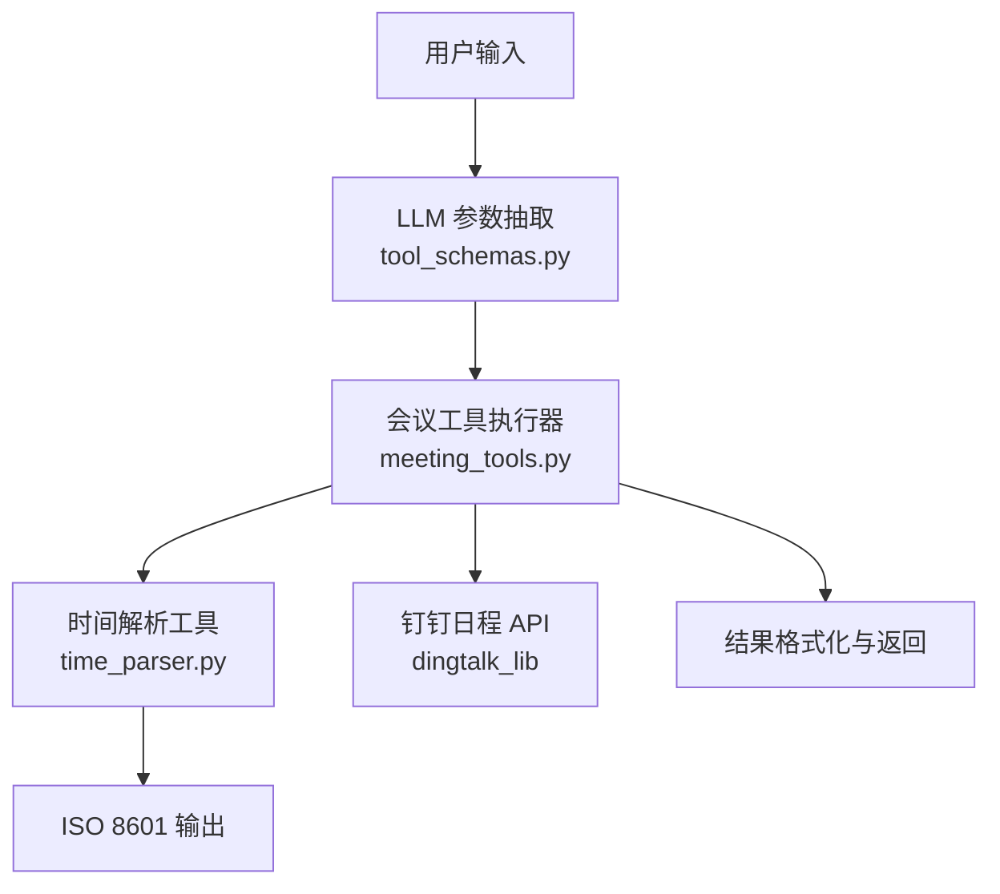
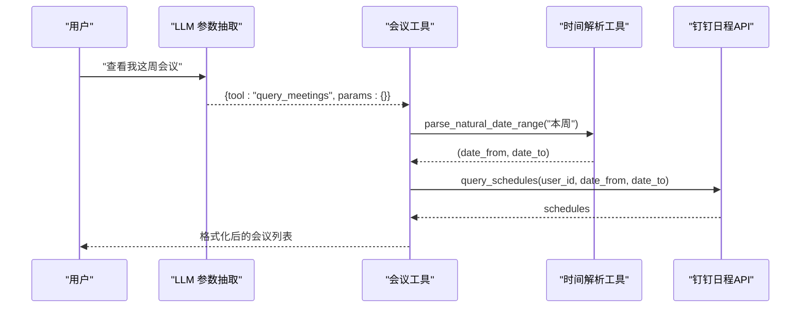
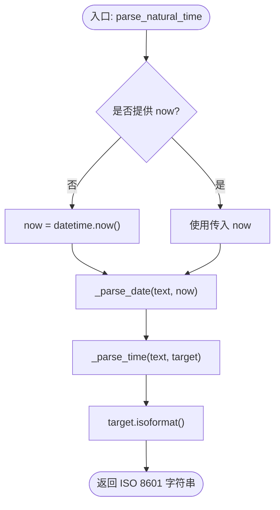
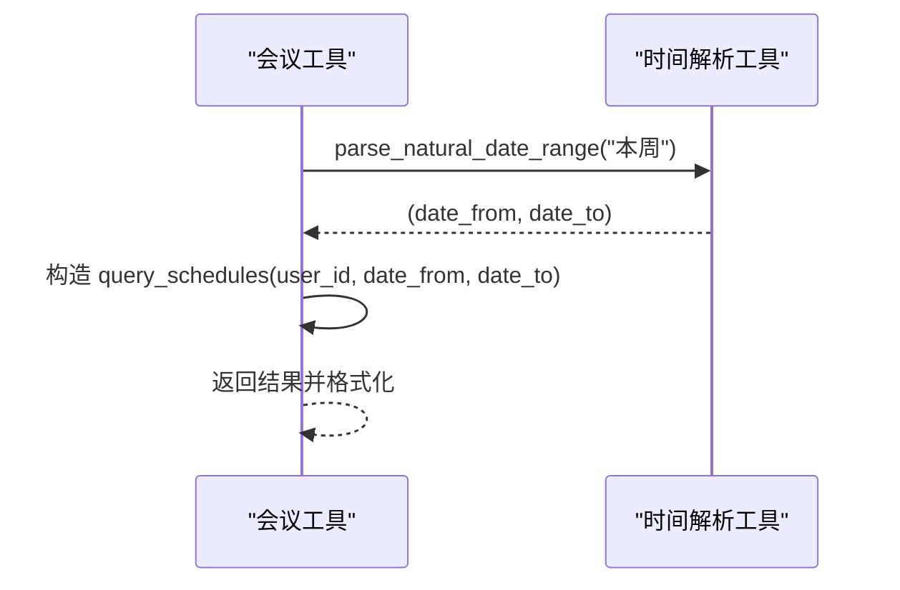
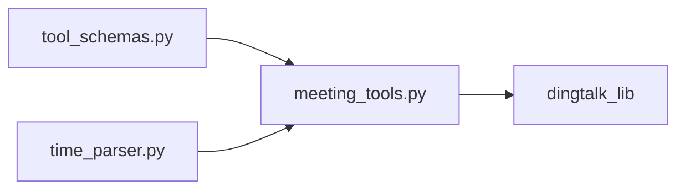

# 时间解析工具

<cite>
**本文引用的文件**
- [time_parser.py](file://agent/tools/time_parser.py)
- [meeting_tools.py](file://agent/tools/meeting_tools.py)
- [tool_schemas.py](file://agent/tools/tool_schemas.py)
- [settings.py](file://config/settings.py)
- [test_smoke.py](file://tests/test_smoke.py)
</cite>

## 目录
1. [简介](#简介)
2. [项目结构](#项目结构)
3. [核心组件](#核心组件)
4. [架构总览](#架构总览)
5. [详细组件分析](#详细组件分析)
6. [依赖关系分析](#依赖关系分析)
7. [性能考量](#性能考量)
8. [故障排查指南](#故障排查指南)
9. [结论](#结论)
10. [附录：语法与示例](#附录语法与示例)

## 简介
本技术文档聚焦于“自然语言时间解析工具”，用于将中文自然语言时间表达转换为标准 ISO 8601 时间字符串或日期范围，并说明其在会议查询等场景中的集成方式。重点覆盖：
- 中文时间表达式识别（如“今天”“明天”“下周”“3天后”“下午3点半”）
- 相对时间计算与日期范围推导
- 时区处理机制与本地化支持现状
- 边界情况处理（月末、闰年、跨月/跨年）
- 与其他模块的集成（特别是会议查询中的时间范围自动推导）
- 丰富的解析示例与测试建议

## 项目结构
时间解析能力位于 agent/tools 下的 time_parser.py，并在 meeting_tools.py 中被调用以完成会议查询时的默认时间范围推导。配置集中在 config/settings.py，测试用例在 tests/test_smoke.py。

图表来源
- [meeting_tools.py:116-128](file://agent/tools/meeting_tools.py#L116-L128)
- [time_parser.py:11-63](file://agent/tools/time_parser.py#L11-L63)
- [tool_schemas.py:8-26](file://agent/tools/tool_schemas.py#L8-L26)

章节来源
- [meeting_tools.py:1-225](file://agent/tools/meeting_tools.py#L1-L225)
- [time_parser.py:1-120](file://agent/tools/time_parser.py#L1-L120)
- [tool_schemas.py:1-121](file://agent/tools/tool_schemas.py#L1-L121)
- [settings.py:1-216](file://config/settings.py#L1-L216)
- [test_smoke.py:1-366](file://tests/test_smoke.py#L1-L366)

## 核心组件
- 时间解析函数
  - parse_natural_time：将包含时间表达的自然语言文本解析为 ISO 8601 字符串
  - parse_natural_date_range：将自然语言日期范围解析为 (start, end) 元组
- 内部解析逻辑
  - _parse_date：基于关键词与正则匹配进行相对日期计算
  - _parse_time：基于关键词与正则匹配进行时间点修正（含上午/下午/晚上/早上、半点、数字时间）

章节来源
- [time_parser.py:11-120](file://agent/tools/time_parser.py#L11-L120)

## 架构总览
时间解析工具作为独立模块，提供纯函数式接口，不依赖外部服务与时区库；其输出为标准 ISO 8601 字符串，便于下游系统统一处理。会议工具在执行查询时，若未指定时间范围，则调用时间解析工具生成“本周”的起止时间，从而简化用户交互。

图表来源
- [meeting_tools.py:116-128](file://agent/tools/meeting_tools.py#L116-L128)
- [time_parser.py:29-63](file://agent/tools/time_parser.py#L29-L63)

## 详细组件分析

### 时间解析工具（time_parser.py）
- 设计要点
  - 使用 datetime.now() 作为基准时间，可注入 now 参数以便测试与模拟
  - 日期解析优先匹配中文相对词（今天/明日/后天/昨天/下周/下下周/本周），其次尝试“X天后”“X小时后”的正则匹配
  - 时间解析支持“上午/下午/晚上/早上 + 小时 + 点/时/冒号/全角冒号 + 分钟”以及“X点半”的表达
  - 输出为 ISO 8601 字符串，便于跨系统传递
- 算法流程
  - 先解析日期部分，再解析时间部分，最终合并为目标 datetime
  - 对“下午/晚上”且小时小于12的情况进行+12转换；对“上午/早上”且小时等于12的情况置为0点
- 复杂度
  - 时间复杂度 O(1)，仅涉及固定次数的字符串匹配与算术运算
  - 空间复杂度 O(1)，无额外数据结构

图表来源
- [time_parser.py:11-26](file://agent/tools/time_parser.py#L11-L26)
- [time_parser.py:66-120](file://agent/tools/time_parser.py#L66-L120)

章节来源
- [time_parser.py:11-120](file://agent/tools/time_parser.py#L11-L120)

### 会议工具集成（meeting_tools.py）
- 默认时间范围推导
  - 当查询会议未指定 date_from/date_to 时，调用 parse_natural_date_range("本周") 获取本周起止时间
- 其他时间相关逻辑
  - 创建会议时，若未提供 end_time，则以 start_time + 1 小时作为默认结束时间
  - 取消/修改会议时，若无 meeting_id，会按标题在未来30天内检索匹配项

图表来源
- [meeting_tools.py:116-128](file://agent/tools/meeting_tools.py#L116-L128)
- [time_parser.py:29-63](file://agent/tools/time_parser.py#L29-L63)

章节来源
- [meeting_tools.py:116-128](file://agent/tools/meeting_tools.py#L116-L128)
- [meeting_tools.py:16-47](file://agent/tools/meeting_tools.py#L16-L47)
- [meeting_tools.py:50-113](file://agent/tools/meeting_tools.py#L50-L113)

### 工具 Schema 与时间格式约定（tool_schemas.py）
- 明确时间字段采用 ISO 8601 格式，便于 LLM 抽取后直接传递给工具层
- 定义会议工具的参数结构，包括 title、start_time、end_time、attendees、location、description 等

章节来源
- [tool_schemas.py:8-26](file://agent/tools/tool_schemas.py#L8-L26)
- [tool_schemas.py:55-113](file://agent/tools/tool_schemas.py#L55-L113)

### 配置与环境（settings.py）
- 全局配置通过 pydantic-settings 从环境变量或 .env 加载
- 当前时间解析工具未直接读取配置项，但可通过 settings 统一管理应用级行为（如工具开关、超时等）

章节来源
- [settings.py:1-216](file://config/settings.py#L1-L216)

## 依赖关系分析
- 时间解析工具仅依赖 Python 标准库 re 与 datetime，无第三方依赖
- 会议工具依赖 dingtalk_lib 进行日程操作，并通过时间解析工具生成默认查询范围
- 工具 Schema 由 LLM 参数抽取阶段使用，确保时间字段符合 ISO 8601

图表来源
- [tool_schemas.py:8-26](file://agent/tools/tool_schemas.py#L8-L26)
- [meeting_tools.py:116-128](file://agent/tools/meeting_tools.py#L116-L128)
- [time_parser.py:11-63](file://agent/tools/time_parser.py#L11-L63)

章节来源
- [meeting_tools.py:1-225](file://agent/tools/meeting_tools.py#L1-L225)
- [time_parser.py:1-120](file://agent/tools/time_parser.py#L1-L120)
- [tool_schemas.py:1-121](file://agent/tools/tool_schemas.py#L1-L121)

## 性能考量
- 解析过程为常数时间复杂度，适合高频调用
- 正则匹配仅在必要时触发，避免不必要的开销
- 建议在批量处理时复用 now 基准时间以减少系统时钟调用

[本节为通用性能建议，不直接分析具体文件]

## 故障排查指南
- 常见问题
  - 未识别的时间表达：检查是否使用了支持的关键词或“X天后/小时后”格式
  - 时间解析错误：确认输入中是否包含有效的小时/分钟表达
  - 会议查询结果为空：确认是否提供了正确的 date_from/date_to，或未提供时是否依赖“本周”默认范围
- 定位方法
  - 在 meeting_tools.py 中打印 parse_natural_date_range 的返回值，验证日期范围是否正确
  - 在 time_parser.py 中逐步调试 _parse_date 与 _parse_time 的输出，确认中间结果
- 回退策略
  - 会议工具在未找到 meeting_id 时会按标题在未来30天内检索，若仍失败则返回错误信息

章节来源
- [meeting_tools.py:50-113](file://agent/tools/meeting_tools.py#L50-L113)
- [time_parser.py:66-120](file://agent/tools/time_parser.py#L66-L120)

## 结论
时间解析工具以简洁、稳定的方式实现了中文自然语言时间的理解与转换，并与会议工具无缝集成，显著降低了用户在查询日程时的输入成本。尽管当前实现未显式处理时区与夏令时，但其输出为标准 ISO 8601 字符串，便于上层系统进行统一的时区转换与展示。后续可扩展更丰富的时间表达与边界情况处理，以提升鲁棒性与用户体验。

[本节为总结性内容，不直接分析具体文件]

## 附录：语法与示例

### 支持的语法格式
- 相对日期
  - “今天/今日”“明天/明日”“后天”“昨天”“下周”“下下周”“本周/这周”“本月”
- 相对时间
  - “X天后”“X小时后”
- 时间点
  - “上午/下午/晚上/早上 + 小时 + 点/时/冒号/全角冒号 + 分钟”
  - “X点半”
  - 数字时间（如“15点”“10:30”）

### 解析示例（概念性说明）
- “明天下午3点” → 解析为明天的对应时间点（ISO 8601）
- “下周一上午10点” → 解析为下周对应日期的上午10点（ISO 8601）
- “3小时后” → 在当前时间基础上加3小时（ISO 8601）
- “本周” → 解析为本周一0点到本周日23:59:59 的范围（ISO 8601）

### 边界情况处理
- 月末/跨年
  - “本月”结束时，若当前月份为12月，则结束时间为次年1月1日减1秒；否则为下月1日减1秒
- 闰年
  - 基于 datetime 与 timedelta 的计算天然处理闰年边界
- 夏令时
  - 当前实现未显式处理夏令时；由于输出为 ISO 8601，可在上层根据目标时区进行转换

### 测试建议
- 单元测试
  - 覆盖所有支持的关键词与正则模式
  - 验证月末、跨年、闰年的日期范围推导
  - 验证“下午/晚上”与“上午/早上”的小时转换逻辑
- 集成测试
  - 在会议查询中验证默认“本周”范围的生成与 API 调用
  - 验证未提供 end_time 时默认加1小时的逻辑

章节来源
- [time_parser.py:29-63](file://agent/tools/time_parser.py#L29-L63)
- [time_parser.py:66-120](file://agent/tools/time_parser.py#L66-L120)
- [meeting_tools.py:16-47](file://agent/tools/meeting_tools.py#L16-L47)
- [test_smoke.py:1-366](file://tests/test_smoke.py#L1-L366)