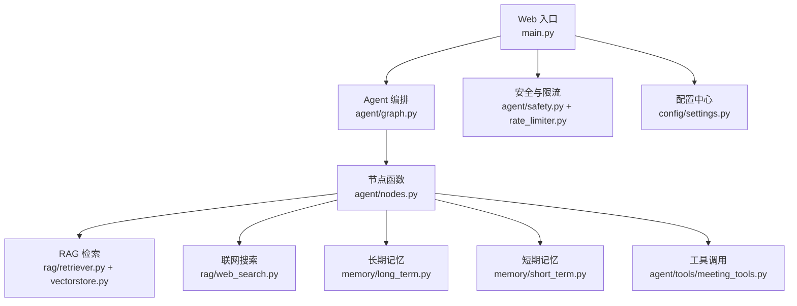
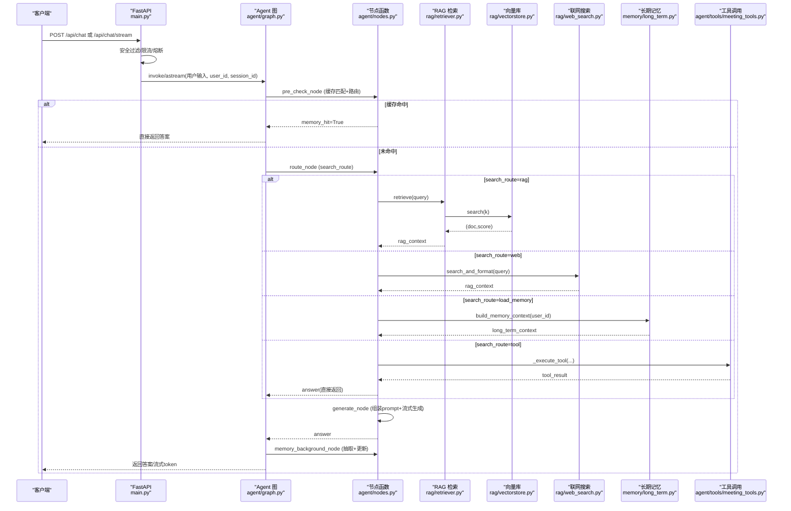
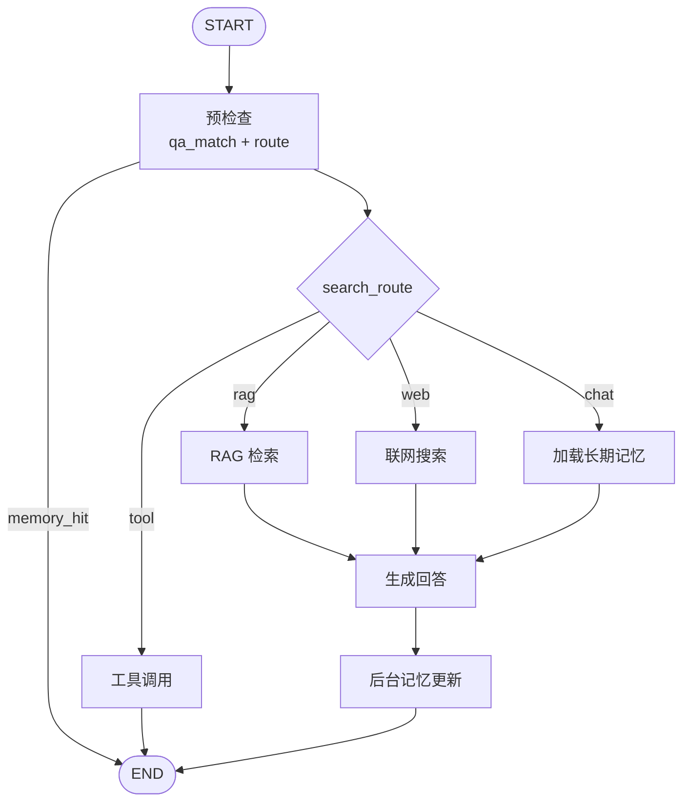
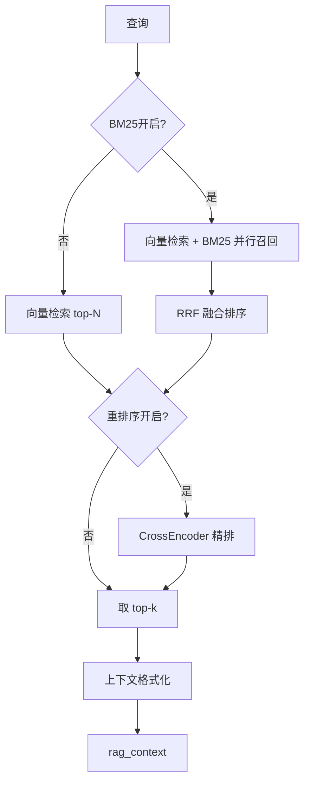
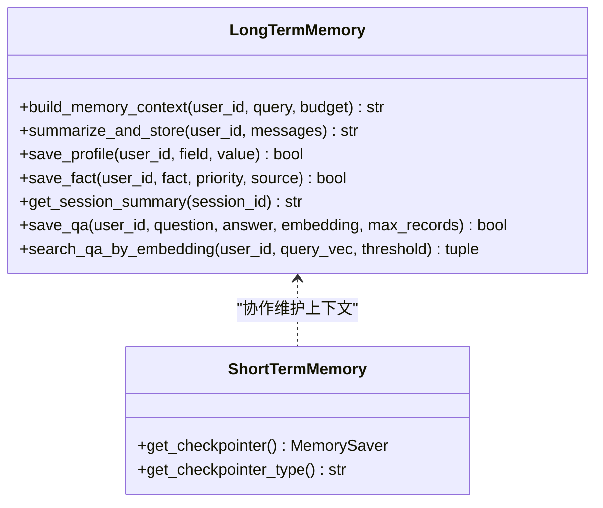
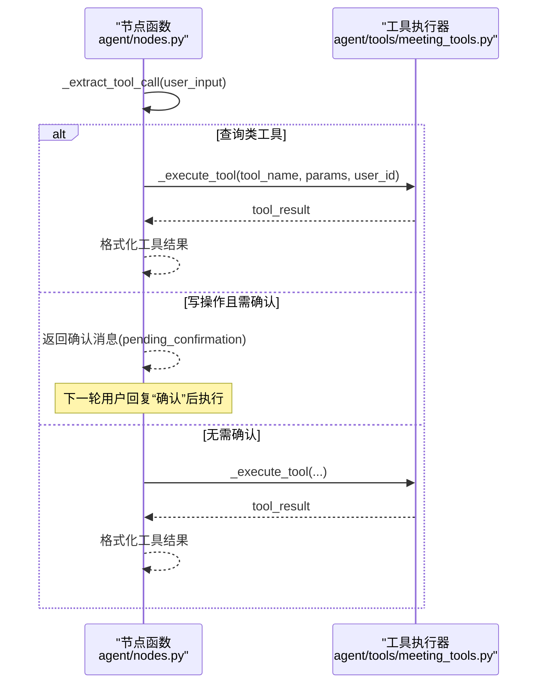
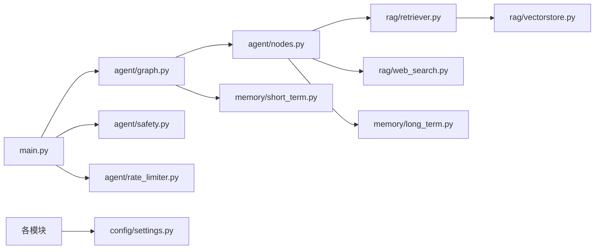

# 技术架构

<cite>
**本文引用的文件**
- [main.py](file://main.py)
- [agent/graph.py](file://agent/graph.py)
- [agent/nodes.py](file://agent/nodes.py)
- [agent/state.py](file://agent/state.py)
- [config/settings.py](file://config/settings.py)
- [rag/retriever.py](file://rag/retriever.py)
- [rag/vectorstore.py](file://rag/vectorstore.py)
- [rag/web_search.py](file://rag/web_search.py)
- [memory/long_term.py](file://memory/long_term.py)
- [memory/short_term.py](file://memory/short_term.py)
- [agent/tools/meeting_tools.py](file://agent/tools/meeting_tools.py)
- [agent/safety.py](file://agent/safety.py)
- [agent/rate_limiter.py](file://agent/rate_limiter.py)
- [requirements.txt](file://requirements.txt)
</cite>

## 目录
1. [简介](#简介)
2. [项目结构](#项目结构)
3. [核心组件](#核心组件)
4. [架构总览](#架构总览)
5. [详细组件分析](#详细组件分析)
6. [依赖关系分析](#依赖关系分析)
7. [性能考量](#性能考量)
8. [故障排查指南](#故障排查指南)
9. [结论](#结论)
10. [附录](#附录)

## 简介
本技术架构文档面向钉钉AI智能体助手，系统性阐述其基于 LangGraph 的状态图工作流设计、四路分流机制（知识库检索、联网搜索、长期记忆、工具调用）的实现原理与交互关系。文档覆盖 Agent 工作流、RAG 检索系统、记忆管理系统、工具调用系统等核心模块的职责划分、数据流与控制流，并给出架构图与数据流图，解释技术选型原因与架构决策权衡。

## 项目结构
整体采用分层模块化组织：
- Web 入口与运行时：FastAPI 服务、启动预热、健康检查、SSE 流式接口
- Agent 编排：LangGraph 状态图与工作流节点（预检查、路由、检索、生成、记忆更新、工具调用）
- RAG 检索：向量库（Milvus Lite）、多路召回（BM25+向量）、重排序、上下文格式化
- 记忆管理：长期记忆（SQLite 分层存储、问答缓存、会话摘要）、短期记忆（进程内 MemorySaver）
- 工具调用：待办/会议等工具封装与参数解析、确认流程
- 配置与安全：集中配置、输入安全过滤、限流与熔断

图表来源
- [main.py:145-314](file://main.py#L145-L314)
- [agent/graph.py:44-102](file://agent/graph.py#L44-L102)
- [agent/nodes.py:93-150](file://agent/nodes.py#L93-L150)
- [rag/retriever.py:18-52](file://rag/retriever.py#L18-L52)
- [rag/vectorstore.py:29-76](file://rag/vectorstore.py#L29-L76)
- [rag/web_search.py:76-94](file://rag/web_search.py#L76-L94)
- [memory/long_term.py:424-497](file://memory/long_term.py#L424-L497)
- [memory/short_term.py:13-20](file://memory/short_term.py#L13-L20)
- [agent/tools/meeting_tools.py:17-47](file://agent/tools/meeting_tools.py#L17-L47)
- [agent/safety.py:35-67](file://agent/safety.py#L35-L67)
- [agent/rate_limiter.py:22-47](file://agent/rate_limiter.py#L22-L47)
- [config/settings.py:19-161](file://config/settings.py#L19-L161)

章节来源
- [main.py:145-314](file://main.py#L145-L314)
- [agent/graph.py:44-102](file://agent/graph.py#L44-L102)
- [config/settings.py:19-161](file://config/settings.py#L19-L161)

## 核心组件
- Agent 工作流（LangGraph StateGraph）：定义 START→pre_check→条件边→retrieve/web_search/load_memory/tool→generate→memory_background→END 的完整路径；支持同步与异步流式输出，统一事件格式（node/token）。
- RAG 检索系统：支持向量检索（Milvus Lite）、可选 BM25 关键词召回、RRF 融合、CrossEncoder 重排序；提供相关度阈值过滤与上下文格式化。
- 记忆管理系统：长期记忆（SQLite）分层结构化存储（用户画像、关键事实、历史摘要、会话压缩摘要、问答缓存），短期记忆（进程内 MemorySaver）维护会话上下文。
- 工具调用系统：LLM 提取工具名与参数，查询类直接执行，写操作支持用户确认；结果格式化返回。
- 安全与稳定性：输入安全过滤（黑名单+注入检测）、滑动窗口限流、熔断器（closed/open/half_open）。

章节来源
- [agent/graph.py:1-102](file://agent/graph.py#L1-L102)
- [rag/retriever.py:18-52](file://rag/retriever.py#L18-L52)
- [memory/long_term.py:424-497](file://memory/long_term.py#L424-L497)
- [agent/nodes.py:647-780](file://agent/nodes.py#L647-L780)
- [agent/safety.py:35-67](file://agent/safety.py#L35-L67)
- [agent/rate_limiter.py:50-147](file://agent/rate_limiter.py#L50-L147)

## 架构总览
下图展示从请求进入 Web 到 Agent 工作流执行、四路分流、记忆更新与结果返回的整体流程。

图表来源
- [main.py:154-314](file://main.py#L154-L314)
- [agent/graph.py:44-102](file://agent/graph.py#L44-L102)
- [agent/nodes.py:93-150](file://agent/nodes.py#L93-L150)
- [rag/retriever.py:18-52](file://rag/retriever.py#L18-L52)
- [rag/vectorstore.py:164-184](file://rag/vectorstore.py#L164-L184)
- [rag/web_search.py:76-94](file://rag/web_search.py#L76-L94)
- [memory/long_term.py:424-497](file://memory/long_term.py#L424-L497)
- [agent/tools/meeting_tools.py:17-47](file://agent/tools/meeting_tools.py#L17-L47)

## 详细组件分析

### Agent 工作流与四路分流
- 状态图构建：注册节点与边，设置条件边实现“缓存命中→end”和“按 search_route 分流”。
- 预检查节点：合并问答缓存匹配与路由判断；若命中则短路至 END，否则进入路由。
- 路由策略：优先工具调用关键词→时效性问题→短输入闲聊→LLM 路由（失败回退关键词）。
- 四路分支：
  - 知识库检索（retrieve）：查询改写→多路召回→重排序→相关度过滤→上下文格式化
  - 联网搜索（web_search）：DuckDuckGo 优先，失败回退百度，统一格式化为上下文
  - 长期记忆（load_memory）：分层加载画像/事实/摘要/会话摘要
  - 工具调用（tool）：LLM 提取工具名与参数，查询类直接执行，写操作需确认
- 生成回答（generate）：组装 system prompt（含长期记忆与 RAG 上下文）、历史消息（窗口+预算+更早对话摘要）、当前输入；主模型失败自动降级备用模型。
- 后台记忆（memory_background）：规则快速抽取+LLM 结构化抽取→保存画像/事实→周期性摘要→问答缓存落库。

图表来源
- [agent/graph.py:44-102](file://agent/graph.py#L44-L102)
- [agent/nodes.py:93-150](file://agent/nodes.py#L93-L150)
- [agent/nodes.py:284-341](file://agent/nodes.py#L284-L341)
- [agent/nodes.py:499-532](file://agent/nodes.py#L499-L532)
- [agent/nodes.py:630-643](file://agent/nodes.py#L630-L643)

章节来源
- [agent/graph.py:1-102](file://agent/graph.py#L1-L102)
- [agent/nodes.py:93-150](file://agent/nodes.py#L93-L150)
- [agent/nodes.py:284-341](file://agent/nodes.py#L284-L341)
- [agent/nodes.py:499-532](file://agent/nodes.py#L499-L532)
- [agent/nodes.py:630-643](file://agent/nodes.py#L630-L643)

### RAG 检索系统
- 检索流程：根据配置选择多路召回（BM25+向量）或仅向量检索；必要时进行 CrossEncoder 重排序；最后格式化上下文供生成使用。
- 向量库：Milvus Lite 本地文件持久化，支持文本与图像混合存储；写入加锁避免并发冲突；检索时按距离阈值过滤低相关结果。
- 多路召回：RRF 融合两路结果，仅依赖排名而非原始分数，提升精确匹配召回率。
- 上下文格式化：统一归一化分数为 0~1 区间，标注来源与标题，便于 LLM 理解与溯源。

图表来源
- [rag/retriever.py:18-52](file://rag/retriever.py#L18-L52)
- [rag/retriever.py:55-110](file://rag/retriever.py#L55-L110)
- [rag/vectorstore.py:164-184](file://rag/vectorstore.py#L164-L184)

章节来源
- [rag/retriever.py:18-52](file://rag/retriever.py#L18-L52)
- [rag/vectorstore.py:29-76](file://rag/vectorstore.py#L29-L76)
- [rag/vectorstore.py:164-184](file://rag/vectorstore.py#L164-L184)

### 记忆管理系统
- 长期记忆（SQLite）：
  - 分层结构化：用户画像（P0 硬保留）、关键事实（priority<=3 硬保留）、历史摘要（P1/P2 按预算填充）、会话压缩摘要（短期超窗后滚动摘要）、问答缓存（相似问题复用）
  - 增量摘要合并：携带旧摘要强制保留关键信息，避免覆盖丢失
  - 规则快速抽取：零 LLM 成本当轮落库高优先级信息（姓名、项目、公司等）
- 短期记忆（MemorySaver）：按 thread_id（session_id）维护会话上下文，支持多轮连贯性。

图表来源
- [memory/long_term.py:424-497](file://memory/long_term.py#L424-L497)
- [memory/long_term.py:613-633](file://memory/long_term.py#L613-L633)
- [memory/long_term.py:729-800](file://memory/long_term.py#L729-L800)
- [memory/short_term.py:13-20](file://memory/short_term.py#L13-L20)

章节来源
- [memory/long_term.py:424-497](file://memory/long_term.py#L424-L497)
- [memory/long_term.py:613-633](file://memory/long_term.py#L613-L633)
- [memory/long_term.py:729-800](file://memory/long_term.py#L729-L800)
- [memory/short_term.py:13-20](file://memory/short_term.py#L13-L20)

### 工具调用系统
- 参数提取：通过路由小模型从用户输入提取工具名与参数（JSON 块解析）。
- 执行策略：查询类（query_todos/query_meetings）直接执行；写操作（create_todo/create_meeting/cancel_meeting/update_meeting）默认需用户确认；确认后执行。
- 结果格式化：将工具返回结构化结果转换为用户可读文本。

图表来源
- [agent/nodes.py:647-780](file://agent/nodes.py#L647-L780)
- [agent/tools/meeting_tools.py:17-47](file://agent/tools/meeting_tools.py#L17-L47)

章节来源
- [agent/nodes.py:647-780](file://agent/nodes.py#L647-L780)
- [agent/tools/meeting_tools.py:17-47](file://agent/tools/meeting_tools.py#L17-L47)

### 安全与稳定性
- 输入安全过滤：关键词黑名单 + prompt 注入检测，默认关闭，可配置开启。
- 限流器：按 user_id 滑动窗口限制每分钟请求数，防止滥用。
- 熔断器：连续失败达阈值进入 open 状态拒绝请求；冷却后进入 half_open 试探成功恢复 closed。

章节来源
- [agent/safety.py:35-67](file://agent/safety.py#L35-L67)
- [agent/rate_limiter.py:22-47](file://agent/rate_limiter.py#L22-L47)
- [agent/rate_limiter.py:50-147](file://agent/rate_limiter.py#L50-L147)

## 依赖关系分析
- 外部依赖：FastAPI、LangChain/LangGraph、OpenAI 兼容接口（千问）、Milvus Lite、HuggingFace Embedding、DDGS/Baidu 搜索、SQLite、Watchdog（可选）等。
- 模块耦合：
  - main.py 依赖 agent/graph.py、agent/safety.py、agent/rate_limiter.py、config/settings.py
  - agent/graph.py 依赖 agent/nodes.py、agent/state.py、memory/short_term.py
  - agent/nodes.py 依赖 rag/retriever.py、rag/web_search.py、memory/long_term.py、agent/tools/*
  - rag/retriever.py 依赖 rag/vectorstore.py、rag/reranker.py（可选）
  - config/settings.py 被各模块按需读取，提供全局配置单例

图表来源
- [main.py:154-314](file://main.py#L154-L314)
- [agent/graph.py:44-102](file://agent/graph.py#L44-L102)
- [agent/nodes.py:93-150](file://agent/nodes.py#L93-L150)
- [rag/retriever.py:18-52](file://rag/retriever.py#L18-L52)
- [rag/vectorstore.py:29-76](file://rag/vectorstore.py#L29-L76)
- [rag/web_search.py:76-94](file://rag/web_search.py#L76-L94)
- [memory/long_term.py:424-497](file://memory/long_term.py#L424-L497)
- [memory/short_term.py:13-20](file://memory/short_term.py#L13-L20)
- [agent/safety.py:35-67](file://agent/safety.py#L35-L67)
- [agent/rate_limiter.py:22-47](file://agent/rate_limiter.py#L22-L47)
- [config/settings.py:19-161](file://config/settings.py#L19-L161)

章节来源
- [requirements.txt:1-53](file://requirements.txt#L1-L53)
- [config/settings.py:19-161](file://config/settings.py#L19-L161)

## 性能考量
- 启动预热：LLM 连接预热（TLS握手+DNS+连接池）、向量库初始化与 BM25 索引预热、文件监听启动，降低首请求延迟。
- 流式输出：SSE 流式接口，逐 token 推送，提升用户体验；整体超时保护防止连接卡死。
- 检索优化：多路召回（BM25+向量）+ RRF 融合 + CrossEncoder 重排序，平衡召回率与准确率；相关度阈值过滤低质上下文。
- 记忆优化：长期记忆分层预算控制字符占用；问答缓存命中直接复用答案，跳过大模型；会话压缩摘要防上下文硬丢失。
- 稳定性：限流与熔断保护后端服务；主模型失败自动降级备用模型。

[本节为通用性能指导，不直接分析具体文件]

## 故障排查指南
- 输入被拦截：检查安全过滤配置（INPUT_FILTER_ENABLED、敏感词列表、注入检测开关）。
- 请求被限流：检查 RATE_LIMIT_PER_MINUTE 配置；确认用户是否频繁触发。
- 服务熔断：查看 CIRCUIT_BREAKER_THRESHOLD 与 CIRCUIT_BREAKER_RECOVERY；记录连续失败原因。
- 检索无结果：确认向量库是否有文档（count_documents）、BM25 是否启用、重排序是否开启；检查 rag_score_filter 阈值。
- 工具调用失败：确认工具开关（TOOL_CALLING_ENABLED）、写操作确认流程、钉钉 API 权限与参数解析。

章节来源
- [agent/safety.py:35-67](file://agent/safety.py#L35-L67)
- [agent/rate_limiter.py:22-47](file://agent/rate_limiter.py#L22-L47)
- [agent/rate_limiter.py:50-147](file://agent/rate_limiter.py#L50-L147)
- [rag/vectorstore.py:193-205](file://rag/vectorstore.py#L193-L205)
- [agent/nodes.py:647-780](file://agent/nodes.py#L647-L780)

## 结论
本系统以 LangGraph 状态图为中枢，结合四路分流机制实现高效、可扩展的智能体工作流。RAG 检索系统通过多路召回与重排序提升知识召回质量；记忆管理系统分层结构化存储，保障关键信息不丢失；工具调用系统提供业务操作能力；安全与稳定性措施确保服务可靠运行。技术选型兼顾性能与可维护性，适合企业级 AI 助手场景。

[本节为总结性内容，不直接分析具体文件]

## 附录
- 配置项说明：详见 config/settings.py，涵盖 LLM、Embedding、向量库、记忆、联网搜索、安全与限流等。
- 依赖清单：详见 requirements.txt，列出核心框架、模型与向量库、文档处理、Web 服务、配置与评估等依赖。

章节来源
- [config/settings.py:19-161](file://config/settings.py#L19-L161)
- [requirements.txt:1-53](file://requirements.txt#L1-L53)