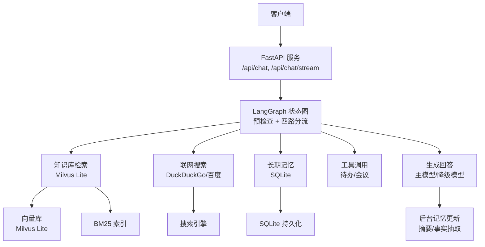
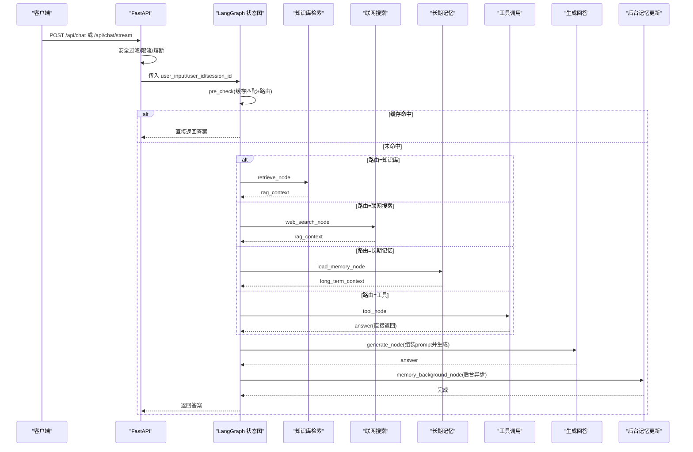
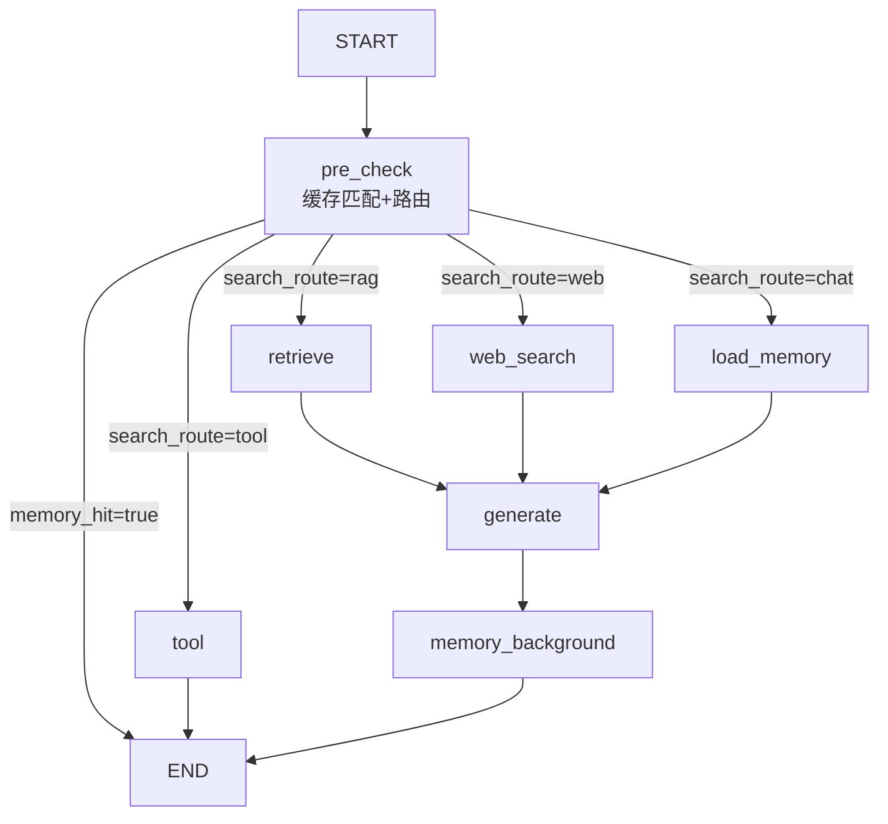
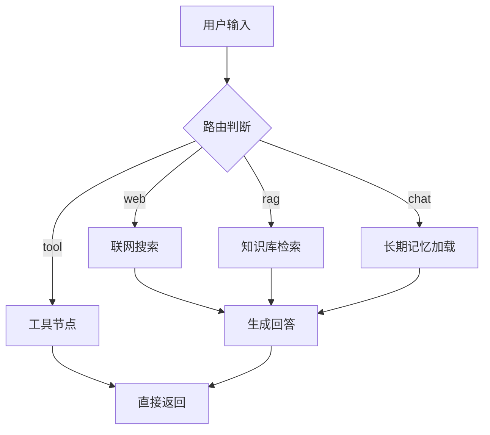
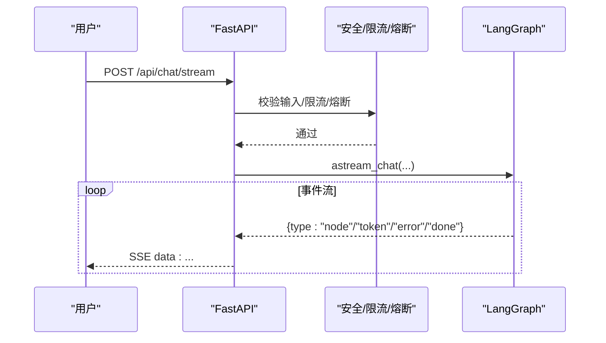
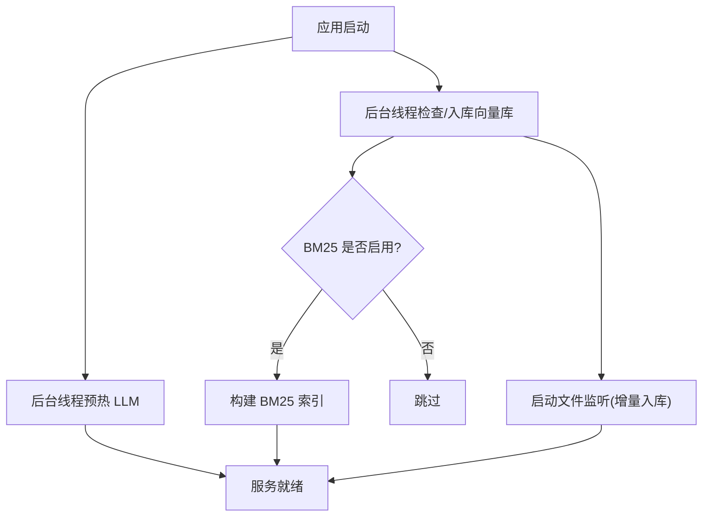
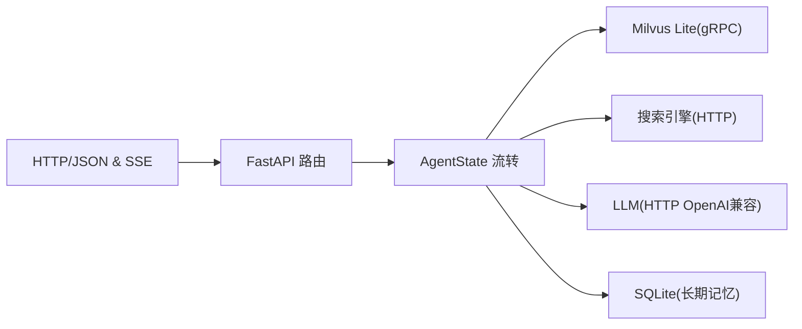
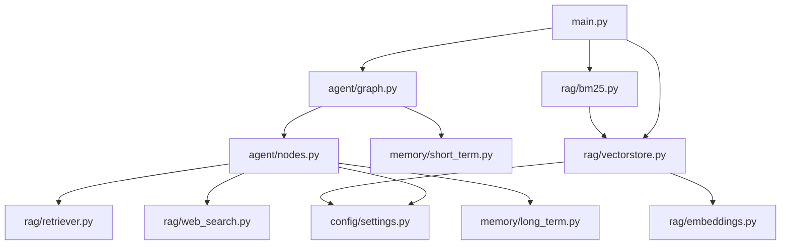

# 系统概览

<cite>
**本文引用的文件**
- [main.py](file://main.py)
- [agent/graph.py](file://agent/graph.py)
- [agent/nodes.py](file://agent/nodes.py)
- [agent/state.py](file://agent/state.py)
- [config/settings.py](file://config/settings.py)
- [rag/vectorstore.py](file://rag/vectorstore.py)
- [rag/bm25.py](file://rag/bm25.py)
- [rag/web_search.py](file://rag/web_search.py)
- [memory/long_term.py](file://memory/long_term.py)
- [memory/short_term.py](file://memory/short_term.py)
</cite>

## 目录
1. [简介](#简介)
2. [项目结构](#项目结构)
3. [核心组件](#核心组件)
4. [架构总览](#架构总览)
5. [详细组件分析](#详细组件分析)
6. [依赖关系分析](#依赖关系分析)
7. [性能考量](#性能考量)
8. [故障排查指南](#故障排查指南)
9. [结论](#结论)

## 简介
本系统为“钉钉AI智能体助手”的本地化服务实现，基于 FastAPI 提供 Web 聊天接口与流式响应；以 LangGraph 的状态图工作流编排智能体行为，采用“四路分流”机制（知识库检索、联网搜索、长期记忆、工具调用）提升回答质量与时效性。系统启动时自动预热 LLM 连接、向量库与 BM25 索引，保障首请求低延迟。

## 项目结构
- Web 入口与启动预热：main.py
- 智能体工作流与节点：agent/graph.py、agent/nodes.py、agent/state.py
- 配置中心：config/settings.py
- 知识检索：rag/vectorstore.py（Milvus Lite）、rag/bm25.py（关键词检索）、rag/web_search.py（联网搜索）
- 记忆系统：memory/long_term.py（长期记忆）、memory/short_term.py（短期会话上下文）

图表来源
- [main.py:45-135](file://main.py#L45-L135)
- [agent/graph.py:44-102](file://agent/graph.py#L44-L102)
- [rag/vectorstore.py:29-76](file://rag/vectorstore.py#L29-L76)
- [rag/bm25.py:22-66](file://rag/bm25.py#L22-L66)
- [rag/web_search.py:76-94](file://rag/web_search.py#L76-L94)
- [memory/long_term.py:30-47](file://memory/long_term.py#L30-L47)

章节来源
- [main.py:45-135](file://main.py#L45-L135)
- [agent/graph.py:44-102](file://agent/graph.py#L44-L102)

## 核心组件
- 状态图工作流：定义 START→pre_check→条件边→retrieve/web_search/load_memory/tool→generate→memory_background→END 的流转逻辑，支持缓存命中短路、工具直出、后台记忆更新。
- 四路分流：通过路由判断将请求分发至知识库检索、联网搜索、长期记忆加载或工具调用，兼顾准确性与时效性。
- Web 服务：提供同步与流式两种聊天接口，内置安全过滤、限流、熔断保护与健康检查。
- 启动预热：后台线程预热 LLM 连接、向量库入库与 BM25 索引构建，并启动文件监听以增量同步知识库。
- 记忆系统：分层长期记忆（画像/事实/摘要）+ 会话压缩摘要 + 问答记忆缓存；短期记忆由 LangGraph checkpointer 维护。

章节来源
- [agent/graph.py:1-24](file://agent/graph.py#L1-L24)
- [agent/nodes.py:92-150](file://agent/nodes.py#L92-L150)
- [main.py:154-314](file://main.py#L154-L314)
- [config/settings.py:19-161](file://config/settings.py#L19-L161)

## 架构总览
下图展示从请求到响应的端到端流程，包括预检查、四路分流、生成与后台记忆更新。

图表来源
- [agent/graph.py:44-102](file://agent/graph.py#L44-L102)
- [agent/nodes.py:92-150](file://agent/nodes.py#L92-L150)
- [agent/nodes.py:284-341](file://agent/nodes.py#L284-L341)
- [agent/nodes.py:499-532](file://agent/nodes.py#L499-L532)
- [agent/nodes.py:630-643](file://agent/nodes.py#L630-L643)

## 详细组件分析

### LangGraph 状态图与工作流
- 节点注册与边：预检查、检索、联网搜索、长期记忆、工具、生成、后台记忆更新。
- 条件边：缓存命中直接结束；否则按 search_route 分流至 retrieve/web_search/load_memory/tool；tool 直接返回 END；其余分支汇入 generate，再进入 memory_background 后结束。
- 单例编译：模块级 _compiled 缓存 CompiledStateGraph，避免重复构建。

图表来源
- [agent/graph.py:44-102](file://agent/graph.py#L44-L102)
- [agent/nodes.py:92-150](file://agent/nodes.py#L92-L150)

章节来源
- [agent/graph.py:44-102](file://agent/graph.py#L44-L102)
- [agent/nodes.py:92-150](file://agent/nodes.py#L92-L150)

### 四路分流机制
- 路由策略：优先工具关键词→时效性问题走联网搜索→短输入闲聊→LLM 路由（失败回退关键词）。
- 分流目标：
  - 知识库检索：查询改写→多路召回+重排序→相关度阈值过滤→格式化上下文。
  - 联网搜索：双引擎（DuckDuckGo 优先，百度备用）→统一格式化为上下文。
  - 长期记忆：分层构建用户画像/关键事实/历史摘要，注入生成 prompt。
  - 工具调用：参数提取→写操作确认→执行→结果格式化。

图表来源
- [agent/nodes.py:153-211](file://agent/nodes.py#L153-L211)
- [agent/nodes.py:284-341](file://agent/nodes.py#L284-L341)
- [agent/nodes.py:344-360](file://agent/nodes.py#L344-L360)
- [agent/nodes.py:646-690](file://agent/nodes.py#L646-L690)

章节来源
- [agent/nodes.py:153-211](file://agent/nodes.py#L153-L211)
- [agent/nodes.py:284-341](file://agent/nodes.py#L284-L341)
- [agent/nodes.py:344-360](file://agent/nodes.py#L344-L360)
- [agent/nodes.py:646-690](file://agent/nodes.py#L646-L690)

### FastAPI Web 服务设计模式
- 请求处理：/api/chat 同步调用 graph.invoke；/api/chat/stream 使用 astream_chat 输出 SSE 事件。
- 中间件机制：在路由层实现安全过滤、限流、熔断；健康检查 /health。
- 流式响应：SSE 事件类型包含 status/token/error/done；整体超时保护防止连接卡死。

图表来源
- [main.py:154-209](file://main.py#L154-L209)
- [main.py:228-314](file://main.py#L228-L314)
- [agent/graph.py:208-255](file://agent/graph.py#L208-L255)

章节来源
- [main.py:154-209](file://main.py#L154-L209)
- [main.py:228-314](file://main.py#L228-L314)

### 启动预热机制
- LLM 连接预热：后台线程调用路由小模型与主模型最小请求，建立 TLS/DNS/连接池，降低首请求延迟。
- 向量库初始化：启动时检查 Milvus Lite 文档数，为空且存在清单则全量重建；否则增量入库；同时启动文件监听以运行时同步。
- BM25 索引预热：若开启 BM25，启动时构建内存索引，避免首请求阻塞。

图表来源
- [main.py:45-135](file://main.py#L45-L135)
- [rag/vectorstore.py:193-205](file://rag/vectorstore.py#L193-L205)
- [rag/bm25.py:22-66](file://rag/bm25.py#L22-L66)

章节来源
- [main.py:45-135](file://main.py#L45-L135)
- [rag/vectorstore.py:193-205](file://rag/vectorstore.py#L193-L205)
- [rag/bm25.py:22-66](file://rag/bm25.py#L22-L66)

### 数据流向与通信协议
- 请求/响应：HTTP JSON 与 SSE text/event-stream。
- 内部通信：LangGraph 状态图通过 AgentState 字段传递上下文（messages、user_input、search_route、rag_context、long_term_context、answer 等）。
- 外部集成：Milvus Lite（gRPC）、搜索引擎（HTTP）、LLM（OpenAI 兼容 HTTP）。

图表来源
- [agent/state.py:12-51](file://agent/state.py#L12-L51)
- [rag/vectorstore.py:29-76](file://rag/vectorstore.py#L29-L76)
- [rag/web_search.py:76-94](file://rag/web_search.py#L76-L94)
- [memory/long_term.py:30-47](file://memory/long_term.py#L30-L47)

章节来源
- [agent/state.py:12-51](file://agent/state.py#L12-L51)
- [rag/vectorstore.py:29-76](file://rag/vectorstore.py#L29-L76)
- [rag/web_search.py:76-94](file://rag/web_search.py#L76-L94)
- [memory/long_term.py:30-47](file://memory/long_term.py#L30-L47)

## 依赖关系分析
- 组件耦合：
  - main.py 依赖 agent/graph.py、agent/safety.py、agent/rate_limiter.py、rag/vectorstore.py、rag/ingest.py、rag/bm25.py、rag/file_watcher.py。
  - agent/graph.py 依赖 agent/nodes.py、agent/state.py、memory/short_term.py。
  - agent/nodes.py 依赖 config/settings.py、rag/retriever.py、rag/web_search.py、memory/long_term.py、agent/tools/*。
  - rag/vectorstore.py 依赖 config/settings.py、rag/embeddings.py。
  - rag/bm25.py 依赖 rag/vectorstore.py。
  - memory/long_term.py 依赖 config/settings.py。
- 潜在循环：无直接循环导入；模块间通过函数调用与延迟 import 解耦。
- 外部依赖：Milvus Lite、rank_bm25、ddgs、baidusearch、langchain_openai、langgraph。

图表来源
- [main.py:45-135](file://main.py#L45-L135)
- [agent/graph.py:44-102](file://agent/graph.py#L44-L102)
- [agent/nodes.py:153-211](file://agent/nodes.py#L153-L211)
- [rag/vectorstore.py:29-76](file://rag/vectorstore.py#L29-L76)
- [rag/bm25.py:22-66](file://rag/bm25.py#L22-L66)

章节来源
- [main.py:45-135](file://main.py#L45-L135)
- [agent/graph.py:44-102](file://agent/graph.py#L44-L102)
- [agent/nodes.py:153-211](file://agent/nodes.py#L153-L211)
- [rag/vectorstore.py:29-76](file://rag/vectorstore.py#L29-L76)
- [rag/bm25.py:22-66](file://rag/bm25.py#L22-L66)

## 性能考量
- 首请求优化：LLM 连接预热、向量库增量/全量入库、BM25 索引预热，显著降低冷启动延迟。
- 检索效率：向量检索设置距离阈值过滤低相关结果；可选 BM25 并行召回与 RRF 融合提升精确匹配；重排序进一步精排。
- 流式响应：SSE 逐 token 输出，配合整体超时保护，避免长连接阻塞。
- 并发与一致性：向量库写入加锁，避免文件监听消费线程与检索路径并发冲突；Milvus Lite gRPC keepalive 调优减少空闲断连。
- 记忆预算：长期记忆分层与字符预算控制，避免上下文过大导致生成成本上升。

[本节为通用性能讨论，不直接分析具体代码行]

## 故障排查指南
- 向量库为空：启动时检测文档数，若为空且存在清单则触发全量重建；若无文档可入库则记录日志。
- BM25 索引为空：当向量库无文本文档或未安装 rank_bm25 时，索引不可用，需安装依赖或确保有文本数据。
- 联网搜索失败：DuckDuckGo 失败自动回退百度；若均失败，返回空上下文，生成节点仍可基于其他信息回答。
- 流式超时：SSE 整体超时保护会停止拉取并返回已生成内容；未生成任何 token 时提示重试。
- 熔断器：连续失败达到阈值后拒绝请求，恢复冷却后进入半开试探；成功/失败计数用于重置熔断。

章节来源
- [main.py:80-135](file://main.py#L80-L135)
- [rag/vectorstore.py:193-205](file://rag/vectorstore.py#L193-L205)
- [rag/bm25.py:22-66](file://rag/bm25.py#L22-L66)
- [rag/web_search.py:76-94](file://rag/web_search.py#L76-L94)
- [main.py:228-314](file://main.py#L228-L314)

## 结论
本系统以 LangGraph 状态图为中枢，结合四路分流机制与多层记忆体系，实现了高可用、低延迟的智能体问答服务。FastAPI 提供简洁的 Web 接口与流式响应，启动预热确保生产环境首请求体验。通过向量检索、BM25 关键词检索与联网搜索的多路召回，以及重排序与相关度过滤，系统在准确性与时效性之间取得良好平衡。建议在生产环境中合理配置限流、熔断与超时参数，并结合文件监听实现知识库的实时同步。