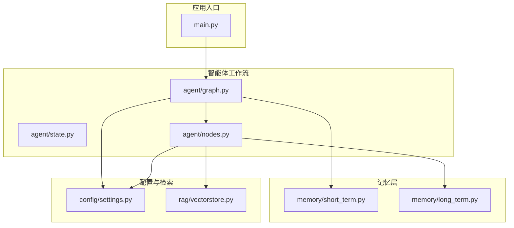
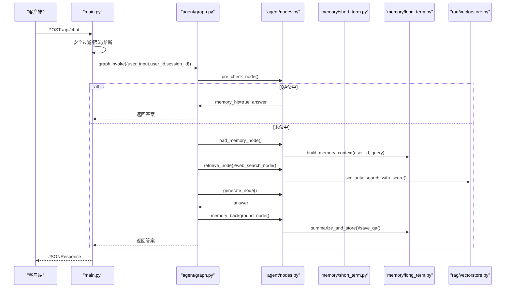
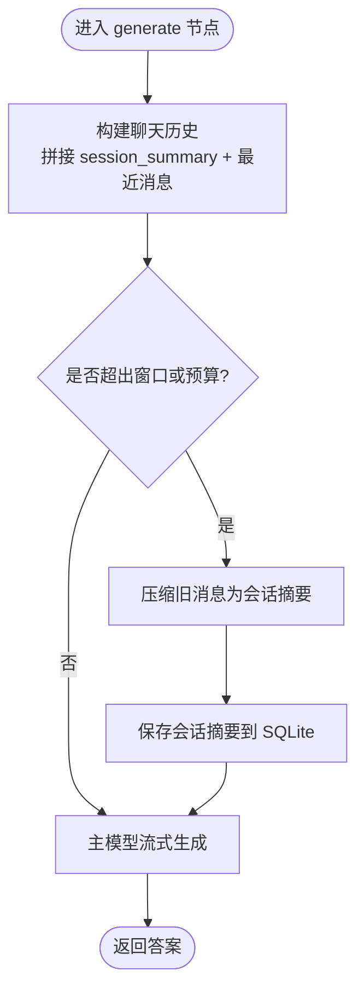
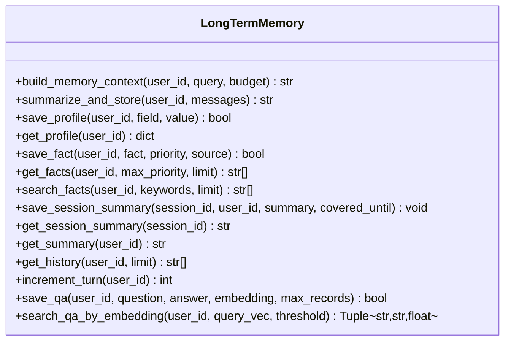
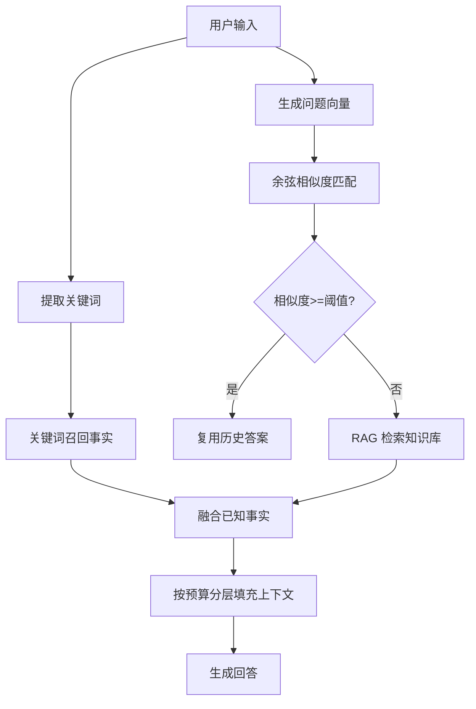
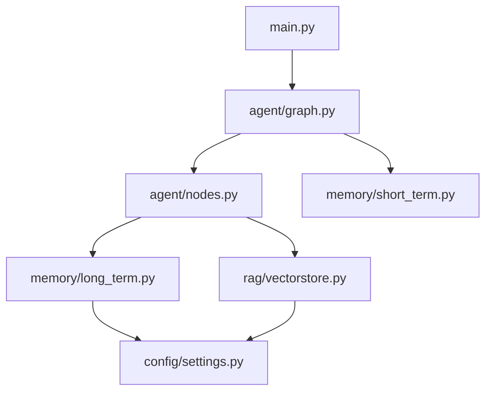

# 记忆管理系统

<cite>
**本文引用的文件**
- [memory/short_term.py](file://memory/short_term.py)
- [memory/long_term.py](file://memory/long_term.py)
- [agent/graph.py](file://agent/graph.py)
- [agent/state.py](file://agent/state.py)
- [agent/nodes.py](file://agent/nodes.py)
- [main.py](file://main.py)
- [config/settings.py](file://config/settings.py)
- [rag/vectorstore.py](file://rag/vectorstore.py)
</cite>

## 目录
1. [简介](#简介)
2. [项目结构](#项目结构)
3. [核心组件](#核心组件)
4. [架构总览](#架构总览)
5. [详细组件分析](#详细组件分析)
6. [依赖关系分析](#依赖关系分析)
7. [性能与优化](#性能与优化)
8. [故障排查指南](#故障排查指南)
9. [结论](#结论)
10. [附录](#附录)

## 简介
本技术文档聚焦于“双重记忆架构”的记忆管理系统：短期会话记忆与长期用户记忆的分工协作。短期记忆基于 LangGraph checkpointer（进程内 MemorySaver）维护多轮对话的上下文连贯性；长期记忆基于 SQLite 持久化，提供用户画像、关键事实、历史摘要、问答缓存等能力，并通过分层预算策略构建注入提示的上下文。系统还实现了会话压缩摘要、增量合并摘要、关键词召回、相似度匹配与记忆融合等机制，保障在有限上下文窗口下不丢失关键信息，同时兼顾性能与可维护性。

## 项目结构
记忆相关代码主要分布在 memory、agent、config 与 rag 模块中：
- memory/short_term.py：短期记忆后端（MemorySaver）单例管理
- memory/long_term.py：长期记忆（SQLite），包含表结构、迁移、摘要、画像、事实、问答缓存、检索与融合
- agent/graph.py：LangGraph 工作流图，编排预检查、检索、联网搜索、长期记忆加载、生成与后台记忆更新
- agent/state.py：AgentState 状态定义，承载消息历史、长期/短期记忆上下文、问答命中标志等
- agent/nodes.py：节点实现，包括加载长期记忆、生成回答、后台记忆更新、会话压缩摘要刷新等
- main.py：Web 入口与健康检查，集成限流、熔断、预热与 SSE 流式输出
- config/settings.py：全局配置，涵盖 LLM、RAG、记忆参数（窗口、预算、阈值等）
- rag/vectorstore.py：向量库封装（Milvus Lite），用于 RAG 检索与 BM25 索引数据源

图表来源
- [main.py:154-209](file://main.py#L154-L209)
- [agent/graph.py:44-102](file://agent/graph.py#L44-L102)
- [agent/state.py:12-50](file://agent/state.py#L12-L50)
- [memory/short_term.py:13-27](file://memory/short_term.py#L13-L27)
- [memory/long_term.py:30-47](file://memory/long_term.py#L30-L47)
- [rag/vectorstore.py:29-76](file://rag/vectorstore.py#L29-L76)

章节来源
- [main.py:154-209](file://main.py#L154-L209)
- [agent/graph.py:44-102](file://agent/graph.py#L44-L102)
- [agent/state.py:12-50](file://agent/state.py#L12-L50)
- [memory/short_term.py:13-27](file://memory/short_term.py#L13-L27)
- [memory/long_term.py:30-47](file://memory/long_term.py#L30-L47)
- [rag/vectorstore.py:29-76](file://rag/vectorstore.py#L29-L76)

## 核心组件
- 短期记忆（会话上下文）
  - 基于 LangGraph checkpointer 的 MemorySaver，按 thread_id（=session_id）维护多轮消息历史，支持进程内无外部依赖的快速读写
  - 通过 AgentState.messages 累加器自动维护消息历史，配合窗口与字符预算控制上下文长度
- 长期记忆（用户画像与知识）
  - SQLite 持久化，分层结构化存储：用户画像（user_profile）、关键事实（user_facts）、历史摘要（summary_history）、会话压缩摘要（session_summary）、问答缓存（qa_memory）
  - 构建记忆上下文时采用 P0/P1/P2 分层预算策略，确保高优先级信息永不截断
- 工作流编排
  - pre_check 并行执行问答缓存匹配与路由判断；命中则直接复用答案
  - 未命中则分流至 retrieve/web_search/load_memory/tool，最终汇聚到 generate，并在后台异步执行 memory_background（抽取+记忆更新）
- 配置中心
  - 集中管理 LLM、RAG、记忆参数（窗口、预算、阈值、QA 缓存开关等），便于调参与扩展

章节来源
- [memory/short_term.py:13-27](file://memory/short_term.py#L13-L27)
- [memory/long_term.py:50-125](file://memory/long_term.py#L50-L125)
- [agent/graph.py:44-102](file://agent/graph.py#L44-L102)
- [agent/state.py:12-50](file://agent/state.py#L12-L50)
- [config/settings.py:114-133](file://config/settings.py#L114-L133)

## 架构总览
下图展示了请求从 Web 入口进入，经安全过滤、限流熔断后调用智能体图，再根据路由选择不同分支，最终生成回答并后台更新记忆的整体流程。

图表来源
- [main.py:154-209](file://main.py#L154-L209)
- [agent/graph.py:44-102](file://agent/graph.py#L44-L102)
- [agent/nodes.py:516-626](file://agent/nodes.py#L516-L626)
- [memory/long_term.py:424-497](file://memory/long_term.py#L424-L497)
- [rag/vectorstore.py:164-184](file://rag/vectorstore.py#L164-L184)

## 详细组件分析

### 短期记忆：会话状态管理与上下文窗口控制
- 实现要点
  - 使用 LangGraph checkpointer 的 MemorySaver，按 session_id 维护每个会话的消息历史，无需外部服务
  - AgentState.messages 使用 add_messages reducer 自动累加历史消息，避免重复与覆盖问题
  - 通过 settings.memory_short_window 与 memory_history_budget 控制最近消息条数与字符上限，超窗从最旧消息开始丢弃
  - 当窗口超出时，将滑出窗口的旧消息压缩为会话摘要（session_summary），以 SystemMessage 形式注入，保证主线对话不丢上下文
- 关键流程
  - 构建聊天历史时拼接 session_summary 与最近消息，形成当前 prompt 的短期上下文
  - 后台 memory_background_node 周期性触发 summarize_and_store，并刷新会话压缩摘要

图表来源
- [agent/nodes.py:516-532](file://agent/nodes.py#L516-L532)
- [agent/nodes.py:602-626](file://agent/nodes.py#L602-L626)
- [memory/long_term.py:342-379](file://memory/long_term.py#L342-L379)

章节来源
- [memory/short_term.py:13-27](file://memory/short_term.py#L13-L27)
- [agent/state.py:12-50](file://agent/state.py#L12-L50)
- [agent/nodes.py:516-532](file://agent/nodes.py#L516-L532)
- [agent/nodes.py:602-626](file://agent/nodes.py#L602-L626)
- [memory/long_term.py:342-379](file://memory/long_term.py#L342-L379)

### 长期记忆：用户画像、关键事实、历史摘要与问答缓存
- 数据结构与职责
  - user_profile：用户画像字段（姓名、称呼、角色、项目、公司等），单值可更新，最高优先级
  - user_facts：关键事实，带优先级（1-10），用于补充领域知识与偏好
  - summary_history：历史摘要记录，按时间倒序读取，限制保留最近若干条
  - session_summary：会话压缩摘要，记录已覆盖的消息条数，用于滑动窗口外信息的滚动摘要
  - qa_memory：问答记忆缓存，存储问题向量与答案，支持余弦相似度匹配，命中直接复用
- 加载策略与预算
  - build_memory_context 按 P0/P1/P2 分层构建上下文：
    - P0：用户画像与关键事实（priority<=3）硬保留，永不截断
    - P1：最近 2 条摘要 + 关键词召回事实，按预算逐条填充，超额丢弃旧条
    - P2：更早摘要，剩余预算填充，超额丢弃
  - 预算来自 settings.memory_context_budget，可按需调整
- 增量合并与规则快速抽取
  - summarize_and_store 使用 LLM 对消息进行增量合并，提取关键事实并单独落库，防止被摘要覆盖
  - extract_key_info 通过正则规则快速抽取高优先级信息（如姓名、项目、公司），零 LLM 成本当轮落库
- 问答缓存
  - save_qa 保存问答对与可选 embedding；search_qa_by_embedding 计算余弦相似度，超过阈值直接复用历史答案
  - 命中时自动累加 hit_count 并更新时间，提升热门问题的响应速度

图表来源
- [memory/long_term.py:50-125](file://memory/long_term.py#L50-L125)
- [memory/long_term.py:224-313](file://memory/long_term.py#L224-L313)
- [memory/long_term.py:342-402](file://memory/long_term.py#L342-L402)
- [memory/long_term.py:424-497](file://memory/long_term.py#L424-L497)
- [memory/long_term.py:613-633](file://memory/long_term.py#L613-L633)
- [memory/long_term.py:650-697](file://memory/long_term.py#L650-L697)
- [memory/long_term.py:729-800](file://memory/long_term.py#L729-L800)

章节来源
- [memory/long_term.py:50-125](file://memory/long_term.py#L50-L125)
- [memory/long_term.py:224-313](file://memory/long_term.py#L224-L313)
- [memory/long_term.py:342-402](file://memory/long_term.py#L342-L402)
- [memory/long_term.py:424-497](file://memory/long_term.py#L424-L497)
- [memory/long_term.py:613-633](file://memory/long_term.py#L613-L633)
- [memory/long_term.py:650-697](file://memory/long_term.py#L650-L697)
- [memory/long_term.py:729-800](file://memory/long_term.py#L729-L800)

### 记忆检索算法、相似度匹配与记忆融合
- 相似度匹配
  - 问答缓存使用余弦相似度计算问题向量与历史问题向量的相似性，超过阈值（settings.memory_qa_threshold）即命中
  - 向量序列化/反序列化为 BLOB，减少存储开销
- 关键词召回
  - 从用户输入切分候选关键词，检索 user_facts 中包含任一关键词的事实，按优先级排序
- 记忆融合策略
  - 分层预算：P0 硬保留，P1 按预算填充，P2 剩余预算填充
  - 会话压缩摘要与历史摘要结合，确保主线对话不丢上下文的同时，尽可能引入更多历史信息
  - RAG 检索结果与长期记忆上下文共同注入生成节点，提升回答准确性

图表来源
- [memory/long_term.py:410-413](file://memory/long_term.py#L410-L413)
- [memory/long_term.py:316-337](file://memory/long_term.py#L316-L337)
- [memory/long_term.py:717-726](file://memory/long_term.py#L717-L726)
- [memory/long_term.py:784-800](file://memory/long_term.py#L784-L800)
- [rag/vectorstore.py:164-184](file://rag/vectorstore.py#L164-L184)

章节来源
- [memory/long_term.py:410-413](file://memory/long_term.py#L410-L413)
- [memory/long_term.py:316-337](file://memory/long_term.py#L316-L337)
- [memory/long_term.py:717-726](file://memory/long_term.py#L717-L726)
- [memory/long_term.py:784-800](file://memory/long_term.py#L784-L800)
- [rag/vectorstore.py:164-184](file://rag/vectorstore.py#L164-L184)

### 持久化策略、更新机制与清理策略
- 持久化
  - 长期记忆使用 SQLite，开启 WAL 模式支持并发读，写操作串行化（线程锁）
  - 会话压缩摘要与问答缓存均持久化，支持跨会话与重启恢复
- 更新机制
  - 每 N 轮（settings.memory_summary_every）触发 summarize_and_store，增量合并摘要并提取关键事实
  - 规则快速抽取当轮落库，保证高优先级信息即时生效
- 清理策略
  - 摘要历史仅保留最近若干条（例如 20 条），避免无限增长
  - 问答缓存按更新时间淘汰最旧记录，保持每用户最多 N 条（settings.memory_qa_max_records）
  - 会话压缩摘要按 covered_until 跟踪已覆盖消息条数，避免重复压缩

章节来源
- [memory/long_term.py:50-125](file://memory/long_term.py#L50-L125)
- [memory/long_term.py:172-196](file://memory/long_term.py#L172-L196)
- [memory/long_term.py:729-781](file://memory/long_term.py#L729-L781)
- [agent/nodes.py:535-600](file://agent/nodes.py#L535-L600)

### 生命周期管理与性能优化方案
- 生命周期
  - 短期记忆：随会话创建而初始化，随会话结束而释放（进程内 MemorySaver）
  - 长期记忆：服务启动时初始化连接与表结构，运行中按需写入与查询
- 性能优化
  - 问答缓存命中直接返回，跳过全部链路，显著降低延迟
  - 后台异步 memory_background_node 执行抽取与记忆更新，不阻塞响应
  - 启动时预热 LLM 连接与向量库，降低首请求延迟
  - 使用 WAL 模式与线程锁，平衡并发读与串行写

章节来源
- [main.py:45-135](file://main.py#L45-L135)
- [memory/long_term.py:30-47](file://memory/long_term.py#L30-L47)
- [agent/graph.py:109-114](file://agent/graph.py#L109-L114)
- [rag/vectorstore.py:29-76](file://rag/vectorstore.py#L29-L76)

## 依赖关系分析
- 组件耦合
  - main.py 依赖 agent/graph.py 与工作流节点，间接依赖 memory 与 rag
  - agent/graph.py 编排节点，依赖 agent/state.py 的状态结构与 memory/short_term.py 的 checkpointer
  - agent/nodes.py 依赖 memory/long_term.py 进行长期记忆加载与更新，依赖 rag/vectorstore.py 进行 RAG 检索
  - memory/long_term.py 依赖 config/settings.py 获取配置与数据库路径
- 外部依赖
  - LangGraph checkpointer（MemorySaver）
  - SQLite 数据库（WAL 模式）
  - Milvus Lite 向量库（本地文件持久化）
  - OpenAI 兼容 LLM（用于摘要生成与降级）

图表来源
- [main.py:154-209](file://main.py#L154-L209)
- [agent/graph.py:44-102](file://agent/graph.py#L44-L102)
- [agent/nodes.py:516-626](file://agent/nodes.py#L516-L626)
- [memory/long_term.py:30-47](file://memory/long_term.py#L30-L47)
- [rag/vectorstore.py:29-76](file://rag/vectorstore.py#L29-L76)

章节来源
- [main.py:154-209](file://main.py#L154-L209)
- [agent/graph.py:44-102](file://agent/graph.py#L44-L102)
- [agent/nodes.py:516-626](file://agent/nodes.py#L516-L626)
- [memory/long_term.py:30-47](file://memory/long_term.py#L30-L47)
- [rag/vectorstore.py:29-76](file://rag/vectorstore.py#L29-L76)

## 性能与优化
- 首请求延迟优化
  - 启动时预热 LLM 连接与向量库，建立 TLS 握手与连接池
- 响应延迟优化
  - 问答缓存命中直接返回，避免 LLM 调用
  - 后台异步执行记忆更新，不阻塞主流程
- 上下文窗口优化
  - 短期记忆窗口与字符预算双控，超窗压缩为会话摘要
  - 长期记忆分层预算，确保高优先级信息不丢失
- 存储与并发优化
  - SQLite WAL 模式支持并发读，写操作串行化
  - Milvus Lite 本地文件持久化，减少网络开销

[本节为通用性能讨论，不直接分析具体文件]

## 故障排查指南
- 常见问题
  - LLM 不可用：summarize_and_store 会回退到简单截断，记录日志并继续
  - 向量库为空：启动时检测并自动重建索引，或增量同步
  - 问答缓存未命中：检查相似度阈值与向量维度一致性
- 诊断建议
  - 查看健康检查端点，确认 checkpointer 类型与服务状态
  - 检查 memory 模块日志，确认摘要生成与问答缓存写入情况
  - 调整 settings 中的 memory_qa_threshold、memory_summary_every 等参数

章节来源
- [memory/long_term.py:561-610](file://memory/long_term.py#L561-L610)
- [main.py:317-326](file://main.py#L317-L326)
- [config/settings.py:114-133](file://config/settings.py#L114-L133)

## 结论
该记忆管理系统通过短期会话记忆与长期用户记忆的协同设计，实现了多轮对话的上下文连贯性与个性化服务的持久化。分层预算策略、增量合并摘要、关键词召回与相似度匹配等机制，有效提升了记忆利用效率与回答质量。结合后台异步更新与启动预热，系统在性能与稳定性方面具备良好表现。未来可进一步探索更精细的预算分配策略与更高效的相似度检索算法。

[本节为总结性内容，不直接分析具体文件]

## 附录
- 配置项参考
  - 记忆相关：memory_summary_every、memory_context_budget、memory_short_window、memory_history_budget、memory_qa_cache_enabled、memory_qa_threshold、memory_qa_max_records
  - RAG 相关：rag_top_k、rag_score_filter、rag_min_relevance、rag_bm25_enabled、rerank_enabled
  - 其他：llm_model、llm_base_url、llm_api_key、stream_timeout

章节来源
- [config/settings.py:114-133](file://config/settings.py#L114-L133)
- [config/settings.py:50-100](file://config/settings.py#L50-L100)
- [config/settings.py:109-113](file://config/settings.py#L109-L113)