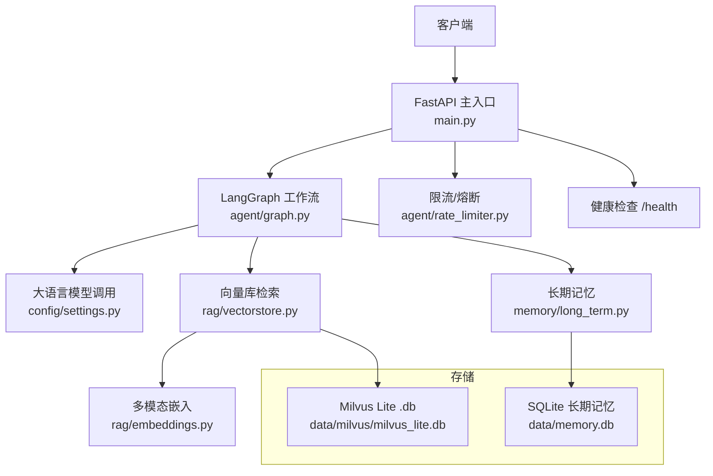
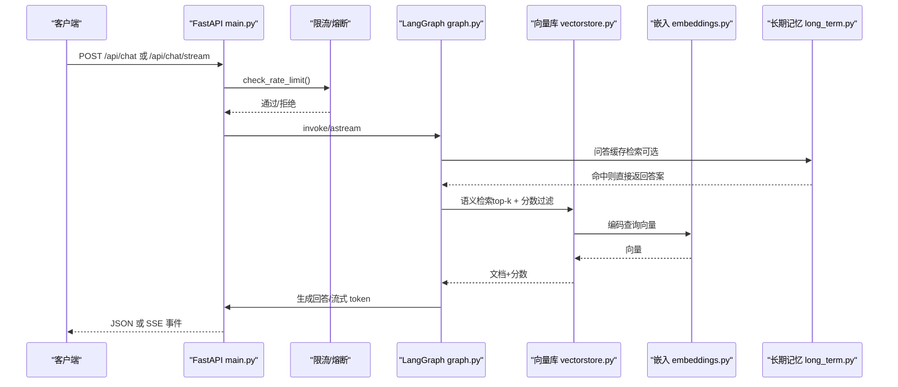
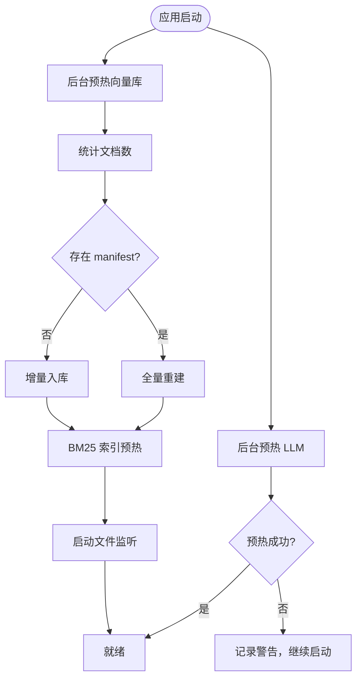
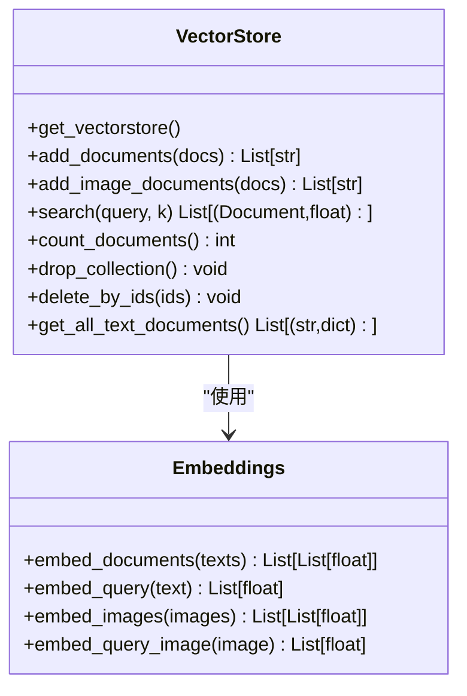
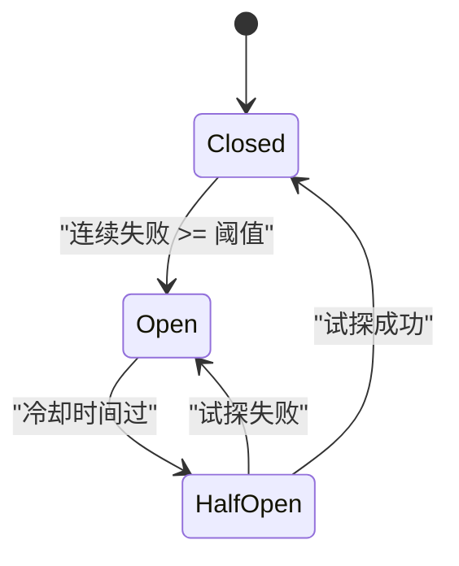
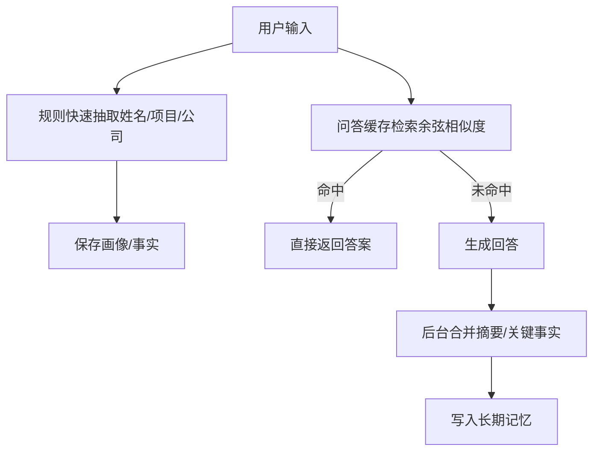
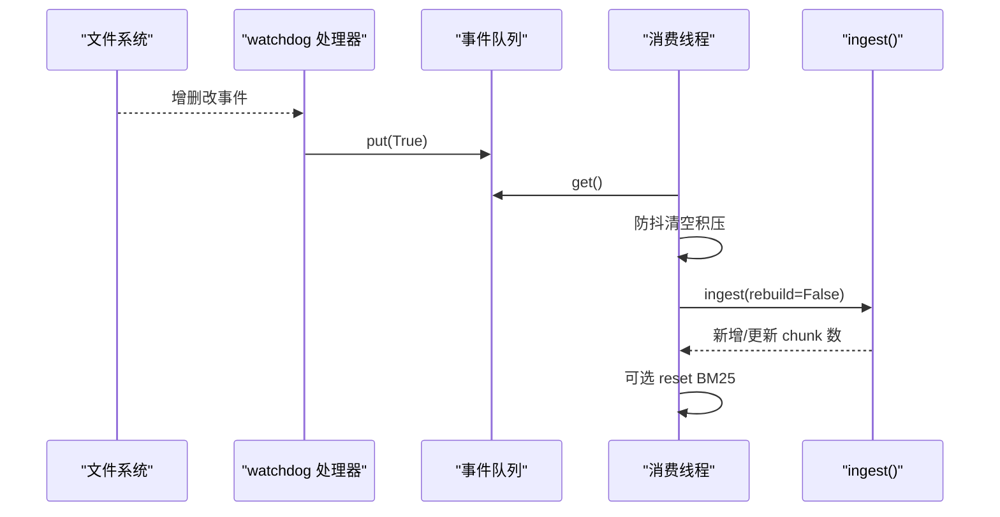
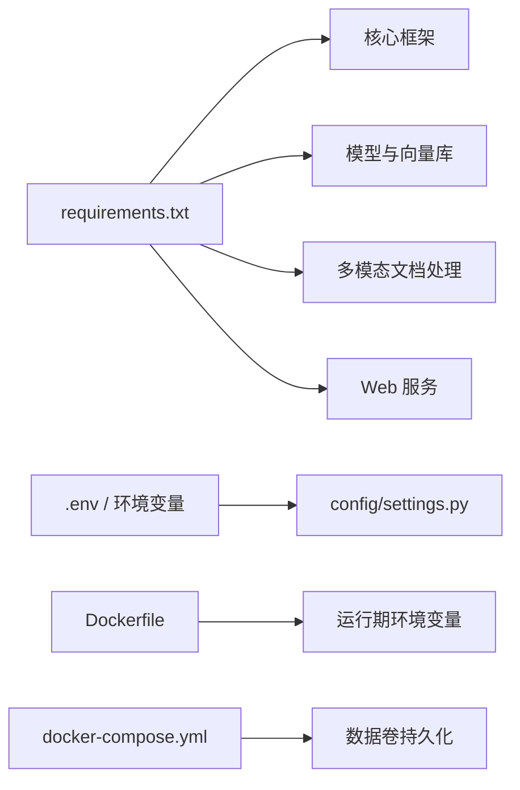

# 故障排除

<cite>
**本文引用的文件**
- [main.py](file://main.py)
- [config/settings.py](file://config/settings.py)
- [rag/vectorstore.py](file://rag/vectorstore.py)
- [rag/embeddings.py](file://rag/embeddings.py)
- [agent/graph.py](file://agent/graph.py)
- [agent/rate_limiter.py](file://agent/rate_limiter.py)
- [memory/long_term.py](file://memory/long_term.py)
- [rag/file_watcher.py](file://rag/file_watcher.py)
- [Dockerfile](file://Dockerfile)
- [docker-compose.yml](file://docker-compose.yml)
- [requirements.txt](file://requirements.txt)
</cite>

## 目录
1. [简介](#简介)
2. [项目结构](#项目结构)
3. [核心组件](#核心组件)
4. [架构总览](#架构总览)
5. [详细组件分析](#详细组件分析)
6. [依赖关系分析](#依赖关系分析)
7. [性能注意事项](#性能注意事项)
8. [故障排除指南](#故障排除指南)
9. [结论](#结论)
10. [附录](#附录)

## 简介
本指南面向生产与开发环境中的常见问题，覆盖启动失败、模型加载错误、向量库连接问题、性能瓶颈、内存泄漏等场景的诊断方法与修复步骤。同时提供日志分析方法、性能监控工具与调试技巧，并给出预防性措施与最佳实践，帮助快速定位和解决问题。

## 项目结构
本项目基于 FastAPI 提供 Web 聊天接口（同步与流式 SSE），通过 LangGraph 编排智能体工作流，结合 Milvus Lite 本地向量库、多模态 Embedding、长期记忆 SQLite、限流熔断、文件监听自动入库等能力。关键入口与配置如下：
- 服务入口与预热：main.py
- 全局配置：config/settings.py
- 向量库封装：rag/vectorstore.py
- 多模态嵌入：rag/embeddings.py
- 智能体图与工作流：agent/graph.py
- 限流与熔断：agent/rate_limiter.py
- 长期记忆：memory/long_term.py
- 知识库文件监听：rag/file_watcher.py
- 容器化与镜像构建：Dockerfile、docker-compose.yml
- 依赖清单：requirements.txt

**图表来源**
- [main.py:45-135](file://main.py#L45-L135)
- [config/settings.py:19-165](file://config/settings.py#L19-L165)
- [rag/vectorstore.py:29-76](file://rag/vectorstore.py#L29-L76)
- [rag/embeddings.py:29-66](file://rag/embeddings.py#L29-L66)
- [agent/graph.py:44-102](file://agent/graph.py#L44-L102)
- [agent/rate_limiter.py:51-147](file://agent/rate_limiter.py#L51-L147)
- [memory/long_term.py:30-47](file://memory/long_term.py#L30-L47)

**章节来源**
- [main.py:45-135](file://main.py#L45-L135)
- [config/settings.py:19-165](file://config/settings.py#L19-L165)

## 核心组件
- 启动预热：在应用启动时后台线程预热 LLM 连接与向量库索引，降低首请求延迟；若失败仅记录警告，不影响服务可用性。
- 安全与限流：输入安全过滤、滑动窗口限流、熔断器保护后端不稳定。
- 工作流：预检查、四路分流（检索/联网搜索/长期记忆/工具）、生成回答、后台记忆更新。
- 向量库：Milvus Lite 本地持久化，支持文本与图像混合检索，写入加锁与 flush 保障一致性。
- 嵌入模型：Jina CLIP v2（多模态）或 BGE（纯文本），延迟加载与设备选择。
- 长期记忆：SQLite WAL 模式并发读，分层预算控制，问答缓存命中直接返回。
- 文件监听：watchdog 事件触发增量入库，防抖避免频繁重建。

**章节来源**
- [main.py:45-135](file://main.py#L45-L135)
- [agent/rate_limiter.py:22-147](file://agent/rate_limiter.py#L22-L147)
- [agent/graph.py:44-102](file://agent/graph.py#L44-L102)
- [rag/vectorstore.py:79-106](file://rag/vectorstore.py#L79-L106)
- [rag/embeddings.py:164-180](file://rag/embeddings.py#L164-L180)
- [memory/long_term.py:30-47](file://memory/long_term.py#L30-L47)
- [rag/file_watcher.py:71-105](file://rag/file_watcher.py#L71-L105)

## 架构总览
下图展示从请求到响应的主要路径与关键异常点，便于定位问题。

**图表来源**
- [main.py:154-209](file://main.py#L154-L209)
- [agent/graph.py:117-138](file://agent/graph.py#L117-L138)
- [rag/vectorstore.py:164-184](file://rag/vectorstore.py#L164-L184)
- [rag/embeddings.py:67-94](file://rag/embeddings.py#L67-L94)
- [memory/long_term.py:784-820](file://memory/long_term.py#L784-L820)

## 详细组件分析

### 启动与预热
- LLM 预热：后台线程按实际 temperature 创建实例并发起最小请求，建立 TLS/DNS/连接池；失败仅告警。
- 向量库预热：启动时检查 collection 是否为空，若为空且存在 manifest 则全量重建；否则增量扫描；BM25 索引预热；文件监听启动。

**图表来源**
- [main.py:45-135](file://main.py#L45-L135)

**章节来源**
- [main.py:45-135](file://main.py#L45-L135)

### 向量库与嵌入
- 单例与写锁：模块级 _vs 单例，写入操作使用线程锁避免并发冲突；flush 确保落盘可查。
- 多模态：支持文本与图像混合，图像通过 embed_images 编码后直接插入。
- 检索过滤：按 rag_score_filter 过滤低相关度结果，保证上下文质量。

**图表来源**
- [rag/vectorstore.py:29-106](file://rag/vectorstore.py#L29-L106)
- [rag/embeddings.py:29-128](file://rag/embeddings.py#L29-L128)

**章节来源**
- [rag/vectorstore.py:29-106](file://rag/vectorstore.py#L29-L106)
- [rag/embeddings.py:29-128](file://rag/embeddings.py#L29-L128)

### 限流与熔断
- 限流：按 user_id 的滑动窗口每分钟请求上限，默认关闭。
- 熔断：连续失败达阈值进入 open，冷却后 half_open 试探一次，成功恢复 closed。

**图表来源**
- [agent/rate_limiter.py:51-147](file://agent/rate_limiter.py#L51-L147)

**章节来源**
- [agent/rate_limiter.py:22-147](file://agent/rate_limiter.py#L22-L147)

### 长期记忆
- SQLite WAL 模式：允许并发读，写串行化；表结构包含画像、事实、摘要历史、会话摘要、问答记忆等。
- 分层预算：P0 硬保留（画像与高优先级事实），P1/P2 按预算填充，防止上下文过长。
- 问答缓存：相似问题直接复用历史答案，减少 LLM 调用。

**图表来源**
- [memory/long_term.py:172-197](file://memory/long_term.py#L172-L197)
- [memory/long_term.py:424-497](file://memory/long_term.py#L424-L497)
- [memory/long_term.py:729-820](file://memory/long_term.py#L729-L820)

**章节来源**
- [memory/long_term.py:30-47](file://memory/long_term.py#L30-L47)
- [memory/long_term.py:424-497](file://memory/long_term.py#L424-L497)
- [memory/long_term.py:729-820](file://memory/long_term.py#L729-L820)

### 文件监听与自动入库
- watchdog 事件回调投递信号到进程内队列，消费线程防抖后执行增量入库，必要时重置 BM25 索引。
- 幂等保护：重复调用不会重复启动监听器。

**图表来源**
- [rag/file_watcher.py:34-105](file://rag/file_watcher.py#L34-L105)

**章节来源**
- [rag/file_watcher.py:71-105](file://rag/file_watcher.py#L71-L105)

## 依赖关系分析
- 运行时依赖：FastAPI、uvicorn、langchain/langgraph、pymilvus、milvus-lite、sentence-transformers、transformers、torch、easyocr 等。
- 环境变量与配置：HF_ENDPOINT、HF_HUB_OFFLINE、EMBEDDING_DEVICE、OCR_USE_GPU、stream_timeout、rate_limit_per_minute、circuit_breaker_threshold 等。
- 容器化：构建期预下载模型，运行期强制 CPU + 离线模式，单 worker 避免短期记忆竞争。

**图表来源**
- [requirements.txt:1-53](file://requirements.txt#L1-L53)
- [config/settings.py:19-165](file://config/settings.py#L19-L165)
- [Dockerfile:35-50](file://Dockerfile#L35-L50)
- [docker-compose.yml:10-25](file://docker-compose.yml#L10-L25)

**章节来源**
- [requirements.txt:1-53](file://requirements.txt#L1-L53)
- [config/settings.py:19-165](file://config/settings.py#L19-L165)
- [Dockerfile:35-50](file://Dockerfile#L35-L50)
- [docker-compose.yml:10-25](file://docker-compose.yml#L10-L25)

## 性能注意事项
- 首请求延迟：启用启动预热，避免首次 TLS/DNS/连接池开销。
- 流式超时：SSE 整体超时保护，超时返回已生成 token，避免连接卡死。
- 向量检索：合理设置 top_k、score_filter、min_relevance，避免低质上下文。
- 嵌入设备：CPU/GPU 选择影响吞吐与延迟；构建期预下载模型减少冷启动耗时。
- 文件监听：防抖时间避免频繁重建；BM25 开启时需重置索引。
- 限流熔断：在高负载或后端抖动时保护系统稳定性。

[本节为通用指导，不直接分析具体文件]

## 故障排除指南

### 一、启动失败
常见症状
- 服务无法启动或端口占用
- 模型下载失败或离线模式报错
- 向量库初始化失败

诊断步骤
- 检查环境变量 HF_ENDPOINT、HF_HUB_OFFLINE、EMBEDDING_DEVICE、OCR_USE_GPU 是否正确。
- 确认 requirements 安装完整，特别是 torch、transformers、pymilvus、milvus-lite。
- 查看启动日志中 warmup 阶段的警告与错误。
- 验证 data 目录权限与磁盘空间。

修复建议
- 若网络受限，保持 HF_HUB_OFFLINE=1 并确保构建期已预下载模型。
- 调整 PIP_INDEX_URL/RETRIES/TIMEOUT 以解决 pip 安装超时。
- 若向量库初始化失败，检查 milvus_db_file 路径与集合名称，必要时 drop_collection 重建。

**章节来源**
- [Dockerfile:25-45](file://Dockerfile#L25-L45)
- [main.py:45-135](file://main.py#L45-L135)
- [rag/vectorstore.py:29-76](file://rag/vectorstore.py#L29-L76)

### 二、模型加载错误
常见症状
- 导入 AutoProcessor/AutoModel 失败
- 模型下载缓慢或失败
- 设备切换导致 OOM 或性能下降

诊断步骤
- 确认 HF_ENDPOINT 指向可用镜像。
- 检查 embedding_device 与实际硬件匹配（CPU/GPU）。
- 查看 embeddings.py 中延迟加载日志，确认模型是否成功加载。

修复建议
- 使用构建期预下载模型，运行期强制离线模式。
- 对 CPU 部署，优先选择 BGE 纯文本嵌入以获得更高吞吐。
- 若显存不足，降低 batch size 或切换到 CPU。

**章节来源**
- [rag/embeddings.py:29-66](file://rag/embeddings.py#L29-L66)
- [Dockerfile:35-45](file://Dockerfile#L35-L45)

### 三、向量库连接问题
常见症状
- 连接非法 URI 或 gRPC 断连
- 写入后无法查询
- 并发写入冲突

诊断步骤
- 检查 milvus_db_file 与 milvus_collection 配置。
- 观察向量库初始化日志，确认 gRPC keepalive 参数。
- 确认写入路径使用了写锁与 flush。

修复建议
- 使用 MILVUS_DB_FILE 而非 MILVUS_URI，避免解析为服务地址。
- 调整 gRPC keepalive 参数以避免 too_many_pings GOAWAY。
- 删除损坏集合后重建索引。

**章节来源**
- [config/settings.py:54-66](file://config/settings.py#L54-L66)
- [rag/vectorstore.py:29-76](file://rag/vectorstore.py#L29-L76)
- [rag/vectorstore.py:79-106](file://rag/vectorstore.py#L79-L106)

### 四、性能瓶颈
常见症状
- 首请求慢、流式卡顿
- 检索结果过多或过低
- 长对话上下文溢出

诊断步骤
- 启用启动预热，观察首请求延迟改善情况。
- 调整 rag_top_k、rag_score_filter、rag_min_relevance。
- 检查 memory_context_budget、memory_short_window、memory_history_budget。
- 评估是否开启 BM25 多路召回与 RRF 融合。

修复建议
- 合理设置检索阈值与候选数，避免低质上下文。
- 使用问答缓存命中减少 LLM 调用。
- 对纯文本场景优先选择 BGE 嵌入以提升速度。

**章节来源**
- [main.py:45-77](file://main.py#L45-L77)
- [config/settings.py:64-100](file://config/settings.py#L64-L100)
- [memory/long_term.py:424-497](file://memory/long_term.py#L424-L497)

### 五、内存泄漏
常见症状
- 进程内存持续增长
- 长时间运行后响应变慢
- 文件监听或向量库写入堆积

诊断步骤
- 检查是否有未释放的连接或句柄（如 watchdog Observer 未停止）。
- 观察向量库写入锁与 flush 是否正常。
- 监控长期记忆表大小与问答缓存条数。

修复建议
- 服务关闭时调用 stop_file_watcher 停止监听。
- 限制 memory_qa_max_records，避免问答缓存无限增长。
- 定期重建或清理向量库集合，避免碎片累积。

**章节来源**
- [rag/file_watcher.py:143-151](file://rag/file_watcher.py#L143-L151)
- [rag/vectorstore.py:208-223](file://rag/vectorstore.py#L208-L223)
- [config/settings.py:128-133](file://config/settings.py#L128-L133)

### 六、限流与熔断误判
常见症状
- 正常请求被限流或熔断
- 熔断状态无法恢复

诊断步骤
- 检查 rate_limit_per_minute 与 circuit_breaker_threshold 配置。
- 查看健康检查端点获取熔断状态。
- 分析日志中 record_failure/record_success 调用时机。

修复建议
- 根据业务 QPS 调整限流阈值。
- 适当提高熔断恢复冷却时间，避免频繁震荡。
- 在后端稳定后再逐步放开限流。

**章节来源**
- [agent/rate_limiter.py:22-147](file://agent/rate_limiter.py#L22-L147)
- [main.py:317-326](file://main.py#L317-L326)

### 七、日志分析方法
- 统一日志格式：asctime、name、levelname、message，便于聚合与分析。
- 关注关键标签：[warmup]、[watcher]、[circuit_breaker]、[stream]、[qa_match]。
- 使用健康检查端点 /health 与服务状态。
- 在容器环境中通过 docker logs 收集日志。

**章节来源**
- [main.py:33-37](file://main.py#L33-L37)
- [agent/rate_limiter.py:10-15](file://agent/rate_limiter.py#L10-L15)
- [rag/file_watcher.py:14-25](file://rag/file_watcher.py#L14-L25)

### 八、性能监控工具与调试技巧
- 启动 REPL 模式进行交互式测试与流式输出调试。
- 使用 /api/chat/stream 观察节点进度与 token 增量。
- 调整 stream_timeout 防止连接卡死。
- 在 Docker 环境中通过 healthcheck 监控服务健康。

**章节来源**
- [main.py:329-362](file://main.py#L329-L362)
- [main.py:228-314](file://main.py#L228-L314)
- [docker-compose.yml:20-25](file://docker-compose.yml#L20-L25)

### 九、预防性措施与最佳实践
- 构建期预下载模型，运行期强制离线模式，提升冷启动速度与稳定性。
- 启用启动预热，降低首请求延迟。
- 合理配置检索阈值与上下文预算，避免低质上下文与上下文溢出。
- 开启限流与熔断，保护后端与系统稳定性。
- 使用文件监听自动同步知识库，减少人工维护成本。
- 定期备份 data 目录（向量库与长期记忆），避免数据丢失。

[本节为通用指导，不直接分析具体文件]

## 结论
通过系统化的启动预热、限流熔断、向量库与嵌入优化、长期记忆预算控制以及文件监听自动同步，本项目在生产环境中具备较高的稳定性与可扩展性。配合完善的日志与健康检查，能够快速定位与修复常见问题。建议在生产部署前完成模型预下载、配置校验与压力测试，确保服务在高峰期的稳定表现。

[本节为总结，不直接分析具体文件]

## 附录
- 常用命令
  - 启动服务：python main.py（或 uvicorn main:app --host 0.0.0.0 --port 8000 --reload）
  - 健康检查：curl http://localhost:8000/health
  - 流式接口：POST /api/chat/stream
- 关键配置项
  - LLM：llm_model、llm_base_url、llm_api_key、llm_request_timeout、llm_max_retries
  - 向量库：milvus_db_file、milvus_collection、rag_top_k、rag_score_filter
  - 嵌入：embedding_model、embedding_device
  - 记忆：memory_context_budget、memory_short_window、memory_qa_max_records
  - 限流熔断：rate_limit_per_minute、circuit_breaker_threshold、circuit_breaker_recovery
  - 流式超时：stream_timeout

**章节来源**
- [config/settings.py:29-165](file://config/settings.py#L29-L165)
- [main.py:364-382](file://main.py#L364-L382)