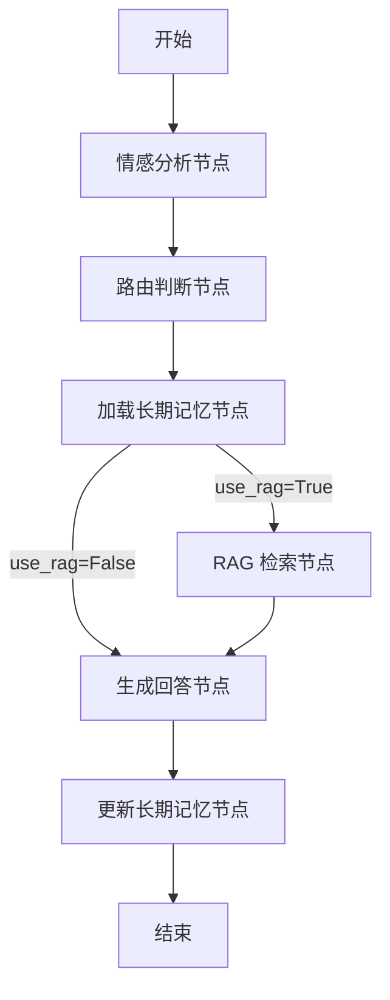
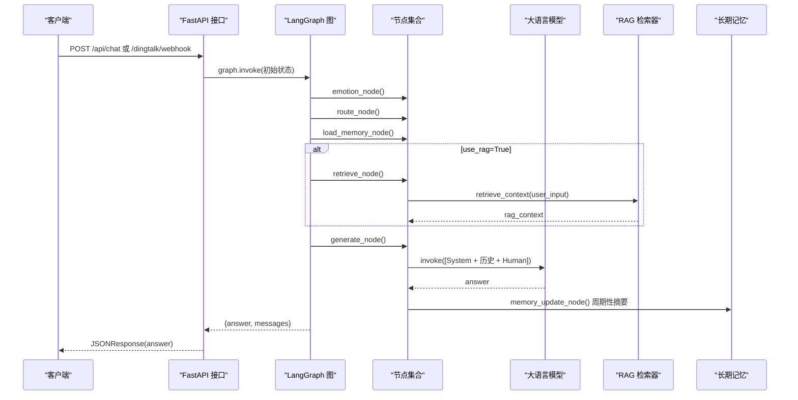
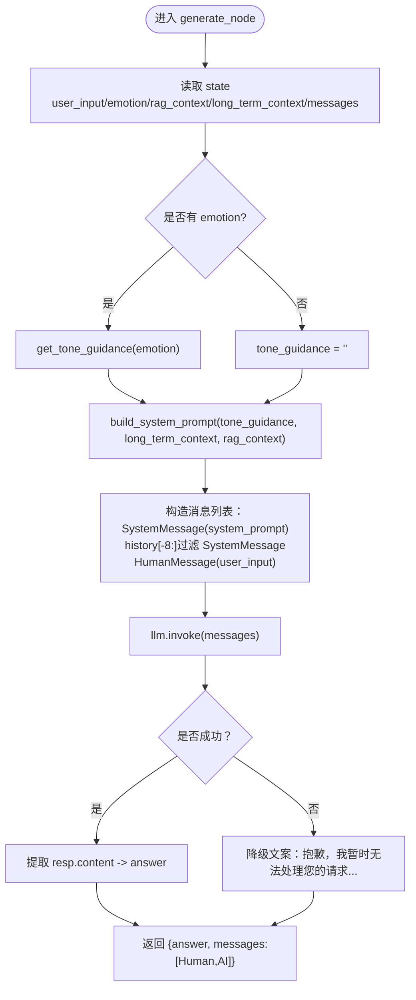
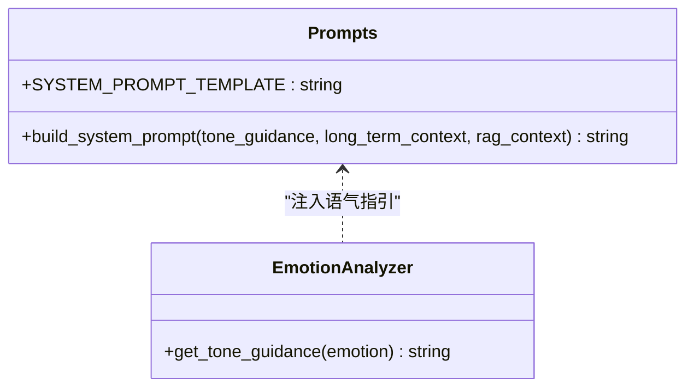
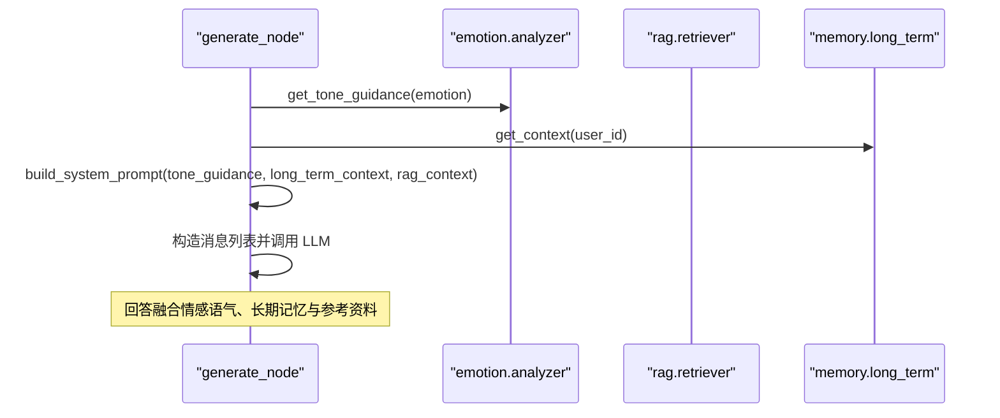
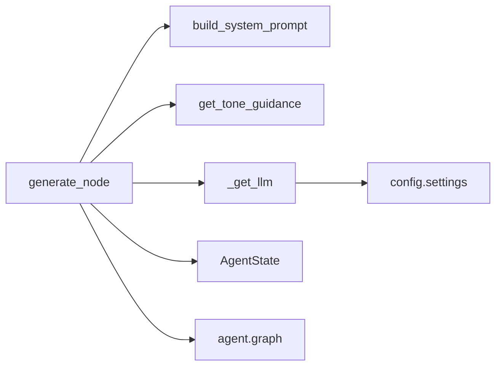

# 回答生成节点

<cite>
**本文引用的文件**   
- [agent/nodes.py](file://agent/nodes.py)
- [agent/prompts.py](file://agent/prompts.py)
- [agent/state.py](file://agent/state.py)
- [agent/graph.py](file://agent/graph.py)
- [emotion/analyzer.py](file://emotion/analyzer.py)
- [rag/retriever.py](file://rag/retriever.py)
- [memory/long_term.py](file://memory/long_term.py)
- [memory/short_term.py](file://memory/short_term.py)
- [config/settings.py](file://config/settings.py)
- [main.py](file://main.py)
</cite>

## 目录
1. [简介](#简介)
2. [项目结构](#项目结构)
3. [核心组件](#核心组件)
4. [架构总览](#架构总览)
5. [详细组件分析](#详细组件分析)
6. [依赖关系分析](#依赖关系分析)
7. [性能与调优建议](#性能与调优建议)
8. [故障排查指南](#故障排查指南)
9. [结论](#结论)
10. [附录：提示词构建示例与最佳实践](#附录提示词构建示例与最佳实践)

## 简介
本文件围绕“回答生成节点”（generate_node）展开，系统性解析其完整实现与在整体工作流中的职责。重点包括：
- 系统提示词的构建逻辑与注入策略
- 消息历史的组装与长度控制
- LLM 调用方式、参数与响应处理
- 如何整合情感分析结果、RAG 检索上下文与长期记忆信息，生成个性化回复
- 输入参数与输出格式规范
- 错误处理与降级策略
- 温度参数调优与消息长度控制的最佳实践

## 项目结构
该智能体基于 LangGraph 的状态图编排，核心流程为：
START -> 情感分析 -> 路由判断 -> 加载长期记忆 -> (条件分支) RAG 检索 -> 生成回答 -> 更新长期记忆 -> END

**图表来源** 
- [agent/graph.py:25-69](file://agent/graph.py#L25-L69)
- [agent/nodes.py:31-164](file://agent/nodes.py#L31-L164)

**章节来源**
- [agent/graph.py:1-106](file://agent/graph.py#L1-L106)
- [agent/nodes.py:1-164](file://agent/nodes.py#L1-L164)

## 核心组件
- AgentState：状态定义，包含 messages、user_input、user_id、session_id、emotion、use_rag、rag_context、long_term_context、answer 等字段。
- generate_node：核心生成节点，负责组装系统提示词、历史消息、调用 LLM、返回 answer 与追加的消息对。
- prompts.build_system_prompt：将语气指引、长期记忆、RAG 上下文拼装成最终系统提示词。
- emotion.analyzer：情感分析与语气指引生成。
- rag.retriever：语义检索并格式化上下文字符串。
- memory.long_term：长期记忆的读取与摘要存储。
- memory.short_term：短期记忆（会话上下文）的 checkpointer。
- config.settings：全局配置（模型、基地址、API Key、温度、RAG 参数、记忆轮次阈值等）。

**章节来源**
- [agent/state.py:1-47](file://agent/state.py#L1-L47)
- [agent/prompts.py:1-63](file://agent/prompts.py#L1-L63)
- [emotion/analyzer.py:1-118](file://emotion/analyzer.py#L1-L118)
- [rag/retriever.py:1-38](file://rag/retriever.py#L1-L38)
- [memory/long_term.py:1-244](file://memory/long_term.py#L1-L244)
- [memory/short_term.py:1-28](file://memory/short_term.py#L1-L28)
- [config/settings.py:1-93](file://config/settings.py#L1-L93)

## 架构总览
下图展示从请求进入 Webhook/API 到生成回答的关键调用链，突出 generate_node 的位置与数据流向。

**图表来源** 
- [main.py:58-91](file://main.py#L58-L91)
- [main.py:106-176](file://main.py#L106-L176)
- [agent/graph.py:25-69](file://agent/graph.py#L25-L69)
- [agent/nodes.py:31-164](file://agent/nodes.py#L31-L164)
- [rag/retriever.py:34-38](file://rag/retriever.py#L34-L38)
- [memory/long_term.py:203-244](file://memory/long_term.py#L203-L244)

## 详细组件分析

### generate_node 函数详解
generate_node 是回答生成的核心，承担以下职责：
- 读取状态中的 user_input、emotion、rag_context、long_term_context、messages
- 根据 emotion 生成语气指引 tone_guidance
- 调用 build_system_prompt 组装系统提示词
- 构造消息列表：SystemMessage(system_prompt) + 最近若干条历史（过滤掉旧 SystemMessage）+ HumanMessage(user_input)
- 调用 LLM 生成回答，捕获异常并降级
- 返回 {"answer": answer, "messages": [HumanMessage, AIMessage]}

#### 输入参数（来自 state）
- user_input: str，当前用户输入
- emotion: Optional[EmotionInfo]，情感分析结果（label/score/tone）
- rag_context: str，RAG 检索到的上下文字符串
- long_term_context: str，长期记忆拼接后的上下文字符串
- messages: list[BaseMessage]，历史消息（由 add_messages reducer 维护）

#### 输出字段
- answer: str，生成的回答文本
- messages: list[BaseMessage]，本轮新增的用户与助手消息对

#### 关键实现要点
- 系统提示词构建：通过 build_system_prompt(tone_guidance, long_term_context, rag_context) 动态填充
- 历史消息裁剪：仅保留最近的若干条（代码中取 history[-8:]），避免超出上下文窗口
- LLM 调用：使用 _get_llm() 获取 ChatOpenAI 实例，默认 temperature=0.7；invoke 后统一处理 content 类型
- 错误处理：try/except 捕获异常，返回友好降级文案

**图表来源** 
- [agent/nodes.py:104-141](file://agent/nodes.py#L104-L141)
- [agent/prompts.py:18-43](file://agent/prompts.py#L18-L43)
- [emotion/analyzer.py:115-118](file://emotion/analyzer.py#L115-L118)

**章节来源**
- [agent/nodes.py:104-141](file://agent/nodes.py#L104-L141)
- [agent/prompts.py:18-43](file://agent/prompts.py#L18-L43)
- [emotion/analyzer.py:115-118](file://emotion/analyzer.py#L115-L118)

### 系统提示词构建逻辑（build_system_prompt）
- 模板包含三个占位符：tone_guidance、long_term_section、rag_section
- 当 long_term_context 或 rag_context 为空时，对应 section 为空字符串，避免多余空白
- 最终模板以自然语言指令引导模型优先依据参考资料作答，并在末尾注明信息来源

**图表来源** 
- [agent/prompts.py:7-43](file://agent/prompts.py#L7-L43)
- [emotion/analyzer.py:115-118](file://emotion/analyzer.py#L115-L118)

**章节来源**
- [agent/prompts.py:1-63](file://agent/prompts.py#L1-L63)

### 消息历史组装策略
- 历史消息来源于 state.messages，由 add_messages reducer 自动累加
- 生成节点会过滤掉 SystemMessage，仅保留人类与助手消息
- 仅取最近 8 条历史，控制上下文长度，降低 token 消耗与超时风险

**章节来源**
- [agent/state.py:20-44](file://agent/state.py#L20-L44)
- [agent/nodes.py:128-133](file://agent/nodes.py#L128-L133)

### LLM 调用方式与响应处理
- 使用 ChatOpenAI，模型、基地址、API Key 来自 settings
- 默认 temperature=0.7（可在外部调优）
- 调用 llm.invoke(chat_messages)，统一处理 content 类型为字符串
- 异常捕获后返回降级文案，保证服务可用性

**章节来源**
- [agent/nodes.py:15-27](file://agent/nodes.py#L15-L27)
- [agent/nodes.py:126-141](file://agent/nodes.py#L126-L141)
- [config/settings.py:26-31](file://config/settings.py#L26-L31)

### 整合情感分析、RAG 与长期记忆
- 情感分析：emotion_node 先执行，analyze(text) 返回 label/score/tone；generate_node 通过 get_tone_guidance 注入语气指引
- RAG 检索：route_node 决定是否需要检索；retrieve_node 调用 retriever.retrieve_context(user_input) 得到格式化上下文
- 长期记忆：load_memory_node 调用 memory.long_term.get_context(user_id) 拼接偏好与摘要
- 三者共同注入 system prompt，使回答更具个性化与准确性

**图表来源** 
- [agent/nodes.py:104-141](file://agent/nodes.py#L104-L141)
- [emotion/analyzer.py:82-118](file://emotion/analyzer.py#L82-L118)
- [rag/retriever.py:34-38](file://rag/retriever.py#L34-L38)
- [memory/long_term.py:150-163](file://memory/long_term.py#L150-L163)

**章节来源**
- [agent/nodes.py:104-141](file://agent/nodes.py#L104-L141)
- [emotion/analyzer.py:82-118](file://emotion/analyzer.py#L82-L118)
- [rag/retriever.py:34-38](file://rag/retriever.py#L34-L38)
- [memory/long_term.py:150-163](file://memory/long_term.py#L150-L163)

### 错误处理与降级策略
- 路由阶段：若 LLM 路由失败，回退到关键词匹配
- 检索阶段：检索异常则返回空上下文，不影响后续生成
- 生成阶段：LLM 调用异常返回友好降级文案
- 长期记忆更新：异常被捕获但不影响主流程

**章节来源**
- [agent/nodes.py:53-68](file://agent/nodes.py#L53-L68)
- [agent/nodes.py:76-86](file://agent/nodes.py#L76-L86)
- [agent/nodes.py:137-141](file://agent/nodes.py#L137-L141)
- [agent/nodes.py:145-164](file://agent/nodes.py#L145-L164)

## 依赖关系分析
generate_node 的依赖关系如下：
- 直接依赖：prompts.build_system_prompt、emotion.analyzer.get_tone_guidance、_get_llm
- 间接依赖：settings（模型配置）、state（状态结构）、graph（工作流编排）

**图表来源** 
- [agent/nodes.py:104-141](file://agent/nodes.py#L104-L141)
- [agent/prompts.py:18-43](file://agent/prompts.py#L18-L43)
- [emotion/analyzer.py:115-118](file://emotion/analyzer.py#L115-L118)
- [config/settings.py:16-31](file://config/settings.py#L16-L31)

**章节来源**
- [agent/nodes.py:104-141](file://agent/nodes.py#L104-L141)
- [agent/prompts.py:18-43](file://agent/prompts.py#L18-L43)
- [emotion/analyzer.py:115-118](file://emotion/analyzer.py#L115-L118)
- [config/settings.py:16-31](file://config/settings.py#L16-L31)

## 性能与调优建议
- 温度参数调优
  - 默认 temperature=0.7，适合通用对话；如需更稳定答案可降至 0.2~0.5
  - 情感分析与路由判断使用较低温度（如 0.1），确保结构化输出稳定性
- 消息长度控制
  - 历史消息限制为最近 8 条，避免超出上下文窗口
  - 可通过调整截取数量平衡连贯性与成本
- RAG 上下文长度
  - 检索结果按片段格式化，注意文档数量 k 与单段长度，避免过长导致提示词膨胀
- 长期记忆摘要频率
  - 通过 memory_summary_every 控制摘要触发频率，减少频繁 LLM 调用开销
- 并发与持久化
  - 长期记忆使用 SQLite WAL 模式提升读并发能力；写操作串行化避免冲突

**章节来源**
- [agent/nodes.py:15-27](file://agent/nodes.py#L15-L27)
- [agent/nodes.py:128-133](file://agent/nodes.py#L128-L133)
- [rag/retriever.py:13-38](file://rag/retriever.py#L13-L38)
- [memory/long_term.py:24-41](file://memory/long_term.py#L24-L41)
- [config/settings.py:44-47](file://config/settings.py#L44-L47)

## 故障排查指南
- LLM 调用失败
  - 检查 settings.llm_model、llm_base_url、llm_api_key 是否正确
  - 查看网络连通性与鉴权状态
- 路由判断异常
  - 确认 ROUTER_PROMPT 与 ROUTER_KEYWORDS 配置合理
  - 观察降级关键词匹配是否生效
- RAG 检索为空
  - 检查向量库索引是否已构建，query 是否与知识库内容相关
  - 调整 rag_top_k 与 rag_score_filter
- 长期记忆未更新
  - 确认 memory_summary_every 设置与 turn_count 计数逻辑
  - 检查 SQLite 文件路径与权限

**章节来源**
- [config/settings.py:26-31](file://config/settings.py#L26-L31)
- [agent/nodes.py:53-68](file://agent/nodes.py#L53-L68)
- [rag/retriever.py:34-38](file://rag/retriever.py#L34-L38)
- [memory/long_term.py:165-184](file://memory/long_term.py#L165-L184)

## 结论
generate_node 作为回答生成的核心节点，通过系统提示词动态注入情感语气、长期记忆与 RAG 上下文，结合稳健的历史消息管理与错误降级策略，实现了高质量、个性化且稳定的智能回复。配合合理的温度调优与上下文长度控制，可在成本与效果之间取得良好平衡。

## 附录：提示词构建示例与最佳实践
- 提示词构建步骤
  - 从 emotion.analyzer.get_tone_guidance 获取语气指引
  - 从 memory.long_term.get_context 获取长期记忆上下文
  - 从 rag.retriever.retrieve_context 获取 RAG 上下文
  - 调用 prompts.build_system_prompt 组装最终系统提示词
- 温度参数调优建议
  - 通用对话：temperature≈0.7
  - 结构化输出（情感/路由）：temperature≈0.1
  - 摘要生成：temperature≈0.2
- 消息长度控制最佳实践
  - 历史消息限制在最近 8 条以内
  - 长对话场景下定期重置会话或压缩历史
- 错误处理与降级
  - 路由失败回退关键词匹配
  - 检索失败返回空上下文
  - LLM 异常返回友好降级文案

**章节来源**
- [agent/prompts.py:18-43](file://agent/prompts.py#L18-L43)
- [emotion/analyzer.py:82-118](file://emotion/analyzer.py#L82-L118)
- [rag/retriever.py:34-38](file://rag/retriever.py#L34-L38)
- [memory/long_term.py:203-244](file://memory/long_term.py#L203-L244)
- [agent/nodes.py:104-141](file://agent/nodes.py#L104-L141)