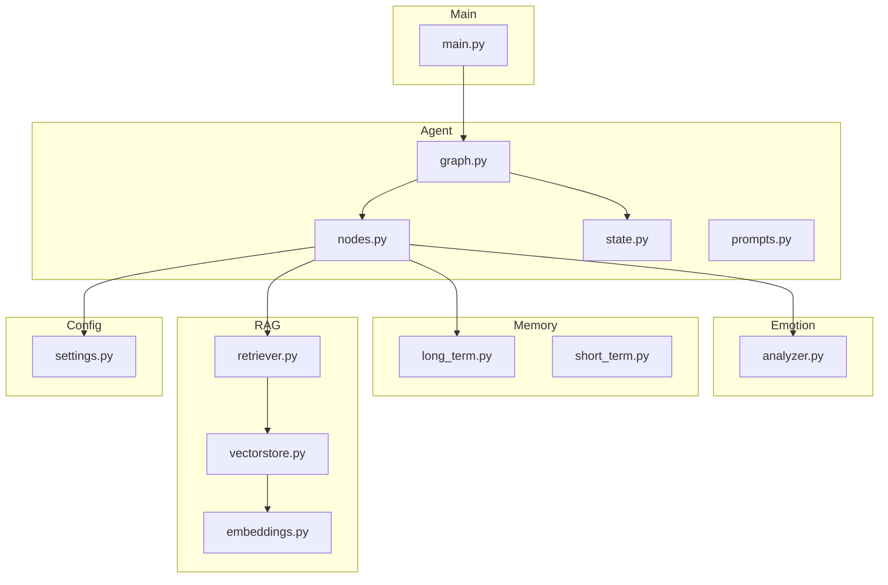
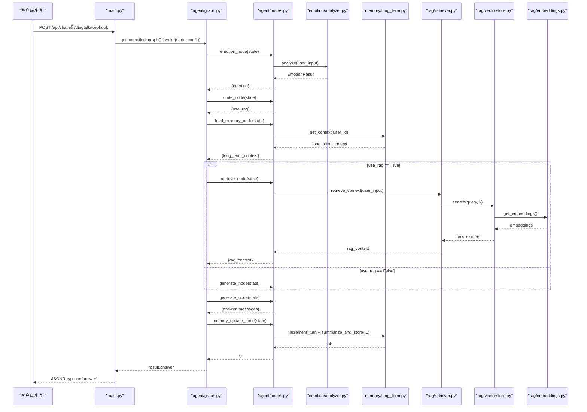

# 工作流节点实现

<cite>
**本文引用的文件**   
- [agent/nodes.py](file://agent/nodes.py)
- [agent/state.py](file://agent/state.py)
- [agent/graph.py](file://agent/graph.py)
- [agent/prompts.py](file://agent/prompts.py)
- [emotion/analyzer.py](file://emotion/analyzer.py)
- [memory/long_term.py](file://memory/long_term.py)
- [memory/short_term.py](file://memory/short_term.py)
- [rag/retriever.py](file://rag/retriever.py)
- [rag/vectorstore.py](file://rag/vectorstore.py)
- [rag/embeddings.py](file://rag/embeddings.py)
- [config/settings.py](file://config/settings.py)
- [main.py](file://main.py)
</cite>

## 目录
1. [简介](#简介)
2. [项目结构](#项目结构)
3. [核心组件](#核心组件)
4. [架构总览](#架构总览)
5. [详细组件分析](#详细组件分析)
6. [依赖关系分析](#依赖关系分析)
7. [性能考量](#性能考量)
8. [故障排查指南](#故障排查指南)
9. [结论](#结论)
10. [附录：调用示例与最佳实践](#附录调用示例与最佳实践)

## 简介
本技术文档围绕智能体工作流的六个关键节点展开，系统性说明其功能、输入输出、错误处理与性能优化策略，并给出节点间数据传递格式与状态共享机制。工作流基于 LangGraph StateGraph 编排，依次执行情感分析、路由决策、长期记忆加载、RAG 检索（可选）、LLM 生成回答以及周期性记忆更新。整体设计强调鲁棒性（多路径兜底）、可观测性（日志与评估）与可扩展性（模块化与配置化）。

## 项目结构
- agent：工作流节点函数、状态定义、图构建与 Prompt 模板
- emotion：情感分析与语气指引
- memory：长期记忆（SQLite）与短期记忆（LangGraph checkpointer）
- rag：向量库封装、Embedding 与检索器
- config：全局配置（LLM、向量库、记忆等）
- main：FastAPI 入口（Web 聊天、钉钉回调、健康检查、REPL）



图表来源
- [agent/graph.py:1-106](file://agent/graph.py#L1-L106)
- [agent/nodes.py:1-164](file://agent/nodes.py#L1-L164)
- [rag/retriever.py:1-38](file://rag/retriever.py#L1-L38)
- [rag/vectorstore.py:1-75](file://rag/vectorstore.py#L1-L75)
- [rag/embeddings.py:1-41](file://rag/embeddings.py#L1-L41)
- [memory/long_term.py:1-244](file://memory/long_term.py#L1-L244)
- [memory/short_term.py:1-28](file://memory/short_term.py#L1-L28)
- [config/settings.py:1-93](file://config/settings.py#L1-L93)
- [main.py:1-236](file://main.py#L1-L236)

章节来源
- [agent/graph.py:1-106](file://agent/graph.py#L1-L106)
- [agent/state.py:1-47](file://agent/state.py#L1-L47)
- [agent/nodes.py:1-164](file://agent/nodes.py#L1-L164)

## 核心组件
- AgentState：定义工作流状态字段，包括消息历史、用户输入、用户与会话标识、情感结果、RAG 开关与上下文、长期记忆上下文、最终答案。消息历史使用 add_messages reducer 自动累加。
- 节点函数：emotion_node、route_node、retrieve_node、load_memory_node、generate_node、memory_update_node，每个节点接收/返回 AgentState 的增量字典。
- 图构建：build_graph 注册节点与边，条件分支由 route_condition 决定是否走 retrieve 或 generate。
- 配置：Settings 集中管理 LLM、Embedding、向量库、记忆、钉钉、LangSmith 等参数。

章节来源
- [agent/state.py:1-47](file://agent/state.py#L1-L47)
- [agent/nodes.py:1-164](file://agent/nodes.py#L1-L164)
- [agent/graph.py:1-106](file://agent/graph.py#L1-L106)
- [config/settings.py:1-93](file://config/settings.py#L1-L93)

## 架构总览
工作流顺序为：START -> emotion -> route -> load_memory -> {retrieve -> generate | generate} -> memory_update -> END。其中 load_memory 之后根据 use_rag 分流到 retrieve 或直接到 generate；所有节点完成后进入 memory_update 进行周期性摘要更新。



图表来源
- [main.py:58-91](file://main.py#L58-L91)
- [agent/graph.py:25-69](file://agent/graph.py#L25-L69)
- [agent/nodes.py:31-163](file://agent/nodes.py#L31-L163)
- [emotion/analyzer.py:82-112](file://emotion/analyzer.py#L82-L112)
- [rag/retriever.py:34-37](file://rag/retriever.py#L34-L37)
- [rag/vectorstore.py:48-68](file://rag/vectorstore.py#L48-L68)
- [rag/embeddings.py:21-40](file://rag/embeddings.py#L21-L40)
- [memory/long_term.py:150-163](file://memory/long_term.py#L150-L163)

## 详细组件分析

### 情感分析节点 emotion_node
- 功能：对用户输入进行情感分类（positive/negative/neutral），并生成语气指引供后续生成节点注入系统 prompt。
- 输入：state.user_input
- 输出：state.emotion（包含 label、score、tone）
- 错误处理：若 LLM 不可用或解析失败，回退到规则词典分析，保证可用性。
- 性能优化：延迟导入 LLM，避免循环依赖；空输入直接返回中性结果。
- 最佳实践：确保 user_input 非空；在极端情况下仍能得到合理语气指引。

章节来源
- [agent/nodes.py:31-42](file://agent/nodes.py#L31-L42)
- [emotion/analyzer.py:82-112](file://emotion/analyzer.py#L82-L112)
- [emotion/analyzer.py:115-118](file://emotion/analyzer.py#L115-L118)

### 路由决策节点 route_node
- 功能：判断是否需要 RAG 检索，写入 state.use_rag。
- 输入：state.user_input
- 输出：state.use_rag（bool）
- 决策逻辑：短输入且无疑问词倾向闲聊；否则调用 LLM 做结构化判断；异常时回退关键词匹配。
- 错误处理：LLM 调用失败时降级为关键词兜底，确保流程不中断。
- 性能优化：temperature=0.0 提高稳定性；短输入快速判定减少 LLM 调用。

章节来源
- [agent/nodes.py:46-72](file://agent/nodes.py#L46-L72)
- [agent/prompts.py:46-63](file://agent/prompts.py#L46-L63)

### 知识检索节点 retrieve_node
- 功能：执行语义检索，格式化上下文字符串供生成节点使用。
- 输入：state.user_input
- 输出：state.rag_context（字符串）
- 错误处理：检索异常捕获并返回空字符串，不影响主流程。
- 性能优化：top-k 与分数阈值过滤，控制上下文长度与质量。

章节来源
- [agent/nodes.py:76-86](file://agent/nodes.py#L76-L86)
- [rag/retriever.py:34-37](file://rag/retriever.py#L34-L37)
- [rag/vectorstore.py:48-68](file://rag/vectorstore.py#L48-L68)

### 长期记忆加载节点 load_memory_node
- 功能：从 SQLite 加载用户偏好与对话摘要，拼装成长期记忆上下文字符串。
- 输入：state.user_id
- 输出：state.long_term_context（字符串）
- 错误处理：数据库访问异常捕获并返回空字符串。
- 性能优化：WAL 模式提升并发读能力；仅保留最近若干条摘要历史。

章节来源
- [agent/nodes.py:90-100](file://agent/nodes.py#L90-L100)
- [memory/long_term.py:150-163](file://memory/long_term.py#L150-L163)
- [memory/long_term.py:24-41](file://memory/long_term.py#L24-L41)

### 生成回答节点 generate_node
- 功能：组装系统 prompt（含语气指引、长期记忆、RAG 上下文），结合历史消息调用 LLM 生成回答。
- 输入：state.user_input、state.emotion、state.rag_context、state.long_term_context、state.messages
- 输出：state.answer、state.messages（追加当前轮 HumanMessage 与 AIMessage）
- 错误处理：LLM 调用异常时返回友好提示，避免崩溃。
- 性能优化：限制历史消息窗口（最近 8 条），降低 token 消耗；温度默认 0.7 平衡创造性与稳定性。

章节来源
- [agent/nodes.py:104-141](file://agent/nodes.py#L104-L141)
- [agent/prompts.py:7-43](file://agent/prompts.py#L7-L43)

### 记忆更新节点 memory_update_node
- 功能：周期性增加对话轮次计数，并在达到阈值时触发摘要生成与持久化。
- 输入：state.user_id、state.messages
- 输出：{}（不修改状态）
- 错误处理：异常捕获并记录日志，不影响主流程。
- 性能优化：按 settings.memory_summary_every 控制频率，避免频繁 LLM 调用。

章节来源
- [agent/nodes.py:145-163](file://agent/nodes.py#L145-L163)
- [memory/long_term.py:165-183](file://memory/long_term.py#L165-L183)
- [memory/long_term.py:203-243](file://memory/long_term.py#L203-L243)
- [config/settings.py:44-47](file://config/settings.py#L44-L47)

## 依赖关系分析
- nodes.py 依赖 emotion.analyzer、rag.retriever、memory.long_term、agent.prompts、agent.state、config.settings。
- graph.py 依赖 nodes、state，并通过 short_term.checkpointer 维护会话上下文。
- retriever.py 依赖 vectorstore.search，后者依赖 embeddings.get_embeddings。
- long_term.py 通过 sqlite3 持久化，使用 WAL 模式与线程锁保证并发安全。
- main.py 暴露 FastAPI 接口，统一调用 graph.invoke 完成工作流。

```mermaid
graph LR
nodes["agent/nodes.py"] --> analyzer["emotion/analyzer.py"]
nodes --> retriever["rag/retriever.py"]
nodes --> long_term["memory/long_term.py"]
nodes --> prompts["agent/prompts.py"]
nodes --> state["agent/state.py"]
nodes --> settings["config/settings.py"]
graph["agent/graph.py"] --> nodes
graph --> state
graph --> short_term["memory/short_term.py"]
retriever --> vectorstore["rag/vectorstore.py"]
vectorstore --> embeddings["rag/embeddings.py"]
main["main.py"] --> graph
```

图表来源
- [agent/nodes.py:1-164](file://agent/nodes.py#L1-L164)
- [agent/graph.py:1-106](file://agent/graph.py#L1-L106)
- [rag/retriever.py:1-38](file://rag/retriever.py#L1-L38)
- [rag/vectorstore.py:1-75](file://rag/vectorstore.py#L1-L75)
- [rag/embeddings.py:1-41](file://rag/embeddings.py#L1-L41)
- [memory/short_term.py:1-28](file://memory/short_term.py#L1-L28)
- [main.py:1-236](file://main.py#L1-L236)

章节来源
- [agent/nodes.py:1-164](file://agent/nodes.py#L1-L164)
- [agent/graph.py:1-106](file://agent/graph.py#L1-L106)
- [rag/retriever.py:1-38](file://rag/retriever.py#L1-L38)
- [rag/vectorstore.py:1-75](file://rag/vectorstore.py#L1-L75)
- [rag/embeddings.py:1-41](file://rag/embeddings.py#L1-L41)
- [memory/short_term.py:1-28](file://memory/short_term.py#L1-L28)
- [main.py:1-236](file://main.py#L1-L236)

## 性能考量
- LLM 调用优化：路由节点 temperature=0.0 提高稳定性；生成节点限制历史消息窗口；长文本摘要按阈值周期触发。
- 检索优化：top-k 与分数阈值过滤，减少无关上下文；向量库持久化避免重复计算。
- 内存与并发：短期记忆使用进程内 MemorySaver；长期记忆 SQLite 开启 WAL 模式与线程锁，读写串行化但读不阻塞。
- 配置缓存：Settings 使用 lru_cache 单例；Embedding 模型缓存避免重复初始化。

[本节为通用指导，不直接分析具体文件]

## 故障排查指南
- 情感分析失败：检查 LLM 配置与网络；确认 analyzer 的 JSON 解析逻辑；必要时查看规则兜底结果。
- 路由判断异常：确认 ROUTER_PROMPT 与关键词列表；观察 _decide_rag 的降级路径。
- 检索失败：检查向量库初始化与持久化目录；确认 embedding 模型可用；查看检索分数阈值。
- 长期记忆异常：验证 SQLite 文件权限与 WAL 模式；检查表结构与索引；关注线程锁与事务提交。
- 生成失败：检查 system prompt 拼接；确认 messages 历史长度；查看 LLM 返回内容类型。
- 记忆更新失败：确认 settings.memory_summary_every 设置；检查 summarize_and_store 的 LLM 调用。

章节来源
- [emotion/analyzer.py:82-112](file://emotion/analyzer.py#L82-L112)
- [agent/nodes.py:53-67](file://agent/nodes.py#L53-L67)
- [rag/retriever.py:34-37](file://rag/retriever.py#L34-L37)
- [rag/vectorstore.py:48-68](file://rag/vectorstore.py#L48-L68)
- [memory/long_term.py:24-41](file://memory/long_term.py#L24-L41)
- [agent/nodes.py:104-141](file://agent/nodes.py#L104-L141)
- [agent/nodes.py:145-163](file://agent/nodes.py#L145-L163)

## 结论
该工作流以模块化节点为核心，结合情感分析、路由决策、RAG 检索与长期记忆，形成稳定、可扩展的智能体对话管线。各节点具备完善的错误处理与降级策略，配合配置化管理与性能优化，适用于企业级场景。建议在生产环境加强监控与日志采集，并根据业务需求调整路由阈值与记忆更新频率。

[本节为总结性内容，不直接分析具体文件]

## 附录：调用示例与最佳实践

### 节点间数据传递格式与状态共享
- AgentState 字段：messages、user_input、user_id、session_id、emotion、use_rag、rag_context、long_term_context、answer。
- 消息历史：add_messages reducer 自动累加，避免覆盖。
- 上下文注入：generate_node 将 tone_guidance、long_term_context、rag_context 拼接到 system prompt。

章节来源
- [agent/state.py:20-44](file://agent/state.py#L20-L44)
- [agent/prompts.py:18-43](file://agent/prompts.py#L18-L43)

### 节点调用示例（代码片段路径）
- Web 聊天接口调用：[main.py:58-91](file://main.py#L58-L91)
- 钉钉回调处理：[main.py:106-176](file://main.py#L106-L176)
- 便捷入口 chat：[agent/graph.py:84-105](file://agent/graph.py#L84-L105)
- 情感分析：[emotion/analyzer.py:82-112](file://emotion/analyzer.py#L82-L112)
- 路由判断：[agent/nodes.py:53-67](file://agent/nodes.py#L53-L67)
- RAG 检索：[rag/retriever.py:34-37](file://rag/retriever.py#L34-L37)
- 长期记忆加载：[memory/long_term.py:150-163](file://memory/long_term.py#L150-L163)
- 生成回答：[agent/nodes.py:104-141](file://agent/nodes.py#L104-L141)
- 记忆更新：[memory/long_term.py:203-243](file://memory/long_term.py#L203-L243)

### 最佳实践
- 输入校验：确保 user_input 非空，避免无效 LLM 调用。
- 路由调优：根据业务调整 ROUTER_KEYWORDS 与阈值，减少误判。
- 上下文控制：限制历史消息长度与 top-k，控制 token 成本。
- 记忆策略：合理设置 memory_summary_every，平衡摘要频率与资源消耗。
- 错误恢复：保持降级路径（关键词、规则、空上下文），保障服务可用性。

[本节为通用指导，不直接分析具体文件]