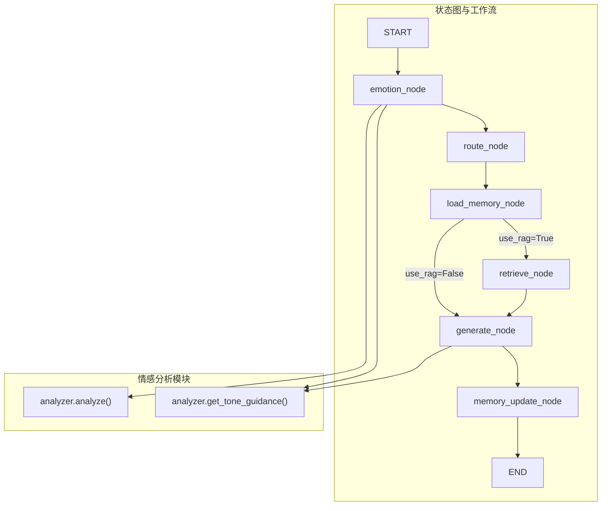
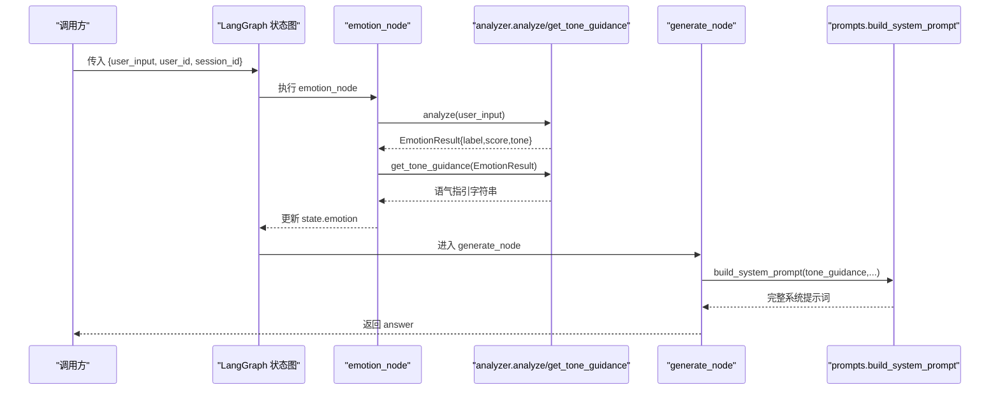
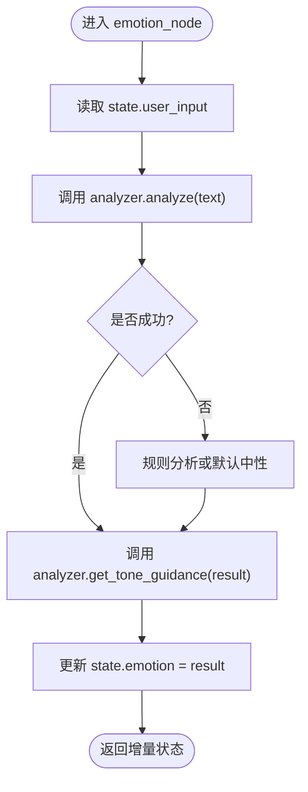
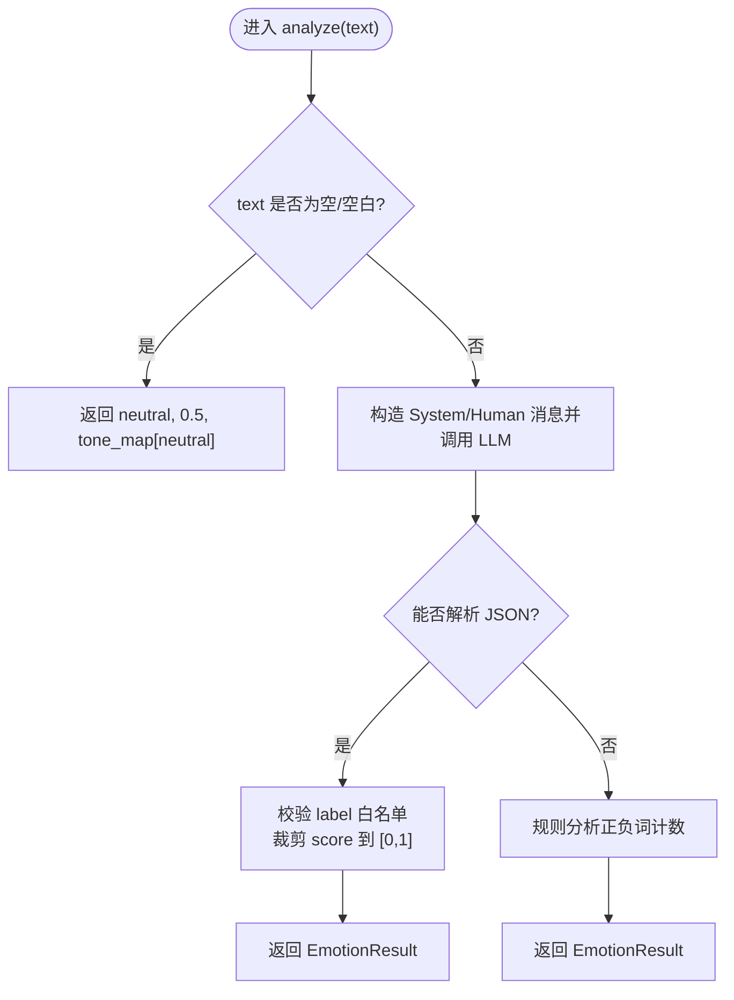
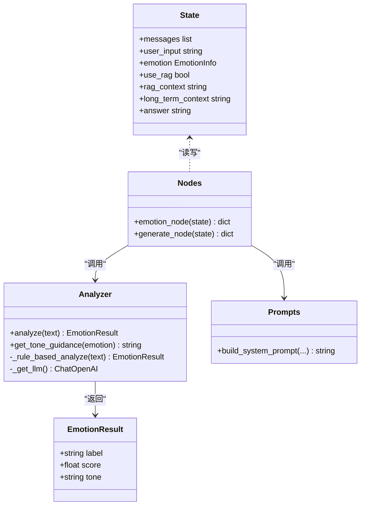
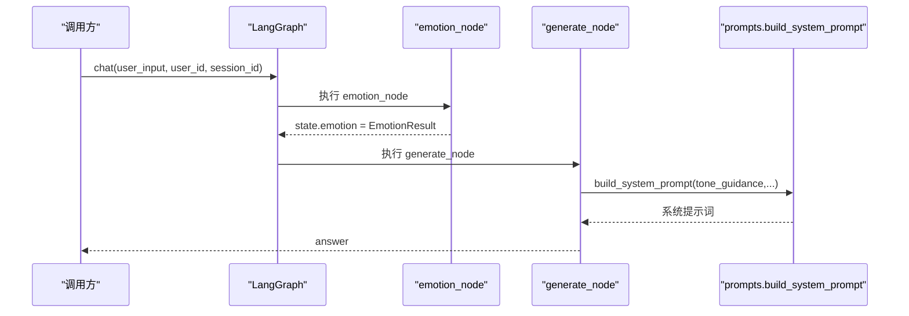

# 情感分析节点

<cite>
**本文引用的文件**   
- [emotion/analyzer.py](file://emotion/analyzer.py)
- [agent/nodes.py](file://agent/nodes.py)
- [agent/state.py](file://agent/state.py)
- [agent/graph.py](file://agent/graph.py)
- [agent/prompts.py](file://agent/prompts.py)
- [config/settings.py](file://config/settings.py)
</cite>

## 目录
1. [简介](#简介)
2. [项目结构](#项目结构)
3. [核心组件](#核心组件)
4. [架构总览](#架构总览)
5. [详细组件分析](#详细组件分析)
6. [依赖关系分析](#依赖关系分析)
7. [性能考量](#性能考量)
8. [故障排查指南](#故障排查指南)
9. [结论](#结论)
10. [附录：状态图使用示例与后续策略](#附录状态图使用示例与后续策略)

## 简介
本技术文档聚焦“情感分析节点”，系统性说明 emotion_node 如何调用 emotion.analyzer 模块对用户输入进行情感分类，并生成语气指引以影响后续消息生成。文档涵盖 analyze 函数的调用方式、EmotionResult 数据结构、get_tone_guidance 的语气指引生成逻辑；明确节点的输入参数（AgentState.user_input）、输出格式（state.emotion 与 tone_guidance 的注入路径），以及错误处理机制。同时提供在 LangGraph 状态图中的使用示例，解释情感分析结果如何影响后续回答生成策略。

## 项目结构
与情感分析节点直接相关的代码分布在以下模块：
- emotion/analyzer.py：实现情感分析核心逻辑（LLM 优先 + 规则兜底）、语气映射与指引生成。
- agent/nodes.py：定义 emotion_node 节点，负责从状态中读取 user_input，调用 analyzer 并将结果写入 state.emotion。
- agent/state.py：定义 AgentState 与 EmotionInfo 类型，规范状态字段与类型约束。
- agent/graph.py：构建 LangGraph 工作流，将 emotion_node 接入 START 之后的首节点，串联路由、检索、生成等步骤。
- agent/prompts.py：组装系统提示词，将语气指引注入到最终生成阶段。
- config/settings.py：集中管理 LLM 等配置项，供 analyzer 延迟加载模型时使用。

图表来源
- [agent/graph.py:25-69](file://agent/graph.py#L25-L69)
- [agent/nodes.py:31-42](file://agent/nodes.py#L31-L42)
- [emotion/analyzer.py:82-117](file://emotion/analyzer.py#L82-L117)

章节来源
- [agent/graph.py:1-106](file://agent/graph.py#L1-L106)
- [agent/nodes.py:1-164](file://agent/nodes.py#L1-L164)
- [emotion/analyzer.py:1-118](file://emotion/analyzer.py#L1-L118)

## 核心组件
- emotion_node：从 AgentState 中读取 user_input，调用 emotion.analyzer.analyze 得到 EmotionResult，并通过 get_tone_guidance 生成语气指引文本，最终将 emotion 写入 state.emotion。
- analyzer.analyze：优先通过 LLM 结构化输出解析情感标签、置信度与原因，失败时回退到基于关键词词典的规则分析；空输入直接返回中性结果。
- analyzer.get_tone_guidance：根据 EmotionResult.label 和 score 生成一段自然语言语气指引，用于后续系统提示词注入。
- AgentState/EmotionInfo：定义状态结构与类型，确保 emotion 字段包含 label、score、tone。

章节来源
- [agent/nodes.py:31-42](file://agent/nodes.py#L31-L42)
- [emotion/analyzer.py:13-26](file://emotion/analyzer.py#L13-L26)
- [emotion/analyzer.py:82-117](file://emotion/analyzer.py#L82-L117)
- [agent/state.py:12-18](file://agent/state.py#L12-L18)
- [agent/state.py:20-44](file://agent/state.py#L20-L44)

## 架构总览
下图展示从用户输入到生成回答的整体流程，重点标注情感分析节点的位置与作用。

图表来源
- [agent/graph.py:25-69](file://agent/graph.py#L25-L69)
- [agent/nodes.py:31-42](file://agent/nodes.py#L31-L42)
- [agent/nodes.py:104-141](file://agent/nodes.py#L104-L141)
- [agent/prompts.py:18-43](file://agent/prompts.py#L18-L43)
- [emotion/analyzer.py:82-117](file://emotion/analyzer.py#L82-L117)

## 详细组件分析

### emotion_node：节点函数与状态交互
- 输入：AgentState.user_input（字符串）
- 处理：
  - 调用 analyzer.analyze(user_input) 获取 EmotionResult
  - 调用 analyzer.get_tone_guidance(EmotionResult) 生成语气指引
  - 将 emotion 写入 state.emotion（后续 generate_node 会读取该字段）
- 输出：增量状态 dict，包含 emotion 字段；tone_guidance 作为中间值由 generate_node 再次计算并注入到系统提示词

图表来源
- [agent/nodes.py:31-42](file://agent/nodes.py#L31-L42)
- [emotion/analyzer.py:82-117](file://emotion/analyzer.py#L82-L117)

章节来源
- [agent/nodes.py:31-42](file://agent/nodes.py#L31-L42)

### analyzer.analyze：情感分析主流程
- 输入：text（用户输入字符串）
- 行为：
  - 若 text 为空或空白，直接返回中性结果（label=neutral，score=0.5，tone=TONE_MAP["neutral"]）
  - 尝试通过 LLM 结构化输出解析 JSON，提取 label、score、reason；对 label 做白名单校验，score 裁剪到 [0,1]
  - 若解析失败或异常，打印日志并回退到规则分析（基于中文情感词典计数）
- 输出：EmotionResult（label、score、tone）

图表来源
- [emotion/analyzer.py:82-117](file://emotion/analyzer.py#L82-L117)
- [emotion/analyzer.py:54-67](file://emotion/analyzer.py#L54-L67)

章节来源
- [emotion/analyzer.py:82-117](file://emotion/analyzer.py#L82-L117)
- [emotion/analyzer.py:54-67](file://emotion/analyzer.py#L54-L67)

### EmotionResult 数据结构
- label：情感标签，取值 positive / negative / neutral
- score：置信度，浮点数 0~1
- tone：建议回复语气，来源于 TONE_MAP[label]

TONE_MAP 映射：
- positive → 热情、积极、给予肯定和鼓励
- negative → 共情、温和、安抚，先理解对方情绪再回应
- neutral → 客观、清晰、专业

章节来源
- [emotion/analyzer.py:13-26](file://emotion/analyzer.py#L13-L26)
- [agent/state.py:12-18](file://agent/state.py#L12-L18)

### get_tone_guidance：语气指引生成逻辑
- 输入：EmotionResult
- 输出：自然语言字符串，包含 label、score 与 tone 的描述，便于注入到系统提示词
- 用途：在 generate_node 中拼接系统提示词，使模型按当前用户情感调整语气

章节来源
- [emotion/analyzer.py:115-117](file://emotion/analyzer.py#L115-L117)
- [agent/prompts.py:18-43](file://agent/prompts.py#L18-L43)

### generate_node：语气指引的注入与回答生成
- 读取 state.emotion（可能为 None）
- 若存在 emotion，则调用 analyzer.get_tone_guidance 生成 tone_guidance；否则为空串
- 使用 prompts.build_system_prompt 将 tone_guidance、long_term_context、rag_context 等拼接到系统提示词
- 调用 LLM 生成回答，捕获异常并返回友好提示

章节来源
- [agent/nodes.py:104-141](file://agent/nodes.py#L104-L141)
- [agent/prompts.py:18-43](file://agent/prompts.py#L18-L43)

## 依赖关系分析
- emotion_node 依赖 emotion.analyzer.analyze 与 get_tone_guidance
- generate_node 依赖 emotion.analyzer.get_tone_guidance 与 prompts.build_system_prompt
- analyzer._get_llm 依赖 config.settings.get_settings 获取 LLM 配置
- graph.py 编排节点顺序，确保 emotion_node 最先执行，generate_node 最后生成答案

图表来源
- [emotion/analyzer.py:13-26](file://emotion/analyzer.py#L13-L26)
- [emotion/analyzer.py:82-117](file://emotion/analyzer.py#L82-L117)
- [agent/nodes.py:31-42](file://agent/nodes.py#L31-L42)
- [agent/nodes.py:104-141](file://agent/nodes.py#L104-L141)
- [agent/state.py:20-44](file://agent/state.py#L20-L44)
- [agent/prompts.py:18-43](file://agent/prompts.py#L18-L43)

章节来源
- [agent/graph.py:25-69](file://agent/graph.py#L25-L69)
- [config/settings.py:16-30](file://config/settings.py#L16-L30)

## 性能考量
- LLM 调用开销：analyze 优先走 LLM，若频繁调用会增加延迟与成本；建议在高频场景考虑缓存或降级策略。
- 规则分析复杂度：基于词典的正负词计数时间复杂度 O(k)，k 为词典大小，整体开销较小。
- JSON 解析容错：采用 substring 提取首个 JSON 块，避免复杂正则带来的额外开销。
- 温度设置：analyzer 内部使用较低 temperature（如 0.1），提高稳定性；生成阶段使用较高 temperature（如 0.7）提升多样性。

章节来源
- [emotion/analyzer.py:40-51](file://emotion/analyzer.py#L40-L51)
- [emotion/analyzer.py:54-67](file://emotion/analyzer.py#L54-L67)
- [agent/nodes.py:15-27](file://agent/nodes.py#L15-L27)

## 故障排查指南
- LLM 不可用或网络异常：
  - 现象：analyze 抛出异常，控制台打印 “[emotion] LLM 分析失败，回退规则分析”
  - 处理：自动回退到规则分析，保证可用性；检查 API Key、Base URL、模型名等配置
- JSON 解析失败：
  - 现象：无法从 LLM 响应中提取 JSON，触发 ValueError
  - 处理：回退到规则分析；可优化 Prompt 或增加后处理逻辑
- 空输入：
  - 现象：analyze 直接返回中性结果
  - 处理：上游应校验输入非空；必要时在业务层拦截
- 生成阶段异常：
  - 现象：generate_node 捕获异常并返回友好提示
  - 处理：记录错误信息，检查 LLM 配置与消息长度

章节来源
- [emotion/analyzer.py:110-112](file://emotion/analyzer.py#L110-L112)
- [agent/nodes.py:137-141](file://agent/nodes.py#L137-L141)

## 结论
情感分析节点通过 emotion_node 将用户输入送入 analyzer.analyze，获得结构化情感结果并生成语气指引，随后在 generate_node 中注入系统提示词，使模型能够依据用户情感动态调整回复语气。该设计在保证鲁棒性（LLM 失败回退规则分析）的同时，提升了对话体验的一致性与个性化。

## 附录：状态图使用示例与后续策略
- 在状态图中使用 emotion_node：
  - 入口：graph.chat(user_input, user_id, session_id)
  - 流程：START → emotion_node → route_node → load_memory_node → (条件分支) retrieve_node/generate_node → memory_update_node → END
  - 关键状态：state.emotion 保存情感分析结果；state.answer 保存最终回答
- 情感分析结果对后续策略的影响：
  - generate_node 读取 state.emotion，调用 get_tone_guidance 生成语气指引
  - prompts.build_system_prompt 将语气指引与其他上下文（长期记忆、RAG 检索）一起注入系统提示词
  - 模型据此调整回复风格：正面→鼓励与肯定；负面→共情与安抚；中性→客观与专业

图表来源
- [agent/graph.py:84-106](file://agent/graph.py#L84-L106)
- [agent/nodes.py:31-42](file://agent/nodes.py#L31-L42)
- [agent/nodes.py:104-141](file://agent/nodes.py#L104-L141)
- [agent/prompts.py:18-43](file://agent/prompts.py#L18-L43)

章节来源
- [agent/graph.py:84-106](file://agent/graph.py#L84-L106)
- [agent/nodes.py:31-42](file://agent/nodes.py#L31-L42)
- [agent/nodes.py:104-141](file://agent/nodes.py#L104-L141)
- [agent/prompts.py:18-43](file://agent/prompts.py#L18-L43)