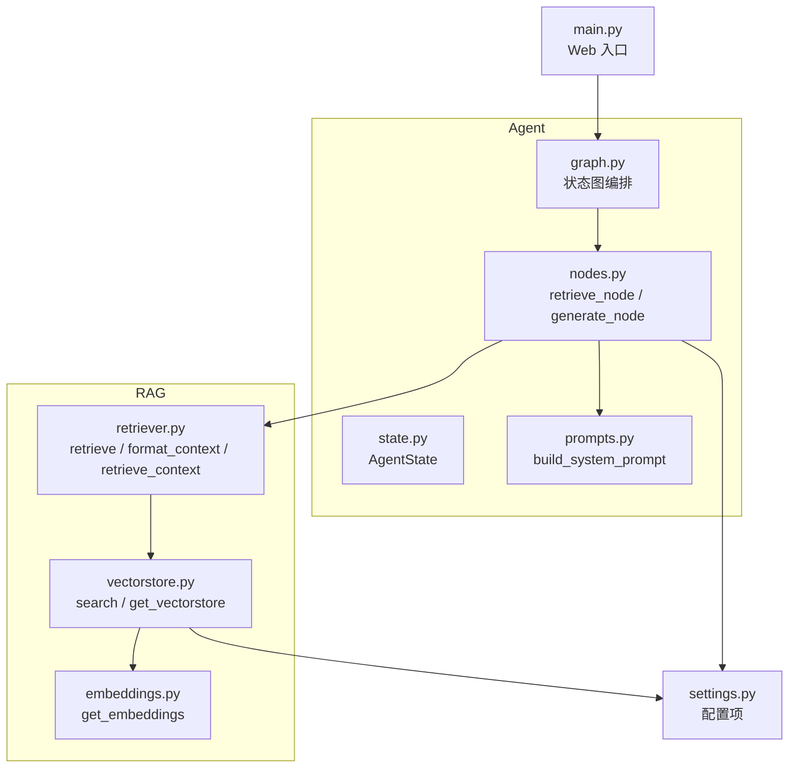
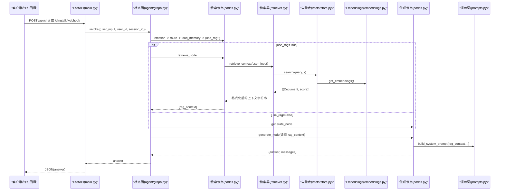
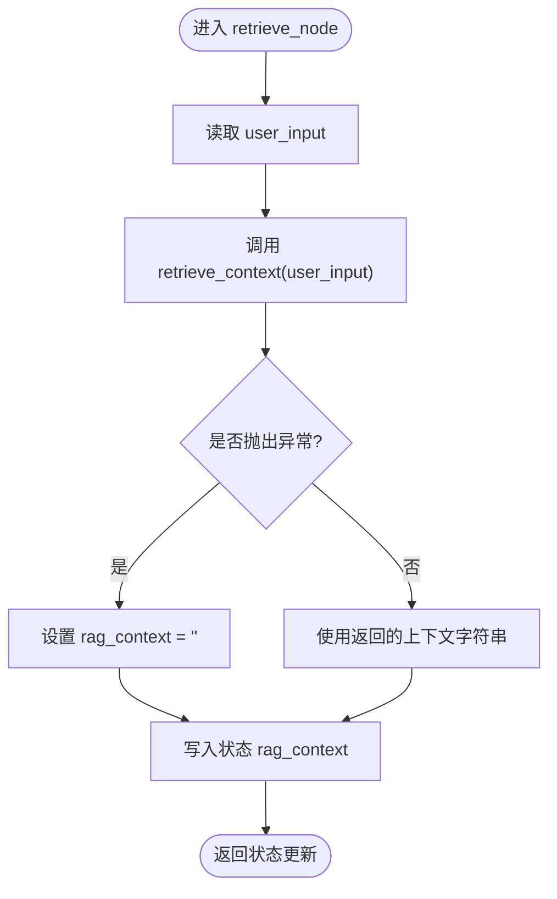
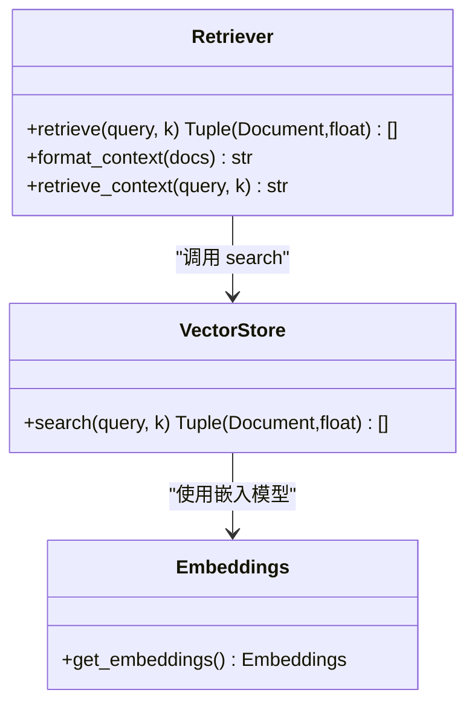
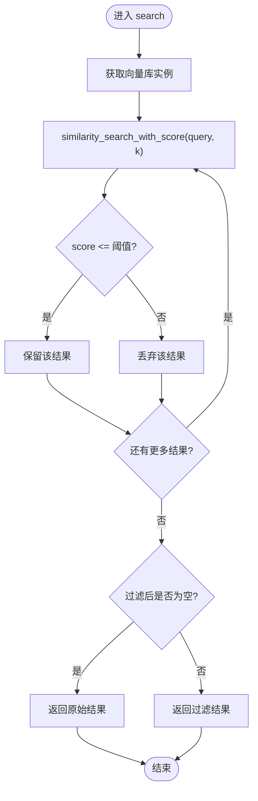
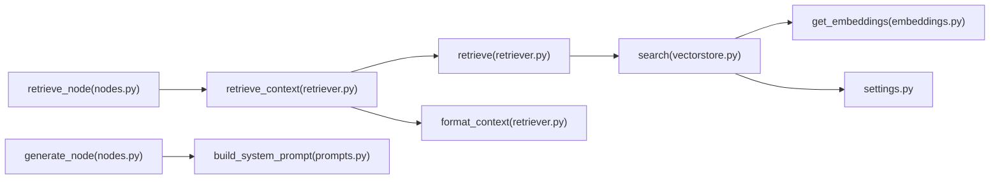

# 知识检索节点

<cite>
**本文引用的文件**   
- [agent/nodes.py](file://agent/nodes.py)
- [rag/retriever.py](file://rag/retriever.py)
- [rag/vectorstore.py](file://rag/vectorstore.py)
- [rag/embeddings.py](file://rag/embeddings.py)
- [agent/state.py](file://agent/state.py)
- [agent/prompts.py](file://agent/prompts.py)
- [agent/graph.py](file://agent/graph.py)
- [config/settings.py](file://config/settings.py)
- [main.py](file://main.py)
</cite>

## 目录
1. [简介](#简介)
2. [项目结构](#项目结构)
3. [核心组件](#核心组件)
4. [架构总览](#架构总览)
5. [详细组件分析](#详细组件分析)
6. [依赖关系分析](#依赖关系分析)
7. [性能考量](#性能考量)
8. [故障排查指南](#故障排查指南)
9. [结论](#结论)
10. [附录](#附录)

## 简介
本技术文档聚焦“知识检索节点”，系统性说明 retrieve_node 如何调用 rag.retriever 模块执行语义检索，包括 retrieve_context 的调用方式、检索结果格式处理与异常处理机制。同时解释节点的输入参数 user_input、输出字段 rag_context，以及检索失败时的降级策略；并描述 RAG 上下文的数据结构与内容格式，说明检索结果如何与系统提示词组装。最后提供检索流程的代码级示例路径、性能监控与调试技巧。

## 项目结构
围绕知识检索的关键代码分布在 agent 与 rag 两个子系统中：
- agent/nodes.py：定义工作流节点，包含 retrieve_node（RAG 检索节点）与 generate_node（生成回答节点）。
- rag/retriever.py：封装检索与格式化逻辑，提供 retrieve、format_context、retrieve_context。
- rag/vectorstore.py：向量库封装，提供 search 等能力。
- rag/embeddings.py：Embedding 模型管理。
- agent/state.py：AgentState 状态定义，包含 rag_context 字段。
- agent/prompts.py：系统提示词模板与构建函数，用于将 rag_context 注入提示词。
- agent/graph.py：LangGraph 状态图编排，决定何时进入 retrieve 分支。
- config/settings.py：全局配置，含检索相关阈值与持久化路径。
- main.py：Web 入口，触发智能体调用链。

图表来源
- [agent/nodes.py:75-86](file://agent/nodes.py#L75-L86)
- [rag/retriever.py:13-37](file://rag/retriever.py#L13-L37)
- [rag/vectorstore.py:48-68](file://rag/vectorstore.py#L48-L68)
- [rag/embeddings.py:21-40](file://rag/embeddings.py#L21-L40)
- [agent/state.py:20-44](file://agent/state.py#L20-L44)
- [agent/prompts.py:18-43](file://agent/prompts.py#L18-L43)
- [agent/graph.py:25-69](file://agent/graph.py#L25-L69)
- [config/settings.py:37-42](file://config/settings.py#L37-L42)
- [main.py:58-91](file://main.py#L58-L91)

章节来源
- [agent/nodes.py:75-86](file://agent/nodes.py#L75-L86)
- [rag/retriever.py:13-37](file://rag/retriever.py#L13-L37)
- [rag/vectorstore.py:48-68](file://rag/vectorstore.py#L48-L68)
- [rag/embeddings.py:21-40](file://rag/embeddings.py#L21-L40)
- [agent/state.py:20-44](file://agent/state.py#L20-L44)
- [agent/prompts.py:18-43](file://agent/prompts.py#L18-L43)
- [agent/graph.py:25-69](file://agent/graph.py#L25-L69)
- [config/settings.py:37-42](file://config/settings.py#L37-L42)
- [main.py:58-91](file://main.py#L58-L91)

## 核心组件
- retrieve_node：从状态中读取 user_input，调用 rag.retriever.retrieve_context 获取 rag_context，异常时降级为空字符串，最终写入状态。
- retriever.retrieve_context：一站式检索并格式化，内部调用 retrieve（语义检索）与 format_context（格式化），返回可直接拼接到提示词的字符串。
- vectorstore.search：基于 Chroma 的相似度检索，支持分数过滤与回退策略。
- embeddings.get_embeddings：本地 HuggingFace Embedding，默认使用中文模型，支持镜像加速与离线缓存。
- prompts.build_system_prompt：将 rag_context 以“参考资料”段落注入系统提示词。
- state.AgentState：定义 rag_context 字段类型与位置，供各节点读写。
- graph：通过条件边控制是否进入 retrieve 分支。

章节来源
- [agent/nodes.py:75-86](file://agent/nodes.py#L75-L86)
- [rag/retriever.py:13-37](file://rag/retriever.py#L13-L37)
- [rag/vectorstore.py:48-68](file://rag/vectorstore.py#L48-L68)
- [rag/embeddings.py:21-40](file://rag/embeddings.py#L21-L40)
- [agent/prompts.py:18-43](file://agent/prompts.py#L18-L43)
- [agent/state.py:20-44](file://agent/state.py#L20-L44)
- [agent/graph.py:54-59](file://agent/graph.py#L54-L59)

## 架构总览
下图展示一次用户请求从 Web 入口到检索与生成的完整调用序列，重点标注 retrieve_node 与 retriever 的交互。

图表来源
- [main.py:58-91](file://main.py#L58-L91)
- [agent/graph.py:25-69](file://agent/graph.py#L25-L69)
- [agent/nodes.py:75-86](file://agent/nodes.py#L75-L86)
- [rag/retriever.py:13-37](file://rag/retriever.py#L13-L37)
- [rag/vectorstore.py:48-68](file://rag/vectorstore.py#L48-L68)
- [rag/embeddings.py:21-40](file://rag/embeddings.py#L21-L40)
- [agent/prompts.py:18-43](file://agent/prompts.py#L18-L43)

## 详细组件分析

### 检索节点 retrieve_node
- 输入：从 AgentState 中读取 user_input。
- 行为：调用 rag.retriever.retrieve_context(user_input)，捕获异常并将 rag_context 置为空字符串作为降级。
- 输出：向状态写入 rag_context 字段。

图表来源
- [agent/nodes.py:75-86](file://agent/nodes.py#L75-L86)

章节来源
- [agent/nodes.py:75-86](file://agent/nodes.py#L75-L86)

### 检索器 retriever.retrieve_context
- 职责：一站式检索并格式化，直接返回可用于拼接提示词的字符串。
- 实现要点：
  - retrieve(query, k=4)：调用 vectorstore.search，返回 (Document, score) 列表。
  - format_context(docs)：为每个片段添加“来源”“标题”“相关度”等元信息，并按块拼接。
  - retrieve_context(query, k=4)：组合上述两步，返回字符串。

图表来源
- [rag/retriever.py:13-37](file://rag/retriever.py#L13-L37)
- [rag/vectorstore.py:48-68](file://rag/vectorstore.py#L48-L68)
- [rag/embeddings.py:21-40](file://rag/embeddings.py#L21-L40)

章节来源
- [rag/retriever.py:13-37](file://rag/retriever.py#L13-L37)

### 向量库搜索 vectorstore.search
- 功能：基于 Chroma 的相似度检索，支持 top-k 与分数过滤。
- 关键逻辑：
  - 使用 settings.rag_top_k 与 settings.rag_score_filter 控制检索数量与相关性阈值。
  - 若过滤后结果为空，回退返回原始结果，保证至少返回内容。
- 返回值：[(Document, score)]，score 越小越相关。

图表来源
- [rag/vectorstore.py:48-68](file://rag/vectorstore.py#L48-L68)
- [config/settings.py:37-42](file://config/settings.py#L37-L42)

章节来源
- [rag/vectorstore.py:48-68](file://rag/vectorstore.py#L48-L68)
- [config/settings.py:37-42](file://config/settings.py#L37-L42)

### 嵌入模型 embeddings.get_embeddings
- 作用：提供本地 HuggingFace 中文 Embedding 单例，支持镜像加速与离线缓存。
- 特点：首次调用下载模型权重至本地缓存，后续可离线运行。

章节来源
- [rag/embeddings.py:21-40](file://rag/embeddings.py#L21-L40)

### 状态与提示词组装
- AgentState：包含 rag_context 字段，类型为字符串，由 retrieve_node 写入。
- build_system_prompt：将 rag_context 以“参考资料”段落注入系统提示词，供 LLM 优先参考。

章节来源
- [agent/state.py:20-44](file://agent/state.py#L20-L44)
- [agent/prompts.py:18-43](file://agent/prompts.py#L18-L43)

### 工作流路由与分支
- graph.add_conditional_edges：在 load_memory 之后根据 use_rag 分流到 retrieve 或 generate。
- nodes.route_condition：use_rag=True 则走 retrieve，否则直接 generate。

章节来源
- [agent/graph.py:54-59](file://agent/graph.py#L54-L59)
- [agent/nodes.py:70-72](file://agent/nodes.py#L70-L72)

## 依赖关系分析
- retrieve_node 依赖 rag.retriever.retrieve_context。
- retriever.retrieve_context 依赖 retriever.retrieve 与 format_context。
- retriever.retrieve 依赖 vectorstore.search。
- vectorstore.search 依赖 embeddings.get_embeddings 与 settings。
- generate_node 依赖 prompts.build_system_prompt 以组装 rag_context。

图表来源
- [agent/nodes.py:75-86](file://agent/nodes.py#L75-L86)
- [rag/retriever.py:13-37](file://rag/retriever.py#L13-L37)
- [rag/vectorstore.py:48-68](file://rag/vectorstore.py#L48-L68)
- [rag/embeddings.py:21-40](file://rag/embeddings.py#L21-L40)
- [agent/prompts.py:18-43](file://agent/prompts.py#L18-L43)
- [config/settings.py:37-42](file://config/settings.py#L37-L42)

章节来源
- [agent/nodes.py:75-86](file://agent/nodes.py#L75-L86)
- [rag/retriever.py:13-37](file://rag/retriever.py#L13-L37)
- [rag/vectorstore.py:48-68](file://rag/vectorstore.py#L48-L68)
- [rag/embeddings.py:21-40](file://rag/embeddings.py#L21-L40)
- [agent/prompts.py:18-43](file://agent/prompts.py#L18-L43)
- [config/settings.py:37-42](file://config/settings.py#L37-L42)

## 性能考量
- 检索数量 k：可通过 settings.rag_top_k 调整，影响向量库查询与后续格式化成本。
- 分数阈值 rag_score_filter：过滤低相关度结果，减少无效上下文长度，降低 LLM 负载。
- 向量库持久化：Chroma 持久化到 data/chroma，避免重复入库与加载开销。
- Embedding 模型：本地模型首次下载耗时，后续离线可用；CPU 推理适合轻量部署。
- 建议监控点：
  - 记录每次检索返回的片段数量与平均分数。
  - 统计 format_context 的输出长度，避免过长导致 LLM 响应变慢。
  - 对 vectorstore.search 与 retriever.retrieve_context 增加计时日志。

[本节为通用指导，不直接分析具体文件]

## 故障排查指南
- 检索失败降级：
  - retrieve_node 捕获异常后将 rag_context 置为空字符串，确保生成节点仍可继续执行。
- 检索结果为空：
  - 检查 settings.rag_score_filter 是否过严，必要时放宽阈值。
  - 确认向量库已正确入库数据（data/chroma 是否存在集合与文档）。
- 嵌入模型不可用：
  - 检查 HF_ENDPOINT 与网络环境，必要时启用离线模式。
- 提示词未包含参考资料：
  - 确认 generate_node 是否正确读取 rag_context 并传入 build_system_prompt。
- 调试技巧：
  - 在 retrieve_node 与 retriever.retrieve_context 处打印中间结果（如片段数、分数分布）。
  - 使用 main.py 的 REPL 模式进行交互式测试，观察 rag_context 内容与最终答案。

章节来源
- [agent/nodes.py:75-86](file://agent/nodes.py#L75-L86)
- [rag/vectorstore.py:48-68](file://rag/vectorstore.py#L48-L68)
- [rag/embeddings.py:21-40](file://rag/embeddings.py#L21-L40)
- [agent/prompts.py:18-43](file://agent/prompts.py#L18-L43)
- [main.py:179-210](file://main.py#L179-L210)

## 结论
retrieve_node 通过调用 rag.retriever.retrieve_context 完成语义检索与上下文格式化，并以 rag_context 字段写入状态。检索失败时采用空字符串降级，保障生成流程稳定。RAG 上下文以结构化文本呈现，便于 LLM 优先参考。结合向量库分数过滤与本地 Embedding 模型，系统在性能与可用性之间取得平衡。通过合理配置与监控，可进一步优化检索质量与响应速度。

[本节为总结性内容，不直接分析具体文件]

## 附录

### 检索流程代码级示例路径
- 检索节点调用：
  - [agent/nodes.py:75-86](file://agent/nodes.py#L75-L86)
- 检索与格式化：
  - [rag/retriever.py:13-37](file://rag/retriever.py#L13-L37)
- 向量库搜索：
  - [rag/vectorstore.py:48-68](file://rag/vectorstore.py#L48-L68)
- 嵌入模型：
  - [rag/embeddings.py:21-40](file://rag/embeddings.py#L21-L40)
- 提示词组装：
  - [agent/prompts.py:18-43](file://agent/prompts.py#L18-L43)
- 状态定义：
  - [agent/state.py:20-44](file://agent/state.py#L20-L44)
- 工作流路由：
  - [agent/graph.py:54-59](file://agent/graph.py#L54-L59)
- Web 入口调用：
  - [main.py:58-91](file://main.py#L58-L91)

### RAG 上下文数据结构与内容格式
- 数据来源：vectorstore.search 返回的 (Document, score)。
- 格式化规则：format_context 为每个片段添加“来源”“标题”“相关度”等元信息，按块拼接成字符串。
- 注入方式：build_system_prompt 将 rag_context 以“参考资料”段落插入系统提示词。

章节来源
- [rag/retriever.py:18-31](file://rag/retriever.py#L18-L31)
- [agent/prompts.py:33-43](file://agent/prompts.py#L33-L43)

### 检索失败降级策略
- retrieve_node 捕获异常后设置 rag_context 为空字符串，确保下游生成节点仍可执行。
- vectorstore.search 在过滤后为空时回退返回原始结果，保证至少返回内容。

章节来源
- [agent/nodes.py:81-86](file://agent/nodes.py#L81-L86)
- [rag/vectorstore.py:64-68](file://rag/vectorstore.py#L64-L68)