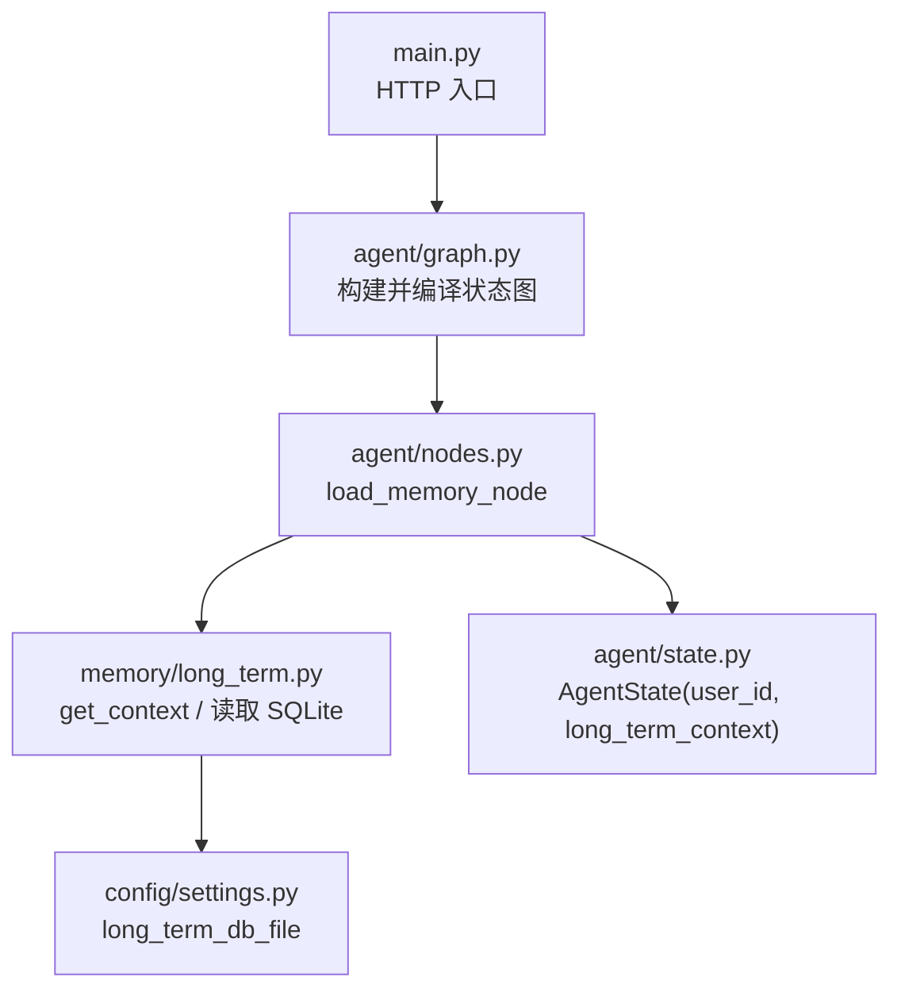
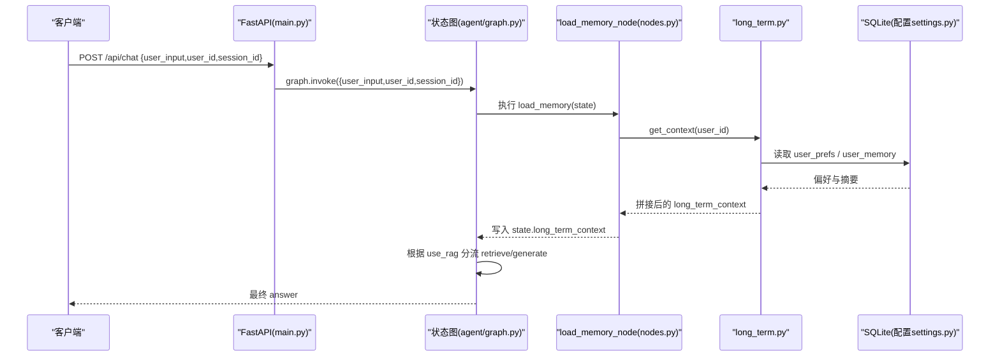
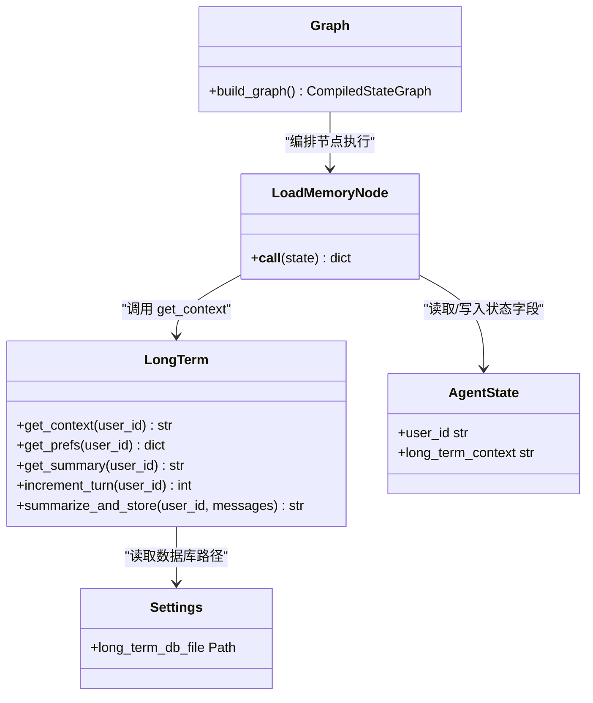

# 记忆加载节点

<cite>
**本文引用的文件**   
- [agent/nodes.py](file://agent/nodes.py)
- [memory/long_term.py](file://memory/long_term.py)
- [agent/graph.py](file://agent/graph.py)
- [config/settings.py](file://config/settings.py)
- [main.py](file://main.py)
- [agent/state.py](file://agent/state.py)
</cite>

## 目录
1. [简介](#简介)
2. [项目结构](#项目结构)
3. [核心组件](#核心组件)
4. [架构总览](#架构总览)
5. [详细组件分析](#详细组件分析)
6. [依赖关系分析](#依赖关系分析)
7. [性能考量](#性能考量)
8. [故障排查指南](#故障排查指南)
9. [结论](#结论)
10. [附录](#附录)

## 简介
本技术文档聚焦“记忆加载节点”，详细说明 load_memory_node 如何从 SQLite 数据库加载用户的长期记忆上下文，包括 get_context 的调用方式、user_id 的获取与处理逻辑、输入输出字段定义、异常处理机制，以及长期记忆数据的存储格式与内容结构。同时解释长期记忆上下文如何与对话历史结合用于生成回答，并提供使用示例、数据库操作最佳实践、性能优化与错误恢复策略。

## 项目结构
围绕记忆加载的相关代码分布在以下模块：
- agent/nodes.py：定义工作流节点，包含 load_memory_node
- memory/long_term.py：实现长期记忆的 SQLite 存取与上下文拼装
- agent/graph.py：编排状态图，决定节点执行顺序与条件分支
- config/settings.py：提供数据库路径等配置
- main.py：Web 入口，传入 user_id/session_id 到状态图
- agent/state.py：定义 AgentState 状态字段（含 user_id、long_term_context）

图表来源 
- [agent/graph.py:25-69](file://agent/graph.py#L25-L69)
- [agent/nodes.py:89-100](file://agent/nodes.py#L89-L100)
- [memory/long_term.py:150-162](file://memory/long_term.py#L150-L162)
- [config/settings.py:73-79](file://config/settings.py#L73-L79)
- [agent/state.py:20-46](file://agent/state.py#L20-L46)

章节来源
- [agent/graph.py:1-106](file://agent/graph.py#L1-L106)
- [agent/nodes.py:1-164](file://agent/nodes.py#L1-L164)
- [memory/long_term.py:1-244](file://memory/long_term.py#L1-L244)
- [config/settings.py:1-93](file://config/settings.py#L1-L93)
- [main.py:58-91](file://main.py#L58-L91)
- [agent/state.py:1-47](file://agent/state.py#L1-L47)

## 核心组件
- load_memory_node：从状态中取 user_id，调用 memory.long_term.get_context，返回 long_term_context
- memory.long_term.get_context：拼接用户偏好与摘要为上下文字符串
- SQLite 持久化：通过 _get_conn 单例连接，WAL 模式提升并发读能力
- 配置 settings：long_term_db_path 映射为绝对路径 long_term_db_file

章节来源
- [agent/nodes.py:89-100](file://agent/nodes.py#L89-L100)
- [memory/long_term.py:150-162](file://memory/long_term.py#L150-L162)
- [memory/long_term.py:24-41](file://memory/long_term.py#L24-L41)
- [config/settings.py:73-79](file://config/settings.py#L73-L79)

## 架构总览
记忆加载节点在状态图中的位置与数据流如下：

图表来源 
- [main.py:58-91](file://main.py#L58-L91)
- [agent/graph.py:25-69](file://agent/graph.py#L25-L69)
- [agent/nodes.py:89-100](file://agent/nodes.py#L89-L100)
- [memory/long_term.py:150-162](file://memory/long_term.py#L150-L162)
- [config/settings.py:73-79](file://config/settings.py#L73-L79)

## 详细组件分析

### load_memory_node 函数行为
- 输入：从 AgentState 中读取 user_id（默认空字符串）
- 处理：调用 memory.long_term.get_context(user_id)
- 输出：将结果写入 state.long_term_context；若异常则记录日志并返回空字符串
- 异常处理：捕获所有异常，打印失败信息，降级为空上下文，保证流程不中断

章节来源
- [agent/nodes.py:89-100](file://agent/nodes.py#L89-L100)

### get_context 调用与 user_id 处理
- 调用方式：直接以 user_id 字符串作为参数
- user_id 校验：若为空，直接返回空字符串，避免无意义查询
- 数据来源：
  - 用户偏好：从 user_prefs 表按 user_id 读取 key/value 对
  - 最新摘要：从 user_memory 表按 user_id 读取 summary
- 组装规则：将偏好与摘要拼接为“已知用户偏好: ... | 历史对话摘要: ...”形式的字符串

章节来源
- [memory/long_term.py:150-162](file://memory/long_term.py#L150-L162)
- [memory/long_term.py:116-124](file://memory/long_term.py#L116-L124)
- [memory/long_term.py:127-135](file://memory/long_term.py#L127-L135)

### 数据库连接与异常处理机制
- 连接管理：_get_conn 维护进程内单例连接，开启 WAL 模式与 busy_timeout，减少写阻塞
- 线程安全：写操作通过 threading.Lock 串行化，避免并发写冲突
- 初始化：首次连接时创建三张表（user_memory、user_prefs、summary_history），幂等
- 异常策略：
  - load_memory_node 层捕获异常并降级为空上下文
  - long_term.py 内部读写均基于已建立连接，异常由上层统一处理
  - 健康检查与健康端点可辅助判断服务状态

章节来源
- [memory/long_term.py:24-41](file://memory/long_term.py#L24-L41)
- [memory/long_term.py:44-72](file://memory/long_term.py#L44-L72)
- [agent/nodes.py:95-99](file://agent/nodes.py#L95-L99)
- [main.py:94-103](file://main.py#L94-L103)

### 长期记忆数据存储格式与内容结构
- user_memory：保存每个用户的最新摘要、更新时间与轮次计数
- user_prefs：键值型偏好存储（如姓名、角色、关注点等）
- summary_history：摘要历史表，保留最近若干条，便于回溯与分析
- 索引：summary_history 按 user_id、created_at 降序索引，加速历史查询

章节来源
- [memory/long_term.py:44-72](file://memory/long_term.py#L44-L72)
- [memory/long_term.py:138-147](file://memory/long_term.py#L138-L147)

### 记忆上下文与对话历史的结合
- generate_node 将 system_prompt 与历史消息（最近若干条）及当前输入组合
- long_term_context 作为系统提示的一部分注入，使模型具备跨会话的个性化背景
- 情感分析与 RAG 上下文也一并注入，形成多维上下文

章节来源
- [agent/nodes.py:104-141](file://agent/nodes.py#L104-L141)

### 使用示例
- Web 接口调用：POST /api/chat，请求体包含 user_input、user_id、session_id
- REPL 调试：python main.py --repl，交互式测试，user_id 与 session_id 可自定义
- 状态流转：graph.invoke 接收初始状态，load_memory_node 写入 long_term_context，后续节点消费该字段

章节来源
- [main.py:58-91](file://main.py#L58-L91)
- [main.py:179-210](file://main.py#L179-L210)
- [agent/graph.py:84-106](file://agent/graph.py#L84-L106)

### 数据库操作最佳实践
- 使用 WAL 模式与 busy_timeout 提升并发读能力与稳定性
- 写操作加锁串行化，避免 SQLite 并发写冲突
- 合理限制摘要历史长度（例如最近 20 条），控制存储增长
- 定期清理或归档历史摘要，避免单用户数据膨胀
- 使用参数化 SQL 防止注入风险
- 通过 settings 集中管理数据库路径，确保路径存在且可写

章节来源
- [memory/long_term.py:24-41](file://memory/long_term.py#L24-L41)
- [memory/long_term.py:94-99](file://memory/long_term.py#L94-L99)
- [config/settings.py:73-79](file://config/settings.py#L73-L79)

### 性能优化建议
- 连接复用：_get_conn 单例避免重复连接开销
- 只读优先：WAL 模式下读不阻塞，适合高频问答场景
- 摘要频率：通过 memory_summary_every 控制摘要触发频率，平衡实时性与成本
- 索引利用：summary_history 的复合索引提升按用户与时间排序查询效率
- 降级策略：LLM 不可用时回退简单截断，保障可用性

章节来源
- [memory/long_term.py:24-41](file://memory/long_term.py#L24-L41)
- [memory/long_term.py:237-243](file://memory/long_term.py#L237-L243)
- [config/settings.py:44-47](file://config/settings.py#L44-L47)

### 错误恢复策略
- 节点级异常捕获：load_memory_node 捕获异常并返回空上下文，保证流程继续
- LLM 摘要失败：降级为文本截断，避免中断
- 健康检查：/health 暴露 checkpointer 类型与服务状态，便于监控
- 日志记录：关键异常打印日志，便于定位问题

章节来源
- [agent/nodes.py:95-99](file://agent/nodes.py#L95-L99)
- [memory/long_term.py:237-243](file://memory/long_term.py#L237-L243)
- [main.py:94-103](file://main.py#L94-L103)

## 依赖关系分析
- load_memory_node 依赖 memory.long_term.get_context
- get_context 依赖 get_prefs 与 get_summary，二者均依赖 SQLite 连接
- 连接配置来自 config.settings.Settings.long_term_db_file
- 状态字段 user_id 与 long_term_context 由 agent.state.AgentState 定义
- 状态图编排由 agent.graph.build_graph 决定执行顺序与条件分支

图表来源 
- [agent/nodes.py:89-100](file://agent/nodes.py#L89-L100)
- [memory/long_term.py:150-162](file://memory/long_term.py#L150-L162)
- [config/settings.py:73-79](file://config/settings.py#L73-L79)
- [agent/state.py:20-46](file://agent/state.py#L20-L46)
- [agent/graph.py:25-69](file://agent/graph.py#L25-L69)

章节来源
- [agent/nodes.py:89-100](file://agent/nodes.py#L89-L100)
- [memory/long_term.py:150-162](file://memory/long_term.py#L150-L162)
- [config/settings.py:73-79](file://config/settings.py#L73-L79)
- [agent/state.py:20-46](file://agent/state.py#L20-L46)
- [agent/graph.py:25-69](file://agent/graph.py#L25-L69)

## 性能考量
- SQLite WAL 模式提升并发读能力，适合高 QPS 问答场景
- 连接单例与锁机制降低资源竞争与冲突
- 摘要历史限制长度，控制存储与查询开销
- 合理的摘要触发频率（memory_summary_every）平衡更新成本与上下文质量
- 降级策略确保外部依赖（LLM）不可用时的可用性

[本节为通用指导，不直接分析具体文件]

## 故障排查指南
- 确认数据库路径有效：检查 settings.long_term_db_path 与 long_term_db_file 生成的绝对路径是否存在且可写
- 查看健康端点：/health 返回 checkpointer 类型与服务状态
- 检查日志：load_memory_node 与 long_term 模块的异常打印有助于定位问题
- 验证 user_id：确保传入非空 user_id，否则 get_context 直接返回空字符串
- 观察摘要历史：summary_history 表是否持续增长，必要时清理旧记录

章节来源
- [main.py:94-103](file://main.py#L94-L103)
- [agent/nodes.py:95-99](file://agent/nodes.py#L95-L99)
- [memory/long_term.py:94-99](file://memory/long_term.py#L94-L99)

## 结论
load_memory_node 通过简洁的状态读取与 get_context 调用，将用户偏好与历史摘要整合为 long_term_context，为生成阶段提供个性化背景。SQLite 的 WAL 模式与连接单例保障了并发读性能，节点级异常捕获与降级策略提升了鲁棒性。配合合理的摘要频率与历史长度限制，可在性能与质量之间取得良好平衡。

[本节为总结，不直接分析具体文件]

## 附录
- 快速上手
  - 启动服务：uvicorn main:app --host 0.0.0.0 --port 8000 --reload
  - 健康检查：GET /health
  - 聊天接口：POST /api/chat，请求体包含 user_input、user_id、session_id
- 关键路径
  - 数据库文件路径：config/settings.py 中的 long_term_db_path 与 long_term_db_file
  - 状态字段：agent/state.py 中的 AgentState.user_id 与 AgentState.long_term_context
  - 节点编排：agent/graph.py 中的 build_graph 与 add_conditional_edges

章节来源
- [main.py:212-231](file://main.py#L212-L231)
- [config/settings.py:73-79](file://config/settings.py#L73-L79)
- [agent/state.py:20-46](file://agent/state.py#L20-L46)
- [agent/graph.py:25-69](file://agent/graph.py#L25-L69)