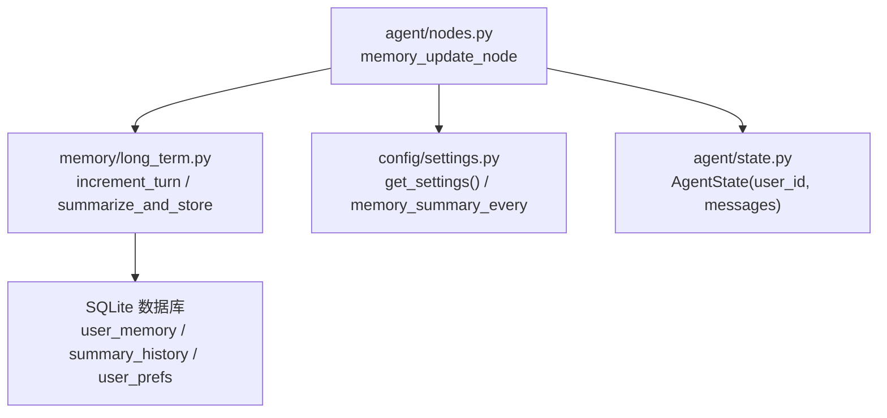
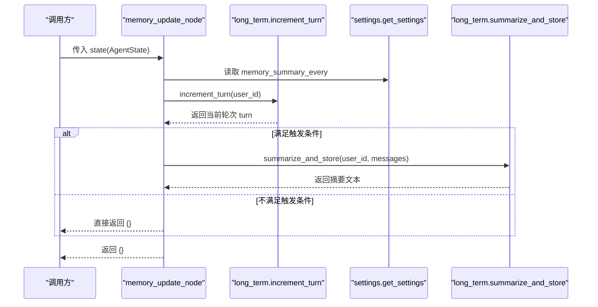
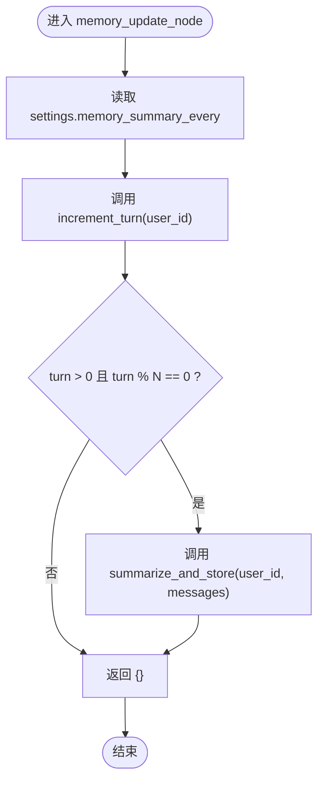
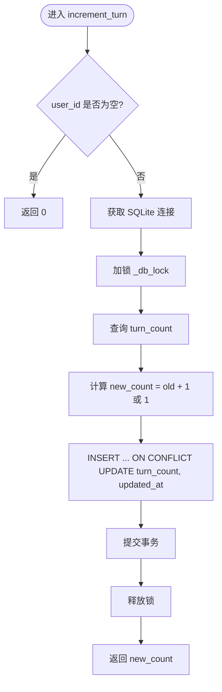
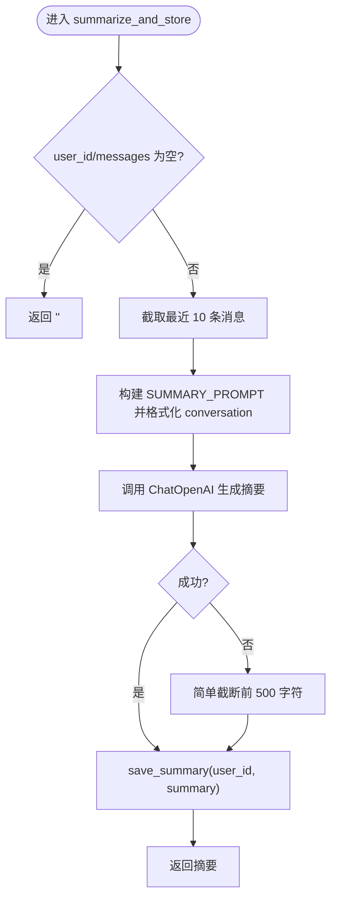
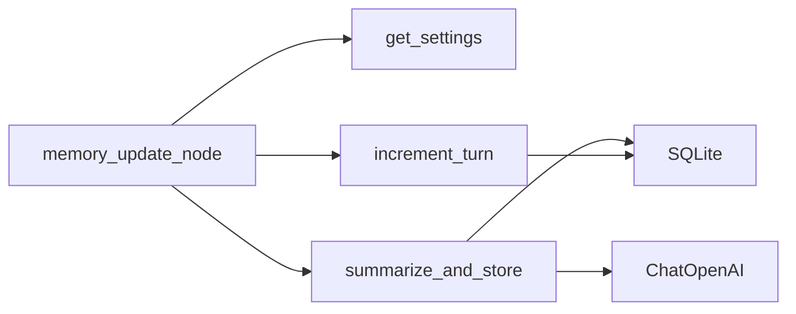

# 记忆更新节点

<cite>
**本文引用的文件**   
- [agent/nodes.py](file://agent/nodes.py)
- [memory/long_term.py](file://memory/long_term.py)
- [config/settings.py](file://config/settings.py)
- [agent/state.py](file://agent/state.py)
</cite>

## 目录
1. [简介](#简介)
2. [项目结构](#项目结构)
3. [核心组件](#核心组件)
4. [架构总览](#架构总览)
5. [详细组件分析](#详细组件分析)
6. [依赖关系分析](#依赖关系分析)
7. [性能考量](#性能考量)
8. [故障排查指南](#故障排查指南)
9. [结论](#结论)
10. [附录](#附录)

## 简介
本文件为“记忆更新节点”的完整技术文档，聚焦 memory_update_node 函数的周期性摘要生成机制。内容涵盖：
- increment_turn 的轮次计数逻辑
- summarize_and_store 的摘要生成与存储策略
- 基于配置项 memory_summary_every 的频率控制
- user_id 与消息历史的处理方式
- 输入参数（user_id、messages）、输出格式（空字典表示不修改状态）
- 异常处理的容错机制
- 配置示例与自定义摘要策略
- 内存管理与数据持久化的最佳实践

## 项目结构
记忆更新功能涉及三个关键模块：
- agent/nodes.py：定义 memory_update_node 节点，负责周期触发与调用长期记忆模块
- memory/long_term.py：实现增量轮次计数、摘要生成与 SQLite 持久化
- config/settings.py：提供全局配置，包括 memory_summary_every 等
- agent/state.py：定义 AgentState 数据结构，包含 user_id、messages 等字段

图表来源
- [agent/nodes.py:145-163](file://agent/nodes.py#L145-L163)
- [memory/long_term.py:165-244](file://memory/long_term.py#L165-L244)
- [config/settings.py:44-48](file://config/settings.py#L44-L48)
- [agent/state.py:20-44](file://agent/state.py#L20-L44)

章节来源
- [agent/nodes.py:145-163](file://agent/nodes.py#L145-L163)
- [memory/long_term.py:165-244](file://memory/long_term.py#L165-L244)
- [config/settings.py:44-48](file://config/settings.py#L44-L48)
- [agent/state.py:20-44](file://agent/state.py#L20-L44)

## 核心组件
- memory_update_node：周期性检查并触发摘要生成
- increment_turn：按用户维度递增对话轮次计数
- summarize_and_store：对最近消息进行 LLM 摘要并写入长期记忆
- get_settings：读取 memory_summary_every 等配置

章节来源
- [agent/nodes.py:145-163](file://agent/nodes.py#L145-L163)
- [memory/long_term.py:165-244](file://memory/long_term.py#L165-L244)
- [config/settings.py:44-48](file://config/settings.py#L44-L48)

## 架构总览
memory_update_node 在每次执行时：
- 从 AgentState 中获取 user_id 和 messages
- 通过 increment_turn 增加该用户的对话轮次
- 当 turn % memory_summary_every == 0 时，调用 summarize_and_store 生成摘要并持久化
- 返回空字典，不改变状态

图表来源
- [agent/nodes.py:145-163](file://agent/nodes.py#L145-L163)
- [memory/long_term.py:165-244](file://memory/long_term.py#L165-L244)
- [config/settings.py:44-48](file://config/settings.py#L44-L48)

## 详细组件分析

### memory_update_node：周期性摘要触发器
- 输入：state（AgentState），包含 user_id、messages
- 处理流程：
  - 读取 settings.memory_summary_every
  - 调用 increment_turn(user_id) 获取当前轮次
  - 若 turn > 0 且 turn % memory_summary_every == 0，则调用 summarize_and_store(user_id, messages)
- 输出：空字典 {}，表示不修改状态
- 异常处理：捕获异常并打印日志，确保节点健壮性

图表来源
- [agent/nodes.py:145-163](file://agent/nodes.py#L145-L163)

章节来源
- [agent/nodes.py:145-163](file://agent/nodes.py#L145-L163)

### increment_turn：轮次计数逻辑
- 作用：按 user_id 维度维护 turn_count，首次出现初始化为 1，后续每次 +1
- 实现要点：
  - 使用 SQLite 表 user_memory.turn_count 持久化
  - 线程安全：通过 _db_lock 串行化写操作
  - 幂等插入：ON CONFLICT 更新 turn_count 与 updated_at
- 返回值：当前轮次整数

图表来源
- [memory/long_term.py:165-184](file://memory/long_term.py#L165-L184)

章节来源
- [memory/long_term.py:165-184](file://memory/long_term.py#L165-L184)

### summarize_and_store：摘要生成与存储策略
- 输入：user_id、messages（BaseMessage 列表）
- 处理流程：
  - 过滤并拼接最近最多 10 条消息为对话文本
  - 调用 LLM（ChatOpenAI）生成简洁摘要
  - 失败回退：LLM 不可用时截断前 500 字符作为摘要
  - 持久化：写入 user_memory.summary 与 summary_history（保留最近 20 条）
- 返回值：生成的摘要字符串

图表来源
- [memory/long_term.py:203-244](file://memory/long_term.py#L203-L244)

章节来源
- [memory/long_term.py:203-244](file://memory/long_term.py#L203-L244)

### 配置项 memory_summary_every 的作用
- 位置：config/settings.py 中的 Settings.memory_summary_every
- 默认值：6（每 6 轮触发一次摘要）
- 行为：memory_update_node 中判断 turn % memory_summary_every == 0 决定是否生成摘要

章节来源
- [config/settings.py:44-48](file://config/settings.py#L44-L48)
- [agent/nodes.py:145-163](file://agent/nodes.py#L145-L163)

### 用户 ID 与消息历史的处理方式
- user_id：用于区分不同用户的记忆与轮次计数，所有持久化操作均按 user_id 隔离
- messages：仅取最近若干条（如 10 条）参与摘要生成，避免过长上下文导致 LLM 超时或成本过高
- AgentState.messages：由 LangGraph reducer 自动累加，保证多轮对话历史连续性

章节来源
- [agent/state.py:20-44](file://agent/state.py#L20-L44)
- [memory/long_term.py:203-244](file://memory/long_term.py#L203-L244)

### 输入参数与输出格式
- 输入：state（AgentState），关键字段 user_id、messages
- 输出：空字典 {}，表示不修改状态，符合 LangGraph 节点约定

章节来源
- [agent/nodes.py:145-163](file://agent/nodes.py#L145-L163)
- [agent/state.py:20-44](file://agent/state.py#L20-L44)

### 异常处理的容错机制
- memory_update_node：捕获异常并打印日志，不影响主流程
- summarize_and_store：LLM 调用失败时回退到简单截断，确保摘要仍可保存
- SQLite 写操作：通过 _db_lock 保证并发安全，WAL 模式提升读性能

章节来源
- [agent/nodes.py:154-161](file://agent/nodes.py#L154-L161)
- [memory/long_term.py:237-241](file://memory/long_term.py#L237-L241)
- [memory/long_term.py:19-41](file://memory/long_term.py#L19-L41)

## 依赖关系分析
- memory_update_node 依赖：
  - config.settings.get_settings：读取 memory_summary_every
  - memory.long_term.increment_turn：轮次计数
  - memory.long_term.summarize_and_store：摘要生成与持久化
- long_term 模块依赖：
  - sqlite3：本地数据库
  - langchain_openai.ChatOpenAI：LLM 调用
  - threading.Lock：并发安全

图表来源
- [agent/nodes.py:145-163](file://agent/nodes.py#L145-L163)
- [memory/long_term.py:165-244](file://memory/long_term.py#L165-L244)
- [config/settings.py:44-48](file://config/settings.py#L44-L48)

章节来源
- [agent/nodes.py:145-163](file://agent/nodes.py#L145-L163)
- [memory/long_term.py:165-244](file://memory/long_term.py#L165-L244)
- [config/settings.py:44-48](file://config/settings.py#L44-L48)

## 性能考量
- 摘要频率：memory_summary_every 越大，摘要生成越少，降低 LLM 调用成本
- 消息裁剪：仅取最近 10 条消息，减少 LLM 输入长度
- 数据库优化：WAL 模式提升读性能；summary_history 限制最近 20 条，控制表大小
- 并发安全：_db_lock 串行化写操作，避免竞争条件

[本节为通用性能建议，不直接分析具体文件]

## 故障排查指南
- 症状：未生成摘要
  - 检查 memory_summary_every 是否过大
  - 确认 increment_turn 返回值是否满足整除条件
- 症状：摘要内容为空或截断
  - 检查 LLM 可用性（API Key、Base URL）
  - 查看 fallback 逻辑是否被触发
- 症状：数据库写入失败
  - 检查 SQLite 文件路径与权限
  - 查看 _db_lock 是否被长时间占用

章节来源
- [agent/nodes.py:154-161](file://agent/nodes.py#L154-L161)
- [memory/long_term.py:237-241](file://memory/long_term.py#L237-L241)
- [memory/long_term.py:19-41](file://memory/long_term.py#L19-L41)

## 结论
memory_update_node 通过轮次计数与配置频率控制，实现了高效、健壮的长期记忆摘要生成。结合 SQLite 持久化与 LLM 摘要能力，系统在低开销下提供了跨会话的用户记忆支持。合理配置 memory_summary_every 与消息裁剪策略，可在性能与效果间取得平衡。

[本节为总结性内容，不直接分析具体文件]

## 附录

### 配置示例
- 环境变量或 .env 设置：
  - MEMORY_SUMMARY_EVERY=6（默认值，可调整）
  - LONG_TERM_DB_PATH=data/memory.db
- 代码中通过 get_settings().memory_summary_every 读取

章节来源
- [config/settings.py:44-48](file://config/settings.py#L44-L48)

### 自定义摘要策略
- 修改 SUMMARY_PROMPT：调整提示词以定制摘要风格
- 替换 LLM：在 summarize_and_store 中更换模型或后端
- 调整消息裁剪：修改截取最近消息数量（如从 10 改为 5）

章节来源
- [memory/long_term.py:197-201](file://memory/long_term.py#L197-L201)
- [memory/long_term.py:217-221](file://memory/long_term.py#L217-L221)
- [memory/long_term.py:223-236](file://memory/long_term.py#L223-L236)

### 内存管理与数据持久化最佳实践
- 定期清理 summary_history，避免无限增长（已内置保留最近 20 条）
- 使用 WAL 模式提升读性能，写操作串行化保证一致性
- 对用户敏感信息脱敏后再存入摘要
- 监控 LLM 调用失败率，必要时降级为规则摘要

章节来源
- [memory/long_term.py:93-99](file://memory/long_term.py#L93-L99)
- [memory/long_term.py:37-41](file://memory/long_term.py#L37-L41)