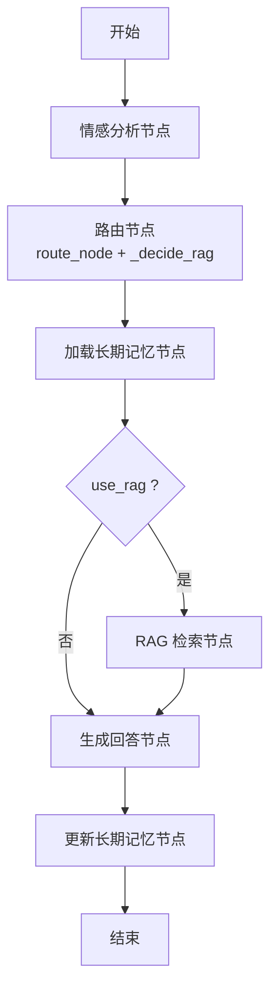
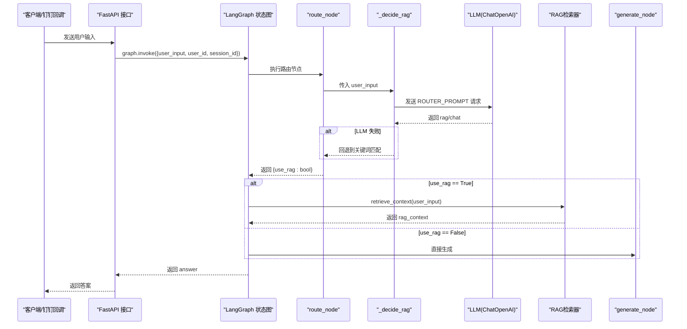
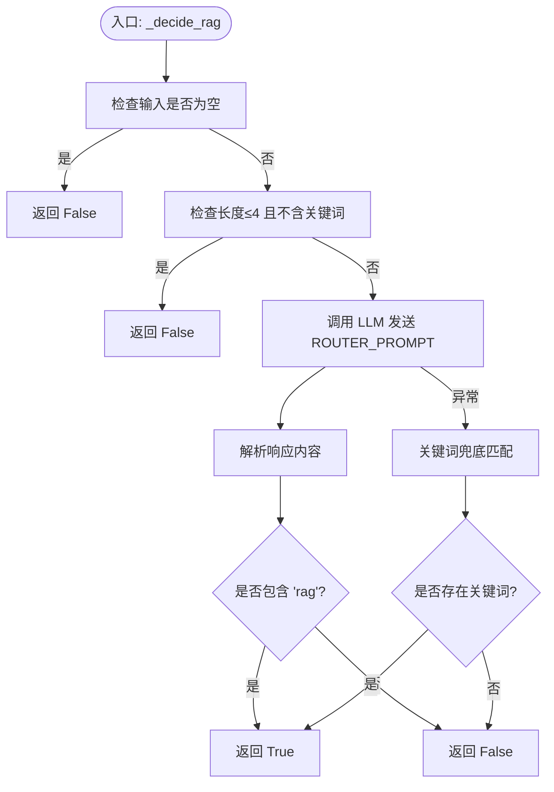
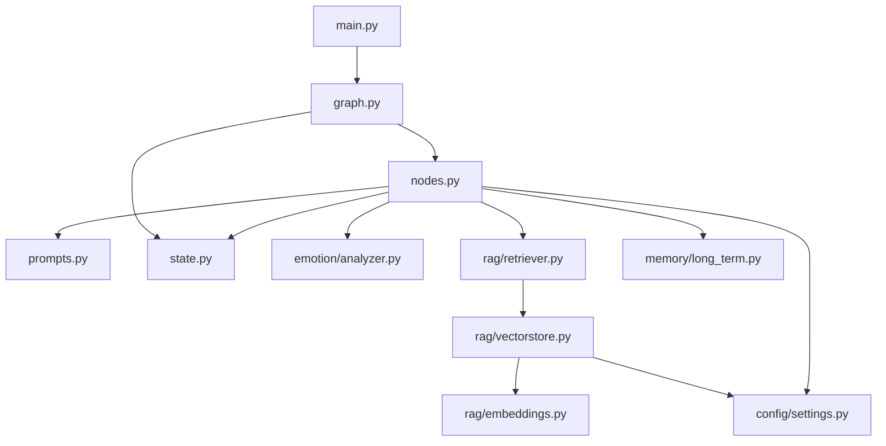

# 路由决策节点

<cite>
**本文引用的文件**   
- [agent/nodes.py](file://agent/nodes.py)
- [agent/prompts.py](file://agent/prompts.py)
- [agent/state.py](file://agent/state.py)
- [agent/graph.py](file://agent/graph.py)
- [rag/retriever.py](file://rag/retriever.py)
- [rag/vectorstore.py](file://rag/vectorstore.py)
- [config/settings.py](file://config/settings.py)
- [main.py](file://main.py)
</cite>

## 目录
1. [简介](#简介)
2. [项目结构](#项目结构)
3. [核心组件](#核心组件)
4. [架构总览](#架构总览)
5. [详细组件分析](#详细组件分析)
6. [依赖关系分析](#依赖关系分析)
7. [性能考量](#性能考量)
8. [故障排查指南](#故障排查指南)
9. [结论](#结论)
10. [附录：调用示例与最佳实践](#附录调用示例与最佳实践)

## 简介
本章节聚焦“路由决策节点”，围绕 route_node 函数与 _decide_rag 辅助函数的实现逻辑，系统阐述 LLM 路由判断与关键词兜底策略的工作原理。文档同时说明 ROUTER_PROMPT 提示词设计思路、ROUTER_KEYWORDS 关键词列表的作用，以及基于用户输入长度和疑问词特征的初步筛选机制；并详细描述节点的输入输出格式、条件路由函数 route_condition 的判断逻辑，以及 RAG 检索与直接生成的分支选择机制。最后给出具体调用示例与性能优化建议。

## 项目结构
路由决策节点位于智能体工作流中的“路由”阶段，由 LangGraph 状态图编排执行。整体流程为：
- 情感分析节点（emotion）→ 路由节点（route）→ 长期记忆加载（load_memory）→ 条件分流（retrieve 或 generate）→ 生成回答（generate）→ 记忆更新（memory_update）→ 结束。

**图表来源** 
- [agent/graph.py:25-69](file://agent/graph.py#L25-L69)
- [agent/nodes.py:31-73](file://agent/nodes.py#L31-L73)

**章节来源**
- [agent/graph.py:1-106](file://agent/graph.py#L1-L106)
- [agent/nodes.py:1-164](file://agent/nodes.py#L1-L164)

## 核心组件
- 路由节点：route_node(state) 负责根据用户输入决定是否启用 RAG 检索，并将结果写入 state.use_rag。
- 路由决策：_decide_rag(user_input) 实现 LLM 路由判断与关键词兜底策略。
- 条件路由：route_condition(state) 根据 use_rag 决定进入 retrieve 还是 generate 分支。
- 提示词与关键词：ROUTER_PROMPT 用于 LLM 路由判断；ROUTER_KEYWORDS 作为兜底关键词集合。
- 状态定义：AgentState 包含 messages、user_input、use_rag、rag_context、long_term_context、answer 等字段。

**章节来源**
- [agent/nodes.py:46-73](file://agent/nodes.py#L46-L73)
- [agent/prompts.py:46-63](file://agent/prompts.py#L46-L63)
- [agent/state.py:20-44](file://agent/state.py#L20-L44)

## 架构总览
下图展示路由决策在整体工作流中的位置与数据流向：

**图表来源** 
- [main.py:58-91](file://main.py#L58-L91)
- [agent/graph.py:25-69](file://agent/graph.py#L25-L69)
- [agent/nodes.py:46-73](file://agent/nodes.py#L46-L73)
- [rag/retriever.py:34-38](file://rag/retriever.py#L34-L38)

## 详细组件分析

### 路由节点 route_node
- 功能：从 state 中读取 user_input，调用 _decide_rag 得到 use_rag，并写回 state.use_rag。
- 输入：AgentState（包含 user_input）。
- 输出：dict，仅包含 use_rag 布尔值，供后续条件边使用。
- 错误处理：若 _decide_rag 内部异常，会走兜底逻辑；节点本身不捕获异常，交由上层处理。

**章节来源**
- [agent/nodes.py:46-51](file://agent/nodes.py#L46-L51)

### 路由决策 _decide_rag
- 输入：user_input 字符串。
- 输出：bool，True 表示需要 RAG 检索，False 表示直接生成。
- 决策流程：
  - 空输入直接返回 False（闲聊/无效输入）。
  - 短输入（长度≤4 且不含任何 ROUTER_KEYWORDS）倾向于闲聊，返回 False。
  - 正常路径：构造 LLM 请求，使用 ROUTER_PROMPT 模板填充 input，temperature=0.0 以稳定输出。
  - 解析 LLM 返回内容：若包含 "rag"（忽略大小写），则返回 True；否则返回 False。
  - 异常回退：当 LLM 调用失败时，打印日志并使用关键词匹配作为兜底（任一关键词命中即返回 True）。
- 关键特性：
  - 温度设为 0.0 保证路由判断稳定性。
  - 短输入+无关键词快速剪枝，减少不必要的 LLM 调用。
  - 关键词兜底保障服务可用性。

**图表来源** 
- [agent/nodes.py:53-68](file://agent/nodes.py#L53-L68)
- [agent/prompts.py:46-63](file://agent/prompts.py#L46-L63)

**章节来源**
- [agent/nodes.py:53-68](file://agent/nodes.py#L53-L68)
- [agent/prompts.py:46-63](file://agent/prompts.py#L46-L63)

### 条件路由 route_condition
- 功能：根据 state.use_rag 的值决定下一步节点。
- 判断逻辑：use_rag 为 True 则进入 retrieve 分支；否则进入 generate 分支。
- 返回值：字符串 "retrieve" 或 "generate"，被 LangGraph 的条件边使用。

**章节来源**
- [agent/nodes.py:70-73](file://agent/nodes.py#L70-L73)
- [agent/graph.py:54-59](file://agent/graph.py#L54-L59)

### 提示词与关键词
- ROUTER_PROMPT：指导 LLM 判断是否需要检索知识库，要求只输出 "rag" 或 "chat" 中的一个单词，避免多余输出影响解析。
- ROUTER_KEYWORDS：兜底关键词集合，涵盖常见疑问词与知识类词汇（如“怎么”“如何”“功能”“政策”等），在 LLM 不可用时提供快速判定。

**章节来源**
- [agent/prompts.py:46-63](file://agent/prompts.py#L46-L63)

### 状态定义 AgentState
- 关键字段：
  - messages：历史消息（带 reducer，自动累加）。
  - user_input：当前用户输入。
  - user_id、session_id：用户与会话标识。
  - emotion：情感分析结果（可选）。
  - use_rag：是否需要 RAG 检索（布尔）。
  - rag_context：RAG 检索到的上下文字符串。
  - long_term_context：长期记忆上下文字符串。
  - answer：最终生成的回答。
- 特点：每次执行覆盖型更新除 messages 外的字段；messages 通过 add_messages 累加。

**章节来源**
- [agent/state.py:20-44](file://agent/state.py#L20-L44)

### RAG 检索与直接生成分支
- retrieve 分支：retrieve_node 调用 retrieve_context(user_input)，将检索结果格式化后写入 state.rag_context。
- generate 分支：generate_node 组装 system prompt（含语气指引、长期记忆、RAG 上下文），结合最近若干条历史消息进行生成。
- 分支选择：由 route_condition 根据 use_rag 决定。

**章节来源**
- [agent/nodes.py:75-87](file://agent/nodes.py#L75-L87)
- [agent/nodes.py:104-142](file://agent/nodes.py#L104-L142)
- [rag/retriever.py:34-38](file://rag/retriever.py#L34-L38)

## 依赖关系分析
- nodes.py 依赖 prompts.py（提示词）、state.py（状态类型）、emotion.analyzer（生成节点用）、rag.retriever（检索节点用）、memory.long_term（记忆节点用）、config.settings（配置）。
- graph.py 编排节点顺序与条件边，依赖 nodes.py 的函数与 state.py 的状态定义。
- retriever.py 依赖 vectorstore.py 进行向量库检索，vectorstore.py 依赖 embeddings 与 settings。
- main.py 暴露 FastAPI 接口，调用 graph 的单例编译图执行工作流。

**图表来源** 
- [agent/nodes.py:1-164](file://agent/nodes.py#L1-L164)
- [agent/graph.py:1-106](file://agent/graph.py#L1-L106)
- [rag/retriever.py:1-38](file://rag/retriever.py#L1-L38)
- [rag/vectorstore.py:1-75](file://rag/vectorstore.py#L1-L75)
- [config/settings.py:1-93](file://config/settings.py#L1-L93)
- [main.py:1-236](file://main.py#L1-L236)

**章节来源**
- [agent/nodes.py:1-164](file://agent/nodes.py#L1-L164)
- [agent/graph.py:1-106](file://agent/graph.py#L1-L106)
- [rag/retriever.py:1-38](file://rag/retriever.py#L1-L38)
- [rag/vectorstore.py:1-75](file://rag/vectorstore.py#L1-L75)
- [config/settings.py:1-93](file://config/settings.py#L1-L93)
- [main.py:1-236](file://main.py#L1-L236)

## 性能考量
- 短输入剪枝：对长度≤4 且无关键词的输入直接返回 False，避免不必要的 LLM 调用，降低延迟与成本。
- 低温度路由：_decide_rag 使用 temperature=0.0 确保路由判断稳定，减少随机性带来的抖动。
- 异常回退：LLM 调用失败时立即回退到关键词匹配，保障服务可用性与响应时间。
- 检索阈值过滤：vectorstore.search 支持 rag_score_filter 过滤低相关度结果，减少无关上下文注入，提升生成质量与效率。
- 单例图与缓存：get_compiled_graph() 返回编译后的图单例，避免重复构建；settings.get_settings() 使用 lru_cache 缓存配置实例。
- 历史消息截断：generate_node 仅取最近若干条历史消息，控制上下文长度，降低 LLM 负载。

[本节为通用性能建议，不直接分析具体文件]

## 故障排查指南
- LLM 路由失败：
  - 现象：_decide_rag 抛出异常，日志打印“LLM 路由失败，使用关键词兜底”。
  - 排查：检查 LLM 配置（model、api_key、base_url）、网络连通性、速率限制。
  - 处理：确认关键词兜底是否生效；必要时扩大关键词集或调整短输入阈值。
- 检索失败：
  - 现象：retrieve_node 捕获异常并记录“检索失败”，返回空 rag_context。
  - 排查：检查向量库初始化、持久化目录、embedding 模型下载与缓存。
  - 处理：确认 settings.rag_top_k 与 rag_score_filter 设置合理；必要时增加 k 或放宽阈值。
- 生成失败：
  - 现象：generate_node 捕获异常并返回友好错误信息。
  - 排查：检查 system prompt 组装、历史消息长度、LLM 调用参数。
  - 处理：缩短历史消息、调整 temperature、检查消息格式。

**章节来源**
- [agent/nodes.py:60-68](file://agent/nodes.py#L60-L68)
- [agent/nodes.py:81-86](file://agent/nodes.py#L81-L86)
- [agent/nodes.py:136-141](file://agent/nodes.py#L136-L141)

## 结论
路由决策节点通过 LLM 路由判断与关键词兜底相结合，在保证高准确率的同时提升了鲁棒性与可用性。短输入剪枝与低温度路由有效降低了延迟与成本；条件路由清晰地将工作流分为 RAG 检索与直接生成两条路径，便于扩展与维护。配合状态管理与提示词工程，系统在复杂对话场景下仍能保持稳定的表现。

[本节为总结性内容，不直接分析具体文件]

## 附录：调用示例与最佳实践

### 调用示例
- Web 聊天接口：
  - 端点：POST /api/chat
  - 请求体：{user_input, user_id, session_id}
  - 响应：{errcode, errmsg, answer}
- 钉钉回调：
  - 端点：POST /dingtalk/webhook
  - 签名校验：根据 settings.dingtalk_robot_secret 启用
  - 回复方式：优先使用机器人 webhook，回退到工作通知

**章节来源**
- [main.py:58-91](file://main.py#L58-L91)
- [main.py:106-176](file://main.py#L106-L176)

### 最佳实践
- 提示词优化：
  - 明确 ROUTER_PROMPT 的输出约束（仅 rag/chat），避免多余文本导致解析失败。
  - 定期扩充 ROUTER_KEYWORDS，覆盖更多业务领域词汇。
- 参数调优：
  - 根据业务场景调整短输入阈值（默认≤4）与关键词匹配策略。
  - 调整 rag_top_k 与 rag_score_filter，平衡召回率与相关性。
- 监控与日志：
  - 关注 LLM 路由失败与检索失败的日志，及时定位问题。
  - 统计 use_rag 分布，评估路由效果与检索必要性。
- 扩展性：
  - 可在 _decide_rag 中引入多模型投票或置信度阈值，进一步提升路由准确性。
  - 支持可插拔的兜底策略（如规则引擎、轻量分类器）。

[本节为通用实践建议，不直接分析具体文件]