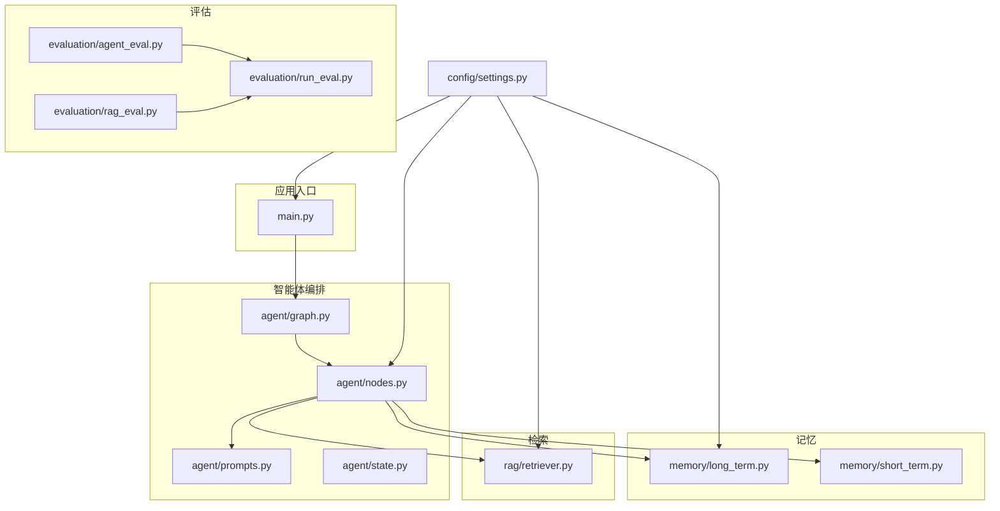
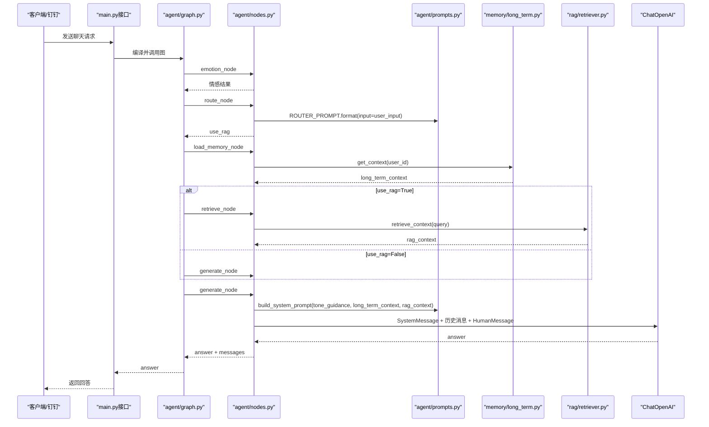
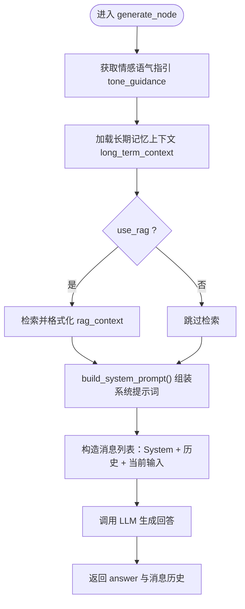
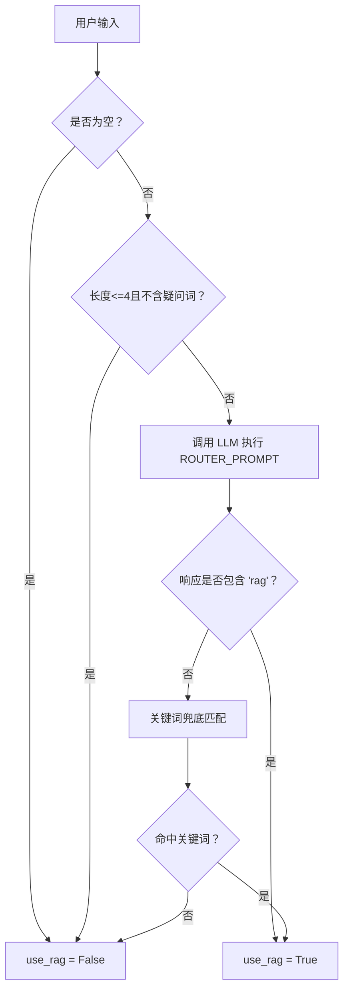
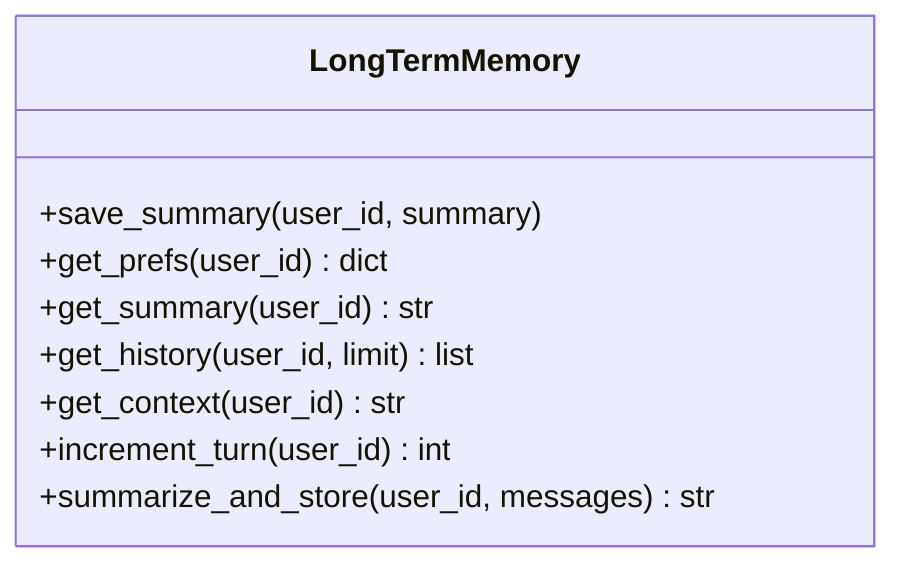
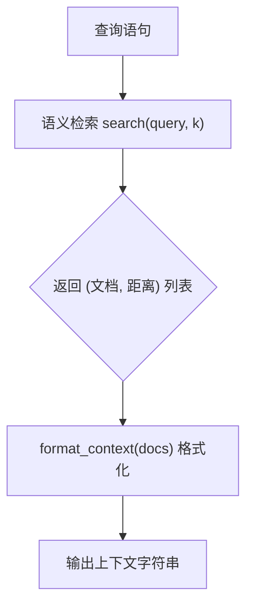
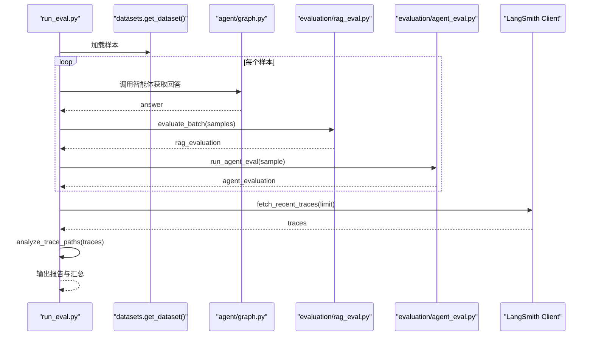
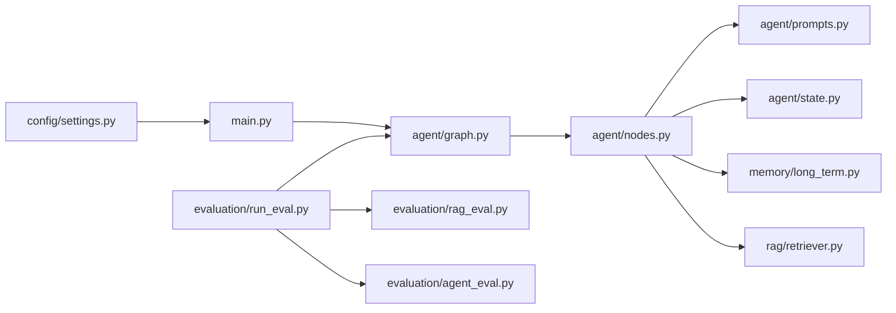

# 提示词工程

<cite>
**本文引用的文件**   
- [agent/prompts.py](file://agent/prompts.py)
- [agent/nodes.py](file://agent/nodes.py)
- [agent/graph.py](file://agent/graph.py)
- [agent/state.py](file://agent/state.py)
- [memory/long_term.py](file://memory/long_term.py)
- [rag/retriever.py](file://rag/retriever.py)
- [evaluation/agent_eval.py](file://evaluation/agent_eval.py)
- [evaluation/rag_eval.py](file://evaluation/rag_eval.py)
- [evaluation/run_eval.py](file://evaluation/run_eval.py)
- [config/settings.py](file://config/settings.py)
- [main.py](file://main.py)
</cite>

## 目录
1. [引言](#引言)
2. [项目结构](#项目结构)
3. [核心组件](#核心组件)
4. [架构总览](#架构总览)
5. [详细组件分析](#详细组件分析)
6. [依赖关系分析](#依赖关系分析)
7. [性能考量](#性能考量)
8. [故障排查指南](#故障排查指南)
9. [结论](#结论)
10. [附录](#附录)

## 引言
本技术文档聚焦于智能体“提示词工程”的设计与优化，围绕系统提示词与用户提示词的构建原则、变量替换机制、版本管理与A/B测试方法、调试工具与评估指标、多语言支持与上下文优化最佳实践展开。通过解析代码库中的提示词模板、路由策略、记忆注入与检索上下文组装流程，帮助读者理解如何通过提示词工程提升智能体的回答质量与一致性。

## 项目结构
本项目采用模块化组织：
- agent：状态图与工作流节点（包含提示词模板与生成逻辑）
- memory：长期与短期记忆管理
- rag：检索与向量存储
- evaluation：RAG与智能体评估、运行入口
- config：全局配置（模型、RAG、记忆、LangSmith等）
- main：Web服务与钉钉回调入口

图表来源
- [main.py:1-236](file://main.py#L1-L236)
- [agent/graph.py:1-106](file://agent/graph.py#L1-L106)
- [agent/nodes.py:1-164](file://agent/nodes.py#L1-L164)
- [agent/prompts.py:1-63](file://agent/prompts.py#L1-L63)
- [agent/state.py:1-47](file://agent/state.py#L1-L47)
- [memory/long_term.py:1-244](file://memory/long_term.py#L1-L244)
- [rag/retriever.py:1-38](file://rag/retriever.py#L1-L38)
- [evaluation/agent_eval.py:1-139](file://evaluation/agent_eval.py#L1-L139)
- [evaluation/rag_eval.py:1-120](file://evaluation/rag_eval.py#L1-L120)
- [evaluation/run_eval.py:1-156](file://evaluation/run_eval.py#L1-L156)
- [config/settings.py:1-93](file://config/settings.py#L1-L93)

章节来源
- [main.py:1-236](file://main.py#L1-L236)
- [config/settings.py:1-93](file://config/settings.py#L1-L93)

## 核心组件
- 提示词模板与组装：系统提示词模板支持动态注入情感语气指引、长期记忆上下文与RAG检索上下文；路由判断使用专用提示词模板。
- 工作流与节点：基于LangGraph的状态图编排，节点包括情感分析、路由判断、RAG检索、长期记忆加载、回答生成与记忆更新。
- 记忆注入：长期记忆以SQLite持久化，按用户维度维护摘要与偏好；短期记忆基于进程内checkpointer维持会话上下文。
- 检索上下文：语义检索后格式化输出，包含来源、标题与相关度，便于LLM引用与溯源。
- 评估体系：RAG与智能体双维度评估，结合OpenEvals与LangSmith进行路径合理性分析。

章节来源
- [agent/prompts.py:1-63](file://agent/prompts.py#L1-L63)
- [agent/nodes.py:1-164](file://agent/nodes.py#L1-L164)
- [memory/long_term.py:1-244](file://memory/long_term.py#L1-L244)
- [rag/retriever.py:1-38](file://rag/retriever.py#L1-L38)
- [evaluation/agent_eval.py:1-139](file://evaluation/agent_eval.py#L1-L139)
- [evaluation/rag_eval.py:1-120](file://evaluation/rag_eval.py#L1-L120)

## 架构总览
下图展示从请求到回答的完整调用链，突出提示词在生成节点中的组装与注入过程。

图表来源
- [main.py:58-92](file://main.py#L58-L92)
- [agent/graph.py:25-82](file://agent/graph.py#L25-L82)
- [agent/nodes.py:31-141](file://agent/nodes.py#L31-L141)
- [agent/prompts.py:18-43](file://agent/prompts.py#L18-L43)
- [memory/long_term.py:150-163](file://memory/long_term.py#L150-L163)
- [rag/retriever.py:34-38](file://rag/retriever.py#L34-L38)

## 详细组件分析

### 系统提示词模板与变量替换机制
- 模板设计：系统提示词模板包含角色定义、情感语气指引、长期记忆段落与参考资料段落，确保回答具备连贯性与可溯源性。
- 变量替换：通过Python字符串format进行占位符替换，支持空值时省略对应段落，避免无意义内容注入。
- 注入时机：在generate节点中根据当前轮次的情感分析结果、长期记忆上下文与RAG检索结果动态组装系统提示词。

图表来源
- [agent/nodes.py:104-141](file://agent/nodes.py#L104-L141)
- [agent/prompts.py:18-43](file://agent/prompts.py#L18-L43)

章节来源
- [agent/prompts.py:1-63](file://agent/prompts.py#L1-L63)
- [agent/nodes.py:104-141](file://agent/nodes.py#L104-L141)

### 路由判断提示词与兜底策略
- 路由提示词：用于判断是否需要检索知识库，要求仅输出“rag”或“chat”，减少歧义。
- 兜底策略：当LLM不可用时，回退到关键词匹配规则，提高鲁棒性。
- 集成位置：route_node中调用ROUTER_PROMPT，并在异常情况下启用关键词兜底。

图表来源
- [agent/nodes.py:53-68](file://agent/nodes.py#L53-L68)
- [agent/prompts.py:46-62](file://agent/prompts.py#L46-L62)

章节来源
- [agent/nodes.py:46-72](file://agent/nodes.py#L46-L72)
- [agent/prompts.py:46-62](file://agent/prompts.py#L46-L62)

### 长期记忆上下文注入
- 数据结构：用户偏好键值对与对话摘要，按时间顺序保留最近若干条摘要。
- 上下文拼装：将偏好与摘要拼接为可读文本，供系统提示词注入。
- 触发机制：每N轮对话触发一次摘要生成与持久化，避免频繁写入。

图表来源
- [memory/long_term.py:75-163](file://memory/long_term.py#L75-L163)
- [memory/long_term.py:203-244](file://memory/long_term.py#L203-L244)

章节来源
- [memory/long_term.py:1-244](file://memory/long_term.py#L1-L244)

### RAG检索上下文格式化
- 检索接口：retrieve_context统一封装检索与格式化，返回可直接注入系统提示词的上下文字符串。
- 格式规范：每个片段包含来源、标题与相关度分数，便于LLM定位与引用。

图表来源
- [rag/retriever.py:13-38](file://rag/retriever.py#L13-L38)

章节来源
- [rag/retriever.py:1-38](file://rag/retriever.py#L1-L38)

### 评估体系与提示词效果度量
- RAG评估维度：检索相关性、答案忠实度、帮助度、答案相关性。
- 智能体评估维度：正确性、幻觉检测、推理路径合理性。
- 运行入口：批量评估数据集，拉取LangSmith trace进行路径合理性统计，输出JSON报告与控制台汇总。

图表来源
- [evaluation/run_eval.py:23-105](file://evaluation/run_eval.py#L23-L105)
- [evaluation/rag_eval.py:89-120](file://evaluation/rag_eval.py#L89-L120)
- [evaluation/agent_eval.py:57-71](file://evaluation/agent_eval.py#L57-L71)

章节来源
- [evaluation/agent_eval.py:1-139](file://evaluation/agent_eval.py#L1-L139)
- [evaluation/rag_eval.py:1-120](file://evaluation/rag_eval.py#L1-L120)
- [evaluation/run_eval.py:1-156](file://evaluation/run_eval.py#L1-L156)

## 依赖关系分析
- 模块耦合：nodes依赖prompts、state、long_term与retriever；graph编排nodes；main作为入口调用graph；evaluation模块独立但依赖graph与settings。
- 外部依赖：LangChain/LangGraph、OpenAI兼容接口、ChromaDB、SQLite、OpenEvals、LangSmith。
- 配置集中：所有模型、RAG、记忆、LangSmith参数由settings统一管理，便于版本切换与环境隔离。

图表来源
- [config/settings.py:1-93](file://config/settings.py#L1-L93)
- [main.py:1-236](file://main.py#L1-L236)
- [agent/graph.py:1-106](file://agent/graph.py#L1-L106)
- [agent/nodes.py:1-164](file://agent/nodes.py#L1-L164)
- [agent/prompts.py:1-63](file://agent/prompts.py#L1-L63)
- [agent/state.py:1-47](file://agent/state.py#L1-L47)
- [memory/long_term.py:1-244](file://memory/long_term.py#L1-L244)
- [rag/retriever.py:1-38](file://rag/retriever.py#L1-L38)
- [evaluation/run_eval.py:1-156](file://evaluation/run_eval.py#L1-L156)
- [evaluation/rag_eval.py:1-120](file://evaluation/rag_eval.py#L1-L120)
- [evaluation/agent_eval.py:1-139](file://evaluation/agent_eval.py#L1-L139)

章节来源
- [config/settings.py:1-93](file://config/settings.py#L1-L93)
- [main.py:1-236](file://main.py#L1-L236)

## 性能考量
- 提示词长度控制：系统提示词包含多个可选段落，应避免过长导致LLM处理延迟；必要时裁剪历史消息数量（如最近8条）。
- 路由效率：短输入快速判定为闲聊，减少不必要的LLM调用；关键词兜底降低失败率。
- 检索阈值：通过rag_score_filter过滤低相关度文档，减少噪声注入。
- 记忆更新频率：按轮次周期性摘要，避免频繁写入数据库。

[本节为通用指导，不直接分析具体文件]

## 故障排查指南
- 路由失败：检查ROUTER_PROMPT与关键词集合；确认LLM可用性与温度设置。
- 检索为空：验证向量库索引与检索函数；检查rag_top_k与rag_score_filter配置。
- 长期记忆异常：确认SQLite连接与WAL模式；检查并发锁与事务提交。
- 评估失败：核对OpenEvals与LangSmith配置；确保数据集字段齐全。

章节来源
- [agent/nodes.py:53-68](file://agent/nodes.py#L53-L68)
- [rag/retriever.py:13-38](file://rag/retriever.py#L13-L38)
- [memory/long_term.py:24-41](file://memory/long_term.py#L24-L41)
- [evaluation/run_eval.py:23-105](file://evaluation/run_eval.py#L23-L105)

## 结论
通过系统化的提示词设计与工程化实现，智能体能够在不同场景下提供高质量、一致性的回答。模板化与变量替换机制确保了灵活性与可维护性；路由与记忆注入提升了准确性与个性化；评估体系为持续优化提供了量化依据。建议在生产环境中引入提示词版本管理与A/B测试，结合多语言支持与上下文优化策略，进一步提升用户体验。

[本节为总结性内容，不直接分析具体文件]

## 附录

### 提示词版本管理与A/B测试方法
- 版本管理：将提示词模板与路由策略纳入配置或独立文件，通过版本号或分支标识区分；在生成节点中按配置选择模板。
- A/B测试：在同一数据集上并行运行不同版本的提示词，对比评估指标（正确性、幻觉、路径合理性），选择最优版本。
- 灰度发布：逐步扩大新版本覆盖范围，监控关键指标与用户反馈，确保稳定性。

[本节为概念性内容，不直接分析具体文件]

### 多语言支持与上下文优化最佳实践
- 多语言支持：在系统提示词中明确语言偏好与翻译规则；根据用户输入自动识别语言并适配回复风格。
- 上下文优化：限制历史消息数量，优先保留关键信息；对长文档进行分段与摘要，提升检索命中率。
- 术语一致性：建立术语表并在提示词中引用，确保跨会话的一致性。

[本节为概念性内容，不直接分析具体文件]

### 提示词调试工具与效果评估指标
- 调试工具：REPL模式用于交互式测试；日志记录提示词组装过程与LLM调用结果。
- 评估指标：RAG维度（检索相关性、忠实度、帮助度、答案相关性）；智能体维度（正确性、幻觉检测、推理路径合理性）。
- 报告输出：JSON格式保存评估结果，控制台打印汇总表格，便于分析与归档。

章节来源
- [main.py:179-210](file://main.py#L179-L210)
- [evaluation/run_eval.py:123-143](file://evaluation/run_eval.py#L123-L143)