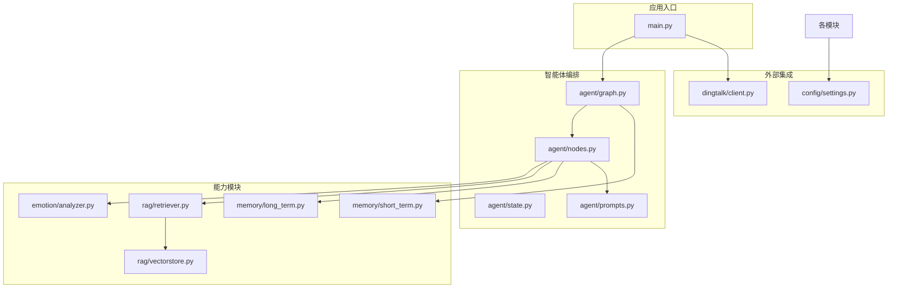
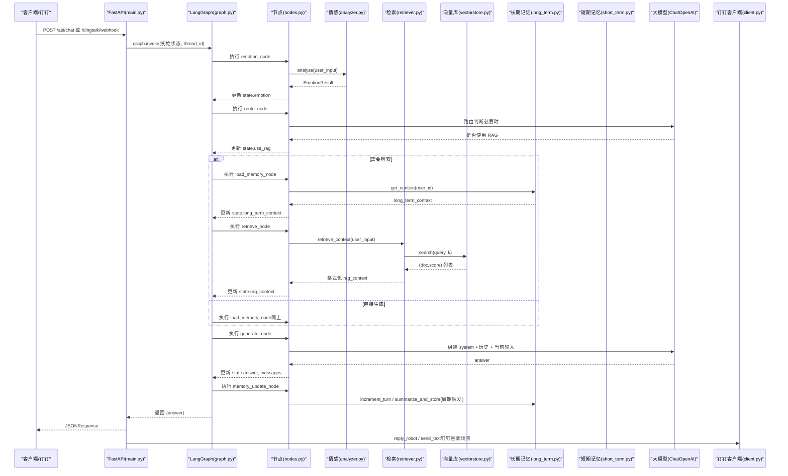
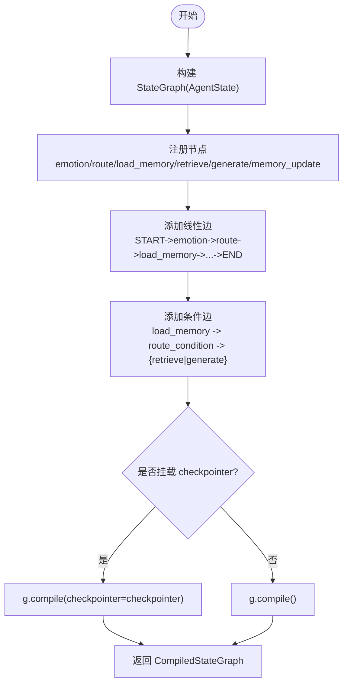
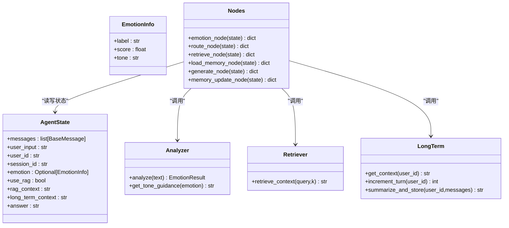
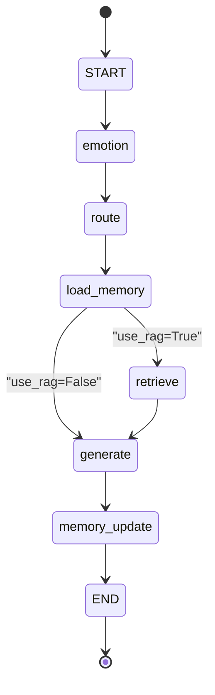
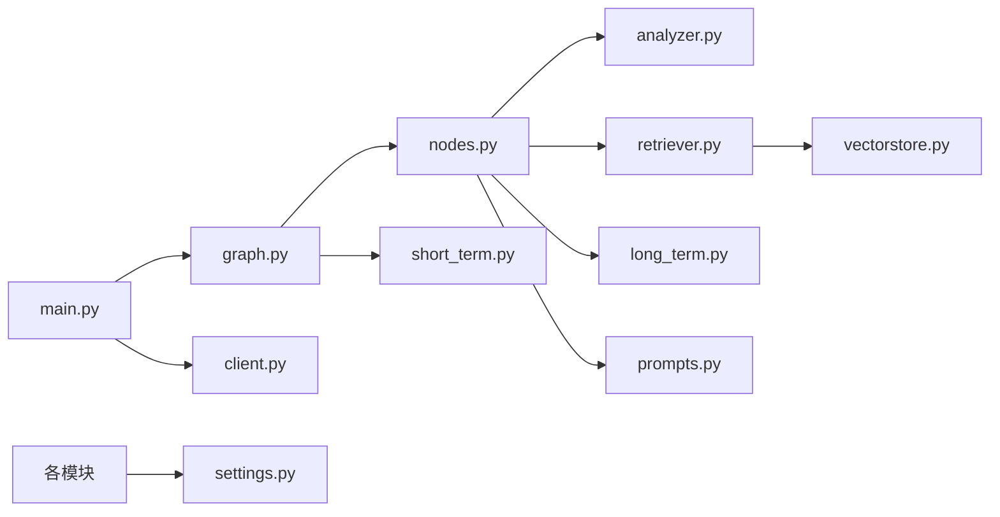

# 智能体工作流引擎

<cite>
**本文引用的文件**   
- [main.py](file://main.py)
- [agent/graph.py](file://agent/graph.py)
- [agent/nodes.py](file://agent/nodes.py)
- [agent/state.py](file://agent/state.py)
- [agent/prompts.py](file://agent/prompts.py)
- [emotion/analyzer.py](file://emotion/analyzer.py)
- [rag/retriever.py](file://rag/retriever.py)
- [rag/vectorstore.py](file://rag/vectorstore.py)
- [memory/long_term.py](file://memory/long_term.py)
- [memory/short_term.py](file://memory/short_term.py)
- [config/settings.py](file://config/settings.py)
- [dingtalk/client.py](file://dingtalk/client.py)
- [requirements.txt](file://requirements.txt)
</cite>

## 目录
1. [简介](#简介)
2. [项目结构](#项目结构)
3. [核心组件](#核心组件)
4. [架构总览](#架构总览)
5. [详细组件分析](#详细组件分析)
6. [依赖关系分析](#依赖关系分析)
7. [性能考量](#性能考量)
8. [故障排查指南](#故障排查指南)
9. [结论](#结论)
10. [附录](#附录)

## 简介
本技术文档面向“智能体工作流引擎”，基于 LangGraph 的状态图（StateGraph）构建，实现从用户输入到回答生成的完整链路。系统包含情感分析、路由决策、知识检索（RAG）、LLM 生成、长期记忆与短期记忆等模块，并通过 FastAPI 提供 Web 聊天与钉钉机器人回调接口。文档将深入解析状态定义、节点函数实现、边连接逻辑、条件分支与异常处理策略，并提供自定义节点与工作流扩展的实践建议。

## 项目结构
整体采用按功能域划分的模块化组织：
- agent：LangGraph 状态图、节点函数、状态定义与提示词模板
- emotion：情感分析与语气指引
- rag：向量库封装与检索器
- memory：长期与短期记忆管理
- config：全局配置（环境变量与 .env）
- dingtalk：钉钉 API 客户端
- main：FastAPI 入口、Webhook 回调、健康检查与 REPL 调试

图表来源
- [main.py:1-236](file://main.py#L1-L236)
- [agent/graph.py:1-106](file://agent/graph.py#L1-L106)
- [agent/nodes.py:1-164](file://agent/nodes.py#L1-L164)
- [agent/state.py:1-47](file://agent/state.py#L1-L47)
- [agent/prompts.py:1-63](file://agent/prompts.py#L1-L63)
- [emotion/analyzer.py:1-118](file://emotion/analyzer.py#L1-L118)
- [rag/retriever.py:1-38](file://rag/retriever.py#L1-L38)
- [rag/vectorstore.py:1-75](file://rag/vectorstore.py#L1-L75)
- [memory/long_term.py:1-244](file://memory/long_term.py#L1-L244)
- [memory/short_term.py:1-28](file://memory/short_term.py#L1-L28)
- [dingtalk/client.py:1-140](file://dingtalk/client.py#L1-L140)
- [config/settings.py:1-93](file://config/settings.py#L1-L93)

章节来源
- [main.py:1-236](file://main.py#L1-L236)
- [requirements.txt:1-31](file://requirements.txt#L1-L31)

## 核心组件
- 状态定义（AgentState）：统一描述工作流中流转的数据，包括消息历史、用户输入、会话标识、情感结果、RAG 上下文、长期记忆上下文与最终答案。
- 节点函数：每个处理步骤以函数形式实现，接收/返回 AgentState 的增量更新。
- 边与条件分支：线性边串联主要流程；load_memory 后根据 use_rag 进行条件分流至 retrieve 或 generate。
- 编译与执行：通过 StateGraph 构建并编译为 CompiledStateGraph，挂载 checkpointer 支持多轮会话上下文。
- 便捷调用：提供 chat 单轮问答入口与 get_compiled_graph 单例获取。

章节来源
- [agent/state.py:1-47](file://agent/state.py#L1-L47)
- [agent/nodes.py:1-164](file://agent/nodes.py#L1-L164)
- [agent/graph.py:1-106](file://agent/graph.py#L1-L106)

## 架构总览
下图展示从请求进入 FastAPI 到 LangGraph 状态图执行、再到回复发送的整体流程。

图表来源
- [main.py:58-176](file://main.py#L58-L176)
- [agent/graph.py:25-82](file://agent/graph.py#L25-L82)
- [agent/nodes.py:31-164](file://agent/nodes.py#L31-L164)
- [emotion/analyzer.py:82-118](file://emotion/analyzer.py#L82-L118)
- [rag/retriever.py:1-38](file://rag/retriever.py#L1-L38)
- [rag/vectorstore.py:48-68](file://rag/vectorstore.py#L48-L68)
- [memory/long_term.py:150-244](file://memory/long_term.py#L150-L244)
- [memory/short_term.py:13-28](file://memory/short_term.py#L13-L28)
- [dingtalk/client.py:104-140](file://dingtalk/client.py#L104-L140)

## 详细组件分析

### 状态图构建与编译（LangGraph StateGraph）
- 构建过程：创建 StateGraph(AgentState)，注册六个节点（emotion、route、load_memory、retrieve、generate、memory_update），添加线性边与条件边。
- 条件分支：在 load_memory 之后通过 route_condition 依据 state.use_rag 决定流向 retrieve 或 generate。
- Checkpointer：默认使用进程内 MemorySaver，按 thread_id 维护短期上下文；可传入 None 自动获取，False 则不挂载（无状态场景）。
- 单例与便捷调用：get_compiled_graph 返回编译后的图实例；chat 提供单轮问答入口，内部构造初始状态与 config。

图表来源
- [agent/graph.py:25-82](file://agent/graph.py#L25-L82)

章节来源
- [agent/graph.py:25-82](file://agent/graph.py#L25-L82)

### 节点函数详解
- 情感分析节点（emotion_node）
  - 功能：调用 emotion.analyzer.analyze 对用户输入进行情感分类，得到 label、score、tone，并写入 state.emotion。
  - 参数与行为：temperature 固定为低值以保证稳定性；失败时回退到规则词典分析。
  - 输出：仅更新 emotion 字段，便于后续 generate 节点注入语气指引。

- 路由决策节点（route_node）
  - 功能：判断是否需要 RAG 检索，写入 state.use_rag。
  - 策略：短输入且不含关键词时倾向闲聊；否则调用 LLM 进行结构化判断（只输出 rag 或 chat），失败时回退到关键词兜底。
  - 条件路由：route_condition 根据 use_rag 返回 "retrieve" 或 "generate"。

- 知识检索节点（retrieve_node）
  - 功能：调用 rag.retriever.retrieve_context 对 user_input 进行语义检索并格式化上下文字符串，写入 state.rag_context。
  - 容错：检索失败时返回空字符串，保证下游生成仍可继续。

- 长期记忆加载节点（load_memory_node）
  - 功能：从 SQLite 读取用户偏好与对话摘要，拼装 long_term_context 供生成节点使用。
  - 容错：数据库访问异常时返回空字符串。

- LLM 生成节点（generate_node）
  - 功能：组装 system prompt（含 tone_guidance、long_term_context、rag_context），拼接最近若干条历史消息与当前输入，调用 ChatOpenAI 生成回答。
  - 错误处理：LLM 调用失败时返回友好错误信息。
  - 输出：更新 state.answer 与 state.messages（追加 HumanMessage/AIMessage）。

- 记忆更新节点（memory_update_node）
  - 功能：周期性增加对话轮次计数，达到阈值时触发 summarize_and_store，生成摘要并持久化。
  - 容错：异常捕获并记录日志，不影响主流程。

图表来源
- [agent/state.py:1-47](file://agent/state.py#L1-L47)
- [agent/nodes.py:31-164](file://agent/nodes.py#L31-L164)
- [emotion/analyzer.py:82-118](file://emotion/analyzer.py#L82-L118)
- [rag/retriever.py:1-38](file://rag/retriever.py#L1-L38)
- [memory/long_term.py:150-244](file://memory/long_term.py#L150-L244)

章节来源
- [agent/nodes.py:31-164](file://agent/nodes.py#L31-L164)
- [emotion/analyzer.py:82-118](file://emotion/analyzer.py#L82-L118)
- [rag/retriever.py:1-38](file://rag/retriever.py#L1-L38)
- [memory/long_term.py:150-244](file://memory/long_term.py#L150-L244)

### 状态流转机制
- 线性流程：START -> emotion -> route -> load_memory -> (retrieve | generate) -> memory_update -> END。
- 条件分支：load_memory 后根据 use_rag 分流至 retrieve 或 generate。
- 循环控制：通过 checkpointer 的 thread_id 维持短期上下文，多轮对话累积 messages；长期记忆按轮次阈值触发摘要更新。
- 异常处理：各节点均捕获异常并降级（如检索失败返回空、LLM 失败返回友好提示、路由失败回退关键词）。

图表来源
- [agent/graph.py:36-69](file://agent/graph.py#L36-L69)

章节来源
- [agent/graph.py:36-69](file://agent/graph.py#L36-L69)

### 提示词工程设计与最佳实践
- 系统提示词模板（SYSTEM_PROMPT_TEMPLATE）：
  - 包含角色设定、语气指引（tone_guidance）、长期记忆片段（long_term_section）、参考资料片段（rag_section）。
  - 生成节点在调用 LLM 前动态组装，确保回答具备个性化与知识支撑。
- 路由提示词（ROUTER_PROMPT）：
  - 要求 LLM 仅输出 rag 或 chat，用于快速判断是否需要检索知识库。
- 最佳实践：
  - 将长上下文拆分为独立段落（如【长期记忆】、【参考资料】），提升可读性与注意力聚焦。
  - 语气指引应简洁明确，避免冗长指令影响生成质量。
  - 路由提示词需限定输出格式，降低解析成本与不确定性。

章节来源
- [agent/prompts.py:1-63](file://agent/prompts.py#L1-L63)
- [agent/nodes.py:104-142](file://agent/nodes.py#L104-L142)

### 自定义节点与修改工作流逻辑示例
- 自定义节点：
  - 新增一个节点函数，接收 state: AgentState，返回 dict 增量更新（例如 {"extra_field": value}）。
  - 在 graph.py 中通过 g.add_node("your_node", your_node) 注册。
  - 使用 g.add_edge("prev_node", "your_node") 和 g.add_edge("your_node", "next_node") 连接。
- 修改条件分支：
  - 在 route_condition 中扩展判断逻辑（如结合更多 state 字段），返回新的目标节点名。
  - 使用 g.add_conditional_edges("source", condition_func, {"targetA": "nodeA", "targetB": "nodeB"})。
- 调整提示词：
  - 在 prompts.py 中修改 SYSTEM_PROMPT_TEMPLATE 或 ROUTER_PROMPT，确保占位符与实际注入内容匹配。
- 异常与降级：
  - 在各节点 try/except 中捕获异常并返回降级结果，保证工作流鲁棒性。

章节来源
- [agent/graph.py:36-69](file://agent/graph.py#L36-L69)
- [agent/nodes.py:46-73](file://agent/nodes.py#L46-L73)
- [agent/prompts.py:17-43](file://agent/prompts.py#L17-L43)

## 依赖关系分析
- 模块耦合：
  - nodes.py 依赖 emotion、rag、memory、prompts 与 settings。
  - graph.py 依赖 nodes 与 state，并在运行时按需导入 short_term checkpointer。
  - retriever.py 依赖 vectorstore.py；vectorstore.py 依赖 embeddings（由 settings 配置）。
  - long_term.py 使用 sqlite3 与 settings，提供持久化能力。
- 外部依赖：
  - OpenAI 兼容 LLM（ChatOpenAI）
  - Chroma 向量库（本地持久化）
  - FastAPI/Uvicorn（Web 服务）
  - httpx（HTTP 客户端）
  - pydantic-settings（配置管理）

图表来源
- [agent/nodes.py:1-164](file://agent/nodes.py#L1-L164)
- [agent/graph.py:1-106](file://agent/graph.py#L1-L106)
- [rag/retriever.py:1-38](file://rag/retriever.py#L1-L38)
- [rag/vectorstore.py:1-75](file://rag/vectorstore.py#L1-L75)
- [memory/long_term.py:1-244](file://memory/long_term.py#L1-L244)
- [memory/short_term.py:1-28](file://memory/short_term.py#L1-L28)
- [main.py:1-236](file://main.py#L1-L236)
- [dingtalk/client.py:1-140](file://dingtalk/client.py#L1-L140)
- [config/settings.py:1-93](file://config/settings.py#L1-L93)

章节来源
- [requirements.txt:1-31](file://requirements.txt#L1-L31)

## 性能考量
- 向量检索优化：
  - 设置合理的 top_k 与分数过滤阈值（rag_top_k、rag_score_filter），减少无关文档干扰。
  - 使用本地 Chroma 持久化，避免重复计算嵌入。
- 记忆更新频率：
  - 通过 memory_summary_every 控制摘要生成频率，平衡上下文质量与 LLM 调用开销。
- LLM 调用温度：
  - 路由与情感分析使用较低 temperature，提高稳定性；生成节点保持适中温度以兼顾创造性。
- 并发与 I/O：
  - SQLite WAL 模式提升读并发；写操作串行化避免冲突。
  - FastAPI 使用同步 def 包裹阻塞调用，交由线程池执行，避免事件循环阻塞。

章节来源
- [rag/vectorstore.py:48-68](file://rag/vectorstore.py#L48-L68)
- [memory/long_term.py:24-41](file://memory/long_term.py#L24-L41)
- [config/settings.py:38-47](file://config/settings.py#L38-L47)
- [main.py:58-91](file://main.py#L58-L91)

## 故障排查指南
- 路由失败：
  - 现象：LLM 路由不可用或返回异常。
  - 处理：回退到关键词兜底（ROUTER_KEYWORDS），检查网络与 API Key 配置。
- 检索失败：
  - 现象：向量库查询异常或返回空结果。
  - 处理：确认 Chroma 数据目录存在且已入库；检查 embedding 模型与配置；查看 rag_score_filter 阈值。
- 长期记忆异常：
  - 现象：SQLite 读写失败或摘要生成失败。
  - 处理：检查数据库路径权限与 WAL 模式；确认 LLM 可用；查看日志中的错误信息。
- 生成失败：
  - 现象：LLM 调用异常或超时。
  - 处理：检查 base_url、api_key、model 配置；适当调整 temperature；查看错误消息。
- 钉钉回调问题：
  - 现象：签名校验失败或消息未送达。
  - 处理：核对 secret 与 token；确认 webhook_token 有效；检查网络连通性。

章节来源
- [agent/nodes.py:53-68](file://agent/nodes.py#L53-L68)
- [rag/retriever.py:76-86](file://rag/retriever.py#L76-L86)
- [memory/long_term.py:203-244](file://memory/long_term.py#L203-L244)
- [main.py:106-176](file://main.py#L106-L176)

## 结论
该智能体工作流引擎以 LangGraph 为核心，将情感分析、路由决策、知识检索、LLM 生成与记忆管理有机整合，形成高内聚、可扩展的工作流。通过清晰的 StateGraph 构建与节点设计，系统具备良好的可维护性与可观测性。在生产环境中，建议关注提示词优化、检索参数调优与记忆更新频率，以提升回答质量与系统性能。

## 附录
- 启动方式：
  - Web 服务：uvicorn main:app --host 0.0.0.0 --port 8000 --reload
  - 本地 REPL：python main.py --repl
- 关键端点：
  - GET /health：健康检查
  - POST /api/chat：Web 聊天接口
  - POST /dingtalk/webhook：钉钉机器人回调

章节来源
- [main.py:212-236](file://main.py#L212-L236)
- [main.py:94-104](file://main.py#L94-L104)
- [main.py:58-91](file://main.py#L58-L91)
- [main.py:106-176](file://main.py#L106-L176)