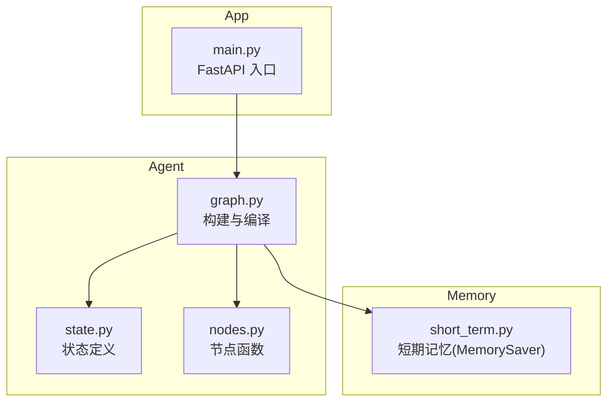
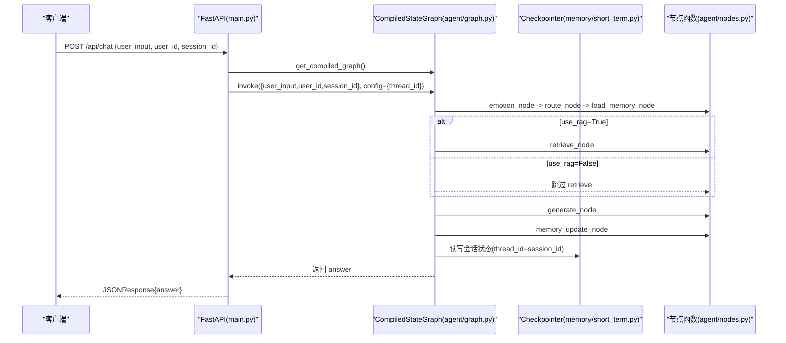
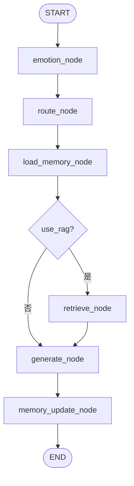
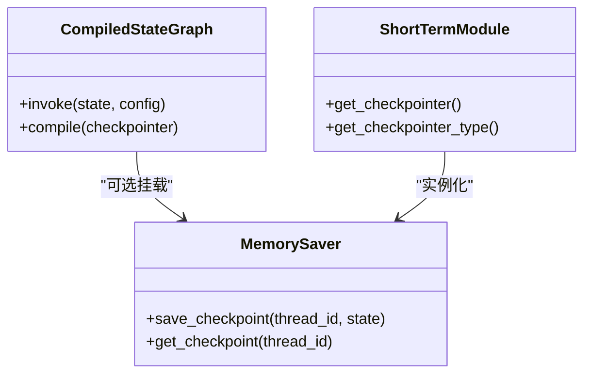
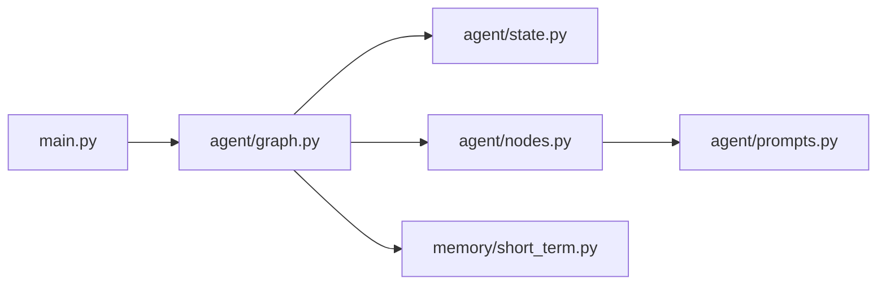

# 状态图构建与编译

<cite>
**本文引用的文件**   
- [agent/graph.py](file://agent/graph.py)
- [agent/state.py](file://agent/state.py)
- [agent/nodes.py](file://agent/nodes.py)
- [memory/short_term.py](file://memory/short_term.py)
- [main.py](file://main.py)
</cite>

## 目录
1. [简介](#简介)
2. [项目结构](#项目结构)
3. [核心组件](#核心组件)
4. [架构总览](#架构总览)
5. [详细组件分析](#详细组件分析)
6. [依赖关系分析](#依赖关系分析)
7. [性能考虑](#性能考虑)
8. [故障排查指南](#故障排查指南)
9. [结论](#结论)
10. [附录：自定义工作流示例](#附录自定义工作流示例)

## 简介
本技术文档聚焦于基于 LangGraph 的状态图构建与编译，围绕 StateGraph 的初始化、节点注册、边连接逻辑、条件边配置、checkpointer 集成（MemorySaver）、以及 get_compiled_graph 单例模式进行系统化说明。同时提供编译优化技巧、性能考量与可操作的自定义示例，帮助读者快速掌握并扩展该智能体工作流。

## 项目结构
本项目采用按功能模块组织的方式，关键与状态图相关的代码集中在 agent 与 memory 两个子包中：
- agent/graph.py：定义 StateGraph 的构建与编译流程，暴露 get_compiled_graph 单例与便捷调用入口 chat。
- agent/state.py：定义 AgentState 数据结构，包含消息历史、用户输入、会话标识、情感结果、RAG 上下文等字段。
- agent/nodes.py：实现各节点函数（情感分析、路由判断、检索、生成、记忆更新）及条件路由函数。
- memory/short_term.py：短期记忆 checkpointer 管理，默认使用进程内 MemorySaver。
- main.py：Web 服务入口，通过 FastAPI 暴露聊天接口与钉钉回调，统一调用 get_compiled_graph。

图表来源
- [agent/graph.py:1-106](file://agent/graph.py#L1-L106)
- [agent/state.py:1-47](file://agent/state.py#L1-L47)
- [agent/nodes.py:1-164](file://agent/nodes.py#L1-L164)
- [memory/short_term.py:1-28](file://memory/short_term.py#L1-L28)
- [main.py:58-92](file://main.py#L58-L92)

章节来源
- [agent/graph.py:1-106](file://agent/graph.py#L1-L106)
- [agent/state.py:1-47](file://agent/state.py#L1-L47)
- [agent/nodes.py:1-164](file://agent/nodes.py#L1-L164)
- [memory/short_term.py:1-28](file://memory/short_term.py#L1-L28)
- [main.py:58-92](file://main.py#L58-L92)

## 核心组件
- StateGraph 初始化与节点注册：在 build_graph 中创建 StateGraph(AgentState)，并通过 add_node 注册 emotion、route、load_memory、retrieve、generate、memory_update 六个节点。
- 线性边与条件边：add_edge 串联 START->emotion->route->load_memory->...->END；add_conditional_edges 在 load_memory 后根据 route_condition 返回 retrieve 或 generate。
- Checkpointer 集成：若传入 checkpointer=None，则从 memory.short_term.get_checkpointer() 获取进程内 MemorySaver；若传入 False，则不挂载 checkpointer。
- 单例 CompiledStateGraph：get_compiled_graph 模块级缓存 _compiled，避免重复编译开销。
- 便捷调用 chat：封装 graph.invoke 调用，设置 thread_id 以区分会话。

章节来源
- [agent/graph.py:25-82](file://agent/graph.py#L25-L82)
- [memory/short_term.py:13-27](file://memory/short_term.py#L13-L27)

## 架构总览
下图展示了从 Web 请求到状态图执行的关键路径，包括线程隔离与会话上下文持久化。

图表来源
- [main.py:58-92](file://main.py#L58-L92)
- [agent/graph.py:25-82](file://agent/graph.py#L25-L82)
- [memory/short_term.py:13-27](file://memory/short_term.py#L13-L27)
- [agent/nodes.py:30-164](file://agent/nodes.py#L30-L164)

## 详细组件分析

### StateGraph 初始化与节点注册
- 初始化：g = StateGraph(AgentState)，绑定状态类型，确保所有节点对状态的读写符合 TypedDict 契约。
- 节点注册：add_node 将函数映射为图节点，节点函数接收 state 并返回增量 dict，由 LangGraph 合并到全局状态。
- 关键点：节点函数应仅返回需要更新的字段，避免覆盖 messages 等 reducer 字段。

章节来源
- [agent/graph.py:36-44](file://agent/graph.py#L36-L44)
- [agent/state.py:20-44](file://agent/state.py#L20-L44)

### 线性边与条件边
- 线性边：add_edge(START, "emotion") 等串联主流程，保证固定顺序执行。
- 条件边：add_conditional_edges("load_memory", route_condition, {"retrieve": "retrieve", "generate": "generate"})，根据 route_condition 返回值决定分支。
- 路由逻辑：route_condition 读取 state.use_rag，True 走 retrieve，False 直接 generate。

图表来源
- [agent/graph.py:46-59](file://agent/graph.py#L46-L59)
- [agent/nodes.py:70-73](file://agent/nodes.py#L70-L73)

章节来源
- [agent/graph.py:46-59](file://agent/graph.py#L46-L59)
- [agent/nodes.py:70-73](file://agent/nodes.py#L70-L73)

### Checkpointer 集成机制（MemorySaver）
- 默认策略：当 checkpointer=None 时，自动从 memory.short_term.get_checkpointer() 获取进程内 MemorySaver。
- 无状态场景：传入 checkpointer=False 时不调用 compile(checkpointer=...)，适用于评估等无需会话持久化的场景。
- 会话隔离：invoke 时通过 config={"configurable":{"thread_id": session_id}} 指定线程 ID，MemorySaver 按 thread_id 维护独立状态。

图表来源
- [agent/graph.py:62-69](file://agent/graph.py#L62-L69)
- [memory/short_term.py:13-27](file://memory/short_term.py#L13-L27)

章节来源
- [agent/graph.py:62-69](file://agent/graph.py#L62-L69)
- [memory/short_term.py:13-27](file://memory/short_term.py#L13-L27)

### get_compiled_graph 单例模式
- 设计目的：避免重复编译带来的 CPU 与内存开销，提升首次调用后的响应速度。
- 使用场景：Web 服务启动后多次处理请求，均复用同一 CompiledStateGraph 实例。
- 注意事项：如需动态修改图结构（如新增节点/边），需重置 _compiled 或重新构建图。

章节来源
- [agent/graph.py:72-82](file://agent/graph.py#L72-L82)

### 便捷调用 chat
- 作用：封装 graph.invoke 调用，构造初始状态与 config，返回 answer。
- 参数：user_input、user_id、session_id；session_id 作为 thread_id 用于会话隔离。
- 适用：REPL 调试与简单调用场景。

章节来源
- [agent/graph.py:84-106](file://agent/graph.py#L84-L106)

## 依赖关系分析
- agent/graph.py 依赖 agent/state.py（状态类型）、agent/nodes.py（节点函数）、memory/short_term.py（checkpointer）。
- main.py 依赖 agent/graph.py（获取 CompiledStateGraph）与 memory/short_term.py（健康检查输出 checkpointer 类型）。
- nodes.py 依赖 agent/prompts.py（系统 prompt 模板）、emotion.analyzer（情感分析）、rag.retriever（检索）、memory.long_term（长期记忆）。

图表来源
- [main.py:58-92](file://main.py#L58-L92)
- [agent/graph.py:1-23](file://agent/graph.py#L1-L23)
- [agent/nodes.py:1-12](file://agent/nodes.py#L1-L12)

章节来源
- [main.py:58-92](file://main.py#L58-L92)
- [agent/graph.py:1-23](file://agent/graph.py#L1-L23)
- [agent/nodes.py:1-12](file://agent/nodes.py#L1-L12)

## 性能考虑
- 编译缓存：get_compiled_graph 使用模块级 _compiled 缓存，避免重复编译。
- Checkpointer 选择：MemorySaver 为进程内存储，适合本地开发与测试；生产环境可替换为持久化后端（如 SQLite、Redis）以提升可靠性。
- 节点函数异常保护：retrieve_node、generate_node、memory_update_node 内部捕获异常并降级处理，避免中断整体流程。
- 并发与线程安全：SQLite 开启 WAL 模式，写操作加锁，读操作并发；MemorySaver 按 thread_id 隔离状态，避免竞争。
- 调用方式：main.py 中使用同步 def 处理 FastAPI 路由，避免阻塞事件循环。

章节来源
- [agent/graph.py:72-82](file://agent/graph.py#L72-L82)
- [memory/long_term.py:24-41](file://memory/long_term.py#L24-L41)
- [main.py:58-92](file://main.py#L58-L92)

## 故障排查指南
- 路由失败回退：_decide_rag 在 LLM 不可用时回退到关键词匹配，确保基本可用性。
- 检索失败处理：retrieve_node 捕获异常并返回空 rag_context，不影响后续生成。
- 生成失败处理：generate_node 捕获异常并返回友好提示，避免崩溃。
- 记忆更新失败：memory_update_node 捕获异常并记录日志，不影响回答返回。
- 健康检查：/health 端点返回当前 checkpointer 类型，便于确认短期记忆后端。

章节来源
- [agent/nodes.py:53-68](file://agent/nodes.py#L53-L68)
- [agent/nodes.py:76-86](file://agent/nodes.py#L76-L86)
- [agent/nodes.py:104-141](file://agent/nodes.py#L104-L141)
- [agent/nodes.py:145-163](file://agent/nodes.py#L145-L163)
- [main.py:94-103](file://main.py#L94-L103)

## 结论
本方案通过 LangGraph 的 StateGraph 实现了清晰、可扩展的智能体工作流：标准化状态定义、模块化节点函数、灵活的条件路由、以及可插拔的 checkpointer。get_compiled_graph 单例模式有效降低编译成本，MemorySaver 提供轻量级会话持久化。结合健壮的错误处理与性能优化，系统在生产环境中具备高可用性与易维护性。

## 附录：自定义工作流示例
以下示例展示如何自定义状态图与修改工作流结构（以步骤说明为主，不直接粘贴代码）：

- 自定义状态字段
  - 在 agent/state.py 的 AgentState 中添加新字段（例如 extra_info: str），并在节点函数中读写该字段。
  - 注意：messages 字段使用 add_messages reducer，其他字段为覆盖型写入。

- 新增节点
  - 在 agent/nodes.py 中实现新节点函数（接收 state，返回增量 dict）。
  - 在 agent/graph.py 的 build_graph 中通过 g.add_node("new_node", new_node_func) 注册。

- 添加线性边
  - 在 build_graph 中使用 g.add_edge("prev_node", "new_node") 和 g.add_edge("new_node", "next_node") 插入流程。

- 添加条件边
  - 在 agent/nodes.py 中实现条件函数（返回目标节点名）。
  - 在 build_graph 中使用 g.add_conditional_edges("source_node", condition_func, {"target_a": "a", "target_b": "b"}) 配置分支。

- 切换 Checkpointer
  - 在 build_graph(checkpointer=custom_saver) 传入自定义 checkpointer 实例，或在 memory/short_term.py 中替换 MemorySaver 为其他后端。

- 禁用 Checkpointer
  - 调用 build_graph(checkpointer=False) 编译无状态图，适用于批量评估或离线推理。

- 单例重置
  - 若需动态重建图，可在模块级重置 _compiled = None，随后再次调用 get_compiled_graph()。

章节来源
- [agent/state.py:20-44](file://agent/state.py#L20-L44)
- [agent/nodes.py:30-164](file://agent/nodes.py#L30-L164)
- [agent/graph.py:25-82](file://agent/graph.py#L25-L82)
- [memory/short_term.py:13-27](file://memory/short_term.py#L13-L27)