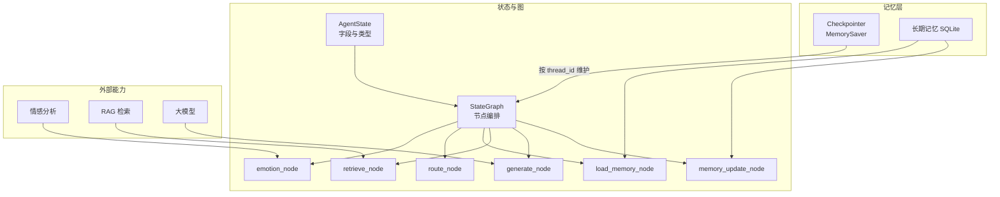
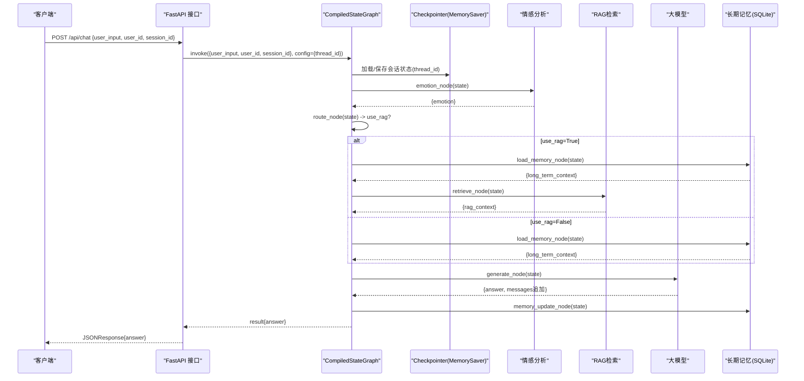
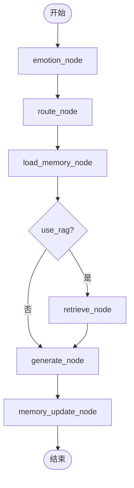
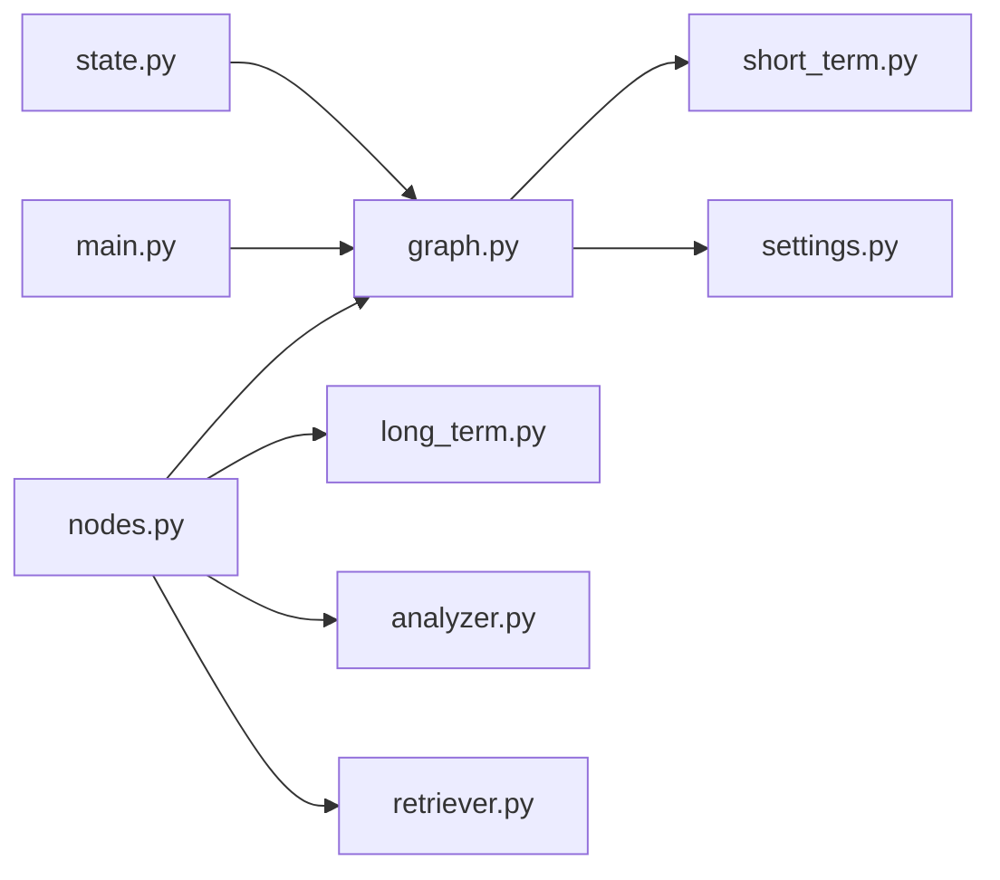

# 状态管理设计

<cite>
**本文引用的文件**   
- [agent/state.py](file://agent/state.py)
- [agent/graph.py](file://agent/graph.py)
- [agent/nodes.py](file://agent/nodes.py)
- [memory/short_term.py](file://memory/short_term.py)
- [memory/long_term.py](file://memory/long_term.py)
- [emotion/analyzer.py](file://emotion/analyzer.py)
- [rag/retriever.py](file://rag/retriever.py)
- [config/settings.py](file://config/settings.py)
- [main.py](file://main.py)
</cite>

## 目录
1. [简介](#简介)
2. [项目结构](#项目结构)
3. [核心组件](#核心组件)
4. [架构总览](#架构总览)
5. [详细组件分析](#详细组件分析)
6. [依赖关系分析](#依赖关系分析)
7. [性能考量](#性能考量)
8. [故障排查指南](#故障排查指南)
9. [结论](#结论)
10. [附录：最佳实践与监控建议](#附录最佳实践与监控建议)

## 简介
本技术文档聚焦智能体状态管理系统，围绕 AgentState 数据模型、节点间状态流转、checkpointer 的会话持久化与恢复机制进行系统化说明。文档同时给出状态字段的类型约束、默认值策略与验证规则，解释并发访问控制、性能优化要点以及调试与监控方法，帮助读者快速理解并高效使用状态管理子系统。

## 项目结构
状态管理相关代码主要分布在以下模块：
- agent/state.py：定义 AgentState 与 EmotionInfo 数据结构
- agent/graph.py：构建 LangGraph StateGraph，编排节点工作流，挂载 checkpointer
- agent/nodes.py：实现各节点的状态读写逻辑（情感分析、路由、RAG检索、生成回答、记忆更新）
- memory/short_term.py：短期记忆（checkpointer），基于进程内 MemorySaver
- memory/long_term.py：长期记忆（SQLite），存储用户摘要、偏好与历史摘要
- emotion/analyzer.py：情感分析与语气指引
- rag/retriever.py：语义检索与上下文格式化
- config/settings.py：全局配置（LLM、RAG、记忆等）
- main.py：Web 入口，调用图执行并返回结果

图表来源
- [agent/state.py:20-44](file://agent/state.py#L20-L44)
- [agent/graph.py:25-69](file://agent/graph.py#L25-L69)
- [agent/nodes.py:31-163](file://agent/nodes.py#L31-L163)
- [memory/short_term.py:13-27](file://memory/short_term.py#L13-L27)
- [memory/long_term.py:150-163](file://memory/long_term.py#L150-L163)
- [emotion/analyzer.py:82-118](file://emotion/analyzer.py#L82-L118)
- [rag/retriever.py:34-38](file://rag/retriever.py#L34-L38)

章节来源
- [agent/state.py:1-47](file://agent/state.py#L1-L47)
- [agent/graph.py:1-106](file://agent/graph.py#L1-L106)
- [agent/nodes.py:1-164](file://agent/nodes.py#L1-L164)
- [memory/short_term.py:1-28](file://memory/short_term.py#L1-L28)
- [memory/long_term.py:1-244](file://memory/long_term.py#L1-L244)
- [emotion/analyzer.py:1-118](file://emotion/analyzer.py#L1-L118)
- [rag/retriever.py:1-38](file://rag/retriever.py#L1-L38)
- [config/settings.py:16-93](file://config/settings.py#L16-L93)
- [main.py:58-91](file://main.py#L58-L91)

## 核心组件
- AgentState：LangGraph 状态载体，包含消息历史、用户输入、用户与会话标识、情感分析结果、RAG 开关与上下文、长期记忆上下文、最终答案等字段。
- StateGraph：将多个节点以有向边连接，形成可执行的工作流；通过 add_conditional_edges 实现条件分支。
- Checkpointer：用于会话级状态持久化与恢复，当前实现为进程内 MemorySaver，按 thread_id（= session_id）隔离。
- 节点函数：每个节点负责读取/写入 state 的部分字段，完成特定任务（如情感分析、路由判断、RAG检索、生成回答、记忆更新）。

章节来源
- [agent/state.py:20-44](file://agent/state.py#L20-L44)
- [agent/graph.py:25-69](file://agent/graph.py#L25-L69)
- [memory/short_term.py:13-27](file://memory/short_term.py#L13-L27)
- [agent/nodes.py:31-163](file://agent/nodes.py#L31-L163)

## 架构总览
下图展示一次典型对话的请求到响应流程，包括状态在各节点的流转与 checkpointer 的作用。

图表来源
- [main.py:58-91](file://main.py#L58-L91)
- [agent/graph.py:25-69](file://agent/graph.py#L25-L69)
- [agent/nodes.py:31-163](file://agent/nodes.py#L31-L163)
- [memory/short_term.py:13-27](file://memory/short_term.py#L13-L27)
- [memory/long_term.py:150-163](file://memory/long_term.py#L150-L163)
- [rag/retriever.py:34-38](file://rag/retriever.py#L34-L38)
- [emotion/analyzer.py:82-118](file://emotion/analyzer.py#L82-L118)

## 详细组件分析

### AgentState 数据模型设计与字段约束
- 字段清单与职责
  - messages：多轮消息历史，采用 reducer 自动累加，避免覆盖导致历史丢失
  - user_input：当前轮的用户输入文本
  - user_id：用户标识，用于长期记忆关联
  - session_id：会话标识，映射到 checkpointer 的 thread_id
  - emotion：可选的情感分析结果（label/score/tone）
  - use_rag：布尔开关，决定是否需要检索知识库
  - rag_context：RAG 检索到的上下文字符串
  - long_term_context：长期记忆上下文（偏好+摘要）
  - answer：最终生成的回答文本
- 类型约束与默认值
  - 使用 TypedDict 定义结构，messages 为列表，其他字段多为字符串或布尔
  - emotion 为 Optional[EmotionInfo]，允许为空
  - 字段无强制默认值，节点在读取时使用 .get(key, default) 提供安全回退
- 数据验证规则
  - 节点内部对空输入做兜底处理（如空输入不触发 RAG）
  - 情感分析失败时回退到规则分析，保证输出稳定
  - RAG 检索异常时返回空上下文，不影响后续生成

章节来源
- [agent/state.py:20-44](file://agent/state.py#L20-L44)
- [agent/nodes.py:46-72](file://agent/nodes.py#L46-L72)
- [emotion/analyzer.py:82-118](file://emotion/analyzer.py#L82-L118)

### 状态在节点间的流转机制
- 工作流顺序
  - START -> emotion -> route -> load_memory -> (use_rag?) -> retrieve/generate -> memory_update -> END
- 条件分支
  - route_condition 根据 state.use_rag 决定进入 retrieve 或 generate
- 状态更新策略
  - 每个节点返回增量 dict，仅覆盖对应字段；messages 由 reducer 累加
  - generate_node 追加 HumanMessage 与 AIMessage 到 messages
- 并发访问控制
  - graph.invoke 同步阻塞调用，FastAPI 将其放入线程池执行，避免阻塞事件循环
  - 同一 thread_id 的会话状态由 checkpointer 串行化读写，避免竞态

图表来源
- [agent/graph.py:36-69](file://agent/graph.py#L36-L69)
- [agent/nodes.py:31-163](file://agent/nodes.py#L31-L163)

章节来源
- [agent/graph.py:25-69](file://agent/graph.py#L25-L69)
- [agent/nodes.py:31-163](file://agent/nodes.py#L31-L163)

### Checkpointer 的工作原理：会话状态的持久化与恢复
- 后端选择
  - 默认使用进程内 MemorySaver，按 thread_id 隔离会话状态
  - 可通过传入自定义 checkpointer 实例替换（例如外部持久化）
- 会话隔离
  - config.configurable.thread_id 映射到 session_id，确保不同会话互不干扰
- 状态快照
  - 每次节点执行后，checkpointer 保存状态快照；下次相同 thread_id 调用时恢复
- 适用场景
  - 多轮对话保持上下文连贯性；评估或无状态场景可禁用 checkpointer

章节来源
- [memory/short_term.py:13-27](file://memory/short_term.py#L13-L27)
- [agent/graph.py:62-69](file://agent/graph.py#L62-L69)
- [main.py:72-85](file://main.py#L72-L85)

### 长期记忆与短期记忆的协同
- 短期记忆（checkpointer）
  - 维护单会话的消息历史与中间状态，支持跨轮次上下文连贯
- 长期记忆（SQLite）
  - 存储用户摘要、偏好与历史摘要，周期性触发摘要生成
  - 通过 load_memory_node 注入 long_term_context，增强个性化回答
- 触发策略
  - memory_update_node 每 N 轮（settings.memory_summary_every）触发 summarize_and_store

章节来源
- [memory/long_term.py:150-163](file://memory/long_term.py#L150-L163)
- [agent/nodes.py:145-163](file://agent/nodes.py#L145-L163)
- [config/settings.py:44-47](file://config/settings.py#L44-L47)

### 关键节点行为与错误处理
- emotion_node：调用情感分析，失败时回退规则分析，保证输出稳定性
- route_node：结合关键词与 LLM 判断是否检索，异常时回退关键词策略
- retrieve_node：检索失败时返回空上下文，不影响生成
- generate_node：构造系统 prompt（含语气指引、长期记忆、RAG 上下文），异常时返回友好提示
- memory_update_node：统计轮次并周期摘要，异常时静默处理

章节来源
- [agent/nodes.py:31-163](file://agent/nodes.py#L31-L163)
- [emotion/analyzer.py:82-118](file://emotion/analyzer.py#L82-L118)

## 依赖关系分析
- 模块耦合
  - graph.py 依赖 nodes.py 与 state.py，并通过 settings.py 获取配置
  - nodes.py 依赖 emotion、rag、long_term 等子模块
  - short_term.py 提供 checkpointer，被 graph.py 编译时挂载
- 外部依赖
  - LLM（ChatOpenAI）、向量库（Chroma）、SQLite、FastAPI
- 潜在循环依赖
  - 通过延迟导入（如 _get_llm）避免循环引用

图表来源
- [agent/state.py:1-47](file://agent/state.py#L1-L47)
- [agent/graph.py:1-106](file://agent/graph.py#L1-L106)
- [agent/nodes.py:1-164](file://agent/nodes.py#L1-L164)
- [memory/short_term.py:1-28](file://memory/short_term.py#L1-L28)
- [memory/long_term.py:1-244](file://memory/long_term.py#L1-L244)
- [emotion/analyzer.py:1-118](file://emotion/analyzer.py#L1-L118)
- [rag/retriever.py:1-38](file://rag/retriever.py#L1-L38)
- [config/settings.py:16-93](file://config/settings.py#L16-L93)
- [main.py:1-236](file://main.py#L1-L236)

章节来源
- [agent/graph.py:1-106](file://agent/graph.py#L1-L106)
- [agent/nodes.py:1-164](file://agent/nodes.py#L1-L164)

## 性能考量
- 并发与阻塞
  - FastAPI 将同步 graph.invoke 放入线程池执行，避免阻塞事件循环
  - 同一 thread_id 的会话状态由 checkpointer 串行化，避免竞态
- I/O 与缓存
  - 长期记忆使用 WAL 模式提升并发读性能；写操作串行化
  - 短期记忆为进程内内存，读写开销低
- 资源控制
  - 生成节点限制历史消息数量（最近若干条），减少上下文长度
  - RAG 检索设置 top_k 与分数阈值，降低无关文档影响
- 可观测性
  - 健康检查端点暴露 checkpointer 类型，便于监控服务状态

章节来源
- [main.py:94-103](file://main.py#L94-L103)
- [memory/long_term.py:24-41](file://memory/long_term.py#L24-L41)
- [agent/nodes.py:126-141](file://agent/nodes.py#L126-L141)
- [rag/retriever.py:13-38](file://rag/retriever.py#L13-L38)

## 故障排查指南
- 常见问题定位
  - 路由判断失败：查看日志中“route”相关打印，确认关键词与 LLM 调用情况
  - RAG 检索失败：检查检索器与向量库可用性，关注“retrieve”日志
  - 生成失败：检查 LLM 配置与网络连通性，关注“generate”日志
  - 长期记忆更新失败：检查 SQLite 权限与 WAL 模式，关注“memory”日志
- 调试工具
  - 本地 REPL 模式：交互式测试智能体，支持 reset 重置会话
  - 健康检查端点：返回 checkpointer 类型与服务状态
- 日志与追踪
  - 启用 LangSmith 追踪（langsmith_tracing=true）可记录执行轨迹
  - 统一日志格式便于问题回溯

章节来源
- [agent/nodes.py:60-68](file://agent/nodes.py#L60-L68)
- [agent/nodes.py:81-86](file://agent/nodes.py#L81-L86)
- [agent/nodes.py:137-141](file://agent/nodes.py#L137-L141)
- [memory/long_term.py:154-161](file://memory/long_term.py#L154-L161)
- [main.py:179-210](file://main.py#L179-L210)
- [config/settings.py:57-61](file://config/settings.py#L57-L61)

## 结论
本状态管理系统以 AgentState 为核心，结合 LangGraph 的状态图与 checkpointer，实现了多轮对话的上下文连贯、条件分支与持久化恢复。通过短期与长期记忆的协同，系统在个性化与知识检索方面具备良好扩展性。合理的错误处理与性能优化策略保障了系统的稳定性与效率。

## 附录：最佳实践与监控建议
- 状态管理最佳实践
  - 明确字段职责，避免跨节点不必要的状态污染
  - 使用 .get(key, default) 保证健壮性
  - 对可选字段（如 emotion）做空值处理
- 并发与一致性
  - 使用 thread_id 隔离会话，避免跨会话状态泄漏
  - 长事务或复杂更新尽量在单一节点内完成
- 性能优化建议
  - 合理设置 RAG top_k 与分数阈值
  - 控制历史消息长度，避免上下文过长
  - 使用 WAL 模式与索引优化数据库查询
- 调试与监控
  - 启用健康检查端点定期巡检
  - 使用 REPL 模式快速验证状态流转
  - 开启 LangSmith 追踪，记录关键节点耗时与错误

章节来源
- [agent/state.py:20-44](file://agent/state.py#L20-L44)
- [agent/nodes.py:31-163](file://agent/nodes.py#L31-L163)
- [memory/long_term.py:24-41](file://memory/long_term.py#L24-L41)
- [rag/retriever.py:13-38](file://rag/retriever.py#L13-L38)
- [main.py:94-103](file://main.py#L94-L103)
- [config/settings.py:57-61](file://config/settings.py#L57-L61)