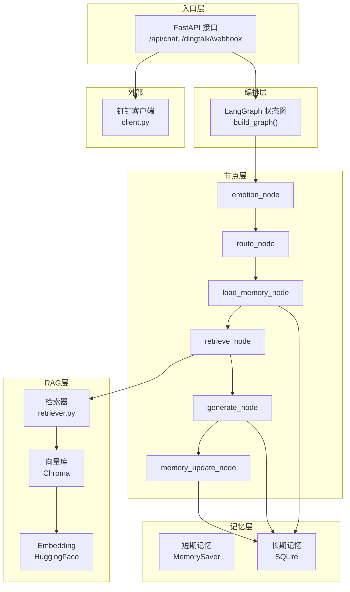
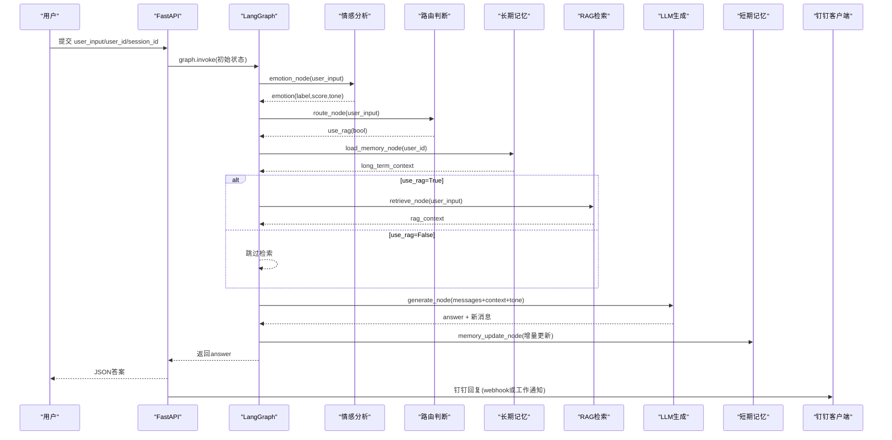
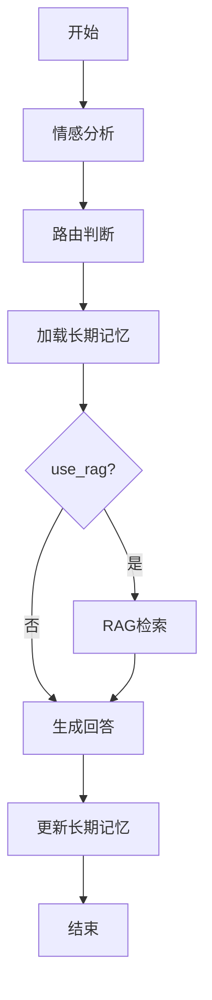
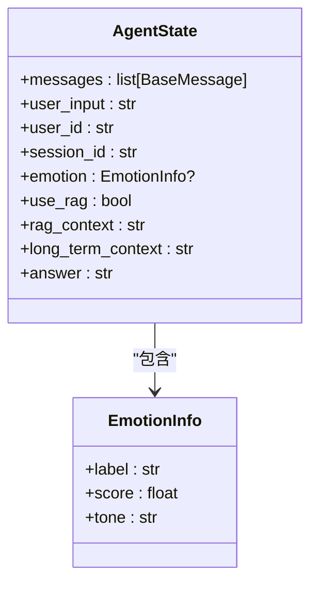
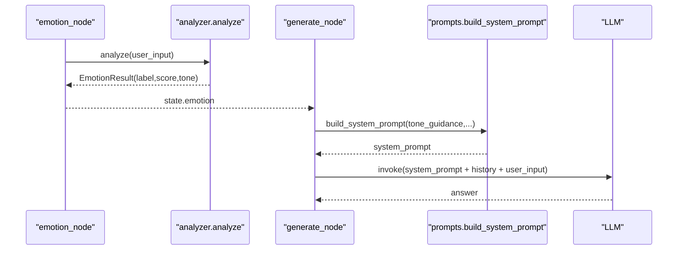
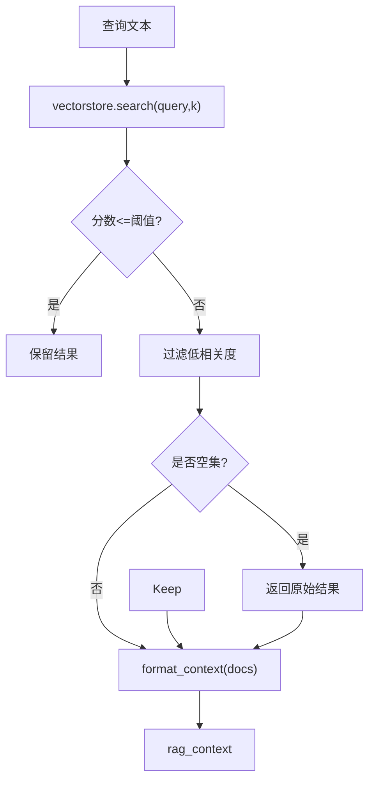
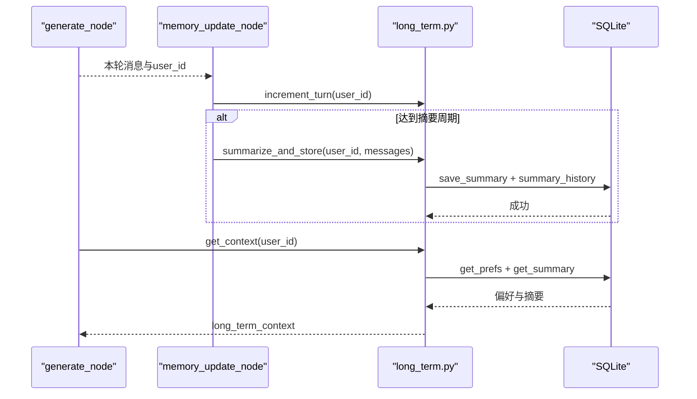
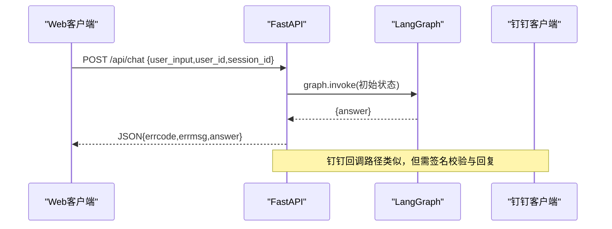
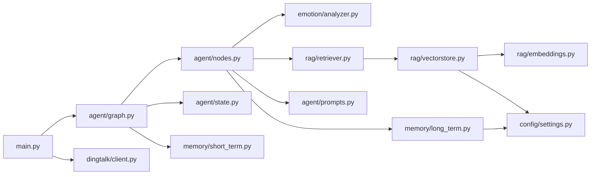

# 数据流设计

<cite>
**本文引用的文件**   
- [main.py](file://main.py)
- [agent/graph.py](file://agent/graph.py)
- [agent/state.py](file://agent/state.py)
- [agent/nodes.py](file://agent/nodes.py)
- [agent/prompts.py](file://agent/prompts.py)
- [rag/retriever.py](file://rag/retriever.py)
- [rag/vectorstore.py](file://rag/vectorstore.py)
- [rag/embeddings.py](file://rag/embeddings.py)
- [memory/long_term.py](file://memory/long_term.py)
- [memory/short_term.py](file://memory/short_term.py)
- [emotion/analyzer.py](file://emotion/analyzer.py)
- [config/settings.py](file://config/settings.py)
- [dingtalk/client.py](file://dingtalk/client.py)
</cite>

## 目录
1. [简介](#简介)
2. [项目结构](#项目结构)
3. [核心组件](#核心组件)
4. [架构总览](#架构总览)
5. [详细组件分析](#详细组件分析)
6. [依赖关系分析](#依赖关系分析)
7. [性能考量](#性能考量)
8. [故障排查指南](#故障排查指南)
9. [结论](#结论)
10. [附录](#附录)

## 简介
本文件面向钉钉AI智能体助手的数据流设计，系统性描述从用户输入到回复生成的完整数据处理路径，包括：
- 用户输入的解析与校验
- 状态图（LangGraph）执行流程与各节点输入输出
- AgentState 状态结构与字段生命周期
- RAG 检索的数据转换（原始文本→向量→上下文组装）
- 记忆管理（短期/长期）的持久化与检索机制
- 情感分析结果对回复生成的影响路径
- 关键数据在各组件间的传递与变换过程（含数据流图与状态转换图）

## 项目结构
系统采用分层模块化组织：
- 入口与路由：FastAPI 提供 Web 聊天与钉钉回调接口
- 工作流编排：LangGraph StateGraph 定义节点与边
- 节点实现：情感分析、路由判断、RAG检索、生成回答、记忆更新
- 记忆系统：短期（进程内 MemorySaver）、长期（SQLite）
- RAG 子系统：Embedding、向量库（Chroma）、检索器
- 配置中心：统一环境变量与默认值
- 外部集成：钉钉客户端发送消息

图表来源
- [main.py:58-91](file://main.py#L58-L91)
- [main.py:106-176](file://main.py#L106-L176)
- [agent/graph.py:25-69](file://agent/graph.py#L25-L69)
- [agent/nodes.py:31-164](file://agent/nodes.py#L31-L164)
- [rag/retriever.py:13-38](file://rag/retriever.py#L13-L38)
- [rag/vectorstore.py:14-75](file://rag/vectorstore.py#L14-L75)
- [rag/embeddings.py:21-41](file://rag/embeddings.py#L21-L41)
- [memory/short_term.py:13-28](file://memory/short_term.py#L13-L28)
- [memory/long_term.py:150-163](file://memory/long_term.py#L150-L163)
- [dingtalk/client.py:104-127](file://dingtalk/client.py#L104-L127)

章节来源
- [main.py:1-236](file://main.py#L1-L236)
- [agent/graph.py:1-106](file://agent/graph.py#L1-L106)

## 核心组件
- FastAPI 应用与接口：提供 Web 聊天与钉钉回调，负责参数校验、会话标识注入、异常处理与响应封装。
- LangGraph 状态图：定义节点与条件边，按 thread_id(session_id) 维护短期上下文。
- 节点函数：完成情感分析、路由判断、长期记忆加载、RAG检索、LLM生成、记忆更新等。
- 记忆系统：短期使用进程内 MemorySaver；长期使用 SQLite 存储摘要、偏好与历史。
- RAG 子系统：本地 Embedding + Chroma 向量库，支持文档入库与语义检索。
- 配置中心：集中管理 LLM、Embedding、向量库、记忆、钉钉等参数。
- 钉钉客户端：获取 access_token、发送工作通知或机器人 webhook 回复。

章节来源
- [main.py:58-91](file://main.py#L58-L91)
- [main.py:106-176](file://main.py#L106-L176)
- [agent/graph.py:25-69](file://agent/graph.py#L25-L69)
- [agent/nodes.py:31-164](file://agent/nodes.py#L31-L164)
- [memory/short_term.py:13-28](file://memory/short_term.py#L13-L28)
- [memory/long_term.py:150-163](file://memory/long_term.py#L150-L163)
- [rag/retriever.py:13-38](file://rag/retriever.py#L13-L38)
- [rag/vectorstore.py:48-68](file://rag/vectorstore.py#L48-L68)
- [rag/embeddings.py:21-41](file://rag/embeddings.py#L21-L41)
- [config/settings.py:16-93](file://config/settings.py#L16-L93)
- [dingtalk/client.py:16-140](file://dingtalk/client.py#L16-L140)

## 架构总览
整体数据流遵循“输入→状态图→节点→记忆/RAG→生成→记忆更新→回复”的流水线。状态图通过 checkpointer 按 session_id 维护多轮对话上下文，RAG 在需要时检索知识库并格式化上下文，情感分析为生成阶段提供语气指引。

图表来源
- [main.py:58-91](file://main.py#L58-L91)
- [main.py:106-176](file://main.py#L106-L176)
- [agent/graph.py:25-69](file://agent/graph.py#L25-L69)
- [agent/nodes.py:31-164](file://agent/nodes.py#L31-L164)
- [rag/retriever.py:13-38](file://rag/retriever.py#L13-L38)
- [memory/long_term.py:150-163](file://memory/long_term.py#L150-L163)
- [memory/short_term.py:13-28](file://memory/short_term.py#L13-L28)
- [dingtalk/client.py:104-127](file://dingtalk/client.py#L104-L127)

## 详细组件分析

### 状态图与工作流
- 构建与编译：build_graph 注册节点与边，添加条件边根据 use_rag 分流至 retrieve 或 generate，挂载 checkpointer 以线程隔离短期上下文。
- 单例与便捷调用：get_compiled_graph 缓存编译后的图；chat 提供单轮问答入口。
- 节点顺序：START → emotion → route → load_memory → (use_rag?) retrieve/generate → memory_update → END。

图表来源
- [agent/graph.py:25-69](file://agent/graph.py#L25-L69)
- [agent/graph.py:76-106](file://agent/graph.py#L76-L106)
- [agent/nodes.py:31-164](file://agent/nodes.py#L31-L164)

章节来源
- [agent/graph.py:1-106](file://agent/graph.py#L1-L106)

### AgentState 状态结构设计与生命周期
- messages：带 reducer 的消息历史，自动累加多轮对话，供生成节点拼接上下文。
- user_input：当前轮的用户输入，贯穿整个流程。
- user_id：用户标识，用于长期记忆的存取与个性化。
- session_id：会话标识，映射到 checkpointer 的 thread_id，维护短期上下文。
- emotion：情感分析结果（label/score/tone），影响生成阶段的语气指引。
- use_rag：是否需要检索知识库的布尔标志，由路由节点决定。
- rag_context：RAG 检索后格式化的上下文字符串。
- long_term_context：长期记忆拼装后的上下文字符串。
- answer：最终生成的回答。

生命周期要点：
- 初始状态由入口层注入 user_input/user_id/session_id。
- emotion_node 写入 emotion。
- route_node 写入 use_rag。
- load_memory_node 读取 user_id 并写入 long_term_context。
- retrieve_node 写入 rag_context（可选）。
- generate_node 组合 messages/history/rag_context/long_term_context/emotion 生成 answer，并追加新消息。
- memory_update_node 周期性触发摘要更新，不修改状态。

图表来源
- [agent/state.py:12-47](file://agent/state.py#L12-L47)

章节来源
- [agent/state.py:1-47](file://agent/state.py#L1-L47)

### 情感分析对回复生成的影响路径
- emotion_node 调用 analyzer.analyze，优先使用 LLM 结构化输出，失败回退关键词规则。
- get_tone_guidance 将情感结果转换为语气指引文案。
- generate_node 将 tone_guidance 注入 system_prompt，影响 LLM 生成风格与共情程度。

图表来源
- [agent/nodes.py:31-43](file://agent/nodes.py#L31-L43)
- [emotion/analyzer.py:82-118](file://emotion/analyzer.py#L82-L118)
- [agent/prompts.py:18-43](file://agent/prompts.py#L18-L43)
- [agent/nodes.py:104-141](file://agent/nodes.py#L104-L141)

章节来源
- [emotion/analyzer.py:1-118](file://emotion/analyzer.py#L1-L118)
- [agent/nodes.py:31-43](file://agent/nodes.py#L31-L43)
- [agent/prompts.py:1-63](file://agent/prompts.py#L1-L63)

### RAG 检索数据转换与上下文组装
- retriever.retrieve：调用 vectorstore.search 进行语义检索，返回 (Document, score)。
- retriever.format_context：将检索结果格式化为带来源、标题、相关度的字符串。
- retriever.retrieve_context：一站式检索并返回上下文字符串。
- vectorstore.search：基于 Chroma 相似度搜索，过滤低相关度结果，保证至少返回内容。
- embeddings.get_embeddings：本地 HuggingFace Embedding，支持镜像与离线模式。

图表来源
- [rag/retriever.py:13-38](file://rag/retriever.py#L13-L38)
- [rag/vectorstore.py:48-68](file://rag/vectorstore.py#L48-L68)
- [rag/embeddings.py:21-41](file://rag/embeddings.py#L21-L41)

章节来源
- [rag/retriever.py:1-38](file://rag/retriever.py#L1-L38)
- [rag/vectorstore.py:1-75](file://rag/vectorstore.py#L1-L75)
- [rag/embeddings.py:1-41](file://rag/embeddings.py#L1-L41)

### 记忆管理系统：持久化与检索
- 短期记忆：MemorySaver 按 thread_id(session_id) 维护会话上下文，无需外部服务。
- 长期记忆：SQLite 存储用户摘要、偏好与历史；支持并发读（WAL）、写串行化（锁）。
- 摘要生成：周期性触发 summarize_and_store，使用 LLM 生成摘要并落库，限制最近 20 条。
- 上下文拼装：get_context 合并偏好与摘要形成 long_term_context。

图表来源
- [memory/short_term.py:13-28](file://memory/short_term.py#L13-L28)
- [memory/long_term.py:75-100](file://memory/long_term.py#L75-L100)
- [memory/long_term.py:150-163](file://memory/long_term.py#L150-L163)
- [memory/long_term.py:203-244](file://memory/long_term.py#L203-L244)

章节来源
- [memory/short_term.py:1-28](file://memory/short_term.py#L1-L28)
- [memory/long_term.py:1-244](file://memory/long_term.py#L1-L244)

### 入口与外部集成
- Web 聊天接口：/api/chat 接收 ChatRequest，构造初始状态并调用 graph.invoke，返回 JSON。
- 钉钉回调：/dingtalk/webhook 校验签名、提取文本与会话信息，调用智能体并通过钉钉客户端回复。
- 健康检查：/health 返回服务状态与短期记忆后端类型。

图表来源
- [main.py:58-91](file://main.py#L58-L91)
- [main.py:106-176](file://main.py#L106-L176)
- [dingtalk/client.py:104-127](file://dingtalk/client.py#L104-L127)

章节来源
- [main.py:1-236](file://main.py#L1-L236)
- [dingtalk/client.py:1-140](file://dingtalk/client.py#L1-L140)

## 依赖关系分析
- 模块耦合：
  - main.py 依赖 agent.graph、config.settings、dingtalk.client、dingtalk.crypto。
  - agent.graph 依赖 agent.nodes、agent.state、memory.short_term。
  - agent.nodes 依赖 emotion.analyzer、rag.retriever、memory.long_term、agent.prompts。
  - rag.retriever 依赖 rag.vectorstore。
  - rag.vectorstore 依赖 rag.embeddings、config.settings。
  - memory.long_term 依赖 config.settings。
- 潜在循环依赖：通过延迟导入避免（如 _get_llm、_get_embeddings）。
- 外部依赖：LangChain/LangGraph、Chroma、HuggingFace、OpenAI兼容接口、httpx。

图表来源
- [main.py:58-91](file://main.py#L58-L91)
- [agent/graph.py:25-69](file://agent/graph.py#L25-L69)
- [agent/nodes.py:31-164](file://agent/nodes.py#L31-L164)
- [rag/retriever.py:13-38](file://rag/retriever.py#L13-L38)
- [rag/vectorstore.py:14-75](file://rag/vectorstore.py#L14-L75)
- [rag/embeddings.py:21-41](file://rag/embeddings.py#L21-L41)
- [memory/long_term.py:150-163](file://memory/long_term.py#L150-L163)
- [config/settings.py:16-93](file://config/settings.py#L16-L93)
- [dingtalk/client.py:16-140](file://dingtalk/client.py#L16-L140)

章节来源
- [config/settings.py:16-93](file://config/settings.py#L16-L93)

## 性能考量
- 向量检索：
  - 使用本地 Embedding（CPU）与 Chroma 本地持久化，减少网络开销。
  - 设置 rag_score_filter 过滤低相关度结果，降低无效上下文长度。
- 记忆更新：
  - 短期记忆使用进程内 MemorySaver，无 I/O 开销。
  - 长期记忆摘要周期性触发（memory_summary_every），避免频繁 LLM 调用。
- 并发与锁：
  - SQLite WAL 模式提升并发读能力；写操作通过线程锁串行化。
- 错误回退：
  - 情感分析与路由判断具备规则兜底，保障可用性。
  - RAG 检索失败返回空上下文，不影响生成流程。

[本节为通用指导，不直接分析具体文件]

## 故障排查指南
- 输入为空：/api/chat 与 /dingtalk/webhook 均对空输入做快速返回，检查请求体字段。
- 签名校验失败：钉钉回调需正确配置 secret，确认 timestamp/sign 参数。
- LLM不可用：
  - 情感分析回退关键词规则；路由判断回退关键词匹配；生成节点捕获异常返回友好提示。
  - 检查 llm_model、llm_api_key、llm_base_url 配置。
- RAG检索失败：
  - 检查向量库初始化与持久化路径；确认 embedding 模型可用（HF_ENDPOINT/HF_HUB_OFFLINE）。
  - 调整 rag_top_k 与 rag_score_filter。
- 长期记忆异常：
  - 检查 SQLite 文件权限与路径；确认数据库表初始化；查看日志中的锁与超时。
- 钉钉回复失败：
  - 检查 access_token 获取与过期时间；确认 webhook_token 或工作通知配置。

章节来源
- [main.py:58-91](file://main.py#L58-L91)
- [main.py:106-176](file://main.py#L106-L176)
- [emotion/analyzer.py:82-118](file://emotion/analyzer.py#L82-L118)
- [agent/nodes.py:53-68](file://agent/nodes.py#L53-L68)
- [rag/vectorstore.py:48-68](file://rag/vectorstore.py#L48-L68)
- [rag/embeddings.py:17-18](file://rag/embeddings.py#L17-L18)
- [memory/long_term.py:75-100](file://memory/long_term.py#L75-L100)
- [dingtalk/client.py:25-56](file://dingtalk/client.py#L25-L56)

## 结论
本数据流设计以 LangGraph 为核心编排，结合情感分析、RAG检索与双层级记忆系统，实现了从用户输入到高质量回复的端到端处理。通过合理的状态结构与节点分工，系统在可用性、可维护性与扩展性方面具备良好的工程基础。建议在生产环境中关注以下优化点：
- 合理配置检索阈值与 top-k，平衡召回质量与上下文长度。
- 定期评估与调优记忆摘要策略，控制长期上下文规模。
- 监控 LLM 与向量库可用性，完善降级与重试机制。
- 加强日志与追踪（LangSmith），便于问题定位与效果评估。

[本节为总结性内容，不直接分析具体文件]

## 附录
- 关键配置项说明（来自 settings.py）：
  - LLM：模型名、基地址、API Key、温度
  - Embedding：模型名、设备、归一化
  - 向量库：持久化目录、集合名、top-k、分数阈值
  - 记忆：长期数据库路径、摘要周期
  - 钉钉：AppKey/Secret、Robot Token/Secret、API Base
  - LangSmith：API Key、项目名、追踪开关、端点

章节来源
- [config/settings.py:16-93](file://config/settings.py#L16-L93)