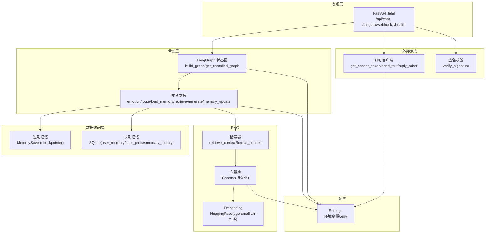
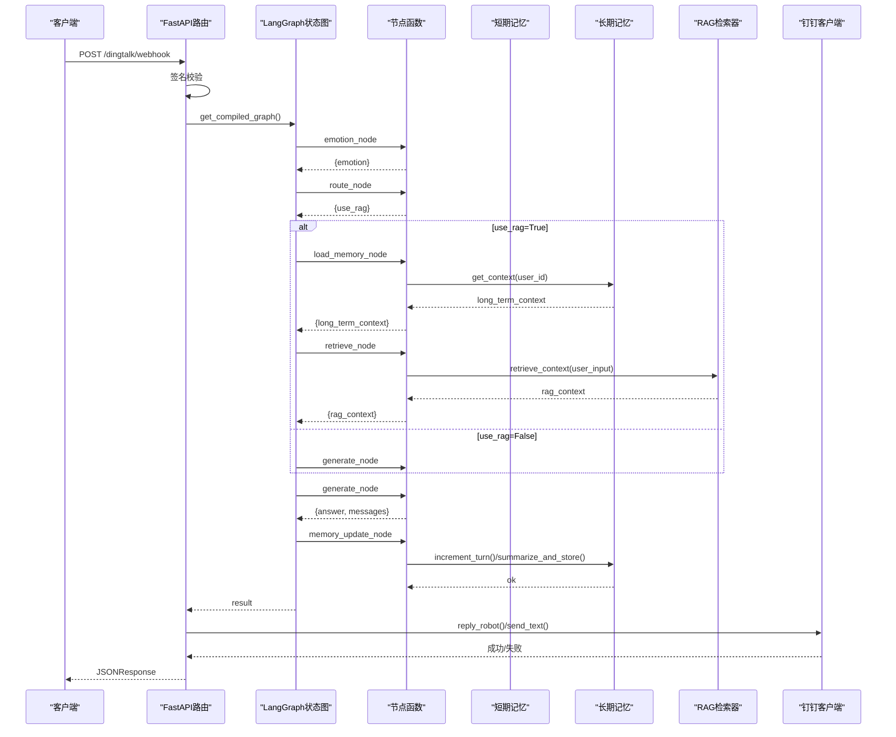
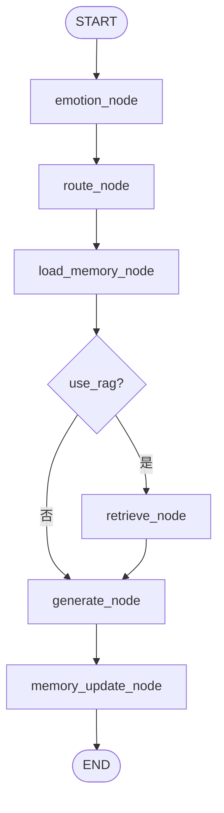
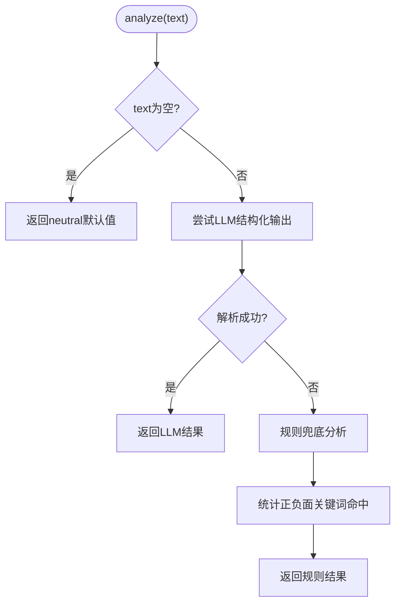
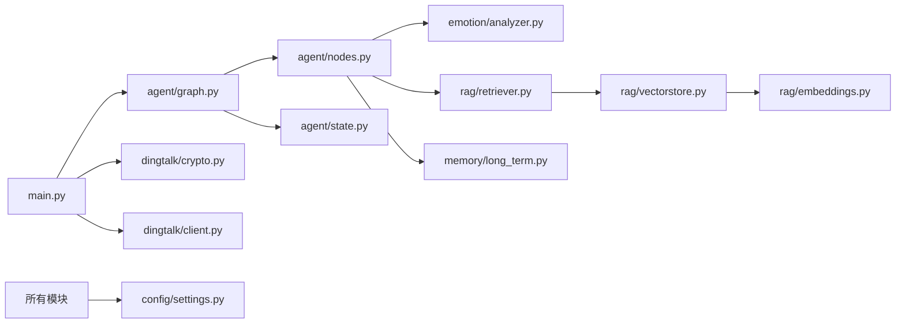

# 架构模式与设计原则

<cite>
**本文引用的文件**   
- [main.py](file://main.py)
- [agent/graph.py](file://agent/graph.py)
- [agent/state.py](file://agent/state.py)
- [agent/nodes.py](file://agent/nodes.py)
- [agent/prompts.py](file://agent/prompts.py)
- [config/settings.py](file://config/settings.py)
- [emotion/analyzer.py](file://emotion/analyzer.py)
- [memory/short_term.py](file://memory/short_term.py)
- [memory/long_term.py](file://memory/long_term.py)
- [rag/vectorstore.py](file://rag/vectorstore.py)
- [rag/embeddings.py](file://rag/embeddings.py)
- [rag/retriever.py](file://rag/retriever.py)
- [dingtalk/client.py](file://dingtalk/client.py)
- [dingtalk/crypto.py](file://dingtalk/crypto.py)
</cite>

## 目录
1. [引言](#引言)
2. [项目结构](#项目结构)
3. [核心组件](#核心组件)
4. [架构总览](#架构总览)
5. [详细组件分析](#详细组件分析)
6. [依赖关系分析](#依赖关系分析)
7. [性能考量](#性能考量)
8. [故障排查指南](#故障排查指南)
9. [结论](#结论)
10. [附录](#附录)

## 引言
本文件面向钉钉AI智能体助手的架构模式与设计原则，聚焦以下目标：
- 分层架构模式：表现层（FastAPI路由）、业务层（Agent工作流）、数据访问层（记忆管理）的职责分离与协作。
- 状态图模式在LangGraph中的应用：状态定义、节点函数设计与状态流转机制。
- 单例模式：配置管理、数据库连接、客户端实例的复用与生命周期。
- 策略模式：情感分析中“LLM优先 + 规则兜底”的策略选择。
- 工厂模式：向量库与LLM实例的创建与获取。
- 中间件模式：FastAPI路由处理与错误处理的横切关注点。

## 项目结构
系统采用按功能域划分的模块化结构，核心模块包括：
- 表现层：FastAPI入口与Webhook回调、健康检查、本地REPL调试。
- 业务层：基于LangGraph的状态图工作流，编排情感分析、路由判断、检索、生成与记忆更新。
- 数据访问层：短期记忆（进程内MemorySaver）、长期记忆（SQLite持久化）。
- RAG子系统：Embedding模型、Chroma向量库、检索器与上下文格式化。
- 外部集成：钉钉客户端与签名校验。
- 配置中心：集中式配置加载与路径计算。

图表来源
- [main.py:1-236](file://main.py#L1-L236)
- [agent/graph.py:1-106](file://agent/graph.py#L1-L106)
- [agent/nodes.py:1-164](file://agent/nodes.py#L1-L164)
- [memory/short_term.py:1-28](file://memory/short_term.py#L1-L28)
- [memory/long_term.py:1-244](file://memory/long_term.py#L1-L244)
- [rag/vectorstore.py:1-75](file://rag/vectorstore.py#L1-L75)
- [rag/embeddings.py:1-41](file://rag/embeddings.py#L1-L41)
- [rag/retriever.py:1-38](file://rag/retriever.py#L1-L38)
- [dingtalk/client.py:1-140](file://dingtalk/client.py#L1-L140)
- [dingtalk/crypto.py:1-63](file://dingtalk/crypto.py#L1-L63)
- [config/settings.py:1-93](file://config/settings.py#L1-L93)

章节来源
- [main.py:1-236](file://main.py#L1-L236)
- [agent/graph.py:1-106](file://agent/graph.py#L1-L106)

## 核心组件
- 表现层（FastAPI）
  - Web聊天接口：直接调用智能体图并返回JSON结果。
  - 钉钉Webhook回调：签名校验后调用智能体图，并通过钉钉客户端回复消息。
  - 健康检查：暴露服务状态与checkpointer类型。
- 业务层（LangGraph）
  - 状态图构建：注册节点、线性边与条件边，挂载checkpointer。
  - 节点函数：情感分析、路由判断、长期记忆加载、RAG检索、回答生成、记忆更新。
- 数据访问层（记忆）
  - 短期记忆：进程内MemorySaver，按thread_id维护会话上下文。
  - 长期记忆：SQLite存储用户摘要、偏好与历史摘要，支持周期性摘要与轮次计数。
- RAG子系统
  - Embedding：本地HuggingFace模型，镜像加速下载。
  - 向量库：Chroma持久化，支持文档入库与相似度检索。
  - 检索器：语义检索+上下文格式化，供生成节点使用。
- 外部集成
  - 钉钉客户端：access_token缓存、文本/Markdown发送、机器人webhook回复。
  - 签名校验：HMAC-SHA256签名生成与验证，防重放。
- 配置中心
  - Settings：集中管理LLM、Embedding、向量库、记忆、钉钉、LangSmith等参数。
  - 提供路径属性与绝对路径解析。

章节来源
- [main.py:58-176](file://main.py#L58-L176)
- [agent/graph.py:25-81](file://agent/graph.py#L25-L81)
- [agent/nodes.py:31-164](file://agent/nodes.py#L31-L164)
- [memory/short_term.py:13-28](file://memory/short_term.py#L13-L28)
- [memory/long_term.py:75-163](file://memory/long_term.py#L75-L163)
- [rag/vectorstore.py:14-75](file://rag/vectorstore.py#L14-L75)
- [rag/embeddings.py:21-41](file://rag/embeddings.py#L21-L41)
- [rag/retriever.py:13-38](file://rag/retriever.py#L13-L38)
- [dingtalk/client.py:16-140](file://dingtalk/client.py#L16-L140)
- [dingtalk/crypto.py:14-63](file://dingtalk/crypto.py#L14-L63)
- [config/settings.py:16-93](file://config/settings.py#L16-L93)

## 架构总览
系统采用分层架构与状态图模式的组合：
- 表现层通过FastAPI暴露REST端点，统一接收请求并进行基础校验与异常处理。
- 业务层以LangGraph状态图为中枢，将多步处理流程（情感分析、路由、检索、生成、记忆更新）解耦为节点，便于扩展与维护。
- 数据访问层将短期与长期记忆分离，短期用于会话级上下文连贯性，长期用于跨会话个性化与知识沉淀。
- RAG子系统作为可插拔的知识增强模块，通过Embedding与向量库实现语义检索。
- 外部集成与配置中心提供稳定的依赖注入与运行时参数。

图表来源
- [main.py:106-176](file://main.py#L106-L176)
- [agent/graph.py:25-81](file://agent/graph.py#L25-L81)
- [agent/nodes.py:31-164](file://agent/nodes.py#L31-L164)
- [memory/long_term.py:150-163](file://memory/long_term.py#L150-L163)
- [rag/retriever.py:34-38](file://rag/retriever.py#L34-L38)
- [dingtalk/client.py:104-127](file://dingtalk/client.py#L104-L127)

## 详细组件分析

### 状态图模式在LangGraph中的应用
- 状态定义
  - AgentState包含消息历史、用户输入、用户与会话标识、情感信息、是否使用RAG、RAG上下文、长期记忆上下文与最终答案。
  - 消息历史通过add_messages reducer自动累加，其他字段覆盖写入。
- 节点函数设计
  - emotion_node：调用情感分析模块，输出情感标签、置信度与语气指引。
  - route_node：基于LLM或关键词判断是否需要RAG检索。
  - load_memory_node：从长期记忆中拼装用户上下文。
  - retrieve_node：执行RAG检索并格式化上下文。
  - generate_node：组装系统提示词（含情感语气、长期记忆、RAG上下文），调用LLM生成回答。
  - memory_update_node：轮次计数与周期性摘要生成与存储。
- 状态流转机制
  - START -> emotion -> route -> load_memory -> (条件分支) retrieve|generate -> memory_update -> END。
  - 条件边由route_condition根据use_rag决定进入retrieve或generate。

图表来源
- [agent/state.py:20-44](file://agent/state.py#L20-L44)
- [agent/nodes.py:31-164](file://agent/nodes.py#L31-L164)
- [agent/graph.py:36-69](file://agent/graph.py#L36-L69)

章节来源
- [agent/state.py:1-47](file://agent/state.py#L1-L47)
- [agent/nodes.py:1-164](file://agent/nodes.py#L1-L164)
- [agent/graph.py:1-106](file://agent/graph.py#L1-L106)

### 单例模式的应用
- 配置管理
  - Settings通过lru_cache装饰的get_settings返回全局唯一配置实例，避免重复初始化与IO开销。
- 数据库连接
  - 长期记忆的SQLite连接在_get_conn中延迟创建并缓存，开启WAL模式提升并发读性能。
- 客户端实例
  - 钉钉客户端DingTalkClient通过模块级变量缓存，避免重复构造与网络配置读取。
- 向量库与Embedding
  - Chroma向量库与HuggingFaceEmbeddings均通过函数级缓存返回单例，减少资源占用。
- Checkpointer
  - MemorySaver在短期中被缓存为单例，按thread_id隔离会话上下文。

章节来源
- [config/settings.py:89-93](file://config/settings.py#L89-L93)
- [memory/long_term.py:24-41](file://memory/long_term.py#L24-L41)
- [dingtalk/client.py:130-140](file://dingtalk/client.py#L130-L140)
- [rag/vectorstore.py:14-26](file://rag/vectorstore.py#L14-L26)
- [rag/embeddings.py:21-41](file://rag/embeddings.py#L21-L41)
- [memory/short_term.py:13-28](file://memory/short_term.py#L13-L28)

### 策略模式在情感分析中的实现
- LLM优先策略
  - 使用ChatOpenAI结构化输出，解析JSON得到情感标签、置信度与原因。
- 规则兜底策略
  - 当LLM不可用或解析失败时，回退到基于中文词典的规则分析，统计正负面关键词命中数进行判定。
- 语气映射
  - 不同情感标签对应不同的回复语气指引，注入到系统提示词中影响生成风格。

图表来源
- [emotion/analyzer.py:82-118](file://emotion/analyzer.py#L82-L118)

章节来源
- [emotion/analyzer.py:1-118](file://emotion/analyzer.py#L1-L118)

### 工厂模式在向量库与LLM实例创建中的作用
- 向量库工厂
  - get_vectorstore根据配置创建Chroma实例，绑定Embedding与持久化目录，返回单例。
- LLM工厂
  - _get_llm在各节点与模块中按需创建ChatOpenAI实例，读取模型、密钥、基地址与温度参数。
- Embedding工厂
  - get_embeddings返回HuggingFaceEmbeddings单例，支持镜像与离线模式。

章节来源
- [rag/vectorstore.py:14-26](file://rag/vectorstore.py#L14-L26)
- [agent/nodes.py:15-27](file://agent/nodes.py#L15-L27)
- [rag/embeddings.py:21-41](file://rag/embeddings.py#L21-L41)

### 中间件模式在FastAPI路由处理与错误处理中的应用
- 路由处理
  - /api/chat与/dingtalk/webhook分别处理Web聊天与钉钉回调，统一调用智能体图并返回JSON。
- 错误处理
  - 各路由捕获异常并记录日志，返回标准化错误响应；健康检查暴露服务状态。
- 横切关注点
  - 签名校验、配置加载、客户端获取等逻辑集中在路由层，保持节点函数专注业务逻辑。

章节来源
- [main.py:58-176](file://main.py#L58-L176)
- [dingtalk/crypto.py:33-63](file://dingtalk/crypto.py#L33-L63)

## 依赖关系分析
- 模块耦合
  - main.py依赖agent.graph、config.settings、dingtalk.crypto与dingtalk.client。
  - agent.nodes依赖emotion.analyzer、rag.retriever、memory.long_term与config.settings。
  - rag.vectorstore依赖rag.embeddings与config.settings。
  - memory.long_term依赖config.settings与sqlite3。
- 潜在循环依赖
  - 通过延迟导入（如from ... import ...）避免循环依赖，例如在节点函数内部导入LLM与外部模块。
- 外部依赖
  - LangChain/LangGraph、Chroma、HuggingFace、httpx等第三方库。

图表来源
- [main.py:1-236](file://main.py#L1-L236)
- [agent/graph.py:1-106](file://agent/graph.py#L1-L106)
- [agent/nodes.py:1-164](file://agent/nodes.py#L1-L164)
- [rag/vectorstore.py:1-75](file://rag/vectorstore.py#L1-L75)
- [rag/embeddings.py:1-41](file://rag/embeddings.py#L1-L41)
- [memory/long_term.py:1-244](file://memory/long_term.py#L1-L244)
- [config/settings.py:1-93](file://config/settings.py#L1-L93)

章节来源
- [main.py:1-236](file://main.py#L1-L236)
- [agent/graph.py:1-106](file://agent/graph.py#L1-L106)
- [agent/nodes.py:1-164](file://agent/nodes.py#L1-L164)

## 性能考量
- 单例与缓存
  - 配置、数据库连接、客户端、向量库与Embedding均采用单例或缓存，减少重复初始化与IO开销。
- 并发与锁
  - SQLite写操作通过线程锁串行化，开启WAL模式提升读并发能力。
- 检索过滤
  - RAG检索结果按分数阈值过滤，避免低相关度内容污染上下文。
- 异步与阻塞
  - FastAPI路由中使用同步def调用graph.invoke，由框架自动放入线程池，避免阻塞事件循环。
- 模型加载
  - HuggingFace模型首次加载较慢，建议预热与缓存；可通过HF_ENDPOINT与离线模式优化。

[本节为通用指导，不直接分析具体文件]

## 故障排查指南
- 签名校验失败
  - 检查timestamp与sign参数是否正确，确认secret配置与时间戳有效期。
- LLM调用失败
  - 检查API Key、Base URL与网络连通性；查看日志中的异常信息。
- 检索结果为空
  - 确认向量库已正确入库文档，调整top_k与分数阈值。
- 长期记忆未更新
  - 检查轮次计数与摘要触发周期，确认SQLite权限与路径。
- 健康检查异常
  - 检查checkpointer类型与服务状态，确认依赖模块正常加载。

章节来源
- [dingtalk/crypto.py:33-63](file://dingtalk/crypto.py#L33-L63)
- [main.py:94-103](file://main.py#L94-L103)
- [rag/vectorstore.py:48-68](file://rag/vectorstore.py#L48-L68)
- [memory/long_term.py:165-184](file://memory/long_term.py#L165-L184)

## 结论
本系统通过分层架构与状态图模式实现了清晰职责分离与可扩展的工作流编排。单例模式确保资源高效复用，策略模式保障情感分析的鲁棒性，工厂模式简化外部依赖的创建与管理，中间件模式统一了横切关注点的处理。整体设计兼顾性能、可维护性与可观测性，适合企业级AI助手场景。

[本节为总结性内容，不直接分析具体文件]

## 附录
- 启动方式
  - Web服务：uvicorn main:app --host 0.0.0.0 --port 8000 --reload
  - 本地REPL：python main.py --repl
- 关键端点
  - /api/chat：Web聊天接口
  - /dingtalk/webhook：钉钉回调接口
  - /health：健康检查

章节来源
- [main.py:212-236](file://main.py#L212-L236)