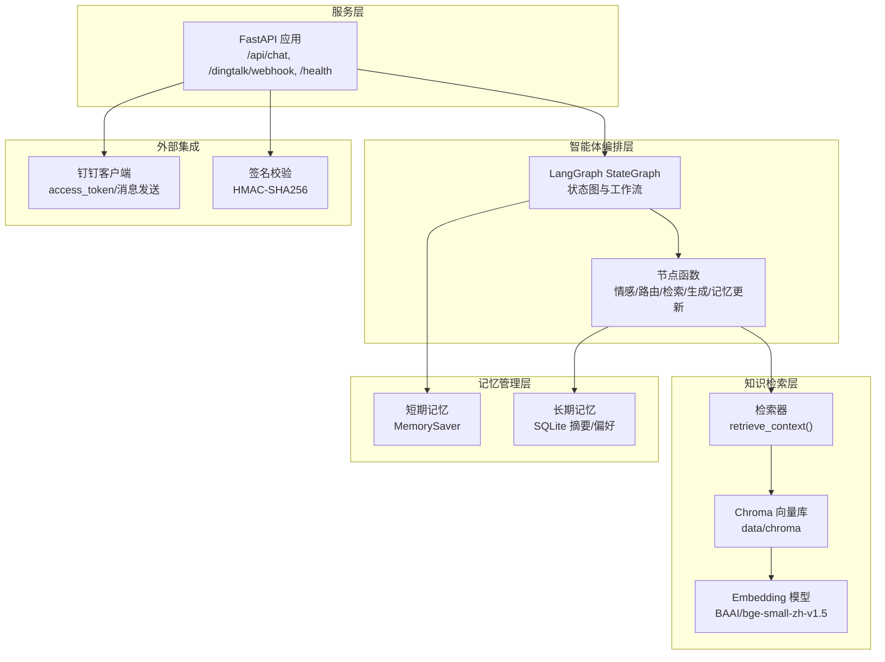
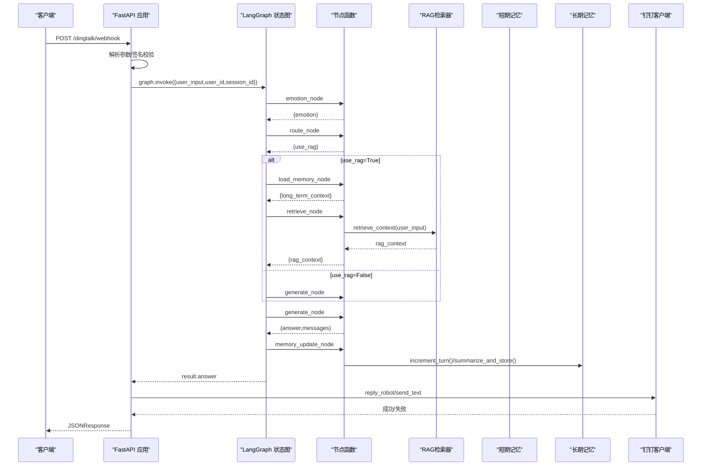
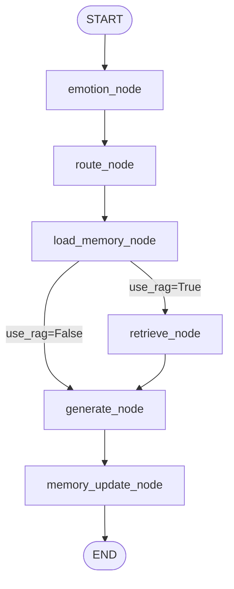
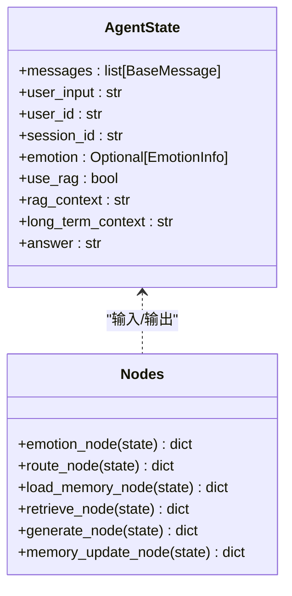
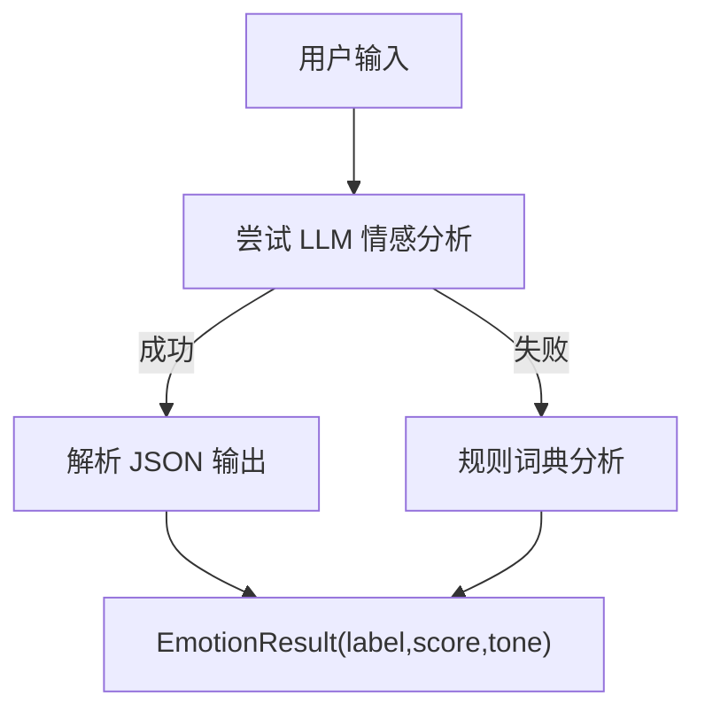
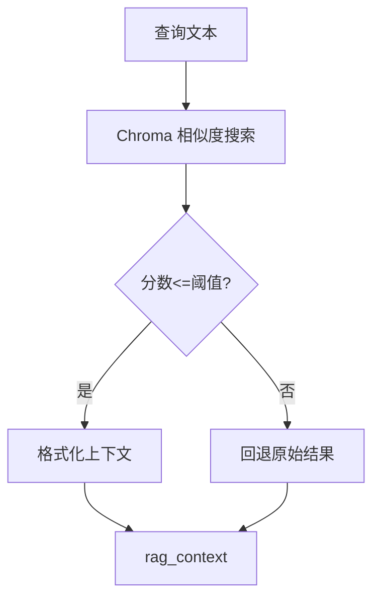
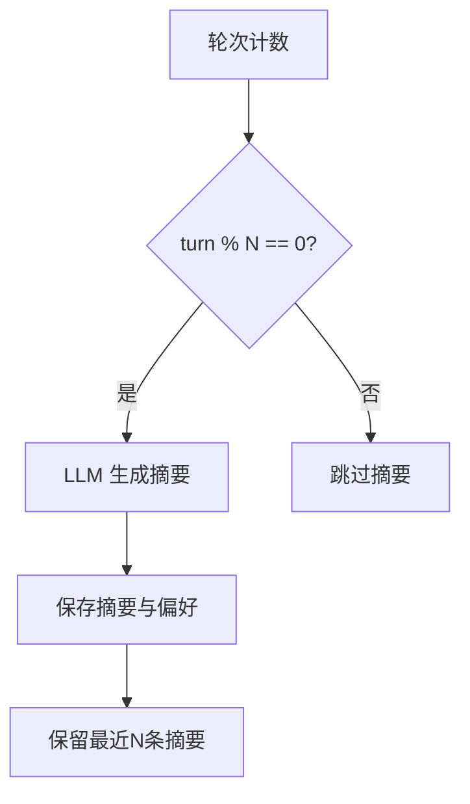
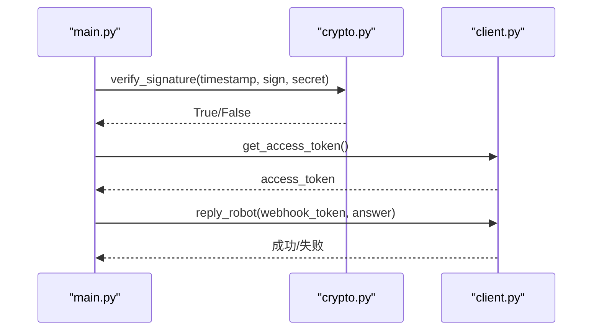
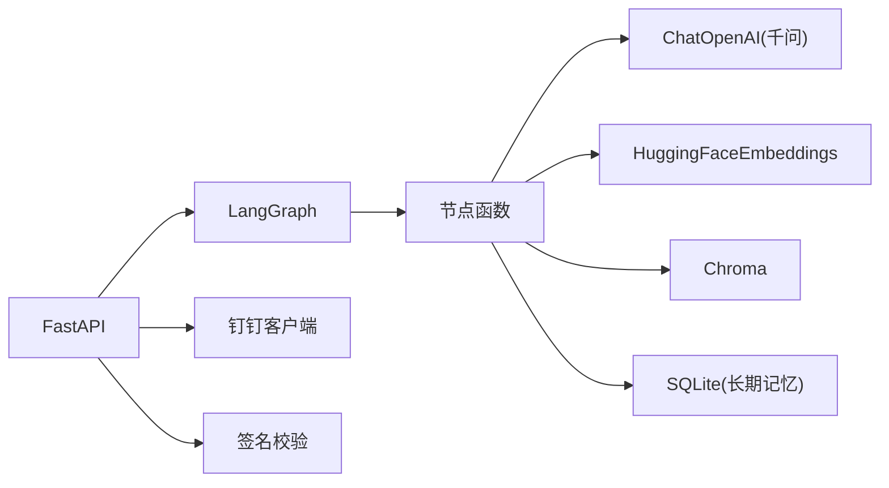

# 架构设计

<cite>
**本文引用的文件**   
- [main.py](file://main.py)
- [agent/graph.py](file://agent/graph.py)
- [agent/nodes.py](file://agent/nodes.py)
- [agent/state.py](file://agent/state.py)
- [agent/prompts.py](file://agent/prompts.py)
- [config/settings.py](file://config/settings.py)
- [rag/retriever.py](file://rag/retriever.py)
- [rag/vectorstore.py](file://rag/vectorstore.py)
- [rag/embeddings.py](file://rag/embeddings.py)
- [memory/short_term.py](file://memory/short_term.py)
- [memory/long_term.py](file://memory/long_term.py)
- [emotion/analyzer.py](file://emotion/analyzer.py)
- [dingtalk/client.py](file://dingtalk/client.py)
- [dingtalk/crypto.py](file://dingtalk/crypto.py)
- [requirements.txt](file://requirements.txt)
</cite>

## 目录
1. [引言](#引言)
2. [项目结构](#项目结构)
3. [核心组件](#核心组件)
4. [架构总览](#架构总览)
5. [详细组件分析](#详细组件分析)
6. [依赖关系分析](#依赖关系分析)
7. [性能考量](#性能考量)
8. [故障排查指南](#故障排查指南)
9. [结论](#结论)
10. [附录](#附录)

## 引言
本文件面向开发者与架构师，系统化阐述“钉钉AI智能体助手”的整体架构与设计决策。系统采用分层架构与模块化组织，基于 LangGraph 的状态图编排工作流，结合情感分析、RAG检索、长期/短期记忆管理与钉钉集成服务，提供高可用、可观测、可扩展的智能对话能力。文档重点解释状态图的工作流编排机制（状态管理、节点函数设计与数据流转），并给出系统上下文图与组件关系图，帮助读者快速把握宏观设计思路与实现细节。

## 项目结构
- 入口与服务层：FastAPI 应用提供 Web 聊天接口、钉钉回调端点与健康检查；支持本地 REPL 调试模式。
- 智能体编排层：LangGraph StateGraph 定义工作流，包含情感分析、路由判断、记忆加载、RAG检索、生成回答与记忆更新等节点。
- 知识与检索层：Embedding 模型、Chroma 向量库封装与检索器，负责文档入库与语义检索。
- 记忆管理层：短期记忆使用进程内 MemorySaver，长期记忆基于 SQLite 持久化用户摘要与偏好。
- 情感分析模块：LLM优先、规则兜底的情感分类与语气指引生成。
- 钉钉集成层：签名校验、企业应用 access_token 缓存与消息发送（工作通知/机器人Webhook）。
- 配置与评估：统一配置管理（环境变量/.env）、评估框架（OpenEvals + LangSmith）用于质量与路径合理性评估。

图表来源
- [main.py:58-176](file://main.py#L58-L176)
- [agent/graph.py:25-69](file://agent/graph.py#L25-L69)
- [rag/retriever.py:34-38](file://rag/retriever.py#L34-L38)
- [rag/vectorstore.py:48-68](file://rag/vectorstore.py#L48-L68)
- [rag/embeddings.py:22-41](file://rag/embeddings.py#L22-L41)
- [memory/short_term.py:13-21](file://memory/short_term.py#L13-L21)
- [memory/long_term.py:150-163](file://memory/long_term.py#L150-L163)
- [dingtalk/client.py:25-56](file://dingtalk/client.py#L25-L56)
- [dingtalk/crypto.py:33-62](file://dingtalk/crypto.py#L33-L62)

章节来源
- [main.py:1-236](file://main.py#L1-L236)
- [requirements.txt:1-31](file://requirements.txt#L1-L31)

## 核心组件
- 智能体工作流引擎（LangGraph）：以 AgentState 为中心，通过节点函数串联工作流，按条件边分流到 RAG 或直出回答，并在结束后更新记忆。
- 情感分析模块：对输入进行情感分类与语气指引生成，增强回复的共情与专业性。
- RAG检索系统：基于 BGE 中文 Embedding 与 Chroma 向量库，提供语义检索与上下文格式化。
- 记忆管理系统：短期会话上下文由 MemorySaver维护；长期记忆通过 SQLite 存储用户摘要与偏好，周期性触发摘要更新。
- 钉钉集成服务：处理回调签名校验、获取 access_token、通过工作通知或机器人 Webhook 回复消息。
- 配置管理：集中式 Settings，从环境变量与 .env 加载 LLM、Embedding、向量库、记忆、钉钉与 LangSmith 参数。

章节来源
- [agent/graph.py:25-69](file://agent/graph.py#L25-L69)
- [agent/nodes.py:31-164](file://agent/nodes.py#L31-L164)
- [emotion/analyzer.py:82-118](file://emotion/analyzer.py#L82-L118)
- [rag/retriever.py:34-38](file://rag/retriever.py#L34-L38)
- [rag/vectorstore.py:48-68](file://rag/vectorstore.py#L48-L68)
- [memory/short_term.py:13-21](file://memory/short_term.py#L13-L21)
- [memory/long_term.py:150-163](file://memory/long_term.py#L150-L163)
- [dingtalk/client.py:16-140](file://dingtalk/client.py#L16-L140)
- [config/settings.py:16-93](file://config/settings.py#L16-L93)

## 架构总览
系统采用分层架构：
- 接入层：FastAPI 暴露 REST 接口，接收 Web 聊天请求与钉钉回调。
- 编排层：LangGraph StateGraph 驱动工作流，协调各节点执行顺序与分支逻辑。
- 能力层：情感分析、RAG检索、记忆管理等能力模块，被节点函数按需调用。
- 集成层：钉钉客户端与签名校验，完成消息收发与安全验证。
- 配置层：统一 Settings 管理所有子系统参数。

图表来源
- [main.py:106-176](file://main.py#L106-L176)
- [agent/graph.py:25-69](file://agent/graph.py#L25-L69)
- [agent/nodes.py:31-164](file://agent/nodes.py#L31-L164)
- [rag/retriever.py:34-38](file://rag/retriever.py#L34-L38)
- [memory/long_term.py:165-184](file://memory/long_term.py#L165-L184)
- [dingtalk/client.py:104-127](file://dingtalk/client.py#L104-L127)

## 详细组件分析

### 智能体工作流引擎（LangGraph）
- 状态定义：AgentState 包含消息历史、用户输入、用户与会话标识、情感结果、是否使用 RAG、RAG上下文、长期记忆上下文与最终答案。
- 工作流编排：START -> emotion -> route -> load_memory -> (条件边) retrieve/generate -> memory_update -> END。
- Checkpointer：默认使用进程内 MemorySaver，按 thread_id（= session_id）维护会话上下文。
- 单例编译：模块级 _compiled 缓存 CompiledStateGraph，避免重复构建开销。

图表来源
- [agent/graph.py:25-69](file://agent/graph.py#L25-L69)
- [agent/state.py:20-44](file://agent/state.py#L20-L44)
- [memory/short_term.py:13-21](file://memory/short_term.py#L13-L21)

章节来源
- [agent/graph.py:25-69](file://agent/graph.py#L25-L69)
- [agent/state.py:20-44](file://agent/state.py#L20-L44)

### 节点函数设计
- emotion_node：调用情感分析模块，写入 state.emotion，并准备语气指引。
- route_node：基于关键词与 LLM 判断是否需要 RAG，写入 state.use_rag。
- load_memory_node：从长期记忆加载用户摘要与偏好，写入 state.long_term_context。
- retrieve_node：调用检索器获取 RAG 上下文，写入 state.rag_context。
- generate_node：组装 system prompt（含语气指引、长期记忆、RAG上下文），调用 LLM 生成回答，追加消息历史。
- memory_update_node：增加轮次计数，周期性触发摘要生成与存储。

图表来源
- [agent/state.py:20-44](file://agent/state.py#L20-L44)
- [agent/nodes.py:31-164](file://agent/nodes.py#L31-L164)

章节来源
- [agent/nodes.py:31-164](file://agent/nodes.py#L31-L164)

### 情感分析模块
- 策略：优先使用 LLM 结构化输出（JSON），失败回退到关键词词典规则分析。
- 输出：label（positive/negative/neutral）、score（置信度）、tone（语气指引）。
- 用途：为 generate_node 的系统 prompt 注入语气指导，提升回复共情与专业度。

图表来源
- [emotion/analyzer.py:82-118](file://emotion/analyzer.py#L82-L118)

章节来源
- [emotion/analyzer.py:82-118](file://emotion/analyzer.py#L82-L118)

### RAG检索系统
- Embedding：本地 HuggingFace 模型（BAAI/bge-small-zh-v1.5），支持镜像加速与离线缓存。
- 向量库：Chroma 持久化到 data/chroma，支持相似度搜索与分数过滤。
- 检索器：retrieve_context 一站式返回格式化的上下文字符串（含来源与相关度）。

图表来源
- [rag/embeddings.py:22-41](file://rag/embeddings.py#L22-L41)
- [rag/vectorstore.py:48-68](file://rag/vectorstore.py#L48-L68)
- [rag/retriever.py:34-38](file://rag/retriever.py#L34-L38)

章节来源
- [rag/retriever.py:34-38](file://rag/retriever.py#L34-L38)
- [rag/vectorstore.py:48-68](file://rag/vectorstore.py#L48-L68)
- [rag/embeddings.py:22-41](file://rag/embeddings.py#L22-L41)

### 记忆管理系统
- 短期记忆：基于 LangGraph checkpointer（MemorySaver），按 thread_id 维护会话上下文。
- 长期记忆：SQLite 存储用户摘要与偏好，支持轮次计数与周期性摘要生成；WAL 模式提升并发读性能。
- 触发策略：每 N 轮（可配置）触发一次摘要生成与存储，限制历史摘要数量。

图表来源
- [memory/short_term.py:13-21](file://memory/short_term.py#L13-L21)
- [memory/long_term.py:165-184](file://memory/long_term.py#L165-L184)
- [memory/long_term.py:197-244](file://memory/long_term.py#L197-L244)

章节来源
- [memory/short_term.py:13-21](file://memory/short_term.py#L13-L21)
- [memory/long_term.py:150-163](file://memory/long_term.py#L150-L163)
- [memory/long_term.py:165-184](file://memory/long_term.py#L165-L184)
- [memory/long_term.py:197-244](file://memory/long_term.py#L197-L244)

### 钉钉集成服务
- 签名校验：HMAC-SHA256 校验 timestamp+secret，防重放攻击。
- Access Token：本地缓存，减少频繁请求。
- 消息发送：支持工作通知（文本/Markdown）与机器人 Webhook 回复群消息。

图表来源
- [dingtalk/crypto.py:33-62](file://dingtalk/crypto.py#L33-L62)
- [dingtalk/client.py:25-56](file://dingtalk/client.py#L25-L56)
- [dingtalk/client.py:104-127](file://dingtalk/client.py#L104-L127)

章节来源
- [dingtalk/crypto.py:33-62](file://dingtalk/crypto.py#L33-L62)
- [dingtalk/client.py:25-56](file://dingtalk/client.py#L25-L56)
- [dingtalk/client.py:104-127](file://dingtalk/client.py#L104-L127)

### Prompt 模板与路由策略
- 系统提示：动态注入语气指引、长期记忆与 RAG 上下文，确保回答连贯与有据可依。
- 路由策略：LLM 判断 + 关键词兜底，平衡准确性与鲁棒性。

章节来源
- [agent/prompts.py:1-63](file://agent/prompts.py#L1-L63)
- [agent/nodes.py:46-68](file://agent/nodes.py#L46-L68)

## 依赖关系分析
- 框架与生态：LangChain/LangGraph、OpenAI兼容接口、HuggingFace Embedding、Chroma、FastAPI/Uvicorn。
- 配置与评估：pydantic-settings、LangSmith、OpenEvals。
- 外部服务：阿里云通义千问（DashScope）、钉钉开放平台。

图表来源
- [requirements.txt:1-31](file://requirements.txt#L1-L31)
- [main.py:26-36](file://main.py#L26-L36)
- [agent/graph.py:10-22](file://agent/graph.py#L10-L22)
- [rag/embeddings.py:22-41](file://rag/embeddings.py#L22-L41)
- [rag/vectorstore.py:14-25](file://rag/vectorstore.py#L14-L25)
- [memory/long_term.py:24-41](file://memory/long_term.py#L24-L41)
- [dingtalk/client.py:16-23](file://dingtalk/client.py#L16-L23)

章节来源
- [requirements.txt:1-31](file://requirements.txt#L1-L31)

## 性能考量
- 向量检索：Chroma 相似度搜索 + 分数过滤，降低无关噪声；可通过调整 top_k 与阈值平衡召回与精度。
- 短期记忆：进程内 MemorySaver 无网络开销，适合多轮对话上下文保持。
- 长期记忆：SQLite WAL 模式提升并发读性能；摘要历史限制数量控制存储增长。
- LLM调用：路由策略减少不必要的检索与生成；温度参数调优影响创造性与稳定性。
- 静态资源与热重载：开发阶段启用 reload，生产环境建议关闭以提升性能。

## 故障排查指南
- 钉钉回调签名失败：检查 secret 配置与时间戳有效期；确认 HMAC-SHA256 计算一致。
- 无法获取 access_token：核对 app_key/app_secret 与网络连通性；查看日志中的错误响应。
- RAG检索为空：检查向量库是否已入库文档；调整 rag_top_k 与 rag_score_filter。
- 长期记忆未更新：确认 memory_summary_every 配置与轮次计数；查看 SQLite 权限与 WAL 模式。
- LLM调用异常：检查 API Key、base_url 与网络；必要时回退到规则分析或降级策略。

章节来源
- [dingtalk/crypto.py:33-62](file://dingtalk/crypto.py#L33-L62)
- [dingtalk/client.py:25-56](file://dingtalk/client.py#L25-L56)
- [rag/vectorstore.py:48-68](file://rag/vectorstore.py#L48-L68)
- [memory/long_term.py:165-184](file://memory/long_term.py#L165-L184)
- [emotion/analyzer.py:82-118](file://emotion/analyzer.py#L82-L118)

## 结论
本系统以 LangGraph 为核心编排引擎，结合情感分析、RAG检索与双轨记忆管理，构建了面向钉钉场景的智能体助手。通过分层架构与模块化设计，系统在功能扩展性与可维护性上具备良好基础。技术选型权衡包括：选择 LangChain/LangGraph 生态以实现灵活工作流编排；采用本地 Embedding 与 Chroma 以降低外部依赖与成本；使用 SQLite 作为轻量级长期记忆存储。未来可在评估体系、监控告警与多模态能力方面持续演进。

## 附录
- 启动方式：
  - Web 服务：uvicorn main:app --host 0.0.0.0 --port 8000 --reload
  - 本地 REPL：python main.py --repl
- 健康检查：GET /health
- 钉钉回调：POST /dingtalk/webhook
- 前端页面：GET /（返回 static/index.html）

章节来源
- [main.py:1-236](file://main.py#L1-L236)