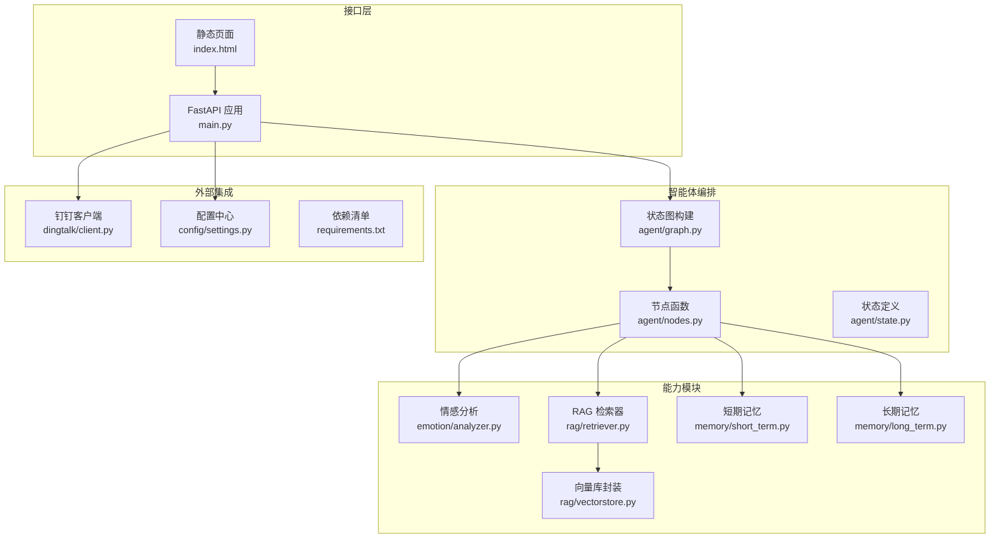
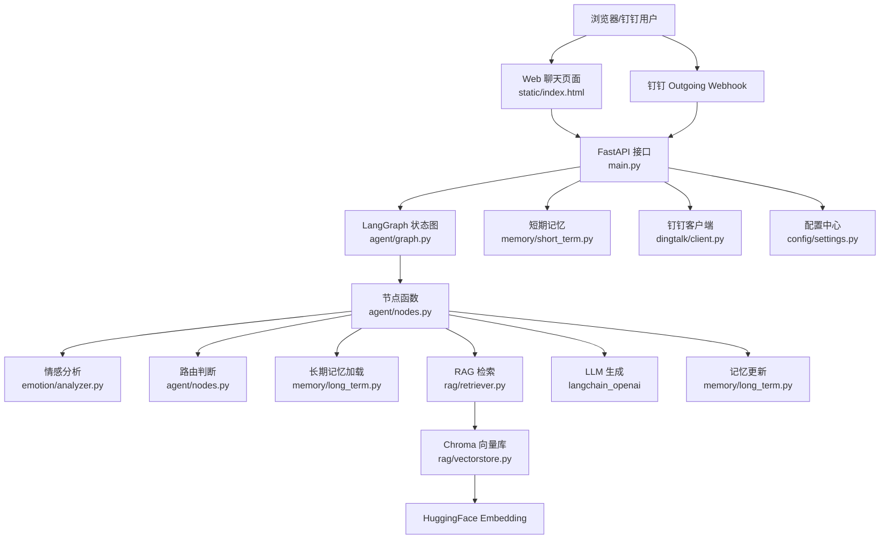
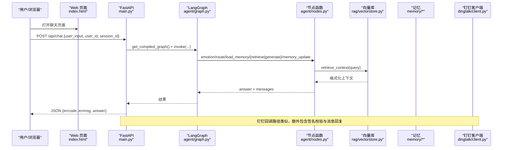
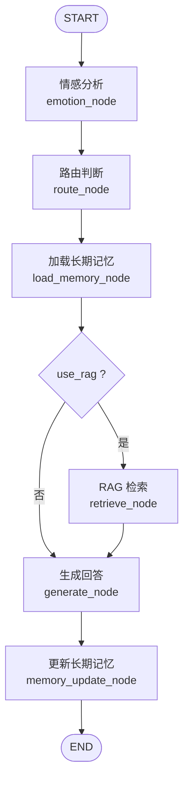
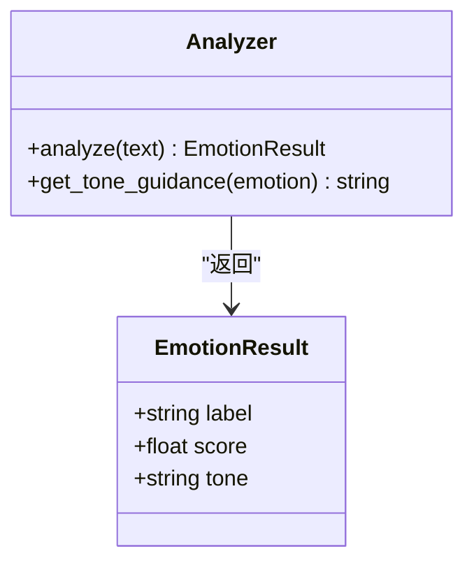
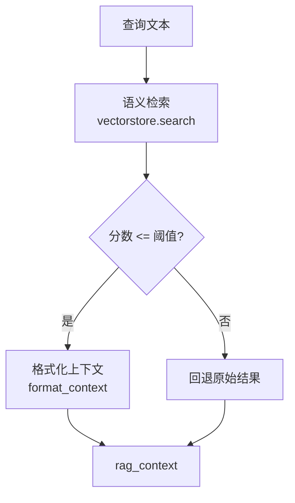
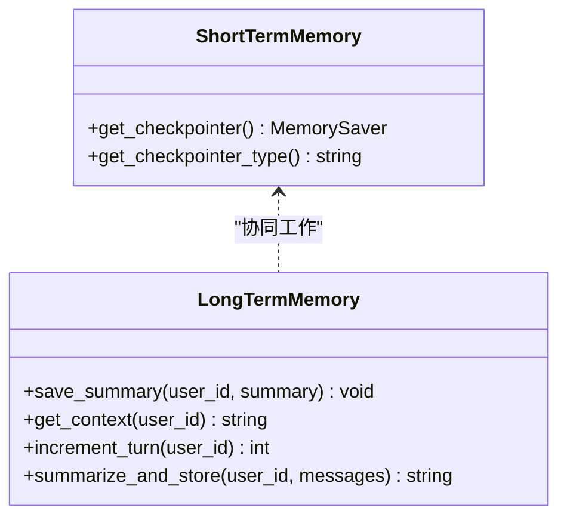
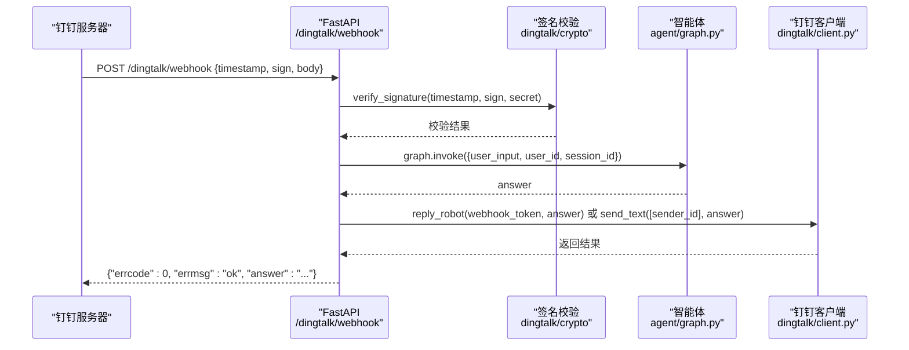
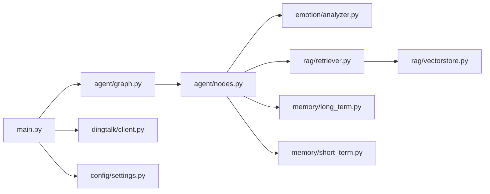

# 系统概览

<cite>
**本文引用的文件**   
- [main.py](file://main.py)
- [config/settings.py](file://config/settings.py)
- [agent/graph.py](file://agent/graph.py)
- [agent/nodes.py](file://agent/nodes.py)
- [agent/state.py](file://agent/state.py)
- [emotion/analyzer.py](file://emotion/analyzer.py)
- [rag/retriever.py](file://rag/retriever.py)
- [rag/vectorstore.py](file://rag/vectorstore.py)
- [memory/long_term.py](file://memory/long_term.py)
- [memory/short_term.py](file://memory/short_term.py)
- [dingtalk/client.py](file://dingtalk/client.py)
- [static/index.html](file://static/index.html)
- [data/docs/产品说明.txt](file://data/docs/产品说明.txt)
- [requirements.txt](file://requirements.txt)
</cite>

## 目录
1. [简介](#简介)
2. [项目结构](#项目结构)
3. [核心组件](#核心组件)
4. [架构总览](#架构总览)
5. [详细组件分析](#详细组件分析)
6. [依赖关系分析](#依赖关系分析)
7. [性能与可扩展性](#性能与可扩展性)
8. [故障排查指南](#故障排查指南)
9. [结论](#结论)
10. [附录](#附录)

## 简介
本系统面向企业级场景，基于 LangChain/LangGraph、FastAPI 与钉钉开放平台，构建“钉钉AI智能体助手”。系统提供三大使用入口：Web 聊天界面、钉钉机器人回调集成、本地 REPL 调试模式。通过情感分析、RAG 检索增强生成、短期/长期记忆管理以及评估体系，实现高可用、可观测、可评测的智能对话服务。

主要目标
- 以状态图编排多步骤推理与工作流（LangGraph），统一接入 LLM、向量库与外部平台。
- 在钉钉生态中提供稳定可靠的 Webhook 回调与消息回复能力。
- 提供可插拔的记忆与 RAG 能力，支持离线/在线混合部署。
- 建立完善的评估与追踪体系（OpenEvals + LangSmith）。

主要使用场景
- Web 聊天界面：浏览器直接访问 / 获取前端页面，调用 /api/chat 进行问答。
- 钉钉机器人集成：Outgoing Webhook 回调到 /dingtalk/webhook，完成签名校验与消息回复。
- REPL 调试模式：python main.py --repl 交互式测试智能体工作流。

**章节来源**
- [data/docs/产品说明.txt:1-39](file://data/docs/产品说明.txt#L1-L39)
- [main.py:1-236](file://main.py#L1-L236)

## 项目结构
系统采用模块化分层设计：
- agent：LangGraph 状态图与工作流节点编排
- rag：文档入库、Embedding、向量库检索
- memory：短期（进程内）与长期（SQLite）记忆
- emotion：情感分析与语气指引
- dingtalk：钉钉 API 客户端与签名校验
- config：全局配置（环境变量/.env）
- evaluation：智能体与 RAG 质量评估
- static：Web 前端页面
- data/docs：知识库文档源

**图表来源**
- [main.py:1-236](file://main.py#L1-L236)
- [agent/graph.py:1-106](file://agent/graph.py#L1-L106)
- [agent/nodes.py:1-164](file://agent/nodes.py#L1-L164)
- [agent/state.py:1-47](file://agent/state.py#L1-L47)
- [emotion/analyzer.py:1-118](file://emotion/analyzer.py#L1-L118)
- [rag/retriever.py:1-38](file://rag/retriever.py#L1-L38)
- [rag/vectorstore.py:1-75](file://rag/vectorstore.py#L1-L75)
- [memory/short_term.py:1-28](file://memory/short_term.py#L1-L28)
- [memory/long_term.py:1-244](file://memory/long_term.py#L1-L244)
- [dingtalk/client.py:1-140](file://dingtalk/client.py#L1-L140)
- [config/settings.py:1-93](file://config/settings.py#L1-L93)
- [requirements.txt:1-31](file://requirements.txt#L1-L31)

**章节来源**
- [main.py:1-236](file://main.py#L1-L236)
- [requirements.txt:1-31](file://requirements.txt#L1-L31)

## 核心组件
- FastAPI 主入口与路由
  - 根路径返回 Web 聊天页面；/api/chat 提供纯 Web 聊天接口；/dingtalk/webhook 处理钉钉回调；/health 健康检查。
- LangGraph 状态图与工作流
  - 构建 START -> emotion -> route -> load_memory -> {retrieve|generate} -> memory_update -> END 的有向图，按 thread_id 维护短期上下文。
- 节点函数
  - 情感分析、路由判断、RAG 检索、长期记忆加载、回答生成、记忆更新等节点各司其职。
- 记忆系统
  - 短期：进程内 MemorySaver，按 session_id 隔离会话。
  - 长期：SQLite 持久化用户摘要与偏好，周期性摘要存储。
- RAG 检索
  - ChromaDB 向量库 + HuggingFace Embedding，支持 top-k 与分数阈值过滤。
- 钉钉集成
  - 获取 access_token、发送工作通知、通过机器人 webhook 回复群消息，支持签名校验。
- 配置管理
  - pydantic-settings 从环境变量/.env 加载 LLM、Embedding、向量库、记忆、钉钉、LangSmith 等参数。

**章节来源**
- [main.py:1-236](file://main.py#L1-L236)
- [agent/graph.py:1-106](file://agent/graph.py#L1-L106)
- [agent/nodes.py:1-164](file://agent/nodes.py#L1-L164)
- [memory/short_term.py:1-28](file://memory/short_term.py#L1-L28)
- [memory/long_term.py:1-244](file://memory/long_term.py#L1-L244)
- [rag/retriever.py:1-38](file://rag/retriever.py#L1-L38)
- [rag/vectorstore.py:1-75](file://rag/vectorstore.py#L1-L75)
- [dingtalk/client.py:1-140](file://dingtalk/client.py#L1-L140)
- [config/settings.py:1-93](file://config/settings.py#L1-L93)

## 架构总览
系统整体由“接口层-编排层-能力层-外部集成”四层构成，数据流向清晰、职责边界明确。

**图表来源**
- [main.py:1-236](file://main.py#L1-L236)
- [agent/graph.py:1-106](file://agent/graph.py#L1-L106)
- [agent/nodes.py:1-164](file://agent/nodes.py#L1-L164)
- [emotion/analyzer.py:1-118](file://emotion/analyzer.py#L1-L118)
- [rag/retriever.py:1-38](file://rag/retriever.py#L1-L38)
- [rag/vectorstore.py:1-75](file://rag/vectorstore.py#L1-L75)
- [memory/short_term.py:1-28](file://memory/short_term.py#L1-L28)
- [memory/long_term.py:1-244](file://memory/long_term.py#L1-L244)
- [dingtalk/client.py:1-140](file://dingtalk/client.py#L1-L140)
- [config/settings.py:1-93](file://config/settings.py#L1-L93)

## 详细组件分析

### 接口层与请求流程
- Web 聊天
  - GET / 返回 index.html；POST /api/chat 接收 user_input/user_id/session_id，调用 graph.invoke 并返回 answer。
- 钉钉回调
  - POST /dingtalk/webhook 解析 timestamp/sign 并校验签名，提取 text/senderId/conversationId，调用 graph.invoke 后通过钉钉 client.reply_robot 或 send_text 回复。
- 健康检查
  - GET /health 返回服务状态与 checkpointer 类型。

**图表来源**
- [main.py:58-91](file://main.py#L58-L91)
- [main.py:106-176](file://main.py#L106-L176)
- [agent/graph.py:76-106](file://agent/graph.py#L76-L106)
- [agent/nodes.py:75-141](file://agent/nodes.py#L75-L141)
- [rag/retriever.py:34-38](file://rag/retriever.py#L34-L38)
- [rag/vectorstore.py:48-68](file://rag/vectorstore.py#L48-L68)
- [memory/long_term.py:150-163](file://memory/long_term.py#L150-L163)
- [dingtalk/client.py:104-127](file://dingtalk/client.py#L104-L127)

**章节来源**
- [main.py:1-236](file://main.py#L1-L236)
- [static/index.html:285-411](file://static/index.html#L285-L411)

### 智能体工作流（LangGraph StateGraph）
- 状态定义
  - AgentState 包含 messages、user_input、user_id、session_id、emotion、use_rag、rag_context、long_term_context、answer。
- 工作流
  - START -> emotion -> route -> load_memory -> (条件分支) retrieve|generate -> memory_update -> END
  - 条件分支依据 use_rag 决定走 RAG 或直接生成。
- 编译与单例
  - build_graph 注册节点与边，挂载 checkpointer（默认 MemorySaver），get_compiled_graph 返回单例。

**图表来源**
- [agent/state.py:20-44](file://agent/state.py#L20-L44)
- [agent/graph.py:25-69](file://agent/graph.py#L25-L69)
- [agent/nodes.py:31-72](file://agent/nodes.py#L31-L72)

**章节来源**
- [agent/graph.py:1-106](file://agent/graph.py#L1-L106)
- [agent/state.py:1-47](file://agent/state.py#L1-L47)
- [agent/nodes.py:1-164](file://agent/nodes.py#L1-L164)

### 情感分析模块
- 功能
  - 对用户输入进行情感分类（positive/negative/neutral），输出置信度与建议语气。
  - 优先使用 LLM 结构化输出，失败回退到关键词词典规则分析。
- 集成
  - emotion_node 将结果写入 state.emotion，generate_node 根据 tone_guidance 注入系统提示词。

**图表来源**
- [emotion/analyzer.py:13-26](file://emotion/analyzer.py#L13-L26)
- [emotion/analyzer.py:82-118](file://emotion/analyzer.py#L82-L118)

**章节来源**
- [emotion/analyzer.py:1-118](file://emotion/analyzer.py#L1-L118)
- [agent/nodes.py:31-42](file://agent/nodes.py#L31-L42)

### RAG 检索模块
- 检索器
  - retrieve_context 调用 vectorstore.search，返回格式化的上下文字符串（含来源、标题、相关度）。
- 向量库
  - Chroma 单例，持久化到 data/chroma；相似度搜索带分数阈值过滤。
- 嵌入模型
  - HuggingFace bge-small-zh-v1.5，本地缓存可离线运行。

**图表来源**
- [rag/retriever.py:34-38](file://rag/retriever.py#L34-L38)
- [rag/vectorstore.py:48-68](file://rag/vectorstore.py#L48-L68)

**章节来源**
- [rag/retriever.py:1-38](file://rag/retriever.py#L1-L38)
- [rag/vectorstore.py:1-75](file://rag/vectorstore.py#L1-L75)

### 记忆管理模块
- 短期记忆
  - 基于 LangGraph MemorySaver，按 thread_id（=session_id）维护会话历史。
- 长期记忆
  - SQLite 表：user_memory、user_prefs、summary_history；周期性摘要存储，限制最近 20 条。
  - get_context 拼装偏好与摘要供 generate_node 使用。

**图表来源**
- [memory/short_term.py:13-27](file://memory/short_term.py#L13-L27)
- [memory/long_term.py:75-100](file://memory/long_term.py#L75-L100)
- [memory/long_term.py:150-163](file://memory/long_term.py#L150-L163)
- [memory/long_term.py:203-244](file://memory/long_term.py#L203-L244)

**章节来源**
- [memory/short_term.py:1-28](file://memory/short_term.py#L1-L28)
- [memory/long_term.py:1-244](file://memory/long_term.py#L1-L244)

### 钉钉集成模块
- 客户端能力
  - 获取 access_token（本地缓存）、发送工作通知文本/Markdown、通过机器人 webhook 回复群消息。
- 安全校验
  - 回调端点支持 HMAC-SHA256 签名校验，未配置 secret 时跳过。

**图表来源**
- [main.py:106-176](file://main.py#L106-L176)
- [dingtalk/client.py:25-56](file://dingtalk/client.py#L25-L56)
- [dingtalk/client.py:104-127](file://dingtalk/client.py#L104-L127)

**章节来源**
- [dingtalk/client.py:1-140](file://dingtalk/client.py#L1-L140)
- [main.py:106-176](file://main.py#L106-L176)

### 配置与依赖
- 配置项
  - LLM（千问 OpenAI 兼容）、Embedding、Chroma 集合与持久化路径、RAG 阈值、记忆摘要周期、钉钉 AppKey/Secret/Token/Code、LangSmith 等。
- 依赖
  - langchain/langgraph/openai/chromadb/huggingface/fastapi/uvicorn/pydantic 等。

**章节来源**
- [config/settings.py:1-93](file://config/settings.py#L1-L93)
- [requirements.txt:1-31](file://requirements.txt#L1-L31)

## 依赖关系分析
- 模块耦合
  - main.py 作为入口，依赖 agent/graph、dingtalk/client、config/settings。
  - agent/nodes 依赖 emotion、rag、memory、config。
  - rag/retriever 依赖 rag/vectorstore。
  - memory/long_term 独立于外部服务，仅依赖 sqlite3。
- 外部依赖
  - LLM（ChatOpenAI）、向量库（Chroma）、Embedding（HuggingFace）、HTTP 客户端（httpx）。

**图表来源**
- [main.py:1-236](file://main.py#L1-L236)
- [agent/graph.py:1-106](file://agent/graph.py#L1-L106)
- [agent/nodes.py:1-164](file://agent/nodes.py#L1-L164)
- [rag/retriever.py:1-38](file://rag/retriever.py#L1-L38)
- [rag/vectorstore.py:1-75](file://rag/vectorstore.py#L1-L75)
- [memory/long_term.py:1-244](file://memory/long_term.py#L1-L244)
- [memory/short_term.py:1-28](file://memory/short_term.py#L1-L28)
- [dingtalk/client.py:1-140](file://dingtalk/client.py#L1-L140)
- [config/settings.py:1-93](file://config/settings.py#L1-L93)

**章节来源**
- [requirements.txt:1-31](file://requirements.txt#L1-L31)

## 性能与可扩展性
- 并发与阻塞
  - /api/chat 使用同步 def，FastAPI 自动放入线程池执行，避免阻塞事件循环。
- 向量检索
  - Chroma 本地持久化，支持 WAL 模式的 SQLite 长记忆读写分离，读多写少场景友好。
- 缓存策略
  - access_token 本地缓存；checkpointer 进程内内存；HF 模型可离线缓存。
- 扩展建议
  - 替换 checkpointer 为持久化后端（如 Redis/Postgres）提升水平扩展能力。
  - 引入异步 LLM 客户端与批处理检索以提升吞吐。
  - 对高频问题增加缓存层（Redis）降低 LLM 调用成本。

[本节为通用指导，不直接分析具体文件]

## 故障排查指南
- 常见问题
  - 钉钉回调签名失败：检查 dingtalk_robot_secret 与 timestamp/sign 是否正确。
  - 无法获取 access_token：确认 dingtalk_app_key/app_secret 已配置且网络可达。
  - RAG 检索为空：检查 data/chroma 是否已有数据，或调整 rag_score_filter。
  - 长期记忆无更新：确认 memory_summary_every 轮次触发逻辑与 SQLite 权限。
- 日志定位
  - 启用 INFO 级别日志，关注 [dingtalk-agent]、[emotion]、[retrieve]、[generate]、[memory] 等前缀。
- 健康检查
  - 访问 /health 查看 checkpointer 类型与服务状态。

**章节来源**
- [main.py:30-34](file://main.py#L30-L34)
- [main.py:94-103](file://main.py#L94-L103)
- [dingtalk/client.py:35-56](file://dingtalk/client.py#L35-L56)
- [rag/vectorstore.py:62-68](file://rag/vectorstore.py#L62-L68)
- [memory/long_term.py:75-100](file://memory/long_term.py#L75-L100)

## 结论
本系统以 LangGraph 为核心编排引擎，结合 FastAPI 与钉钉开放平台，构建了具备情感感知、RAG 增强、记忆管理与评估能力的企业级 AI 智能体。模块化设计使各子系统职责清晰、易于扩展与维护，适合在多场景下快速落地与持续优化。

[本节为总结性内容，不直接分析具体文件]

## 附录
- 启动方式
  - Web 服务：uvicorn main:app --host 0.0.0.0 --port 8000 --reload
  - REPL 调试：python main.py --repl
- 关键端点
  - GET / 返回 Web 聊天页面
  - POST /api/chat 纯 Web 聊天接口
  - POST /dingtalk/webhook 钉钉回调
  - GET /health 健康检查

**章节来源**
- [main.py:212-236](file://main.py#L212-L236)
- [main.py:49-55](file://main.py#L49-L55)
- [main.py:58-91](file://main.py#L58-L91)
- [main.py:106-176](file://main.py#L106-L176)
- [main.py:94-103](file://main.py#L94-L103)