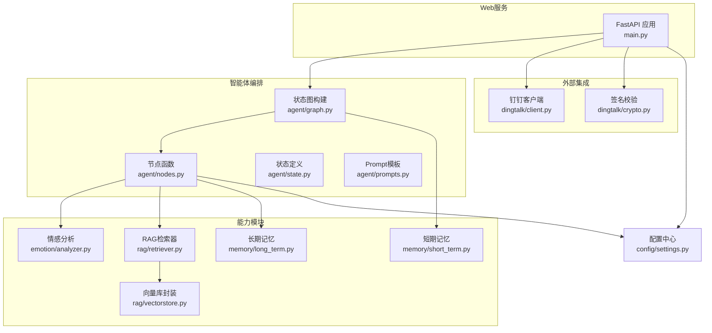
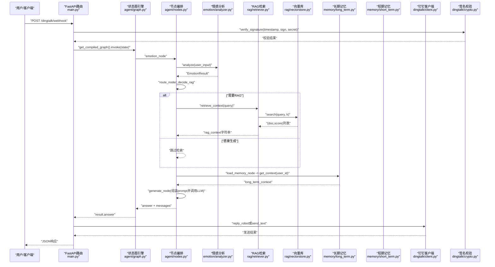
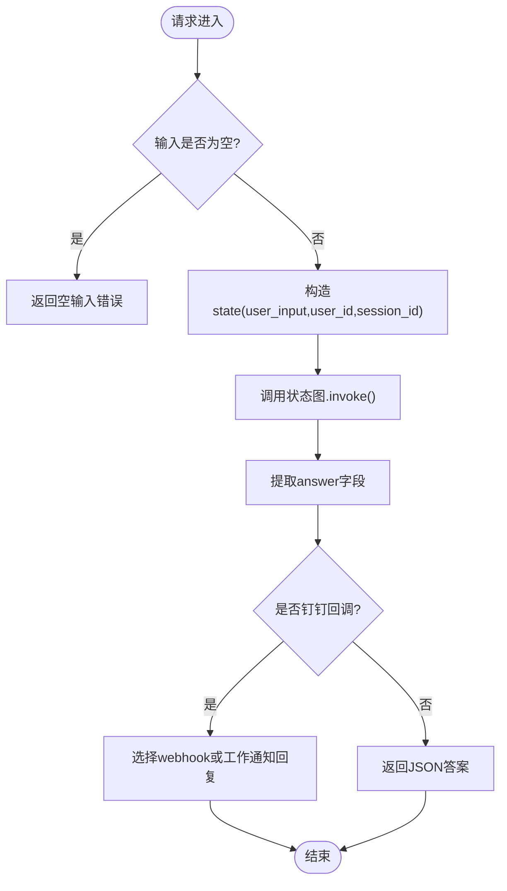
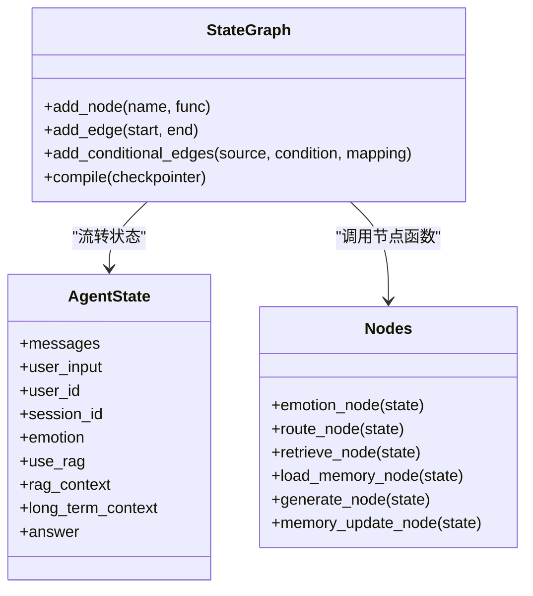
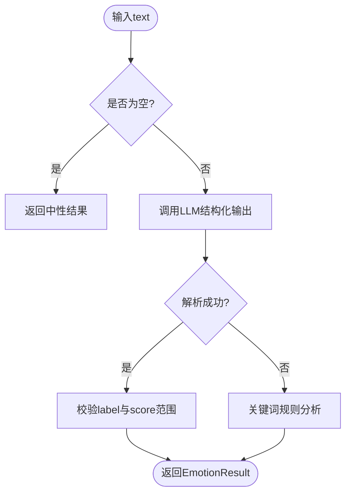
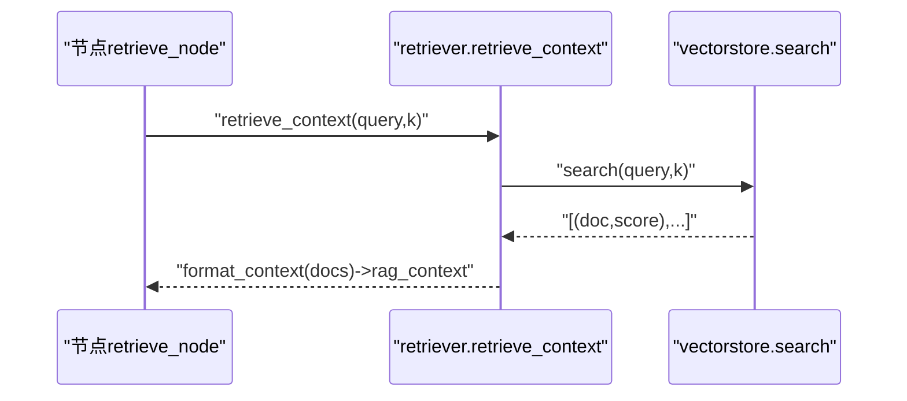
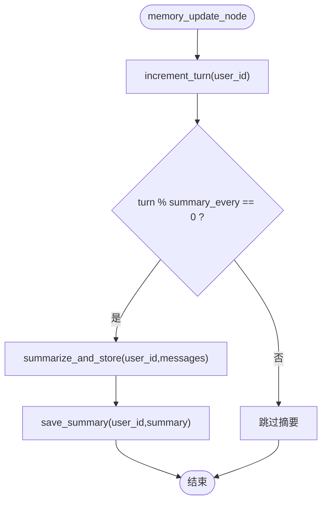
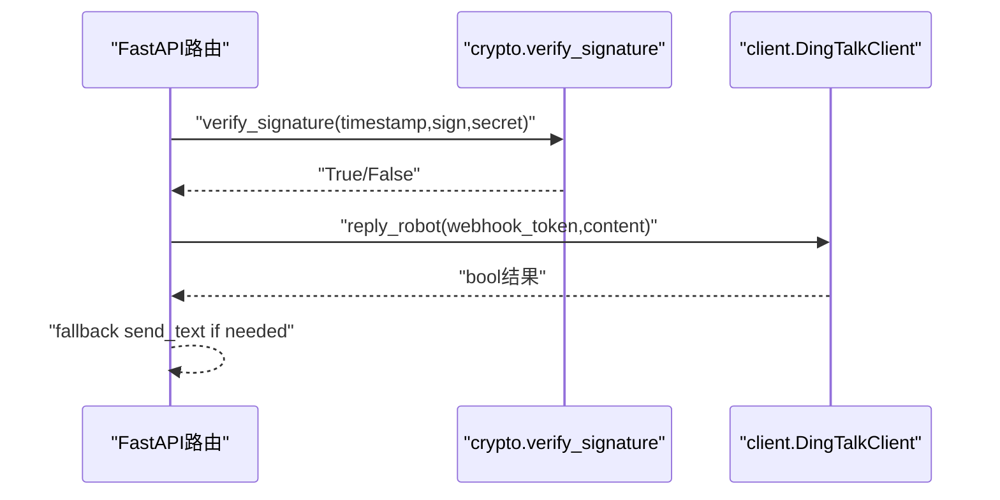
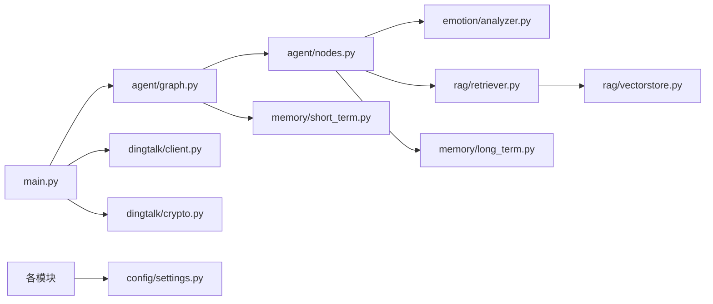

# 组件关系与交互

<cite>
**本文引用的文件**   
- [main.py](file://main.py)
- [agent/graph.py](file://agent/graph.py)
- [agent/nodes.py](file://agent/nodes.py)
- [agent/state.py](file://agent/state.py)
- [agent/prompts.py](file://agent/prompts.py)
- [emotion/analyzer.py](file://emotion/analyzer.py)
- [rag/retriever.py](file://rag/retriever.py)
- [rag/vectorstore.py](file://rag/vectorstore.py)
- [memory/long_term.py](file://memory/long_term.py)
- [memory/short_term.py](file://memory/short_term.py)
- [dingtalk/client.py](file://dingtalk/client.py)
- [dingtalk/crypto.py](file://dingtalk/crypto.py)
- [config/settings.py](file://config/settings.py)
</cite>

## 目录
1. [简介](#简介)
2. [项目结构](#项目结构)
3. [核心组件](#核心组件)
4. [架构总览](#架构总览)
5. [详细组件分析](#详细组件分析)
6. [依赖关系分析](#依赖关系分析)
7. [性能考量](#性能考量)
8. [故障排查指南](#故障排查指南)
9. [结论](#结论)
10. [附录：接口约定与数据格式](#附录接口约定与数据格式)

## 简介
本文件面向开发者，系统化梳理钉钉AI智能体助手的组件关系与运行时交互。重点覆盖以下方面：
- FastAPI主应用、Agent工作流引擎（LangGraph）、情感分析模块、RAG检索系统、记忆管理系统（长期/短期）、钉钉集成服务的协作方式
- 消息处理完整生命周期：从用户输入到最终回复的端到端流程
- 组件间的数据传递格式与接口约定
- 异步与同步调用场景说明（如FastAPI路由中的线程池处理）
- 提供组件交互序列图与依赖关系图，帮助理解系统运行时行为

## 项目结构
本项目采用按功能域划分的模块化组织方式：
- main.py：FastAPI入口，暴露Web聊天、钉钉回调与健康检查接口
- agent：LangGraph状态图与工作流节点编排
- emotion：情感分析与语气指引
- rag：语义检索与向量库封装
- memory：长期与短期记忆管理
- dingtalk：钉钉客户端与签名校验
- config：全局配置加载

图表来源
- [main.py:1-236](file://main.py#L1-L236)
- [agent/graph.py:1-106](file://agent/graph.py#L1-L106)
- [agent/nodes.py:1-164](file://agent/nodes.py#L1-L164)
- [agent/state.py:1-47](file://agent/state.py#L1-L47)
- [agent/prompts.py:1-63](file://agent/prompts.py#L1-L63)
- [emotion/analyzer.py:1-118](file://emotion/analyzer.py#L1-L118)
- [rag/retriever.py:1-38](file://rag/retriever.py#L1-L38)
- [rag/vectorstore.py:1-75](file://rag/vectorstore.py#L1-L75)
- [memory/long_term.py:1-244](file://memory/long_term.py#L1-L244)
- [memory/short_term.py:1-28](file://memory/short_term.py#L1-L28)
- [dingtalk/client.py:1-140](file://dingtalk/client.py#L1-L140)
- [dingtalk/crypto.py:1-63](file://dingtalk/crypto.py#L1-L63)
- [config/settings.py:1-93](file://config/settings.py#L1-L93)

章节来源
- [main.py:1-236](file://main.py#L1-L236)
- [config/settings.py:1-93](file://config/settings.py#L1-L93)

## 核心组件
- FastAPI主应用：提供Web聊天、钉钉回调与健康检查；对阻塞式图执行使用普通def以触发FastAPI线程池执行，避免事件循环阻塞
- Agent工作流引擎：基于LangGraph的状态图，串联情感分析、路由判断、记忆加载、RAG检索、生成回答、记忆更新等节点
- 情感分析模块：优先LLM结构化输出，失败回退关键词规则，输出情感标签、置信度与建议语气
- RAG检索系统：Chroma向量库+Embedding，支持相似度检索与分数过滤，返回格式化上下文
- 记忆管理系统：短期记忆通过LangGraph checkpointer（进程内MemorySaver），长期记忆通过SQLite持久化摘要与偏好
- 钉钉集成服务：获取access_token、发送工作通知文本/Markdown、机器人webhook群消息回复、签名校验

章节来源
- [main.py:58-176](file://main.py#L58-L176)
- [agent/graph.py:25-82](file://agent/graph.py#L25-L82)
- [agent/nodes.py:31-164](file://agent/nodes.py#L31-L164)
- [emotion/analyzer.py:82-118](file://emotion/analyzer.py#L82-L118)
- [rag/retriever.py:13-38](file://rag/retriever.py#L13-L38)
- [rag/vectorstore.py:48-75](file://rag/vectorstore.py#L48-L75)
- [memory/long_term.py:150-244](file://memory/long_term.py#L150-L244)
- [memory/short_term.py:13-28](file://memory/short_term.py#L13-L28)
- [dingtalk/client.py:16-140](file://dingtalk/client.py#L16-L140)
- [dingtalk/crypto.py:33-63](file://dingtalk/crypto.py#L33-L63)

## 架构总览
下图展示从请求进入FastAPI到最终回复的端到端流程，以及各子系统间的调用关系。

图表来源
- [main.py:106-176](file://main.py#L106-L176)
- [agent/graph.py:25-82](file://agent/graph.py#L25-L82)
- [agent/nodes.py:31-164](file://agent/nodes.py#L31-L164)
- [emotion/analyzer.py:82-118](file://emotion/analyzer.py#L82-L118)
- [rag/retriever.py:34-38](file://rag/retriever.py#L34-L38)
- [rag/vectorstore.py:48-75](file://rag/vectorstore.py#L48-L75)
- [memory/long_term.py:150-163](file://memory/long_term.py#L150-L163)
- [memory/short_term.py:13-28](file://memory/short_term.py#L13-L28)
- [dingtalk/client.py:104-140](file://dingtalk/client.py#L104-L140)
- [dingtalk/crypto.py:33-63](file://dingtalk/crypto.py#L33-L63)

## 详细组件分析

### FastAPI主应用与路由
- Web聊天接口：接收用户输入，构造state并调用状态图，返回JSON答案；使用普通def以便FastAPI自动放入线程池执行
- 钉钉回调：解析query参数与body，进行签名校验后提取消息内容，调用状态图生成答案，并通过钉钉客户端回复（优先机器人webhook，否则工作通知）
- 健康检查：返回服务状态与短期记忆后端类型

图表来源
- [main.py:58-91](file://main.py#L58-L91)
- [main.py:106-176](file://main.py#L106-L176)

章节来源
- [main.py:58-176](file://main.py#L58-L176)

### Agent工作流引擎（LangGraph）
- 状态图节点顺序：START -> emotion -> route -> load_memory -> {retrieve | generate} -> memory_update -> END
- 条件边：根据use_rag决定走retrieve还是generate
- Checkpointer：默认进程内MemorySaver，按thread_id维护会话上下文

图表来源
- [agent/graph.py:25-82](file://agent/graph.py#L25-L82)
- [agent/state.py:20-44](file://agent/state.py#L20-L44)
- [agent/nodes.py:31-164](file://agent/nodes.py#L31-L164)

章节来源
- [agent/graph.py:25-82](file://agent/graph.py#L25-L82)
- [agent/state.py:20-44](file://agent/state.py#L20-L44)

### 情感分析模块
- analyze(text)：优先LLM结构化输出JSON，失败回退关键词规则；返回label、score、tone
- get_tone_guidance(emotion)：将情感结果转换为语气指引文案，注入系统prompt

图表来源
- [emotion/analyzer.py:82-118](file://emotion/analyzer.py#L82-L118)

章节来源
- [emotion/analyzer.py:82-118](file://emotion/analyzer.py#L82-L118)

### RAG检索系统
- retrieve_context(query, k)：检索top-k文档，格式化上下文字符串（含来源、标题、相关度）
- vectorstore.search(query, k)：相似度检索+分数过滤，阈值由配置控制

图表来源
- [rag/retriever.py:34-38](file://rag/retriever.py#L34-L38)
- [rag/vectorstore.py:48-75](file://rag/vectorstore.py#L48-L75)

章节来源
- [rag/retriever.py:13-38](file://rag/retriever.py#L13-L38)
- [rag/vectorstore.py:48-75](file://rag/vectorstore.py#L48-L75)

### 记忆管理系统
- 短期记忆：MemorySaver按thread_id保存会话历史，保证多轮对话连贯性
- 长期记忆：SQLite持久化用户摘要与偏好；周期性摘要生成与存储；get_context拼装提示上下文

图表来源
- [memory/long_term.py:165-244](file://memory/long_term.py#L165-L244)
- [memory/short_term.py:13-28](file://memory/short_term.py#L13-L28)

章节来源
- [memory/long_term.py:150-244](file://memory/long_term.py#L150-L244)
- [memory/short_term.py:13-28](file://memory/short_term.py#L13-L28)

### 钉钉集成服务
- 签名校验：HMAC-SHA256计算与compare_digest防时序攻击
- 客户端：获取access_token（本地缓存）、发送工作通知文本/Markdown、机器人webhook回复

图表来源
- [dingtalk/crypto.py:33-63](file://dingtalk/crypto.py#L33-L63)
- [dingtalk/client.py:104-140](file://dingtalk/client.py#L104-L140)

章节来源
- [dingtalk/crypto.py:33-63](file://dingtalk/crypto.py#L33-L63)
- [dingtalk/client.py:16-140](file://dingtalk/client.py#L16-L140)

### Prompt与路由策略
- build_system_prompt：拼接语气指引、长期记忆上下文、RAG上下文，形成系统提示
- _decide_rag：LLM路由+关键词兜底，短输入且无疑问词倾向闲聊

章节来源
- [agent/prompts.py:18-43](file://agent/prompts.py#L18-L43)
- [agent/nodes.py:46-68](file://agent/nodes.py#L46-L68)

## 依赖关系分析
- 耦合与内聚：
  - main.py仅负责HTTP路由与外部集成，业务逻辑集中在agent/graph.py与agent/nodes.py
  - emotion、rag、memory为独立能力模块，被nodes按需调用
  - config/settings.py为全局配置单例，贯穿所有模块
- 外部依赖：
  - LangChain/LangGraph用于状态图与消息处理
  - Chroma用于向量检索
  - SQLite用于长期记忆持久化
  - httpx用于钉钉API调用
- 潜在循环依赖：
  - 通过延迟导入（如_get_llm在节点内部导入）避免循环依赖

图表来源
- [main.py:1-236](file://main.py#L1-L236)
- [agent/graph.py:1-106](file://agent/graph.py#L1-L106)
- [agent/nodes.py:1-164](file://agent/nodes.py#L1-L164)
- [emotion/analyzer.py:1-118](file://emotion/analyzer.py#L1-L118)
- [rag/retriever.py:1-38](file://rag/retriever.py#L1-L38)
- [rag/vectorstore.py:1-75](file://rag/vectorstore.py#L1-L75)
- [memory/long_term.py:1-244](file://memory/long_term.py#L1-L244)
- [memory/short_term.py:1-28](file://memory/short_term.py#L1-L28)
- [dingtalk/client.py:1-140](file://dingtalk/client.py#L1-L140)
- [dingtalk/crypto.py:1-63](file://dingtalk/crypto.py#L1-L63)
- [config/settings.py:1-93](file://config/settings.py#L1-L93)

章节来源
- [config/settings.py:1-93](file://config/settings.py#L1-L93)

## 性能考量
- 并发与阻塞：
  - FastAPI路由中使用普通def调用阻塞式graph.invoke()，由FastAPI线程池执行，避免阻塞事件循环
- 向量检索：
  - Chroma相似度检索+分数过滤，减少低相关度噪声；k值与阈值可通过配置调整
- 记忆写入：
  - SQLite WAL模式提升读并发；写操作加锁串行化，避免竞争
- Token缓存：
  - 钉钉access_token本地缓存，减少频繁网络请求
- 日志与监控：
  - 关键路径记录异常与警告，便于定位问题

[本节为通用指导，不直接分析具体文件]

## 故障排查指南
- 签名校验失败：
  - 检查timestamp与sign是否正确，确认secret配置有效
- 钉钉消息发送失败：
  - 检查access_token获取是否成功，确认app_key/app_secret配置
- RAG检索为空：
  - 检查向量库是否已入库文档，确认embedding模型可用
- 长期记忆未更新：
  - 检查memory_summary_every设置与turn计数逻辑
- LLM调用失败：
  - 检查llm_model、api_key、base_url配置；查看降级逻辑是否生效

章节来源
- [dingtalk/crypto.py:33-63](file://dingtalk/crypto.py#L33-L63)
- [dingtalk/client.py:25-56](file://dingtalk/client.py#L25-L56)
- [rag/vectorstore.py:48-75](file://rag/vectorstore.py#L48-L75)
- [memory/long_term.py:165-244](file://memory/long_term.py#L165-L244)
- [emotion/analyzer.py:82-118](file://emotion/analyzer.py#L82-L118)

## 结论
本系统通过FastAPI统一接入、LangGraph编排智能体工作流、情感分析增强回复语气、RAG提供知识依据、记忆系统实现个性化与连续性、钉钉集成完成消息收发，形成完整的AI助手闭环。各模块职责清晰、依赖明确，具备良好的可扩展性与可维护性。

[本节为总结，不直接分析具体文件]

## 附录：接口约定与数据格式
- Web聊天接口
  - 路径：POST /api/chat
  - 请求体：ChatRequest(user_input, user_id, session_id)
  - 响应：{errcode, errmsg, answer}
- 钉钉回调接口
  - 路径：POST /dingtalk/webhook
  - 查询参数：timestamp, sign
  - 请求体：包含senderId/senderStaffId、conversationId、sessionWebhook、text.content等
  - 响应：{errcode, errmsg, answer}
- 健康检查
  - 路径：GET /health
  - 响应：{status, service, checkpointer}
- 状态图状态（AgentState关键字段）
  - messages、user_input、user_id、session_id、emotion、use_rag、rag_context、long_term_context、answer
- 情感分析结果（EmotionResult）
  - label（positive/negative/neutral）、score（0~1）、tone（语气指引）

章节来源
- [main.py:42-91](file://main.py#L42-L91)
- [main.py:106-176](file://main.py#L106-L176)
- [agent/state.py:20-44](file://agent/state.py#L20-L44)
- [emotion/analyzer.py:13-26](file://emotion/analyzer.py#L13-L26)