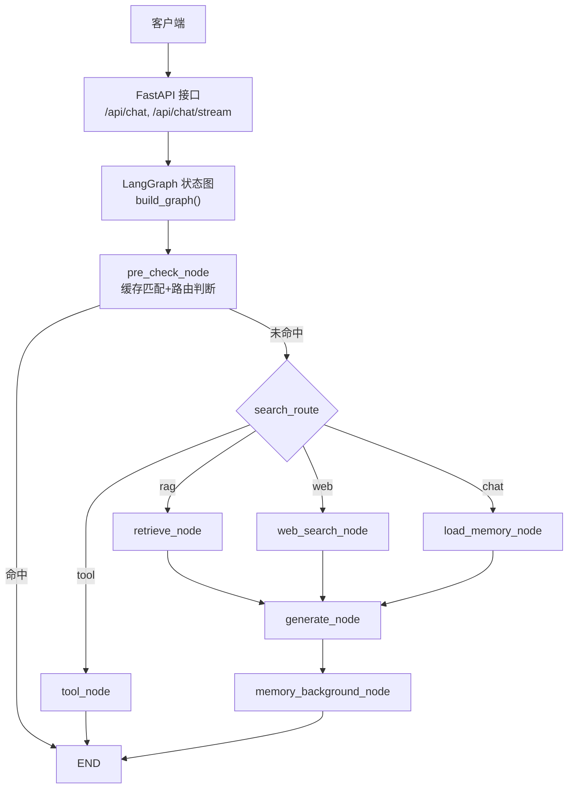
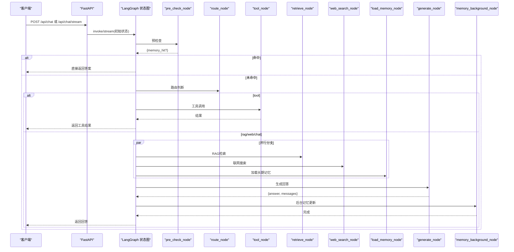
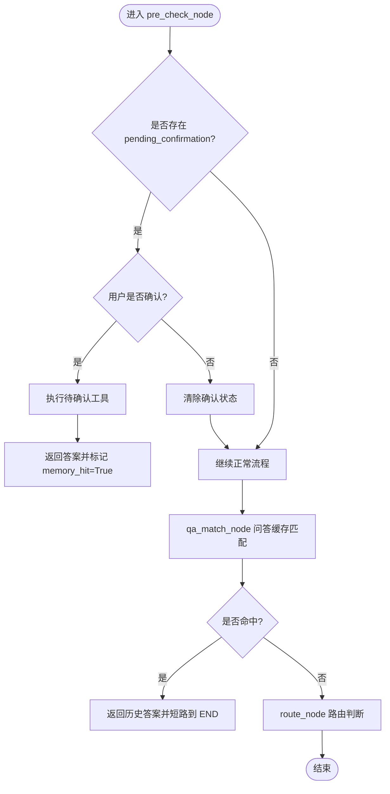
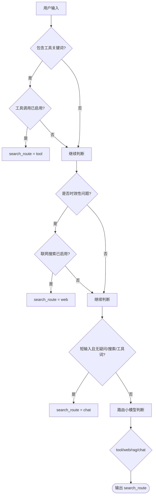
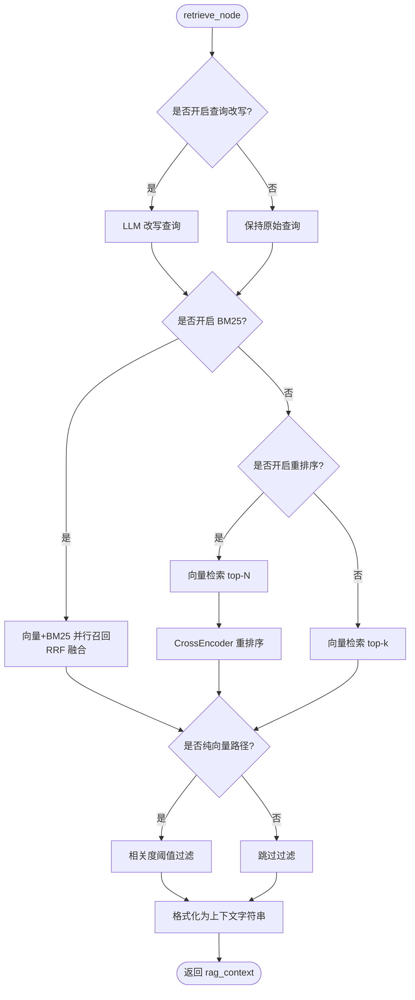
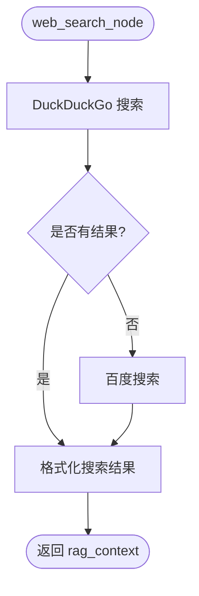
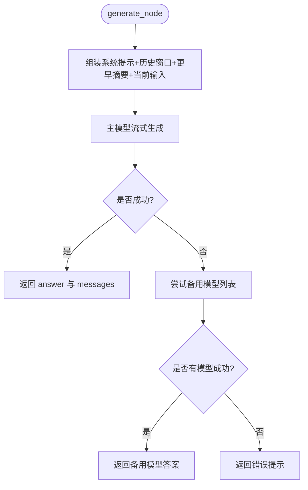
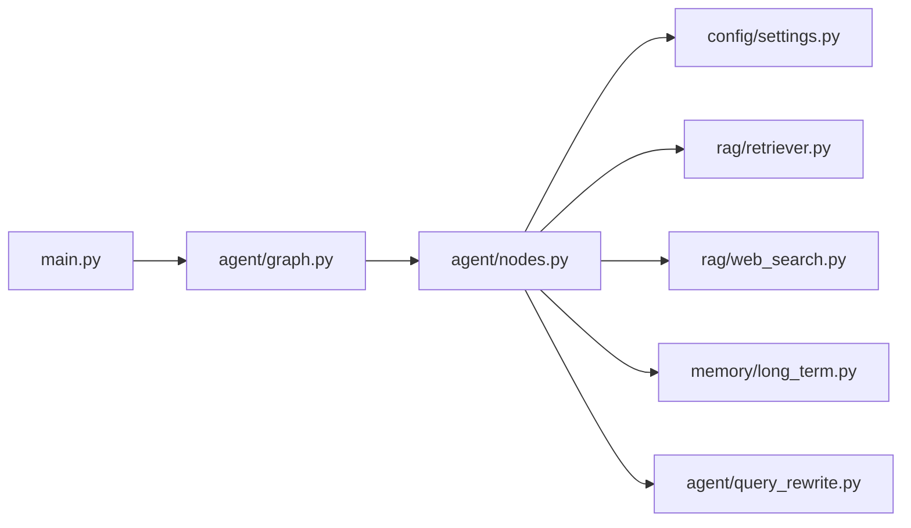

# Agent工作流系统

<cite>
**本文引用的文件**
- [agent/graph.py](file://agent/graph.py)
- [agent/nodes.py](file://agent/nodes.py)
- [agent/state.py](file://agent/state.py)
- [main.py](file://main.py)
- [config/settings.py](file://config/settings.py)
- [memory/long_term.py](file://memory/long_term.py)
- [rag/retriever.py](file://rag/retriever.py)
- [rag/web_search.py](file://rag/web_search.py)
- [agent/query_rewrite.py](file://agent/query_rewrite.py)
</cite>

## 目录
1. [简介](#简介)
2. [项目结构](#项目结构)
3. [核心组件](#核心组件)
4. [架构总览](#架构总览)
5. [详细组件分析](#详细组件分析)
6. [依赖关系分析](#依赖关系分析)
7. [性能考虑](#性能考虑)
8. [故障排查指南](#故障排查指南)
9. [结论](#结论)
10. [附录：配置参数说明](#附录：配置参数说明)

## 简介
本技术文档围绕基于 LangGraph 的 Agent 工作流，系统性解析状态图设计、四路分流机制与节点处理逻辑。重点覆盖预检查节点、路由判断、RAG检索、联网搜索、长期记忆加载、回答生成等核心节点的实现细节；并给出状态流转图、节点间调用关系、错误处理机制与性能优化策略，辅以具体代码路径与配置参数说明，帮助开发者理解智能体工作流的完整执行流程。

## 项目结构
Agent 工作流由“入口服务 + 状态图编排 + 节点实现 + 外部能力（RAG/搜索/记忆）”构成：
- 入口服务：FastAPI 提供同步/流式聊天接口，负责安全校验、限流熔断、SSE 事件封装。
- 状态图编排：LangGraph StateGraph 定义节点与边，支持条件分支与后台异步更新。
- 节点实现：预检查、路由、RAG检索、联网搜索、长期记忆加载、回答生成、工具调用、后台记忆更新。
- 外部能力：向量检索与重排、BM25 多路召回、联网搜索双引擎、SQLite 长期记忆、短期会话上下文。

图表来源
- [agent/graph.py:44-102](file://agent/graph.py#L44-L102)
- [agent/nodes.py:93-151](file://agent/nodes.py#L93-L151)
- [main.py:154-314](file://main.py#L154-L314)

章节来源
- [agent/graph.py:44-102](file://agent/graph.py#L44-L102)
- [main.py:154-314](file://main.py#L154-L314)

## 核心组件
- 状态定义：AgentState 描述消息历史、用户输入、路由结果、检索上下文、长期记忆、会话摘要、问答命中标志、工具调用上下文等。
- 状态图构建：注册节点、添加线性边与条件边，挂载 checkpointer 以维护短期上下文。
- 节点集合：
  - pre_check_node：合并问答缓存匹配与路由判断，优先处理待确认的工具操作。
  - route_node/_decide_route：LLM + 关键词兜底决定 tool/rag/web/chat。
  - retrieve_node：查询改写 → 多路召回+重排序 → 相关度过滤 → 格式化上下文。
  - web_search_node：DuckDuckGo/百度双引擎搜索并格式化。
  - load_memory_node：加载长期记忆上下文与会话压缩摘要。
  - generate_node：组装 prompt（含系统提示、历史窗口、更早对话摘要），流式生成回答，主模型失败自动降级。
  - memory_background_node：后台抽取关键信息并更新长期记忆（不阻塞响应）。
  - tool_node：工具提取→确认→执行→返回结果。

章节来源
- [agent/state.py:12-51](file://agent/state.py#L12-L51)
- [agent/graph.py:44-102](file://agent/graph.py#L44-L102)
- [agent/nodes.py:93-151](file://agent/nodes.py#L93-L151)
- [agent/nodes.py:284-341](file://agent/nodes.py#L284-L341)
- [agent/nodes.py:344-360](file://agent/nodes.py#L344-L360)
- [agent/nodes.py:499-532](file://agent/nodes.py#L499-L532)
- [agent/nodes.py:630-643](file://agent/nodes.py#L630-L643)
- [agent/nodes.py:647-690](file://agent/nodes.py#L647-L690)

## 架构总览
整体执行流程如下：
- 请求进入 FastAPI，进行安全校验、限流与熔断检查。
- 调用 LangGraph 状态图，首先进入 pre_check_node：
  - 若存在 pending_confirmation，优先处理用户确认或取消。
  - 执行 qa_match_node：相似问题命中则直接复用答案并短路到 END。
  - 执行 route_node：根据 LLM 与关键词策略确定 search_route。
- 按 search_route 分流至 tool/retrieve/web_search/load_memory：
  - tool：直接执行工具并返回结果。
  - retrieve/web_search/load_memory：最终汇入 generate_node 生成回答。
- generate 完成后，后台执行 memory_background_node 进行记忆抽取与更新。

图表来源
- [agent/graph.py:44-102](file://agent/graph.py#L44-L102)
- [agent/nodes.py:93-151](file://agent/nodes.py#L93-L151)
- [agent/nodes.py:284-341](file://agent/nodes.py#L284-L341)
- [agent/nodes.py:499-532](file://agent/nodes.py#L499-L532)
- [agent/nodes.py:630-643](file://agent/nodes.py#L630-L643)
- [main.py:154-314](file://main.py#L154-L314)

## 详细组件分析

### 预检查节点（缓存匹配 + 路由判断）
- 功能要点：
  - 优先处理 pending_confirmation：若用户回复确认词，则执行待确认工具并标记 memory_hit=True 短路到 END。
  - 问答缓存匹配：对问题进行向量化并在长期记忆中检索相似问题，命中则直接复用答案并写入短期消息历史。
  - 路由判断：结合关键词与 LLM 输出决定 search_route（tool/rag/web/chat）。
- 错误处理：
  - 向量化失败、检索失败均静默降级为未命中，不阻断主链路。
- 性能优化：
  - 命中即短路，跳过后续大模型调用与检索链路，显著降低延迟。

图表来源
- [agent/nodes.py:93-151](file://agent/nodes.py#L93-L151)
- [agent/nodes.py:232-281](file://agent/nodes.py#L232-L281)

章节来源
- [agent/nodes.py:93-151](file://agent/nodes.py#L93-L151)
- [agent/nodes.py:232-281](file://agent/nodes.py#L232-L281)

### 路由判断（四路分流）
- 决策策略：
  - 工具调用关键词优先短路（需开启工具调用开关）。
  - 时效性问题（明确时间/天气）优先走联网搜索（需开启联网搜索开关）。
  - 短输入且不含疑问/搜索/工具词倾向于闲聊。
  - 使用路由小模型（temperature=0.0）进行意图识别，失败时回退关键词兜底。
- 分流目标：
  - tool：工具调用（待办/会议操作）。
  - rag：知识库检索。
  - web：联网搜索。
  - chat：加载长期记忆后生成。

图表来源
- [agent/nodes.py:154-211](file://agent/nodes.py#L154-L211)
- [config/settings.py:109-155](file://config/settings.py#L109-L155)

章节来源
- [agent/nodes.py:154-211](file://agent/nodes.py#L154-L211)
- [config/settings.py:109-155](file://config/settings.py#L109-L155)

### RAG检索节点
- 流程：
  - 查询改写（可选）：用路由小模型将口语化表达转为检索友好形式，失败回退原始查询。
  - 多路召回+重排序：
    - BM25 开启：向量检索与 BM25 并行召回，RRF 融合排序。
    - 仅向量检索：候选集经 CrossEncoder 重排序取 top-k。
    - 关闭重排序：直接向量检索 top-k。
  - 相关度阈值过滤：仅在纯向量检索路径下生效（避免分数语义不一致导致过滤失效）。
  - 格式化上下文：统一归一化展示相关度，便于生成节点注入。
- 错误处理：检索失败时返回空上下文，不阻断主链路。

图表来源
- [agent/query_rewrite.py:26-58](file://agent/query_rewrite.py#L26-L58)
- [rag/retriever.py:18-52](file://rag/retriever.py#L18-L52)
- [rag/retriever.py:55-110](file://rag/retriever.py#L55-L110)
- [rag/retriever.py:113-133](file://rag/retriever.py#L113-L133)
- [agent/nodes.py:284-321](file://agent/nodes.py#L284-L321)

章节来源
- [agent/query_rewrite.py:26-58](file://agent/query_rewrite.py#L26-L58)
- [rag/retriever.py:18-133](file://rag/retriever.py#L18-L133)
- [agent/nodes.py:284-321](file://agent/nodes.py#L284-L321)

### 联网搜索节点
- 双引擎策略：
  - 首选 DuckDuckGo，失败或无结果时回退百度搜索。
  - 搜索结果统一格式化为带来源与标题的文本块，供生成节点使用。
- 错误处理：任一引擎失败均记录日志并尝试另一引擎，最终可能返回空上下文。

图表来源
- [rag/web_search.py:19-94](file://rag/web_search.py#L19-L94)
- [rag/web_search.py:97-133](file://rag/web_search.py#L97-L133)
- [agent/nodes.py:324-341](file://agent/nodes.py#L324-L341)

章节来源
- [rag/web_search.py:19-133](file://rag/web_search.py#L19-L133)
- [agent/nodes.py:324-341](file://agent/nodes.py#L324-L341)

### 长期记忆加载节点
- 功能：
  - 从 SQLite 分层加载长期记忆上下文（用户画像、关键事实、历史摘要）。
  - 加载当前会话的压缩摘要（短期记忆超窗后的更早对话摘要）。
- 错误处理：加载失败时返回空字符串，不影响主链路。

章节来源
- [agent/nodes.py:344-360](file://agent/nodes.py#L344-L360)
- [memory/long_term.py:424-497](file://memory/long_term.py#L424-L497)

### 回答生成节点
- Prompt 组装：
  - 系统提示：注入长期记忆上下文与 RAG 上下文。
  - 历史消息：窗口限制与字符预算控制，超出部分以更早对话摘要形式保留主线上下文。
  - 当前输入：追加 HumanMessage。
- 流式生成与降级：
  - 主模型流式生成，失败时按优先级依次尝试备用模型列表。
  - 全部失败返回友好错误提示。
- 错误处理：异常捕获并降级，保证可用性。

图表来源
- [agent/nodes.py:499-532](file://agent/nodes.py#L499-L532)
- [agent/nodes.py:454-496](file://agent/nodes.py#L454-L496)

章节来源
- [agent/nodes.py:454-532](file://agent/nodes.py#L454-L532)

### 工具调用节点
- 流程：
  - 用路由小模型从用户输入提取工具名与参数。
  - 查询类操作直接执行；写操作需用户确认（可配置）。
  - 确认后执行工具并格式化结果返回。
- 错误处理：工具提取失败或执行失败均返回友好提示，不抛异常。

章节来源
- [agent/nodes.py:647-690](file://agent/nodes.py#L647-L690)
- [agent/tools/tool_schemas.py:1-26](file://agent/tools/tool_schemas.py#L1-L26)

### 后台记忆更新节点
- 功能：
  - 关键信息抽取：规则快速路径 + 可选 LLM 结构化抽取。
  - 长期记忆更新：增量摘要合并、会话摘要刷新、问答记忆保存。
- 错误处理：各步骤独立 try/except，任一失败不影响其他步骤。

章节来源
- [agent/nodes.py:363-412](file://agent/nodes.py#L363-L412)
- [agent/nodes.py:535-564](file://agent/nodes.py#L535-L564)
- [agent/nodes.py:630-643](file://agent/nodes.py#L630-L643)
- [memory/long_term.py:613-633](file://memory/long_term.py#L613-L633)

## 依赖关系分析
- 模块耦合：
  - graph.py 依赖 nodes.py 中的节点函数与 state.py 的状态定义。
  - nodes.py 依赖 config/settings.py 获取全局配置，依赖 rag/* 与 memory/* 提供外部能力。
  - main.py 作为入口，依赖 agent/graph.py 与 agent/nodes.py 提供的流式/同步接口。
- 外部集成点：
  - LLM：通过 ChatOpenAI 兼容接口访问千问等大模型。
  - 向量库：Milvus Lite 本地持久化，支持 BM25 多路召回与 CrossEncoder 重排序。
  - 联网搜索：DuckDuckGo 与百度双引擎。
  - 长期记忆：SQLite 分层存储，支持问答缓存与会话摘要。

图表来源
- [main.py:154-314](file://main.py#L154-L314)
- [agent/graph.py:44-102](file://agent/graph.py#L44-L102)
- [agent/nodes.py:93-151](file://agent/nodes.py#L93-L151)

章节来源
- [main.py:154-314](file://main.py#L154-L314)
- [agent/graph.py:44-102](file://agent/graph.py#L44-L102)
- [agent/nodes.py:93-151](file://agent/nodes.py#L93-L151)

## 性能考虑
- 首请求预热：
  - 启动时预热路由小模型与主模型连接（TLS握手、DNS解析、连接池建立），显著降低首条请求延迟。
- 向量库预热：
  - 启动时检查向量库并自动入库，必要时全量重建；预热 BM25 索引；启动文件监听实现运行时知识库同步。
- 流式超时保护：
  - SSE 流式接口设置整体超时，超时后返回已生成 token，防止连接卡死。
- 检索优化：
  - 查询改写在开启时提升召回率；BM25 多路召回与 RRF 融合提升精确匹配；重排序精排提高相关性。
- 记忆更新非阻塞：
  - 后台记忆更新在 generate 之后执行，不阻塞响应链路。

章节来源
- [main.py:45-135](file://main.py#L45-L135)
- [main.py:228-314](file://main.py#L228-L314)
- [rag/retriever.py:18-52](file://rag/retriever.py#L18-L52)
- [agent/nodes.py:630-643](file://agent/nodes.py#L630-L643)

## 故障排查指南
- 路由失败：
  - 现象：LLM 路由异常，回退关键词兜底。
  - 排查：检查网络与模型可用性；确认关键词配置是否正确。
- 检索失败：
  - 现象：RAG 或联网搜索失败，返回空上下文。
  - 排查：检查向量库状态、BM25 索引、搜索引擎连通性；查看日志中检索失败原因。
- 生成失败：
  - 现象：主模型生成失败，尝试备用模型仍失败。
  - 排查：检查模型配置、API Key、超时设置；查看降级模型列表是否有效。
- 记忆更新失败：
  - 现象：长期记忆或会话摘要更新失败。
  - 排查：检查 SQLite 数据库权限与 WAL 模式；查看抽取与摘要逻辑异常。
- 工具调用失败：
  - 现象：工具参数提取失败或执行失败。
  - 排查：检查工具 Schema 配置、钉钉 API 连通性与权限；查看错误提示信息。

章节来源
- [agent/nodes.py:180-211](file://agent/nodes.py#L180-L211)
- [agent/nodes.py:284-341](file://agent/nodes.py#L284-L341)
- [agent/nodes.py:499-532](file://agent/nodes.py#L499-L532)
- [agent/nodes.py:630-643](file://agent/nodes.py#L630-L643)
- [agent/nodes.py:693-746](file://agent/nodes.py#L693-L746)

## 结论
该 Agent 工作流以 LangGraph 状态图为中枢，通过预检查、四路分流与后台记忆更新，实现了高效、可扩展的智能体响应链路。其设计兼顾了性能与鲁棒性：问答缓存命中短路、多路检索与重排序提升准确性、双引擎联网搜索保障时效性、分层长期记忆增强个性化。通过合理的错误处理与性能优化策略，系统能够在复杂场景下稳定运行并提供流畅的用户体验。

## 附录：配置参数说明
- LLM 配置：
  - llm_model、llm_base_url、llm_api_key：主模型地址与密钥。
  - llm_router_model：路由小模型，用于轻量任务降低成本与延迟。
  - llm_max_retries、llm_request_timeout：重试次数与超时设置。
  - llm_fallback_model、llm_fallback_models：主模型失败时的降级模型。
  - stream_timeout：流式接口整体超时。
- Embedding 与向量库：
  - embedding_model、embedding_device：嵌入模型与设备。
  - milvus_db_file、milvus_collection、milvus_index_type、milvus_metric_type：向量库配置。
  - rag_top_k、rag_min_relevance、rag_chunk_size、rag_chunk_overlap：检索与切片参数。
  - rag_bm25_enabled、rag_bm25_candidate_count、rag_rrf_k：BM25 多路召回与融合参数。
  - rerank_enabled、rerank_model、rerank_top_k：重排序配置。
- 联网搜索：
  - web_search_enabled、web_search_max_results、web_search_timeout：联网搜索开关与参数。
- 记忆：
  - long_term_db_path、memory_summary_every、memory_context_budget：长期记忆与摘要频率。
  - memory_short_window、memory_history_budget：短期记忆窗口与预算。
  - rag_context_budget：RAG/联网搜索上下文字符预算。
  - memory_extract_llm_enabled：是否启用 LLM 结构化抽取。
  - memory_qa_cache_enabled、memory_qa_threshold、memory_qa_max_records：问答缓存开关、阈值与上限。
- 输入安全与限流熔断：
  - input_filter_enabled、input_blocked_keywords、input_injection_check_enabled：输入安全过滤。
  - rate_limit_per_minute、circuit_breaker_threshold、circuit_breaker_recovery：限流与熔断参数。
- 工具调用：
  - tool_calling_enabled、tool_confirmation_required：工具调用开关与写操作确认。

章节来源
- [config/settings.py:19-155](file://config/settings.py#L19-L155)