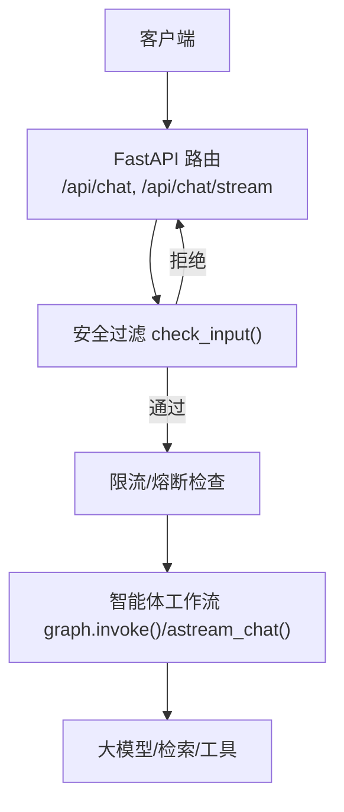
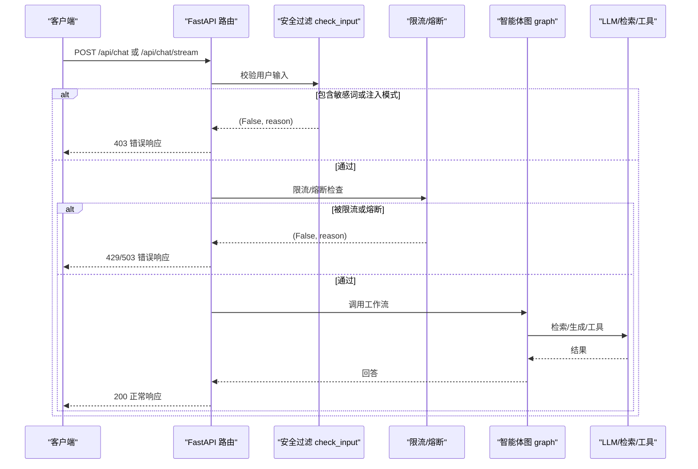
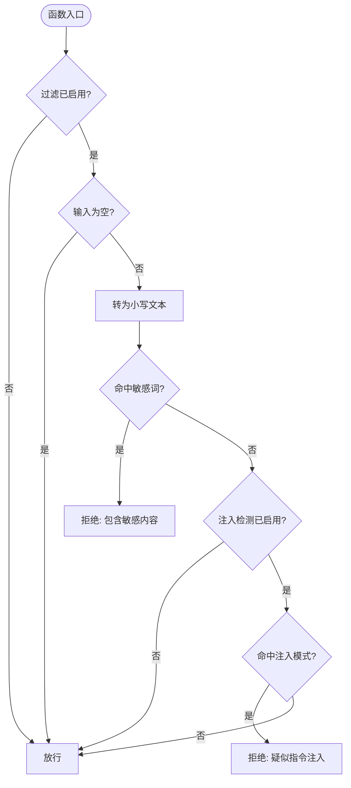
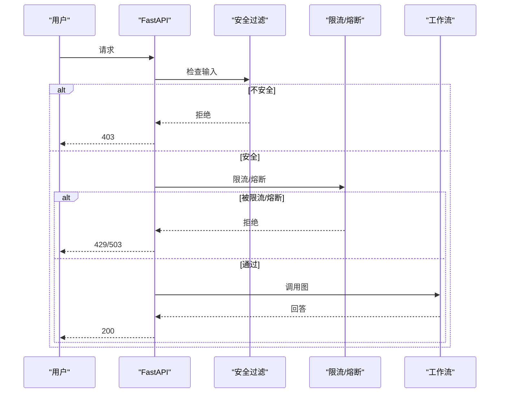
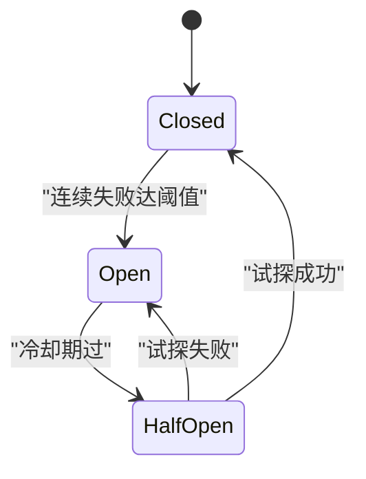
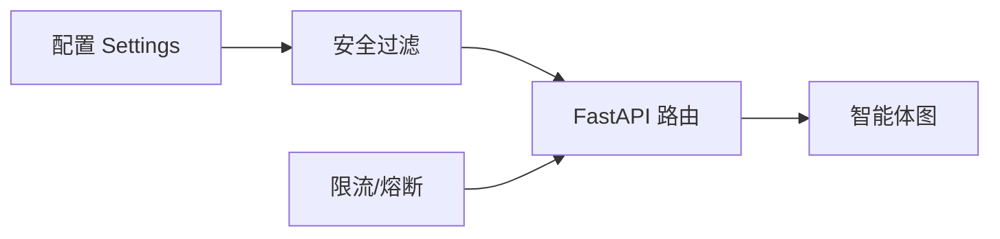

# 安全过滤系统

<cite>
**本文引用的文件**
- [agent/safety.py](file://agent/safety.py)
- [config/settings.py](file://config/settings.py)
- [main.py](file://main.py)
- [agent/rate_limiter.py](file://agent/rate_limiter.py)
- [agent/graph.py](file://agent/graph.py)
- [需求分析文档.md](file://需求分析文档.md)
</cite>

## 目录
1. [简介](#简介)
2. [项目结构](#项目结构)
3. [核心组件](#核心组件)
4. [架构总览](#架构总览)
5. [详细组件分析](#详细组件分析)
6. [依赖关系分析](#依赖关系分析)
7. [性能与误报控制](#性能与误报控制)
8. [故障排查指南](#故障排查指南)
9. [结论](#结论)
10. [附录：扩展与集成示例](#附录：扩展与集成示例)

## 简介
本技术文档聚焦于“安全过滤系统”，围绕输入安全检查、敏感词检测、恶意内容识别（prompt 注入）、数据脱敏与合规性检查等能力，结合现有代码实现进行系统化说明。当前仓库实现了基于关键词黑名单与 prompt 注入模式匹配的输入安全过滤，并在 Web 接口入口处统一拦截；同时提供限流与熔断机制以增强系统稳定性。文档还给出如何扩展自定义过滤器、接入第三方安全服务以及优化性能与降低误报率的实践建议。

## 项目结构
与安全过滤相关的核心位置如下：
- 入口层：FastAPI 路由在请求进入时调用安全过滤，未通过则直接返回错误码与提示。
- 安全模块：独立的安全检查函数，负责关键词黑名单与注入模式匹配。
- 配置中心：集中管理开关与规则列表，支持环境变量与 .env 驱动。
- 可靠性组件：限流器与熔断器，保护后端 LLM 与检索链路。

图表来源
- [main.py:154-209](file://main.py#L154-L209)
- [main.py:228-314](file://main.py#L228-L314)
- [agent/safety.py:35-67](file://agent/safety.py#L35-L67)
- [agent/rate_limiter.py:22-47](file://agent/rate_limiter.py#L22-L47)
- [agent/rate_limiter.py:51-147](file://agent/rate_limiter.py#L51-L147)

章节来源
- [main.py:154-209](file://main.py#L154-L209)
- [main.py:228-314](file://main.py#L228-L314)
- [agent/safety.py:1-67](file://agent/safety.py#L1-L67)
- [config/settings.py:135-141](file://config/settings.py#L135-L141)
- [agent/rate_limiter.py:1-147](file://agent/rate_limiter.py#L1-L147)

## 核心组件
- 输入安全过滤（agent/safety.py）
  - 功能：关键词黑名单 + prompt 注入模式匹配。
  - 行为：命中即拒绝，不进入后续链路；敏感词不回显，避免被探测枚举。
  - 开关：由配置项控制是否启用。
- 配置管理（config/settings.py）
  - 提供 input_filter_enabled、input_blocked_keywords、input_injection_check_enabled 等开关与规则。
  - 提供 input_blocked_keywords_list 解析为列表供过滤使用。
- 入口集成（main.py）
  - 在 /api/chat 与 /api/chat/stream 两个接口中，先执行安全过滤，再执行限流与熔断，最后进入智能体工作流。
- 限流与熔断（agent/rate_limiter.py）
  - 滑动窗口限流：按 user_id 维度限制每分钟请求数。
  - 三态熔断器：closed/open/half_open，连续失败达到阈值后熔断，冷却期过后半开试探。

章节来源
- [agent/safety.py:35-67](file://agent/safety.py#L35-L67)
- [config/settings.py:135-141](file://config/settings.py#L135-L141)
- [main.py:154-209](file://main.py#L154-L209)
- [main.py:228-314](file://main.py#L228-L314)
- [agent/rate_limiter.py:22-47](file://agent/rate_limiter.py#L22-L47)
- [agent/rate_limiter.py:51-147](file://agent/rate_limiter.py#L51-L147)

## 架构总览
安全过滤位于请求处理的最前端，确保只有安全的输入进入后续昂贵的 LLM/检索链路。整体流程如下：

图表来源
- [main.py:154-209](file://main.py#L154-L209)
- [main.py:228-314](file://main.py#L228-L314)
- [agent/safety.py:35-67](file://agent/safety.py#L35-L67)
- [agent/rate_limiter.py:22-47](file://agent/rate_limiter.py#L22-L47)
- [agent/rate_limiter.py:51-147](file://agent/rate_limiter.py#L51-L147)

## 详细组件分析

### 输入安全过滤（关键词黑名单 + Prompt 注入检测）
- 设计要点
  - 大小写不敏感匹配，提升覆盖度。
  - 敏感词黑名单来自配置，便于动态调整。
  - 内置常见中英文注入模式，仅保留明确指令类，减少误拦。
  - 被拒绝的输入不进入 Agent 链路，直接返回拦截提示。
- 关键流程
  - 读取配置开关，若关闭则直接放行。
  - 空输入放行。
  - 遍历敏感词列表，命中即拒绝。
  - 若开启注入检测，遍历注入模式，命中即拒绝。
  - 否则放行。

图表来源
- [agent/safety.py:35-67](file://agent/safety.py#L35-L67)
- [config/settings.py:135-141](file://config/settings.py#L135-L141)

章节来源
- [agent/safety.py:1-67](file://agent/safety.py#L1-L67)
- [config/settings.py:135-141](file://config/settings.py#L135-L141)

### 配置管理（Settings）
- 安全相关配置项
  - input_filter_enabled：是否启用输入过滤。
  - input_blocked_keywords：逗号分隔的敏感词列表。
  - input_injection_check_enabled：是否启用注入检测。
- 解析方法
  - input_blocked_keywords_list：将逗号分隔字符串解析为列表，去除空白项。
- 作用范围
  - 安全过滤模块在运行时读取配置，支持热更新（进程内缓存）。

章节来源
- [config/settings.py:135-141](file://config/settings.py#L135-L141)
- [config/settings.py:173-176](file://config/settings.py#L173-L176)

### 入口集成（FastAPI 路由）
- 同步接口 /api/chat
  - 先做空输入校验，再调用安全过滤，未通过返回 403。
  - 随后进行限流与熔断检查，未通过返回 429/503。
  - 通过后调用智能体图并返回答案。
- 流式接口 /api/chat/stream
  - 同样前置安全过滤与限流熔断。
  - 流式事件包含状态、token、错误与完成标记。
  - 超时保护：整体超时后停止拉取并返回已生成的 token。

图表来源
- [main.py:154-209](file://main.py#L154-L209)
- [main.py:228-314](file://main.py#L228-L314)

章节来源
- [main.py:154-209](file://main.py#L154-L209)
- [main.py:228-314](file://main.py#L228-L314)

### 限流与熔断
- 滑动窗口限流
  - 按 user_id 维度维护最近 60 秒的请求时间戳队列。
  - 超过阈值则拒绝，返回 429。
- 三态熔断器
  - closed：正常放行。
  - open：连续失败达阈值后进入熔断，拒绝所有请求，返回 503。
  - half_open：冷却期过后放行一次试探，成功恢复 closed，失败重新 open。

图表来源
- [agent/rate_limiter.py:51-147](file://agent/rate_limiter.py#L51-L147)

章节来源
- [agent/rate_limiter.py:22-47](file://agent/rate_limiter.py#L22-L47)
- [agent/rate_limiter.py:51-147](file://agent/rate_limiter.py#L51-L147)

## 依赖关系分析
- 安全过滤依赖配置中心获取开关与规则。
- 入口路由依赖安全过滤与限流熔断模块。
- 智能体工作流在通过安全与可靠性检查后才被执行。

图表来源
- [config/settings.py:135-141](file://config/settings.py#L135-L141)
- [agent/safety.py:35-67](file://agent/safety.py#L35-L67)
- [main.py:154-209](file://main.py#L154-L209)
- [agent/rate_limiter.py:22-47](file://agent/rate_limiter.py#L22-L47)

章节来源
- [config/settings.py:135-141](file://config/settings.py#L135-L141)
- [agent/safety.py:35-67](file://agent/safety.py#L35-L67)
- [main.py:154-209](file://main.py#L154-L209)
- [agent/rate_limiter.py:22-47](file://agent/rate_limiter.py#L22-L47)

## 性能与误报控制
- 性能特性
  - 关键词黑名单为线性扫描，复杂度 O(N*M)，N 为黑名单长度，M 为输入长度；可通过分词/正则优化或引入 Trie/Aho-Corasick 加速。
  - 注入模式匹配为固定集合子串匹配，开销较小。
  - 配置读取使用 lru_cache 单例，避免重复解析。
- 误报率控制
  - 注入模式仅保留明确指令类，避免误拦正常问句。
  - 敏感词黑名单需定期审计，剔除歧义词与高频误报词。
  - 可引入分级策略：高风险词直接拒绝，低风险词告警或降权。
- 优化建议
  - 对黑名单进行预处理与索引化，提升匹配速度。
  - 对注入模式采用更精确的正则表达式，减少误判。
  - 增加白名单机制，允许特定场景豁免。
  - 引入外部安全服务（见附录）进行二次校验，提高准确率。

[本节为通用指导，无需具体文件引用]

## 故障排查指南
- 常见问题
  - 过滤未生效：检查 input_filter_enabled 是否为 true。
  - 误拦过多：审查 input_blocked_keywords 与注入模式，必要时放宽规则或加入白名单。
  - 限流过严：调整 rate_limit_per_minute，观察日志中的限流原因。
  - 频繁熔断：关注后端 LLM/检索异常，适当提高 circuit_breaker_threshold 或缩短 recovery 时间。
- 定位方法
  - 查看 FastAPI 路由返回的错误码与 errmsg。
  - 检查限流与熔断日志输出。
  - 通过健康检查端点确认服务状态。

章节来源
- [main.py:154-209](file://main.py#L154-L209)
- [main.py:228-314](file://main.py#L228-L314)
- [agent/rate_limiter.py:22-47](file://agent/rate_limiter.py#L22-L47)
- [agent/rate_limiter.py:51-147](file://agent/rate_limiter.py#L51-L147)

## 结论
当前安全过滤系统以轻量、可配置的方式提供了输入级防护，有效阻断敏感内容与常见 prompt 注入攻击，并通过限流与熔断保障系统稳定性。建议在业务场景中持续优化黑名单与注入模式，结合第三方安全服务提升检测精度，并建立完善的监控与审计机制以满足合规要求。

[本节为总结，无需具体文件引用]

## 附录：扩展与集成示例

### 添加新的安全规则
- 步骤
  - 在配置中添加新规则字段（如 input_custom_rules），并在 Settings 中提供解析方法。
  - 在安全过滤函数中新增规则检查分支，遵循“命中即拒绝”的原则。
  - 在入口路由中保持统一的拦截返回格式。
- 参考路径
  - 配置解析：[config/settings.py:173-176](file://config/settings.py#L173-L176)
  - 安全过滤主逻辑：[agent/safety.py:35-67](file://agent/safety.py#L35-L67)
  - 入口集成：[main.py:154-209](file://main.py#L154-L209), [main.py:228-314](file://main.py#L228-L314)

### 集成第三方安全服务
- 思路
  - 在安全过滤函数中增加可选的外部校验步骤，例如调用内容审核 API。
  - 根据外部服务返回决定是否放行或拒绝，并记录审计日志。
  - 对外部服务调用设置超时与重试，失败时降级为本地规则。
- 参考路径
  - 安全过滤主逻辑：[agent/safety.py:35-67](file://agent/safety.py#L35-L67)
  - 配置开关：[config/settings.py:135-141](file://config/settings.py#L135-L141)
  - 入口集成：[main.py:154-209](file://main.py#L154-L209), [main.py:228-314](file://main.py#L228-L314)

### 数据脱敏与合规性检查
- 现状
  - 当前代码未实现输出侧的数据脱敏与合规性检查。
- 建议
  - 在生成节点之后、返回之前增加脱敏管道，识别并替换敏感信息（如手机号、身份证、邮箱等）。
  - 增加合规性检查，依据业务规则对输出内容进行扫描与拦截。
  - 将脱敏与合规检查纳入配置中心，支持开关与规则管理。
  - 记录审计日志，满足合规审计要求。

[本节为概念性扩展建议，无需具体文件引用]