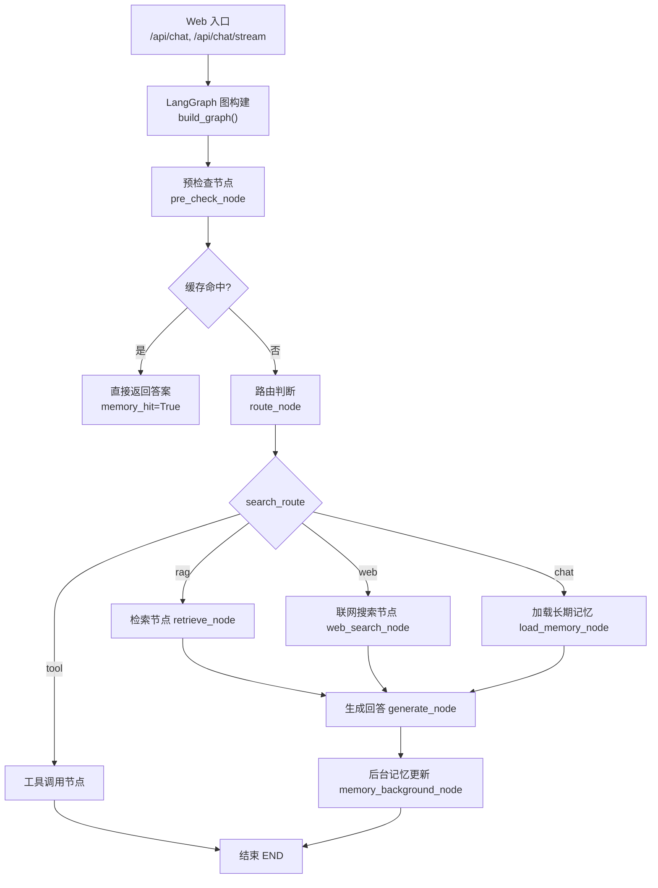
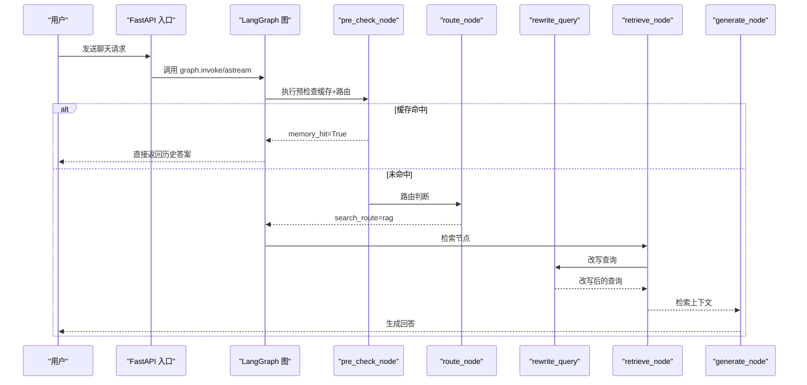
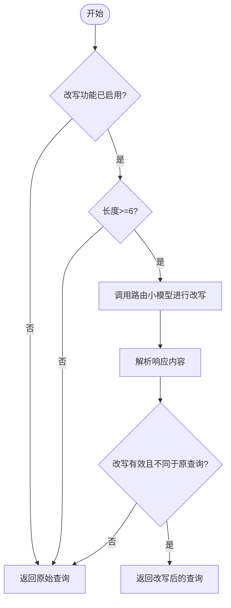
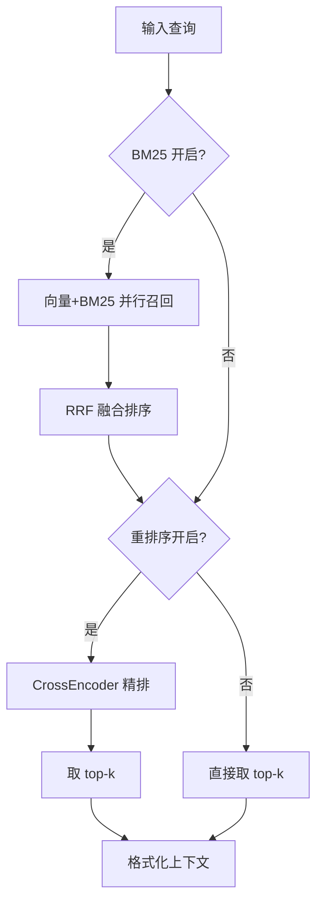
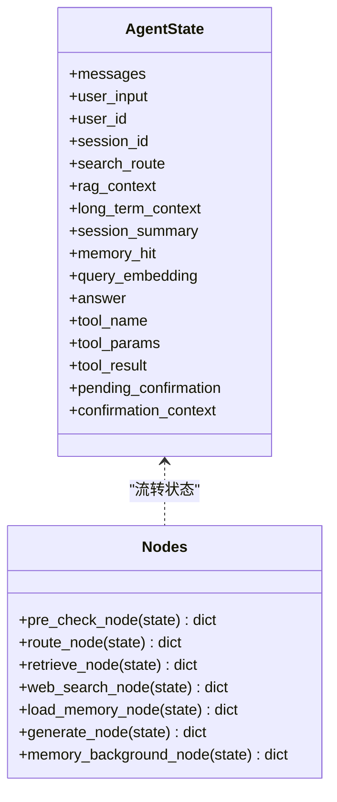
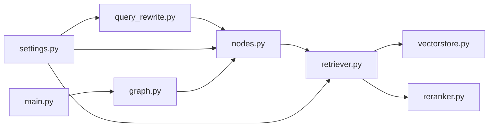

# 查询改写机制

<cite>
**本文引用的文件**
- [agent/query_rewrite.py](file://agent/query_rewrite.py)
- [agent/nodes.py](file://agent/nodes.py)
- [agent/graph.py](file://agent/graph.py)
- [config/settings.py](file://config/settings.py)
- [rag/retriever.py](file://rag/retriever.py)
- [rag/vectorstore.py](file://rag/vectorstore.py)
- [main.py](file://main.py)
</cite>

## 目录
1. [简介](#简介)
2. [项目结构](#项目结构)
3. [核心组件](#核心组件)
4. [架构总览](#架构总览)
5. [详细组件分析](#详细组件分析)
6. [依赖关系分析](#依赖关系分析)
7. [性能考量](#性能考量)
8. [故障排查指南](#故障排查指南)
9. [结论](#结论)
10. [附录：定制与集成示例](#附录定制与集成示例)

## 简介
本技术文档聚焦“查询改写机制”，围绕用户意图识别、查询优化与重写算法展开，重点说明多轮对话上下文理解、查询消歧、关键词提取与语义增强等能力。文档同时覆盖改写规则配置、模型调用策略、改写质量评估与性能优化，并提供可操作的定制与集成示例路径，帮助读者在现有系统中扩展新的改写策略。

## 项目结构
查询改写机制贯穿“预检查—路由—检索—生成—记忆更新”的完整链路，关键位置如下：
- 入口与流式接口：Web 端通过 /api/chat 与 /api/chat/stream 进入智能体工作流。
- 状态图编排：LangGraph 将节点串联为工作流，支持条件边分流（工具/检索/联网/记忆）。
- 检索阶段：retrieve_node 在执行 RAG 检索前调用 rewrite_query，实现“先改写再检索”。
- 配置中心：Settings 提供开关与阈值，控制是否启用改写、重排序、BM25 等多路召回策略。
- 向量检索：vectorstore.search 负责底层相似度检索；retriever 组合多路召回与重排序。

图表来源
- [main.py:154-209](file://main.py#L154-L209)
- [agent/graph.py:44-102](file://agent/graph.py#L44-L102)
- [agent/nodes.py:93-158](file://agent/nodes.py#L93-L158)

章节来源
- [main.py:154-209](file://main.py#L154-L209)
- [agent/graph.py:44-102](file://agent/graph.py#L44-L102)

## 核心组件
- 查询改写模块：基于轻量路由模型进行查询改写，失败时静默回退原始查询，不阻断检索链路。
- 检索器：支持纯向量检索、BM25 多路召回 + RRF 融合、CrossEncoder 重排序三种模式，可按配置切换。
- 路由与状态：根据输入特征与关键词快速分流，结合问答记忆短路，减少不必要的 LLM 调用。
- 配置管理：集中化开关与阈值，包括改写开关、重排序开关、BM25 开关、相关度阈值等。

章节来源
- [agent/query_rewrite.py:1-59](file://agent/query_rewrite.py#L1-L59)
- [rag/retriever.py:18-52](file://rag/retriever.py#L18-L52)
- [agent/nodes.py:93-158](file://agent/nodes.py#L93-L158)
- [config/settings.py:84-100](file://config/settings.py#L84-L100)

## 架构总览
查询改写在检索前执行，作为“语义增强层”提升召回率。整体流程如下：
- 用户输入进入 pre_check_node，先尝试问答记忆匹配，命中则直接返回答案。
- 未命中则 route_node 判断 search_route（tool/rag/web/chat），并写入状态。
- 若走 rag 分支，retrieve_node 调用 rewrite_query 对查询进行改写，再执行检索。
- 检索结果经格式化为上下文，进入 generate_node 生成回答。
- 生成后后台执行记忆抽取与更新，避免阻塞响应。

图表来源
- [main.py:154-209](file://main.py#L154-L209)
- [agent/graph.py:44-102](file://agent/graph.py#L44-L102)
- [agent/nodes.py:93-158](file://agent/nodes.py#L93-L158)
- [agent/nodes.py:284-321](file://agent/nodes.py#L284-L321)
- [agent/query_rewrite.py:26-59](file://agent/query_rewrite.py#L26-L59)

## 详细组件分析

### 查询改写模块（query_rewrite）
- 目标：将口语化、省略主语或指代不清的用户问题改写为更利于知识库检索的形式，保留原意且不增加未提及信息。
- 触发条件：
  - 配置开关开启（rag_query_rewrite_enabled）。
  - 查询长度大于等于 6 字符（过短缺乏上下文，改写收益低）。
- 模型调用策略：
  - 使用路由小模型（temperature=0.0）以降低延迟与成本。
  - 失败时静默回退原始查询，不阻断检索链路。
- 输出处理：
  - 仅当改写结果非空且与原始查询不同才采用，否则回退原始查询。
  - 日志记录改写前后对比，便于评估效果。

图表来源
- [agent/query_rewrite.py:26-59](file://agent/query_rewrite.py#L26-L59)

章节来源
- [agent/query_rewrite.py:1-59](file://agent/query_rewrite.py#L1-L59)

### 检索器（retriever）
- 多路召回策略：
  - BM25 开启：向量检索与 BM25 并行召回，RRF 融合排序。
  - 仅重排序：向量检索 top-N 候选，CrossEncoder 精排取 top-k。
  - 关闭重排序：直接向量检索 top-k。
- 分数归一化：
  - 统一展示相关性：1/(1+|score|)，使向量距离与 CrossEncoder 分数在同一区间比较。
- 过滤与降级：
  - vectorstore.search 内置低相关度过滤；若过滤后为空，回退到原始结果保证有内容。

图表来源
- [rag/retriever.py:18-52](file://rag/retriever.py#L18-L52)
- [rag/retriever.py:55-110](file://rag/retriever.py#L55-L110)
- [rag/vectorstore.py:164-184](file://rag/vectorstore.py#L164-L184)

章节来源
- [rag/retriever.py:18-139](file://rag/retriever.py#L18-L139)
- [rag/vectorstore.py:164-184](file://rag/vectorstore.py#L164-L184)

### 路由与状态（nodes）
- 预检查：合并问答缓存匹配与路由判断，命中则短路至 END，跳过后续生成链路。
- 路由逻辑：
  - 工具调用优先（TOOL_KEYWORDS）。
  - 时效性问题（时间/天气）优先走联网搜索。
  - 短输入倾向闲聊。
  - 兜底使用 LLM 路由判断，失败回退关键词策略。
- 检索节点：
  - 调用 rewrite_query 进行查询改写。
  - 仅在纯向量检索路径下应用相关度阈值过滤（rerank/BM25 路径不适用统一归一化）。

图表来源
- [agent/state.py:12-51](file://agent/state.py#L12-L51)
- [agent/nodes.py:93-158](file://agent/nodes.py#L93-L158)
- [agent/nodes.py:284-321](file://agent/nodes.py#L284-L321)

章节来源
- [agent/state.py:12-51](file://agent/state.py#L12-L51)
- [agent/nodes.py:93-158](file://agent/nodes.py#L93-L158)
- [agent/nodes.py:284-321](file://agent/nodes.py#L284-L321)

### 配置管理（settings）
- 查询改写开关：rag_query_rewrite_enabled 控制是否启用改写。
- 检索策略：
  - rag_bm25_enabled：开启 BM25 多路召回。
  - rerank_enabled：开启 CrossEncoder 重排序。
  - rag_min_relevance：纯向量路径的相关度阈值。
  - rag_top_k/rerank_top_k：最终返回条数。
- 其他：联网搜索开关、OCR、记忆窗口与预算等。

章节来源
- [config/settings.py:84-100](file://config/settings.py#L84-L100)
- [config/settings.py:109-133](file://config/settings.py#L109-L133)

## 依赖关系分析
- query_rewrite 依赖 nodes._get_router_llm 获取轻量模型实例，并通过 settings 读取改写开关。
- retrieve_node 依赖 query_rewrite 与 retriever.retrieve，后者依赖 vectorstore.search 与可选 reranker。
- main.py 启动时预热 LLM 连接与向量库索引，降低首请求延迟。
- graph.py 将各节点组织为状态图，定义条件边与执行顺序。

图表来源
- [agent/query_rewrite.py:26-59](file://agent/query_rewrite.py#L26-L59)
- [agent/nodes.py:284-321](file://agent/nodes.py#L284-L321)
- [rag/retriever.py:18-52](file://rag/retriever.py#L18-L52)
- [rag/vectorstore.py:164-184](file://rag/vectorstore.py#L164-L184)
- [config/settings.py:84-100](file://config/settings.py#L84-L100)
- [main.py:45-77](file://main.py#L45-L77)

章节来源
- [agent/query_rewrite.py:26-59](file://agent/query_rewrite.py#L26-L59)
- [agent/nodes.py:284-321](file://agent/nodes.py#L284-L321)
- [rag/retriever.py:18-52](file://rag/retriever.py#L18-L52)
- [rag/vectorstore.py:164-184](file://rag/vectorstore.py#L164-L184)
- [config/settings.py:84-100](file://config/settings.py#L84-L100)
- [main.py:45-77](file://main.py#L45-L77)

## 性能考量
- 首请求延迟优化：
  - 启动时预热路由小模型与主模型连接（TLS握手、DNS解析、HTTP/2连接池建立）。
  - 预热 BM25 索引与向量库，避免首次检索阻塞。
- 改写开销控制：
  - 仅对长度≥6的查询触发改写，避免无意义调用。
  - 使用 temperature=0.0 的路由小模型，降低成本与延迟。
  - 失败静默回退，确保检索链路不中断。
- 检索效率：
  - 多路召回（BM25+向量）与 RRF 融合提升召回精度。
  - CrossEncoder 重排序提高最终 top-k 质量。
  - 纯向量路径下使用相关度阈值过滤，减少低质上下文注入。
- 流式与超时保护：
  - SSE 流式输出，设置整体超时，防止连接卡死。
  - 生成节点支持主模型失败自动降级到备用模型列表。

章节来源
- [main.py:45-77](file://main.py#L45-L77)
- [main.py:228-314](file://main.py#L228-L314)
- [agent/query_rewrite.py:26-59](file://agent/query_rewrite.py#L26-L59)
- [rag/retriever.py:18-52](file://rag/retriever.py#L18-L52)
- [agent/nodes.py:467-496](file://agent/nodes.py#L467-L496)

## 故障排查指南
- 改写失败：
  - 现象：日志显示“改写失败，使用原始查询”。
  - 原因：网络异常、模型不可用、响应解析失败。
  - 处理：确认改写开关与模型配置；检查路由小模型可用性；必要时临时关闭改写。
- 检索为空：
  - 现象：retrieve 返回空上下文。
  - 原因：向量库为空、相关度阈值过高、BM25 索引缺失。
  - 处理：检查向量库初始化与文档入库；调整 rag_min_relevance；开启 BM25 多路召回。
- 路由错误：
  - 现象：意图识别偏差导致走错分支。
  - 原因：关键词不足、LLM 路由失败。
  - 处理：完善 TOOL/ROUTER/WEB_SEARCH 关键词；检查路由开关与超时配置。
- 流式超时：
  - 现象：SSE 流式输出提前结束。
  - 原因：整体超时设置过小、下游服务慢。
  - 处理：调整 stream_timeout；检查下游服务健康状态。

章节来源
- [agent/query_rewrite.py:45-59](file://agent/query_rewrite.py#L45-L59)
- [rag/vectorstore.py:164-184](file://rag/vectorstore.py#L164-L184)
- [agent/nodes.py:161-211](file://agent/nodes.py#L161-L211)
- [main.py:228-314](file://main.py#L228-L314)

## 结论
查询改写机制通过轻量模型对输入进行语义增强，结合多路召回与重排序，显著提升知识库检索召回率与回答质量。系统具备完善的开关与阈值配置、健壮的错误回退与降级策略，以及启动预热与流式超时保护，保障在高并发场景下的稳定性与性能。通过合理配置与扩展，可在不侵入主链路的前提下持续优化检索效果。

## 附录：定制与集成示例
以下示例以“代码片段路径”形式给出，便于读者定位与扩展：

- 启用/禁用查询改写
  - 配置项：rag_query_rewrite_enabled
  - 参考路径：[config/settings.py:91-93](file://config/settings.py#L91-L93)
  - 行为：关闭时直接返回原始查询；开启时对长度≥6的查询调用路由小模型改写。

- 自定义改写提示词
  - 当前提示词位于模块内常量，可通过环境变量或外部配置文件注入。
  - 参考路径：[agent/query_rewrite.py:13-23](file://agent/query_rewrite.py#L13-L23)
  - 建议：针对领域术语添加示例，强化“补全省略主语/指代”和“去除口语化表达”的能力。

- 集成新的改写策略（如关键词提取+语义增强）
  - 在 retrieve_node 中调用 rewrite_query 的位置插入新策略。
  - 参考路径：[agent/nodes.py:297-304](file://agent/nodes.py#L297-L304)
  - 步骤：
    1. 新增改写函数（例如 extract_keywords_and_enhance）。
    2. 在 retrieve_node 中按配置选择策略（默认 LLM 改写，可切换为规则策略）。
    3. 记录改写前后对比日志，便于评估效果。

- 调整检索策略（BM25/重排序）
  - 配置项：rag_bm25_enabled、rerank_enabled、rag_min_relevance、rag_top_k、rerank_top_k
  - 参考路径：[config/settings.py:84-100](file://config/settings.py#L84-L100)
  - 行为：
    - BM25 开启：向量+BM25 并行召回，RRF 融合。
    - 重排序开启：CrossEncoder 精排提升 top-k 质量。
    - 纯向量路径：使用相关度阈值过滤低质结果。

- 多轮对话上下文理解
  - 短期记忆：build_chat_history 维护最近消息窗口与字符预算，超窗时压缩更早对话摘要。
  - 参考路径：[agent/nodes.py:427-450](file://agent/nodes.py#L427-L450)
  - 行为：注入 SystemMessage 包含更早对话摘要，避免长上下文丢失主线信息。

- 查询消歧与关键词提取
  - 路由阶段通过关键词快速识别工具调用与时效性问题，减少误判。
  - 参考路径：[agent/nodes.py:63-90](file://agent/nodes.py#L63-L90)
  - 行为：天气/时间关键词优先走联网搜索；工具关键词优先走工具调用。

- 改写质量评估
  - 日志记录：改写前后对比，便于离线评估。
  - 参考路径：[agent/query_rewrite.py:51-54](file://agent/query_rewrite.py#L51-L54)
  - 建议：收集改写前后的检索命中率与回答质量指标，定期评估策略效果。

- 性能优化
  - 启动预热：预热路由小模型与主模型连接，降低首请求延迟。
  - 参考路径：[main.py:45-77](file://main.py#L45-L77)
  - 行为：后台线程预热，失败不影响启动；BM25 索引预热避免首次检索阻塞。

章节来源
- [config/settings.py:84-100](file://config/settings.py#L84-L100)
- [agent/query_rewrite.py:13-23](file://agent/query_rewrite.py#L13-L23)
- [agent/nodes.py:297-304](file://agent/nodes.py#L297-L304)
- [agent/nodes.py:427-450](file://agent/nodes.py#L427-L450)
- [agent/nodes.py:63-90](file://agent/nodes.py#L63-L90)
- [main.py:45-77](file://main.py#L45-L77)