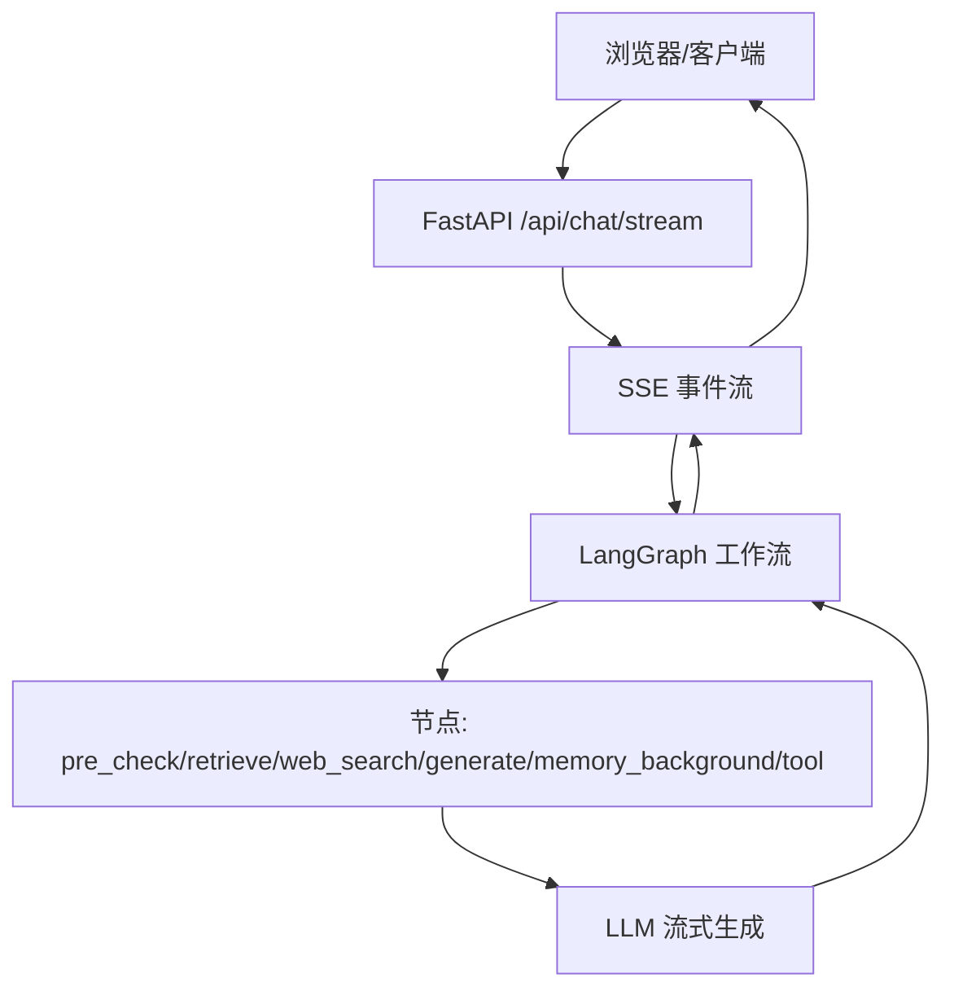
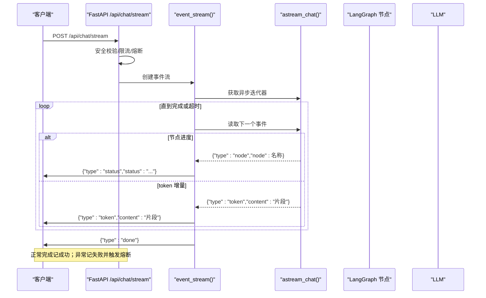
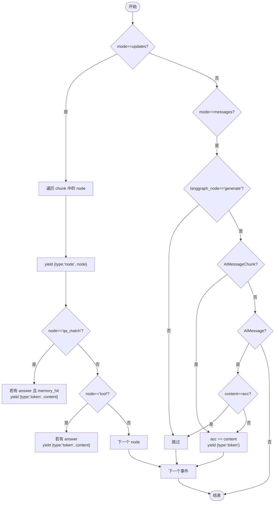
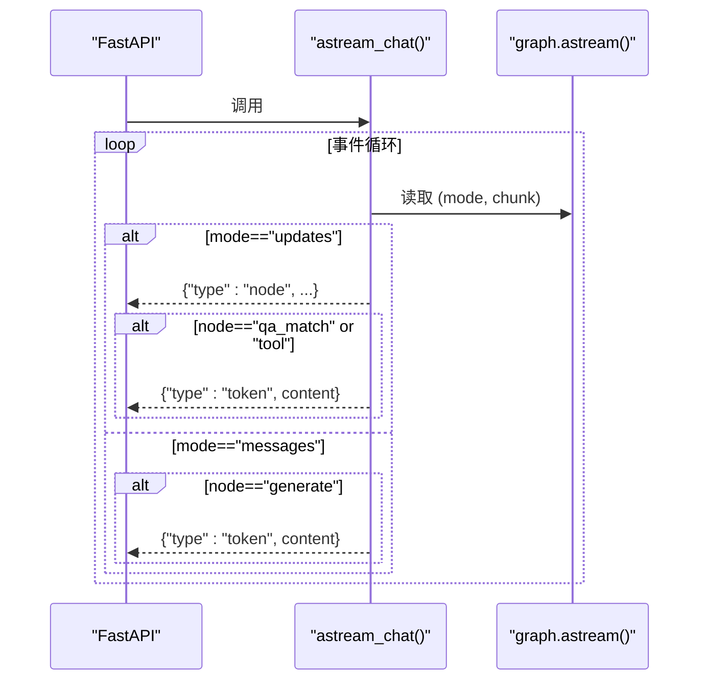
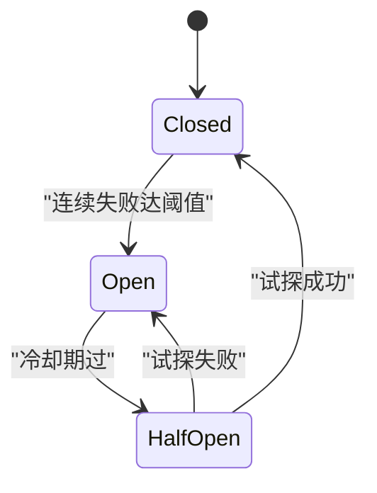
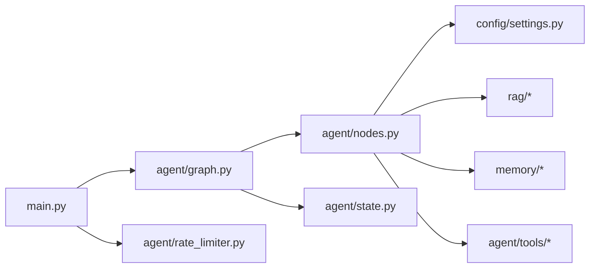

# 流式响应处理

<cite>
**本文引用的文件**
- [main.py](file://main.py)
- [agent/graph.py](file://agent/graph.py)
- [agent/nodes.py](file://agent/nodes.py)
- [agent/state.py](file://agent/state.py)
- [agent/rate_limiter.py](file://agent/rate_limiter.py)
- [static/index.html](file://static/index.html)
</cite>

## 目录
1. [简介](#简介)
2. [项目结构](#项目结构)
3. [核心组件](#核心组件)
4. [架构总览](#架构总览)
5. [详细组件分析](#详细组件分析)
6. [依赖关系分析](#依赖关系分析)
7. [性能考量](#性能考量)
8. [故障排查指南](#故障排查指南)
9. [结论](#结论)
10. [附录：前端集成示例与自定义处理器](#附录前端集成示例与自定义处理器)

## 简介
本技术文档聚焦于该项目的流式响应处理机制，围绕 SSE（Server-Sent Events）实时流式输出展开，重点解析以下能力：
- _emit_message_events 事件处理器：统一同步/异步双模式流，过滤、去重、补发非生成路径的 token。
- Token 级增量输出：基于 LangGraph 的 messages 流，逐 token 透传到前端。
- 节点进度跟踪：通过 updates 流上报节点进入状态，映射为 status 事件。
- 错误恢复机制：限流、熔断、超时保护、降级备用模型、异常事件回传。
- 同步与异步流式接口：chat_stream 与 astream_chat 双入口。
- 事件过滤规则与去重策略：仅透传 generate 节点的 AIMessageChunk，跳过末尾完整消息重复。
- 性能调优：启动预热、整体超时、Nginx 缓冲禁用、缓存命中短路等。

## 项目结构
本项目采用 FastAPI 作为 Web 框架，LangGraph StateGraph 编排智能体工作流，SSE 将节点进度与 token 增量推送到前端。关键文件职责如下：
- main.py：Web 路由、SSE 流式接口、REPL 调试、健康检查、启动预热。
- agent/graph.py：构建并编译 LangGraph 图，提供 chat/chat_stream/astream_chat 入口，实现 _emit_message_events 事件转换。
- agent/nodes.py：各节点实现（预检查、检索、联网搜索、长期记忆、生成、工具调用、后台记忆更新）。
- agent/state.py：AgentState 状态定义。
- agent/rate_limiter.py：滑动窗口限流与熔断器。
- static/index.html：前端 SSE 客户端，解析 status/token/error/done 事件并渲染。

**图表来源**
- [main.py:228-314](file://main.py#L228-L314)
- [agent/graph.py:141-255](file://agent/graph.py#L141-L255)
- [agent/nodes.py:499-532](file://agent/nodes.py#L499-L532)

**章节来源**
- [main.py:1-387](file://main.py#L1-L387)
- [agent/graph.py:1-255](file://agent/graph.py#L1-L255)
- [agent/nodes.py:1-780](file://agent/nodes.py#L1-L780)
- [agent/state.py:1-54](file://agent/state.py#L1-L54)
- [agent/rate_limiter.py:1-146](file://agent/rate_limiter.py#L1-L146)
- [static/index.html:222-362](file://static/index.html#L222-L362)

## 核心组件
- 流式接口与事件封装：
  - /api/chat/stream 使用 StreamingResponse 返回 text/event-stream。
  - _sse 函数将 payload 序列化为 SSE data 行。
  - event_stream 协程负责整体超时控制、事件转发、done 标记与熔断计数。
- 事件转换器：
  - _emit_message_events（同步）与 astream_chat（异步）将 LangGraph 的双模式流（updates/messages）转换为统一的 {type:"node"/"token"} 事件。
  - 过滤规则：仅透传 generate 节点的 AIMessageChunk；对 qa_match/tool 分支补发 token；跳过末尾完整消息重复。
- 节点进度映射：
  - _NODE_STATUS 将节点名映射为用户可读的状态提示，如“检索知识库中...”。
- 安全与稳定性：
  - 输入安全过滤、限流、熔断、超时保护、降级备用模型。

**章节来源**
- [main.py:212-314](file://main.py#L212-L314)
- [agent/graph.py:141-255](file://agent/graph.py#L141-L255)
- [agent/nodes.py:499-532](file://agent/nodes.py#L499-L532)
- [agent/rate_limiter.py:1-146](file://agent/rate_limiter.py#L1-L146)

## 架构总览
下图展示从请求到响应的端到端流程，包括事件类型与关键处理点。

**图表来源**
- [main.py:228-314](file://main.py#L228-L314)
- [agent/graph.py:208-255](file://agent/graph.py#L208-L255)
- [agent/nodes.py:499-532](file://agent/nodes.py#L499-L532)

## 详细组件分析

### _emit_message_events 事件处理器（同步）
- 作用：将 LangGraph 的 stream 输出（mode=updates/messages）转换为统一事件。
- 过滤规则：
  - updates：每个 node 进入时发出 node 事件；qa_match 命中时补发 answer 为 token；tool 分支直接返回 answer 时补发 token。
  - messages：仅当 langgraph_node == "generate" 时才处理；AIMessageChunk 直接透传；AIMessage 若内容与累计 acc 相同则跳过（避免重复）。
- 去重策略：维护 acc 累计已输出的增量内容，用于跳过末尾完整消息重复。
- 复杂度：O(N) 遍历事件，内存 O(L) 累计长度 L。

**图表来源**
- [agent/graph.py:141-188](file://agent/graph.py#L141-L188)

**章节来源**
- [agent/graph.py:141-188](file://agent/graph.py#L141-L188)

### astream_chat 异步流式入口
- 作用：供 Web SSE 接口使用的异步流式调用，产出统一事件。
- 行为：
  - 使用 graph.astream(stream_mode=["updates","messages"]) 获取双模式流。
  - 对 updates 中的 qa_match/tool 分支补发 token。
  - 对 messages 中的 generate 节点 AIMessageChunk/AIMessage 进行过滤与去重。
- 与同步版本的差异：内部维护 acc 累计，避免重复。

**图表来源**
- [agent/graph.py:208-255](file://agent/graph.py#L208-L255)

**章节来源**
- [agent/graph.py:208-255](file://agent/graph.py#L208-L255)

### 节点进度跟踪与状态映射
- 节点进入时通过 updates 流产生 node 事件。
- main.py 将 node 映射为人类可读的 status 文本，例如“检索知识库中...”、“生成回答中...”。
- 前端根据 type=status 的事件显示当前阶段提示。

**章节来源**
- [main.py:212-225](file://main.py#L212-L225)
- [agent/graph.py:159-172](file://agent/graph.py#L159-L172)
- [static/index.html:297-309](file://static/index.html#L297-L309)

### 错误恢复与稳定性机制
- 输入安全过滤：拒绝注入或违规输入。
- 限流：按 user_id 滑动窗口限制每分钟请求数。
- 熔断：连续失败达到阈值后进入 open 状态，冷却后 half_open 试探一次，成功则 closed，失败继续 open。
- 超时保护：整体流式超时，停止拉取并返回已生成的 token，发送 done 标记。
- 降级：主模型失败时尝试备用模型列表，全部失败返回兜底文案。
- 异常事件：发生异常时发送 error 事件，并记录失败以触发熔断。

**图表来源**
- [agent/rate_limiter.py:50-117](file://agent/rate_limiter.py#L50-L117)

**章节来源**
- [main.py:238-304](file://main.py#L238-L304)
- [agent/rate_limiter.py:1-146](file://agent/rate_limiter.py#L1-L146)
- [agent/nodes.py:467-496](file://agent/nodes.py#L467-L496)

### 同步与异步流式接口对比
- 同步接口：chat_stream 使用 graph.stream，适用于 REPL 调试。
- 异步接口：astream_chat 使用 graph.astream，适用于 Web SSE。
- 两者均通过统一事件格式对外暴露，便于前端一致处理。

**章节来源**
- [agent/graph.py:190-205](file://agent/graph.py#L190-L205)
- [agent/graph.py:208-255](file://agent/graph.py#L208-L255)
- [main.py:329-362](file://main.py#L329-L362)

## 依赖关系分析
- main.py 依赖 agent.graph 提供的 astream_chat 与 get_compiled_graph。
- agent.graph 依赖 agent.nodes 的各节点实现与 agent.state 的状态定义。
- agent.nodes 依赖配置 settings、RAG、记忆模块、工具模块。
- rate_limiter 被 main.py 在流式接口前后调用，保障服务稳定性。

**图表来源**
- [main.py:228-314](file://main.py#L228-L314)
- [agent/graph.py:1-255](file://agent/graph.py#L1-L255)
- [agent/nodes.py:1-780](file://agent/nodes.py#L1-L780)
- [agent/rate_limiter.py:1-146](file://agent/rate_limiter.py#L1-L146)

**章节来源**
- [main.py:1-387](file://main.py#L1-L387)
- [agent/graph.py:1-255](file://agent/graph.py#L1-L255)
- [agent/nodes.py:1-780](file://agent/nodes.py#L1-L780)
- [agent/rate_limiter.py:1-146](file://agent/rate_limiter.py#L1-L146)

## 性能考量
- 启动预热：
  - LLM 连接预热（TLS 握手、DNS、连接池），降低首条请求延迟。
  - 向量库初始化与 BM25 索引预热，避免首请求阻塞。
- 缓存命中短路：
  - qa_match 命中直接复用历史答案，跳过生成链路。
- 流式整体超时：
  - 防止连接卡死，超时后返回已生成内容并发送 done。
- Nginx 代理优化：
  - 设置 X-Accel-Buffering=no，禁用代理缓冲，确保实时性。
- 相关度过滤：
  - 纯向量检索路径下启用最小相关度阈值，减少无效上下文。
- 后台记忆更新：
  - 抽取与摘要在 memory_background 节点执行，不阻塞主响应链路。

**章节来源**
- [main.py:45-135](file://main.py#L45-L135)
- [main.py:262-314](file://main.py#L262-L314)
- [agent/nodes.py:232-281](file://agent/nodes.py#L232-L281)
- [agent/nodes.py:284-321](file://agent/nodes.py#L284-L321)
- [agent/nodes.py:630-643](file://agent/nodes.py#L630-L643)

## 故障排查指南
- 常见问题定位：
  - 无 token 输出：检查是否未命中任何分支且生成失败；确认 astream_chat 是否正确 yield token。
  - 重复 token：检查 _emit_message_events 的去重逻辑（acc 累计）是否生效。
  - 状态提示不更新：确认 updates 流是否正常产出 node 事件，以及 _NODE_STATUS 映射是否存在。
  - 频繁熔断：查看 rate_limiter 的失败计数与冷却时间配置，检查后端 LLM 可用性。
  - 超时问题：调整 STREAM_TIMEOUT，检查网络与 LLM 响应速度。
- 日志与监控：
  - 关注 [stream] 日志，定位超时与异常。
  - 关注 [circuit_breaker] 日志，了解熔断状态变化。
  - 关注 [route]/[retrieve]/[web_search]/[generate] 日志，定位具体节点失败原因。

**章节来源**
- [main.py:262-304](file://main.py#L262-L304)
- [agent/rate_limiter.py:50-117](file://agent/rate_limiter.py#L50-L117)
- [agent/graph.py:141-188](file://agent/graph.py#L141-L188)

## 结论
本项目实现了完整的 SSE 流式响应处理，具备 token 级增量输出、节点进度跟踪、错误恢复与性能优化等能力。通过 _emit_message_events 的统一事件转换与 astream_chat 的异步流式入口，前后端可高效协作，提供低延迟、高可用的对话体验。限流与熔断机制保障了服务的稳定性，启动预热与缓存短路进一步优化了首请求与整体吞吐。

## 附录：前端集成示例与自定义处理器
- 前端解析 SSE：
  - 使用 fetch + ReadableStream 读取数据，按 \n\n 分隔事件，解析 data: JSON。
  - 处理 type=status 显示节点进度；type=token 追加文本；type=error 显示错误；完成后移除状态提示。
- 自定义流式处理器：
  - 可在 event_stream 中扩展事件类型，例如增加 progress、stats 等。
  - 在前端新增对应分支处理逻辑，保持事件契约稳定。
- 不同前端框架集成要点：
  - React/Vue：使用 useEffect/生命周期管理连接与销毁，避免内存泄漏。
  - 移动端：注意断线重连与节流 UI 更新频率。
  - 跨域：确保服务端允许 CORS 与正确的 Content-Type。

**章节来源**
- [static/index.html:255-324](file://static/index.html#L255-L324)
- [main.py:228-314](file://main.py#L228-L314)