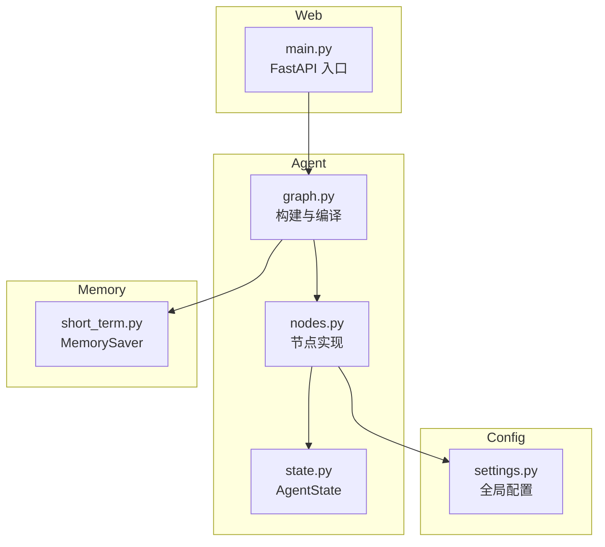
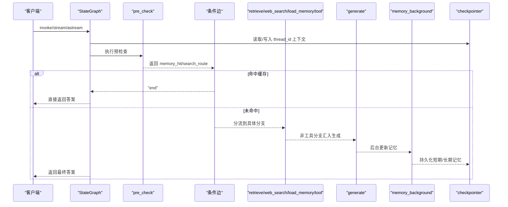
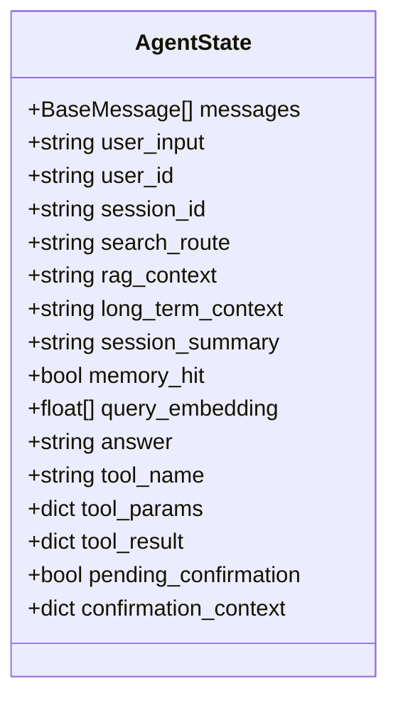
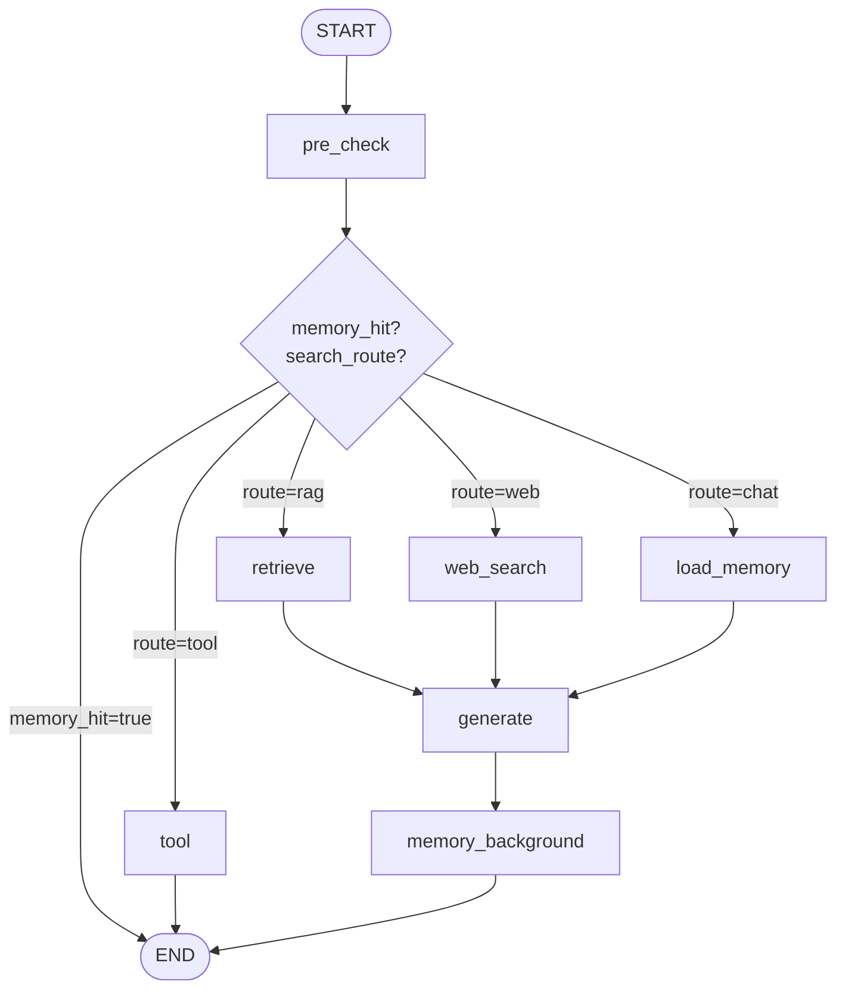
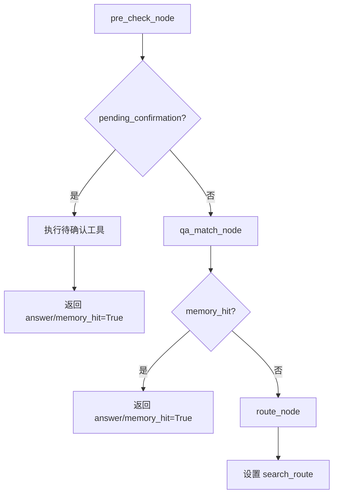
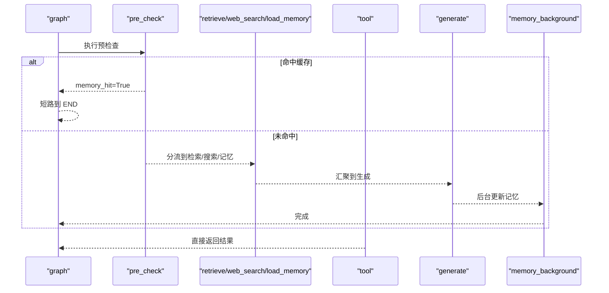
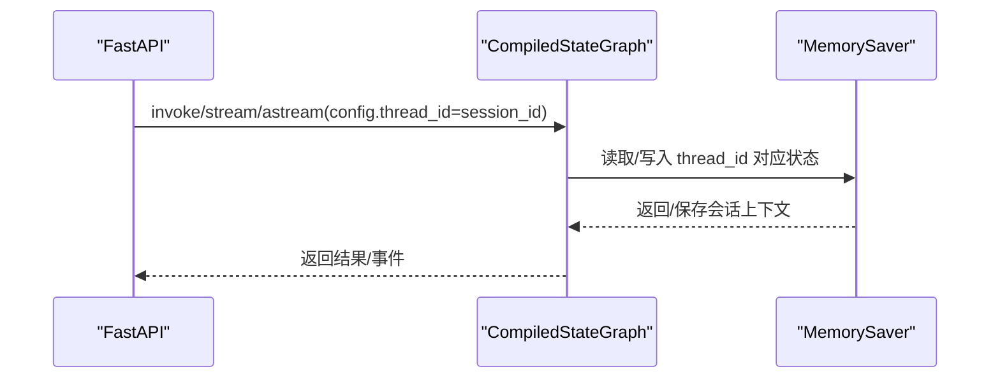
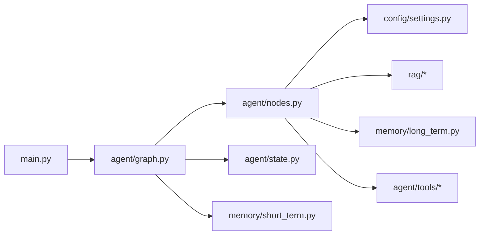

# 状态图设计

<cite>
**本文引用的文件**
- [agent/state.py](file://agent/state.py)
- [agent/graph.py](file://agent/graph.py)
- [agent/nodes.py](file://agent/nodes.py)
- [memory/short_term.py](file://memory/short_term.py)
- [config/settings.py](file://config/settings.py)
- [main.py](file://main.py)
</cite>

## 目录
1. [简介](#简介)
2. [项目结构](#项目结构)
3. [核心组件](#核心组件)
4. [架构总览](#架构总览)
5. [详细组件分析](#详细组件分析)
6. [依赖关系分析](#依赖关系分析)
7. [性能考量](#性能考量)
8. [故障排查指南](#故障排查指南)
9. [结论](#结论)
10. [附录：自定义状态图与工作流扩展示例](#附录自定义状态图与工作流扩展示例)

## 简介
本技术文档围绕 LangGraph 状态图在智能体工作流中的设计与实现，重点解析 AgentState 状态结构、状态图的构建与编译机制、预检查节点与四路分流条件边、线性边的连接关系，以及 checkpointer 的挂载方式。同时给出状态流转图、节点间调用关系、线程隔离机制与性能优化策略，并提供可操作的代码级示例路径，帮助读者快速构建自定义状态图并扩展工作流。

## 项目结构
- agent/state.py：定义 AgentState 状态结构，包含消息历史、用户输入、路由结果、检索上下文、长期记忆、会话摘要、问答命中标志、工具调用相关字段等。
- agent/graph.py：构建并编译 StateGraph，注册节点、添加线性边与条件边，挂载 checkpointer，提供同步/异步/流式调用入口。
- agent/nodes.py：实现各节点逻辑（预检查、路由、RAG 检索、联网搜索、长期记忆加载、生成回答、后台记忆更新、工具调用）。
- memory/short_term.py：基于 LangGraph MemorySaver 的短期记忆后端，按 thread_id 维护会话上下文。
- config/settings.py：全局配置管理，涵盖 LLM、RAG、记忆、工具调用、限流熔断等开关与参数。
- main.py：FastAPI 服务入口，提供 Web 聊天接口、健康检查、REPL 调试模式，并在启动时预热 LLM 与向量库。

图表来源
- [agent/graph.py:44-102](file://agent/graph.py#L44-L102)
- [memory/short_term.py:13-20](file://memory/short_term.py#L13-L20)
- [config/settings.py:19-156](file://config/settings.py#L19-L156)
- [main.py:154-210](file://main.py#L154-L210)

章节来源
- [agent/state.py:12-51](file://agent/state.py#L12-L51)
- [agent/graph.py:44-102](file://agent/graph.py#L44-L102)
- [agent/nodes.py:93-151](file://agent/nodes.py#L93-L151)
- [memory/short_term.py:1-28](file://memory/short_term.py#L1-L28)
- [config/settings.py:19-156](file://config/settings.py#L19-L156)
- [main.py:154-210](file://main.py#L154-L210)

## 核心组件
- AgentState：使用 TypedDict 定义状态结构，messages 通过 add_messages reducer 自动累加历史；其余字段为覆盖型状态。
- StateGraph 构建：注册节点、添加线性边与条件边，编译时挂载 checkpointer。
- 节点集合：pre_check（缓存匹配+路由）、retrieve（RAG）、web_search（联网搜索）、load_memory（长期记忆）、generate（生成回答）、memory_background（后台抽取+更新）、tool（工具调用）。
- Checkpointer：进程内 MemorySaver，按 thread_id 维护会话上下文。
- 配置中心：统一开关与参数控制 RAG、记忆、工具调用、限流熔断等。

章节来源
- [agent/state.py:12-51](file://agent/state.py#L12-L51)
- [agent/graph.py:44-102](file://agent/graph.py#L44-L102)
- [agent/nodes.py:93-151](file://agent/nodes.py#L93-L151)
- [memory/short_term.py:13-20](file://memory/short_term.py#L13-L20)
- [config/settings.py:19-156](file://config/settings.py#L19-L156)

## 架构总览
整体工作流遵循“预检查 + 四路分流 + 后台记忆”的模式：
- START → pre_check（qa_match + route）
  - 若 qa_match 命中 → END（直接复用答案）
  - 否则按 search_route 分流至 tool / retrieve / web_search / load_memory
- 分支汇聚到 generate（除 tool 直接返回）
- generate → memory_background（后台异步抽取+更新）→ END

图表来源
- [agent/graph.py:44-102](file://agent/graph.py#L44-L102)
- [agent/nodes.py:93-151](file://agent/nodes.py#L93-L151)
- [memory/short_term.py:13-20](file://memory/short_term.py#L13-L20)

章节来源
- [agent/graph.py:44-102](file://agent/graph.py#L44-L102)
- [agent/nodes.py:93-151](file://agent/nodes.py#L93-L151)

## 详细组件分析

### AgentState 状态结构
- messages：带 reducer 的消息历史，多轮累加。
- user_input/user_id/session_id：当前输入与身份与会话标识。
- search_route：路由判断结果（rag/web/chat/tool）。
- rag_context：RAG 或联网搜索结果。
- long_term_context/session_summary：长期记忆上下文与会话压缩摘要。
- memory_hit/query_embedding：问答命中标志与问题向量。
- answer：最终回答。
- 工具调用相关：tool_name/tool_params/tool_result/pending_confirmation/confirmation_context。

图表来源
- [agent/state.py:12-51](file://agent/state.py#L12-L51)

章节来源
- [agent/state.py:12-51](file://agent/state.py#L12-L51)

### 状态图构建与编译机制
- 构建：创建 StateGraph(AgentState)，注册节点，添加线性边与条件边。
- 条件边：pre_check 根据 memory_hit 与 search_route 进行五路分流（end/tool/retrieve/web_search/load_memory/generate）。
- 线性边：load_memory→generate、retrieve→generate、web_search→generate、tool→END、generate→memory_background→END。
- 编译：可选传入 checkpointer；默认从 memory.short_term.get_checkpointer() 获取 MemorySaver；也可传入 False 禁用 checkpointer。

图表来源
- [agent/graph.py:55-102](file://agent/graph.py#L55-L102)
- [agent/nodes.py:131-151](file://agent/nodes.py#L131-L151)

章节来源
- [agent/graph.py:55-102](file://agent/graph.py#L55-L102)
- [agent/nodes.py:131-151](file://agent/nodes.py#L131-L151)

### 预检查节点与四路分流条件边
- 预检查节点：合并 qa_match_node 与 route_node，优先处理 pending_confirmation（用户确认写操作），命中则短路到 END。
- 条件边函数：根据 memory_hit 与 search_route 决定下一节点（end/tool/retrieve/web_search/load_memory/generate）。
- 路由判断：LLM 路由 + 关键词兜底，支持工具调用、时效性问题直连联网搜索、短输入闲聊等策略。

图表来源
- [agent/nodes.py:93-151](file://agent/nodes.py#L93-L151)

章节来源
- [agent/nodes.py:93-151](file://agent/nodes.py#L93-L151)

### 线性边与节点间调用关系
- 线性边：load_memory→generate、retrieve→generate、web_search→generate、tool→END、generate→memory_background→END。
- 节点职责：
  - retrieve：查询改写→检索→过滤→格式化上下文。
  - web_search：联网搜索并格式化结果。
  - load_memory：加载长期记忆与会话摘要。
  - generate：组装 prompt（system+历史+当前输入），流式生成回答，主模型失败降级备用模型。
  - memory_background：后台抽取关键信息+更新长期记忆+刷新会话摘要+保存问答缓存。
  - tool：提取工具名与参数，查询类直接执行，写操作需确认，结果格式化返回。

图表来源
- [agent/graph.py:66-75](file://agent/graph.py#L66-L75)
- [agent/nodes.py:284-643](file://agent/nodes.py#L284-L643)

章节来源
- [agent/graph.py:66-75](file://agent/graph.py#L66-L75)
- [agent/nodes.py:284-643](file://agent/nodes.py#L284-L643)

### Checkpointer 挂载与线程隔离机制
- 挂载方式：build_graph 中若传入 checkpointer 则使用；否则默认 get_checkpointer() 返回 MemorySaver；可传入 False 禁用。
- 线程隔离：调用 graph.invoke/stream/astream 时通过 config={"configurable": {"thread_id": session_id}} 指定会话 ID，MemorySaver 按 thread_id 维护短期上下文，确保多轮对话连贯性。
- 健康检查：/health 暴露当前 checkpointer 类型。

图表来源
- [agent/graph.py:94-102](file://agent/graph.py#L94-L102)
- [memory/short_term.py:13-20](file://memory/short_term.py#L13-L20)
- [main.py:187-202](file://main.py#L187-L202)

章节来源
- [agent/graph.py:94-102](file://agent/graph.py#L94-L102)
- [memory/short_term.py:13-20](file://memory/short_term.py#L13-L20)
- [main.py:187-202](file://main.py#L187-L202)

### 流式输出与事件去重
- 双模式流：updates 提供节点进度，messages 提供 token 增量。
- 去重策略：跳过非 generate 节点的 message；对 AIMessageChunk 累计内容；对末尾完整 AIMessage 与已输出增量重复的内容进行跳过。
- 特殊分支：qa_match 与 tool 不经过 generate，需在 updates 中补发 token 事件。

章节来源
- [agent/graph.py:141-255](file://agent/graph.py#L141-L255)

## 依赖关系分析
- 模块耦合：
  - graph.py 依赖 nodes.py 的节点函数与 state.py 的状态结构。
  - nodes.py 依赖 settings.py 的配置项与外部模块（RAG、记忆、工具）。
  - memory/short_term.py 提供 checkpointer 给 graph.py 编译时使用。
  - main.py 作为入口，调用 graph.py 提供的便捷方法。
- 外部依赖：
  - LangGraph StateGraph/CompiledStateGraph、MemorySaver。
  - LangChain ChatOpenAI、BaseMessage、AIMessage、AIMessageChunk。
  - FastAPI 用于 Web 服务。

图表来源
- [agent/graph.py:26-42](file://agent/graph.py#L26-L42)
- [agent/nodes.py:13-21](file://agent/nodes.py#L13-L21)
- [memory/short_term.py:1-28](file://memory/short_term.py#L1-L28)
- [config/settings.py:19-156](file://config/settings.py#L19-L156)

章节来源
- [agent/graph.py:26-42](file://agent/graph.py#L26-L42)
- [agent/nodes.py:13-21](file://agent/nodes.py#L13-L21)
- [memory/short_term.py:1-28](file://memory/short_term.py#L1-L28)
- [config/settings.py:19-156](file://config/settings.py#L19-L156)

## 性能考量
- 预检查短路：qa_match 命中直接返回，避免整条生成链路。
- 后台异步：extract_facts + memory_update 在 memory_background 中顺序执行且内部 try/except 独立兜底，不阻塞响应。
- 工具调用直通：tool 节点直接返回结果，不经过 generate。
- 模型降级：generate 主模型失败自动尝试备用模型列表，提升可用性。
- 流式超时保护：/api/chat/stream 设置整体超时，防止连接卡死。
- 启动预热：warmup_llm 与 warmup_vectorstore 降低首请求延迟。

章节来源
- [agent/nodes.py:232-282](file://agent/nodes.py#L232-L282)
- [agent/nodes.py:630-643](file://agent/nodes.py#L630-L643)
- [agent/nodes.py:467-497](file://agent/nodes.py#L467-L497)
- [main.py:45-136](file://main.py#L45-L136)
- [main.py:228-314](file://main.py#L228-L314)

## 故障排查指南
- 路由失败：route_node 捕获异常并回退关键词兜底，记录日志便于定位。
- 检索失败：retrieve_node/web_search_node 捕获异常并降级为空上下文，不影响主链路。
- 记忆更新失败：memory_update_node/_refresh_session_summary/_save_qa_cache 各自 try/except，任一失败不影响其他。
- 工具执行失败：_execute_tool 捕获异常并返回错误码与消息，_format_tool_result 将错误转为可读文本。
- 流式超时：/api/chat/stream 捕获 TimeoutError，返回部分生成内容与 done 标记。

章节来源
- [agent/nodes.py:180-212](file://agent/nodes.py#L180-L212)
- [agent/nodes.py:298-341](file://agent/nodes.py#L298-L341)
- [agent/nodes.py:535-600](file://agent/nodes.py#L535-L600)
- [agent/nodes.py:712-764](file://agent/nodes.py#L712-L764)
- [main.py:262-305](file://main.py#L262-L305)

## 结论
该状态图以“预检查 + 四路分流 + 后台记忆”为核心，结合 AgentState 的结构化状态、条件边与线性边编排，实现了高效的路由与生成流程。通过 checkpointer 的 thread_id 隔离，保障了多轮对话的上下文连贯性。性能优化体现在缓存短路、后台异步、模型降级与流式超时保护等方面。整体架构清晰、可扩展性强，适合进一步定制与扩展。

## 附录：自定义状态图与工作流扩展示例
以下示例展示如何基于现有代码构建自定义状态图与扩展工作流，所有示例均指向仓库中的实际代码片段路径，便于直接参考与修改。

- 构建自定义 StateGraph
  - 参考构建与编译流程：[构建与编译:44-102](file://agent/graph.py#L44-L102)
  - 注册新节点：[节点注册:57-64](file://agent/graph.py#L57-L64)
  - 添加线性边：[线性边:66-75](file://agent/graph.py#L66-L75)
  - 添加条件边：[条件边:77-92](file://agent/graph.py#L77-L92)

- 扩展 AgentState
  - 新增字段：[状态定义:12-51](file://agent/state.py#L12-L51)
  - 在节点中读写新字段：[节点示例:93-151](file://agent/nodes.py#L93-L151)

- 自定义路由逻辑
  - 路由判断与兜底：[路由节点:153-212](file://agent/nodes.py#L153-212)
  - 条件路由函数：[条件路由:131-151](file://agent/nodes.py#L131-151)

- 接入新的外部服务
  - 配置项扩展：[配置管理:19-156](file://config/settings.py#L19-L156)
  - 在节点中使用配置：[节点使用配置:23-61](file://agent/nodes.py#L23-61)

- 启用/禁用 checkpointer
  - 编译时传入 checkpointer：[编译选项:94-102](file://agent/graph.py#L94-L102)
  - 获取 checkpointer 单例：[checkpointer 单例:13-20](file://memory/short_term.py#L13-L20)

- 流式输出与事件处理
  - 同步/异步流式入口：[流式入口:190-255](file://agent/graph.py#L190-255)
  - 事件去重与补发：[事件处理:141-188](file://agent/graph.py#L141-188)

- Web 集成与热启动
  - 启动预热：[LLM 预热:45-78](file://main.py#L45-78)
  - 向量库预热：[向量库预热:80-136](file://main.py#L80-136)
  - 聊天接口：[同步接口:154-210](file://main.py#L154-210)
  - 流式接口：[SSE 接口:228-314](file://main.py#L228-314)

章节来源
- [agent/graph.py:44-102](file://agent/graph.py#L44-L102)
- [agent/state.py:12-51](file://agent/state.py#L12-L51)
- [agent/nodes.py:93-212](file://agent/nodes.py#L93-L212)
- [memory/short_term.py:13-20](file://memory/short_term.py#L13-L20)
- [config/settings.py:19-156](file://config/settings.py#L19-L156)
- [main.py:45-314](file://main.py#L45-L314)