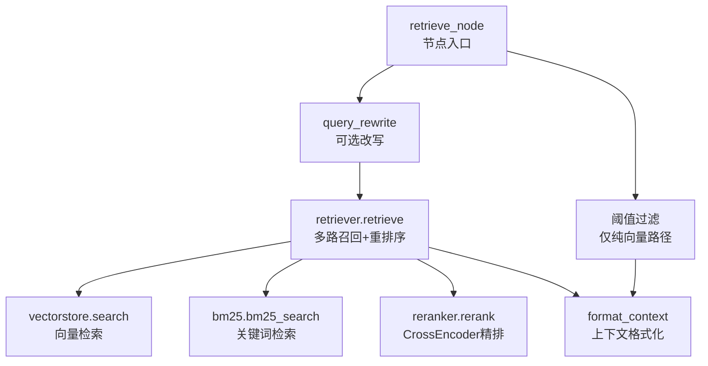
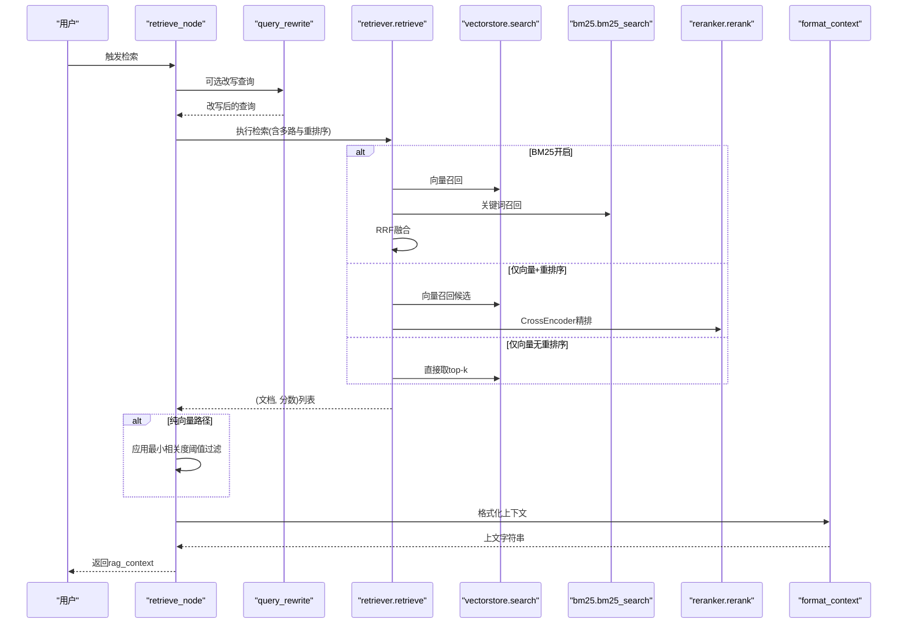
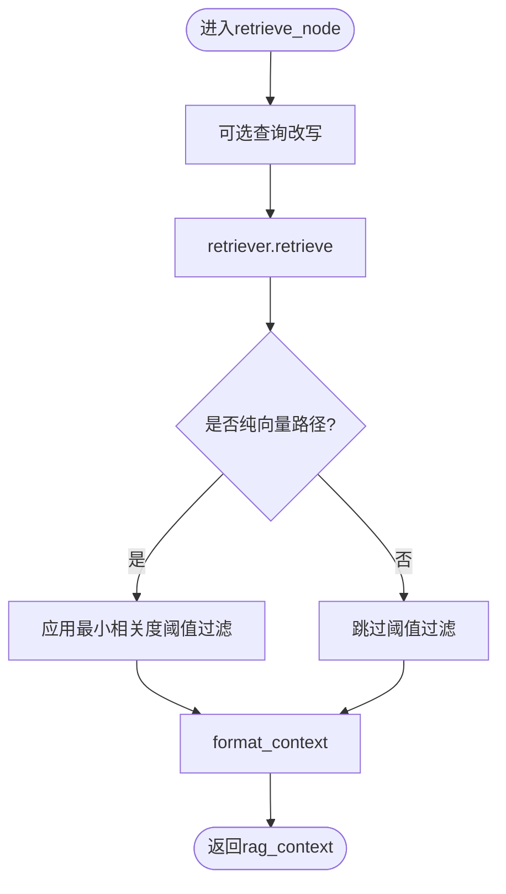
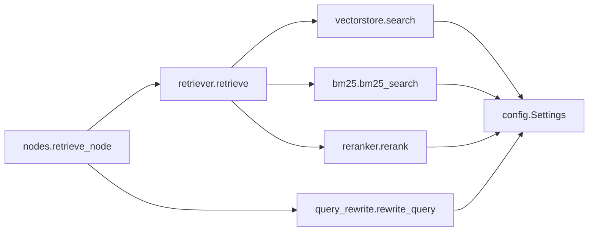

# RAG检索节点

<cite>
**本文引用的文件**
- [agent/nodes.py](file://agent/nodes.py)
- [rag/retriever.py](file://rag/retriever.py)
- [rag/vectorstore.py](file://rag/vectorstore.py)
- [rag/bm25.py](file://rag/bm25.py)
- [rag/reranker.py](file://rag/reranker.py)
- [agent/query_rewrite.py](file://agent/query_rewrite.py)
- [config/settings.py](file://config/settings.py)
- [agent/state.py](file://agent/state.py)
</cite>

## 目录
1. [简介](#简介)
2. [项目结构](#项目结构)
3. [核心组件](#核心组件)
4. [架构总览](#架构总览)
5. [详细组件分析](#详细组件分析)
6. [依赖关系分析](#依赖关系分析)
7. [性能考虑](#性能考虑)
8. [故障排查指南](#故障排查指南)
9. [结论](#结论)
10. [附录：参数与调优示例](#附录参数与调优示例)

## 简介
本技术文档聚焦于RAG检索节点，深入解析 retrieve_node 函数的实现原理与处理流程，覆盖以下关键点：
- 查询改写机制（可选）
- 多路召回策略（向量检索、BM25关键词检索、RRF融合）
- 相关度阈值过滤（仅纯向量路径生效）
- 不同检索路径下的分数语义差异与归一化展示
- 检索参数配置、性能调优选项与错误恢复机制
- 通过具体代码片段路径展示如何调整检索策略和优化效果

## 项目结构
RAG检索由多个模块协作完成：
- 编排与入口：retrieve_node 负责串联查询改写、检索、过滤与格式化
- 检索器：retriever 统一调度多路召回与重排序
- 向量库：vectorstore 封装 Milvus 检索与过滤
- BM25：bm25 提供内存关键词索引与检索
- 重排序：reranker 使用 CrossEncoder 精排候选
- 查询改写：query_rewrite 用LLM将用户问题改写为更利于检索的形式
- 配置：settings 集中管理所有开关与阈值
- 状态：state 定义 LangGraph 工作流中的状态字段

图表来源
- [agent/nodes.py:284-321](file://agent/nodes.py#L284-L321)
- [rag/retriever.py:18-52](file://rag/retriever.py#L18-L52)
- [rag/vectorstore.py:164-184](file://rag/vectorstore.py#L164-L184)
- [rag/bm25.py:69-97](file://rag/bm25.py#L69-L97)
- [rag/reranker.py:54-97](file://rag/reranker.py#L54-L97)
- [rag/retriever.py:113-133](file://rag/retriever.py#L113-L133)

章节来源
- [agent/nodes.py:284-321](file://agent/nodes.py#L284-L321)
- [rag/retriever.py:18-52](file://rag/retriever.py#L18-L52)
- [config/settings.py:83-100](file://config/settings.py#L83-L100)

## 核心组件
- retrieve_node：检索节点入口，负责调用查询改写、检索、阈值过滤与上下文格式化；异常时返回空上下文以保证链路稳定。
- retriever.retrieve：根据配置选择多路召回策略（BM25开启则向量+BM25并行→RRF融合；否则按是否启用重排序决定候选集），最终输出(top-k)结果。
- vectorstore.search：Milvus相似度搜索并应用距离阈值过滤；若过滤后为空则回退原始结果，保证可用性。
- bm25.bm25_search：构建进程内BM25索引，按字符级分词进行关键词检索，返回top-k。
- reranker.rerank：使用CrossEncoder对候选进行精排，失败时回退到原始向量结果。
- query_rewrite.rewrite_query：在开启且查询长度足够时，调用路由小模型改写查询以提升召回率；失败或关闭时回退原始查询。
- settings：集中管理检索开关与阈值，如BM25、重排序、RRF常数、最小相关度等。

章节来源
- [agent/nodes.py:284-321](file://agent/nodes.py#L284-L321)
- [rag/retriever.py:18-52](file://rag/retriever.py#L18-L52)
- [rag/vectorstore.py:164-184](file://rag/vectorstore.py#L164-L184)
- [rag/bm25.py:22-66](file://rag/bm25.py#L22-L66)
- [rag/reranker.py:30-51](file://rag/reranker.py#L30-L51)
- [agent/query_rewrite.py:26-58](file://agent/query_rewrite.py#L26-L58)
- [config/settings.py:83-100](file://config/settings.py#L83-L100)

## 架构总览
retrieve_node 的工作流如下：
1. 读取用户输入与全局配置
2. 可选查询改写（提升召回）
3. 调用 retriever.retrieve 执行多路召回与重排序
4. 仅在“纯向量检索路径”下应用相关度阈值过滤（避免跨分数体系误判）
5. 将结果格式化为上下文字符串供生成节点使用
6. 异常捕获与降级：任何阶段失败均返回空上下文，不阻断主链路

图表来源
- [agent/nodes.py:284-321](file://agent/nodes.py#L284-L321)
- [rag/retriever.py:18-52](file://rag/retriever.py#L18-L52)
- [rag/vectorstore.py:164-184](file://rag/vectorstore.py#L164-L184)
- [rag/bm25.py:69-97](file://rag/bm25.py#L69-L97)
- [rag/reranker.py:54-97](file://rag/reranker.py#L54-L97)
- [rag/retriever.py:113-133](file://rag/retriever.py#L113-L133)

## 详细组件分析

### retrieve_node 函数详解
- 功能：执行RAG检索，按相关度阈值过滤后写入 rag_context
- 流程：
  - 查询改写（可选）：调用 rewrite_query，失败回退原始查询
  - 检索：调用 retriever.retrieve，内部根据配置选择多路召回与重排序
  - 阈值过滤：仅在 rerank_enabled=false 且 rag_bm25_enabled=false 的纯向量路径下生效，使用 1/(1+|score|) 归一化后与 rag_min_relevance 比较
  - 格式化：format_context 将结果转为带来源与相关度的文本块
  - 异常处理：任一阶段异常返回空上下文，确保主链路不中断

图表来源
- [agent/nodes.py:284-321](file://agent/nodes.py#L284-L321)
- [rag/retriever.py:113-133](file://rag/retriever.py#L113-L133)

章节来源
- [agent/nodes.py:284-321](file://agent/nodes.py#L284-L321)

### 查询改写机制
- 触发条件：
  - 配置项 rag_query_rewrite_enabled=true
  - 查询长度≥6（过短缺乏上下文，改写收益低）
- 实现方式：
  - 使用路由小模型（temperature=0.0）执行改写提示，要求保留原意、补全省略主语/指代、去除口语化表达
  - 成功返回改写后的查询；失败或关闭时回退原始查询
- 影响范围：
  - 改写后的查询用于后续检索，有助于提升召回率

章节来源
- [agent/query_rewrite.py:26-58](file://agent/query_rewrite.py#L26-L58)
- [config/settings.py:91-93](file://config/settings.py#L91-L93)

### 多路召回策略
- 三种模式：
  - BM25开启：向量检索 + BM25并行召回 → RRF融合 → 可选重排序 → top-k
  - BM25关闭 + 重排序开启：向量检索召回候选 → CrossEncoder精排 → top-k
  - BM25关闭 + 重排序关闭：直接向量检索 top-k
- RRF融合：
  - 公式 score(d)=Σ(1/(rrf_k+rank))，仅依赖排名而非原始分数，可统一向量距离与BM25分数
  - 内容相同的chunk合并分数，两路都命中的文档得分更高
- 候选数量：
  - 向量候选数由 rerank_candidate_count 控制
  - BM25候选数由 rag_bm25_candidate_count 控制
  - RRF常数 k 由 rag_rrf_k 控制

章节来源
- [rag/retriever.py:18-52](file://rag/retriever.py#L18-L52)
- [rag/retriever.py:55-76](file://rag/retriever.py#L55-L76)
- [rag/retriever.py:78-110](file://rag/retriever.py#L78-L110)
- [rag/bm25.py:69-97](file://rag/bm25.py#L69-L97)
- [config/settings.py:83-89](file://config/settings.py#L83-L89)

### 相关度阈值过滤
- 适用路径：
  - 仅在纯向量检索路径下生效（即 rerank_enabled=false 且 rag_bm25_enabled=false）
  - 原因：rerank/BM25路径已精排或融合，分数语义不同，统一归一化会导致过滤逻辑反转或失效
- 过滤规则：
  - 使用 1/(1+|score|) 将分数归一化到0~1区间（越大越相关）
  - 低于 rag_min_relevance 的文档被丢弃
- 目的：
  - 避免低质上下文注入导致幻觉

章节来源
- [agent/nodes.py:305-317](file://agent/nodes.py#L305-L317)
- [rag/retriever.py:113-133](file://rag/retriever.py#L113-L133)
- [config/settings.py:67-69](file://config/settings.py#L67-L69)

### 不同检索路径下的分数处理差异
- 向量检索：
  - 分数为L2距离（越小越相关）
  - 展示时归一化为 1/(1+|score|)
- BM25：
  - 分数越大越相关
  - 展示时同样归一化为 1/(1+|score|)
- 重排序（CrossEncoder）：
  - 分数越大越相关
  - 展示时同样归一化为 1/(1+|score|)
- format_context 统一归一化以一致展示相关度

章节来源
- [rag/vectorstore.py:164-184](file://rag/vectorstore.py#L164-L184)
- [rag/retriever.py:113-133](file://rag/retriever.py#L113-L133)
- [rag/reranker.py:54-97](file://rag/reranker.py#L54-L97)

### 检索参数配置
- 关键配置项：
  - rag_bm25_enabled：是否开启BM25多路召回
  - rag_bm25_candidate_count：BM25召回候选数
  - rag_rrf_k：RRF融合常数
  - rerank_enabled：是否启用重排序
  - rerank_candidate_count：向量召回候选数
  - rerank_top_k：重排序后返回top-k
  - rag_top_k：默认top-k（无重排序时）
  - rag_min_relevance：最小相关度阈值（仅纯向量路径）
  - rag_query_rewrite_enabled：是否启用查询改写
- 其他相关：
  - milvus_metric_type：距离度量类型（L2）
  - rag_score_filter：向量检索距离阈值（底层过滤）

章节来源
- [config/settings.py:64-100](file://config/settings.py#L64-L100)
- [rag/vectorstore.py:164-184](file://rag/vectorstore.py#L164-L184)

### 错误恢复机制
- 查询改写失败：回退原始查询
- 检索失败：返回空上下文
- 重排序失败：回退到原始向量结果
- 向量检索过滤后为空：回退原始结果
- 整体异常捕获：retrieve_node 中 try/except 捕获异常并返回空上下文，确保主链路不中断

章节来源
- [agent/query_rewrite.py:45-58](file://agent/query_rewrite.py#L45-L58)
- [rag/retriever.py:40-52](file://rag/retriever.py#L40-L52)
- [rag/reranker.py:95-97](file://rag/reranker.py#L95-L97)
- [rag/vectorstore.py:178-184](file://rag/vectorstore.py#L178-L184)
- [agent/nodes.py:318-321](file://agent/nodes.py#L318-L321)

## 依赖关系分析
retrieve_node 与各模块的依赖关系如下：
- 依赖 query_rewrite 进行可选查询改写
- 依赖 retriever 进行多路召回与重排序
- retriever 依赖 vectorstore、bm25、reranker
- vectorstore 依赖 Milvus 向量库与配置
- bm25 依赖 rank_bm25 库与向量库数据
- reranker 依赖 CrossEncoder 模型
- 所有模块共享 config.settings 配置

图表来源
- [agent/nodes.py:284-321](file://agent/nodes.py#L284-L321)
- [rag/retriever.py:18-52](file://rag/retriever.py#L18-L52)
- [rag/vectorstore.py:164-184](file://rag/vectorstore.py#L164-L184)
- [rag/bm25.py:69-97](file://rag/bm25.py#L69-L97)
- [rag/reranker.py:54-97](file://rag/reranker.py#L54-L97)
- [config/settings.py:64-100](file://config/settings.py#L64-L100)

章节来源
- [agent/nodes.py:284-321](file://agent/nodes.py#L284-L321)
- [rag/retriever.py:18-52](file://rag/retriever.py#L18-L52)

## 性能考虑
- 延迟优化：
  - 查询改写仅在开启且查询长度足够时执行，减少不必要的LLM调用
  - BM25索引为进程内单例，首次构建后复用，避免重复开销
  - 重排序模型延迟初始化，仅在需要时加载
- 吞吐优化：
  - 多路召回并行执行（向量与BM25），提高召回覆盖率
  - RRF融合仅依赖排名，避免复杂分数归一化计算
- 资源占用：
  - CrossEncoder模型较大，需权衡精度与资源消耗
  - BM25索引占用内存，需评估知识库规模
- 稳定性：
  - 各模块均有异常捕获与降级策略，确保主链路稳定

[本节为通用性能讨论，不直接分析具体文件]

## 故障排查指南
- 检索结果为空：
  - 检查向量库是否有数据（vectorstore.count_documents）
  - 检查BM25索引是否构建成功（bm25.get_bm25_index）
  - 检查重排序模型是否加载成功（reranker.get_reranker）
- 检索速度慢：
  - 降低 rerank_candidate_count 或 rerank_top_k
  - 关闭BM25或重排序以测试性能基线
  - 检查网络与模型下载速度（HF_ENDPOINT镜像）
- 相关度过滤过于严格：
  - 调整 rag_min_relevance（纯向量路径）
  - 检查向量距离阈值 rag_score_filter
- 查询改写无效：
  - 检查 rag_query_rewrite_enabled 是否开启
  - 检查查询长度是否≥6
  - 查看日志确认改写是否成功

章节来源
- [rag/vectorstore.py:193-205](file://rag/vectorstore.py#L193-L205)
- [rag/bm25.py:22-66](file://rag/bm25.py#L22-L66)
- [rag/reranker.py:30-51](file://rag/reranker.py#L30-L51)
- [agent/query_rewrite.py:35-58](file://agent/query_rewrite.py#L35-L58)
- [config/settings.py:64-100](file://config/settings.py#L64-L100)

## 结论
retrieve_node 作为RAG检索的核心入口，通过灵活的查询改写、多路召回与重排序策略，结合严格的阈值过滤与完善的错误恢复机制，实现了高召回率与高可用性的检索服务。通过合理配置各项参数，可在不同场景下平衡精度、延迟与资源消耗，满足多样化的知识检索需求。

[本节为总结性内容，不直接分析具体文件]

## 附录：参数与调优示例
以下为具体代码片段路径，展示如何调整检索策略与优化效果：

- 启用查询改写：
  - 设置 rag_query_rewrite_enabled=true
  - 参考路径：[agent/query_rewrite.py:35-58](file://agent/query_rewrite.py#L35-L58)
- 开启BM25多路召回：
  - 设置 rag_bm25_enabled=true，调整 rag_bm25_candidate_count 与 rag_rrf_k
  - 参考路径：[rag/retriever.py:30-76](file://rag/retriever.py#L30-L76)
- 启用重排序：
  - 设置 rerank_enabled=true，调整 rerank_candidate_count 与 rerank_top_k
  - 参考路径：[rag/retriever.py:33-48](file://rag/retriever.py#L33-L48)
- 调整相关度阈值（纯向量路径）：
  - 调整 rag_min_relevance
  - 参考路径：[agent/nodes.py:305-317](file://agent/nodes.py#L305-L317)
- 调整向量检索距离阈值：
  - 调整 rag_score_filter
  - 参考路径：[rag/vectorstore.py:178-184](file://rag/vectorstore.py#L178-L184)

章节来源
- [agent/query_rewrite.py:35-58](file://agent/query_rewrite.py#L35-L58)
- [rag/retriever.py:30-76](file://rag/retriever.py#L30-L76)
- [agent/nodes.py:305-317](file://agent/nodes.py#L305-L317)
- [rag/vectorstore.py:178-184](file://rag/vectorstore.py#L178-L184)
- [config/settings.py:83-100](file://config/settings.py#L83-L100)