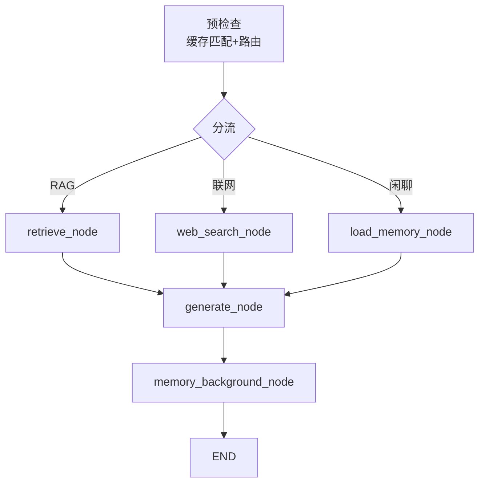
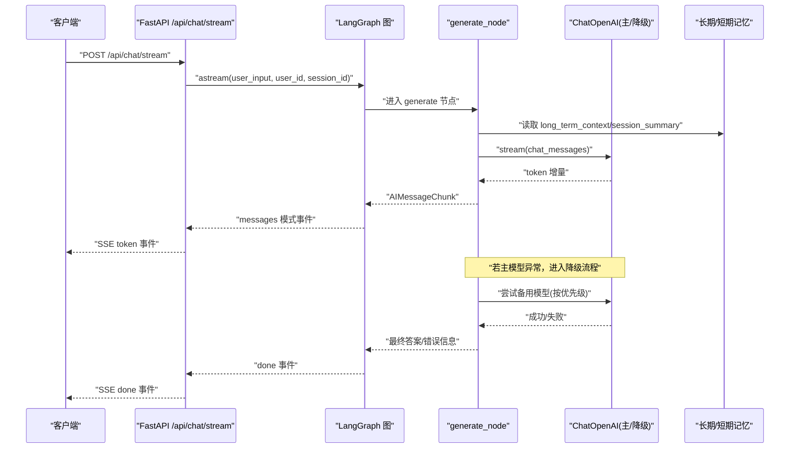
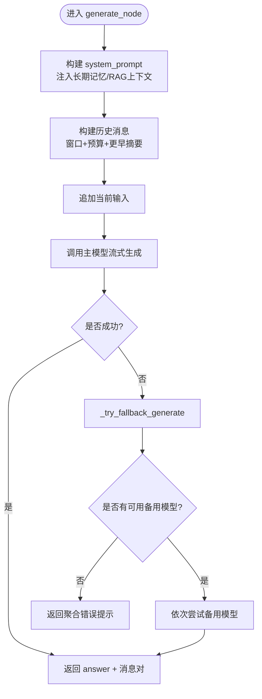
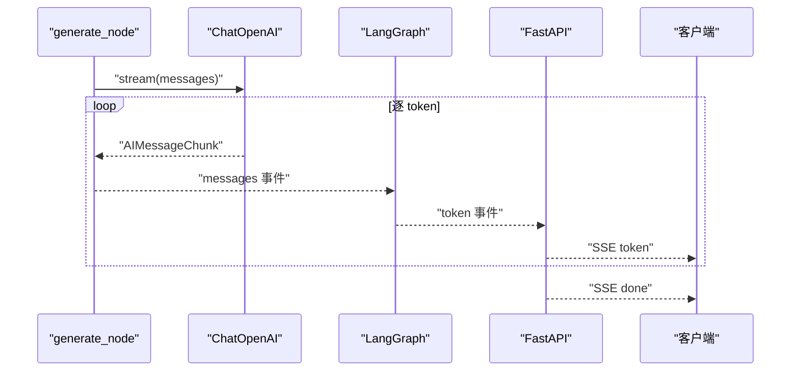
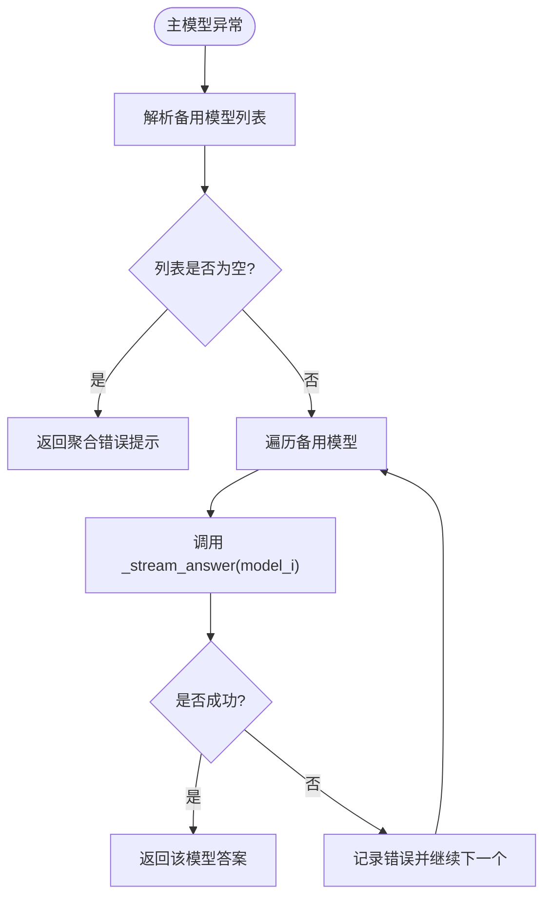
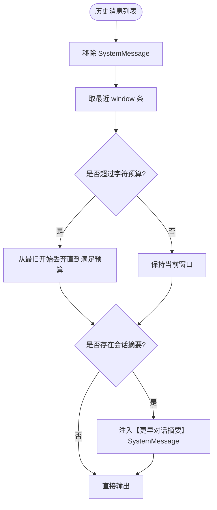
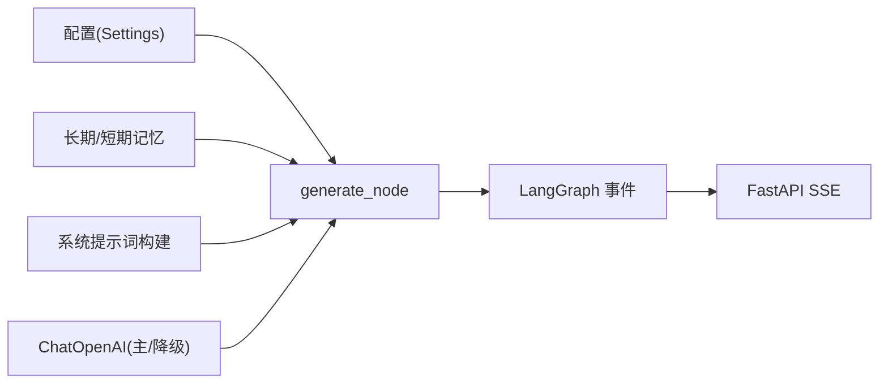

# 回答生成节点

<cite>
**本文引用的文件**
- [agent/nodes.py](file://agent/nodes.py)
- [agent/graph.py](file://agent/graph.py)
- [agent/state.py](file://agent/state.py)
- [config/settings.py](file://config/settings.py)
- [main.py](file://main.py)
- [memory/long_term.py](file://memory/long_term.py)
</cite>

## 目录
1. [简介](#简介)
2. [项目结构](#项目结构)
3. [核心组件](#核心组件)
4. [架构总览](#架构总览)
5. [详细组件分析](#详细组件分析)
6. [依赖关系分析](#依赖关系分析)
7. [性能考量](#性能考量)
8. [故障排查指南](#故障排查指南)
9. [结论](#结论)
10. [附录](#附录)

## 简介
本文件聚焦“回答生成节点”的技术实现，围绕 generate_node 函数展开，系统说明以下关键能力：
- Prompt 构建策略：如何组合系统提示词、长期记忆上下文、RAG/联网搜索结果与历史消息。
- 流式响应处理：从 LLM 流式 token 到 Web SSE 的端到端透传机制。
- 模型降级机制：主模型失败时按配置依次尝试备用模型，并汇总错误信息。
- 历史消息管理：窗口与字符预算控制、更早对话摘要注入，避免上下文硬丢失。
- 系统提示词模板、上下文窗口控制、错误恢复策略。
- 自定义 Prompt 模板与优化生成质量的实践建议（以代码路径引用为主）。

## 项目结构
回答生成节点位于智能体工作流的汇聚点，上游可能来自知识库检索、联网搜索或长期记忆加载；下游进入后台记忆更新后结束。整体由 LangGraph 状态图编排，generate_node 负责组装消息并调用大模型生成。

图表来源
- [agent/graph.py:44-102](file://agent/graph.py#L44-L102)
- [agent/nodes.py:284-360](file://agent/nodes.py#L284-L360)
- [agent/nodes.py:499-532](file://agent/nodes.py#L499-L532)

章节来源
- [agent/graph.py:1-102](file://agent/graph.py#L1-L102)
- [agent/nodes.py:92-158](file://agent/nodes.py#L92-L158)

## 核心组件
- generate_node：组装 system prompt、历史消息与当前输入，调用主模型流式生成；失败则触发降级流程。
- _stream_answer：统一封装 LLM 流式输出，逐 token 累加完整文本，供主/降级模型复用。
- _try_fallback_generate：按优先级尝试备用模型列表，全部失败返回汇总错误。
- build_chat_history：基于窗口与字符预算裁剪历史消息，并在超窗时注入会话压缩摘要。
- 配置项：temperature、重试次数、超时、短期历史窗口与预算、RAG/联网开关等。

章节来源
- [agent/nodes.py:453-532](file://agent/nodes.py#L453-L532)
- [config/settings.py:29-49](file://config/settings.py#L29-L49)
- [config/settings.py:114-133](file://config/settings.py#L114-L133)

## 架构总览
下图展示一次请求从入口到生成的关键路径，包括流式事件透传与降级流程。

图表来源
- [main.py:228-314](file://main.py#L228-L314)
- [agent/graph.py:208-255](file://agent/graph.py#L208-L255)
- [agent/nodes.py:499-532](file://agent/nodes.py#L499-L532)
- [config/settings.py:29-49](file://config/settings.py#L29-L49)

## 详细组件分析

### 生成节点（generate_node）
- 职责：组装 system prompt、历史消息与当前用户输入，调用主模型流式生成；异常时自动降级。
- Prompt 构建：
  - 系统提示词通过外部模块构建，注入长期记忆上下文与 RAG/联网结果。
  - 历史消息经窗口与预算裁剪，必要时注入“更早对话摘要”。
  - 当前输入追加为 HumanMessage。
- 流式生成：使用统一的流式封装，保证主/降级模型行为一致。
- 降级策略：主模型异常时，按配置顺序尝试备用模型；全部失败返回聚合错误提示。
- 返回值：answer 与本轮消息对，用于后续记忆更新与多轮上下文累积。

图表来源
- [agent/nodes.py:499-532](file://agent/nodes.py#L499-L532)
- [agent/nodes.py:467-496](file://agent/nodes.py#L467-L496)

章节来源
- [agent/nodes.py:499-532](file://agent/nodes.py#L499-L532)

### 流式响应处理（_stream_answer 与 SSE 透传）
- 流式封装：_stream_answer 使用 LLM stream 逐 token 累加完整文本，兼容不同返回类型。
- 事件过滤：graph.stream/astream 同时产出 updates（节点进度）与 messages（token 增量），仅透传 generate 节点的 AIMessageChunk，避免内部路由/抽取等 LLM 调用污染前端。
- SSE 接口：main.py 中 /api/chat/stream 将 token 事件以 SSE 形式推送，支持整体超时保护与熔断记录。

图表来源
- [agent/nodes.py:453-464](file://agent/nodes.py#L453-L464)
- [agent/graph.py:141-255](file://agent/graph.py#L141-L255)
- [main.py:228-314](file://main.py#L228-L314)

章节来源
- [agent/nodes.py:453-464](file://agent/nodes.py#L453-L464)
- [agent/graph.py:141-255](file://agent/graph.py#L141-L255)
- [main.py:228-314](file://main.py#L228-L314)

### 模型降级机制（_try_fallback_generate）
- 降级源：主模型抛出异常时触发。
- 降级目标：优先使用 llm_fallback_models（逗号分隔，按优先级），否则回退到 llm_fallback_model。
- 执行方式：逐个备用模型调用 _stream_answer，成功即返回；全部失败返回包含各模型错误的汇总提示。
- 可观测性：打印每次尝试与失败原因，便于定位问题。

图表来源
- [agent/nodes.py:467-496](file://agent/nodes.py#L467-L496)
- [config/settings.py:42-46](file://config/settings.py#L42-L46)

章节来源
- [agent/nodes.py:467-496](file://agent/nodes.py#L467-L496)
- [config/settings.py:42-46](file://config/settings.py#L42-L46)

### 历史消息管理（build_chat_history）
- 窗口控制：仅保留最近 N 条消息（memory_short_window）。
- 预算控制：当窗口内仍超过 memory_history_budget 字符数时，从最旧消息开始丢弃。
- 更早对话摘要：当有超出窗口的历史且存在会话摘要时，以 SystemMessage 注入“更早对话摘要”，避免上下文硬丢失。
- 适用场景：长对话保持连贯性与可控的上下文长度。

图表来源
- [agent/nodes.py:427-450](file://agent/nodes.py#L427-L450)
- [memory/long_term.py:602-628](file://memory/long_term.py#L602-L628)

章节来源
- [agent/nodes.py:427-450](file://agent/nodes.py#L427-L450)
- [memory/long_term.py:602-628](file://memory/long_term.py#L602-L628)

### Prompt 构建策略与系统提示词模板
- 系统提示词：由外部模块提供，接收 long_term_context 与 rag_context，用于在生成阶段注入长期记忆与检索/联网结果。
- 历史消息：通过 build_chat_history 构造，确保上下文窗口与预算可控。
- 当前输入：作为 HumanMessage 追加至消息末尾。
- 自定义模板建议：
  - 调整系统提示词以强化角色设定、约束输出格式、强调依据上下文回答。
  - 结合 RAG 上下文增加“引用来源”要求，提升可追溯性。
  - 针对工具调用场景，明确参数校验与错误提示规范。
  - 参考路径：系统提示词构建入口与调用位置见下方引用。

章节来源
- [agent/nodes.py:509-522](file://agent/nodes.py#L509-L522)
- [agent/nodes.py:427-450](file://agent/nodes.py#L427-L450)

### 上下文窗口控制与配置
- 短期历史窗口：memory_short_window（默认 8 条）。
- 历史字符预算：memory_history_budget（默认 2000 字符）。
- RAG/联网上下文字符预算：rag_context_budget（默认 2500 字符）。
- 相关配置均来源于全局 Settings，可按需调优。

章节来源
- [config/settings.py:114-133](file://config/settings.py#L114-L133)
- [agent/nodes.py:514-522](file://agent/nodes.py#L514-L522)

### 错误恢复策略
- 路由阶段：LLM 路由失败时回退关键词判断，保障链路不中断。
- 检索/搜索：检索失败或无结果时降级为空上下文，不影响生成。
- 生成阶段：主模型异常触发降级流程；全部失败返回聚合错误提示。
- 流式接口：整体超时保护，已生成内容仍可返回；异常记录并触发熔断。

章节来源
- [agent/nodes.py:180-211](file://agent/nodes.py#L180-L211)
- [agent/nodes.py:284-341](file://agent/nodes.py#L284-L341)
- [agent/nodes.py:467-496](file://agent/nodes.py#L467-L496)
- [main.py:262-304](file://main.py#L262-L304)

## 依赖关系分析
- generate_node 依赖：
  - 配置：Settings（温度、重试、超时、窗口、预算等）。
  - 记忆：长期记忆上下文与会话摘要。
  - 提示词：系统提示词构建函数。
  - LLM：ChatOpenAI（主/降级）。
- 流式链路依赖：
  - LangGraph 的 stream/astream 双模式事件。
  - FastAPI SSE 接口与超时保护。

图表来源
- [agent/nodes.py:499-532](file://agent/nodes.py#L499-L532)
- [config/settings.py:29-49](file://config/settings.py#L29-L49)
- [agent/graph.py:141-255](file://agent/graph.py#L141-L255)
- [main.py:228-314](file://main.py#L228-L314)

章节来源
- [agent/nodes.py:499-532](file://agent/nodes.py#L499-L532)
- [config/settings.py:29-49](file://config/settings.py#L29-L49)
- [agent/graph.py:141-255](file://agent/graph.py#L141-L255)
- [main.py:228-314](file://main.py#L228-L314)

## 性能考量
- 首请求延迟优化：启动时预热 LLM 连接（TLS/DNS/连接池），降低首次请求耗时。
- 流式传输：逐 token 输出，提升用户体验与感知速度。
- 上下文裁剪：窗口与预算控制减少无效上下文，降低 Token 成本与延迟。
- 降级策略：快速回退到小模型，提高可用性。
- 检索/搜索失败降级：空上下文不阻断生成，保障服务稳定性。

章节来源
- [main.py:45-77](file://main.py#L45-L77)
- [agent/nodes.py:453-464](file://agent/nodes.py#L453-L464)
- [agent/nodes.py:467-496](file://agent/nodes.py#L467-L496)

## 故障排查指南
- 路由失败：查看日志中的“route LLM 路由失败”，确认关键词兜底是否生效。
- 检索失败：检查 retrieve/web_search 异常日志，确认 RAG/联网开关与阈值配置。
- 生成失败：关注“主模型生成失败”与备用模型尝试日志，核对模型名、密钥与网络连通性。
- 流式超时：检查 stream_timeout 设置与 SSE 事件是否收到 done；部分生成情况下视为成功。
- 熔断/限流：确认 rate_limit_per_minute 与 circuit_breaker_threshold 配置，避免误拦截。

章节来源
- [agent/nodes.py:180-211](file://agent/nodes.py#L180-L211)
- [agent/nodes.py:284-341](file://agent/nodes.py#L284-L341)
- [agent/nodes.py:467-496](file://agent/nodes.py#L467-L496)
- [main.py:262-304](file://main.py#L262-L304)

## 结论
generate_node 作为回答生成的核心节点，具备完善的 Prompt 构建、流式响应、模型降级与历史消息管理能力。通过合理的窗口与预算控制、稳健的错误恢复策略以及可配置的降级模型列表，系统在可用性与性能之间取得良好平衡。结合系统提示词模板的定制与上下文优化，可进一步提升生成质量与用户体验。

## 附录
- 自定义 Prompt 模板建议：
  - 在系统提示词中明确角色、任务边界与输出格式约束。
  - 结合 RAG 上下文要求“严格依据上下文回答”，减少幻觉。
  - 对工具调用场景增加参数校验与错误提示规范。
  - 参考路径：系统提示词构建与调用位置见下方引用。
- 优化生成质量实践：
  - 调整 temperature 与重试次数，平衡创造性与稳定性。
  - 合理设置 memory_short_window 与 memory_history_budget，控制上下文长度。
  - 启用/关闭 rerank/BM25 与 web_search，根据场景选择最佳召回策略。
  - 参考路径：配置项与节点逻辑见下方引用。

章节来源
- [agent/nodes.py:509-522](file://agent/nodes.py#L509-L522)
- [config/settings.py:29-49](file://config/settings.py#L29-L49)
- [config/settings.py:114-133](file://config/settings.py#L114-L133)