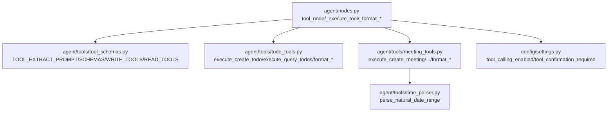
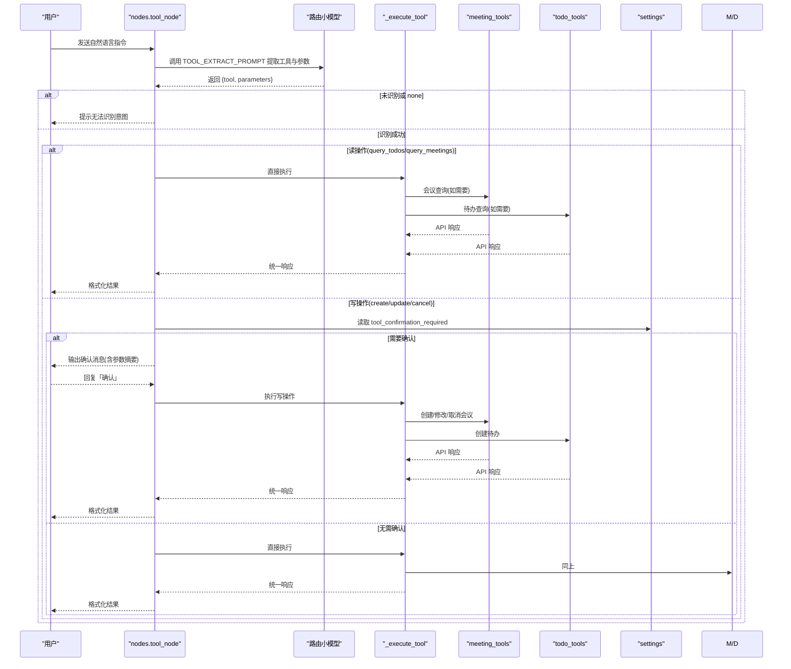
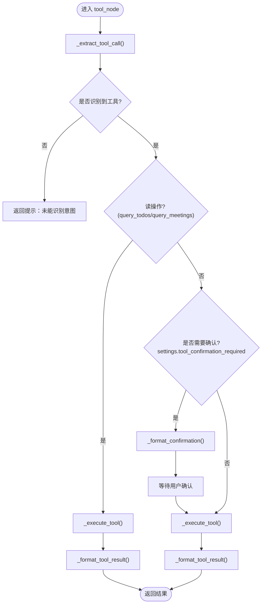
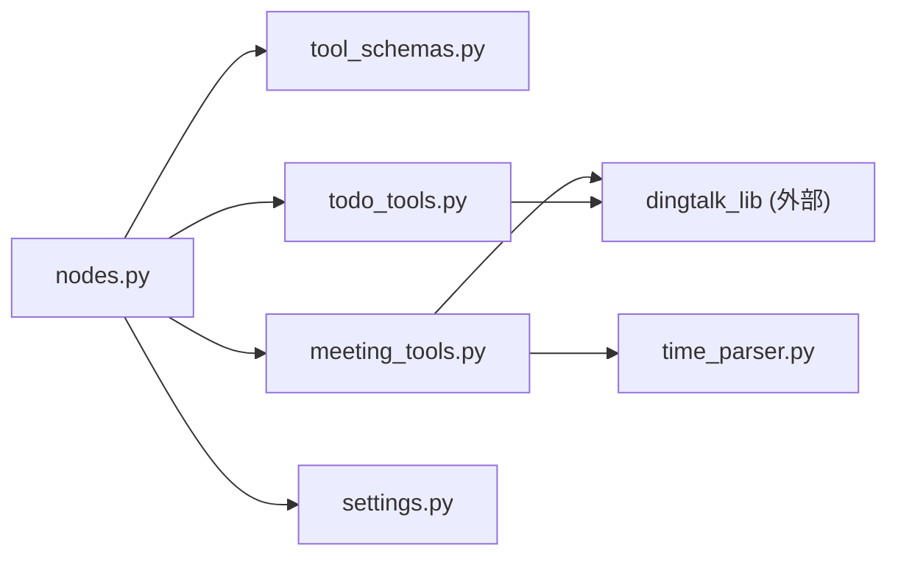
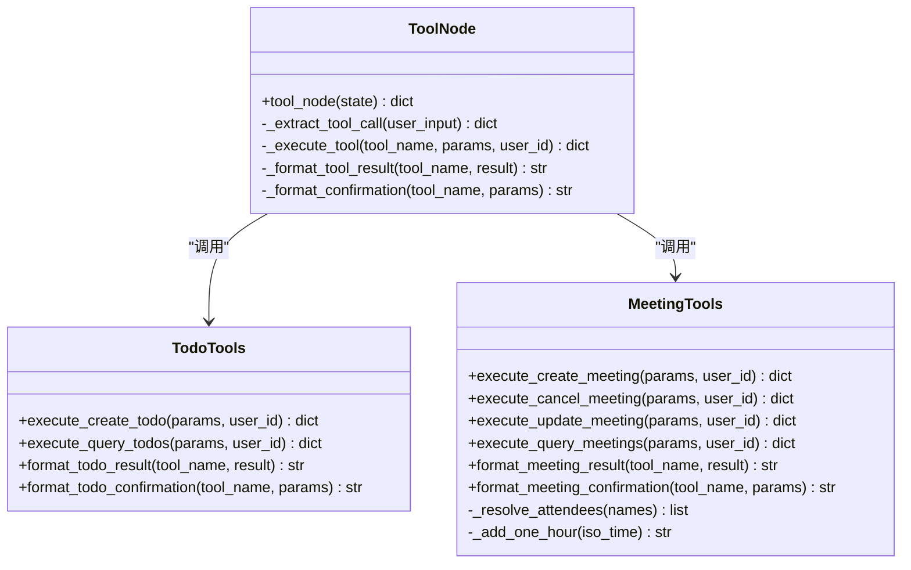

# 工具调用节点

<cite>
**本文引用的文件**
- [agent/nodes.py](file://agent/nodes.py)
- [agent/tools/tool_schemas.py](file://agent/tools/tool_schemas.py)
- [agent/tools/todo_tools.py](file://agent/tools/todo_tools.py)
- [agent/tools/meeting_tools.py](file://agent/tools/meeting_tools.py)
- [agent/tools/time_parser.py](file://agent/tools/time_parser.py)
- [config/settings.py](file://config/settings.py)
</cite>

## 目录
1. [简介](#简介)
2. [项目结构](#项目结构)
3. [核心组件](#核心组件)
4. [架构总览](#架构总览)
5. [详细组件分析](#详细组件分析)
6. [依赖关系分析](#依赖关系分析)
7. [性能考量](#性能考量)
8. [故障排查指南](#故障排查指南)
9. [结论](#结论)
10. [附录：扩展与示例](#附录：扩展与示例)

## 简介
本技术文档聚焦“工具调用节点”的实现机制，围绕 tool_node 函数展开，系统性解析以下关键点：
- 工具参数提取：通过路由小模型从自然语言中抽取工具名与参数
- 操作确认流程：写操作的二次确认机制（可配置）
- 工具执行分发：按工具名分发到具体执行器
- 结果格式化：将 API 响应转换为可读文本
- 工具注册机制：Schema 定义、路由开关与分类集合
- 权限控制策略：基于配置的写操作确认与功能开关
- 错误处理模式：异常捕获、降级与友好提示

该节点是智能体工作流中的关键分支，负责将用户意图转化为对钉钉待办/会议等外部能力的可靠调用。

## 项目结构
工具调用相关代码主要分布在 agent 与 agent/tools 目录下，配合 config/settings.py 提供全局开关与行为控制。

图表来源
- [agent/nodes.py:646-780](file://agent/nodes.py#L646-L780)
- [agent/tools/tool_schemas.py:1-121](file://agent/tools/tool_schemas.py#L1-L121)
- [agent/tools/todo_tools.py:1-84](file://agent/tools/todo_tools.py#L1-L84)
- [agent/tools/meeting_tools.py:1-225](file://agent/tools/meeting_tools.py#L1-L225)
- [agent/tools/time_parser.py:1-120](file://agent/tools/time_parser.py#L1-L120)
- [config/settings.py:151-156](file://config/settings.py#L151-L156)

章节来源
- [agent/nodes.py:646-780](file://agent/nodes.py#L646-L780)
- [agent/tools/tool_schemas.py:1-121](file://agent/tools/tool_schemas.py#L1-L121)
- [agent/tools/todo_tools.py:1-84](file://agent/tools/todo_tools.py#L1-L84)
- [agent/tools/meeting_tools.py:1-225](file://agent/tools/meeting_tools.py#L1-L225)
- [agent/tools/time_parser.py:1-120](file://agent/tools/time_parser.py#L1-L120)
- [config/settings.py:151-156](file://config/settings.py#L151-L156)

## 核心组件
- tool_node：工具调用入口，负责参数提取、确认、执行与格式化
- _extract_tool_call：使用路由小模型从用户输入中提取工具名与参数
- _execute_tool：根据工具名分发到具体执行器（待办/会议）
- _format_tool_result：将执行结果格式化为人类可读文本
- _format_confirmation：生成写操作的确认消息
- tool_schemas：工具 Schema、提取 Prompt、读写工具分类集合
- todo_tools / meeting_tools：具体工具执行与结果/确认格式化
- time_parser：自然语言时间解析，辅助会议查询等场景
- settings：工具调用开关与确认策略配置

章节来源
- [agent/nodes.py:646-780](file://agent/nodes.py#L646-L780)
- [agent/tools/tool_schemas.py:1-121](file://agent/tools/tool_schemas.py#L1-L121)
- [agent/tools/todo_tools.py:1-84](file://agent/tools/todo_tools.py#L1-L84)
- [agent/tools/meeting_tools.py:1-225](file://agent/tools/meeting_tools.py#L1-L225)
- [agent/tools/time_parser.py:1-120](file://agent/tools/time_parser.py#L1-L120)
- [config/settings.py:151-156](file://config/settings.py#L151-L156)

## 架构总览
工具调用节点在整体工作流中作为“tool”路由的终点，承接预检查与路由判断后的请求，完成意图识别、参数抽取、确认、执行与返回。

图表来源
- [agent/nodes.py:646-780](file://agent/nodes.py#L646-L780)
- [agent/tools/tool_schemas.py:1-121](file://agent/tools/tool_schemas.py#L1-L121)
- [agent/tools/todo_tools.py:1-84](file://agent/tools/todo_tools.py#L1-L84)
- [agent/tools/meeting_tools.py:1-225](file://agent/tools/meeting_tools.py#L1-L225)
- [config/settings.py:151-156](file://config/settings.py#L151-L156)

## 详细组件分析

### tool_node：工具调用主流程
- 职责：协调参数提取、确认、执行与格式化；支持读操作直出与写操作确认
- 关键路径：
  - 参数提取：_extract_tool_call
  - 读操作直出：query_todos、query_meetings
  - 写操作确认：依据 settings.tool_confirmation_required
  - 执行分发：_execute_tool
  - 结果格式化：_format_tool_result
- 状态流转：
  - 若 pending_confirmation 存在且用户确认，则直接执行并返回结果
  - 否则进入正常流程：提取→确认→执行→格式化

图表来源
- [agent/nodes.py:646-780](file://agent/nodes.py#L646-L780)
- [config/settings.py:151-156](file://config/settings.py#L151-L156)

章节来源
- [agent/nodes.py:646-780](file://agent/nodes.py#L646-L780)
- [config/settings.py:151-156](file://config/settings.py#L151-L156)

### 参数提取：_extract_tool_call
- 使用路由小模型与 TOOL_EXTRACT_PROMPT 进行结构化抽取
- 输出 JSON 包含 tool 与 parameters；失败时回退为 {"tool": "none"}
- 异常捕获：LLM 调用失败不影响主链路，返回 none

章节来源
- [agent/nodes.py:693-710](file://agent/nodes.py#L693-L710)
- [agent/tools/tool_schemas.py:7-26](file://agent/tools/tool_schemas.py#L7-L26)

### 执行分发：_execute_tool
- 根据 tool_name 动态导入并调用对应执行器：
  - 待办：create_todo、query_todos
  - 会议：create_meeting、cancel_meeting、update_meeting、query_meetings
- 未知工具返回统一错误码与消息
- 异常捕获：统一包装为 errcode=-1 与 errmsg

章节来源
- [agent/nodes.py:712-747](file://agent/nodes.py#L712-L747)
- [agent/tools/todo_tools.py:18-45](file://agent/tools/todo_tools.py#L18-L45)
- [agent/tools/meeting_tools.py:17-129](file://agent/tools/meeting_tools.py#L17-L129)

### 结果格式化：_format_tool_result
- 统一检查 errcode，非零则返回失败信息
- 按工具类别调用对应 format_*：
  - 待办：format_todo_result
  - 会议：format_meeting_result
- 兜底返回通用完成提示

章节来源
- [agent/nodes.py:749-765](file://agent/nodes.py#L749-L765)
- [agent/tools/todo_tools.py:47-69](file://agent/tools/todo_tools.py#L47-L69)
- [agent/tools/meeting_tools.py:131-159](file://agent/tools/meeting_tools.py#L131-L159)

### 确认消息：_format_confirmation
- 针对写操作生成清晰的操作摘要，引导用户确认
- 待办与会议分别有专门的确认模板，展示关键参数
- 兜底返回通用确认提示

章节来源
- [agent/nodes.py:767-780](file://agent/nodes.py#L767-L780)
- [agent/tools/todo_tools.py:72-84](file://agent/tools/todo_tools.py#L72-L84)
- [agent/tools/meeting_tools.py:162-183](file://agent/tools/meeting_tools.py#L162-L183)

### 工具注册机制与分类
- 工具 Schema：tool_schemas.py 中定义各工具的 name、description、parameters
- 提取 Prompt：TOOL_EXTRACT_PROMPT 指导 LLM 输出结构化 JSON
- 读写分类：WRITE_TOOLS 与 READ_TOOLS 用于区分是否需要确认
- 注意：当前执行分发采用显式 if/elif 列表，新增工具需同步更新分发逻辑

章节来源
- [agent/tools/tool_schemas.py:29-121](file://agent/tools/tool_schemas.py#L29-L121)
- [agent/nodes.py:712-747](file://agent/nodes.py#L712-L747)

### 权限控制策略
- 工具调用总开关：settings.tool_calling_enabled
  - 关闭时，路由阶段不会进入 tool 分支
- 写操作确认：settings.tool_confirmation_required
  - 开启后，所有写操作需用户明确确认才执行
- 这些开关在 nodes.py 的路由与 tool_node 中多处读取，确保一致行为

章节来源
- [config/settings.py:151-156](file://config/settings.py#L151-L156)
- [agent/nodes.py:161-211](file://agent/nodes.py#L161-L211)
- [agent/nodes.py:678-690](file://agent/nodes.py#L678-L690)

### 错误处理模式
- 参数提取失败：返回 {"tool": "none"}，tool_node 给出友好提示
- 执行失败：_execute_tool 捕获异常并返回统一错误结构
- 结果格式化：统一检查 errcode，非零即返回失败信息
- 会议工具内部：无 ID 时尝试按标题匹配，失败返回明确错误
- 参会人解析：手机号/姓名解析失败保留原值，避免阻断

章节来源
- [agent/nodes.py:693-710](file://agent/nodes.py#L693-L710)
- [agent/nodes.py:712-747](file://agent/nodes.py#L712-L747)
- [agent/tools/meeting_tools.py:50-113](file://agent/tools/meeting_tools.py#L50-L113)
- [agent/tools/meeting_tools.py:185-213](file://agent/tools/meeting_tools.py#L185-L213)

## 依赖关系分析
- nodes.py 依赖 tool_schemas（Prompt 与分类）、todo_tools、meeting_tools、time_parser、settings
- meeting_tools 依赖 dingtalk_lib（通过 sys.path 注入），并使用 time_parser 解析日期范围
- todo_tools 依赖 dingtalk_lib 进行待办操作
- 配置项集中在 settings.py，影响路由、确认与功能开关

图表来源
- [agent/nodes.py:646-780](file://agent/nodes.py#L646-L780)
- [agent/tools/meeting_tools.py:1-225](file://agent/tools/meeting_tools.py#L1-L225)
- [agent/tools/todo_tools.py:1-84](file://agent/tools/todo_tools.py#L1-L84)
- [agent/tools/time_parser.py:1-120](file://agent/tools/time_parser.py#L1-L120)
- [config/settings.py:151-156](file://config/settings.py#L151-L156)

章节来源
- [agent/nodes.py:646-780](file://agent/nodes.py#L646-L780)
- [agent/tools/meeting_tools.py:1-225](file://agent/tools/meeting_tools.py#L1-L225)
- [agent/tools/todo_tools.py:1-84](file://agent/tools/todo_tools.py#L1-L84)
- [agent/tools/time_parser.py:1-120](file://agent/tools/time_parser.py#L1-L120)
- [config/settings.py:151-156](file://config/settings.py#L151-L156)

## 性能考量
- 路由阶段优先关键词短路，减少 LLM 调用次数
- 工具参数提取使用轻量路由模型，降低延迟与成本
- 会议查询默认“本周”，避免大范围检索带来的开销
- 参会人解析失败不阻断，提升鲁棒性
- 写操作确认机制避免误操作导致的无效调用

[本节为通用性能讨论，不直接分析具体文件]

## 故障排查指南
- 无法识别工具：检查 TOOL_EXTRACT_PROMPT 与用户表达是否清晰；查看 _extract_tool_call 日志
- 工具执行失败：查看 _execute_tool 异常日志与返回的 errcode/msg；确认 dingtalk_lib 可用
- 会议取消/修改失败：确认 meeting_id 是否存在；若无 ID，检查标题匹配逻辑与时间范围
- 参会人解析失败：检查手机号格式与通讯录查询结果；必要时手动修正
- 工具调用未生效：确认 settings.tool_calling_enabled 已开启；确认路由阶段未被降级

章节来源
- [agent/nodes.py:693-710](file://agent/nodes.py#L693-L710)
- [agent/nodes.py:712-747](file://agent/nodes.py#L712-L747)
- [agent/tools/meeting_tools.py:50-113](file://agent/tools/meeting_tools.py#L50-L113)
- [agent/tools/meeting_tools.py:185-213](file://agent/tools/meeting_tools.py#L185-L213)
- [config/settings.py:151-156](file://config/settings.py#L151-L156)

## 结论
工具调用节点以清晰的流程实现了从自然语言到外部能力调用的闭环：参数提取、确认、执行与格式化各司其职，并通过配置实现灵活的权限控制与功能开关。结合 Schema 与分类集合，系统具备良好的可扩展性与可维护性。建议在新增工具时遵循现有模式，完善 Schema、分发与格式化逻辑，并确保错误处理与确认机制的一致性。

[本节为总结性内容，不直接分析具体文件]

## 附录：扩展与示例

### 如何添加新工具（步骤）
- 定义工具 Schema：在 tool_schemas.py 中添加 name、description、parameters，并更新 WRITE_TOOLS/READ_TOOLS 分类
- 编写执行器：在 tools 目录下新增模块或扩展现有模块，实现 execute_xxx(params, user_id) 与 format_xxx_result(tool_name, result)
- 更新分发逻辑：在 _execute_tool 中添加新的 tool_name 分支，调用对应执行器
- 可选：如需确认消息，新增 format_xxx_confirmation 并在 _format_confirmation 中接入
- 测试：验证参数提取、确认流程、执行与格式化是否正常

章节来源
- [agent/tools/tool_schemas.py:29-121](file://agent/tools/tool_schemas.py#L29-L121)
- [agent/nodes.py:712-747](file://agent/nodes.py#L712-L747)
- [agent/nodes.py:767-780](file://agent/nodes.py#L767-L780)

### 如何扩展现有工具功能
- 在对应工具模块中扩展 execute_xxx 的参数处理与业务逻辑
- 在 format_xxx_result 中适配新的返回字段
- 如有必要，调整确认消息模板以展示新增参数
- 保持错误处理一致：统一返回 errcode/msg 结构

章节来源
- [agent/tools/todo_tools.py:18-45](file://agent/tools/todo_tools.py#L18-L45)
- [agent/tools/meeting_tools.py:17-129](file://agent/tools/meeting_tools.py#L17-L129)
- [agent/tools/meeting_tools.py:131-183](file://agent/tools/meeting_tools.py#L131-L183)

### 代码级类图（工具执行器与格式化）

图表来源
- [agent/nodes.py:646-780](file://agent/nodes.py#L646-L780)
- [agent/tools/todo_tools.py:1-84](file://agent/tools/todo_tools.py#L1-L84)
- [agent/tools/meeting_tools.py:1-225](file://agent/tools/meeting_tools.py#L1-L225)