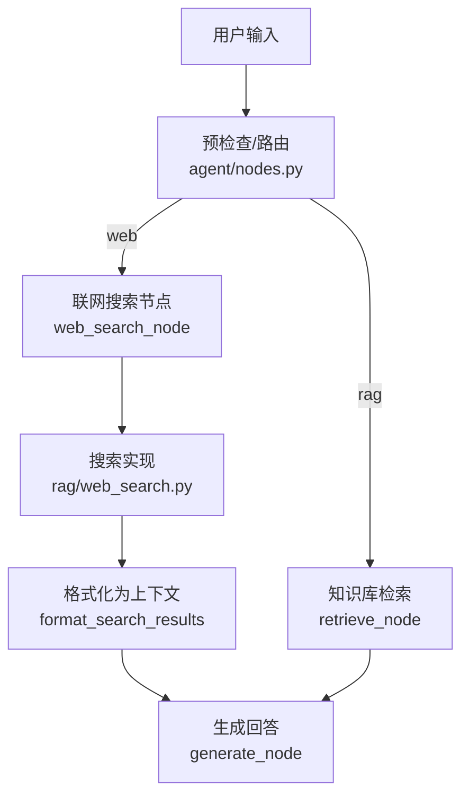
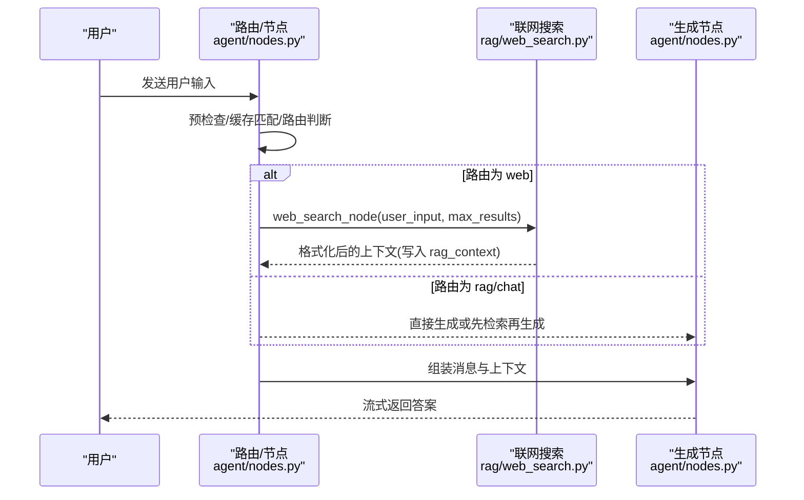
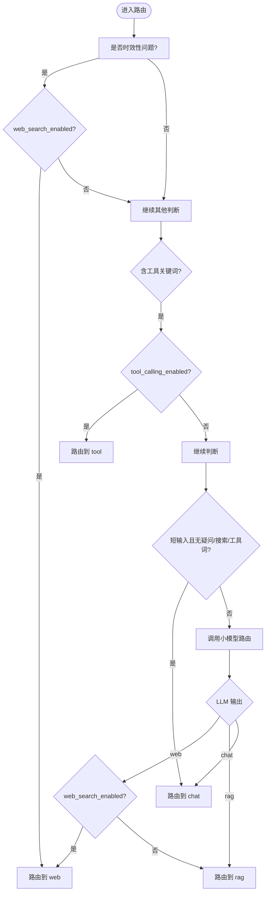
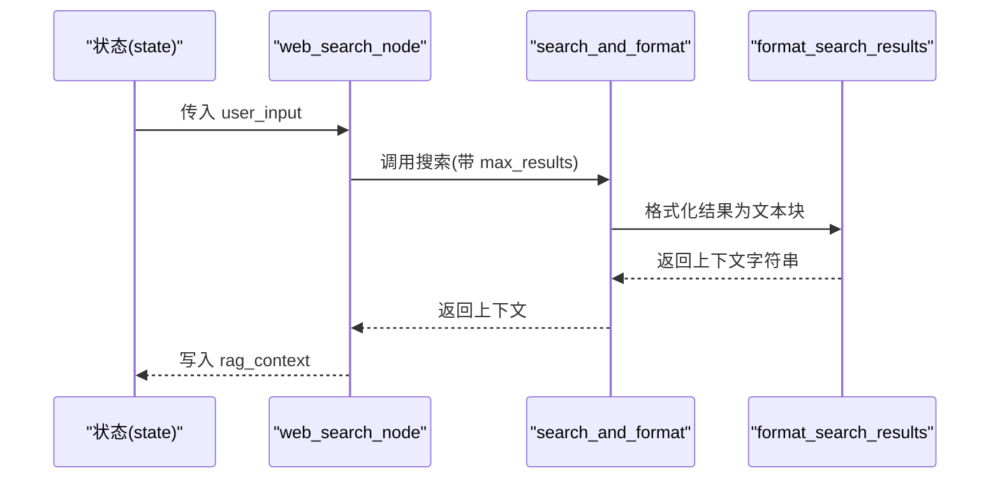
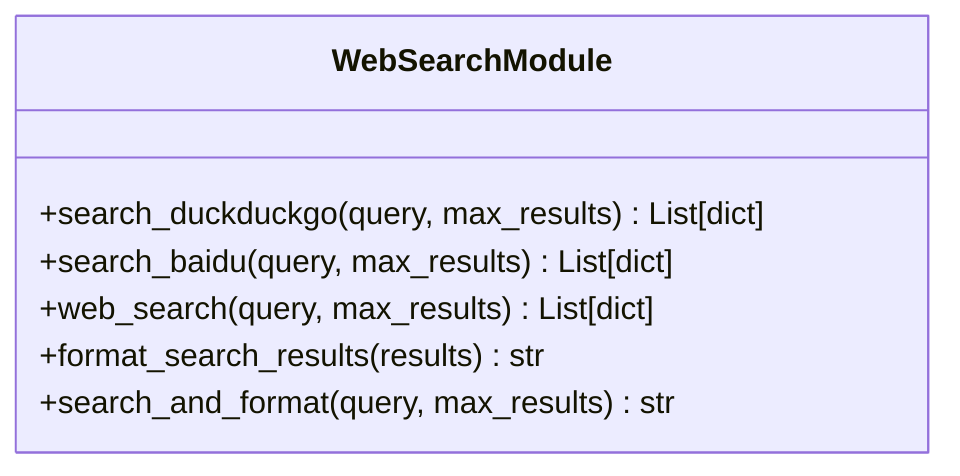
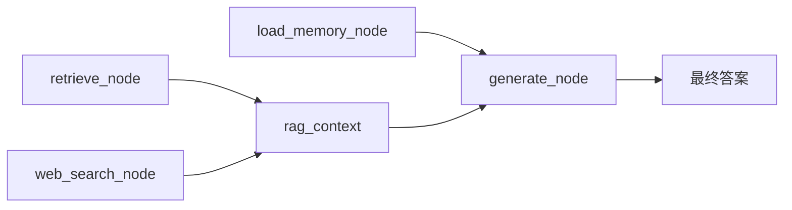
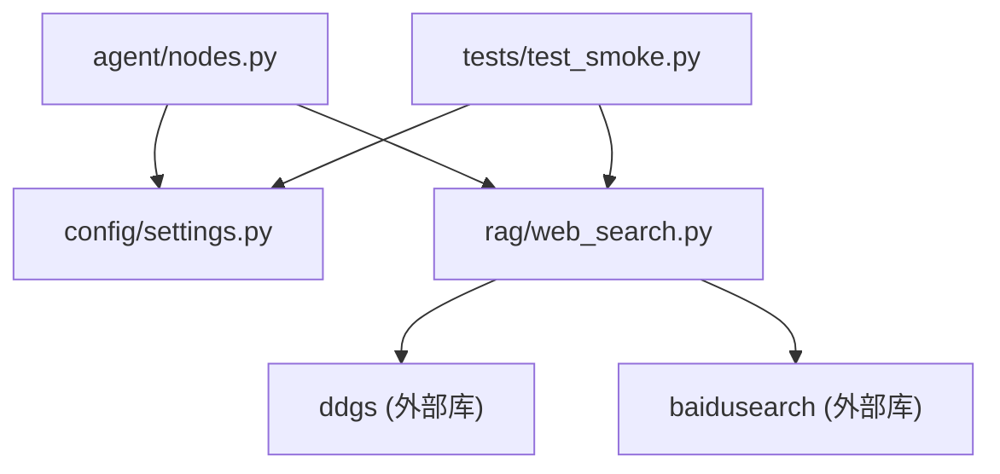

# 联网搜索节点

<cite>
**本文引用的文件**
- [rag/web_search.py](file://rag/web_search.py)
- [agent/nodes.py](file://agent/nodes.py)
- [config/settings.py](file://config/settings.py)
- [tests/test_smoke.py](file://tests/test_smoke.py)
</cite>

## 目录
1. [简介](#简介)
2. [项目结构](#项目结构)
3. [核心组件](#核心组件)
4. [架构总览](#架构总览)
5. [详细组件分析](#详细组件分析)
6. [依赖关系分析](#依赖关系分析)
7. [性能考量](#性能考量)
8. [故障排查指南](#故障排查指南)
9. [结论](#结论)
10. [附录：配置与示例](#附录：配置与示例)

## 简介
本技术文档聚焦于“联网搜索节点”的实现机制，围绕 web_search_node 的触发条件、搜索结果格式化、与其他检索方式的协作关系展开。同时覆盖搜索配置参数、结果质量评估策略、失败处理策略，并提供可操作的配置与优化建议，帮助读者在工程实践中稳定高效地使用联网搜索能力。

## 项目结构
联网搜索功能由三部分协同完成：
- 路由与节点编排：agent/nodes.py 负责意图路由与节点执行，web_search_node 是联网搜索的执行入口。
- 搜索实现：rag/web_search.py 提供双引擎搜索（DuckDuckGo 优先，百度备用）与结果格式化。
- 配置管理：config/settings.py 集中管理联网搜索开关、最大结果数等参数。

图表来源
- [agent/nodes.py:153-222](file://agent/nodes.py#L153-L222)
- [agent/nodes.py:324-341](file://agent/nodes.py#L324-L341)
- [rag/web_search.py:76-133](file://rag/web_search.py#L76-L133)

章节来源
- [agent/nodes.py:153-222](file://agent/nodes.py#L153-L222)
- [agent/nodes.py:324-341](file://agent/nodes.py#L324-L341)
- [rag/web_search.py:76-133](file://rag/web_search.py#L76-L133)
- [config/settings.py:109-112](file://config/settings.py#L109-L112)

## 核心组件
- 路由判断与分流：根据用户输入与系统配置决定走 RAG、联网搜索或闲聊路径；时效性问题（时间/天气）在开启联网搜索时优先走 web。
- 联网搜索节点：调用 search_and_format，将结果写入 rag_context，供后续生成节点使用。
- 搜索实现模块：封装 DuckDuckGo 与百度搜索，统一返回结构化结果并支持格式化输出。
- 配置项：web_search_enabled、web_search_max_results、web_search_timeout 等控制行为。

章节来源
- [agent/nodes.py:161-211](file://agent/nodes.py#L161-L211)
- [agent/nodes.py:324-341](file://agent/nodes.py#L324-L341)
- [rag/web_search.py:19-94](file://rag/web_search.py#L19-L94)
- [config/settings.py:109-112](file://config/settings.py#L109-L112)

## 架构总览
下图展示从用户输入到最终回答的完整链路，重点标注联网搜索的触发点与数据流向。

图表来源
- [agent/nodes.py:153-222](file://agent/nodes.py#L153-L222)
- [agent/nodes.py:324-341](file://agent/nodes.py#L324-L341)
- [rag/web_search.py:76-133](file://rag/web_search.py#L76-L133)

## 详细组件分析

### 路由与触发条件
- 时效性短路：当用户输入包含明确时间表达或天气相关词时，若 web_search_enabled 为真，则直接路由到 web，绕过 LLM 路由以提升响应速度与准确性。
- 关键词兜底：LLM 路由失败时，按工具调用 → RAG → 联网搜索 → 闲聊的优先级进行兜底判断。
- 开关控制：即使意图识别为 web，若 web_search_enabled 为假，则降级为 rag 或 chat。

图表来源
- [agent/nodes.py:161-211](file://agent/nodes.py#L161-L211)
- [agent/nodes.py:80-89](file://agent/nodes.py#L80-L89)
- [config/settings.py:109-112](file://config/settings.py#L109-L112)

章节来源
- [agent/nodes.py:80-89](file://agent/nodes.py#L80-L89)
- [agent/nodes.py:161-211](file://agent/nodes.py#L161-L211)
- [config/settings.py:109-112](file://config/settings.py#L109-L112)

### 联网搜索节点实现
- 入口函数：web_search_node 读取 user_input 与配置中的 web_search_max_results，调用 search_and_format，并将结果写入 rag_context。
- 异常处理：捕获异常并记录日志，确保主流程不被阻断；空结果时清空上下文并提示未找到结果。
- 与生成节点协作：生成的 prompt 会注入 rag_context，从而把联网搜索结果作为上下文参与回答生成。

图表来源
- [agent/nodes.py:324-341](file://agent/nodes.py#L324-L341)
- [rag/web_search.py:122-133](file://rag/web_search.py#L122-L133)
- [rag/web_search.py:97-119](file://rag/web_search.py#L97-L119)

章节来源
- [agent/nodes.py:324-341](file://agent/nodes.py#L324-L341)
- [rag/web_search.py:97-133](file://rag/web_search.py#L97-L133)

### 搜索实现与双引擎策略
- 主引擎 DuckDuckGo：通过 ddgs.text 获取结果，标准化为 {title, url, snippet}。
- 备用引擎百度：通过 baidusearch 获取结果，兼容对象属性与字典键，标准化同上。
- 回退策略：优先尝试 DuckDuckGo，若无结果或异常则自动回退到百度。
- 结果格式化：将每条结果包装为带来源标记的文本块，便于生成节点理解来源与类型。

图表来源
- [rag/web_search.py:19-94](file://rag/web_search.py#L19-L94)
- [rag/web_search.py:97-133](file://rag/web_search.py#L97-L133)

章节来源
- [rag/web_search.py:19-94](file://rag/web_search.py#L19-L94)
- [rag/web_search.py:97-133](file://rag/web_search.py#L97-L133)

### 与其他检索方式的协作
- RAG 检索：retrieve_node 执行查询改写、多路召回与重排序，结果同样写入 rag_context。
- 记忆加载：load_memory_node 加载长期记忆与会话摘要，注入生成阶段。
- 生成节点：统一接收来自 RAG 或联网搜索的上下文，结合历史消息生成回答。

图表来源
- [agent/nodes.py:284-321](file://agent/nodes.py#L284-L321)
- [agent/nodes.py:324-341](file://agent/nodes.py#L324-L341)
- [agent/nodes.py:344-360](file://agent/nodes.py#L344-L360)
- [agent/nodes.py:499-532](file://agent/nodes.py#L499-L532)

章节来源
- [agent/nodes.py:284-321](file://agent/nodes.py#L284-L321)
- [agent/nodes.py:324-341](file://agent/nodes.py#L324-L341)
- [agent/nodes.py:344-360](file://agent/nodes.py#L344-L360)
- [agent/nodes.py:499-532](file://agent/nodes.py#L499-L532)

## 依赖关系分析
- 路由层依赖配置：_decide_route 与 pre_check_condition 均读取 web_search_enabled 以决定是否允许联网搜索。
- 节点层依赖搜索模块：web_search_node 依赖 rag/web_search.search_and_format。
- 搜索模块依赖外部库：ddgs 与 baidusearch，具备异常捕获与回退逻辑。
- 测试验证：test_smoke.py 对模块导入、配置读取与格式化进行断言，保障基本可用性。

图表来源
- [agent/nodes.py:161-211](file://agent/nodes.py#L161-L211)
- [agent/nodes.py:324-341](file://agent/nodes.py#L324-L341)
- [rag/web_search.py:19-94](file://rag/web_search.py#L19-L94)
- [tests/test_smoke.py:276-315](file://tests/test_smoke.py#L276-L315)

章节来源
- [agent/nodes.py:161-211](file://agent/nodes.py#L161-L211)
- [agent/nodes.py:324-341](file://agent/nodes.py#L324-L341)
- [rag/web_search.py:19-94](file://rag/web_search.py#L19-L94)
- [tests/test_smoke.py:276-315](file://tests/test_smoke.py#L276-L315)

## 性能考量
- 时效性问题短路：减少 LLM 路由开销，提升响应速度。
- 双引擎回退：提高鲁棒性与可用性，避免单点故障导致整体不可用。
- 结果数量控制：通过 web_search_max_results 限制上下文长度，降低生成阶段的负载。
- 异常快速失败：搜索失败时记录日志并返回空上下文，不阻塞主链路。

[本节为通用性能讨论，无需特定文件引用]

## 故障排查指南
- 搜索无结果：检查网络连通性与搜索引擎可用性；确认 web_search_enabled 与 web_search_max_results 配置正确；查看日志中“未找到搜索结果”提示。
- 搜索引擎异常：DuckDuckGo 或百度任一失败会被捕获并记录警告；系统会自动回退另一引擎；如仍为空结果，需检查外部库安装与环境变量。
- 路由未命中 web：确认用户输入是否被识别为时效性问题或包含搜索关键词；检查 web_search_enabled 是否为真；查看路由日志与关键词匹配逻辑。
- 生成阶段上下文缺失：确认 web_search_node 已写入 rag_context；检查 generate_node 是否正确组装 system prompt 与历史消息。

章节来源
- [agent/nodes.py:324-341](file://agent/nodes.py#L324-L341)
- [rag/web_search.py:42-44](file://rag/web_search.py#L42-L44)
- [rag/web_search.py:71-73](file://rag/web_search.py#L71-L73)
- [tests/test_smoke.py:276-315](file://tests/test_smoke.py#L276-L315)

## 结论
联网搜索节点通过智能路由与双引擎搜索，实现了高可用、低延迟的实时信息获取能力。其设计遵循“优先时效性、失败回退、结果标准化”的原则，并与 RAG、记忆加载、生成环节紧密协作，形成完整的检索增强生成流水线。合理配置开关与参数，可在保证质量的同时优化性能与稳定性。

[本节为总结性内容，无需特定文件引用]

## 附录：配置与示例
- 启用/禁用联网搜索：设置 web_search_enabled 为 True/False。
- 控制结果数量：调整 web_search_max_results 以平衡上下文长度与相关性。
- 超时控制：可通过 web_search_timeout 设定搜索超时（秒），当前实现中该配置项存在但搜索函数未显式使用，建议在外部库调用处增加超时参数以增强可控性。
- 运行时效果验证：通过 tests/test_smoke.py 中的用例验证模块导入、配置读取与格式化输出是否正常。

章节来源
- [config/settings.py:109-112](file://config/settings.py#L109-L112)
- [tests/test_smoke.py:276-315](file://tests/test_smoke.py#L276-L315)