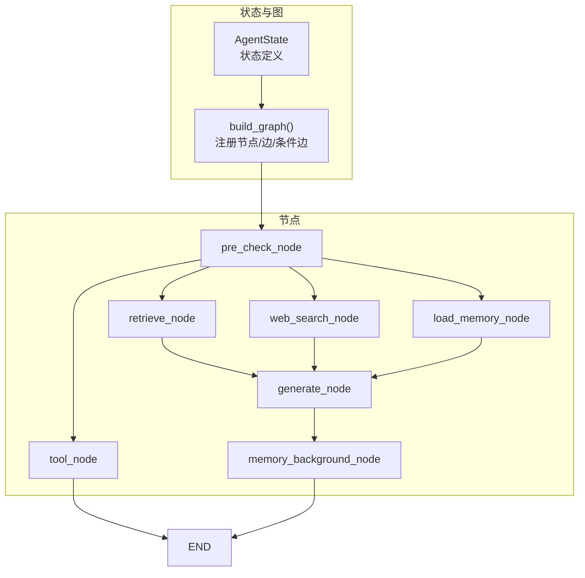
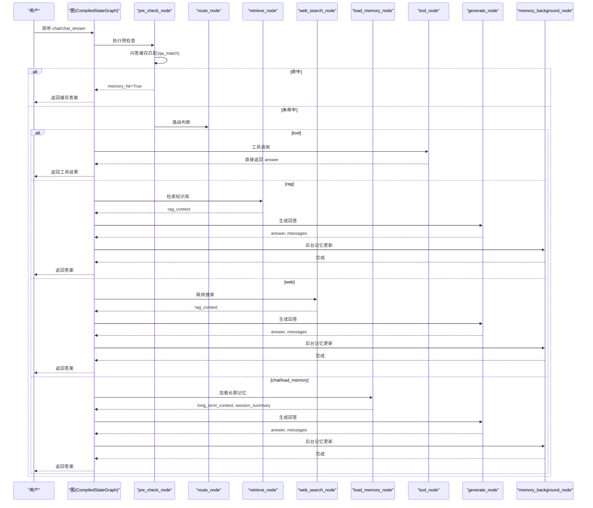
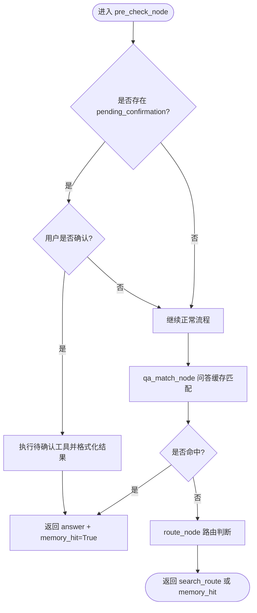
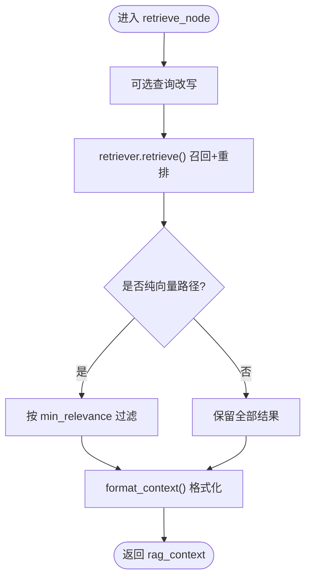
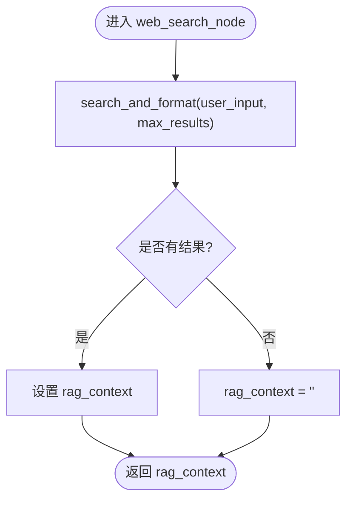
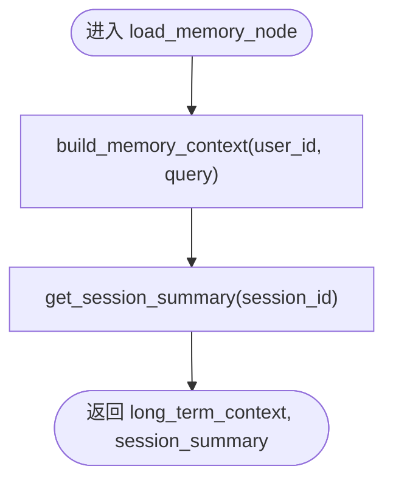
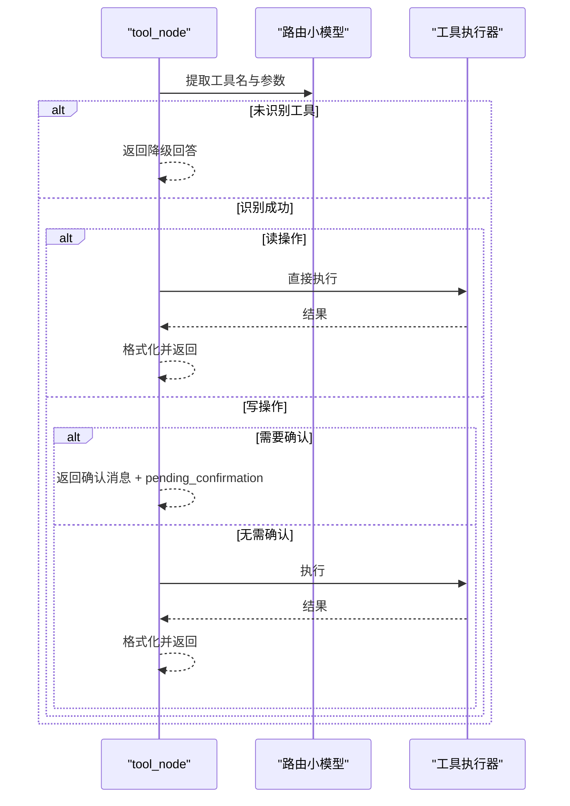
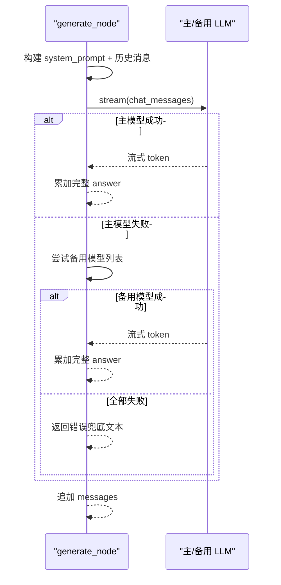
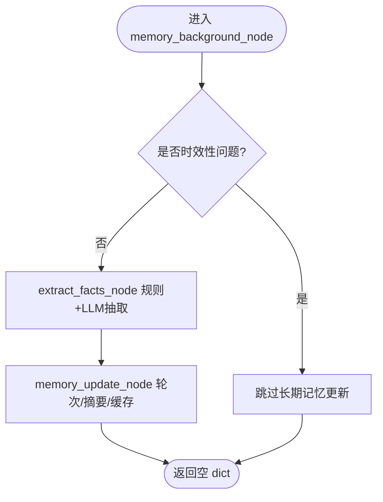
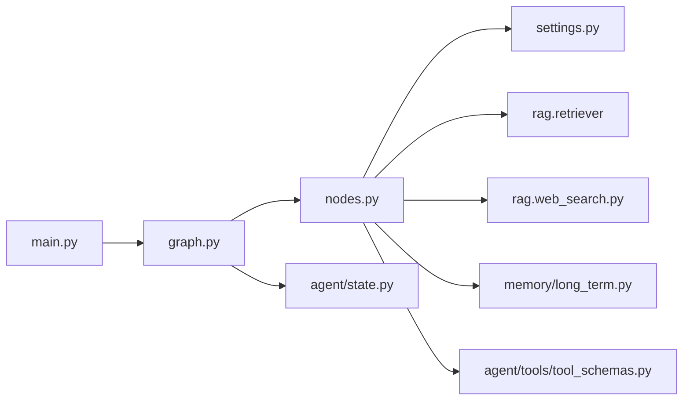

# 节点处理逻辑

<cite>
**本文引用的文件**
- [agent/nodes.py](file://agent/nodes.py)
- [agent/graph.py](file://agent/graph.py)
- [agent/state.py](file://agent/state.py)
- [main.py](file://main.py)
- [config/settings.py](file://config/settings.py)
- [memory/long_term.py](file://memory/long_term.py)
- [rag/web_search.py](file://rag/web_search.py)
- [agent/tools/tool_schemas.py](file://agent/tools/tool_schemas.py)
</cite>

## 目录
1. [简介](#简介)
2. [项目结构](#项目结构)
3. [核心组件](#核心组件)
4. [架构总览](#架构总览)
5. [详细组件分析](#详细组件分析)
6. [依赖关系分析](#依赖关系分析)
7. [性能与监控](#性能与监控)
8. [故障排查指南](#故障排查指南)
9. [结论](#结论)
10. [附录：扩展新节点示例](#附录：扩展新节点示例)

## 简介
本技术文档聚焦于智能体工作流中的“节点处理逻辑”，系统性解析以下关键节点的实现原理、执行流程、输入输出格式、错误处理机制、重试策略与性能特征，并给出扩展新节点的具体方法：
- pre_check_node（预检查节点）
- retrieve_node（检索节点）
- web_search_node（联网搜索节点）
- load_memory_node（记忆加载节点）
- tool_node（工具调用节点）
- generate_node（回答生成节点）
- memory_background_node（后台记忆更新节点）

该工作流基于 LangGraph StateGraph 编排，具备缓存短路、多路分流、后台异步记忆更新等优化点。

## 项目结构
- 状态定义：AgentState 定义了节点间流转的状态字段，包括消息历史、路由结果、上下文、答案、工具调用相关字段等。
- 图构建：graph.py 注册节点、边与条件边，编译为可执行的 CompiledStateGraph，并提供同步/异步流式入口。
- 节点实现：nodes.py 集中实现所有节点函数与辅助逻辑（路由判断、LLM 获取、降级、格式化等）。
- 配置：settings.py 提供全局开关与阈值（如是否启用联网搜索、RAG、重排序、问答缓存、工具确认等）。
- 外部能力：
  - 长期记忆：memory/long_term.py 提供分层记忆构建、摘要、问答缓存、会话摘要等。
  - 联网搜索：rag/web_search.py 提供双引擎搜索与结果格式化。
  - 工具调用：agent/tools/tool_schemas.py 定义工具提取提示词与 Schema。

图表来源
- [agent/graph.py:44-102](file://agent/graph.py#L44-L102)
- [agent/state.py:12-51](file://agent/state.py#L12-L51)

章节来源
- [agent/state.py:12-51](file://agent/state.py#L12-L51)
- [agent/graph.py:44-102](file://agent/graph.py#L44-L102)

## 核心组件
- AgentState：承载用户输入、会话标识、路由结果、检索/搜索上下文、长期记忆上下文、会话摘要、问答命中标志、最终答案及工具调用相关字段。
- 图构建器：将节点与条件边组装成有向图，支持 checkpointer 维护短期上下文，并提供 chat/chat_stream/astream_chat 三种调用方式。
- 节点集合：预检查、检索、联网搜索、记忆加载、工具调用、回答生成、后台记忆更新。

章节来源
- [agent/state.py:12-51](file://agent/state.py#L12-L51)
- [agent/graph.py:44-102](file://agent/graph.py#L44-L102)

## 架构总览
整体工作流如下：
- START → pre_check（合并 qa_match + route）
  - 若问答缓存命中 → END（直接复用历史答案）
  - 否则按 search_route 分流：
    - tool → 工具调用 → END
    - rag → retrieve → generate
    - web → web_search → generate
    - chat → load_memory → generate
- generate → memory_background → END

图表来源
- [agent/graph.py:55-102](file://agent/graph.py#L55-L102)
- [agent/nodes.py:93-151](file://agent/nodes.py#L93-L151)
- [agent/nodes.py:285-341](file://agent/nodes.py#L285-L341)
- [agent/nodes.py:345-360](file://agent/nodes.py#L345-L360)
- [agent/nodes.py:499-532](file://agent/nodes.py#L499-L532)
- [agent/nodes.py:536-643](file://agent/nodes.py#L536-L643)

## 详细组件分析

### pre_check_node（预检查节点）
- 职责：合并问答缓存匹配与路由判断；优先处理 pending_confirmation（用户确认工具操作）；命中缓存时短路到 END。
- 输入：AgentState（包含 user_input、user_id、session_id、pending_confirmation、confirmation_context 等）
- 输出：可能包含 answer、memory_hit、messages、search_route 等增量状态
- 关键流程：
  - 若存在 pending_confirmation 且用户回复确认为“确认/确定/yes/y/OK”等，则执行待确认工具并返回答案，标记 memory_hit 以短路后续链路。
  - 否则先执行 qa_match_node；若命中则直接返回答案并标记 memory_hit。
  - 再执行 route_node，写入 search_route，供后续条件边分流。
- 错误处理：各子步骤内部 try/except 捕获异常并降级（如向量失败、检索失败），不阻断主链路。
- 性能：问答缓存命中可跳过整条生成链路，显著降低延迟。

图表来源
- [agent/nodes.py:93-151](file://agent/nodes.py#L93-L151)
- [agent/nodes.py:233-281](file://agent/nodes.py#L233-L281)

章节来源
- [agent/nodes.py:93-151](file://agent/nodes.py#L93-L151)
- [agent/nodes.py:233-281](file://agent/nodes.py#L233-L281)

### retrieve_node（检索节点）
- 职责：执行 RAG 检索，按相关度阈值过滤后写入 rag_context。
- 输入：AgentState（user_input）
- 输出：rag_context（字符串）
- 关键流程：
  - 可选查询改写（由 agent.query_rewrite 提供，失败回退原始查询）。
  - 调用 retriever.retrieve 进行召回与重排。
  - 仅在纯向量检索路径下（关闭 rerank 与 BM25）应用统一归一化的相关度阈值过滤。
  - 格式化上下文供生成节点使用。
- 错误处理：检索失败时记录日志并返回空上下文，不阻断主链路。
- 性能：通过阈值过滤减少低质上下文注入，提升生成质量与稳定性。

图表来源
- [agent/nodes.py:285-321](file://agent/nodes.py#L285-L321)

章节来源
- [agent/nodes.py:285-321](file://agent/nodes.py#L285-L321)

### web_search_node（联网搜索节点）
- 职责：执行联网搜索，结果写入 rag_context（复用同一字段）。
- 输入：AgentState（user_input）
- 输出：rag_context（字符串）
- 关键流程：
  - 调用 rag.web_search.search_and_format，根据配置 max_results 限制结果数。
  - 无结果或异常时返回空字符串并记录日志。
- 错误处理：网络异常、引擎不可用均被捕获，降级为空上下文。
- 性能：双引擎（DuckDuckGo 优先，百度备用）提高可用性与时延表现。

图表来源
- [agent/nodes.py:325-341](file://agent/nodes.py#L325-L341)
- [rag/web_search.py:122-134](file://rag/web_search.py#L122-L134)

章节来源
- [agent/nodes.py:325-341](file://agent/nodes.py#L325-L341)
- [rag/web_search.py:19-94](file://rag/web_search.py#L19-L94)

### load_memory_node（记忆加载节点）
- 职责：从 SQLite 分层加载长期记忆上下文与会话压缩摘要。
- 输入：AgentState（user_id、session_id、user_input）
- 输出：long_term_context、session_summary
- 关键流程：
  - build_memory_context(user_id, query=user_input) 构建分层记忆上下文。
  - get_session_summary(session_id) 获取会话压缩摘要。
- 错误处理：数据库读取异常时记录日志并返回空字符串，不影响主链路。
- 性能：分层预算控制上下文长度，避免过长 prompt 导致超时或成本上升。

图表来源
- [agent/nodes.py:345-360](file://agent/nodes.py#L345-L360)
- [memory/long_term.py:424-497](file://memory/long_term.py#L424-L497)
- [memory/long_term.py:360-379](file://memory/long_term.py#L360-L379)

章节来源
- [agent/nodes.py:345-360](file://agent/nodes.py#L345-L360)
- [memory/long_term.py:424-497](file://memory/long_term.py#L424-L497)

### tool_node（工具调用节点）
- 职责：LLM 提取工具名与参数，区分读/写操作，必要时请求用户确认，执行工具并格式化结果。
- 输入：AgentState（user_input、user_id）
- 输出：answer、tool_name、tool_params、tool_result、pending_confirmation、confirmation_context
- 关键流程：
  - _extract_tool_call 使用路由小模型从用户输入提取工具与参数。
  - 读操作（query_todos/query_meetings）直接执行并返回结果。
  - 写操作在开启 tool_confirmation_required 时返回确认消息，等待用户确认后再执行。
  - 无需确认或确认后执行工具，格式化结果返回。
- 错误处理：LLM 提取失败、工具执行异常均被捕获，返回友好提示或错误信息。
- 性能：读操作直接返回，不经过 generate，降低延迟。

图表来源
- [agent/nodes.py:647-779](file://agent/nodes.py#L647-L779)
- [agent/tools/tool_schemas.py:8-26](file://agent/tools/tool_schemas.py#L8-L26)

章节来源
- [agent/nodes.py:647-779](file://agent/nodes.py#L647-L779)
- [agent/tools/tool_schemas.py:8-26](file://agent/tools/tool_schemas.py#L8-L26)

### generate_node（回答生成节点）
- 职责：组装 system prompt、历史消息（含更早对话摘要）、当前输入，流式生成回答；主模型失败自动降级到备用模型。
- 输入：AgentState（user_input、rag_context、long_term_context、messages、session_summary）
- 输出：answer、messages（追加本轮人机对话）
- 关键流程：
  - build_system_prompt 注入长期记忆与检索上下文。
  - build_chat_history 构建窗口化历史消息，并在超窗时注入更早对话摘要。
  - 主模型流式生成；失败时依次尝试备用模型列表或单模型降级。
- 错误处理：主模型与备用模型均失败时返回汇总错误信息；LLM 调用异常被捕获并降级。
- 性能：流式生成降低首 token 延迟；备用模型提升鲁棒性。

图表来源
- [agent/nodes.py:454-532](file://agent/nodes.py#L454-L532)

章节来源
- [agent/nodes.py:454-532](file://agent/nodes.py#L454-L532)

### memory_background_node（后台记忆更新节点）
- 职责：后台执行关键信息抽取与长期记忆更新，不阻塞主响应链路。
- 输入：AgentState（user_id、messages、user_input）
- 输出：空 dict（不修改状态）
- 关键流程：
  - extract_facts_node：规则快速路径 + 可选 LLM 结构化抽取，保存画像与事实。
  - memory_update_node：轮次计数、周期性摘要存储、会话摘要刷新、问答缓存保存。
- 错误处理：每个子步骤独立 try/except，任一失败不影响另一者。
- 性能：后台执行避免影响端到端时延；增量摘要与阈值控制降低 LLM 调用频率。

图表来源
- [agent/nodes.py:631-643](file://agent/nodes.py#L631-L643)
- [agent/nodes.py:364-412](file://agent/nodes.py#L364-L412)
- [agent/nodes.py:536-600](file://agent/nodes.py#L536-L600)

章节来源
- [agent/nodes.py:631-643](file://agent/nodes.py#L631-L643)
- [agent/nodes.py:364-412](file://agent/nodes.py#L364-L412)
- [agent/nodes.py:536-600](file://agent/nodes.py#L536-L600)

## 依赖关系分析
- 节点与外部模块的耦合：
  - nodes.py 依赖 config.settings 获取全局开关与阈值。
  - retrieve_node 依赖 rag.retriever（检索与格式化）。
  - web_search_node 依赖 rag.web_search（双引擎搜索）。
  - load_memory_node 依赖 memory.long_term（分层记忆、摘要、问答缓存）。
  - tool_node 依赖 agent.tools.tool_schemas（工具提取提示词与 Schema）。
  - generate_node 依赖 agent.prompts（系统提示词）与 LLM 客户端。
- 图构建与状态：
  - graph.py 注册节点与边，使用 AgentState 作为状态载体。
  - main.py 提供 Web API 与流式 SSE 接口，集成安全过滤、限流、熔断。

图表来源
- [agent/nodes.py:1-21](file://agent/nodes.py#L1-L21)
- [agent/graph.py:31-41](file://agent/graph.py#L31-L41)
- [main.py:187-209](file://main.py#L187-L209)

章节来源
- [agent/nodes.py:1-21](file://agent/nodes.py#L1-L21)
- [agent/graph.py:31-41](file://agent/graph.py#L31-L41)
- [main.py:187-209](file://main.py#L187-L209)

## 性能与监控
- 预热与连接池：
  - 启动时预热路由小模型与主模型连接（TLS/DNS/HTTP2），降低首请求延迟。
- 流式输出与超时保护：
  - 流式接口支持整体超时保护，超时后返回已生成的 token，避免连接卡死。
- 缓存与短路：
  - 问答缓存命中直接返回，跳过生成链路；工具调用直接返回，不经过 generate。
- 降级与重试：
  - 路由/抽取/生成均具备异常捕获与降级策略；生成节点支持多备用模型依次尝试。
- 资源预算：
  - 长期记忆上下文、短期历史消息、RAG/搜索上下文均有字符预算控制，防止超长 prompt。
- 监控指标建议：
  - 节点耗时（检索、搜索、生成、记忆更新）
  - 命中率（问答缓存、RAG 相关度过滤）
  - 失败率与降级次数（LLM 调用失败、搜索引擎不可用）
  - 流式首 token 时间与整体时延

章节来源
- [main.py:45-77](file://main.py#L45-L77)
- [main.py:228-314](file://main.py#L228-L314)
- [agent/nodes.py:467-496](file://agent/nodes.py#L467-L496)
- [agent/nodes.py:285-321](file://agent/nodes.py#L285-L321)

## 故障排查指南
- 路由失败：
  - 现象：路由判断异常，回退关键词策略。
  - 排查：检查 TOOL_KEYWORDS、ROUTER_KEYWORDS、WEB_SEARCH_KEYWORDS 配置；查看日志中路由降级信息。
- 检索失败：
  - 现象：retrieve_node 返回空上下文。
  - 排查：检查向量库索引、rerank/BM25 开关、相关度阈值；查看检索日志。
- 联网搜索失败：
  - 现象：web_search_node 返回空上下文。
  - 排查：检查 DuckDuckGo/百度可用性、max_results 配置；查看搜索日志。
- 生成失败：
  - 现象：主模型失败，尝试备用模型仍失败。
  - 排查：检查 LLM 配置（模型、API Key、Base URL、超时、重试）；查看降级日志。
- 记忆更新失败：
  - 现象：长期记忆/会话摘要未更新。
  - 排查：检查 SQLite 连接、表结构、权限；查看记忆更新日志。
- 工具调用失败：
  - 现象：工具参数提取失败或执行异常。
  - 排查：检查工具 Schema、参数格式、钉钉 API 响应；查看工具执行日志。

章节来源
- [agent/nodes.py:180-211](file://agent/nodes.py#L180-L211)
- [agent/nodes.py:298-321](file://agent/nodes.py#L298-L321)
- [agent/nodes.py:329-341](file://agent/nodes.py#L329-L341)
- [agent/nodes.py:524-532](file://agent/nodes.py#L524-L532)
- [agent/nodes.py:545-564](file://agent/nodes.py#L545-L564)
- [agent/nodes.py:693-746](file://agent/nodes.py#L693-L746)

## 结论
该工作流通过预检查短路、多路分流、后台记忆更新与流式生成，实现了高可用、低延迟的智能体响应。各节点具备完善的错误处理与降级策略，结合配置开关与预算控制，可在不同场景下灵活调整性能与质量。扩展新节点时，遵循状态增量更新、异常隔离与后台异步原则，可无缝融入现有图结构。

## 附录：扩展新节点示例
目标：新增一个“翻译节点”（translate_node），用于将检索/搜索结果翻译为目标语言，并注入到生成上下文中。

步骤：
1. 在 nodes.py 中实现 translate_node(state)：
   - 输入：AgentState（包含 rag_context 或 web 搜索结果）
   - 输出：增量状态，如 translated_context
   - 逻辑：调用翻译服务（如 LLM 或第三方 API），对上下文进行翻译；异常捕获并返回空上下文。
2. 在 graph.py 中注册节点与边：
   - g.add_node("translate", translate_node)
   - 在 retrieve/web_search 之后添加边到 translate，再连接到 generate。
3. 在 AgentState 中添加字段：
   - translated_context: str（可选）
4. 在 generate_node 中组装 prompt 时注入 translated_context（如需）。
5. 配置开关（可选）：
   - 在 settings.py 中添加 translate_enabled、translate_target_language 等配置项。
6. 测试与监控：
   - 验证节点执行顺序与上下文注入效果；
   - 记录翻译耗时与失败率，评估对整体时延的影响。

参考实现位置（仅路径，不含代码内容）：
- 节点实现：[agent/nodes.py:285-341](file://agent/nodes.py#L285-L341)
- 图注册与边：[agent/graph.py:55-102](file://agent/graph.py#L55-L102)
- 状态定义：[agent/state.py:12-51](file://agent/state.py#L12-L51)
- 配置管理：[config/settings.py:109-133](file://config/settings.py#L109-L133)