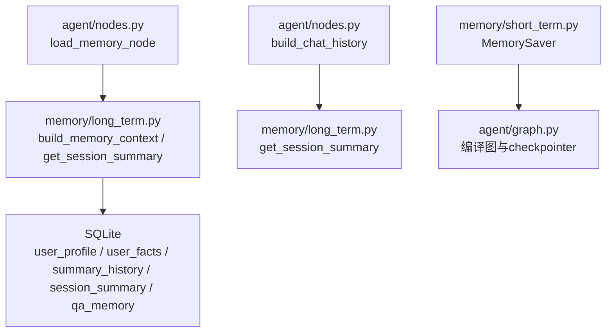
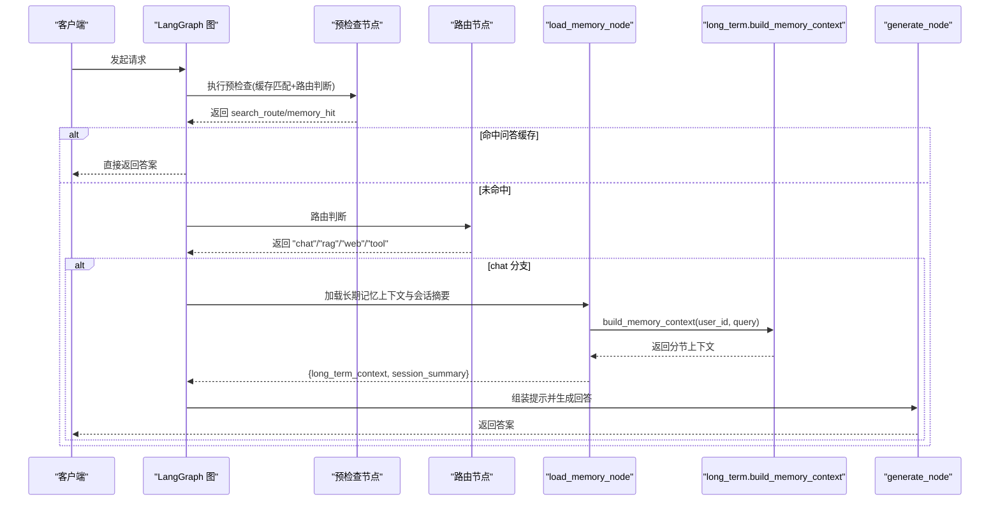
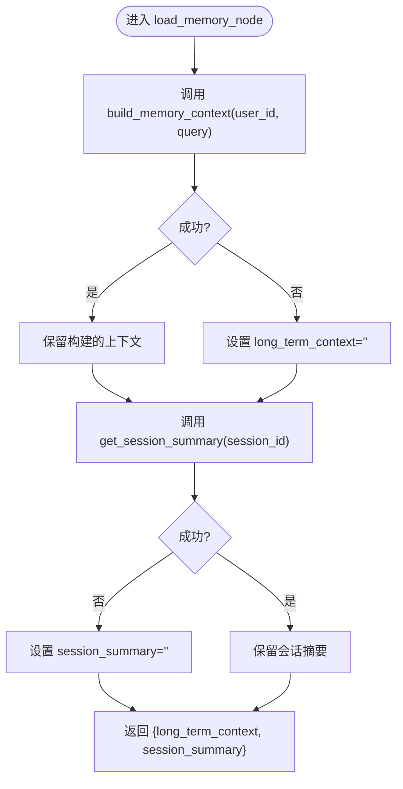
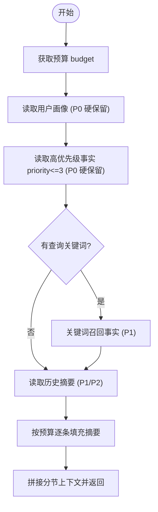
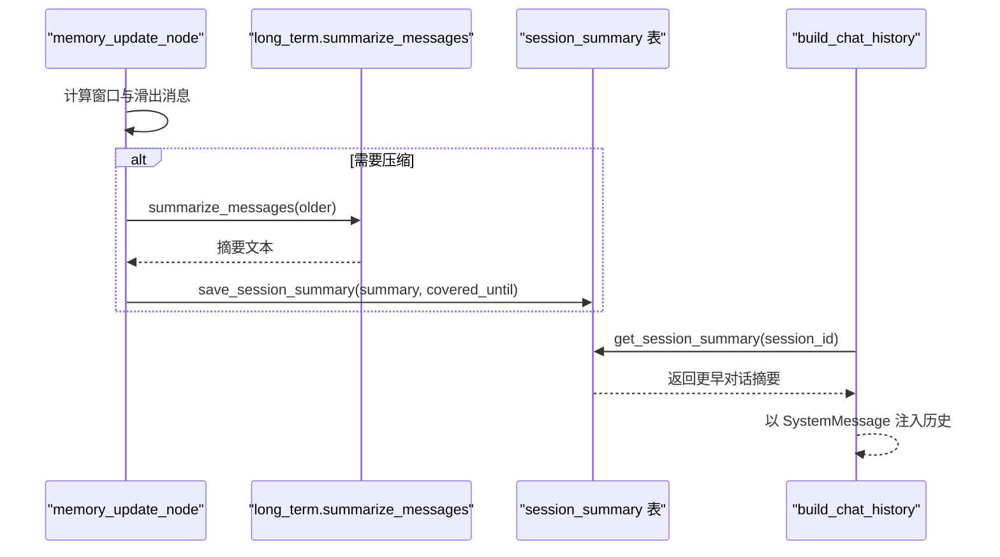
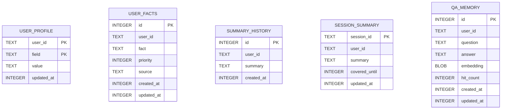
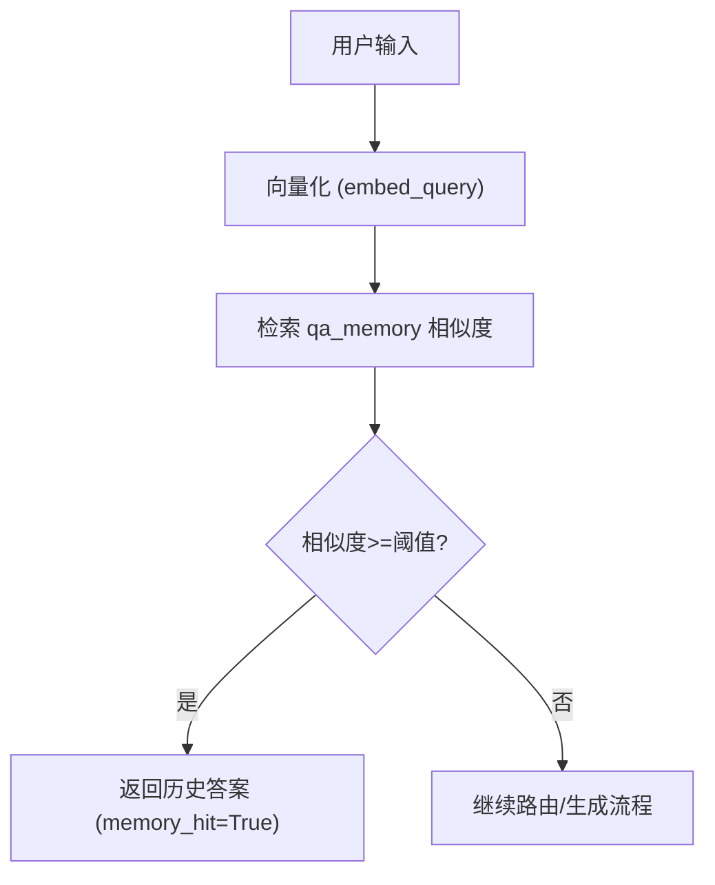
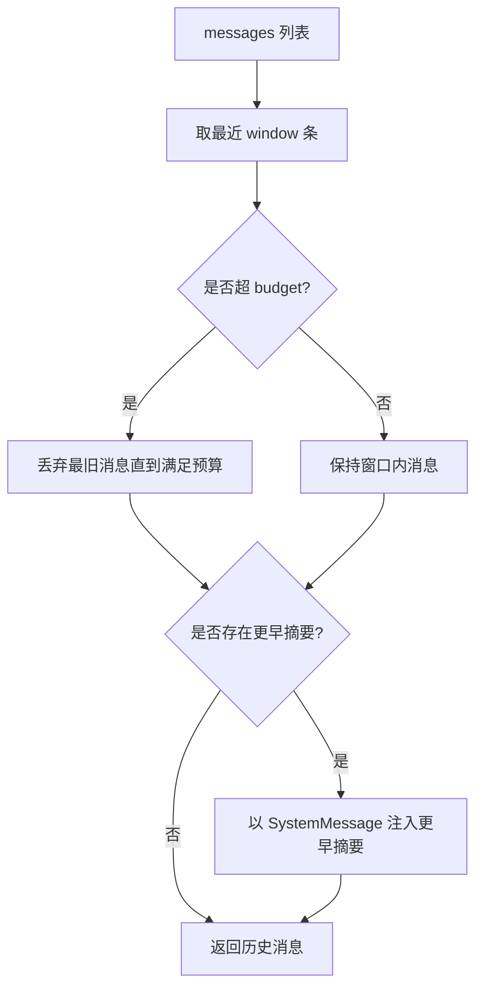
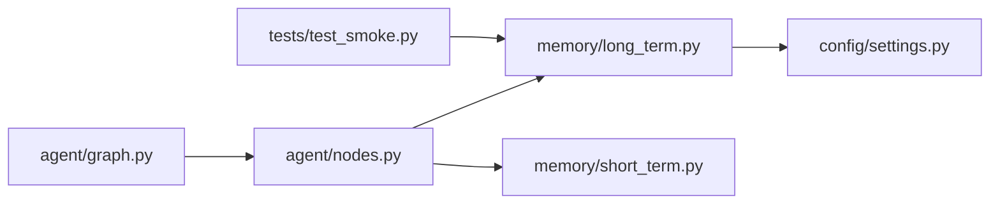

# 记忆加载节点

<cite>
**本文引用的文件**
- [agent/nodes.py](file://agent/nodes.py)
- [memory/long_term.py](file://memory/long_term.py)
- [memory/short_term.py](file://memory/short_term.py)
- [config/settings.py](file://config/settings.py)
- [agent/state.py](file://agent/state.py)
- [agent/graph.py](file://agent/graph.py)
- [tests/test_smoke.py](file://tests/test_smoke.py)
</cite>

## 目录
1. [简介](#简介)
2. [项目结构](#项目结构)
3. [核心组件](#核心组件)
4. [架构总览](#架构总览)
5. [详细组件分析](#详细组件分析)
6. [依赖关系分析](#依赖关系分析)
7. [性能与优化](#性能与优化)
8. [故障排查指南](#故障排查指南)
9. [结论](#结论)
10. [附录：自定义与示例](#附录自定义与示例)

## 简介
本技术文档聚焦“记忆加载节点”的实现原理，围绕 load_memory_node 函数展开，系统阐述长期记忆上下文的构建、会话摘要的加载策略、以及记忆数据的分层存储结构。同时给出记忆查询策略、上下文压缩算法、性能优化建议，并提供可操作的自定义与优化示例路径，帮助读者在不直接粘贴代码的前提下快速定位并扩展实现。

## 项目结构
记忆系统由短期记忆与长期记忆两部分组成：
- 短期记忆：基于进程内 MemorySaver，维护会话级上下文与交互历史，保证多轮对话连贯性。
- 长期记忆：基于 SQLite 持久化，采用分层结构化设计（用户画像、关键事实、历史摘要、会话压缩摘要、问答缓存等），并通过预算控制与关键词召回提升检索质量。

图表来源
- [agent/nodes.py:344-360](file://agent/nodes.py#L344-L360)
- [memory/long_term.py:424-497](file://memory/long_term.py#L424-L497)
- [memory/short_term.py:13-20](file://memory/short_term.py#L13-L20)
- [agent/graph.py:68-101](file://agent/graph.py#L68-L101)

章节来源
- [agent/nodes.py:344-360](file://agent/nodes.py#L344-L360)
- [memory/long_term.py:424-497](file://memory/long_term.py#L424-L497)
- [memory/short_term.py:13-20](file://memory/short_term.py#L13-L20)
- [agent/graph.py:68-101](file://agent/graph.py#L68-L101)

## 核心组件
- 记忆加载节点 load_memory_node：从长期记忆中按预算与优先级构建上下文，并加载当前会话的压缩摘要，注入到生成阶段。
- 长期记忆模块 long_term：提供分层上下文构建、摘要保存与合并、关键信息抽取、问答缓存检索等能力。
- 短期记忆模块 short_term：提供会话级 checkpointer，用于状态持久化与多轮上下文管理。
- 配置 settings：集中管理记忆相关参数（预算、窗口、阈值、开关等）。
- 状态 state：定义 AgentState，承载消息历史、路由结果、记忆上下文与会话摘要等字段。

章节来源
- [agent/nodes.py:344-360](file://agent/nodes.py#L344-L360)
- [memory/long_term.py:424-497](file://memory/long_term.py#L424-L497)
- [memory/short_term.py:13-20](file://memory/short_term.py#L13-L20)
- [config/settings.py:114-133](file://config/settings.py#L114-L133)
- [agent/state.py:12-50](file://agent/state.py#L12-L50)

## 架构总览
记忆加载节点在智能体工作流中处于“生成前”的关键位置，负责将长期记忆与短期会话摘要组装为提示上下文，确保模型回答具备个性化与连续性。

图表来源
- [agent/graph.py:68-101](file://agent/graph.py#L68-L101)
- [agent/nodes.py:92-150](file://agent/nodes.py#L92-L150)
- [agent/nodes.py:344-360](file://agent/nodes.py#L344-L360)
- [memory/long_term.py:424-497](file://memory/long_term.py#L424-L497)

## 详细组件分析

### 记忆加载节点 load_memory_node
- 职责：调用长期记忆的上下文构建与会话摘要加载，输出 long_term_context 与 session_summary。
- 容错：对异常进行捕获并降级为空字符串，避免阻塞主链路。
- 输入：AgentState 中的 user_id、session_id、user_input。
- 输出：更新 AgentState 的记忆相关字段，供 generate_node 使用。

图表来源
- [agent/nodes.py:344-360](file://agent/nodes.py#L344-L360)

章节来源
- [agent/nodes.py:344-360](file://agent/nodes.py#L344-L360)

### 长期记忆上下文构建 build_memory_context
- 分层策略：
  - P0 硬保留层：用户画像（姓名/称呼/角色/项目/公司等）与高优先级关键事实（priority<=3），不受总预算限制，确保关键信息不丢失。
  - P1 预算填充层：最近若干条历史摘要 + 关键词召回的事实，按字符预算逐条填充，超出则丢弃更旧条目。
  - P2 剩余预算层：更早的历史摘要，用剩余预算填充，超额丢弃。
- 关键词召回：从用户输入切出候选关键词，在关键事实表中进行 LIKE 匹配并按优先级排序，补充到“已知事实”部分。
- 预算控制：默认读取 memory_context_budget；P0 层硬保留允许小幅超出，P1/P2 严格受控。
- 输出格式：分节文本（【用户画像】/【已知事实】/【历史摘要】），便于生成节点注入 prompt。

图表来源
- [memory/long_term.py:424-497](file://memory/long_term.py#L424-L497)

章节来源
- [memory/long_term.py:424-497](file://memory/long_term.py#L424-L497)

### 会话摘要加载与压缩
- 会话压缩摘要：当短期窗口超限时，将滑出窗口的旧消息压缩为摘要并持久化，后续通过 get_session_summary 加载，作为“更早对话摘要”注入生成历史，避免硬丢导致上下文断裂。
- 压缩触发：仅在新增滑出消息达到一定数量时触发，避免每轮重复调用 LLM。
- 注入策略：构建历史消息时，若存在更早对话摘要，则以 SystemMessage 形式插入到窗口内消息之前，保证主线上下文连贯。

图表来源
- [agent/nodes.py:535-628](file://agent/nodes.py#L535-L628)
- [memory/long_term.py:340-380](file://memory/long_term.py#L340-L380)

章节来源
- [agent/nodes.py:535-628](file://agent/nodes.py#L535-L628)
- [memory/long_term.py:340-380](file://memory/long_term.py#L340-L380)

### 记忆数据存储结构（SQLite）
- 用户画像 user_profile：单值可更新，最高优先级，包含姓名、称呼、角色、项目、公司等字段。
- 关键事实 user_facts：多条带优先级（1-10），支持关键词搜索与按优先级排序。
- 历史摘要 summary_history：按时间倒序保留最近若干条，用于构建历史摘要层。
- 会话摘要 session_summary：按 session_id 存储滚动摘要及覆盖范围，用于短期记忆超窗后的上下文恢复。
- 问答记忆 qa_memory：问题向量与历史答案缓存，支持相似度检索与复用，减少大模型调用。
- 元数据 memory_meta：迁移标记等。

图表来源
- [memory/long_term.py:50-125](file://memory/long_term.py#L50-L125)

章节来源
- [memory/long_term.py:50-125](file://memory/long_term.py#L50-L125)

### 记忆查询策略
- 关键词召回：从用户输入提取候选关键词，在关键事实表中使用 LIKE 匹配，按优先级与更新时间排序，限制返回条数。
- 问答缓存检索：将新问题向量化后与历史问题向量计算余弦相似度，超过阈值直接复用历史答案，显著降低延迟与成本。
- 路由短路：问答缓存命中时直接返回答案，跳过后续生成链路。

图表来源
- [agent/nodes.py:232-281](file://agent/nodes.py#L232-L281)
- [memory/long_term.py:784-820](file://memory/long_term.py#L784-L820)

章节来源
- [agent/nodes.py:232-281](file://agent/nodes.py#L232-L281)
- [memory/long_term.py:784-820](file://memory/long_term.py#L784-L820)

### 上下文压缩算法
- 短期历史窗口：仅保留最近 N 条消息（memory_short_window），超出预算时从最旧消息开始丢弃。
- 更早对话摘要：当窗口外消息较多时，将其压缩为摘要并以 SystemMessage 注入，避免硬丢导致的上下文断裂。
- 预算控制：history_budget 控制注入历史的字符上限，结合窗口与摘要，平衡上下文长度与质量。

图表来源
- [agent/nodes.py:427-450](file://agent/nodes.py#L427-L450)

章节来源
- [agent/nodes.py:427-450](file://agent/nodes.py#L427-L450)

## 依赖关系分析
- load_memory_node 依赖 long_term 的上下文构建与会话摘要加载。
- long_term 依赖 SQLite 连接与配置 settings 的预算参数。
- short_term 提供 checkpointer，被 graph 编译时使用，用于会话状态持久化。
- generate_node 消费 long_term_context 与 session_summary，组合提示并生成回答。
- 测试用例验证规则抽取、上下文召回、预算控制与短窗压缩等行为。

图表来源
- [agent/nodes.py:344-360](file://agent/nodes.py#L344-L360)
- [memory/long_term.py:424-497](file://memory/long_term.py#L424-L497)
- [memory/short_term.py:13-20](file://memory/short_term.py#L13-L20)
- [config/settings.py:114-133](file://config/settings.py#L114-L133)
- [agent/graph.py:68-101](file://agent/graph.py#L68-L101)
- [tests/test_smoke.py:39-104](file://tests/test_smoke.py#L39-L104)

章节来源
- [agent/nodes.py:344-360](file://agent/nodes.py#L344-L360)
- [memory/long_term.py:424-497](file://memory/long_term.py#L424-L497)
- [memory/short_term.py:13-20](file://memory/short_term.py#L13-L20)
- [config/settings.py:114-133](file://config/settings.py#L114-L133)
- [agent/graph.py:68-101](file://agent/graph.py#L68-L101)
- [tests/test_smoke.py:39-104](file://tests/test_smoke.py#L39-L104)

## 性能与优化
- 预算控制：通过 memory_context_budget 与 memory_history_budget 控制上下文长度，避免提示过长导致响应变慢或截断。
- 关键词召回：在关键事实表中使用 LIKE 匹配，限制返回条数，减少不必要的数据传输与处理。
- 问答缓存：相似问题直接复用历史答案，显著降低大模型调用次数与延迟。
- 会话压缩：仅在必要时触发摘要生成，避免每轮重复调用 LLM。
- 并发与锁：SQLite 写操作使用线程锁串行化，读操作开启 WAL 模式提升并发读性能。
- 降级策略：LLM 不可用时回退简单截断或备用模型，保证服务可用性。

章节来源
- [memory/long_term.py:424-497](file://memory/long_term.py#L424-L497)
- [memory/long_term.py:784-820](file://memory/long_term.py#L784-L820)
- [agent/nodes.py:467-496](file://agent/nodes.py#L467-L496)
- [config/settings.py:114-133](file://config/settings.py#L114-L133)

## 故障排查指南
- 长期记忆加载失败：检查 SQLite 连接与表初始化，确认 memory_context_budget 配置合理。
- 会话摘要加载失败：确认 session_id 正确且 session_summary 表存在记录。
- 问答缓存未命中：检查 embedding 是否可用、相似度阈值是否过高、qa_memory 是否有记录。
- 路由短路异常：确认 memory_hit 标志是否正确设置，预检查节点逻辑是否生效。
- 生成阶段上下文过长：调整 memory_history_budget 与 memory_short_window，确保历史消息与摘要符合预算。

章节来源
- [agent/nodes.py:344-360](file://agent/nodes.py#L344-L360)
- [memory/long_term.py:424-497](file://memory/long_term.py#L424-L497)
- [agent/nodes.py:232-281](file://agent/nodes.py#L232-L281)

## 结论
记忆加载节点通过分层构建长期记忆上下文与会话压缩摘要，实现了个性化、连续性与可控的上下文长度。配合关键词召回、问答缓存与预算控制，系统在性能与效果之间取得良好平衡。通过合理的配置与扩展点，用户可以自定义记忆加载逻辑与检索策略，进一步优化记忆检索效果。

## 附录：自定义与示例
- 自定义记忆加载逻辑：
  - 修改 build_memory_context 的分层策略与预算分配，适配不同场景的上下文需求。
  - 扩展关键词召回逻辑，增加更多关键词提取规则或引入外部词典。
  - 调整问答缓存阈值与最大记录数，平衡命中率与存储空间。
- 优化记忆检索效果：
  - 调优 memory_qa_threshold 与 memory_qa_max_records，提升相似问题命中率。
  - 调整 memory_short_window 与 memory_history_budget，优化历史消息注入质量。
  - 启用或关闭 rerank/BM25，根据检索路径选择合适的相关度过滤策略。
- 参考测试用例：
  - 规则抽取与跨轮召回：验证姓名等关键信息当轮落库与上下文召回。
  - 预算控制：验证大量记忆下 P0 硬保留与总长度受控。
  - 短窗压缩：验证窗口+预算+更早对话摘要注入的正确性。

章节来源
- [memory/long_term.py:424-497](file://memory/long_term.py#L424-L497)
- [memory/long_term.py:784-820](file://memory/long_term.py#L784-L820)
- [config/settings.py:114-133](file://config/settings.py#L114-L133)
- [tests/test_smoke.py:39-104](file://tests/test_smoke.py#L39-L104)