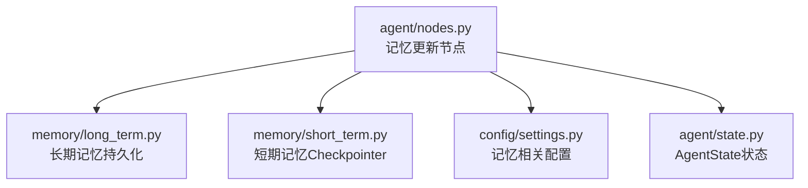
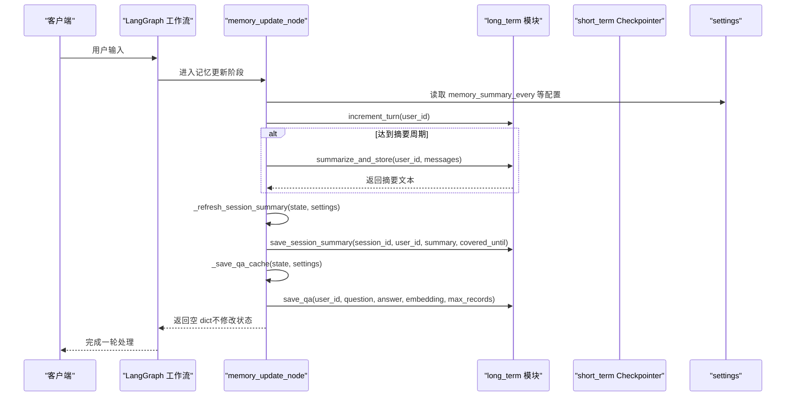
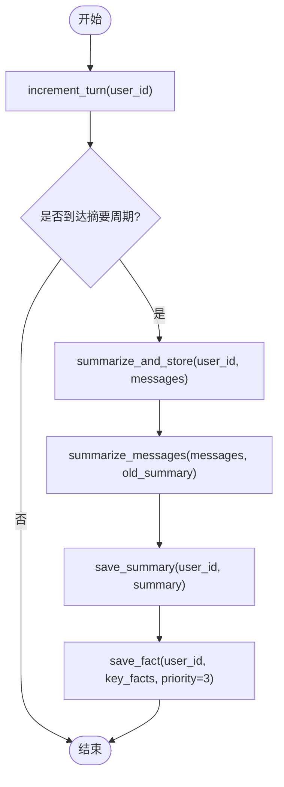
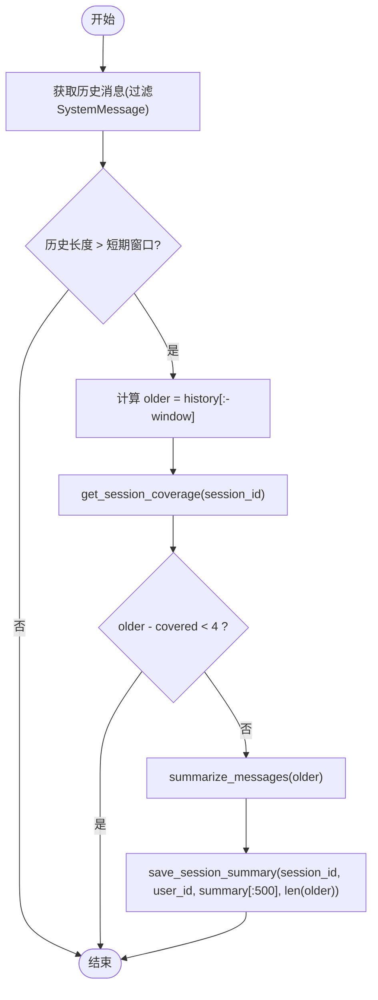
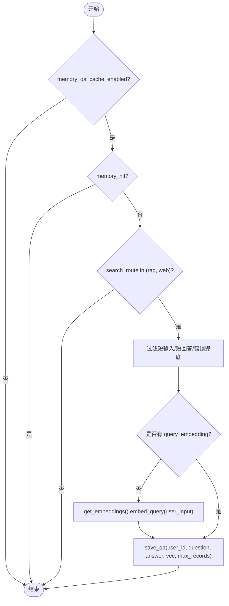
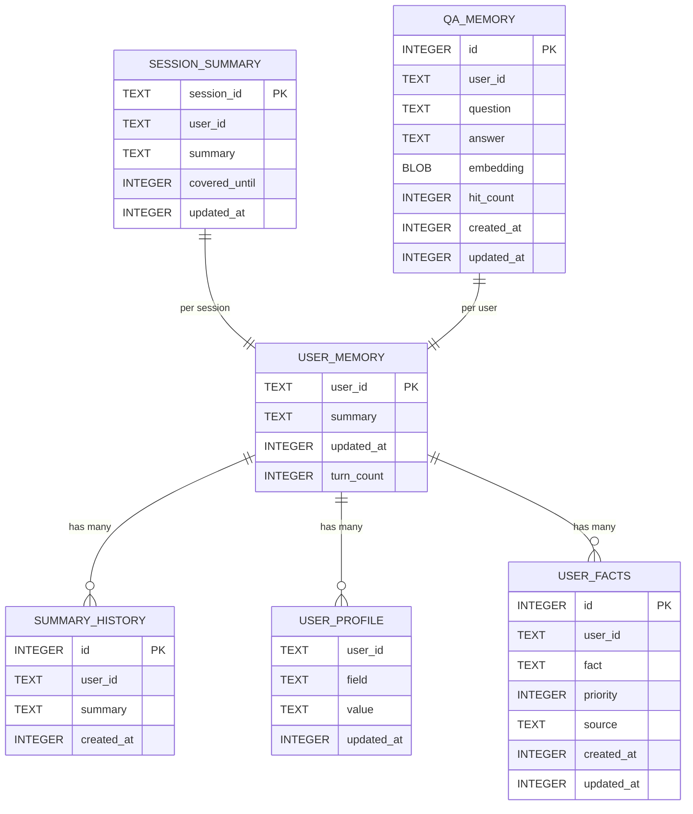
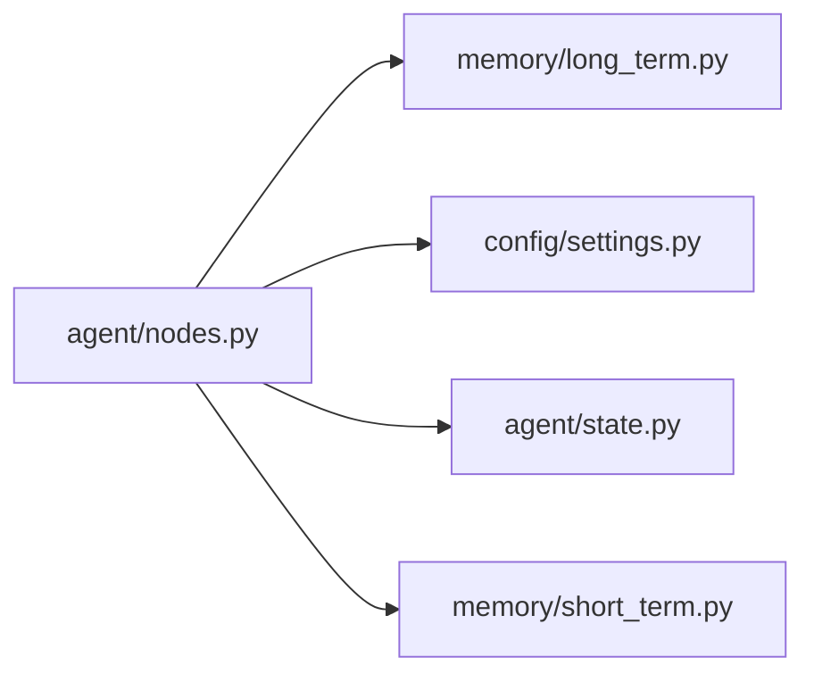

# 记忆更新节点

<cite>
**本文引用的文件**
- [agent/nodes.py](file://agent/nodes.py)
- [memory/long_term.py](file://memory/long_term.py)
- [memory/short_term.py](file://memory/short_term.py)
- [config/settings.py](file://config/settings.py)
- [agent/state.py](file://agent/state.py)
</cite>

## 目录
1. [简介](#简介)
2. [项目结构](#项目结构)
3. [核心组件](#核心组件)
4. [架构总览](#架构总览)
5. [详细组件分析](#详细组件分析)
6. [依赖关系分析](#依赖关系分析)
7. [性能考量](#性能考量)
8. [故障排查指南](#故障排查指南)
9. [结论](#结论)
10. [附录：自定义与优化示例](#附录自定义与优化示例)

## 简介
本技术文档聚焦于“记忆更新节点”的实现原理与工程实践，围绕 memory_update_node 函数展开，系统阐述以下能力：
- 长期记忆摘要生成：按轮次增量合并对话摘要，关键事实单独落库防丢失。
- 会话压缩更新：短期窗口超出时滚动压缩旧消息为会话摘要，避免上下文硬丢。
- 问答缓存保存：将知识类问答对（含向量）持久化，相似问题直接复用答案，跳过 LLM。
- 后台异步更新机制：在后台节点中合并执行抽取与更新，不阻塞主响应链路。
同时给出记忆更新策略、数据持久化方案、性能监控指标建议，并提供可操作的自定义与优化存储效率的实践路径。

## 项目结构
记忆更新相关代码主要分布在如下模块：
- agent/nodes.py：编排智能体工作流节点，包含 memory_update_node、_refresh_session_summary、_save_qa_cache、memory_background_node 等。
- memory/long_term.py：长期记忆 SQLite 持久化，提供摘要生成、增量合并、关键事实管理、会话摘要、问答缓存检索与写入等。
- memory/short_term.py：短期记忆基于 LangGraph MemorySaver，维护会话上下文与交互历史。
- config/settings.py：全局配置，包括记忆触发频率、预算、阈值、开关等。
- agent/state.py：AgentState 状态定义，承载消息历史、路由结果、记忆上下文、问答缓存命中标志等。

图表来源
- [agent/nodes.py:535-643](file://agent/nodes.py#L535-L643)
- [memory/long_term.py:172-633](file://memory/long_term.py#L172-L633)
- [memory/short_term.py:13-20](file://memory/short_term.py#L13-L20)
- [config/settings.py:114-133](file://config/settings.py#L114-L133)
- [agent/state.py:12-50](file://agent/state.py#L12-L50)

章节来源
- [agent/nodes.py:535-643](file://agent/nodes.py#L535-L643)
- [memory/long_term.py:172-633](file://memory/long_term.py#L172-L633)
- [memory/short_term.py:13-20](file://memory/short_term.py#L13-L20)
- [config/settings.py:114-133](file://config/settings.py#L114-L133)
- [agent/state.py:12-50](file://agent/state.py#L12-L50)

## 核心组件
- memory_update_node：每轮调用，递增轮次计数，周期性触发摘要生成；刷新会话压缩摘要；保存问答缓存。
- summarize_and_store / summarize_messages：LLM 驱动的摘要生成与增量合并，提取关键事实并落库。
- _refresh_session_summary：当短期窗口超出时，压缩旧消息为会话摘要并持久化。
- _save_qa_cache：仅对知识类回答（RAG/联网搜索）且非命中缓存的回答进行向量化与持久化。
- memory_background_node：后台节点，合并执行关键信息抽取与记忆更新，不阻塞主链路。
- long_term 模块：SQLite 表结构与读写接口，支持 WAL 并发读、键值索引、QA 向量相似度检索。
- settings：控制记忆更新频率、预算、阈值、开关等。

章节来源
- [agent/nodes.py:535-643](file://agent/nodes.py#L535-L643)
- [memory/long_term.py:561-633](file://memory/long_term.py#L561-L633)
- [memory/long_term.py:342-379](file://memory/long_term.py#L342-L379)
- [memory/long_term.py:729-800](file://memory/long_term.py#L729-L800)
- [config/settings.py:114-133](file://config/settings.py#L114-L133)

## 架构总览
记忆更新节点处于智能体工作流的尾部或后台分支，负责将本轮交互沉淀为长期记忆、维护会话压缩摘要、以及维护问答缓存。整体流程如下：

图表来源
- [agent/nodes.py:535-643](file://agent/nodes.py#L535-L643)
- [memory/long_term.py:500-633](file://memory/long_term.py#L500-L633)
- [memory/long_term.py:342-379](file://memory/long_term.py#L342-L379)
- [memory/long_term.py:729-800](file://memory/long_term.py#L729-L800)
- [config/settings.py:114-133](file://config/settings.py#L114-L133)

## 详细组件分析

### memory_update_node：记忆更新中枢
- 功能要点
  - 递增轮次计数，用于周期性触发摘要生成。
  - 每 N 轮调用 summarize_and_store，实现增量合并摘要，关键事实单独落库。
  - 调用 _refresh_session_summary 刷新会话压缩摘要。
  - 调用 _save_qa_cache 保存问答缓存。
  - 所有子步骤均 try/except 包裹，失败不影响主链路。
- 关键参数
  - user_id、messages、settings.memory_summary_every。
- 返回值
  - 空 dict，不覆盖 AgentState。

章节来源
- [agent/nodes.py:535-564](file://agent/nodes.py#L535-L564)
- [memory/long_term.py:500-518](file://memory/long_term.py#L500-L518)
- [memory/long_term.py:613-633](file://memory/long_term.py#L613-L633)

#### 长期记忆摘要生成流程

图表来源
- [memory/long_term.py:500-518](file://memory/long_term.py#L500-L518)
- [memory/long_term.py:561-633](file://memory/long_term.py#L561-L633)

章节来源
- [memory/long_term.py:561-633](file://memory/long_term.py#L561-L633)

#### 会话压缩更新流程

图表来源
- [agent/nodes.py:602-628](file://agent/nodes.py#L602-L628)
- [memory/long_term.py:342-379](file://memory/long_term.py#L342-L379)

章节来源
- [agent/nodes.py:602-628](file://agent/nodes.py#L602-L628)
- [memory/long_term.py:342-379](file://memory/long_term.py#L342-L379)

#### 问答缓存保存流程

图表来源
- [agent/nodes.py:567-599](file://agent/nodes.py#L567-L599)
- [memory/long_term.py:729-800](file://memory/long_term.py#L729-L800)

章节来源
- [agent/nodes.py:567-599](file://agent/nodes.py#L567-L599)
- [memory/long_term.py:729-800](file://memory/long_term.py#L729-L800)

#### 后台异步更新机制
- memory_background_node 顺序执行 extract_facts_node 与 memory_update_node。
- 两者内部均有独立异常保护，任一失败不影响另一者。
- 时效性问题（明确时间/天气）直接跳过长期记忆保存，避免过时信息污染。

章节来源
- [agent/nodes.py:630-643](file://agent/nodes.py#L630-L643)

### 长期记忆持久化方案
- 存储后端：SQLite，开启 WAL 模式以支持并发读，写操作串行但不会阻塞读。
- 表结构
  - user_memory：用户摘要、更新时间、轮次计数。
  - user_prefs：旧版偏好（兼容迁移）。
  - summary_history：摘要历史（保留最近 20 条）。
  - user_profile：用户画像字段（单值可更新）。
  - user_facts：关键事实（带优先级与来源）。
  - session_summary：会话压缩摘要（按 session 滚动）。
  - qa_memory：问答记忆缓存（问题向量 + 答案，余弦相似度检索）。
  - memory_meta：元数据（迁移标记等）。
- 索引与约束
  - 针对 user_id、updated_at、priority 等建立索引，提升查询性能。
  - 唯一约束防止重复插入，更新时覆盖或增量调整。

章节来源
- [memory/long_term.py:30-47](file://memory/long_term.py#L30-L47)
- [memory/long_term.py:50-126](file://memory/long_term.py#L50-L126)
- [memory/long_term.py:138-169](file://memory/long_term.py#L138-L169)
- [memory/long_term.py:172-196](file://memory/long_term.py#L172-L196)
- [memory/long_term.py:224-337](file://memory/long_term.py#L224-L337)
- [memory/long_term.py:342-379](file://memory/long_term.py#L342-L379)
- [memory/long_term.py:729-800](file://memory/long_term.py#L729-L800)

### 记忆更新策略
- 摘要触发频率：通过 settings.memory_summary_every 控制（默认 6 轮）。
- 预算控制：
  - 长期记忆上下文字符预算：settings.memory_context_budget（默认 1600）。
  - 短期历史字符预算：settings.memory_history_budget（默认 2000）。
  - RAG/联网搜索上下文字符预算：settings.rag_context_budget（默认 2500）。
- 问答缓存：
  - 开关：settings.memory_qa_cache_enabled。
  - 相似度阈值：settings.memory_qa_threshold（默认 0.90）。
  - 上限：settings.memory_qa_max_records（默认 200）。
- 关键信息抽取：
  - 规则快速抽取始终启用（零 LLM 成本）。
  - LLM 结构化抽取受 settings.memory_extract_llm_enabled 控制。

章节来源
- [config/settings.py:114-133](file://config/settings.py#L114-L133)
- [agent/nodes.py:363-412](file://agent/nodes.py#L363-L412)

### 数据模型与关系

图表来源
- [memory/long_term.py:50-126](file://memory/long_term.py#L50-L126)

## 依赖关系分析
- nodes.py 依赖 long_term.py 的摘要生成、会话摘要、问答缓存接口。
- nodes.py 依赖 settings.py 的记忆相关配置。
- nodes.py 使用 state.py 的 AgentState 传递状态。
- short_term.py 提供进程内 checkpointer，用于短期记忆上下文。

图表来源
- [agent/nodes.py:535-643](file://agent/nodes.py#L535-L643)
- [memory/long_term.py:172-633](file://memory/long_term.py#L172-L633)
- [config/settings.py:114-133](file://config/settings.py#L114-L133)
- [agent/state.py:12-50](file://agent/state.py#L12-L50)
- [memory/short_term.py:13-20](file://memory/short_term.py#L13-L20)

章节来源
- [agent/nodes.py:535-643](file://agent/nodes.py#L535-L643)
- [memory/long_term.py:172-633](file://memory/long_term.py#L172-L633)
- [config/settings.py:114-133](file://config/settings.py#L114-L133)
- [agent/state.py:12-50](file://agent/state.py#L12-L50)
- [memory/short_term.py:13-20](file://memory/short_term.py#L13-L20)

## 性能考量
- 数据库层
  - SQLite WAL 模式提升并发读性能，写操作串行化避免竞争。
  - 合理索引（user_id、updated_at、priority）减少扫描开销。
  - 摘要历史限制最近 20 条，问答缓存限制每用户最多 200 条，避免表膨胀。
- 算法层
  - 增量摘要合并降低信息丢失风险，关键事实单独落库保障高优先级信息。
  - 问答缓存相似度阈值可调，平衡命中率与准确性。
  - 会话压缩仅在旧消息累积到一定量时触发，避免频繁 LLM 调用。
- 配置层
  - memory_summary_every 控制摘要频率，过高会增加 LLM 调用成本。
  - memory_context_budget、memory_history_budget 控制注入上下文大小，影响延迟与质量。
  - memory_qa_threshold、memory_qa_max_records 控制问答缓存行为。

[本节为通用性能讨论，不直接分析具体文件]

## 故障排查指南
- 常见问题定位
  - 摘要生成失败：检查 LLM 配置与网络，查看日志中的摘要降级提示。
  - 会话压缩未触发：确认短期窗口设置与历史消息数量，检查 covered_until 逻辑。
  - 问答缓存未命中：检查 embedding 是否成功生成、相似度阈值是否过高。
  - 数据库写入失败：检查 SQLite 文件权限、WAL 模式是否正常。
- 日志关键字
  - "[memory] 更新长期记忆失败"
  - "[memory] 刷新会话摘要失败"
  - "[memory] 保存问答记忆失败"
  - "[long_term] LLM 摘要失败，使用简单截断"
- 修复建议
  - 调整 settings 中的阈值与预算。
  - 清理过期数据（摘要历史、问答缓存）。
  - 校验 user_id、session_id 是否正确传递。

章节来源
- [agent/nodes.py:535-564](file://agent/nodes.py#L535-L564)
- [memory/long_term.py:606-610](file://memory/long_term.py#L606-L610)

## 结论
memory_update_node 作为记忆系统的中枢，协调了长期记忆摘要生成、会话压缩更新与问答缓存保存，并通过后台节点实现非阻塞更新。结合 SQLite 持久化与分层预算策略，系统在保证信息不丢失的前提下实现了高效、可控的记忆管理。通过合理配置与扩展，可进一步优化存储效率与响应性能。

[本节为总结性内容，不直接分析具体文件]

## 附录：自定义与优化示例
以下为可操作的自定义与优化实践路径（以代码片段路径引用代替具体代码内容）：

- 自定义记忆更新策略
  - 调整摘要触发频率：修改 settings.memory_summary_every，参考 [config/settings.py:114-133](file://config/settings.py#L114-L133)。
  - 自定义预算分配：调整 memory_context_budget、memory_history_budget，参考 [config/settings.py:114-133](file://config/settings.py#L114-L133)。
  - 自定义问答缓存阈值与上限：调整 memory_qa_threshold、memory_qa_max_records，参考 [config/settings.py:114-133](file://config/settings.py#L114-L133)。

- 优化存储效率
  - 限制摘要历史条数：已在 long_term.py 中实现最近 20 条限制，参考 [memory/long_term.py:172-196](file://memory/long_term.py#L172-L196)。
  - 问答缓存淘汰策略：已实现按更新时间淘汰最旧记录，参考 [memory/long_term.py:729-800](file://memory/long_term.py#L729-L800)。
  - 会话压缩触发条件：仅在旧消息累积到一定量时触发，参考 [agent/nodes.py:602-628](file://agent/nodes.py#L602-L628)。

- 扩展记忆类型
  - 新增用户画像字段：在 user_profile 表中扩展字段，参考 [memory/long_term.py:224-258](file://memory/long_term.py#L224-L258)。
  - 新增关键事实来源：在 user_facts 表中增加 source 标识，参考 [memory/long_term.py:261-337](file://memory/long_term.py#L261-L337)。

- 监控与指标建议
  - 记录每次摘要生成的耗时与 token 数。
  - 统计问答缓存命中率与相似度分布。
  - 监控会话压缩触发频率与摘要长度。
  - 跟踪 SQLite 写入延迟与锁等待时间。

[本节为实践指导，不直接分析具体文件]