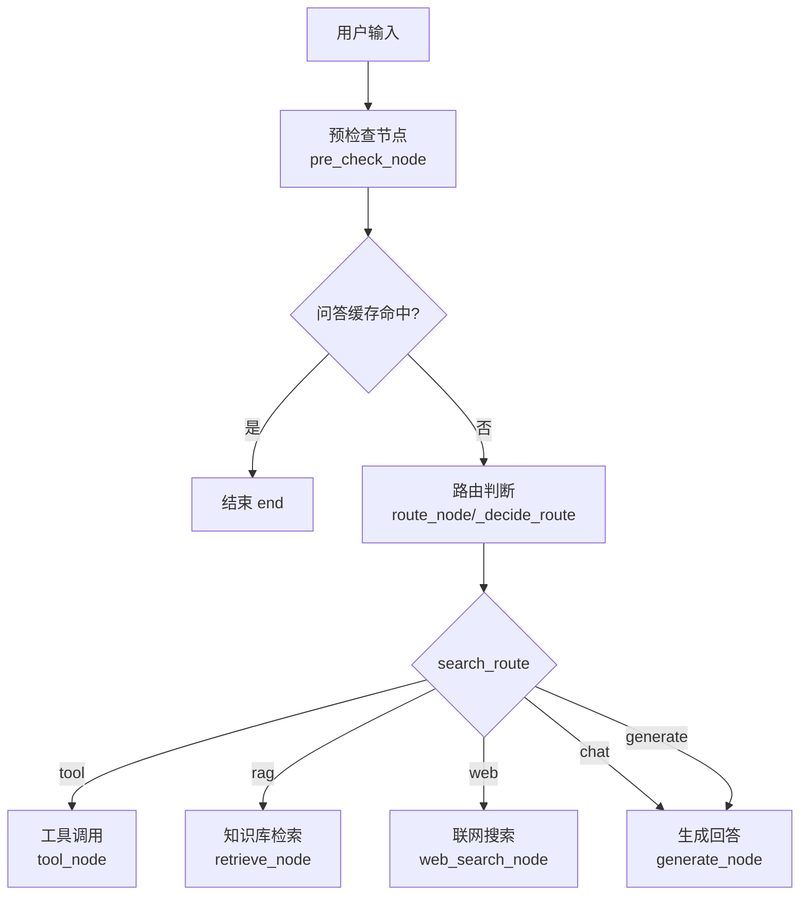
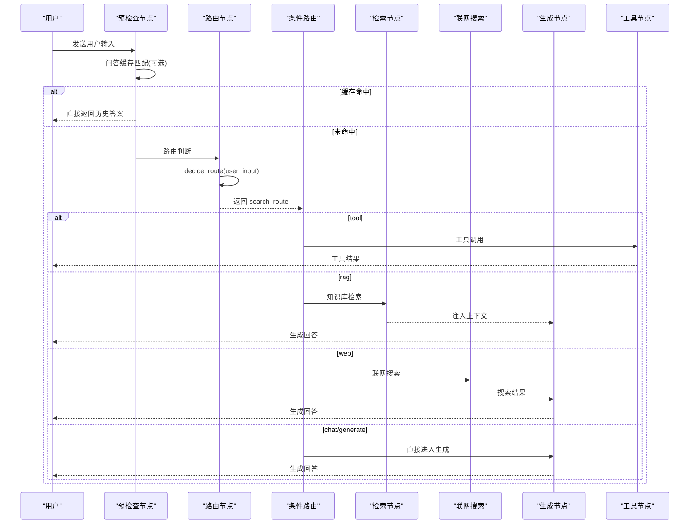
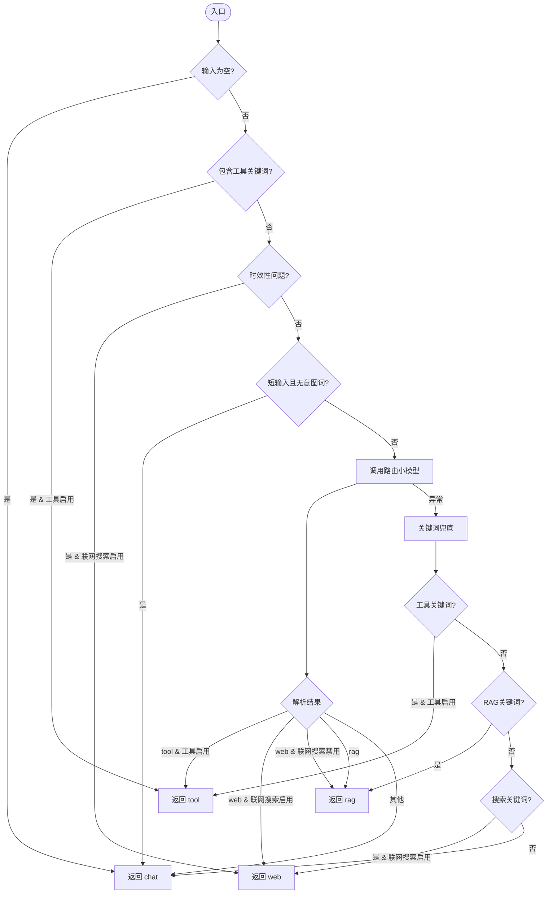
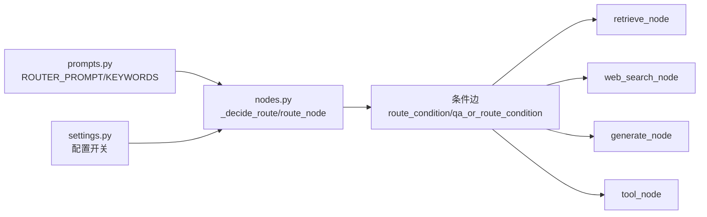

# 路由判断节点

<cite>
**本文引用的文件**
- [agent/nodes.py](file://agent/nodes.py)
- [config/settings.py](file://config/settings.py)
- [agent/prompts.py](file://agent/prompts.py)
</cite>

## 目录
1. [简介](#简介)
2. [项目结构](#项目结构)
3. [核心组件](#核心组件)
4. [架构总览](#架构总览)
5. [详细组件分析](#详细组件分析)
6. [依赖关系分析](#依赖关系分析)
7. [性能考量](#性能考量)
8. [故障排查指南](#故障排查指南)
9. [结论](#结论)
10. [附录：扩展新路由类型示例](#附录：扩展新路由类型示例)

## 简介
本技术文档聚焦于“路由判断节点”，全面解析 route_node 与 _decide_route 的实现机制，说明五路分流（tool/rag/web/chat/generate）的判断逻辑、LLM 路由与关键词兜底的结合策略、时效性问题的快速识别机制，并给出配置开关影响、降级策略与扩展新路由类型的实践方法。

## 项目结构
- 路由判断的核心逻辑集中在 agent/nodes.py，包含预检查、路由判断、条件边分发以及后续检索/生成/工具调用等节点。
- 配置项集中在 config/settings.py，控制 LLM、RAG、联网搜索、工具调用、记忆等能力开关与参数。
- 路由提示词与关键词集合在 agent/prompts.py，定义 ROUTER_PROMPT、ROUTER_KEYWORDS、WEB_SEARCH_KEYWORDS、TOOL_KEYWORDS 等。

图表来源
- [agent/nodes.py:93-158](file://agent/nodes.py#L93-L158)
- [agent/nodes.py:214-229](file://agent/nodes.py#L214-L229)

章节来源
- [agent/nodes.py:93-158](file://agent/nodes.py#L93-L158)
- [agent/nodes.py:214-229](file://agent/nodes.py#L214-L229)
- [config/settings.py:109-155](file://config/settings.py#L109-L155)
- [agent/prompts.py:85-127](file://agent/prompts.py#L85-L127)

## 核心组件
- route_node：从状态中读取 user_input，调用 _decide_route 计算 search_route，并写回状态。
- _decide_route：实现“LLM 路由 + 关键词兜底”的五路分流决策，含工具优先短路、时效性问题快速识别、短输入闲聊倾向、LLM 失败降级到关键词兜底。
- pre_check_node：合并执行问答缓存匹配与路由判断；若缓存命中则短路至 END，否则进入路由分支。
- route_condition / qa_or_route_condition：根据 search_route 或 memory_hit 决定下一跳节点（retrieve/web_search/generate）。

章节来源
- [agent/nodes.py:93-158](file://agent/nodes.py#L93-L158)
- [agent/nodes.py:161-211](file://agent/nodes.py#L161-L211)
- [agent/nodes.py:214-229](file://agent/nodes.py#L214-L229)

## 架构总览
下图展示从用户输入到最终回答的完整路由流程，包括预检查、路由判断、条件边分发与后续处理节点。

图表来源
- [agent/nodes.py:93-158](file://agent/nodes.py#L93-L158)
- [agent/nodes.py:214-229](file://agent/nodes.py#L214-L229)
- [agent/nodes.py:284-341](file://agent/nodes.py#L284-L341)
- [agent/nodes.py:499-532](file://agent/nodes.py#L499-L532)
- [agent/nodes.py:647-690](file://agent/nodes.py#L647-L690)

## 详细组件分析

### 路由判断节点 route_node
- 职责：从 AgentState 获取 user_input，调用 _decide_route 得到 search_route，并写入状态供后续条件边使用。
- 特点：轻量、无副作用，仅负责路由决策。

章节来源
- [agent/nodes.py:154-158](file://agent/nodes.py#L154-L158)

### 路由决策函数 _decide_route
- 决策顺序与策略：
  - 空输入：默认走 chat。
  - 工具关键词短路：若包含 TOOL_KEYWORDS 且开启工具调用，直接返回 tool。
  - 时效性问题快速识别：若为天气/时间表达等，且开启联网搜索，直接返回 web，绕过 LLM 提速。
  - 短输入闲聊倾向：长度<=4 且不含疑问/搜索/工具关键词时，倾向于 chat。
  - LLM 路由：调用路由小模型，按 prompt 输出 rag/web/chat/tool；若 web 关闭则降级为 rag。
  - 异常降级：LLM 调用失败时，退化为关键词兜底（工具优先 → RAG 优先 → 联网搜索 → chat）。
- 关键特性：
  - 工具优先短路，减少误判。
  - 时效性问题快速识别，避免过时知识污染长期记忆。
  - 配置开关联动：tool_calling_enabled、web_search_enabled 直接影响分支选择。
  - 降级策略：LLM 失败时保证基本可用性。

图表来源
- [agent/nodes.py:161-211](file://agent/nodes.py#L161-L211)
- [agent/nodes.py:80-89](file://agent/nodes.py#L80-L89)
- [agent/prompts.py:85-127](file://agent/prompts.py#L85-L127)
- [config/settings.py:109-155](file://config/settings.py#L109-L155)

章节来源
- [agent/nodes.py:161-211](file://agent/nodes.py#L161-L211)
- [agent/nodes.py:80-89](file://agent/nodes.py#L80-L89)
- [agent/prompts.py:85-127](file://agent/prompts.py#L85-L127)
- [config/settings.py:109-155](file://config/settings.py#L109-L155)

### 预检查节点 pre_check_node
- 职责：先尝试问答缓存匹配，命中则直接返回答案并标记 memory_hit=True，跳过路由；否则执行路由判断。
- 特殊处理：若上一轮有 pending_confirmation，当前轮确认则直接执行工具并短路到 END。

章节来源
- [agent/nodes.py:93-128](file://agent/nodes.py#L93-L128)

### 条件路由 route_condition / qa_or_route_condition
- route_condition：根据 search_route 决定下一跳（retrieve/web_search/generate）。
- qa_or_route_condition：若 memory_hit=True，直接跳到 end，否则按 search_route 分流。

章节来源
- [agent/nodes.py:214-229](file://agent/nodes.py#L214-L229)

### 时效性问题快速识别 _is_realtime_query
- 规则：包含天气相关关键词或明确时间表达式（相对日期、年月日、时间点等），即判定为时效性问题。
- 作用：优先走联网搜索，避免过时知识污染长期记忆，同时提升响应速度。

章节来源
- [agent/nodes.py:80-89](file://agent/nodes.py#L80-L89)

### 配置开关影响
- tool_calling_enabled：控制是否允许 tool 路由；关闭后 tool 分支将降级为 chat。
- web_search_enabled：控制是否允许 web 路由；关闭后 web 分支将降级为 rag。
- llm_router_model：路由小模型名称，用于轻量级路由任务。
- memory_qa_cache_enabled：问答缓存开关，命中则跳过路由与生成链路。
- rerank_enabled、rag_bm25_enabled：影响检索路径与过滤阈值，间接影响生成质量。

章节来源
- [config/settings.py:109-155](file://config/settings.py#L109-L155)
- [agent/nodes.py:161-211](file://agent/nodes.py#L161-L211)

## 依赖关系分析
- nodes.py 依赖 prompts.py 中的路由提示词与关键词集合。
- nodes.py 通过 settings.py 获取运行时配置，动态控制各分支行为。
- 条件边依赖 AgentState 字段（如 search_route、memory_hit、pending_confirmation）。

图表来源
- [agent/prompts.py:85-127](file://agent/prompts.py#L85-L127)
- [config/settings.py:109-155](file://config/settings.py#L109-L155)
- [agent/nodes.py:154-229](file://agent/nodes.py#L154-L229)

章节来源
- [agent/nodes.py:154-229](file://agent/nodes.py#L154-L229)
- [agent/prompts.py:85-127](file://agent/prompts.py#L85-L127)
- [config/settings.py:109-155](file://config/settings.py#L109-L155)

## 性能考量
- 时效性问题快速识别：通过关键词与正则匹配，避免 LLM 调用，降低延迟。
- 问答缓存命中短路：命中时直接返回历史答案，跳过路由与生成链路，显著提升重复问题响应速度。
- 路由小模型：使用轻量模型进行路由判断，降低主模型开销。
- 检索与重排序：仅在纯向量检索路径下应用相关度阈值过滤，避免融合分数语义不一致导致的误判。
- 流式生成与降级：主模型失败自动尝试备用模型列表，保障可用性。

[本节提供通用指导，不直接分析具体文件]

## 故障排查指南
- LLM 路由失败：日志会打印 “[route] LLM 路由失败，使用关键词兜底”，此时系统会退化为关键词判断，确保基本可用。
- 工具调用失败：工具执行异常会返回错误信息，并在前端提示操作失败。
- 联网搜索失败：日志打印 “[web_search] 联网搜索失败”，返回空上下文，生成节点仍可使用其他上下文作答。
- 检索失败：日志打印 “[retrieve] 检索失败”，返回空上下文，不影响生成链路。
- 记忆更新失败：后台记忆节点内部 try/except 保护，任一失败不影响另一者。

章节来源
- [agent/nodes.py:198-211](file://agent/nodes.py#L198-L211)
- [agent/nodes.py:324-341](file://agent/nodes.py#L324-L341)
- [agent/nodes.py:284-321](file://agent/nodes.py#L284-L321)
- [agent/nodes.py:535-564](file://agent/nodes.py#L535-L564)

## 结论
路由判断节点通过“LLM 路由 + 关键词兜底”的组合策略，实现了稳定、可配置、可扩展的五路分流（tool/rag/web/chat/generate）。时效性问题快速识别与问答缓存短路显著提升了性能与准确性；配置开关提供了灵活的运行时控制；异常降级确保了系统的鲁棒性。通过本文档的流程与示例，用户可以安全地扩展新的路由类型并集成到现有工作流中。

[本节总结性内容，不直接分析具体文件]

## 附录：扩展新路由类型示例
以下以新增一个“代码解释”路由为例，展示如何在不破坏现有逻辑的前提下扩展新路由类型。

步骤概览
- 在 prompts.py 中添加新路由的提示词与关键词。
- 在 nodes.py 的 _decide_route 中增加对新关键词的快速判断与 LLM 解析分支。
- 在条件路由中增加新分支到对应处理节点。
- 新增处理节点（例如 code_explain_node），实现具体逻辑。
- 在 settings.py 中如需新增开关，添加相应配置项。

参考路径
- 提示词与关键词定义位置：[agent/prompts.py:85-127](file://agent/prompts.py#L85-L127)
- 路由决策函数位置：[agent/nodes.py:161-211](file://agent/nodes.py#L161-L211)
- 条件路由位置：[agent/nodes.py:214-229](file://agent/nodes.py#L214-L229)
- 配置开关位置：[config/settings.py:109-155](file://config/settings.py#L109-L155)

注意
- 保持优先级一致：工具优先、时效性优先、RAG 优先、聊天兜底。
- 新增分支需考虑配置开关与降级策略，确保异常情况下仍可回退到 chat。
- 新增处理节点应遵循现有节点的 try/except 模式，保证健壮性。

[本节为概念性指导，不直接分析具体文件]