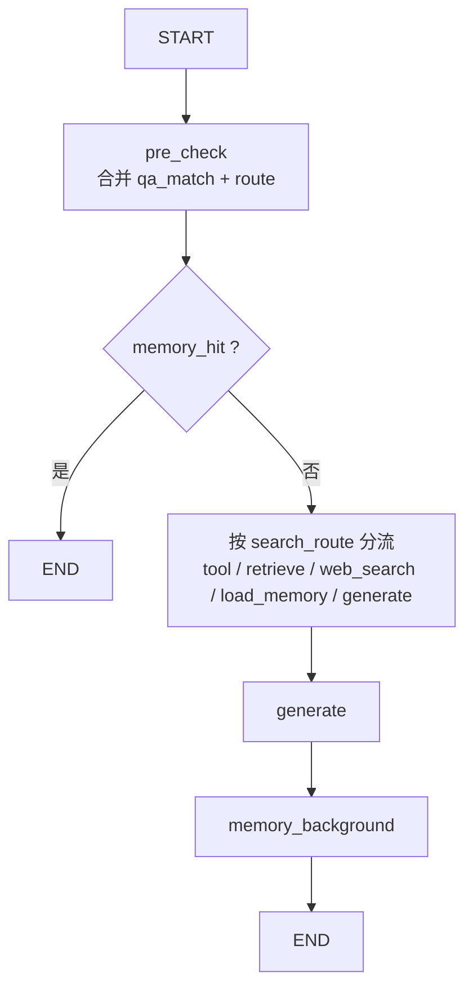
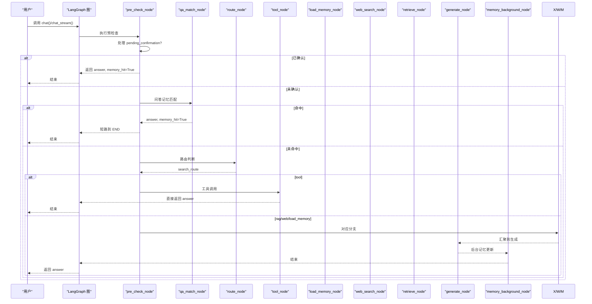
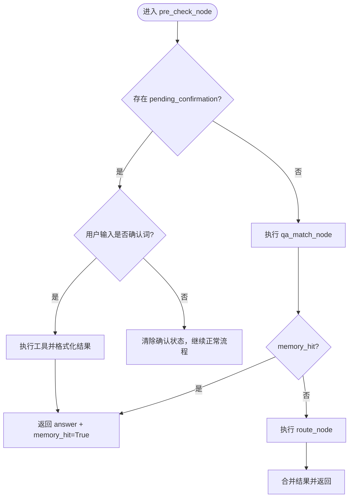
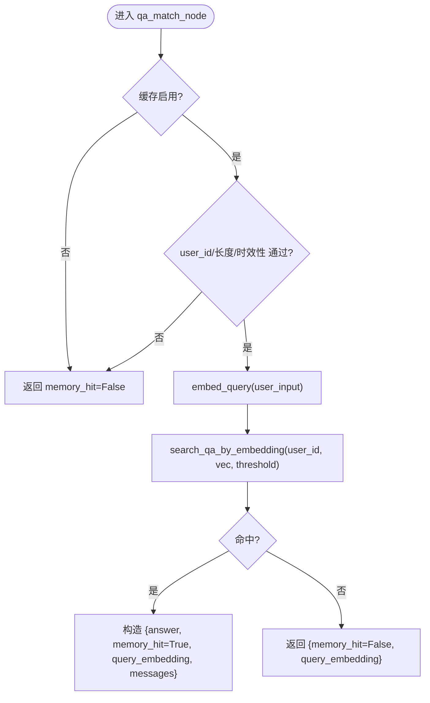
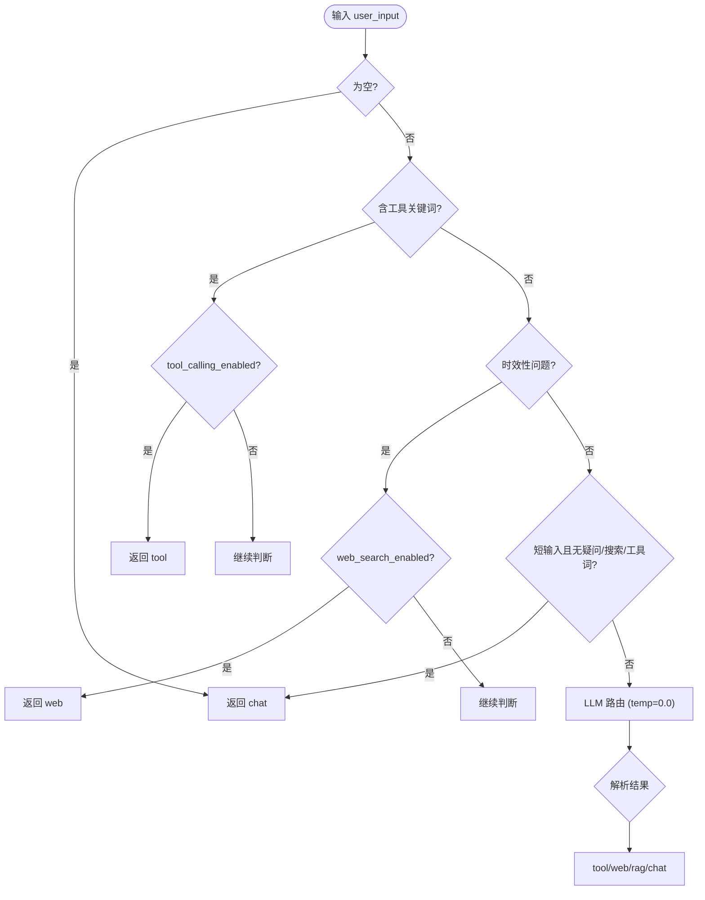
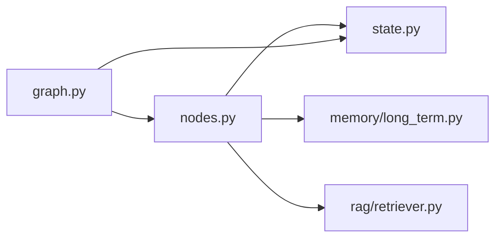

# 预检查节点

<cite>
**本文引用的文件**
- [agent/nodes.py](file://agent/nodes.py)
- [agent/graph.py](file://agent/graph.py)
- [agent/state.py](file://agent/state.py)
- [memory/long_term.py](file://memory/long_term.py)
- [rag/retriever.py](file://rag/retriever.py)
</cite>

## 目录
1. [简介](#简介)
2. [项目结构](#项目结构)
3. [核心组件](#核心组件)
4. [架构总览](#架构总览)
5. [详细组件分析](#详细组件分析)
6. [依赖关系分析](#依赖关系分析)
7. [性能考量](#性能考量)
8. [故障排查指南](#故障排查指南)
9. [结论](#结论)
10. [附录：输入输出与示例](#附录输入输出与示例)

## 简介
本技术文档聚焦于“预检查节点”的实现与执行流程，重点解析 pre_check_node 函数如何合并问答缓存匹配与路由判断、如何处理用户确认状态（pending_confirmation）、以及 memory_hit 短路机制如何跳过后续生成链路。同时给出错误处理策略、性能优化建议，并提供具体代码片段路径以演示 pending_confirmation 的处理和 memory_hit 的短路行为。

## 项目结构
预检查节点位于智能体工作流的最前端，负责两件事：
- 优先处理“工具调用确认”状态（上一轮写操作需要用户确认）；
- 顺序执行“问答记忆匹配”和“路由判断”，并合并结果；若命中问答记忆则直接返回答案，触发条件边短路到结束。

图表来源
- [agent/graph.py:44-102](file://agent/graph.py#L44-L102)
- [agent/nodes.py:92-151](file://agent/nodes.py#L92-L151)

章节来源
- [agent/graph.py:44-102](file://agent/graph.py#L44-L102)
- [agent/nodes.py:92-151](file://agent/nodes.py#L92-L151)

## 核心组件
- pre_check_node：合并执行 qa_match_node 与 route_node，优先处理 pending_confirmation；命中问答记忆时设置 memory_hit=True 并提前返回。
- pre_check_condition：根据 memory_hit 与 search_route 决定下一步分支。
- qa_match_node：基于向量相似度在用户问答记忆中检索相似问题，命中则复用历史答案。
- route_node/_decide_route：结合关键词与 LLM 路由，选择 tool/rag/web/chat。
- AgentState：定义状态字段，包括 user_input、search_route、memory_hit、pending_confirmation、confirmation_context 等。

章节来源
- [agent/nodes.py:92-151](file://agent/nodes.py#L92-L151)
- [agent/nodes.py:153-230](file://agent/nodes.py#L153-L230)
- [agent/nodes.py:232-282](file://agent/nodes.py#L232-L282)
- [agent/state.py:12-51](file://agent/state.py#L12-L51)

## 架构总览
预检查节点处于 LangGraph 状态图起始位置，统一入口后通过条件边分流。其关键特性：
- 先处理“待确认”的工具调用，避免重复走生成链路；
- 问答记忆命中即短路至 END，节省 LLM 调用与检索成本；
- 未命中则进入路由判断，按意图分流到工具、知识库、联网搜索或长期记忆加载后再生成。

图表来源
- [agent/graph.py:44-102](file://agent/graph.py#L44-L102)
- [agent/nodes.py:92-151](file://agent/nodes.py#L92-L151)
- [agent/nodes.py:153-230](file://agent/nodes.py#L153-L230)
- [agent/nodes.py:232-282](file://agent/nodes.py#L232-L282)
- [agent/nodes.py:284-341](file://agent/nodes.py#L284-L341)
- [agent/nodes.py:344-360](file://agent/nodes.py#L344-L360)
- [agent/nodes.py:499-532](file://agent/nodes.py#L499-L532)
- [agent/nodes.py:535-564](file://agent/nodes.py#L535-L564)

## 详细组件分析

### 预检查节点 pre_check_node
职责与流程
- 优先处理 pending_confirmation：若上一轮为写操作且当前用户输入为确认词，则从 confirmation_context 取出工具名与参数，执行工具并格式化结果，返回 answer 并标记 memory_hit=True 以短路到 END。
- 若未处于确认态，则顺序执行 qa_match_node 与 route_node，合并结果。若 qa_match 命中（memory_hit=True），直接返回，不再执行路由。

关键点
- 确认词集合包含中英文多种表达，便于用户快速确认。
- 命中问答记忆时，不仅返回 answer，还注入 messages 用于短期上下文连贯。
- 该节点不阻塞主响应链路，所有异常均被捕获并降级为未命中或未路由。

图表来源
- [agent/nodes.py:92-128](file://agent/nodes.py#L92-L128)
- [agent/nodes.py:232-282](file://agent/nodes.py#L232-L282)

章节来源
- [agent/nodes.py:92-128](file://agent/nodes.py#L92-L128)

### 问答缓存匹配 qa_match_node
实现要点
- 开关控制：当 settings.memory_qa_cache_enabled 关闭时直接返回未命中。
- 前置过滤：无 user_id、输入过短（<4）、或时效性问题（天气/明确时间表达）不匹配缓存，避免过时答案。
- 向量化与检索：使用 embeddings 将用户输入转为向量，调用 long_term.search_qa_by_embedding 进行余弦相似度检索，阈值由配置 memory_qa_threshold 控制。
- 命中处理：返回 answer、memory_hit=True、query_embedding，并注入 messages 以保持多轮上下文连贯。
- 失败降级：向量化或检索异常时静默降级为未命中，不阻断主链路。

图表来源
- [agent/nodes.py:232-282](file://agent/nodes.py#L232-L282)
- [memory/long_term.py:784-819](file://memory/long_term.py#L784-L819)

章节来源
- [agent/nodes.py:232-282](file://agent/nodes.py#L232-L282)
- [memory/long_term.py:784-819](file://memory/long_term.py#L784-L819)

### 路由判断 route_node 与 _decide_route
决策逻辑
- 空输入默认闲聊。
- 工具调用关键词优先（受 settings.tool_calling_enabled 控制）。
- 时效性问题优先联网搜索（受 settings.web_search_enabled 控制）。
- 短输入且不含疑问/搜索/工具关键词倾向于闲聊。
- 否则调用路由小模型（temperature=0.0）进行意图分类，并根据配置决定是否允许 web 搜索。
- 异常时回退到关键词兜底，保证鲁棒性。

图表来源
- [agent/nodes.py:153-212](file://agent/nodes.py#L153-L212)

章节来源
- [agent/nodes.py:153-212](file://agent/nodes.py#L153-L212)

### 条件路由 pre_check_condition
规则
- 若 memory_hit 为真，直接返回 "end"，跳过后续生成链路。
- 否则依据 search_route 分流：
  - tool → "tool"
  - rag → "retrieve"
  - web → "web_search"
  - 其他 → "load_memory"（随后进入 generate）

章节来源
- [agent/nodes.py:131-151](file://agent/nodes.py#L131-L151)

### 工具调用与确认流程 tool_node
流程
- LLM 提取工具名与参数；未识别则降级为普通回答。
- 查询类操作（如 query_todos/query_meetings）直接执行并返回结果。
- 写操作在 settings.tool_confirmation_required 开启时需用户确认；确认后通过 pre_check_node 的 pending_confirmation 分支执行。
- 无需确认则直接执行并返回结果。

章节来源
- [agent/nodes.py:646-690](file://agent/nodes.py#L646-L690)

## 依赖关系分析
- nodes.py 依赖 state.py 的 AgentState 类型定义。
- nodes.py 中的 qa_match_node 依赖 rag/embeddings 与 memory/long_term 的检索能力。
- nodes.py 的路由逻辑依赖 config.settings 的功能开关（tool_calling_enabled、web_search_enabled）。
- graph.py 将 pre_check_node、route_node、retrieve_node、web_search_node、load_memory_node、generate_node、memory_background_node 编排为状态图，并通过条件边实现短路。

图表来源
- [agent/graph.py:31-41](file://agent/graph.py#L31-L41)
- [agent/nodes.py:20-21](file://agent/nodes.py#L20-L21)
- [agent/nodes.py:232-282](file://agent/nodes.py#L232-L282)
- [rag/retriever.py:18-53](file://rag/retriever.py#L18-L53)

章节来源
- [agent/graph.py:31-41](file://agent/graph.py#L31-L41)
- [agent/nodes.py:20-21](file://agent/nodes.py#L20-L21)
- [rag/retriever.py:18-53](file://rag/retriever.py#L18-L53)

## 性能考量
- 问答记忆短路：命中时直接返回答案，避免 LLM 调用与检索开销，显著降低延迟与成本。
- 路由快速路径：工具关键词与时效性问题优先短路，减少不必要的 LLM 路由调用。
- 后台记忆更新：extract_facts_node 与 memory_update_node 在 memory_background_node 中顺序执行，内部均有独立 try/except，不阻塞主响应链路。
- 检索优化：retrieve_node 支持 BM25 与重排序组合，纯向量路径下可应用相关度阈值过滤以减少上下文大小。
- 会话摘要压缩：_refresh_session_summary 仅在窗口外消息达到阈值时触发，避免每轮重复调用 LLM。

[本节提供通用指导，不直接分析具体文件]

## 故障排查指南
常见问题与定位
- 问答记忆未命中：
  - 检查 settings.memory_qa_cache_enabled 是否开启。
  - 确认 user_id 是否存在且 user_input 长度≥4。
  - 时效性问题会被主动排除，需走联网搜索。
  - 向量化或检索异常会静默降级为未命中，查看日志中的 “[qa_match]” 提示。
- 路由异常：
  - 路由小模型调用失败时会回退到关键词兜底，查看 “[route] LLM 路由失败” 日志。
  - 检查 tool_calling_enabled 与 web_search_enabled 配置是否允许相应分支。
- 工具确认未生效：
  - 确认上一轮 tool_node 返回了 pending_confirmation 与 confirmation_context。
  - 当前轮次用户输入需为确认词集合之一，否则清除确认状态并走正常流程。
- 生成失败与降级：
  - generate_node 主模型失败后会尝试备用模型列表，最终失败返回汇总错误信息。

章节来源
- [agent/nodes.py:180-212](file://agent/nodes.py#L180-L212)
- [agent/nodes.py:232-282](file://agent/nodes.py#L232-L282)
- [agent/nodes.py:467-497](file://agent/nodes.py#L467-L497)

## 结论
预检查节点通过“确认态优先 + 问答记忆短路 + 路由合并”的设计，在保证用户体验的同时显著降低了系统开销。其关键优势在于：
- 对写操作的二次确认机制，提升安全性与可控性；
- 问答记忆命中直接复用历史答案，避免重复计算；
- 路由判断融合关键词与 LLM，兼顾速度与准确性；
- 后台记忆更新不阻塞主链路，保障响应时效。

[本节总结性内容，不直接分析具体文件]

## 附录：输入输出与示例

### 输入输出格式
- 输入（AgentState 关键字段）
  - user_input: 字符串，用户当前输入
  - user_id: 字符串，用户标识
  - session_id: 字符串，会话标识
  - pending_confirmation: 布尔，是否等待用户确认
  - confirmation_context: 字典，包含 name 与 parameters
  - messages: 消息历史（自动累加）
- 输出（节点返回值，增量覆盖状态）
  - answer: 字符串，最终回答
  - memory_hit: 布尔，问答记忆命中标志
  - search_route: 字符串，路由结果（tool/rag/web/chat）
  - pending_confirmation: 布尔，工具确认状态
  - confirmation_context: 字典，待执行工具上下文
  - query_embedding: 可选，问题向量（供落库复用）
  - messages: 消息列表（命中时注入，保持上下文连贯）

章节来源
- [agent/state.py:12-51](file://agent/state.py#L12-L51)
- [agent/nodes.py:92-128](file://agent/nodes.py#L92-L128)
- [agent/nodes.py:232-282](file://agent/nodes.py#L232-L282)

### 示例：处理 pending_confirmation 状态
- 场景：上一轮 tool_node 返回 pending_confirmation=True 与 confirmation_context；本轮用户输入为确认词。
- 行为：pre_check_node 检测到 pending_confirmation，校验用户输入是否为确认词；若是，则从 confirmation_context 取出工具名与参数，执行工具并格式化结果，返回 answer 并设置 memory_hit=True 以短路到 END。
- 参考路径
  - [agent/nodes.py:100-119](file://agent/nodes.py#L100-L119)
  - [agent/nodes.py:646-690](file://agent/nodes.py#L646-L690)

### 示例：memory_hit 短路机制
- 场景：qa_match_node 命中问答记忆，返回 answer 与 memory_hit=True。
- 行为：pre_check_node 检测到 memory_hit 后立即返回，pre_check_condition 判定为 "end"，跳过路由与生成链路，直接结束。
- 参考路径
  - [agent/nodes.py:121-128](file://agent/nodes.py#L121-L128)
  - [agent/nodes.py:131-151](file://agent/nodes.py#L131-L151)
  - [agent/nodes.py:232-282](file://agent/nodes.py#L232-L282)