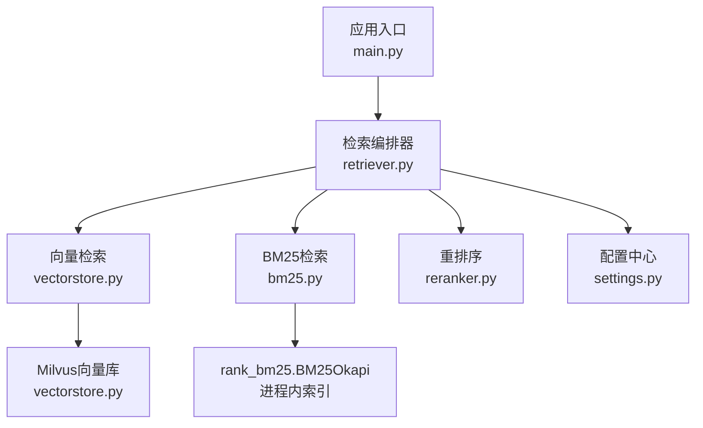
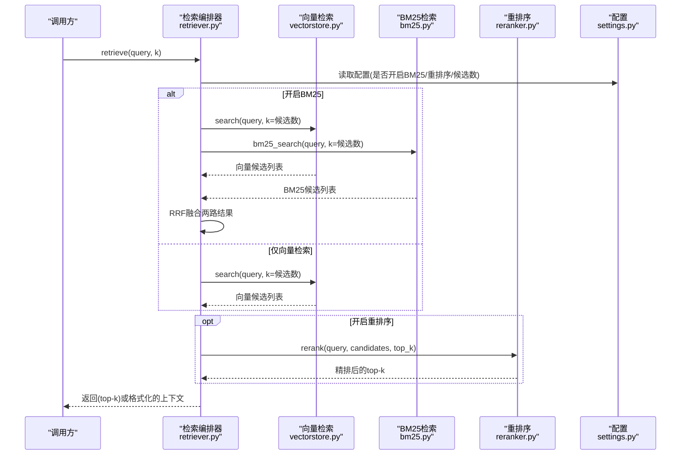
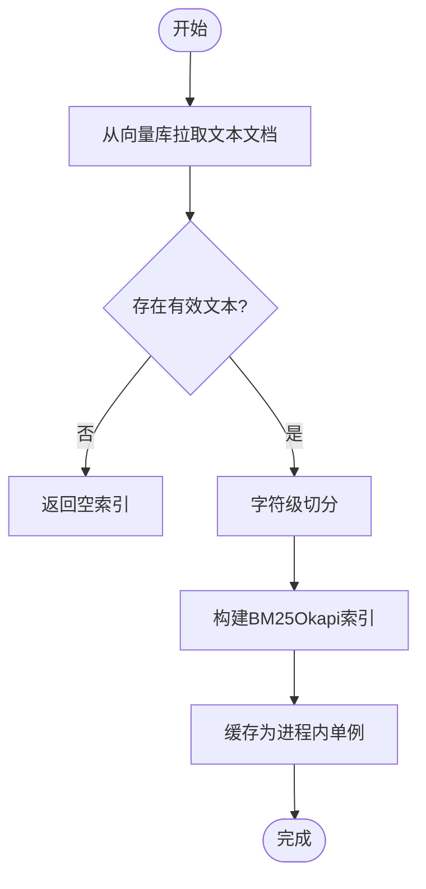
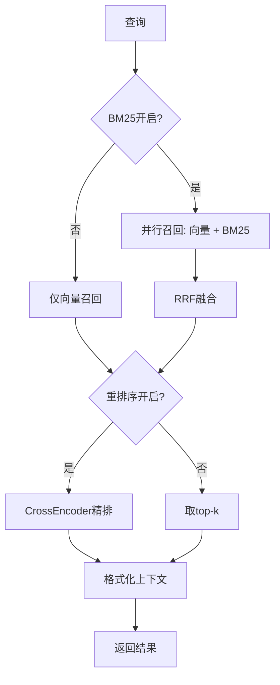
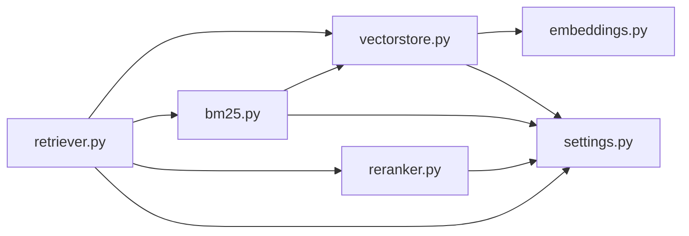

# BM25关键词检索

<cite>
**本文引用的文件**
- [rag/bm25.py](file://rag/bm25.py)
- [rag/retriever.py](file://rag/retriever.py)
- [rag/vectorstore.py](file://rag/vectorstore.py)
- [config/settings.py](file://config/settings.py)
- [main.py](file://main.py)
- [rag/reranker.py](file://rag/reranker.py)
- [rag/embeddings.py](file://rag/embeddings.py)
</cite>

## 目录
1. [简介](#简介)
2. [项目结构](#项目结构)
3. [核心组件](#核心组件)
4. [架构总览](#架构总览)
5. [详细组件分析](#详细组件分析)
6. [依赖关系分析](#依赖关系分析)
7. [性能与优化](#性能与优化)
8. [故障排查指南](#故障排查指南)
9. [结论](#结论)
10. [附录：配置示例与使用场景](#附录配置示例与使用场景)

## 简介
本技术文档围绕项目中的BM25关键词检索能力，系统阐述传统关键词检索算法、倒排索引构建、相关性评分计算、查询处理与结果排序机制；并重点说明BM25在本项目中的实现方式、参数调优策略、与向量检索的融合方案（RRF）以及性能优化方法。同时提供索引构建流程、运行时预热与增量同步、以及与重排序模块协同工作的完整链路说明，帮助读者快速理解与正确使用该功能。

## 项目结构
本项目将BM25作为“多路召回”的一路，与向量检索并行召回后通过RRF融合，再可选地进入CrossEncoder重排序阶段。关键文件职责如下：
- rag/bm25.py：BM25内存索引构建、查询与重置接口
- rag/retriever.py：检索编排器，负责多路召回、RRF融合、重排序与上下文格式化
- rag/vectorstore.py：Milvus向量库封装，提供文本/图像入库、检索、全量拉取等能力
- config/settings.py：全局配置，包含BM25开关、候选数、RRF常数、重排序等参数
- main.py：服务启动入口，负责向量库预热、BM25索引预热与文件监听
- rag/reranker.py：CrossEncoder重排序模块
- rag/embeddings.py：Embedding模型封装（用于向量检索）

图表来源
- [main.py:80-135](file://main.py#L80-L135)
- [rag/retriever.py:18-52](file://rag/retriever.py#L18-L52)
- [rag/vectorstore.py:164-184](file://rag/vectorstore.py#L164-L184)
- [rag/bm25.py:22-66](file://rag/bm25.py#L22-L66)
- [rag/reranker.py:54-98](file://rag/reranker.py#L54-L98)
- [config/settings.py:83-100](file://config/settings.py#L83-L100)

章节来源
- [main.py:80-135](file://main.py#L80-L135)
- [rag/retriever.py:18-52](file://rag/retriever.py#L18-L52)
- [rag/vectorstore.py:164-184](file://rag/vectorstore.py#L164-L184)
- [rag/bm25.py:22-66](file://rag/bm25.py#L22-L66)
- [rag/reranker.py:54-98](file://rag/reranker.py#L54-L98)
- [config/settings.py:83-100](file://config/settings.py#L83-L100)

## 核心组件
- BM25索引与检索：基于进程内单例的BM25Okapi索引，按字符级切分中文，支持热重建与重置
- 多路召回与融合：向量检索与BM25并行召回，采用RRF融合统一排序
- 重排序：可选的CrossEncoder精排，提升最终top-k质量
- 配置管理：集中化BM25开关、候选数、RRF常数、重排序参数等
- 启动预热与增量同步：服务启动时预热BM25索引；文件变更自动触发增量入库并重置BM25索引

章节来源
- [rag/bm25.py:22-106](file://rag/bm25.py#L22-L106)
- [rag/retriever.py:18-110](file://rag/retriever.py#L18-L110)
- [rag/reranker.py:30-98](file://rag/reranker.py#L30-L98)
- [config/settings.py:83-100](file://config/settings.py#L83-L100)
- [main.py:80-135](file://main.py#L80-L135)

## 架构总览
下图展示了从用户查询到最终返回结果的端到端流程，包括BM25与向量检索的并行召回、RRF融合、可选重排序及上下文格式化。

图表来源
- [rag/retriever.py:18-52](file://rag/retriever.py#L18-L52)
- [rag/vectorstore.py:164-184](file://rag/vectorstore.py#L164-L184)
- [rag/bm25.py:69-97](file://rag/bm25.py#L69-L97)
- [rag/reranker.py:54-98](file://rag/reranker.py#L54-L98)
- [config/settings.py:83-100](file://config/settings.py#L83-L100)

## 详细组件分析

### BM25索引与检索（rag/bm25.py）
- 索引构建
  - 从向量库拉取全部文本文档（过滤图像与空文本），对每个文档进行字符级切分
  - 使用BM25Okapi构建进程内索引，并以单例缓存，避免重复构建
- 查询处理
  - 查询同样按字符级切分，调用get_scores获取各文档分数
  - 按分数降序取top-k，过滤零分文档
- 索引维护
  - 提供reset_bm25_index用于向量库重建后失效旧索引
  - 文件监听在增量入库后自动重置BM25索引，保证一致性

图表来源
- [rag/bm25.py:22-66](file://rag/bm25.py#L22-L66)
- [rag/vectorstore.py:248-281](file://rag/vectorstore.py#L248-L281)

章节来源
- [rag/bm25.py:22-106](file://rag/bm25.py#L22-L106)
- [rag/vectorstore.py:248-281](file://rag/vectorstore.py#L248-L281)

### 多路召回与RRF融合（rag/retriever.py）
- 检索编排逻辑
  - 若开启BM25：并行执行向量检索与BM25检索，得到两路候选
  - 若关闭BM25但开启重排序：仅向量检索召回候选，进入重排序
  - 若均关闭：直接返回向量检索top-k
- RRF融合
  - 对两路结果分别按排名计算1/(k+rank)，合并相同内容的chunk得分
  - 按融合分数降序输出候选列表
- 重排序
  - 可选CrossEncoder精排，进一步提升top-k质量
- 上下文格式化
  - 将检索结果转换为带来源、标题与相关度的上下文字符串

图表来源
- [rag/retriever.py:18-110](file://rag/retriever.py#L18-L110)
- [rag/reranker.py:54-98](file://rag/reranker.py#L54-L98)

章节来源
- [rag/retriever.py:18-110](file://rag/retriever.py#L18-L110)
- [rag/reranker.py:54-98](file://rag/reranker.py#L54-L98)

### 向量检索与数据源（rag/vectorstore.py）
- 向量库初始化：Milvus Lite本地持久化，动态字段支持异构metadata
- 文档入库：文本与图像分别编码写入，flush确保可查
- 检索：相似度搜索+阈值过滤，返回(文档, 距离)元组
- 全量拉取：供BM25索引构建使用，过滤图像与空文本

章节来源
- [rag/vectorstore.py:29-76](file://rag/vectorstore.py#L29-L76)
- [rag/vectorstore.py:79-106](file://rag/vectorstore.py#L79-L106)
- [rag/vectorstore.py:164-184](file://rag/vectorstore.py#L164-L184)
- [rag/vectorstore.py:248-281](file://rag/vectorstore.py#L248-L281)

### 启动预热与增量同步（main.py与file_watcher）
- 启动预热：检查向量库是否为空，必要时全量重建；若开启BM25则预热索引，避免首请求阻塞
- 文件监听：启用watchdog监听知识库目录，防抖后触发增量入库；BM25开启时自动重置索引，下次检索重新构建

章节来源
- [main.py:80-135](file://main.py#L80-L135)
- [rag/file_watcher.py:71-105](file://rag/file_watcher.py#L71-L105)

## 依赖关系分析
- retriever依赖vectorstore与bm25，并在需要时调用reranker
- bm25依赖vectorstore以拉取文本文档，依赖rank_bm25库构建索引
- vectorstore依赖embeddings进行向量编码
- 所有模块通过settings集中读取配置项

图表来源
- [rag/retriever.py:18-52](file://rag/retriever.py#L18-L52)
- [rag/bm25.py:22-66](file://rag/bm25.py#L22-L66)
- [rag/vectorstore.py:29-76](file://rag/vectorstore.py#L29-L76)
- [rag/reranker.py:30-51](file://rag/reranker.py#L30-L51)
- [config/settings.py:83-100](file://config/settings.py#L83-L100)

章节来源
- [rag/retriever.py:18-52](file://rag/retriever.py#L18-L52)
- [rag/bm25.py:22-66](file://rag/bm25.py#L22-L66)
- [rag/vectorstore.py:29-76](file://rag/vectorstore.py#L29-L76)
- [rag/reranker.py:30-51](file://rag/reranker.py#L30-L51)
- [config/settings.py:83-100](file://config/settings.py#L83-L100)

## 性能与优化
- 索引构建与预热
  - 启动时预热BM25索引，降低首请求延迟
  - 进程内单例缓存索引，避免重复构建
- 召回与融合
  - 并行召回向量与BM25，缩短整体延迟
  - RRF仅依赖排名，无需对齐不同分数尺度，减少归一化开销
- 重排序控制
  - 可通过配置关闭重排序以提升吞吐
  - 合理设置候选数与top-k平衡精度与延迟
- 增量同步与索引一致性
  - 文件变更后防抖触发增量入库，并重置BM25索引，保证检索一致性
- 向量库优化
  - Milvus Lite本地持久化，读写并发友好
  - 写入加锁避免并发冲突，flush确保可查

章节来源
- [main.py:80-135](file://main.py#L80-L135)
- [rag/bm25.py:22-66](file://rag/bm25.py#L22-L66)
- [rag/retriever.py:55-110](file://rag/retriever.py#L55-L110)
- [rag/vectorstore.py:79-106](file://rag/vectorstore.py#L79-L106)
- [rag/vectorstore.py:164-184](file://rag/vectorstore.py#L164-L184)

## 故障排查指南
- BM25索引为空
  - 现象：检索返回空列表
  - 可能原因：向量库无文本文档或图像文档被过滤
  - 处理：检查向量库是否有文本；确认BM25索引已预热；必要时调用重置接口
- rank_bm25未安装
  - 现象：导入失败，日志提示未安装
  - 处理：安装依赖包
- 重排序失败
  - 现象：日志警告并重退回原始向量结果
  - 处理：检查模型加载与设备配置；确认候选数大于top-k
- 向量库写入/删除异常
  - 现象：flush失败或删除失败
  - 处理：查看日志；确认写入锁与权限；重试或重建集合

章节来源
- [rag/bm25.py:32-66](file://rag/bm25.py#L32-L66)
- [rag/bm25.py:88-97](file://rag/bm25.py#L88-L97)
- [rag/reranker.py:77-98](file://rag/reranker.py#L77-L98)
- [rag/vectorstore.py:97-106](file://rag/vectorstore.py#L97-L106)
- [rag/vectorstore.py:237-245](file://rag/vectorstore.py#L237-L245)

## 结论
本项目将BM25关键词检索作为多路召回的重要分支，结合向量检索与CrossEncoder重排序，形成“召回-融合-精排”的完整检索链路。通过进程内索引、启动预热、文件监听与增量同步，系统在可用性、一致性与性能之间取得良好平衡。配合集中化配置，可按需灵活调整召回策略与排序质量。

## 附录：配置示例与使用场景

### 配置项说明（部分）
- BM25开关与候选数
  - rag_bm25_enabled：是否开启BM25多路召回
  - rag_bm25_candidate_count：BM25召回候选数
- RRF融合常数
  - rag_rrf_k：RRF公式中的平滑因子，典型值60
- 重排序
  - rerank_enabled：是否启用CrossEncoder重排序
  - rerank_candidate_count：向量检索召回候选数
  - rerank_top_k：重排序后返回的top-k
- 其他
  - rag_top_k：默认返回条数
  - rag_score_filter：向量检索距离阈值过滤

章节来源
- [config/settings.py:83-100](file://config/settings.py#L83-L100)

### 使用场景建议
- 精确匹配优先：开启BM25，适当提高候选数，结合RRF融合，再开启重排序提升top-k质量
- 低延迟高吞吐：关闭重排序，仅保留向量检索或向量+BM25召回，减少跨模型调用
- 大规模知识库：启动预热BM25索引，启用文件监听与增量同步，保障数据一致性与首请求体验

### 典型工作流
- 启动时：检查向量库并自动入库（如需），预热BM25索引，启动文件监听
- 查询时：根据配置选择多路召回与重排序路径，返回top-k或格式化上下文
- 更新时：文件变更触发增量入库，自动重置BM25索引，下次检索重新构建

章节来源
- [main.py:80-135](file://main.py#L80-L135)
- [rag/retriever.py:18-52](file://rag/retriever.py#L18-L52)
- [rag/bm25.py:22-66](file://rag/bm25.py#L22-L66)
- [rag/vectorstore.py:248-281](file://rag/vectorstore.py#L248-L281)