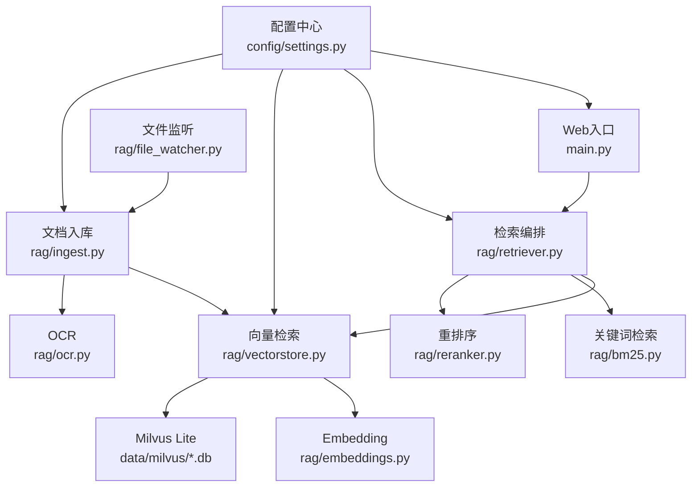
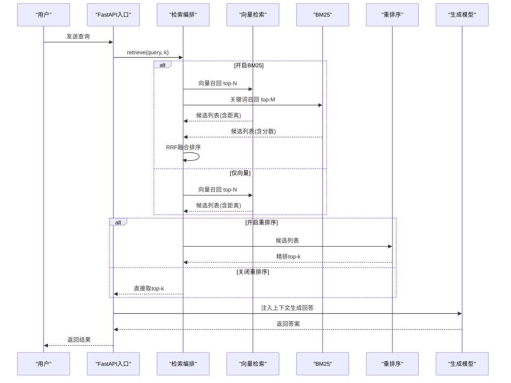
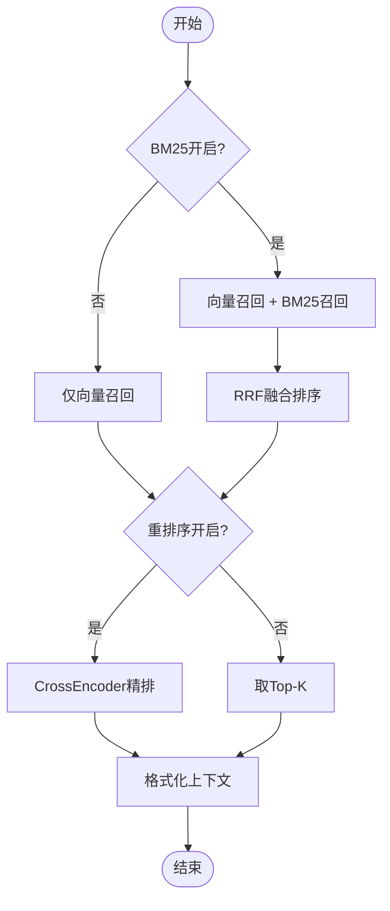
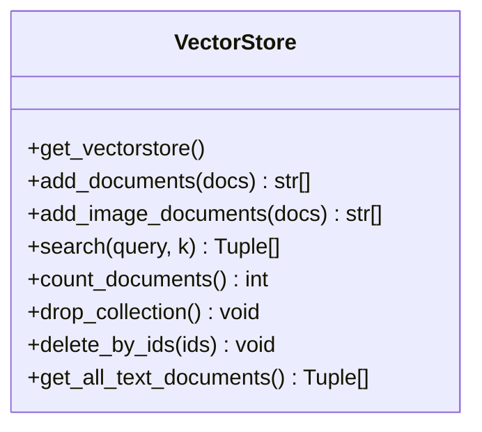
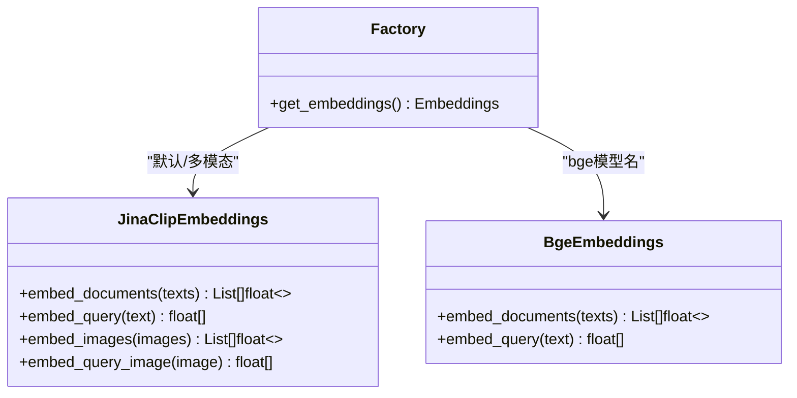
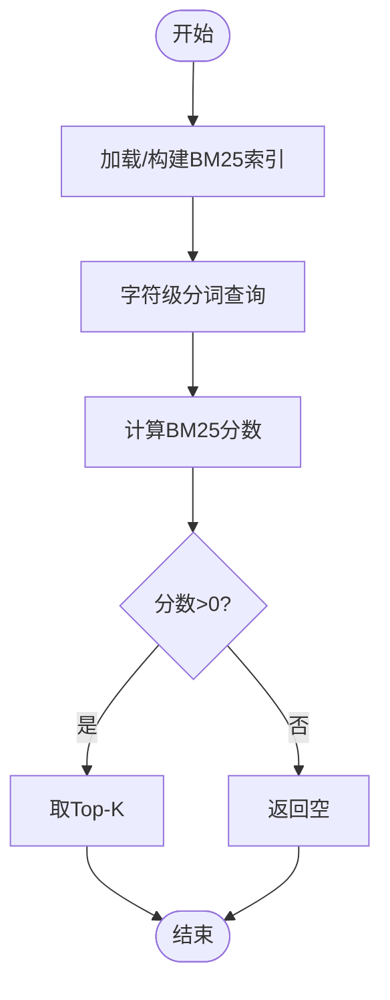
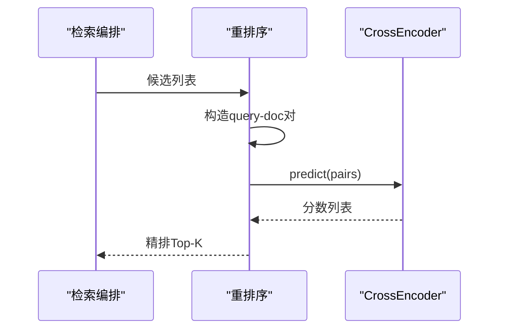
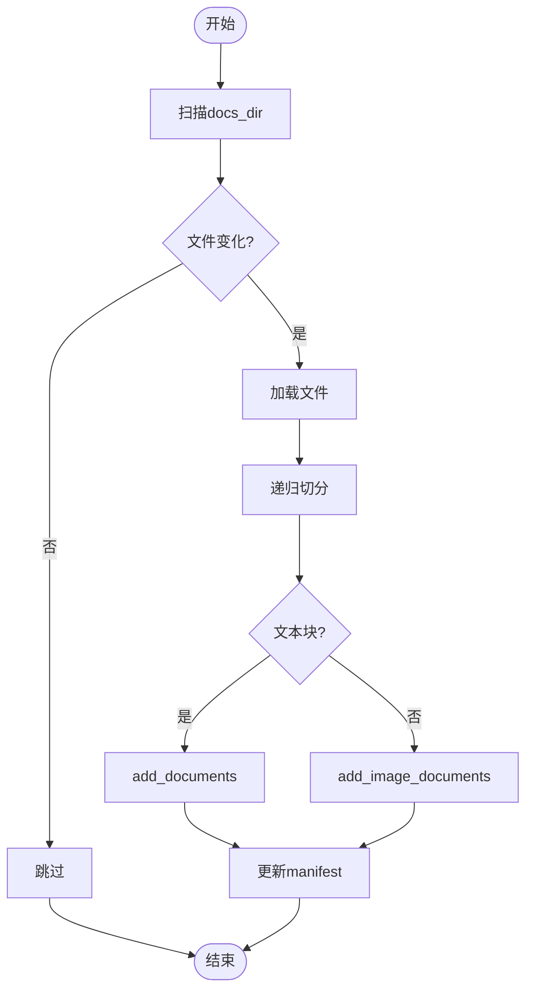
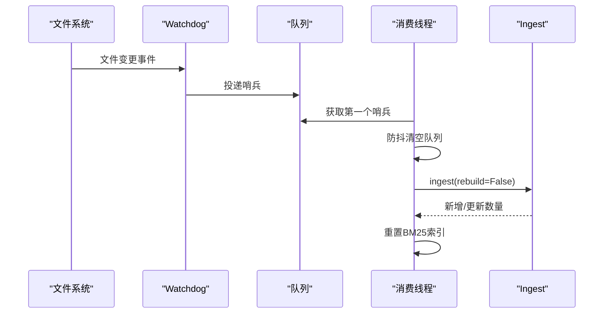
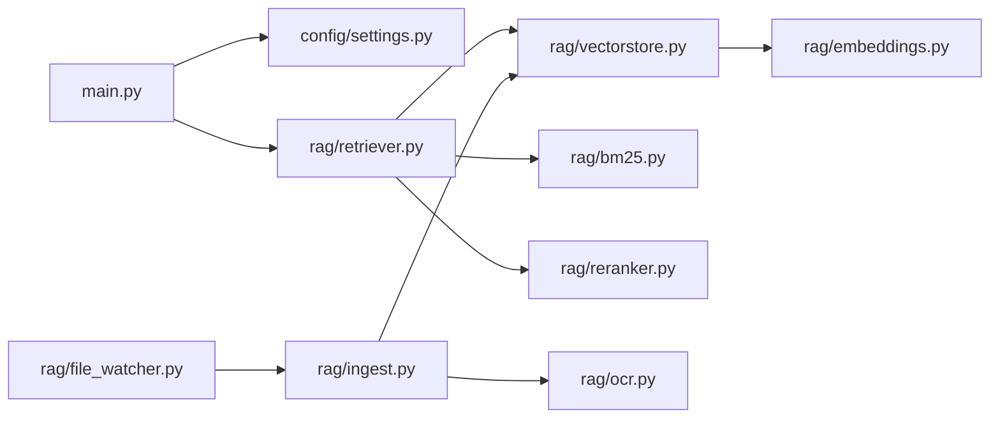

# RAG检索系统

<cite>
**本文引用的文件**
- [main.py](file://main.py)
- [config/settings.py](file://config/settings.py)
- [rag/retriever.py](file://rag/retriever.py)
- [rag/vectorstore.py](file://rag/vectorstore.py)
- [rag/embeddings.py](file://rag/embeddings.py)
- [rag/bm25.py](file://rag/bm25.py)
- [rag/reranker.py](file://rag/reranker.py)
- [rag/ingest.py](file://rag/ingest.py)
- [rag/file_watcher.py](file://rag/file_watcher.py)
- [rag/ocr.py](file://rag/ocr.py)
- [requirements.txt](file://requirements.txt)
</cite>

## 目录
1. [简介](#简介)
2. [项目结构](#项目结构)
3. [核心组件](#核心组件)
4. [架构总览](#架构总览)
5. [详细组件分析](#详细组件分析)
6. [依赖关系分析](#依赖关系分析)
7. [性能与调优](#性能与调优)
8. [故障排除指南](#故障排除指南)
9. [结论](#结论)
10. [附录：配置示例与最佳实践](#附录配置示例与最佳实践)

## 简介
本RAG检索系统面向多模态文档（文本、PDF、图片等），提供“向量检索 + BM25关键词检索 + CrossEncoder重排序”的两阶段检索流程，结合Milvus Lite本地持久化向量库与Jina CLIP/BGE Embedding模型，实现跨模态语义检索与高精度结果融合。系统支持增量入库、运行时自动同步、流式问答接口与启动预热，兼顾召回率与响应时延。

## 项目结构
- 入口与服务：FastAPI主服务负责启动预热、健康检查、聊天接口与SSE流式输出
- 配置中心：集中管理LLM、Embedding、向量库、OCR、检索策略等参数
- 检索管线：retriever编排多路召回与重排序；vectorstore封装Milvus；embeddings提供多模态编码；bm25提供关键词检索；reranker进行精排
- 数据管道：ingest负责多格式加载、切分、入库；file_watcher监听变更并触发增量入库；ocr处理扫描页与图片文字识别
- 运行期：启动时自动检测知识库状态并预热索引与BM25，保障首请求低延迟

图表来源
- [main.py:45-135](file://main.py#L45-L135)
- [rag/retriever.py:18-52](file://rag/retriever.py#L18-L52)
- [rag/vectorstore.py:29-76](file://rag/vectorstore.py#L29-L76)
- [rag/bm25.py:22-66](file://rag/bm25.py#L22-L66)
- [rag/reranker.py:30-51](file://rag/reranker.py#L30-L51)
- [rag/embeddings.py:164-179](file://rag/embeddings.py#L164-L179)
- [rag/ingest.py:289-388](file://rag/ingest.py#L289-L388)
- [rag/file_watcher.py:107-140](file://rag/file_watcher.py#L107-L140)
- [rag/ocr.py:94-141](file://rag/ocr.py#L94-L141)
- [config/settings.py:50-113](file://config/settings.py#L50-L113)

章节来源
- [main.py:45-135](file://main.py#L45-L135)
- [config/settings.py:50-113](file://config/settings.py#L50-L113)

## 核心组件
- 检索编排器：根据配置选择多路召回（向量+BM25）或单路向量，并可选CrossEncoder重排序，最终返回带相关度的上下文
- 向量存储：基于LangChain Milvus封装，支持文本与图像混合元数据、写入锁与flush、相似度检索与过滤
- 多模态Embedding：Jina CLIP v2（文本+图像统一空间）与BGE纯文本两种模式，按配置自动切换
- BM25关键词检索：从向量库拉取文本文档构建内存索引，字符级分词，与向量检索互补提升精确匹配召回
- 重排序：使用CrossEncoder对候选逐对打分，提高Top-K相关性
- 文档入库：支持txt/md/pdf/docx/xlsx/image等多格式，递归切分，增量指纹驱动更新，图像走多模态路径
- 文件监听：watchdog事件+队列防抖，后台线程触发增量入库并重置BM25索引
- OCR：PDF逐页文本优先，不足则渲染为图OCR；图片OCR提取文本并生成图像Document用于跨模态检索

章节来源
- [rag/retriever.py:18-52](file://rag/retriever.py#L18-L52)
- [rag/vectorstore.py:79-184](file://rag/vectorstore.py#L79-L184)
- [rag/embeddings.py:29-179](file://rag/embeddings.py#L29-L179)
- [rag/bm25.py:22-97](file://rag/bm25.py#L22-L97)
- [rag/reranker.py:30-97](file://rag/reranker.py#L30-L97)
- [rag/ingest.py:34-216](file://rag/ingest.py#L34-L216)
- [rag/file_watcher.py:34-140](file://rag/file_watcher.py#L34-L140)
- [rag/ocr.py:46-141](file://rag/ocr.py#L46-L141)

## 架构总览
系统采用“两阶段检索”架构：第一阶段通过向量检索（可并行BM25）召回候选集；第二阶段用CrossEncoder精排得到Top-K。检索结果经格式化后注入生成节点。启动时预热LLM连接、向量库与BM25索引，确保首请求低延迟。

图表来源
- [rag/retriever.py:18-52](file://rag/retriever.py#L18-L52)
- [rag/vectorstore.py:164-184](file://rag/vectorstore.py#L164-L184)
- [rag/bm25.py:69-97](file://rag/bm25.py#L69-L97)
- [rag/reranker.py:54-97](file://rag/reranker.py#L54-L97)
- [main.py:154-209](file://main.py#L154-L209)

## 详细组件分析

### 检索编排器（Retriever）
- 功能：根据配置决定多路召回与是否重排序；支持将不同来源的分数归一化展示
- 关键逻辑：
  - 若开启BM25：并行执行向量检索与BM25，使用RRF融合排名
  - 否则：仅向量检索；若开启重排序则精排，否则直接取Top-K
  - 格式化上下文：将不同来源分数映射到统一的相关度区间便于展示

图表来源
- [rag/retriever.py:18-52](file://rag/retriever.py#L18-L52)
- [rag/retriever.py:78-110](file://rag/retriever.py#L78-L110)
- [rag/retriever.py:113-139](file://rag/retriever.py#L113-L139)

章节来源
- [rag/retriever.py:18-139](file://rag/retriever.py#L18-L139)

### 向量存储（VectorStore）
- 功能：封装Milvus Lite，支持文本与图像混合元数据、写入锁、flush、相似度检索与过滤
- 关键点：
  - 单例初始化，延迟加载避免启动阻塞
  - add_documents/add_image_documents分别处理文本与图像，图像走多模态嵌入
  - search支持阈值过滤，保证上下文质量
  - get_all_text_documents用于构建BM25索引

图表来源
- [rag/vectorstore.py:29-76](file://rag/vectorstore.py#L29-L76)
- [rag/vectorstore.py:79-184](file://rag/vectorstore.py#L79-L184)
- [rag/vectorstore.py:248-281](file://rag/vectorstore.py#L248-L281)

章节来源
- [rag/vectorstore.py:29-281](file://rag/vectorstore.py#L29-L281)

### 多模态Embedding
- 功能：提供Jina CLIP v2（文本+图像统一空间）与BGE纯文本两种嵌入模型，按配置自动选择
- 关键点：
  - 延迟加载模型，首次调用才下载与初始化
  - 文本与图像均做L2归一化，便于向量相似度计算
  - 通过get_embeddings()工厂函数统一接入

图表来源
- [rag/embeddings.py:29-128](file://rag/embeddings.py#L29-L128)
- [rag/embeddings.py:131-179](file://rag/embeddings.py#L131-L179)

章节来源
- [rag/embeddings.py:29-179](file://rag/embeddings.py#L29-L179)

### BM25关键词检索
- 功能：从向量库拉取文本文档构建内存索引，字符级分词，返回Top-K
- 关键点：
  - 进程内单例索引，重启需重建
  - 与向量检索互补，提升精确匹配召回率
  - 失败或无数据时安全回退空结果

图表来源
- [rag/bm25.py:22-66](file://rag/bm25.py#L22-L66)
- [rag/bm25.py:69-97](file://rag/bm25.py#L69-L97)

章节来源
- [rag/bm25.py:22-106](file://rag/bm25.py#L22-L106)

### 重排序（Reranker）
- 功能：使用CrossEncoder对候选query-doc对打分，精排Top-K
- 关键点：
  - 延迟加载模型，首次调用耗时较长
  - 候选数不足或异常时回退原始结果
  - 分数越大越相关，与向量距离相反方向

图表来源
- [rag/reranker.py:30-51](file://rag/reranker.py#L30-L51)
- [rag/reranker.py:54-97](file://rag/reranker.py#L54-L97)

章节来源
- [rag/reranker.py:30-97](file://rag/reranker.py#L30-L97)

### 文档导入与切分（Ingest）
- 功能：多格式加载、递归切分、增量指纹驱动入库，支持图像多模态路径
- 关键点：
  - 支持txt/md/pdf/docx/xlsx/image
  - PDF优先文本提取，不足则OCR兜底，并为每页生成图像Document
  - 增量更新：mtime预筛+hash确认，修改先删旧chunk再入库
  - 清单manifest记录每个文件的hash与chunk_ids，支持删除清理

图表来源
- [rag/ingest.py:34-216](file://rag/ingest.py#L34-L216)
- [rag/ingest.py:258-388](file://rag/ingest.py#L258-L388)

章节来源
- [rag/ingest.py:34-388](file://rag/ingest.py#L34-L388)

### 文件监听与自动同步（File Watcher）
- 功能：watchdog监听docs_dir增删改，防抖后触发增量入库，并重置BM25索引
- 关键点：
  - 消费线程阻塞等待信号，防抖窗口内清空积压
  - 幂等启动，重复调用不重复监听
  - 与ingest配合实现无需重启的在线同步

图表来源
- [rag/file_watcher.py:34-140](file://rag/file_watcher.py#L34-L140)
- [rag/ingest.py:289-388](file://rag/ingest.py#L289-L388)

章节来源
- [rag/file_watcher.py:34-151](file://rag/file_watcher.py#L34-L151)

### OCR模块
- 功能：PDF逐页文本优先，不足则渲染为图OCR；图片OCR提取文本并生成图像Document
- 关键点：
  - easyocr Reader单例，首次运行下载权重
  - pypdfium2渲染PDF页面为PIL Image
  - 阈值控制是否启用OCR，避免不必要开销

章节来源
- [rag/ocr.py:26-141](file://rag/ocr.py#L26-L141)

## 依赖关系分析
- 外部依赖：
  - LangChain生态：langchain-core、langchain-community、langchain-milvus、langchain-text-splitters
  - 向量库：pymilvus、milvus-lite（本地文件持久化）
  - 模型：sentence-transformers、transformers、torch、timm（Jina CLIP）、rank-bm25
  - 多模态：pypdf、pypdfium2、python-docx、openpyxl、easyocr、pillow
  - Web：fastapi、uvicorn、httpx
- 内部耦合：
  - retriever依赖vectorstore、bm25、reranker
  - vectorstore依赖embeddings与settings
  - ingest依赖vectorstore与ocr
  - file_watcher依赖ingest与settings
  - main启动时预热vectorstore、BM25与file_watcher

图表来源
- [main.py:45-135](file://main.py#L45-L135)
- [rag/retriever.py:18-52](file://rag/retriever.py#L18-L52)
- [rag/vectorstore.py:29-76](file://rag/vectorstore.py#L29-L76)
- [rag/ingest.py:289-388](file://rag/ingest.py#L289-L388)
- [rag/file_watcher.py:107-140](file://rag/file_watcher.py#L107-L140)

章节来源
- [requirements.txt:1-53](file://requirements.txt#L1-L53)

## 性能与调优
- 启动预热：
  - LLM连接预热（路由小模型与主模型）降低首请求延迟
  - 向量库与BM25索引预热，避免首请求阻塞
- 检索优化：
  - 向量检索阈值过滤（rag_score_filter）剔除低相关度结果
  - 重排序候选数（rerank_candidate_count）与Top-K（rerank_top_k）平衡精度与时延
  - BM25候选数（rag_bm25_candidate_count）与RRF常数（rag_rrf_k）影响融合效果
- 文档切分：
  - chunk_size与chunk_overlap影响召回粒度与重叠语义保留
- 资源与设备：
  - embedding_device与rerank_device可切换CPU/GPU以平衡吞吐与延迟
  - Milvus Lite gRPC keepalive配置避免空闲连接被断连

[本节为通用指导，不直接分析具体文件]

## 故障排除指南
- 向量库为空但存在清单：
  - 现象：启动时检测到向量库为空且存在manifest
  - 处理：自动触发全量重建，恢复一致性
  - 参考：[main.py:80-135](file://main.py#L80-L135)
- BM25索引为空或未构建：
  - 现象：多路召回降级为仅向量检索
  - 排查：确认向量库有文本文档；检查rank-bm25依赖安装
  - 参考：[rag/bm25.py:22-66](file://rag/bm25.py#L22-L66)
- 重排序失败：
  - 现象：异常时回退原始向量检索结果
  - 排查：模型下载与设备配置；候选数与max_length限制
  - 参考：[rag/reranker.py:54-97](file://rag/reranker.py#L54-L97)
- 文件监听未生效：
  - 现象：docs_dir变更未触发入库
  - 排查：确认rag_auto_sync_enabled为true；检查watchdog依赖与权限
  - 参考：[rag/file_watcher.py:107-140](file://rag/file_watcher.py#L107-L140)
- PDF OCR失败：
  - 现象：扫描件无法识别文本
  - 排查：确认easyocr语言配置与GPU开关；检查pypdfium2渲染
  - 参考：[rag/ocr.py:94-141](file://rag/ocr.py#L94-L141)

章节来源
- [main.py:80-135](file://main.py#L80-L135)
- [rag/bm25.py:22-66](file://rag/bm25.py#L22-L66)
- [rag/reranker.py:54-97](file://rag/reranker.py#L54-L97)
- [rag/file_watcher.py:107-140](file://rag/file_watcher.py#L107-L140)
- [rag/ocr.py:94-141](file://rag/ocr.py#L94-L141)

## 结论
本RAG系统通过“向量检索 + BM25 + CrossEncoder重排序”的组合策略，在多模态场景下实现了高召回与高精度的检索能力。Milvus Lite本地持久化简化部署，增量入库与文件监听保障知识库实时性，启动预热与参数调优提升用户体验。建议在生产环境结合业务数据规模与硬件条件，合理配置chunk大小、候选数与重排序策略，以获得最佳性价比。

[本节为总结，不直接分析具体文件]

## 附录：配置示例与最佳实践
- 基础配置（环境变量或.env）
  - 向量库：milvus_db_file、milvus_collection、milvus_index_type、milvus_metric_type
  - 检索：rag_top_k、rag_score_filter、rag_min_relevance、rag_chunk_size、rag_chunk_overlap
  - 多路召回：rag_bm25_enabled、rag_bm25_candidate_count、rag_rrf_k
  - 重排序：rerank_enabled、rerank_model、rerank_device、rerank_candidate_count、rerank_top_k
  - OCR：ocr_languages、ocr_use_gpu、ocr_min_text_length
  - 自动同步：rag_auto_sync_enabled、rag_auto_sync_debounce
- 最佳实践
  - 启动预热：确保LLM、向量库与BM25索引在启动时完成预热
  - 切分策略：根据文档类型调整chunk_size与overlap，避免语义截断
  - 多路召回：开启BM25提升精确匹配召回，结合RRF融合提升稳定性
  - 重排序：在高精度需求场景开启CrossEncoder，适当增大候选数以提升Top-K质量
  - 监控与日志：关注向量库flush、BM25索引构建与OCR失败的日志，及时定位问题
  - 资源利用：根据设备能力选择embedding_device与rerank_device，必要时启用GPU加速

[本节为通用指导，不直接分析具体文件]