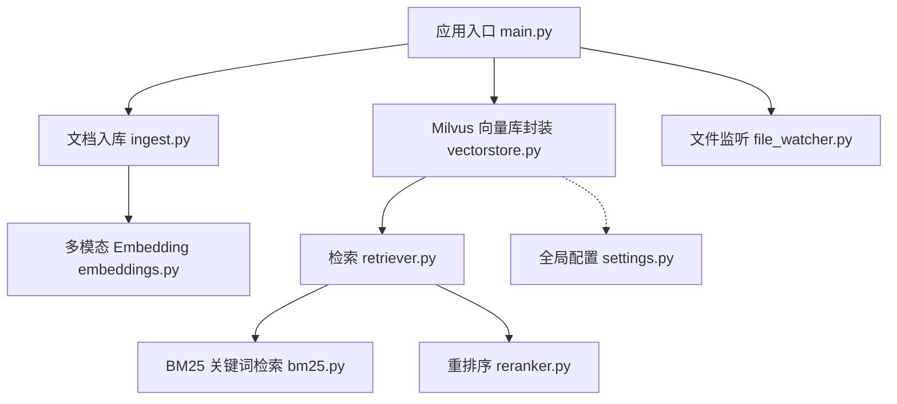
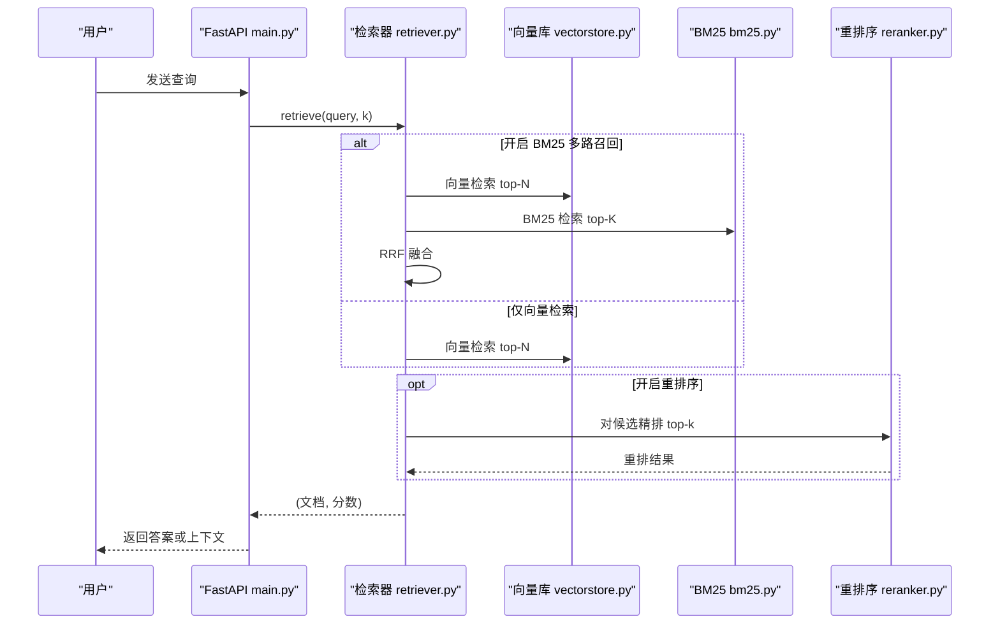
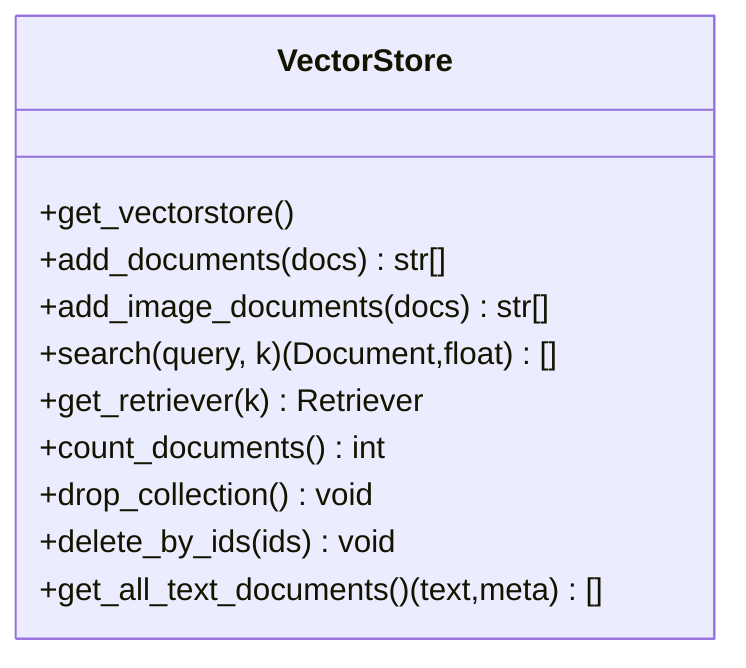
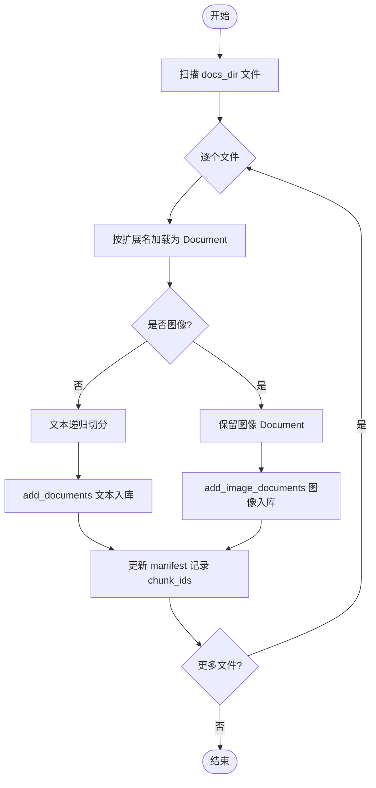
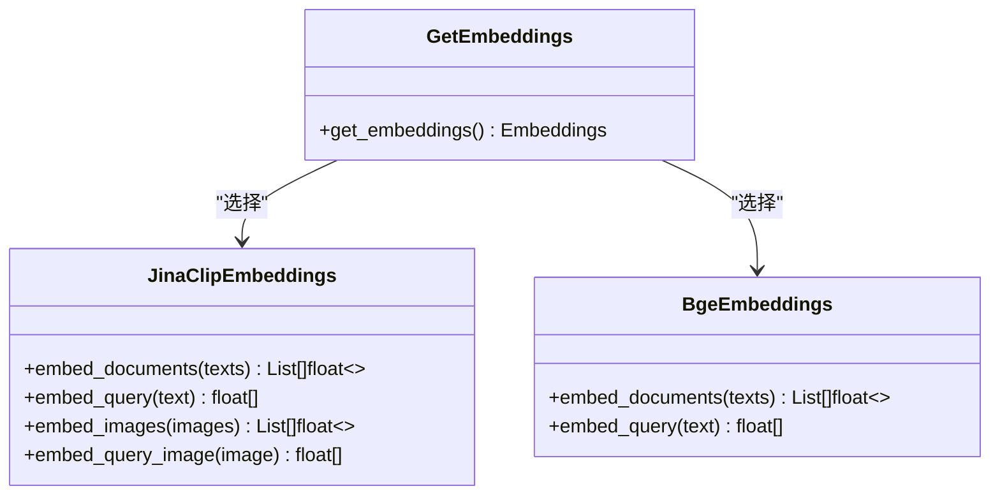
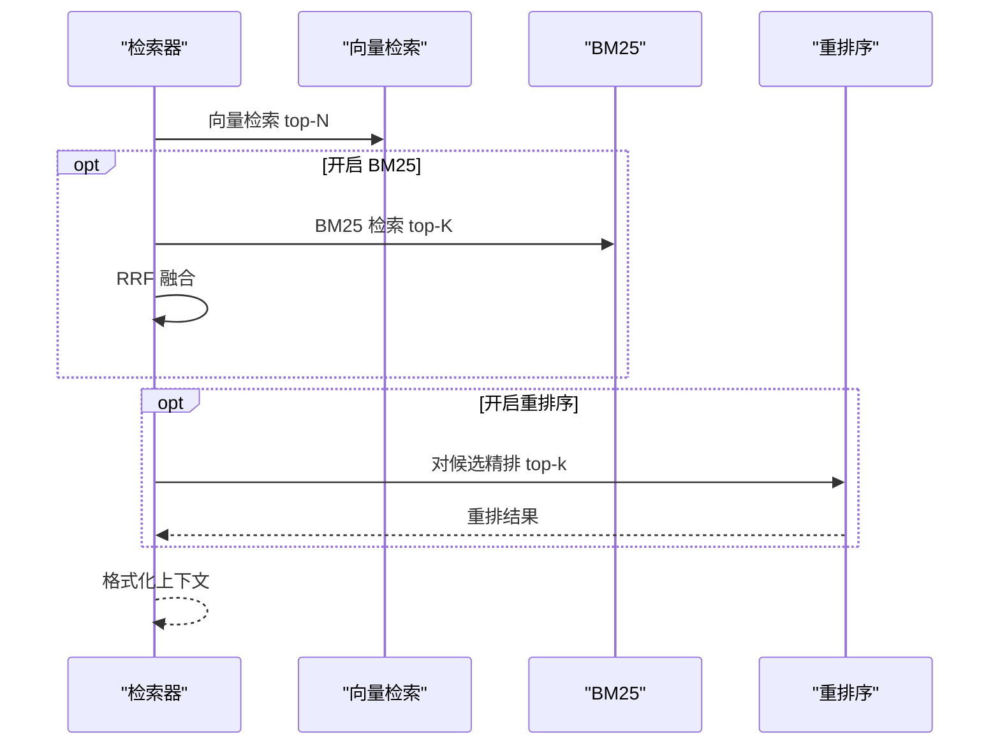
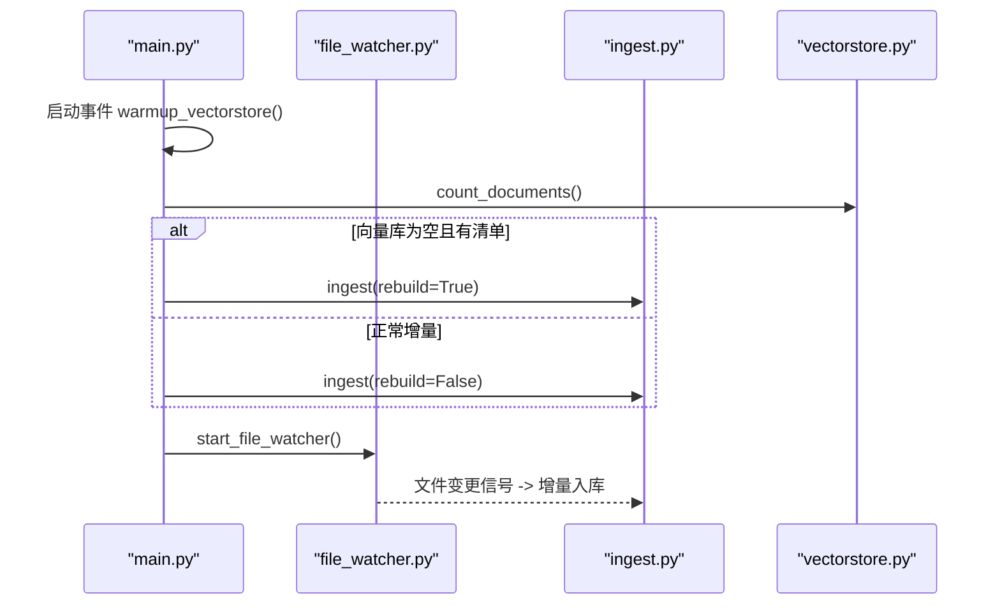
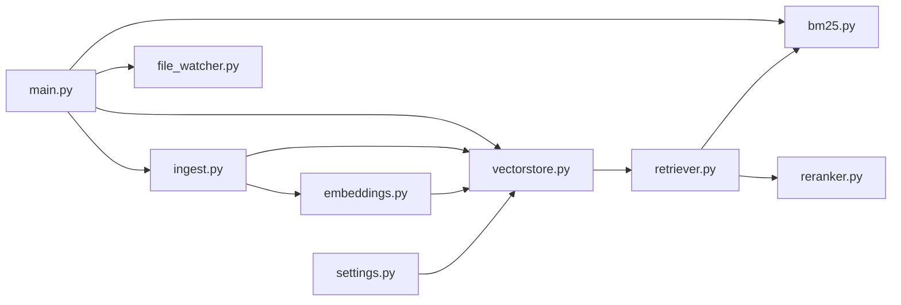

# 向量存储系统

<cite>
**本文引用的文件**
- [vectorstore.py](file://rag/vectorstore.py)
- [ingest.py](file://rag/ingest.py)
- [settings.py](file://config/settings.py)
- [embeddings.py](file://rag/embeddings.py)
- [retriever.py](file://rag/retriever.py)
- [bm25.py](file://rag/bm25.py)
- [reranker.py](file://rag/reranker.py)
- [main.py](file://main.py)
- [file_watcher.py](file://rag/file_watcher.py)
</cite>

## 目录
1. [简介](#简介)
2. [项目结构](#项目结构)
3. [核心组件](#核心组件)
4. [架构总览](#架构总览)
5. [详细组件分析](#详细组件分析)
6. [依赖关系分析](#依赖关系分析)
7. [性能与调优](#性能与调优)
8. [故障排除指南](#故障排除指南)
9. [结论](#结论)
10. [附录：配置示例](#附录：配置示例)

## 简介
本技术文档围绕向量存储系统的实现，重点解析 Milvus Lite 集成、多模态文档支持（文本+图像）、并发写入控制、主键管理策略、数据持久化机制与检索优化。文档涵盖连接参数调优、索引类型选择、相似度度量配置、性能监控方法，并提供具体配置示例与故障排除建议。

## 项目结构
系统以 RAG 为核心，向量库采用 Milvus Lite 本地文件持久化；文档加载与切分由 ingest 模块完成；检索链路包含向量检索、可选 BM25 多路召回与 CrossEncoder 重排序；启动时自动预热并监听知识库变更进行增量入库。

图表来源
- [main.py:80-135](file://main.py#L80-L135)
- [vectorstore.py:29-76](file://rag/vectorstore.py#L29-L76)
- [ingest.py:289-388](file://rag/ingest.py#L289-L388)
- [embeddings.py:29-128](file://rag/embeddings.py#L29-L128)
- [retriever.py:18-52](file://rag/retriever.py#L18-L52)
- [bm25.py:22-66](file://rag/bm25.py#L22-L66)
- [reranker.py:30-98](file://rag/reranker.py#L30-L98)
- [file_watcher.py:1-35](file://rag/file_watcher.py#L1-L35)
- [settings.py:54-76](file://config/settings.py#L54-L76)

章节来源
- [main.py:80-135](file://main.py#L80-L135)
- [vectorstore.py:29-76](file://rag/vectorstore.py#L29-L76)
- [ingest.py:289-388](file://rag/ingest.py#L289-L388)
- [settings.py:54-76](file://config/settings.py#L54-L76)

## 核心组件
- Milvus 向量库封装：提供初始化、文本/图像入库、检索、删除、统计等能力，使用 Milvus Lite 本地 .db 文件持久化，并通过动态字段支持异构 metadata。
- 文档入库管线：按扩展名加载文本/PDF/Word/Excel/图片，PDF 与图片支持 OCR；文本走字符级递归切分，图像不切分直接入库；增量更新基于文件哈希与清单。
- 多模态 Embedding：Jina CLIP v2 统一文本与图像的向量空间；同时提供纯文本 BGE 模型选项。
- 检索器：支持向量检索、可选 BM25 多路召回（RRF 融合）以及 CrossEncoder 重排序。
- 启动预热与运行时同步：启动时检查并自动入库，后台线程预热 BM25 索引；运行时通过 watchdog 监听 docs_dir 变更触发增量入库。

章节来源
- [vectorstore.py:29-106](file://rag/vectorstore.py#L29-L106)
- [ingest.py:34-216](file://rag/ingest.py#L34-L216)
- [embeddings.py:29-128](file://rag/embeddings.py#L29-L128)
- [retriever.py:18-52](file://rag/retriever.py#L18-L52)
- [bm25.py:22-66](file://rag/bm25.py#L22-L66)
- [reranker.py:30-98](file://rag/reranker.py#L30-L98)
- [main.py:80-135](file://main.py#L80-L135)
- [file_watcher.py:1-35](file://rag/file_watcher.py#L1-L35)

## 架构总览
下图展示从用户查询到检索返回的完整流程，包括可选的多路召回与重排序。

图表来源
- [retriever.py:18-52](file://rag/retriever.py#L18-L52)
- [vectorstore.py:164-190](file://rag/vectorstore.py#L164-L190)
- [bm25.py:69-97](file://rag/bm25.py#L69-L97)
- [reranker.py:54-98](file://rag/reranker.py#L54-L98)

## 详细组件分析

### Milvus 向量库封装（vectorstore.py）
- 单例初始化：延迟创建 LangChain Milvus 实例，指向本地 .db 文件启用 Milvus Lite；通过 connection_args.uri 指定数据库路径，并配置 gRPC keepalive 避免空闲 ping 导致断连。
- 索引与度量：index_type 与 metric_type 来自配置；Milvus Lite 默认 FLAT，度量 L2（越小越相关）。
- 主键策略：关闭 auto_id，手动生成 varchar 主键（uuid4），便于跨进程/服务一致性与删除操作。
- 动态字段：enable_dynamic_field=True，将 metadata 作为独立动态字段存储，支持文本与图像异构元数据共存。
- 写入与持久化：add_documents/add_image_documents 在写入后显式 flush 确保落盘可查；delete_by_ids 支持按主键删除并 flush。
- 检索：search 调用 similarity_search_with_score，并按 rag_score_filter 过滤低相关度结果。
- 统计与重建：count_documents 获取 row_count；drop_collection 删除集合并重置单例。

图表来源
- [vectorstore.py:29-76](file://rag/vectorstore.py#L29-L76)
- [vectorstore.py:79-106](file://rag/vectorstore.py#L79-L106)
- [vectorstore.py:109-161](file://rag/vectorstore.py#L109-L161)
- [vectorstore.py:164-190](file://rag/vectorstore.py#L164-L190)
- [vectorstore.py:193-281](file://rag/vectorstore.py#L193-L281)

章节来源
- [vectorstore.py:29-76](file://rag/vectorstore.py#L29-L76)
- [vectorstore.py:79-106](file://rag/vectorstore.py#L79-L106)
- [vectorstore.py:109-161](file://rag/vectorstore.py#L109-L161)
- [vectorstore.py:164-190](file://rag/vectorstore.py#L164-L190)
- [vectorstore.py:193-281](file://rag/vectorstore.py#L193-L281)

### 文档入库管线（ingest.py）
- 多格式加载：txt/md 直接读取；pdf 优先提取文本，不足则渲染页面为图片并 OCR；docx 使用 Docx2txtLoader；xlsx 遍历 sheet 拼接单元格文本；图片 OCR 文本并生成图像 Document。
- 切分策略：文本使用 RecursiveCharacterTextSplitter，按配置的 chunk_size 与 chunk_overlap 切分；图像文档不参与切分。
- 增量更新：维护 .ingest_manifest.json，记录每个文件的 hash、mtime 与 chunk_ids；修改时先删旧 chunk，再重新入库；删除文件时清理孤儿 chunk。
- 多模态入库：文本走 add_documents；图像走 add_image_documents，通过多模态 Embedding 编码 image_path 并插入实体。

图表来源
- [ingest.py:34-182](file://rag/ingest.py#L34-L182)
- [ingest.py:198-216](file://rag/ingest.py#L198-L216)
- [ingest.py:258-274](file://rag/ingest.py#L258-L274)
- [ingest.py:289-388](file://rag/ingest.py#L289-L388)

章节来源
- [ingest.py:34-182](file://rag/ingest.py#L34-L182)
- [ingest.py:198-216](file://rag/ingest.py#L198-L216)
- [ingest.py:258-274](file://rag/ingest.py#L258-L274)
- [ingest.py:289-388](file://rag/ingest.py#L289-L388)

### 多模态 Embedding（embeddings.py）
- Jina CLIP v2：文本与图像映射到同一向量空间，支持跨模态检索；向量维度 1024，输出已 L2 归一化。
- BGE 纯文本：sentence-transformers 实现，速度快，适合纯文本知识库场景。
- 延迟加载：首次调用时才下载并加载模型，避免启动阻塞；支持 CPU/GPU 设备切换。

图表来源
- [embeddings.py:29-128](file://rag/embeddings.py#L29-L128)
- [embeddings.py:131-162](file://rag/embeddings.py#L131-L162)
- [embeddings.py:164-180](file://rag/embeddings.py#L164-L180)

章节来源
- [embeddings.py:29-128](file://rag/embeddings.py#L29-L128)
- [embeddings.py:131-162](file://rag/embeddings.py#L131-L162)
- [embeddings.py:164-180](file://rag/embeddings.py#L164-L180)

### 检索器与重排序（retriever.py, reranker.py, bm25.py）
- 检索流程：根据配置决定仅向量检索、向量+BM25 多路召回（RRF 融合），或加入 CrossEncoder 重排序精排。
- BM25：内存索引，从向量库拉取文本文档构建；中文按字符级切分；返回 (Document, score)，score 越大越相关。
- 重排序：CrossEncoder 将 query 与候选逐对打分，返回 top-k；失败回退原始结果。
- 上下文格式化：将检索结果转换为带来源、标题与相关度的字符串，供生成节点使用。

图表来源
- [retriever.py:18-52](file://rag/retriever.py#L18-L52)
- [bm25.py:69-97](file://rag/bm25.py#L69-L97)
- [reranker.py:54-98](file://rag/reranker.py#L54-L98)

章节来源
- [retriever.py:18-52](file://rag/retriever.py#L18-L52)
- [bm25.py:69-97](file://rag/bm25.py#L69-L97)
- [reranker.py:54-98](file://rag/reranker.py#L54-L98)

### 启动预热与运行时同步（main.py, file_watcher.py）
- 启动预热：后台线程检查向量库是否为空，若为空且存在清单则全量重建；否则执行增量入库；如开启 BM25，预热索引。
- 运行时同步：watchdog 监听 docs_dir 增删改，经防抖后触发增量入库，无需重启服务。

图表来源
- [main.py:80-135](file://main.py#L80-L135)
- [file_watcher.py:1-35](file://rag/file_watcher.py#L1-L35)
- [ingest.py:289-388](file://rag/ingest.py#L289-L388)

章节来源
- [main.py:80-135](file://main.py#L80-L135)
- [file_watcher.py:1-35](file://rag/file_watcher.py#L1-L35)
- [ingest.py:289-388](file://rag/ingest.py#L289-L388)

## 依赖关系分析
- vectorstore 依赖 settings 获取连接参数与索引配置；依赖 embeddings 提供文本/图像编码。
- ingest 依赖 vectorstore 进行入库与删除；依赖 ocr 进行 PDF/图片 OCR；依赖 settings 获取文档目录与切片参数。
- retriever 依赖 vectorstore 进行向量检索；可选依赖 bm25 与 reranker。
- bm25 依赖 vectorstore 拉取文本文档构建内存索引。
- reranker 依赖 sentence_transformers.CrossEncoder 进行精排。
- main 启动时协调 vectorstore、ingest、bm25、file_watcher 完成预热与监听。

图表来源
- [settings.py:54-76](file://config/settings.py#L54-L76)
- [vectorstore.py:29-76](file://rag/vectorstore.py#L29-L76)
- [embeddings.py:164-180](file://rag/embeddings.py#L164-L180)
- [retriever.py:18-52](file://rag/retriever.py#L18-L52)
- [bm25.py:22-66](file://rag/bm25.py#L22-L66)
- [reranker.py:30-98](file://rag/reranker.py#L30-L98)
- [ingest.py:289-388](file://rag/ingest.py#L289-L388)
- [main.py:80-135](file://main.py#L80-L135)
- [file_watcher.py:1-35](file://rag/file_watcher.py#L1-L35)

章节来源
- [settings.py:54-76](file://config/settings.py#L54-L76)
- [vectorstore.py:29-76](file://rag/vectorstore.py#L29-L76)
- [retriever.py:18-52](file://rag/retriever.py#L18-L52)
- [bm25.py:22-66](file://rag/bm25.py#L22-L66)
- [reranker.py:30-98](file://rag/reranker.py#L30-L98)
- [ingest.py:289-388](file://rag/ingest.py#L289-L388)
- [main.py:80-135](file://main.py#L80-L135)
- [file_watcher.py:1-35](file://rag/file_watcher.py#L1-L35)

## 性能与调优
- 连接参数调优
  - gRPC keepalive：禁用无调用时的 ping，避免 Milvus Lite 服务端 too_many_pings 断连；设置 keepalive_time_ms 与 keepalive_timeout_ms 平衡保活与资源占用。
  - 指标参考：观察日志中“Milvus 向量库初始化完成”与 flush 成功与否，确认连接稳定。
- 索引类型与度量
  - Milvus Lite 仅支持 FLAT 索引；度量类型为 L2（欧氏距离，越小越相关）。
  - 如需更高吞吐与近似检索，需迁移至服务端部署 Milvus 并使用 IVF/SCANN 等索引。
- 相似度阈值与 Top-K
  - rag_top_k 控制检索数量；rag_score_filter 过滤低相关度结果；rerank_candidate_count 与 rerank_top_k 控制候选与最终返回数。
- 多路召回与重排序
  - 开启 BM25 提升精确匹配召回率，使用 RRF 融合两路结果；开启 CrossEncoder 重排序提高精度但增加延迟。
- 模型与设备
  - 多模态模型 Jina CLIP v2 在 CPU 上较慢，可考虑 GPU 加速；纯文本场景可使用 BGE 提升速度。
- 启动预热
  - 启动时预热 LLM 连接池与向量库；如开启 BM25，预热内存索引减少首请求延迟。
- 监控方法
  - 日志关键字：Milvus 初始化、flush、BM25 索引构建、重排序模型加载、文件监听事件。
  - 指标建议：入库耗时、检索耗时、重排序耗时、模型加载耗时、错误率与熔断次数。

章节来源
- [vectorstore.py:46-68](file://rag/vectorstore.py#L46-L68)
- [settings.py:54-76](file://config/settings.py#L54-L76)
- [retriever.py:18-52](file://rag/retriever.py#L18-L52)
- [reranker.py:30-98](file://rag/reranker.py#L30-L98)
- [embeddings.py:29-128](file://rag/embeddings.py#L29-L128)
- [main.py:45-135](file://main.py#L45-L135)

## 故障排除指南
- 连接与持久化问题
  - 现象：Milvus 初始化失败或 flush 失败。
  - 排查：检查 milvus_db_file 路径是否存在并可写；确认 Milvus Lite 版本兼容；查看日志中 grpc_options 配置是否正确。
  - 处理：修复路径权限；调整 keepalive 参数；必要时重建 collection。
- 主键冲突或删除失败
  - 现象：按 id 删除失败或重复插入。
  - 排查：确认主键为 varchar uuid 字符串；检查是否有并发写入竞争。
  - 处理：确保写入加锁生效；重试删除；必要时 drop_collection 重建。
- 多模态入库异常
  - 现象：图像入库失败或 OCR 失败。
  - 排查：检查 image_path 是否存在；OCR 模型是否可用；网络镜像是否可达。
  - 处理：修复图片路径；安装/缓存 OCR 模型；重试入库。
- 检索结果质量差
  - 现象：top-k 不相关或为空。
  - 排查：检查 rag_score_filter 是否过严；rerank_enabled 与 rerank_candidate_count 配置；BM25 是否开启。
  - 处理：放宽阈值；开启重排序或多路召回；调整 chunk_size/chunk_overlap。
- 启动预热失败
  - 现象：向量库未预热或 BM25 索引构建失败。
  - 排查：检查向量库是否为空；清单是否存在；网络是否能下载模型。
  - 处理：执行 --rebuild 重建；配置 HF_ENDPOINT 镜像；重试启动。

章节来源
- [vectorstore.py:97-106](file://rag/vectorstore.py#L97-L106)
- [vectorstore.py:225-245](file://rag/vectorstore.py#L225-L245)
- [ingest.py:34-182](file://rag/ingest.py#L34-L182)
- [retriever.py:18-52](file://rag/retriever.py#L18-L52)
- [main.py:80-135](file://main.py#L80-L135)

## 结论
本系统通过 Milvus Lite 实现轻量级向量存储，结合多模态 Embedding 与可选 BM25 多路召回及 CrossEncoder 重排序，提供了高可用、易部署的知识库检索方案。通过主键管理、动态字段、增量更新与启动预热，系统在易用性与性能之间取得良好平衡。生产环境可根据规模与延迟要求评估是否迁移至服务端 Milvus 并使用更高效的索引类型。

## 附录：配置示例
以下为关键配置项说明（对应 settings.py 中的默认值与用途）：
- 向量库
  - milvus_db_file：Milvus Lite 数据库文件路径（本地 .db 文件）
  - milvus_collection：集合名称
  - milvus_index_type：索引类型（Milvus Lite 仅 FLAT）
  - milvus_metric_type：距离度量（L2）
- 检索
  - rag_top_k：默认返回条数
  - rag_score_filter：过滤低相关度结果的阈值
  - rag_bm25_enabled：是否开启 BM25 多路召回
  - rag_rrf_k：RRF 融合常数
  - rerank_enabled：是否开启 CrossEncoder 重排序
  - rerank_model / rerank_device：重排序模型与设备
  - rerank_candidate_count / rerank_top_k：候选数与最终返回数
- 文档与切片
  - rag_chunk_size / rag_chunk_overlap：文本切分大小与重叠
  - rag_docs_dir：知识文档目录
- 运行时同步
  - rag_auto_sync_enabled：是否启用文件监听自动同步
  - rag_auto_sync_debounce：防抖时间（秒）
- 其他
  - embedding_model / embedding_device：多模态或纯文本模型与设备
  - stream_timeout：流式接口整体超时

章节来源
- [settings.py:54-101](file://config/settings.py#L54-L101)
- [settings.py:179-209](file://config/settings.py#L179-L209)