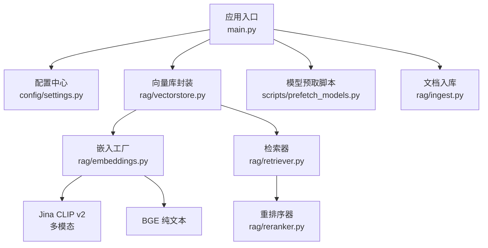
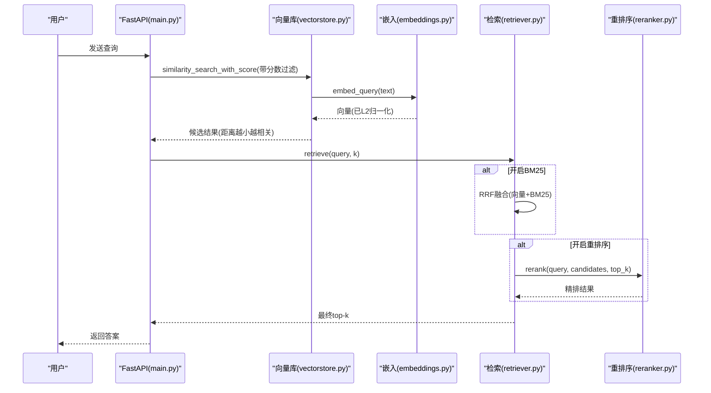
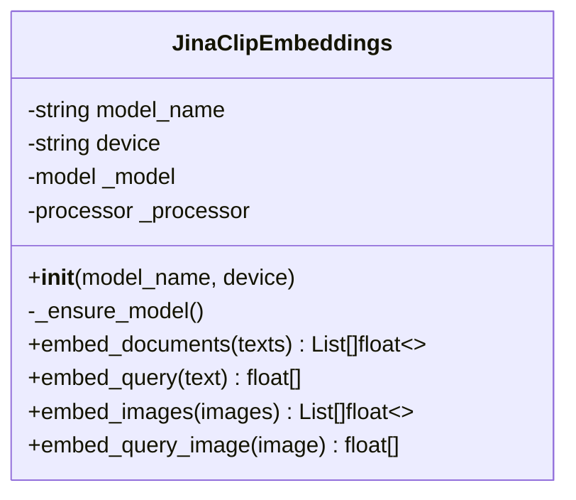
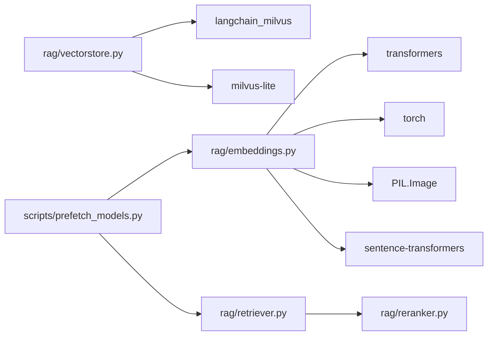

# 嵌入模型服务

<cite>
**本文引用的文件**
- [rag/embeddings.py](file://rag/embeddings.py)
- [config/settings.py](file://config/settings.py)
- [scripts/prefetch_models.py](file://scripts/prefetch_models.py)
- [main.py](file://main.py)
- [requirements.txt](file://requirements.txt)
- [rag/vectorstore.py](file://rag/vectorstore.py)
- [rag/ingest.py](file://rag/ingest.py)
- [rag/retriever.py](file://rag/retriever.py)
- [rag/reranker.py](file://rag/reranker.py)
</cite>

## 目录
1. [简介](#简介)
2. [项目结构](#项目结构)
3. [核心组件](#核心组件)
4. [架构总览](#架构总览)
5. [详细组件分析](#详细组件分析)
6. [依赖关系分析](#依赖关系分析)
7. [性能与优化](#性能与优化)
8. [故障排查](#故障排查)
9. [结论](#结论)
10. [附录：配置与切换示例](#附录配置与切换示例)

## 简介
本技术文档聚焦于“嵌入模型服务”，全面解析多模态 Embedding 模型配置、文本与图像向量化处理、模型加载优化、本地缓存机制、批量处理优化与错误重试策略。系统通过 HuggingFace 集成（支持 hf-mirror.com 镜像加速），提供两种嵌入实现：
- Jina CLIP v2：多模态（文本+图像）统一向量空间，支持跨模态检索
- BGE 纯文本：高性能中文文本嵌入，适合纯文本知识库场景

同时，文档给出不同模型的适用场景、性能对比、配置调优建议、模型切换示例与常见问题解决方案。

## 项目结构
嵌入相关代码主要分布在以下模块：
- rag/embeddings.py：多模态与纯文本嵌入封装，延迟加载与 L2 归一化
- config/settings.py：全局配置（embedding_model、embedding_device、rerank_* 等）
- scripts/prefetch_models.py：构建期预下载与校验（Embedding、Reranker、OCR）
- main.py：启动预热（LLM、向量库、BM25 索引）、健康检查
- rag/vectorstore.py：Milvus Lite 向量库封装（文本/图像混合存储）
- rag/ingest.py：文档加载、切分、增量入库（含 PDF OCR、图片 OCR）
- rag/retriever.py：两阶段检索（向量召回 + CrossEncoder 重排）
- rag/reranker.py：CrossEncoder 重排序单例与精排逻辑

图表来源
- [main.py:45-135](file://main.py#L45-L135)
- [config/settings.py:19-100](file://config/settings.py#L19-L100)
- [rag/embeddings.py:29-179](file://rag/embeddings.py#L29-L179)
- [rag/vectorstore.py:29-76](file://rag/vectorstore.py#L29-L76)
- [rag/retriever.py:18-52](file://rag/retriever.py#L18-L52)
- [rag/reranker.py:30-43](file://rag/reranker.py#L30-L43)
- [scripts/prefetch_models.py:28-53](file://scripts/prefetch_models.py#L28-L53)
- [rag/ingest.py:289-388](file://rag/ingest.py#L289-L388)

章节来源
- [main.py:45-135](file://main.py#L45-L135)
- [config/settings.py:19-100](file://config/settings.py#L19-L100)

## 核心组件
- 多模态嵌入类 JinaClipEmbeddings：基于 transformers AutoModel/AutoProcessor，支持文本与图像编码，输出维度 1024，已做 L2 归一化
- 纯文本嵌入类 BgeEmbeddings：基于 sentence-transformers，输出维度 512，CPU 下比多模态快约 30 倍
- 嵌入工厂 get_embeddings()：根据配置自动选择 BGE 或 Jina，返回 LangChain Embeddings 接口实例
- 向量库 Milvus Lite：本地 .db 持久化，支持文本/图像异构 metadata 共存，读写并发安全（写入加锁）
- 检索器 retriever：支持 BM25 多路召回 + RRF 融合，以及 CrossEncoder 重排序精排
- 重排序器 reranker：CrossEncoder 单例，延迟初始化，默认模型 BAAI/bge-reranker-base
- 预取脚本 prefetch_models：Docker 构建期预下载并校验 Embedding/Reranker/OCR，失败则阻断构建

章节来源
- [rag/embeddings.py:29-179](file://rag/embeddings.py#L29-L179)
- [rag/vectorstore.py:29-76](file://rag/vectorstore.py#L29-L76)
- [rag/retriever.py:18-52](file://rag/retriever.py#L18-L52)
- [rag/reranker.py:30-43](file://rag/reranker.py#L30-L43)
- [scripts/prefetch_models.py:28-53](file://scripts/prefetch_models.py#L28-L53)

## 架构总览
嵌入模型服务在 RAG 流程中的角色如下：
- 文档入库阶段：文本/图像经 OCR 或解析后，使用嵌入模型生成向量，存入 Milvus Lite
- 查询检索阶段：用户查询先经向量检索召回候选，再可选进行 CrossEncoder 重排序，最终格式化上下文供生成节点使用
- 启动预热：服务启动时预热 LLM 连接、向量库、BM25 索引；必要时触发全量重建

图表来源
- [main.py:154-209](file://main.py#L154-L209)
- [rag/vectorstore.py:164-184](file://rag/vectorstore.py#L164-L184)
- [rag/embeddings.py:67-94](file://rag/embeddings.py#L67-L94)
- [rag/retriever.py:18-52](file://rag/retriever.py#L18-L52)
- [rag/reranker.py:30-43](file://rag/reranker.py#L30-L43)

## 详细组件分析

### 多模态嵌入：Jina CLIP v2
- 功能：文本与图像映射到同一向量空间（1024维），支持跨模态检索
- 加载策略：首次调用时延迟加载 AutoModel/AutoProcessor，避免初始化即下载
- 批处理：embed_documents 批量文本编码；embed_images 批量图像编码
- 归一化：输出向量均做 L2 归一化，便于相似度计算
- 设备：可通过 embedding_device 配置 CPU/GPU

图表来源
- [rag/embeddings.py:29-128](file://rag/embeddings.py#L29-L128)

章节来源
- [rag/embeddings.py:29-128](file://rag/embeddings.py#L29-L128)

### 纯文本嵌入：BGE
- 功能：中文优化的纯文本嵌入（512维），CPU 下速度显著优于多模态
- 加载策略：延迟加载 SentenceTransformer
- 批处理：encode 支持批量输入，normalize_embeddings=True 输出已归一化
- 适用场景：纯文本知识库、对延迟敏感的场景

章节来源
- [rag/embeddings.py:131-161](file://rag/embeddings.py#L131-L161)

### 嵌入工厂与配置
- 工厂函数 get_embeddings()：根据 embedding_model 是否包含 "bge" 自动选择 BGE 或 Jina
- 配置项：
  - embedding_model：默认 jinaai/jina-clip-v2
  - embedding_device：默认 cpu
- 环境变量：HF_ENDPOINT 优先尊重外部设置，否则设为 hf-mirror.com 加速

章节来源
- [rag/embeddings.py:164-179](file://rag/embeddings.py#L164-L179)
- [config/settings.py:50-52](file://config/settings.py#L50-L52)
- [main.py:13-19](file://main.py#L13-L19)

### 向量库与多模态存储
- Milvus Lite：本地 .db 文件持久化，无需独立部署
- 混合存储：文本与图像 Document 可共存于同一 collection，metadata 动态字段支持异构数据
- 写入保护：add_documents/add_image_documents/delete_by_ids 使用线程锁避免并发写入冲突
- 搜索过滤：search 支持 rag_score_filter 阈值过滤低相关度结果

章节来源
- [rag/vectorstore.py:29-76](file://rag/vectorstore.py#L29-L76)
- [rag/vectorstore.py:79-161](file://rag/vectorstore.py#L79-L161)
- [rag/vectorstore.py:164-184](file://rag/vectorstore.py#L164-L184)

### 文档入库与增量更新
- 支持格式：txt/md/pdf/docx/xlsx 及图片（png/jpg/jpeg/bmp/tiff）
- PDF 处理：文本优先，扫描页 OCR 兜底；每页额外生成图像 Document 用于多模态检索
- 图片处理：OCR 提取文本 + 图像 Document（metadata.image_path）
- 增量机制：基于 mtime 与 md5 哈希判断文件变化，仅处理新增/修改/删除的文件
- 清单管理：.ingest_manifest.json 记录每个文件的 hash/mtime/chunk_ids

章节来源
- [rag/ingest.py:34-182](file://rag/ingest.py#L34-L182)
- [rag/ingest.py:198-216](file://rag/ingest.py#L198-L216)
- [rag/ingest.py:227-286](file://rag/ingest.py#L227-L286)
- [rag/ingest.py:289-388](file://rag/ingest.py#L289-L388)

### 检索与重排序
- 两阶段检索：向量召回候选 → CrossEncoder 精排取 top-k
- 多路召回：可选启用 BM25 关键词检索，与向量检索通过 RRF 融合
- 重排序开关：rerank_enabled=false 时回退为直接向量检索 top-k
- 上下文格式化：将检索结果按来源、标题、相关度格式化，供生成节点使用

章节来源
- [rag/retriever.py:18-52](file://rag/retriever.py#L18-L52)
- [rag/retriever.py:55-110](file://rag/retriever.py#L55-L110)
- [rag/retriever.py:113-139](file://rag/retriever.py#L113-L139)
- [rag/reranker.py:30-43](file://rag/reranker.py#L30-L43)

### 模型预下载与启动预热
- 预下载脚本：Docker 构建期依次下载并校验 Embedding、Reranker、OCR，失败则终止构建
- 启动预热：
  - LLM 连接预热（TLS握手、DNS解析、连接池建立）
  - 向量库为空且存在清单时触发全量重建
  - BM25 索引预热（开启多路召回时）
  - 文件监听启动（运行时知识库变更自动同步）

章节来源
- [scripts/prefetch_models.py:28-53](file://scripts/prefetch_models.py#L28-L53)
- [scripts/prefetch_models.py:56-78](file://scripts/prefetch_models.py#L56-L78)
- [main.py:45-135](file://main.py#L45-L135)

## 依赖关系分析
- 核心依赖：langchain、transformers、torch、sentence-transformers、pymilvus、milvus-lite、pillow、timm
- 多模态依赖：jina-clip-v2 需要 timm 视觉骨干网络（trust_remote_code）
- 可选依赖：rank-bm25（多路召回）、watchdog（文件监听）

图表来源
- [requirements.txt:1-31](file://requirements.txt#L1-L31)
- [rag/embeddings.py:19-21](file://rag/embeddings.py#L19-L21)
- [rag/vectorstore.py:38-68](file://rag/vectorstore.py#L38-L68)
- [rag/retriever.py:44-48](file://rag/retriever.py#L44-L48)
- [scripts/prefetch_models.py:28-53](file://scripts/prefetch_models.py#L28-L53)

章节来源
- [requirements.txt:1-31](file://requirements.txt#L1-L31)

## 性能与优化
- 模型选择
  - 纯文本知识库：优先使用 BGE（512维，CPU 下速度快约 30 倍）
  - 多模态检索：使用 Jina CLIP v2（1024维，支持文本+图像统一空间）
- 批量处理
  - embed_documents/embed_images 支持批量输入，减少模型调用开销
  - 文本最大长度限制为 8192，避免过长导致内存溢出
- 设备与缓存
  - embedding_device 可配置为 cpu/gpu，GPU 下推理更快
  - 模型延迟加载，首次调用时才下载与初始化
  - 重排序器 CrossEncoder 单例，避免重复加载
- 检索优化
  - 向量检索支持分数过滤（rag_score_filter），丢弃低相关度结果
  - 可选启用 BM25 多路召回 + RRF 融合，提升精确匹配召回率
  - 重排序精排（CrossEncoder）提高最终 top-k 质量
- 启动预热
  - LLM 连接预热降低首请求延迟
  - 向量库与 BM25 索引预热避免首请求阻塞

[本节为通用性能讨论，不直接分析具体文件]

## 故障排查
- 模型下载失败
  - 现象：首次加载模型时网络超时或连接重置
  - 解决：确保 HF_ENDPOINT 指向 hf-mirror.com；使用 scripts/prefetch_models.py 在构建期预下载
- OCR 模型下载不稳定
  - 现象：easyocr 初始化失败，Connection reset by peer
  - 解决：prefetch_ocr 内置重试机制（最多3次，间隔5秒）
- 向量库写入冲突
  - 现象：文件监听消费线程与检索路径并发写入导致异常
  - 解决：add_documents/add_image_documents/delete_by_ids 使用线程锁保护
- 检索结果为空或相关性低
  - 现象：search 返回空或分数过高
  - 解决：调整 rag_score_filter、rag_top_k、rerank_candidate_count；确认文档已成功入库
- 流式响应超时
  - 现象：/api/chat/stream 长时间无响应
  - 解决：检查 stream_timeout 配置；服务端已实现整体超时保护，超时后返回已生成内容

章节来源
- [scripts/prefetch_models.py:56-78](file://scripts/prefetch_models.py#L56-L78)
- [rag/vectorstore.py:97-106](file://rag/vectorstore.py#L97-L106)
- [rag/vectorstore.py:157-160](file://rag/vectorstore.py#L157-L160)
- [rag/vectorstore.py:164-184](file://rag/vectorstore.py#L164-L184)
- [main.py:228-314](file://main.py#L228-L314)

## 结论
本嵌入模型服务提供了灵活的多模态与纯文本嵌入能力，结合 Milvus Lite 本地持久化与两阶段检索（向量召回 + CrossEncoder 重排序），实现了高效、可扩展的 RAG 流程。通过延迟加载、批量处理、启动预热与错误重试等优化手段，系统在性能与稳定性方面具备良好表现。用户可根据场景选择合适的嵌入模型与检索策略，并通过配置项进行调优。

[本节为总结性内容，不直接分析具体文件]

## 附录：配置与切换示例
- 切换至纯文本 BGE 模型
  - 设置 embedding_model = "BAAI/bge-small-zh-v1.5"
  - 适用于纯文本知识库，性能更优
- 切换至多模态 Jina CLIP v2
  - 设置 embedding_model = "jinaai/jina-clip-v2"
  - 适用于文本+图像混合检索场景
- 调整检索参数
  - rag_top_k：返回候选数
  - rag_score_filter：距离阈值，低于此值丢弃
  - rerank_enabled：是否启用重排序
  - rerank_candidate_count：重排序候选数
  - rerank_top_k：重排序后返回数
- 启用多路召回
  - rag_bm25_enabled = true
  - rag_bm25_candidate_count：BM25 召回数
  - rag_rrf_k：RRF 融合常数
- 设备与缓存
  - embedding_device：cpu/gpu
  - 预下载：运行 scripts/prefetch_models.py 预下载模型

章节来源
- [config/settings.py:50-100](file://config/settings.py#L50-L100)
- [rag/retriever.py:18-52](file://rag/retriever.py#L18-L52)
- [scripts/prefetch_models.py:28-53](file://scripts/prefetch_models.py#L28-L53)