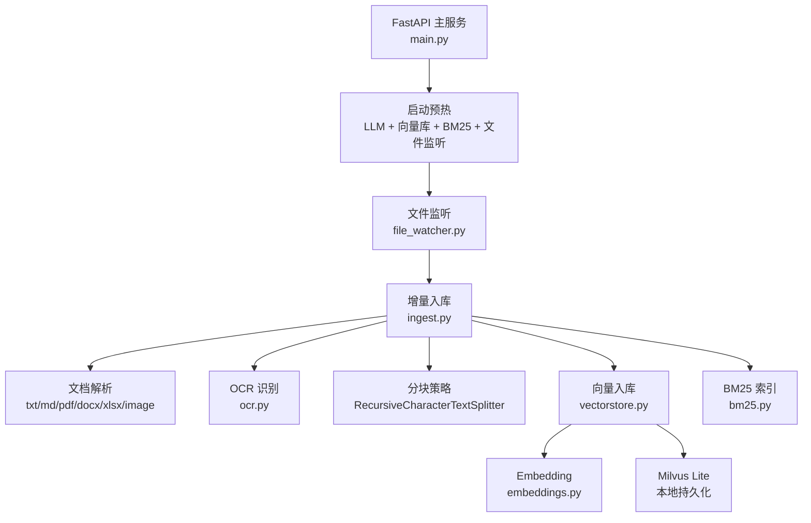
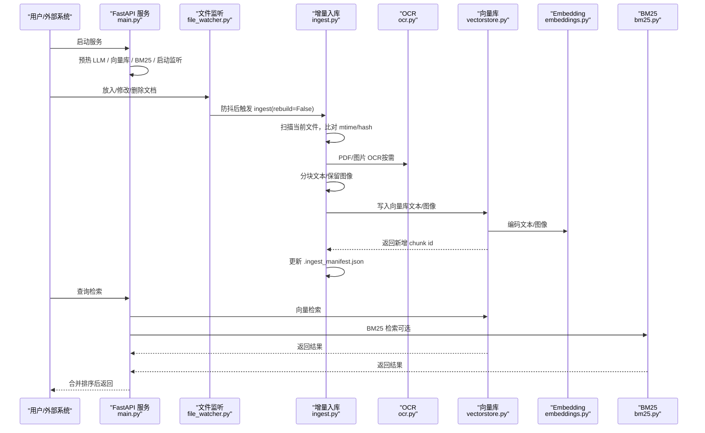
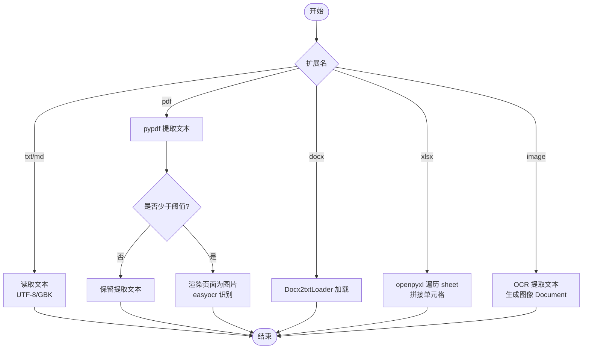
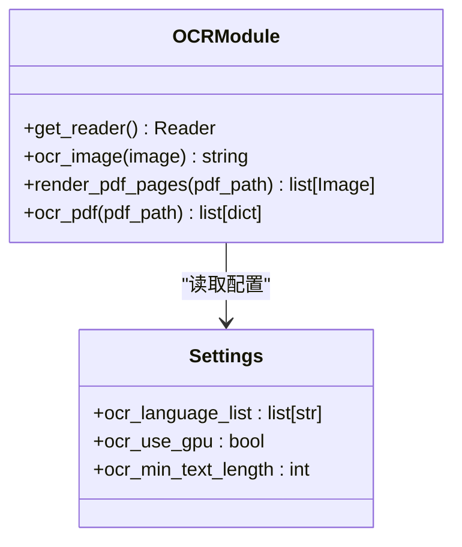
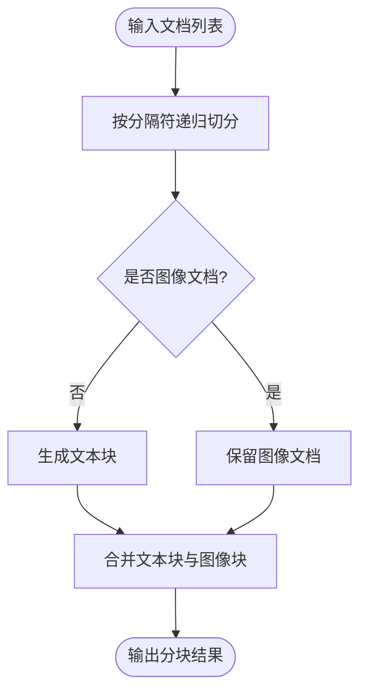
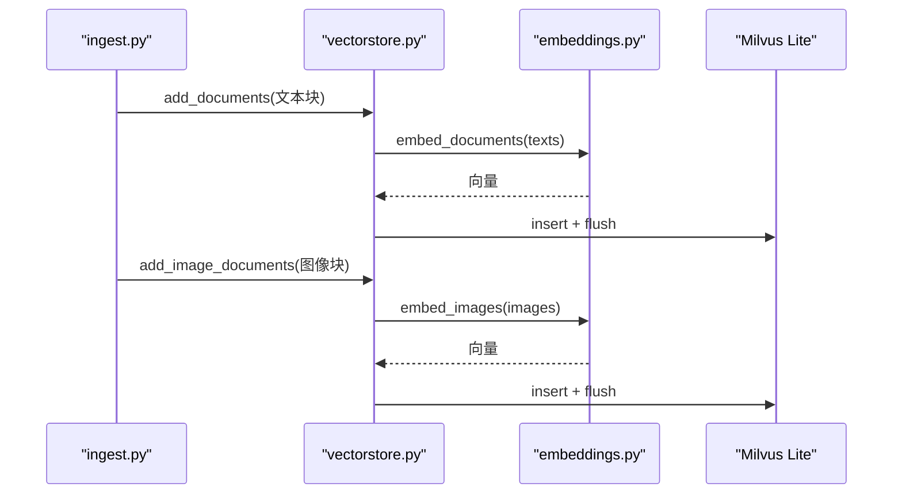
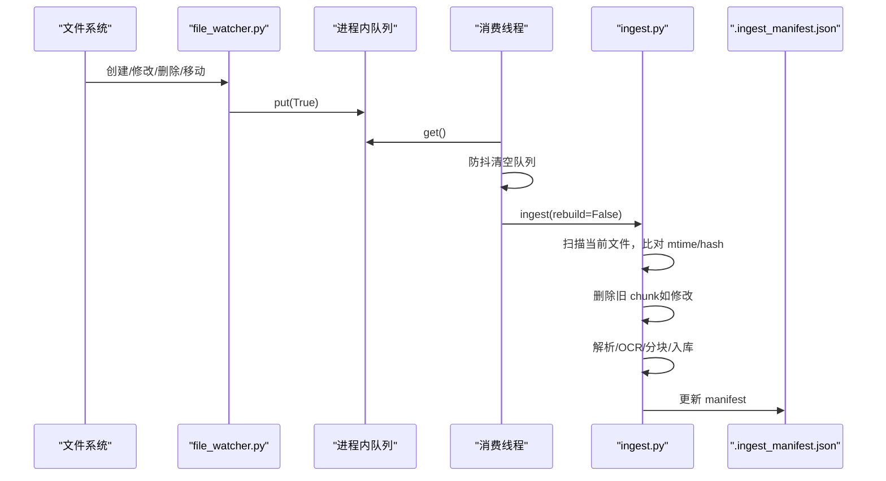
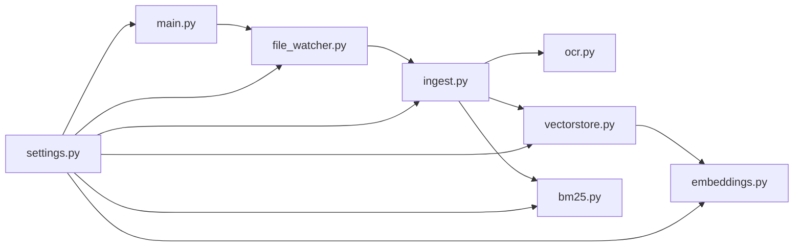

# 文档处理流水线

<cite>
**本文引用的文件**
- [main.py](file://main.py)
- [rag/ingest.py](file://rag/ingest.py)
- [rag/file_watcher.py](file://rag/file_watcher.py)
- [rag/ocr.py](file://rag/ocr.py)
- [rag/vectorstore.py](file://rag/vectorstore.py)
- [rag/embeddings.py](file://rag/embeddings.py)
- [rag/bm25.py](file://rag/bm25.py)
- [config/settings.py](file://config/settings.py)
- [data/docs/.ingest_manifest.json](file://data/docs/.ingest_manifest.json)
</cite>

## 目录
1. [简介](#简介)
2. [项目结构](#项目结构)
3. [核心组件](#核心组件)
4. [架构总览](#架构总览)
5. [详细组件分析](#详细组件分析)
6. [依赖关系分析](#依赖关系分析)
7. [性能考量](#性能考量)
8. [故障排除指南](#故障排除指南)
9. [结论](#结论)
10. [附录：配置与使用](#附录：配置与使用)

## 简介
本技术文档围绕“文档处理流水线”展开，系统性解析多格式文档解析、OCR 文字识别、内容清洗与分块策略、向量入库与检索、文件监听与增量更新、错误处理与性能监控等关键能力。重点说明支持的文档格式、解析器配置、OCR 模型选择与参数、分块算法优化、文件监听机制、增量更新策略、错误处理与性能监控，并提供完整的文档导入流程与故障排除指南。

## 项目结构
系统以 FastAPI 服务为入口，启动时完成 LLM 连接预热、向量库检查与自动入库、BM25 索引预热以及文件监听启动。RAG 层提供文档加载、切分、OCR、向量化、存储与检索能力；配置中心统一管理各子系统参数。

图表来源
- [main.py:45-135](file://main.py#L45-L135)
- [rag/file_watcher.py:107-140](file://rag/file_watcher.py#L107-L140)
- [rag/ingest.py:289-388](file://rag/ingest.py#L289-L388)
- [rag/ocr.py:94-141](file://rag/ocr.py#L94-L141)
- [rag/vectorstore.py:29-76](file://rag/vectorstore.py#L29-L76)
- [rag/embeddings.py:164-179](file://rag/embeddings.py#L164-L179)
- [rag/bm25.py:22-66](file://rag/bm25.py#L22-L66)

章节来源
- [main.py:1-135](file://main.py#L1-L135)
- [rag/file_watcher.py:1-151](file://rag/file_watcher.py#L1-L151)
- [rag/ingest.py:1-402](file://rag/ingest.py#L1-L402)

## 核心组件
- 文档加载与解析：支持 .txt/.md/.pdf/.docx/.xlsx/.png/.jpg/.jpeg/.bmp/.tiff，按扩展名分发到对应加载器。
- OCR 识别：PDF 文本优先提取，不足则渲染页面为图片并调用 easyocr；图片直接 OCR。
- 内容清洗与分块：递归字符切分器，按配置 chunk_size 与 chunk_overlap 切分，图像文档不参与切分。
- 向量入库与检索：Milvus Lite 本地持久化，文本与图像统一向量空间（Jina CLIP v2），支持删除、重建、统计。
- 文件监听与增量更新：watchdog 监听 docs_dir，防抖后触发增量入库，维护 .ingest_manifest.json 实现 mtime+hash 双判变更。
- BM25 关键词检索：可选开启，内存索引，字符级分词，与向量检索融合提升召回率。
- 配置管理：集中式 pydantic-settings 配置，覆盖 LLM、Embedding、向量库、OCR、检索、记忆、限流熔断等。

章节来源
- [rag/ingest.py:24-27](file://rag/ingest.py#L24-L27)
- [rag/ocr.py:1-10](file://rag/ocr.py#L1-L10)
- [rag/ingest.py:198-216](file://rag/ingest.py#L198-L216)
- [rag/vectorstore.py:1-9](file://rag/vectorstore.py#L1-L9)
- [rag/file_watcher.py:1-12](file://rag/file_watcher.py#L1-L12)
- [rag/bm25.py:1-8](file://rag/bm25.py#L1-L8)
- [config/settings.py:19-108](file://config/settings.py#L19-L108)

## 架构总览
系统采用“事件驱动 + 增量处理”的架构：
- 启动阶段：预热 LLM、检查向量库并自动入库、构建 BM25 索引、启动文件监听。
- 运行阶段：文件变更通过 watchdog 捕获，进入队列防抖后触发增量入库；入库过程包含解析、OCR、分块、向量化与写入 Milvus。
- 检索阶段：向量检索为主，可叠加 BM25 关键词检索，最终返回相关文档片段。

图表来源
- [main.py:45-135](file://main.py#L45-L135)
- [rag/file_watcher.py:71-105](file://rag/file_watcher.py#L71-L105)
- [rag/ingest.py:289-388](file://rag/ingest.py#L289-L388)
- [rag/ocr.py:94-141](file://rag/ocr.py#L94-L141)
- [rag/vectorstore.py:79-161](file://rag/vectorstore.py#L79-L161)
- [rag/embeddings.py:67-128](file://rag/embeddings.py#L67-L128)
- [rag/bm25.py:22-97](file://rag/bm25.py#L22-L97)

## 详细组件分析

### 文档加载与解析
- 文本类（.txt/.md）：UTF-8 优先，失败回退 GBK。
- PDF：先 pypdf 提取文本，若某页文本过少（低于阈值）则渲染为图片并 OCR；同时生成每页图像 Document 用于多模态检索。
- Word（.docx）：使用 Docx2txtLoader 提取文本。
- Excel（.xlsx）：遍历所有 sheet，逐行拼接单元格文本。
- 图片（.png/.jpg/.jpeg/.bmp/.tiff）：OCR 提取文本，并生成图像 Document（metadata.image_path）。

图表来源
- [rag/ingest.py:34-182](file://rag/ingest.py#L34-L182)
- [rag/ocr.py:94-141](file://rag/ocr.py#L94-L141)

章节来源
- [rag/ingest.py:34-182](file://rag/ingest.py#L34-L182)
- [rag/ocr.py:46-91](file://rag/ocr.py#L46-L91)

### OCR 模块与模型选择
- 模型：easyocr，语言列表由配置 ocr_languages 解析（默认 ch_sim,en）。
- GPU：可通过 ocr_use_gpu 控制，默认 CPU。
- PDF 策略：文本优先，若任意页面文本长度小于 ocr_min_text_length，则渲染全部页面为图片进行 OCR，并比较 OCR 结果长度决定是否替换。
- 图片 OCR：对 PIL Image 或路径执行 OCR，过滤置信度低于阈值的行。

图表来源
- [rag/ocr.py:26-43](file://rag/ocr.py#L26-L43)
- [rag/ocr.py:46-69](file://rag/ocr.py#L46-L69)
- [rag/ocr.py:72-91](file://rag/ocr.py#L72-L91)
- [rag/ocr.py:94-141](file://rag/ocr.py#L94-L141)
- [config/settings.py:102-107](file://config/settings.py#L102-L107)

章节来源
- [rag/ocr.py:1-141](file://rag/ocr.py#L1-L141)
- [config/settings.py:102-107](file://config/settings.py#L102-L107)

### 内容清洗与分块策略
- 分块器：RecursiveCharacterTextSplitter，分隔符包括段落、句子、标点、空格等。
- 参数：chunk_size=500，chunk_overlap=80（可配置）。
- 图像文档：type=image 的文档不参与切分，直接保留用于多模态检索。
- 清洗：文本加载时去除空行与多余空白；Excel 逐行拼接非空单元格。

图表来源
- [rag/ingest.py:198-216](file://rag/ingest.py#L198-L216)

章节来源
- [rag/ingest.py:198-216](file://rag/ingest.py#L198-L216)

### 向量入库与检索
- 向量库：Milvus Lite，本地文件持久化（milvus_lite.db），无需独立服务。
- Embedding：默认 jinaai/jina-clip-v2，文本与图像统一向量空间；也可切换为 BGE 纯文本模型。
- 写入：add_documents 用于文本，add_image_documents 用于图像（绕过 LangChain 文本路径，直接使用底层 insert）。
- 检索：similarity_search_with_score，支持分数过滤 rag_score_filter；可结合 BM25 多路召回。
- 管理：drop_collection 清空重建，delete_by_ids 清理旧 chunk，count_documents 统计数量。

图表来源
- [rag/vectorstore.py:79-161](file://rag/vectorstore.py#L79-L161)
- [rag/embeddings.py:67-128](file://rag/embeddings.py#L67-L128)
- [rag/ingest.py:258-274](file://rag/ingest.py#L258-L274)

章节来源
- [rag/vectorstore.py:29-282](file://rag/vectorstore.py#L29-L282)
- [rag/embeddings.py:29-179](file://rag/embeddings.py#L29-L179)

### 文件监听与增量更新
- 监听：watchdog 监听 docs_dir，仅对支持扩展名的事件投递信号。
- 防抖：消费线程取第一个信号后，持续清空 debounce 窗口内积压信号，避免频繁入库。
- 增量：基于 .ingest_manifest.json 记录每个文件的 hash、mtime 与 chunk_ids；首次比对 mtime，再比对 hash，变化则删除旧 chunk 并重新入库。
- 清理：清单中存在但目录缺失的文件视为删除，清理孤儿 chunk。

图表来源
- [rag/file_watcher.py:34-105](file://rag/file_watcher.py#L34-L105)
- [rag/ingest.py:222-388](file://rag/ingest.py#L222-L388)
- [data/docs/.ingest_manifest.json:1-11](file://data/docs/.ingest_manifest.json#L1-L11)

章节来源
- [rag/file_watcher.py:1-151](file://rag/file_watcher.py#L1-L151)
- [rag/ingest.py:219-388](file://rag/ingest.py#L219-L388)
- [data/docs/.ingest_manifest.json:1-11](file://data/docs/.ingest_manifest.json#L1-L11)

### BM25 关键词检索
- 索引构建：从向量库拉取文本文档（跳过图像），字符级切分构建 BM25Okapi 索引。
- 检索：查询同样字符级切分，返回 top-k 且过滤零分文档。
- 重置：向量库重建后调用 reset_bm25_index，下次检索时重新构建。

章节来源
- [rag/bm25.py:22-106](file://rag/bm25.py#L22-L106)

## 依赖关系分析
- main.py 负责服务启动与预热，调用 vectorstore.count_documents 与 ingest 进行初始入库，并启动 file_watcher。
- file_watcher 依赖 ingest 与 settings，监听变更后触发增量入库。
- ingest 依赖 ocr、vectorstore、settings，实现解析、OCR、分块、入库与 manifest 管理。
- vectorstore 依赖 embeddings 与 settings，封装 Milvus Lite 操作。
- embeddings 提供多模态与纯文本两种实现，根据配置选择。
- bm25 依赖 vectorstore 获取文本文档，构建内存索引。

图表来源
- [main.py:45-135](file://main.py#L45-L135)
- [rag/file_watcher.py:22-23](file://rag/file_watcher.py#L22-L23)
- [rag/ingest.py:19-20](file://rag/ingest.py#L19-L20)
- [rag/vectorstore.py:18-19](file://rag/vectorstore.py#L18-L19)
- [rag/embeddings.py:164-179](file://rag/embeddings.py#L164-L179)
- [rag/bm25.py:32-36](file://rag/bm25.py#L32-L36)
- [config/settings.py:19-216](file://config/settings.py#L19-L216)

章节来源
- [main.py:1-135](file://main.py#L1-L135)
- [rag/file_watcher.py:1-151](file://rag/file_watcher.py#L1-L151)
- [rag/ingest.py:1-402](file://rag/ingest.py#L1-L402)
- [rag/vectorstore.py:1-282](file://rag/vectorstore.py#L1-L282)
- [rag/embeddings.py:1-180](file://rag/embeddings.py#L1-L180)
- [rag/bm25.py:1-106](file://rag/bm25.py#L1-L106)
- [config/settings.py:1-216](file://config/settings.py#L1-L216)

## 性能考量
- 启动预热：后台线程预热 LLM 连接与 BM25 索引，降低首请求延迟。
- 增量更新：mtime 预筛 + hash 确认，避免重复计算；大文件分块写入通过防抖减少频繁触发。
- 向量写入：写入加锁保护并发，flush 确保磁盘持久化；Milvus Lite gRPC keepalive 调优避免空闲断连。
- Embedding：延迟加载模型，CPU/GPU 可配；Jina CLIP v2 支持跨模态，BGE 纯文本更快。
- 检索过滤：rag_score_filter 过滤低相关度结果，提升响应质量。
- 日志与监控：关键路径记录日志，便于定位瓶颈与异常。

章节来源
- [main.py:45-135](file://main.py#L45-L135)
- [rag/file_watcher.py:71-105](file://rag/file_watcher.py#L71-L105)
- [rag/vectorstore.py:46-68](file://rag/vectorstore.py#L46-L68)
- [rag/embeddings.py:49-65](file://rag/embeddings.py#L49-L65)
- [rag/vectorstore.py:164-184](file://rag/vectorstore.py#L164-L184)

## 故障排除指南
- 向量库为空但存在清单：启动时检测 count==0 且 manifest 存在，触发全量重建恢复一致性。
- 文件监听未生效：检查 rag_auto_sync_enabled 开关与 docs_dir 是否存在；确认 watchdog 已启动。
- 增量入库失败：查看日志中“入库失败”与“清理孤儿 chunk 失败”，确认权限与依赖安装。
- OCR 失败：检查 easyocr 模型下载与 GPU 配置；PDF 文本提取失败将降级为全量 OCR。
- BM25 不可用：确认 rank_bm25 已安装；索引为空时检索返回空列表。
- 写入冲突：写入加锁保护，若出现并发异常，检查多线程调用路径。

章节来源
- [main.py:80-135](file://main.py#L80-L135)
- [rag/file_watcher.py:107-151](file://rag/file_watcher.py#L107-L151)
- [rag/ingest.py:343-382](file://rag/ingest.py#L343-L382)
- [rag/ocr.py:108-139](file://rag/ocr.py#L108-L139)
- [rag/bm25.py:56-66](file://rag/bm25.py#L56-L66)
- [rag/vectorstore.py:96-106](file://rag/vectorstore.py#L96-L106)

## 结论
该文档处理流水线实现了从多格式解析、OCR 识别、内容清洗与分块、向量入库与检索到文件监听与增量更新的完整闭环。通过配置化管理、防抖机制与增量策略，系统在性能与可靠性之间取得平衡。建议在生产环境关注 OCR 模型部署、向量库容量规划与检索阈值调优，并结合日志与监控持续优化。

## 附录：配置与使用
- 支持格式：.txt/.md/.pdf/.docx/.xlsx/.png/.jpg/.jpeg/.bmp/.tiff（可通过 supported_file_extensions 调整）。
- 分块参数：rag_chunk_size=500，rag_chunk_overlap=80（调整后需 --rebuild 重建索引）。
- OCR 参数：ocr_languages="ch_sim,en"，ocr_use_gpu=false，ocr_min_text_length=50。
- 向量库：milvus_db_file="data/milvus/milvus_lite.db"，collection="dingtalk_kb"，index_type="FLAT"，metric_type="L2"。
- 检索参数：rag_top_k=4，rag_score_filter=1.2，rag_min_relevance=0.3。
- 自动同步：rag_auto_sync_enabled=true，rag_auto_sync_debounce=2.0。
- BM25：rag_bm25_enabled=false（可选开启），rag_bm25_candidate_count=10，rag_rrf_k=60。
- 启动命令：uvicorn main:app --host 0.0.0.0 --port 8000 --reload；本地 REPL：python main.py --repl。
- 增量入库：python -m rag.ingest（增量），python -m rag.ingest --rebuild（全量重建）。

章节来源
- [config/settings.py:50-108](file://config/settings.py#L50-L108)
- [rag/ingest.py:391-401](file://rag/ingest.py#L391-L401)
- [main.py:364-382](file://main.py#L364-L382)