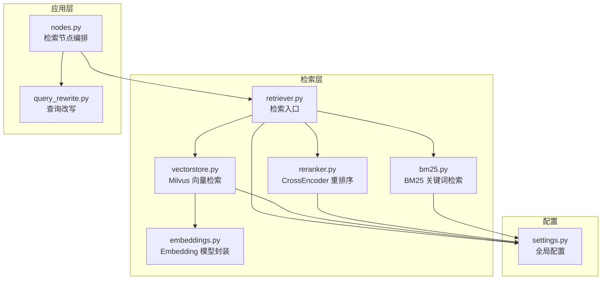
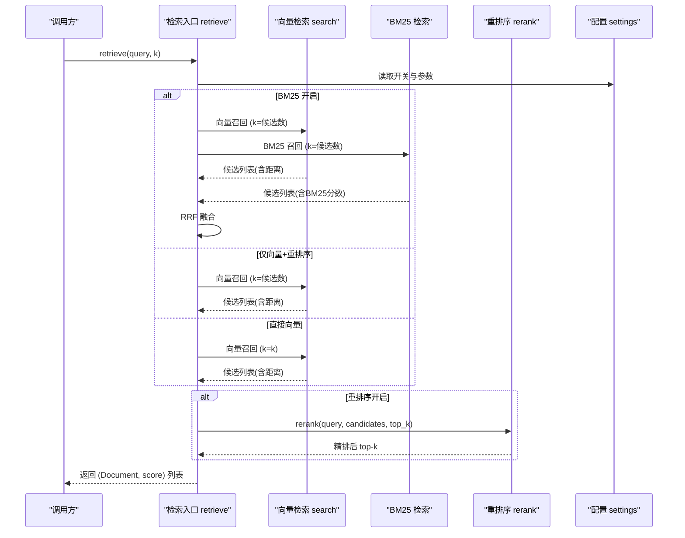
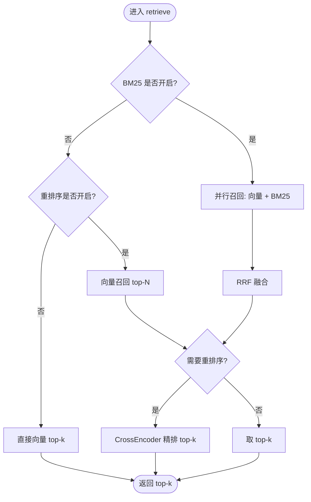
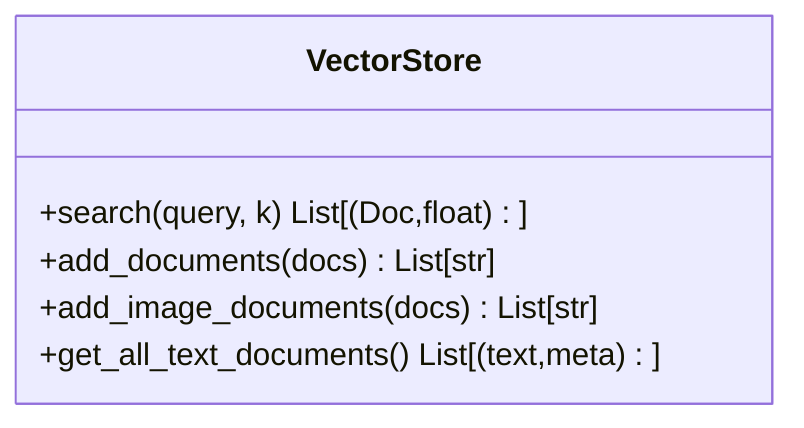
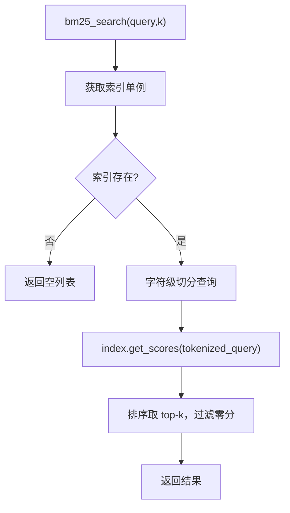
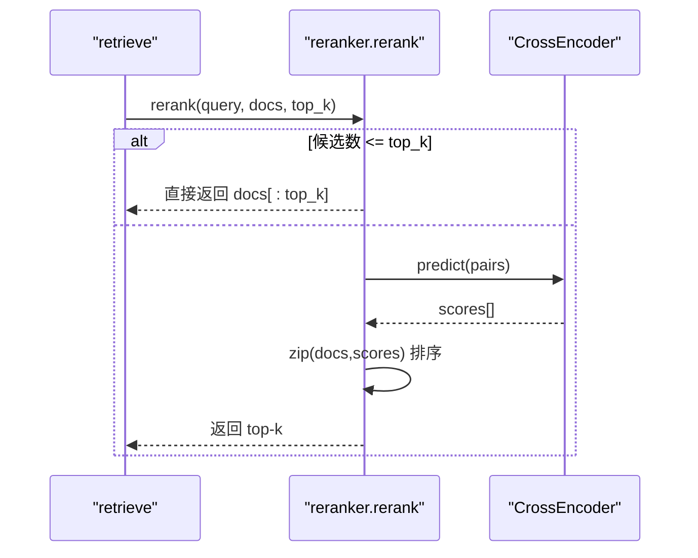
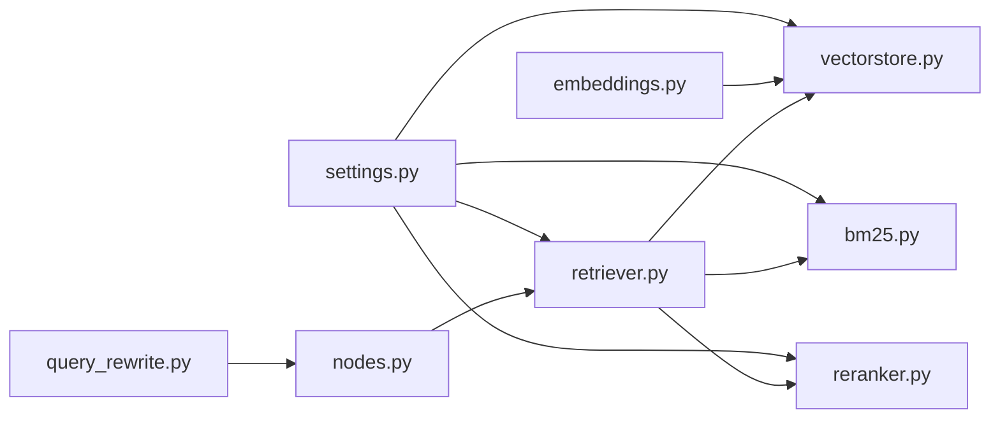

# 检索器模块

<cite>
**本文引用的文件**
- [rag/retriever.py](file://rag/retriever.py)
- [rag/bm25.py](file://rag/bm25.py)
- [rag/vectorstore.py](file://rag/vectorstore.py)
- [rag/embeddings.py](file://rag/embeddings.py)
- [rag/reranker.py](file://rag/reranker.py)
- [config/settings.py](file://config/settings.py)
- [agent/query_rewrite.py](file://agent/query_rewrite.py)
- [agent/nodes.py](file://agent/nodes.py)
- [rag/web_search.py](file://rag/web_search.py)
</cite>

## 目录
1. [简介](#简介)
2. [项目结构](#项目结构)
3. [核心组件](#核心组件)
4. [架构总览](#架构总览)
5. [详细组件分析](#详细组件分析)
6. [依赖关系分析](#依赖关系分析)
7. [性能与优化](#性能与优化)
8. [故障排查指南](#故障排查指南)
9. [结论](#结论)
10. [附录：配置示例与最佳实践](#附录配置示例与最佳实践)

## 简介
本模块提供混合检索能力，将向量检索（语义相似度）与关键词检索（BM25）结合，并通过重排序模型对候选结果进行精排，最终输出高质量上下文。同时支持查询改写、结果过滤与格式化，适配不同业务场景的召回精度与延迟需求。

## 项目结构
检索相关代码主要位于 rag/ 目录下，配合 agent/ 中的查询改写与节点编排，以及 config/settings.py 的统一配置管理。

图表来源
- [rag/retriever.py:18-52](file://rag/retriever.py#L18-L52)
- [rag/vectorstore.py:164-184](file://rag/vectorstore.py#L164-L184)
- [rag/bm25.py:69-97](file://rag/bm25.py#L69-L97)
- [rag/reranker.py:54-97](file://rag/reranker.py#L54-L97)
- [config/settings.py:50-100](file://config/settings.py#L50-L100)

章节来源
- [rag/retriever.py:18-52](file://rag/retriever.py#L18-L52)
- [config/settings.py:50-100](file://config/settings.py#L50-L100)

## 核心组件
- 检索入口 retriever.retrieve：根据配置选择多路召回或单路向量检索，并可选重排序与结果过滤。
- 向量检索 vectorstore.search：基于 Milvus Lite 的语义检索，返回带距离分数的结果，内置低相关度过滤。
- 关键词检索 bm25.bm25_search：内存 BM25 索引，字符级切分，返回关键词匹配分数。
- 重排序 reranker.rerank：使用 CrossEncoder 对候选文档逐对打分，提升相关性排序质量。
- Embedding embeddings.get_embeddings：统一文本/图像编码接口，支持多模态与纯文本两种模型。
- 查询改写 query_rewrite.rewrite_query：用 LLM 将口语化问题改写为更利于检索的形式。
- 配置 settings.Settings：集中管理检索、重排序、BM25、向量库等参数。

章节来源
- [rag/retriever.py:18-52](file://rag/retriever.py#L18-L52)
- [rag/vectorstore.py:164-184](file://rag/vectorstore.py#L164-L184)
- [rag/bm25.py:69-97](file://rag/bm25.py#L69-L97)
- [rag/reranker.py:54-97](file://rag/reranker.py#L54-L97)
- [rag/embeddings.py:164-179](file://rag/embeddings.py#L164-L179)
- [agent/query_rewrite.py:26-58](file://agent/query_rewrite.py#L26-L58)
- [config/settings.py:50-100](file://config/settings.py#L50-L100)

## 架构总览
检索流程遵循“召回 + 精排”的两阶段范式，支持三种模式：
- 多路召回：向量检索 + BM25 并行召回 → RRF 融合 →（可选）重排序 → top-k
- 仅向量检索：top-N 候选 → CrossEncoder 精排 → top-k
- 直接向量检索：关闭重排序时直接取 top-k

图表来源
- [rag/retriever.py:18-52](file://rag/retriever.py#L18-L52)
- [rag/vectorstore.py:164-184](file://rag/vectorstore.py#L164-L184)
- [rag/bm25.py:69-97](file://rag/bm25.py#L69-L97)
- [rag/reranker.py:54-97](file://rag/reranker.py#L54-L97)
- [config/settings.py:83-100](file://config/settings.py#L83-L100)

## 详细组件分析

### 检索入口与混合策略（retriever.py）
- 功能要点
  - 根据配置决定多路召回或直接向量检索。
  - 多路召回采用 RRF 融合，公式 score(d)=Σ 1/(rrf_k+rank)，仅依赖排名，不依赖原始分数量纲。
  - 重排序阶段使用 CrossEncoder 对候选逐对打分，返回更高相关性的 top-k。
  - 结果格式化时将向量距离与重排序分数统一归一化为 0~1 的相关度展示。
- 关键路径
  - retrieve：入口函数，分支逻辑由配置驱动。
  - _hybrid_recall：并行召回与回退处理。
  - _rrf_fusion：按 rank 计算融合分数并排序。
  - format_context：生成带来源与相关度的上下文字符串。

图表来源
- [rag/retriever.py:18-52](file://rag/retriever.py#L18-L52)
- [rag/retriever.py:55-110](file://rag/retriever.py#L55-L110)
- [rag/retriever.py:113-139](file://rag/retriever.py#L113-L139)

章节来源
- [rag/retriever.py:18-52](file://rag/retriever.py#L18-L52)
- [rag/retriever.py:55-110](file://rag/retriever.py#L55-L110)
- [rag/retriever.py:113-139](file://rag/retriever.py#L113-L139)

### 向量检索（vectorstore.py）
- 功能要点
  - 基于 Milvus Lite 本地持久化，支持文本与图像同库存储。
  - similarity_search_with_score 返回 L2 距离（越小越相关），并支持分数阈值过滤。
  - 写入加锁避免并发冲突；flush 确保数据可查。
- 关键点
  - search：默认使用配置的 rag_top_k，若过滤后为空则回退原始结果。
  - get_all_text_documents：用于构建 BM25 索引，跳过图像与空文本。

图表来源
- [rag/vectorstore.py:79-106](file://rag/vectorstore.py#L79-L106)
- [rag/vectorstore.py:109-161](file://rag/vectorstore.py#L109-L161)
- [rag/vectorstore.py:164-184](file://rag/vectorstore.py#L164-L184)
- [rag/vectorstore.py:248-281](file://rag/vectorstore.py#L248-L281)

章节来源
- [rag/vectorstore.py:164-184](file://rag/vectorstore.py#L164-L184)
- [rag/vectorstore.py:248-281](file://rag/vectorstore.py#L248-L281)

### 关键词检索（bm25.py）
- 功能要点
  - 进程内单例索引，首次从向量库拉取文本文档构建 BM25 索引。
  - 中文按字符级切分，无需额外分词器。
  - 检索返回 (Document, score)，score 越大越相关，过滤零分结果。
- 关键点
  - get_bm25_index：懒加载，异常时记录日志并安全降级。
  - reset_bm25_index：重建索引后重置单例。

图表来源
- [rag/bm25.py:22-66](file://rag/bm25.py#L22-L66)
- [rag/bm25.py:69-97](file://rag/bm25.py#L69-L97)
- [rag/bm25.py:100-106](file://rag/bm25.py#L100-L106)

章节来源
- [rag/bm25.py:22-66](file://rag/bm25.py#L22-L66)
- [rag/bm25.py:69-97](file://rag/bm25.py#L69-L97)

### 重排序（reranker.py）
- 功能要点
  - 使用 CrossEncoder 对 query-doc 对打分，分数越高越相关。
  - 候选数不足或失败时回退到原始向量检索结果。
- 关键点
  - get_reranker：延迟初始化单例，避免启动开销。
  - rerank：构造 pairs 批量预测，排序后取 top-k。

图表来源
- [rag/reranker.py:30-51](file://rag/reranker.py#L30-L51)
- [rag/reranker.py:54-97](file://rag/reranker.py#L54-L97)

章节来源
- [rag/reranker.py:30-51](file://rag/reranker.py#L30-L51)
- [rag/reranker.py:54-97](file://rag/reranker.py#L54-L97)

### 嵌入模型（embeddings.py）
- 功能要点
  - 支持多模态 Jina CLIP v2（文本+图像）与纯文本 BGE 模型。
  - 通过 get_embeddings 自动选择模型，实现延迟加载与设备配置。
- 关键点
  - JinaClipEmbeddings：文本与图像统一向量空间，维度 1024。
  - BgeEmbeddings：纯文本快速编码，维度 512，适合大规模知识库。

章节来源
- [rag/embeddings.py:29-128](file://rag/embeddings.py#L29-L128)
- [rag/embeddings.py:131-179](file://rag/embeddings.py#L131-L179)

### 查询改写（query_rewrite.py）
- 功能要点
  - 用 LLM 将用户问题改写为更利于检索的形式，补全省略主语、去除口语化表达。
  - 短查询（长度小于阈值）不触发改写，避免无意义改写。
  - 失败时静默回退原始查询，不阻断检索链路。
- 集成点
  - 在检索节点中启用，结合检索策略提升召回率。

章节来源
- [agent/query_rewrite.py:1-58](file://agent/query_rewrite.py#L1-L58)

### 检索节点编排（nodes.py）
- 功能要点
  - 在检索前执行查询改写（可配置）。
  - 仅在纯向量检索路径下应用最低相关度过滤（避免干扰重排序/RRF 的分数语义）。
  - 将检索结果格式化为上下文字符串供生成节点使用。

章节来源
- [agent/nodes.py:297-321](file://agent/nodes.py#L297-L321)

## 依赖关系分析
- retriever 依赖 vectorstore、bm25、reranker 与 settings。
- vectorstore 依赖 embeddings 与 settings。
- bm25 依赖 vectorstore（拉取文本文档）与 settings。
- reranker 依赖 settings。
- nodes 依赖 query_rewrite 与 retriever。

图表来源
- [config/settings.py:50-100](file://config/settings.py#L50-L100)
- [rag/retriever.py:18-52](file://rag/retriever.py#L18-L52)
- [rag/vectorstore.py:164-184](file://rag/vectorstore.py#L164-L184)
- [rag/bm25.py:69-97](file://rag/bm25.py#L69-L97)
- [rag/reranker.py:54-97](file://rag/reranker.py#L54-L97)
- [agent/query_rewrite.py:26-58](file://agent/query_rewrite.py#L26-L58)
- [agent/nodes.py:297-321](file://agent/nodes.py#L297-L321)

章节来源
- [config/settings.py:50-100](file://config/settings.py#L50-L100)
- [rag/retriever.py:18-52](file://rag/retriever.py#L18-L52)

## 性能与优化
- 模型预热与缓存
  - Embedding 与重排序模型均支持延迟加载与单例缓存，避免重复初始化开销。
  - 可通过预下载脚本提前加载模型，减少首请求延迟。
- 索引与检索
  - BM25 索引为进程内单例，首次构建耗时与文档规模相关；重建后可调用重置接口。
  - Milvus Lite 使用 FLAT 索引与 L2 距离度量，适合中小规模知识库；大库建议评估索引类型与硬件加速。
- 召回与精排平衡
  - 多路召回（向量+BM25）+ RRF 融合能提升精确匹配召回率；重排序进一步提升排序质量但增加延迟。
  - 可根据场景调整候选数与 top-k，权衡召回率与响应时间。
- 过滤与截断
  - 向量检索内置距离阈值过滤；纯向量路径下可设置最低相关度阈值，避免低质上下文注入。
  - 上下文预算控制（如 rag_context_budget）可在生成阶段限制注入长度。

[本节为通用性能讨论，不直接分析具体文件]

## 故障排查指南
- BM25 不可用
  - 现象：BM25 检索返回空列表或日志提示未安装依赖。
  - 处理：确认依赖已安装；检查向量库是否有文本文档；必要时重置 BM25 索引。
- 重排序失败
  - 现象：重排序抛出异常或模型加载失败。
  - 处理：检查网络与镜像配置；确认模型名与设备配置；系统会回退到原始向量检索结果。
- 向量检索无结果
  - 现象：搜索返回空或全部被过滤。
  - 处理：检查 rag_score_filter 阈值是否过严；确认集合中存在文档；必要时放宽过滤条件。
- 查询改写无效
  - 现象：改写后查询与原查询相同或未生效。
  - 处理：检查 rag_query_rewrite_enabled 开关；短查询不会触发改写；确认路由 LLM 可用。

章节来源
- [rag/bm25.py:22-66](file://rag/bm25.py#L22-L66)
- [rag/bm25.py:69-97](file://rag/bm25.py#L69-L97)
- [rag/reranker.py:54-97](file://rag/reranker.py#L54-L97)
- [rag/vectorstore.py:164-184](file://rag/vectorstore.py#L164-L184)
- [agent/query_rewrite.py:26-58](file://agent/query_rewrite.py#L26-L58)

## 结论
检索器模块通过“向量检索 + 关键词检索 + 重排序”的组合策略，兼顾召回广度与排序精度，并提供灵活的配置项以适配不同场景。结合查询改写与结果过滤机制，能够在保证性能的同时提升回答质量。建议在知识库规模增长时评估索引与模型选择，并根据业务需求调优候选数与阈值。

[本节为总结性内容，不直接分析具体文件]

## 附录：配置示例与最佳实践

- 典型配置项说明
  - 向量检索
    - milvus_collection：集合名称
    - milvus_index_type：索引类型（Milvus Lite 支持 FLAT）
    - milvus_metric_type：距离度量（L2）
    - rag_top_k：默认返回条数
    - rag_score_filter：距离阈值过滤
    - rag_min_relevance：最低相关度（仅纯向量路径）
  - 多路召回
    - rag_bm25_enabled：是否启用 BM25
    - rag_bm25_candidate_count：BM25 召回候选数
    - rag_rrf_k：RRF 融合常数
  - 重排序
    - rerank_enabled：是否启用重排序
    - rerank_model：重排序模型名
    - rerank_device：运行设备
    - rerank_candidate_count：向量召回候选数
    - rerank_top_k：重排序后返回条数
  - 查询改写
    - rag_query_rewrite_enabled：是否启用查询改写

- 场景化配置建议
  - 高召回优先（复杂问题、长尾知识）
    - 开启 BM25 与重排序；增大候选数；适当提高 RRF 常数；保留较低的最小相关度阈值。
  - 低延迟优先（在线问答、高频查询）
    - 关闭 BM25；降低候选数；关闭重排序或使用较小 top-k；使用纯文本 Embedding 模型。
  - 精确匹配优先（专有名词、编号、术语）
    - 开启 BM25；提高 BM25 候选数；保持重排序以提升排序质量。
  - 多模态知识库
    - 使用多模态 Embedding；确保图像与文本同库；检索时注意图像文档不参与 BM25 关键词检索。

- 最佳实践
  - 预热模型：启动时预加载 Embedding 与重排序模型，降低首请求延迟。
  - 合理切片：调整 chunk_size 与 overlap，避免语义边界截断。
  - 监控指标：关注检索延迟、召回率、重排序成功率与错误率。
  - 动态调整：根据线上反馈逐步调优候选数、阈值与 top-k。

章节来源
- [config/settings.py:50-100](file://config/settings.py#L50-L100)
- [rag/retriever.py:18-52](file://rag/retriever.py#L18-L52)
- [rag/vectorstore.py:164-184](file://rag/vectorstore.py#L164-L184)
- [rag/bm25.py:69-97](file://rag/bm25.py#L69-L97)
- [rag/reranker.py:54-97](file://rag/reranker.py#L54-L97)
- [agent/query_rewrite.py:26-58](file://agent/query_rewrite.py#L26-L58)