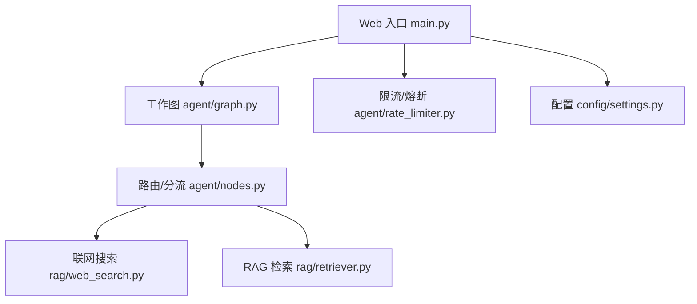
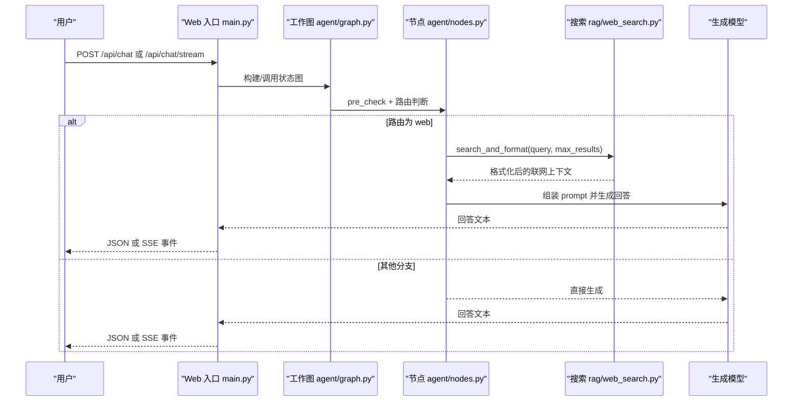
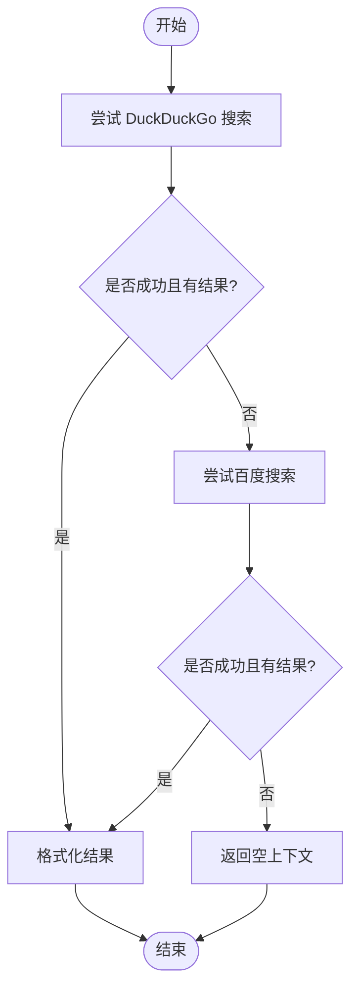
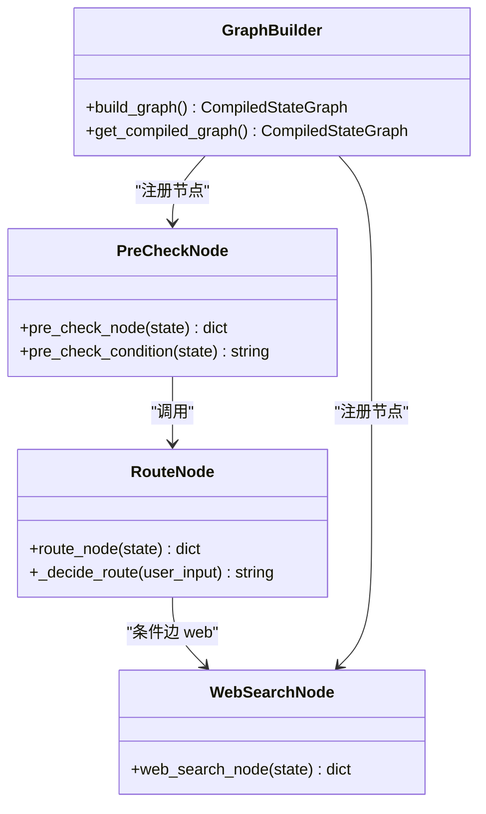
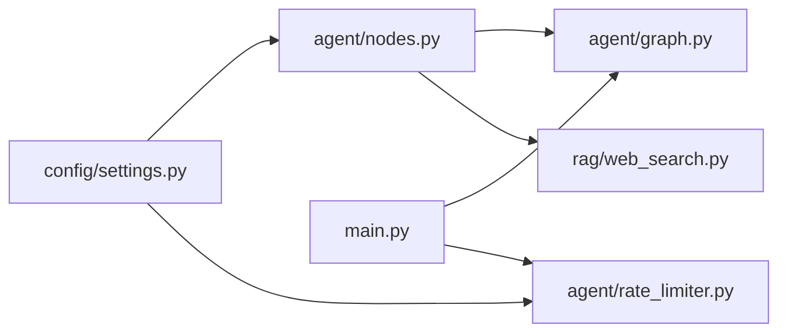
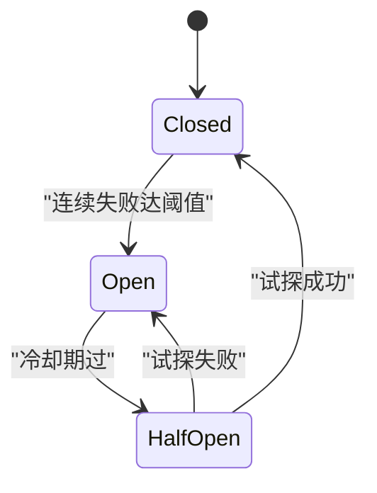

# 联网搜索集成

<cite>
**本文引用的文件**
- [rag/web_search.py](file://rag/web_search.py)
- [agent/nodes.py](file://agent/nodes.py)
- [agent/graph.py](file://agent/graph.py)
- [config/settings.py](file://config/settings.py)
- [main.py](file://main.py)
- [agent/rate_limiter.py](file://agent/rate_limiter.py)
- [rag/retriever.py](file://rag/retriever.py)
- [tests/test_smoke.py](file://tests/test_smoke.py)
</cite>

## 目录
1. [简介](#简介)
2. [项目结构](#项目结构)
3. [核心组件](#核心组件)
4. [架构总览](#架构总览)
5. [详细组件分析](#详细组件分析)
6. [依赖关系分析](#依赖关系分析)
7. [性能与限流](#性能与限流)
8. [结果质量评估](#结果质量评估)
9. [缓存机制](#缓存机制)
10. [搜索引擎适配方法](#搜索引擎适配方法)
11. [异常处理与故障恢复](#异常处理与故障恢复)
12. [API配置示例与使用指南](#api配置示例与使用指南)
13. [故障排查](#故障排查)
14. [结论](#结论)

## 简介
本技术文档围绕“联网搜索集成”展开，系统解析搜索引擎 API 调用、搜索结果获取、内容提取与格式化、请求限流策略、结果质量评估、缓存机制、多搜索引擎适配、搜索策略优化以及异常处理方案。该能力通过智能体工作流中的“联网搜索”分支接入，将外部网络信息作为上下文注入生成环节，提升时效性与准确性。

## 项目结构
联网搜索相关代码主要分布在以下模块：
- 搜索实现与格式化：rag/web_search.py
- 工作流编排与节点：agent/graph.py、agent/nodes.py
- 全局配置：config/settings.py
- Web 入口与流式接口：main.py
- 限流与熔断：agent/rate_limiter.py
- RAG 检索（对比参考）：rag/retriever.py
- 测试用例：tests/test_smoke.py

图表来源
- [main.py:154-210](file://main.py#L154-L210)
- [agent/graph.py:44-102](file://agent/graph.py#L44-L102)
- [agent/nodes.py:153-222](file://agent/nodes.py#L153-L222)
- [rag/web_search.py:19-94](file://rag/web_search.py#L19-L94)
- [rag/retriever.py:18-52](file://rag/retriever.py#L18-L52)
- [agent/rate_limiter.py:22-47](file://agent/rate_limiter.py#L22-L47)
- [config/settings.py:109-112](file://config/settings.py#L109-L112)

章节来源
- [main.py:154-210](file://main.py#L154-L210)
- [agent/graph.py:44-102](file://agent/graph.py#L44-L102)
- [agent/nodes.py:153-222](file://agent/nodes.py#L153-L222)
- [rag/web_search.py:19-94](file://rag/web_search.py#L19-L94)
- [rag/retriever.py:18-52](file://rag/retriever.py#L18-L52)
- [agent/rate_limiter.py:22-47](file://agent/rate_limiter.py#L22-L47)
- [config/settings.py:109-112](file://config/settings.py#L109-L112)

## 核心组件
- 双引擎搜索：优先 DuckDuckGo，失败或无结果时回退百度，统一返回结构化结果并格式化为上下文字符串。
- 工作流节点：web_search_node 负责调用搜索并写入 rag_context，供后续 generate 节点使用。
- 路由判断：根据用户输入与时效性特征决定走 web 分支。
- 配置管理：web_search_enabled、web_search_max_results、web_search_timeout 等开关与参数。
- 限流与熔断：按用户维度滑动窗口限流；连续失败触发熔断保护。
- 测试验证：对模块导入、配置项读取、格式化函数进行断言。

章节来源
- [rag/web_search.py:19-94](file://rag/web_search.py#L19-L94)
- [agent/nodes.py:324-341](file://agent/nodes.py#L324-L341)
- [agent/nodes.py:161-211](file://agent/nodes.py#L161-L211)
- [config/settings.py:109-112](file://config/settings.py#L109-L112)
- [agent/rate_limiter.py:22-47](file://agent/rate_limiter.py#L22-L47)
- [tests/test_smoke.py:276-315](file://tests/test_smoke.py#L276-L315)

## 架构总览
联网搜索在智能体工作流中作为独立分支存在，与知识库检索并列，最终都汇入生成节点形成上下文。

图表来源
- [main.py:154-210](file://main.py#L154-L210)
- [agent/graph.py:44-102](file://agent/graph.py#L44-L102)
- [agent/nodes.py:153-222](file://agent/nodes.py#L153-L222)
- [rag/web_search.py:97-133](file://rag/web_search.py#L97-L133)

## 详细组件分析

### 搜索引擎实现与格式化（rag/web_search.py）
- 双引擎策略：
  - 优先 DuckDuckGo：通过 ddgs 库执行文本搜索，标准化结果为 {title, url, snippet}。
  - 回退百度：当 DDG 不可用或无结果时，使用 baidusearch 库搜索同一查询。
- 结果格式化：
  - format_search_results 将结果列表拼接为带来源标记的文本块，便于生成节点消费。
  - search_and_format 提供一站式调用，直接返回上下文字符串。
- 错误处理：
  - 各引擎调用均捕获异常并记录日志，保证主链路不中断。

图表来源
- [rag/web_search.py:19-94](file://rag/web_search.py#L19-L94)
- [rag/web_search.py:97-133](file://rag/web_search.py#L97-L133)

章节来源
- [rag/web_search.py:19-94](file://rag/web_search.py#L19-L94)
- [rag/web_search.py:97-133](file://rag/web_search.py#L97-L133)

### 工作流节点与路由（agent/nodes.py、agent/graph.py）
- 路由判断：
  - 时效性问题（含时间表达或天气关键词）优先走 web 分支，避免过时答案污染记忆。
  - 支持 LLM 路由与关键词兜底，确保稳定性。
- 条件边：
  - 预检查后根据 search_route 分流至 retrieve、web_search、load_memory、tool 或 generate。
- 联网搜索节点：
  - web_search_node 调用 search_and_format，并将结果写入 rag_context。
  - 若搜索失败或无结果，降级为空上下文，不影响后续生成。

图表来源
- [agent/nodes.py:92-158](file://agent/nodes.py#L92-L158)
- [agent/nodes.py:161-222](file://agent/nodes.py#L161-L222)
- [agent/nodes.py:324-341](file://agent/nodes.py#L324-L341)
- [agent/graph.py:44-102](file://agent/graph.py#L44-L102)

章节来源
- [agent/nodes.py:92-158](file://agent/nodes.py#L92-L158)
- [agent/nodes.py:161-222](file://agent/nodes.py#L161-L222)
- [agent/nodes.py:324-341](file://agent/nodes.py#L324-L341)
- [agent/graph.py:44-102](file://agent/graph.py#L44-L102)

### 配置管理（config/settings.py）
- 联网搜索开关与参数：
  - web_search_enabled：是否启用联网搜索。
  - web_search_max_results：最大返回条数。
  - web_search_timeout：搜索超时秒数（当前未在网络层强制使用，但可作为扩展点）。
- 其他相关：
  - 限流与熔断阈值、冷却时间等用于整体服务保护。

章节来源
- [config/settings.py:109-112](file://config/settings.py#L109-L112)
- [config/settings.py:143-149](file://config/settings.py#L143-L149)

### Web 入口与流式接口（main.py）
- 同步接口 /api/chat：
  - 安全过滤 → 限流 → 熔断 → 调用图 → 返回 JSON。
- 流式接口 /api/chat/stream：
  - 基于 SSE 推送 token，支持整体超时保护，完成后重置熔断器。
- 健康检查 /health：
  - 返回服务状态与检查器类型。

章节来源
- [main.py:154-210](file://main.py#L154-L210)
- [main.py:228-314](file://main.py#L228-L314)
- [main.py:317-326](file://main.py#L317-L326)

## 依赖关系分析
- 模块耦合：
  - nodes.py 依赖 graph.py 编排，并通过 settings.py 读取配置。
  - web_search.py 仅依赖第三方搜索库（ddgs、baidusearch），与上层解耦良好。
- 外部依赖：
  - 搜索引擎 SDK 可能受网络与反爬策略影响，需通过回退与异常处理保障可用性。
- 潜在循环依赖：
  - 当前结构清晰，未见循环导入；各模块按需 import，降低启动成本。

图表来源
- [config/settings.py:109-112](file://config/settings.py#L109-L112)
- [agent/nodes.py:161-211](file://agent/nodes.py#L161-L211)
- [agent/graph.py:44-102](file://agent/graph.py#L44-L102)
- [rag/web_search.py:19-94](file://rag/web_search.py#L19-L94)
- [main.py:154-210](file://main.py#L154-L210)

章节来源
- [config/settings.py:109-112](file://config/settings.py#L109-L112)
- [agent/nodes.py:161-211](file://agent/nodes.py#L161-L211)
- [agent/graph.py:44-102](file://agent/graph.py#L44-L102)
- [rag/web_search.py:19-94](file://rag/web_search.py#L19-L94)
- [main.py:154-210](file://main.py#L154-L210)

## 性能与限流
- 滑动窗口限流：
  - 按 user_id 维度限制每分钟请求数，防止滥用与过载。
- 熔断器：
  - 连续失败达到阈值进入 open 状态，拒绝请求；冷却期过后进入 half_open 试探一次，成功则恢复 closed。
- 流式超时保护：
  - 流式接口设置整体超时，超时后返回已生成内容，避免连接卡死。

图表来源
- [agent/rate_limiter.py:50-122](file://agent/rate_limiter.py#L50-L122)
- [main.py:228-314](file://main.py#L228-L314)

章节来源
- [agent/rate_limiter.py:22-47](file://agent/rate_limiter.py#L22-L47)
- [agent/rate_limiter.py:50-122](file://agent/rate_limiter.py#L50-L122)
- [main.py:228-314](file://main.py#L228-L314)

## 结果质量评估
- 搜索引擎侧：
  - 双引擎策略提高召回率与鲁棒性；DDG 优先，百度回退。
- 生成侧：
  - 联网搜索结果以“联网搜索”类型标记注入上下文，便于模型区分来源。
- 对比参考（RAG）：
  - RAG 路径支持重排序与多路召回融合，可借鉴其分数归一化与阈值过滤思想用于未来搜索质量评估。

章节来源
- [rag/web_search.py:97-133](file://rag/web_search.py#L97-L133)
- [rag/retriever.py:18-52](file://rag/retriever.py#L18-L52)
- [rag/retriever.py:113-139](file://rag/retriever.py#L113-L139)

## 缓存机制
- 问答记忆缓存：
  - 相似问题命中历史答案，跳过生成链路，显著降低延迟。
  - 时效性问题不匹配缓存，避免返回过时答案。
- 会话摘要：
  - 短期窗口超出时压缩旧消息为摘要，保留主线上下文。
- 注意：
  - 当前联网搜索本身未实现结果级缓存；可在 web_search.py 中增加基于 query 的结果缓存以提升性能。

章节来源
- [agent/nodes.py:232-281](file://agent/nodes.py#L232-L281)
- [agent/nodes.py:602-628](file://agent/nodes.py#L602-L628)

## 搜索引擎适配方法
- 新增搜索引擎适配器步骤：
  1. 在 web_search.py 中新增 search_xxx 函数，返回统一格式 {title, url, snippet}。
  2. 在 web_search 函数中增加回退逻辑，按优先级依次尝试。
  3. 在 settings.py 中增加对应开关或超时配置（可选）。
  4. 在 tests/test_smoke.py 中添加导入与基础功能断言。
- 注意事项：
  - 保持异常捕获与日志记录，确保主链路稳定。
  - 统一结果字段命名，便于格式化与下游消费。

章节来源
- [rag/web_search.py:19-94](file://rag/web_search.py#L19-L94)
- [config/settings.py:109-112](file://config/settings.py#L109-L112)
- [tests/test_smoke.py:276-315](file://tests/test_smoke.py#L276-L315)

## 异常处理与故障恢复
- 搜索引擎异常：
  - 捕获网络异常与解析异常，记录日志并返回空结果，继续流程。
- 路由异常：
  - LLM 路由失败时回退到关键词规则，保证基本可用。
- 服务保护：
  - 限流与熔断防止雪崩；流式接口超时保护避免长连接阻塞。
- 降级策略：
  - 搜索无结果时降级为空上下文，生成节点仍可基于其他上下文回答。

章节来源
- [rag/web_search.py:29-44](file://rag/web_search.py#L29-L44)
- [rag/web_search.py:57-73](file://rag/web_search.py#L57-L73)
- [agent/nodes.py:180-211](file://agent/nodes.py#L180-L211)
- [agent/rate_limiter.py:50-122](file://agent/rate_limiter.py#L50-L122)
- [main.py:228-314](file://main.py#L228-L314)

## API配置示例与使用指南
- 环境变量与 .env 配置项（联网搜索）：
  - web_search_enabled：true/false
  - web_search_max_results：整数（建议 3-10）
  - web_search_timeout：整数秒（可扩展到网络层）
- 使用方式：
  - 通过 Web 接口 /api/chat 或 /api/chat/stream 发送用户输入。
  - 路由会自动识别时效性问题并走 web 分支。
  - 生成节点将联网搜索结果作为上下文注入，输出回答。
- 调试与测试：
  - 使用 tests/test_smoke.py 验证模块导入、配置读取与格式化函数。
  - 本地 REPL 模式可快速验证端到端流程。

章节来源
- [config/settings.py:109-112](file://config/settings.py#L109-L112)
- [main.py:154-210](file://main.py#L154-L210)
- [main.py:228-314](file://main.py#L228-L314)
- [tests/test_smoke.py:276-315](file://tests/test_smoke.py#L276-L315)

## 故障排查
- 现象：搜索无结果
  - 检查 DDG 与百度可用性；查看日志中“搜索失败”提示。
  - 确认 web_search_enabled 与 web_search_max_results 配置正确。
- 现象：频繁被限流
  - 调整 rate_limit_per_minute；检查客户端重试频率。
- 现象：服务不可用（503）
  - 熔断器处于 open 状态；等待冷却期或排查后端异常。
- 现象：流式接口超时
  - 调整 stream_timeout；检查网络与上游服务响应时间。

章节来源
- [rag/web_search.py:29-44](file://rag/web_search.py#L29-L44)
- [rag/web_search.py:57-73](file://rag/web_search.py#L57-L73)
- [agent/rate_limiter.py:22-47](file://agent/rate_limiter.py#L22-L47)
- [agent/rate_limiter.py:50-122](file://agent/rate_limiter.py#L50-L122)
- [main.py:228-314](file://main.py#L228-L314)

## 结论
本项目实现了稳健的联网搜索集成，采用双引擎策略与统一格式化，结合智能体工作流将网络信息注入生成环节。通过限流与熔断保障服务稳定性，配合问答记忆与会话摘要提升性能与体验。未来可进一步引入结果级缓存、更精细的质量评估与更多搜索引擎适配，以满足多样化场景需求。