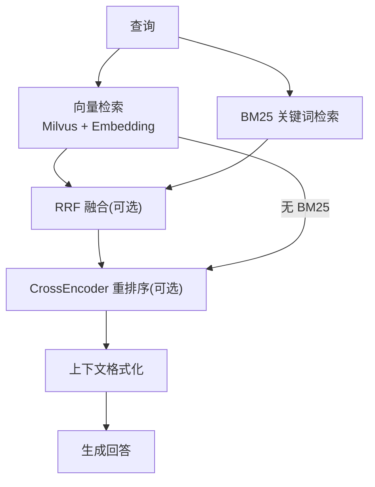
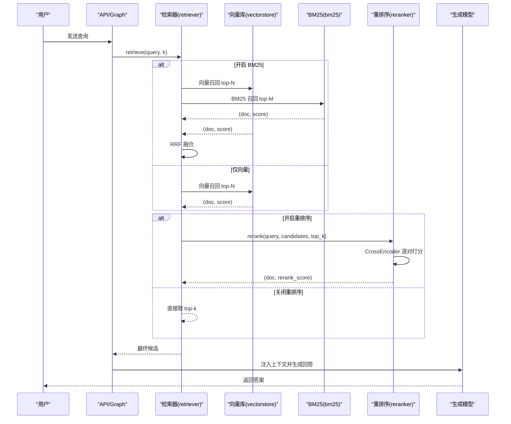
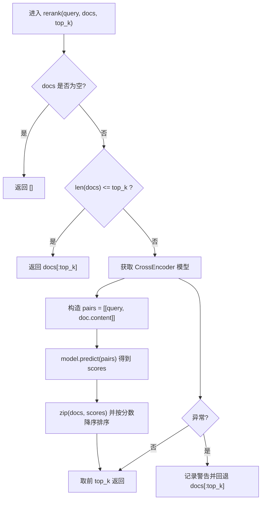
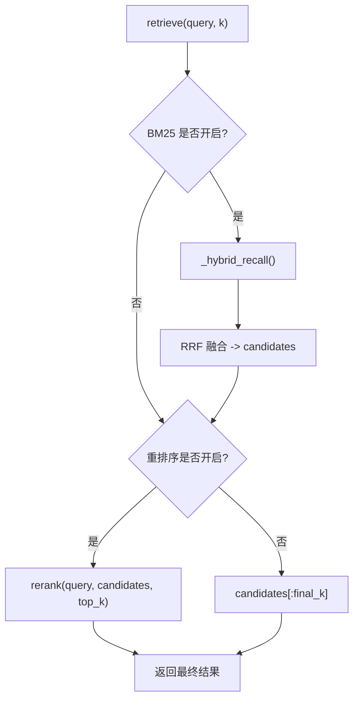
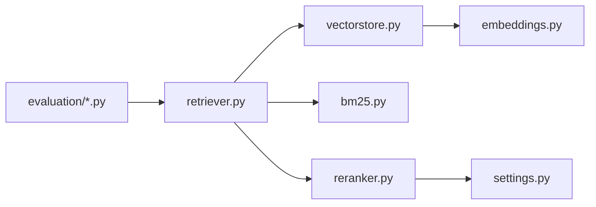

# 重排序引擎

<cite>
**本文引用的文件**
- [rag/reranker.py](file://rag/reranker.py)
- [rag/retriever.py](file://rag/retriever.py)
- [config/settings.py](file://config/settings.py)
- [rag/vectorstore.py](file://rag/vectorstore.py)
- [rag/bm25.py](file://rag/bm25.py)
- [evaluation/rag_eval.py](file://evaluation/rag_eval.py)
- [evaluation/run_eval.py](file://evaluation/run_eval.py)
- [main.py](file://main.py)
</cite>

## 目录
1. [简介](#简介)
2. [项目结构](#项目结构)
3. [核心组件](#核心组件)
4. [架构总览](#架构总览)
5. [详细组件分析](#详细组件分析)
6. [依赖关系分析](#依赖关系分析)
7. [性能与优化](#性能与优化)
8. [效果评估与调优](#效果评估与调优)
9. [故障排查指南](#故障排查指南)
10. [结论](#结论)
11. [附录：配置示例与最佳实践](#附录配置示例与最佳实践)

## 简介
本技术文档聚焦于“重排序引擎”，全面解析结果重排序算法、相关性评分机制、多模型融合策略，以及重排序模型选择、权重配置、性能优化与效果评估方法。文档同时提供重排序前后结果对比思路、阈值调优建议与自定义重排序逻辑实现路径，并给出具体配置示例与调优指南，帮助读者在生产环境中稳定高效地提升检索质量。

## 项目结构
重排序能力位于 RAG 检索链路中，作为两阶段召回的第二阶段精排环节。整体流程如下：
- 向量检索（Milvus + Embedding）召回候选集
- 可选 BM25 关键词检索并行召回
- 可选 RRF 融合向量与 BM25 结果
- 可选 CrossEncoder 重排序精排
- 上下文格式化后供生成节点使用

图表来源
- [rag/retriever.py:18-52](file://rag/retriever.py#L18-L52)
- [rag/vectorstore.py:164-184](file://rag/vectorstore.py#L164-L184)
- [rag/bm25.py:69-97](file://rag/bm25.py#L69-L97)
- [rag/reranker.py:54-98](file://rag/reranker.py#L54-L98)

章节来源
- [rag/retriever.py:1-52](file://rag/retriever.py#L1-L52)
- [rag/vectorstore.py:164-184](file://rag/vectorstore.py#L164-L184)
- [rag/bm25.py:1-106](file://rag/bm25.py#L1-L106)
- [rag/reranker.py:1-98](file://rag/reranker.py#L1-L98)

## 核心组件
- 重排序器（reranker）：基于 CrossEncoder 的逐对打分与排序，默认模型为 BAAI/bge-reranker-base，支持设备与长度等参数配置。
- 检索器（retriever）：编排向量检索、BM25 召回、RRF 融合与重排序，统一输出 (Document, score) 列表。
- 向量库（vectorstore）：Milvus Lite 封装，负责相似度搜索与分数过滤。
- BM25 模块（bm25）：内存索引的关键词检索，与向量检索互补。
- 配置中心（settings）：集中管理所有开关与阈值，包括重排序开关、候选数、top-k、设备、模型等。
- 评估模块（evaluation）：RAG 质量评估与运行入口，用于量化重排序带来的收益。

章节来源
- [rag/reranker.py:30-98](file://rag/reranker.py#L30-L98)
- [rag/retriever.py:18-52](file://rag/retriever.py#L18-L52)
- [rag/vectorstore.py:164-184](file://rag/vectorstore.py#L164-L184)
- [rag/bm25.py:22-97](file://rag/bm25.py#L22-L97)
- [config/settings.py:95-100](file://config/settings.py#L95-L100)
- [evaluation/rag_eval.py:63-121](file://evaluation/rag_eval.py#L63-L121)

## 架构总览
重排序在检索链路中的位置与数据流如下：

图表来源
- [rag/retriever.py:18-52](file://rag/retriever.py#L18-L52)
- [rag/vectorstore.py:164-184](file://rag/vectorstore.py#L164-L184)
- [rag/bm25.py:69-97](file://rag/bm25.py#L69-L97)
- [rag/reranker.py:54-98](file://rag/reranker.py#L54-L98)

## 详细组件分析

### 重排序器（reranker）
- 模型加载：延迟初始化单例，首次调用时从 HuggingFace 镜像下载模型；支持 device 与 max_length 配置。
- 打分方式：将 query 与每个候选文档拼接成 pair，调用 CrossEncoder.predict 得到相关度分数（越大越相关）。
- 排序与回退：按分数降序取 top-k；异常时回退到原始向量检索结果的前 top-k。
- 性能要点：批量预测减少模型调用开销；失败快速降级保障可用性。

图表来源
- [rag/reranker.py:54-98](file://rag/reranker.py#L54-L98)

章节来源
- [rag/reranker.py:30-98](file://rag/reranker.py#L30-L98)

### 检索器（retriever）
- 多路召回：当 BM25 开启时，并行执行向量检索与 BM25 检索，随后进行 RRF 融合；否则仅向量检索。
- 重排序控制：根据 rerank_enabled 决定是否调用 reranker；若关闭则直接取 top-k。
- 上下文格式化：统一归一化分数展示（向量距离越小越相关，重排序分数越大越相关），便于前端展示与阈值判断。

图表来源
- [rag/retriever.py:18-52](file://rag/retriever.py#L18-L52)
- [rag/retriever.py:55-110](file://rag/retriever.py#L55-L110)
- [rag/retriever.py:113-139](file://rag/retriever.py#L113-L139)

章节来源
- [rag/retriever.py:18-139](file://rag/retriever.py#L18-L139)

### 向量检索（vectorstore）
- 相似度搜索：返回 (Document, score)，score 为 L2 距离（越小越相关）。
- 分数过滤：低于阈值的候选会被丢弃，避免低质上下文影响生成。
- 启动预热：服务启动时检查向量库并自动入库或增量更新，确保首请求可用。

章节来源
- [rag/vectorstore.py:164-184](file://rag/vectorstore.py#L164-L184)
- [main.py:80-135](file://main.py#L80-L135)

### BM25 关键词检索（bm25）
- 索引构建：从向量库拉取文本文档，字符级切分构建 BM25 索引（进程内单例）。
- 检索逻辑：查询同样字符级切分，返回 top-k 且过滤零分结果。
- 与向量检索互补：精确匹配场景下可显著提升召回率。

章节来源
- [rag/bm25.py:22-97](file://rag/bm25.py#L22-L97)

### 配置中心（settings）
- 重排序相关配置：
  - rerank_enabled：是否启用重排序
  - rerank_model：重排序模型标识
  - rerank_device：运行设备（cpu/gpu）
  - rerank_candidate_count：向量检索召回候选数
  - rerank_top_k：重排序后返回数量
- 其他关键阈值：
  - rag_bm25_enabled：是否开启 BM25
  - rag_rrf_k：RRF 融合常数
  - rag_score_filter：向量检索分数过滤阈值
  - rag_min_relevance：最低相关度阈值（用于上下文注入）

章节来源
- [config/settings.py:83-100](file://config/settings.py#L83-L100)
- [config/settings.py:64-73](file://config/settings.py#L64-L73)

## 依赖关系分析
- retriever 依赖 vectorstore 与 bm25，并在需要时调用 reranker。
- reranker 依赖 sentence_transformers.CrossEncoder 与 settings。
- vectorstore 依赖 Milvus 与 embeddings。
- evaluation 模块通过 OpenEvals 与 LLM 评判器对检索与回答质量进行评估。

图表来源
- [rag/retriever.py:18-52](file://rag/retriever.py#L18-L52)
- [rag/reranker.py:30-51](file://rag/reranker.py#L30-L51)
- [rag/vectorstore.py:164-184](file://rag/vectorstore.py#L164-L184)
- [evaluation/rag_eval.py:63-121](file://evaluation/rag_eval.py#L63-L121)

章节来源
- [rag/retriever.py:18-52](file://rag/retriever.py#L18-L52)
- [rag/reranker.py:30-51](file://rag/reranker.py#L30-L51)
- [rag/vectorstore.py:164-184](file://rag/vectorstore.py#L164-L184)
- [evaluation/rag_eval.py:63-121](file://evaluation/rag_eval.py#L63-L121)

## 性能与优化
- 模型加载与缓存
  - CrossEncoder 单例延迟初始化，避免启动阻塞；首次加载耗时较长，后续复用显著降低延迟。
  - 可通过环境变量设置 HF 镜像加速下载。
- 批处理与计算
  - reranker 使用 model.predict 批量打分，减少模型调用次数。
  - 合理设置 rerank_candidate_count 与 top_k，平衡召回范围与计算成本。
- 设备与资源
  - rerank_device 可切换 cpu/gpu；GPU 可显著降低推理延迟但需显存充足。
- 降级与容错
  - 重排序异常时自动回退到原始向量检索结果，保证服务可用性。
- 启动预热
  - 服务启动时预热向量库与 BM25 索引，降低首请求延迟。

章节来源
- [rag/reranker.py:30-51](file://rag/reranker.py#L30-L51)
- [rag/reranker.py:77-98](file://rag/reranker.py#L77-L98)
- [main.py:80-135](file://main.py#L80-L135)

## 效果评估与调优
- 评估维度
  - 检索相关性：检索到的文档是否与问题相关
  - 忠实度：答案是否基于检索上下文（无幻觉）
  - 帮助度：回答是否对用户有帮助
  - 答案相关性：回答是否切题
- 评估工具
  - 使用 OpenEvals 的 LLM-as-Judge 构建评估器，并通过 run_eval 批量评估。
- 重排序收益度量
  - 对比开启/关闭重排序的检索相关性、忠实度、帮助度、答案相关性指标变化。
  - 关注 top-k 命中准确率、NDCG@k、平均倒数排名等离线指标（可在评估框架扩展）。
- 阈值调优
  - rerank_candidate_count：增大可提升召回面但增加计算量；过小可能漏掉高相关文档。
  - rerank_top_k：控制注入上下文的条数，过大可能引入噪声。
  - rag_score_filter：向量检索分数过滤阈值，过低会引入无关文档，过高可能召回不足。
  - rag_min_relevance：上下文注入的最小相关度，避免低质上下文导致幻觉。
  - rag_rrf_k：RRF 融合常数，典型值 60，可根据业务分布调整。
- 多模型融合
  - 向量检索 + BM25 + RRF + CrossEncoder 的组合可兼顾语义与关键词匹配。
  - 若 BM25 未开启，仍可通过 CrossEncoder 精排提升精度。
- 自定义重排序逻辑
  - 可在 retriever 中插入自定义融合或打分函数，例如加权混合向量分数与 BM25 分数后再送入 reranker。
  - 也可替换 reranker 的实现，接入本地部署的 CrossEncoder 或其他精排模型。

章节来源
- [evaluation/rag_eval.py:63-121](file://evaluation/rag_eval.py#L63-L121)
- [evaluation/run_eval.py:23-105](file://evaluation/run_eval.py#L23-L105)
- [rag/retriever.py:55-110](file://rag/retriever.py#L55-L110)
- [config/settings.py:83-100](file://config/settings.py#L83-L100)

## 故障排查指南
- 重排序失败回退
  - 现象：日志出现“重排序失败，回退到原始向量检索结果”
  - 原因：模型加载失败、网络问题、输入格式异常等
  - 处理：检查 HF 镜像与网络；确认 rerank_model 与 rerank_device 配置；必要时降低候选数或切换设备
- 向量检索为空或分数过低
  - 现象：检索结果为空或全部被过滤
  - 原因：知识库为空、分数过滤阈值过严、embedding 模型不匹配
  - 处理：检查向量库是否有文档；调整 rag_score_filter；确认 embedding 模型与集合索引类型一致
- BM25 索引为空
  - 现象：BM25 检索返回空
  - 原因：向量库无文本文档或索引未构建
  - 处理：确认已入库文本；重启服务重建索引；检查 get_all_text_documents 是否返回有效数据
- 启动预热失败
  - 现象：服务启动时报错但不影响可用性
  - 处理：查看日志定位具体错误；确保 Milvus 数据库文件路径可写；检查磁盘空间

章节来源
- [rag/reranker.py:95-98](file://rag/reranker.py#L95-L98)
- [rag/vectorstore.py:164-184](file://rag/vectorstore.py#L164-L184)
- [rag/bm25.py:22-66](file://rag/bm25.py#L22-L66)
- [main.py:80-135](file://main.py#L80-L135)

## 结论
该重排序引擎以 CrossEncoder 为核心，结合向量检索与 BM25 关键词检索，通过 RRF 融合与精排显著提升检索质量。系统具备完善的配置管理、性能优化与容错降级机制，并提供标准化的评估工具链用于效果度量与持续调优。生产环境建议：
- 优先开启重排序，并根据业务规模调整候选数与 top-k
- 在 GPU 环境下部署以提升推理速度
- 结合评估报告持续优化阈值与融合策略
- 保持 BM25 与向量检索的协同，增强精确匹配召回

## 附录：配置示例与最佳实践
- 基础配置（环境变量或 .env）
  - 重排序开关与模型
    - rerank_enabled=true
    - rerank_model=BAAI/bge-reranker-base
    - rerank_device=cpu 或 gpu
    - rerank_candidate_count=20
    - rerank_top_k=4
  - 多路召回与融合
    - rag_bm25_enabled=false 或 true
    - rag_rrf_k=60
  - 向量检索过滤
    - rag_score_filter=1.2
    - rag_min_relevance=0.3
- 调优建议
  - 若召回不足：增大 rerank_candidate_count 或 rag_bm25_candidate_count
  - 若噪声过多：减小 rerank_top_k 或提高 rag_min_relevance
  - 若延迟过高：切换到 GPU 设备或降低候选数
  - 若精确匹配差：开启 BM25 并使用 RRF 融合
- 自定义重排序逻辑
  - 在 retriever 中插入自定义打分函数，对向量分数与 BM25 分数进行加权后再送入 reranker
  - 替换 reranker 实现，接入本地部署的精排模型或领域微调模型
- 效果评估
  - 使用 evaluation.run_eval 运行完整评估流程，输出 JSON 报告与控制台汇总
  - 对比开启/关闭重排序的关键指标变化，指导阈值与模型选择

章节来源
- [config/settings.py:83-100](file://config/settings.py#L83-L100)
- [evaluation/run_eval.py:23-105](file://evaluation/run_eval.py#L23-L105)
- [rag/retriever.py:55-110](file://rag/retriever.py#L55-L110)
- [rag/reranker.py:54-98](file://rag/reranker.py#L54-L98)