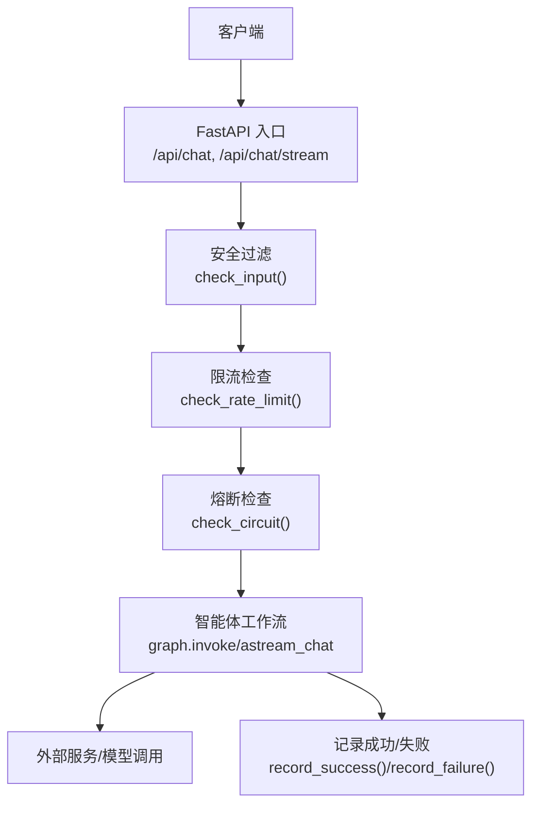
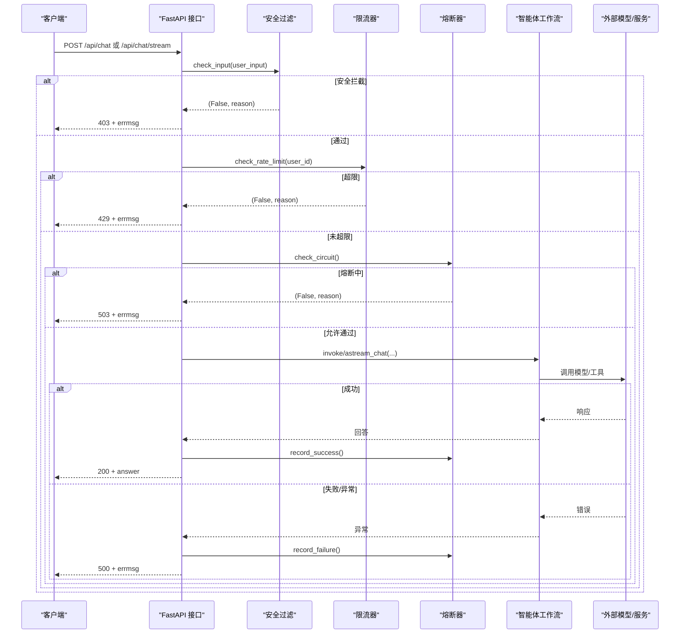
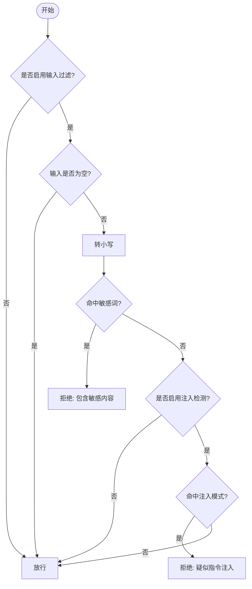
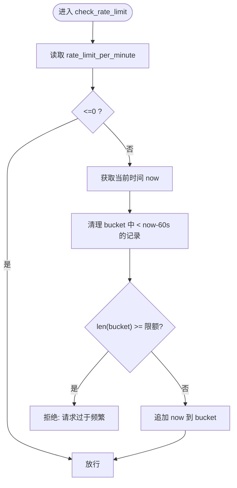
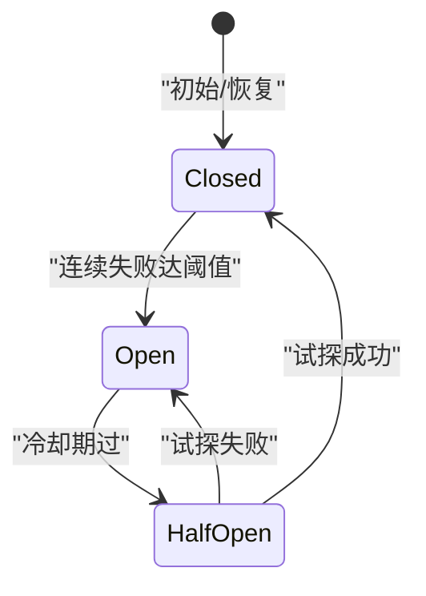
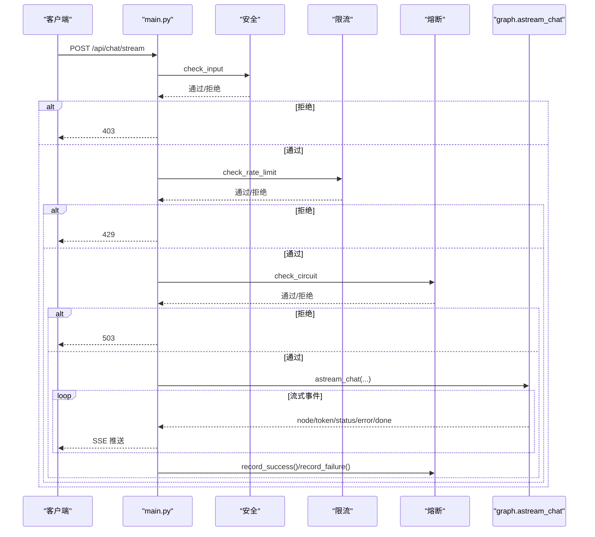
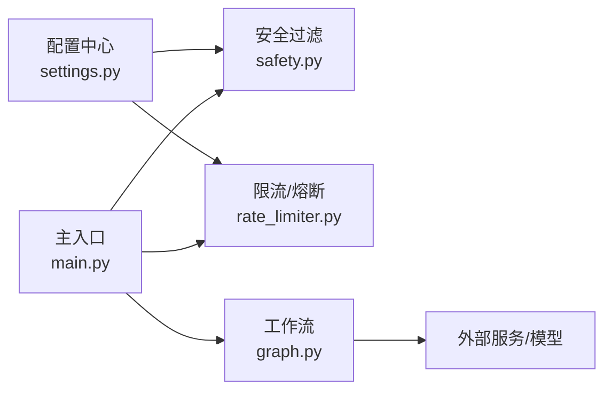

# 安全与限流机制

<cite>
**本文引用的文件**
- [main.py](file://main.py)
- [agent/safety.py](file://agent/safety.py)
- [agent/rate_limiter.py](file://agent/rate_limiter.py)
- [config/settings.py](file://config/settings.py)
- [agent/graph.py](file://agent/graph.py)
</cite>

## 目录
1. [简介](#简介)
2. [项目结构](#项目结构)
3. [核心组件](#核心组件)
4. [架构总览](#架构总览)
5. [详细组件分析](#详细组件分析)
6. [依赖关系分析](#依赖关系分析)
7. [性能考虑](#性能考虑)
8. [故障排查指南](#故障排查指南)
9. [结论](#结论)
10. [附录：配置示例与调优建议](#附录配置示例与调优建议)

## 简介
本技术文档聚焦于系统的安全与限流机制，覆盖输入过滤、内容安全检查、请求限流与熔断保护等关键能力。重点说明敏感词检测、恶意输入防护、频率控制策略和资源保护机制，并给出安全规则配置、限流算法实现、监控告警和故障恢复策略，以及性能调优建议。

## 项目结构
与安全与限流相关的代码主要分布在以下模块：
- 入口与编排：FastAPI 主入口负责统一接入安全与限流检查，串联智能体工作流
- 安全过滤：关键词黑名单与 prompt 注入检测
- 限流与熔断：按用户维度的滑动窗口限流；连续失败触发熔断的半开试探恢复
- 配置管理：集中式环境变量/配置文件加载，提供开关与阈值
- 工作流图：LangGraph 状态图，承载检索、生成、记忆更新等节点

图表来源
- [main.py:154-209](file://main.py#L154-L209)
- [main.py:228-314](file://main.py#L228-L314)
- [agent/safety.py:35-67](file://agent/safety.py#L35-L67)
- [agent/rate_limiter.py:22-47](file://agent/rate_limiter.py#L22-L47)
- [agent/rate_limiter.py:96-117](file://agent/rate_limiter.py#L96-L117)

章节来源
- [main.py:154-209](file://main.py#L154-L209)
- [main.py:228-314](file://main.py#L228-L314)

## 核心组件
- 输入安全过滤：基于关键词黑名单与 prompt 注入模式匹配，默认关闭，可通过配置开启
- 滑动窗口限流：按 user_id 维度统计最近 60 秒内的请求数，超过阈值拒绝
- 熔断器：连续失败达到阈值后进入 open 状态拒绝请求；冷却期过后进入 half_open 放行一次试探，成功则恢复 closed，失败继续 open
- 配置中心：集中管理安全与限流开关、阈值、超时等参数

章节来源
- [agent/safety.py:35-67](file://agent/safety.py#L35-L67)
- [agent/rate_limiter.py:22-47](file://agent/rate_limiter.py#L22-L47)
- [agent/rate_limiter.py:51-122](file://agent/rate_limiter.py#L51-L122)
- [config/settings.py:135-149](file://config/settings.py#L135-L149)

## 架构总览
下图展示了从请求进入到安全与限流检查，再到智能体执行与结果返回的整体流程，包含错误路径与熔断恢复逻辑。

图表来源
- [main.py:154-209](file://main.py#L154-L209)
- [main.py:228-314](file://main.py#L228-L314)
- [agent/safety.py:35-67](file://agent/safety.py#L35-L67)
- [agent/rate_limiter.py:22-47](file://agent/rate_limiter.py#L22-L47)
- [agent/rate_limiter.py:96-117](file://agent/rate_limiter.py#L96-L117)

## 详细组件分析

### 输入安全过滤（敏感词与注入检测）
- 功能要点
  - 关键词黑名单：命中配置的敏感词即拒绝，不回显敏感词避免被探测枚举
  - Prompt 注入检测：匹配常见“忽略以上指令”等中英文注入模式
  - 可配置开关：默认关闭，需启用 INPUT_FILTER_ENABLED 才生效
- 处理流程
  - 读取全局配置，若关闭则直接放行
  - 对空输入快速放行
  - 小写化文本后进行黑名单与注入模式扫描
  - 任一命中即返回拒绝原因

图表来源
- [agent/safety.py:35-67](file://agent/safety.py#L35-L67)
- [config/settings.py:135-141](file://config/settings.py#L135-L141)

章节来源
- [agent/safety.py:35-67](file://agent/safety.py#L35-L67)
- [config/settings.py:135-141](file://config/settings.py#L135-L141)

### 滑动窗口限流（按用户维度）
- 算法说明
  - 维护每个 user_id 的请求时间戳队列（deque），窗口固定为 60 秒
  - 每次请求清理过期时间戳，若当前窗口内数量已达上限则拒绝
  - 使用线程锁保证并发安全
- 行为特征
  - 平滑限制每分钟请求数，避免突发流量冲击
  - 支持按用户隔离，互不影响

图表来源
- [agent/rate_limiter.py:22-47](file://agent/rate_limiter.py#L22-L47)

章节来源
- [agent/rate_limiter.py:22-47](file://agent/rate_limiter.py#L22-L47)
- [config/settings.py:143-149](file://config/settings.py#L143-L149)

### 熔断器（连续失败保护与半开试探）
- 状态机
  - closed：正常状态，记录失败次数
  - open：熔断状态，拒绝所有请求，直到冷却期结束
  - half_open：冷却期结束后放行一次试探，成功则回到 closed，失败则重新 open
- 关键特性
  - 可配置连续失败阈值与冷却时间
  - 线程安全，使用锁保护状态变更
  - 提供便捷方法用于记录成功/失败与查询状态

图表来源
- [agent/rate_limiter.py:51-122](file://agent/rate_limiter.py#L51-L122)

章节来源
- [agent/rate_limiter.py:51-122](file://agent/rate_limiter.py#L51-L122)
- [config/settings.py:143-149](file://config/settings.py#L143-L149)

### 接口集成与错误处理
- 同步接口 /api/chat
  - 顺序执行：安全过滤 → 限流 → 熔断 → 调用工作流 → 记录成功/失败
  - 错误码：403（安全拦截）、429（限流）、503（熔断）、500（异常）
- 流式接口 /api/chat/stream
  - 同样执行安全、限流、熔断前置检查
  - 整体超时保护：按配置 stream_timeout 控制最长等待，超时返回已生成 token 并记为成功
  - 事件类型：status、token、error、done

图表来源
- [main.py:228-314](file://main.py#L228-L314)
- [agent/rate_limiter.py:96-117](file://agent/rate_limiter.py#L96-L117)

章节来源
- [main.py:154-209](file://main.py#L154-L209)
- [main.py:228-314](file://main.py#L228-L314)

### 工作流与资源保护
- 工作流图由 LangGraph 构建，包含预检查、检索、联网搜索、长期记忆、工具调用、生成与后台记忆更新等节点
- 在安全与限流通过后，工作流负责实际业务处理；其内部可能涉及外部模型调用与资源密集型操作
- 流式接口中的整体超时保护防止长连接卡死，保障资源不被长时间占用

章节来源
- [agent/graph.py:1-24](file://agent/graph.py#L1-L24)
- [agent/graph.py:44-102](file://agent/graph.py#L44-L102)
- [main.py:228-314](file://main.py#L228-L314)

## 依赖关系分析
- 安全与限流模块均依赖配置中心读取开关与阈值
- 主入口将安全、限流、熔断作为前置守卫，确保只有合法且受控的请求进入工作流
- 工作流对外部服务（如 LLM）的调用结果反馈给熔断器，形成闭环保护

图表来源
- [config/settings.py:135-149](file://config/settings.py#L135-L149)
- [agent/safety.py:35-67](file://agent/safety.py#L35-L67)
- [agent/rate_limiter.py:22-47](file://agent/rate_limiter.py#L22-L47)
- [main.py:154-209](file://main.py#L154-L209)
- [agent/graph.py:44-102](file://agent/graph.py#L44-L102)

章节来源
- [config/settings.py:135-149](file://config/settings.py#L135-L149)
- [agent/safety.py:35-67](file://agent/safety.py#L35-L67)
- [agent/rate_limiter.py:22-47](file://agent/rate_limiter.py#L22-L47)
- [main.py:154-209](file://main.py#L154-L209)
- [agent/graph.py:44-102](file://agent/graph.py#L44-L102)

## 性能考虑
- 限流采用内存中的 deque 存储时间戳，O(1) 入队与清理头部过期项，整体复杂度低，适合高并发场景
- 熔断器使用线程锁保护状态，避免竞态条件；状态切换仅在失败/成功时发生，开销极小
- 流式接口的整体超时保护避免长连接占用资源，提高吞吐稳定性
- 建议在部署前预热 LLM 连接与向量索引，降低首请求延迟（已在启动钩子中实现）

[本节为通用性能讨论，无需特定文件引用]

## 故障排查指南
- 常见问题定位
  - 403 安全拦截：检查 input_filter_enabled 与 input_blocked_keywords、input_injection_check_enabled 配置是否正确
  - 429 限流：确认 rate_limit_per_minute 阈值是否符合预期；检查同一 user_id 的请求频率
  - 503 熔断：查看 circuit_breaker_threshold 与 circuit_breaker_recovery；关注连续失败日志
  - 500 异常：查看具体异常堆栈；确认外部服务可用性
- 监控与告警建议
  - 记录各阶段拦截比例（安全、限流、熔断）与成功率
  - 暴露健康检查端点以观察服务状态与熔断器状态
  - 对高频拦截与熔断事件设置告警阈值，及时介入

章节来源
- [main.py:154-209](file://main.py#L154-L209)
- [main.py:228-314](file://main.py#L228-L314)
- [agent/rate_limiter.py:75-117](file://agent/rate_limiter.py#L75-L117)

## 结论
本系统通过“安全过滤—限流—熔断”三层前置保护，有效抵御恶意输入、滥用请求与外部服务不稳定带来的风险。配合可配置的策略与流式超时保护，既保障了安全性，又兼顾了可用性与性能。建议在生产环境逐步放开安全与限流开关，结合监控告警持续优化阈值与策略。

[本节为总结性内容，无需特定文件引用]

## 附录：配置示例与调优建议
- 安全规则配置
  - 启用输入过滤：设置 input_filter_enabled=true
  - 配置敏感词黑名单：设置 input_blocked_keywords=词1,词2,...
  - 启用注入检测：设置 input_injection_check_enabled=true
- 限流与熔断配置
  - 每用户每分钟最大请求数：rate_limit_per_minute=数值（<=0 表示不限流）
  - 熔断阈值：circuit_breaker_threshold=数值（<=0 表示不熔断）
  - 熔断恢复冷却时间：circuit_breaker_recovery=秒
- 流式超时保护
  - 流式接口整体超时：stream_timeout=秒
- 调优建议
  - 根据业务峰值调整 rate_limit_per_minute，避免误伤正常用户
  - 合理设置 circuit_breaker_threshold 与 recovery，平衡容错与恢复速度
  - 针对高频拦截词进行白名单或规则细化，减少误判
  - 结合监控指标（拦截率、成功率、熔断次数）动态调参

章节来源
- [config/settings.py:135-149](file://config/settings.py#L135-L149)
- [config/settings.py:47-48](file://config/settings.py#L47-L48)