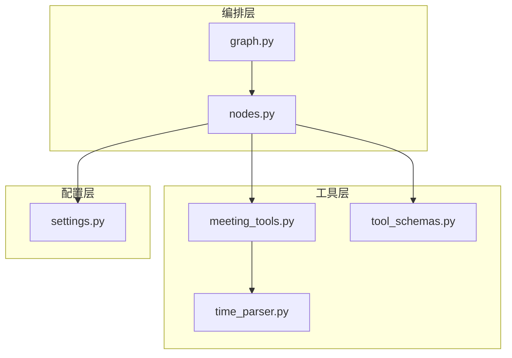
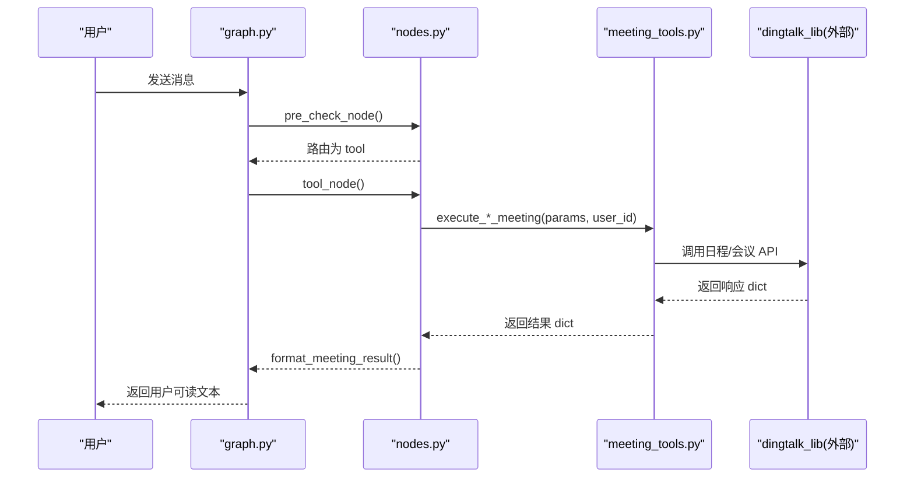
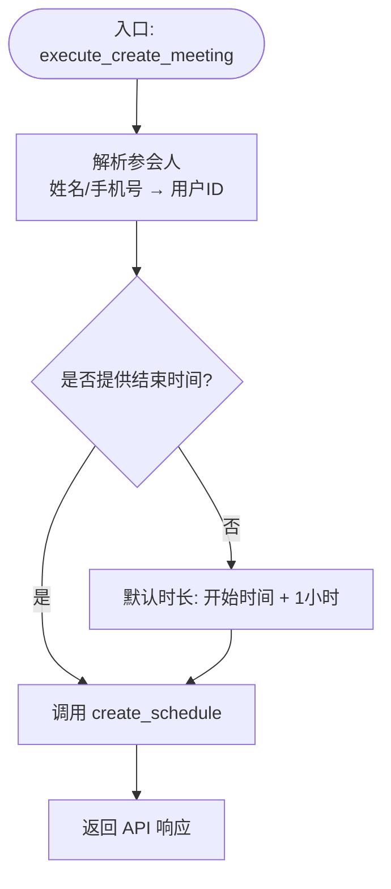
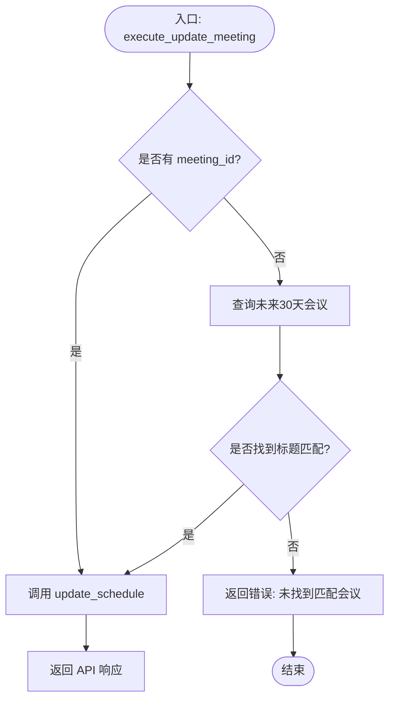
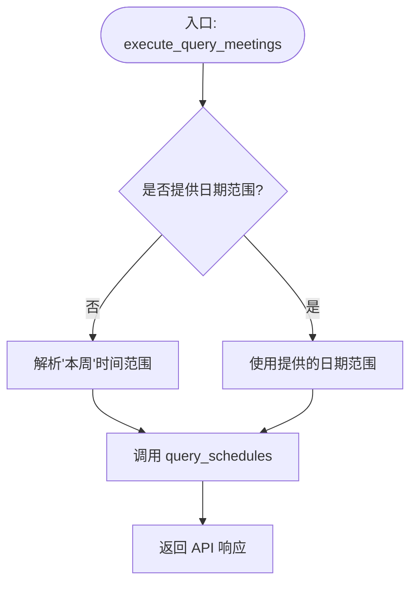
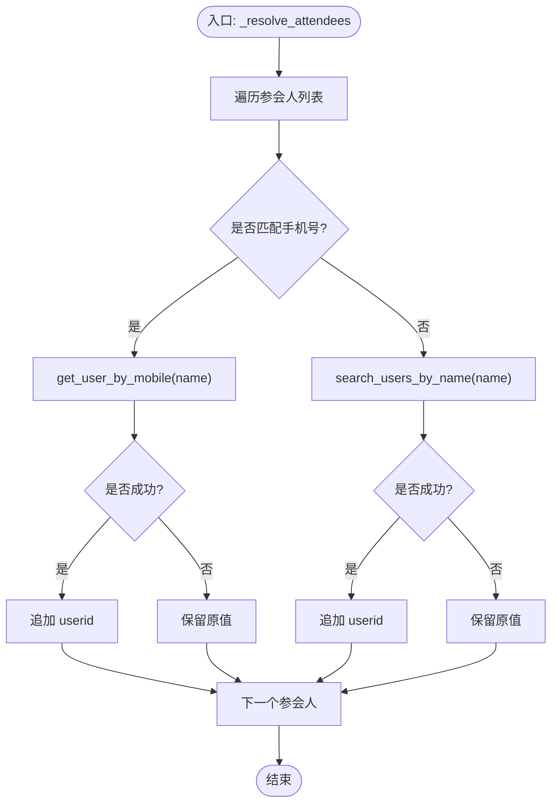
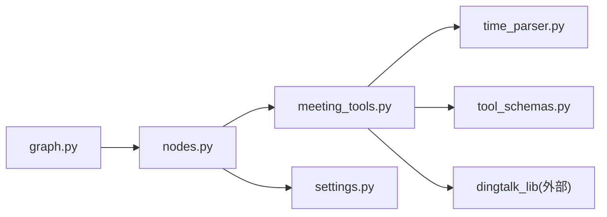

# 会议管理工具

<cite>
**本文引用的文件**
- [meeting_tools.py](file://agent/tools/meeting_tools.py)
- [time_parser.py](file://agent/tools/time_parser.py)
- [tool_schemas.py](file://agent/tools/tool_schemas.py)
- [nodes.py](file://agent/nodes.py)
- [graph.py](file://agent/graph.py)
- [settings.py](file://config/settings.py)
</cite>

## 目录
1. [简介](#简介)
2. [项目结构](#项目结构)
3. [核心组件](#核心组件)
4. [架构总览](#架构总览)
5. [详细组件分析](#详细组件分析)
6. [依赖关系分析](#依赖关系分析)
7. [性能考虑](#性能考虑)
8. [故障排查指南](#故障排查指南)
9. [结论](#结论)
10. [附录：API调用示例与错误处理策略](#附录api调用示例与错误处理策略)

## 简介
本技术文档聚焦于“会议管理工具”的钉钉 API 集成实现，系统性解析会议创建、取消、修改、查询四大核心功能的实现逻辑。重点覆盖参数校验、参会人解析、时间处理、错误处理、结果格式化等关键环节，并对以下函数进行深度剖析：
- execute_create_meeting
- execute_cancel_meeting
- execute_update_meeting
- execute_query_meetings

同时提供完整的调用流程、错误处理策略与最佳实践建议，帮助开发者快速理解并扩展该模块。

## 项目结构
会议管理工具位于 agent/tools 目录下，围绕 meeting_tools.py 组织，配合 time_parser.py 完成自然语言时间解析，tool_schemas.py 定义 LLM Function Calling 的工具 Schema，并在 nodes.py 中通过统一工具执行框架接入工作流。graph.py 编排整体状态图，将 tool 节点直接返回结果（不经过生成节点）。

图表来源
- [meeting_tools.py:1-225](file://agent/tools/meeting_tools.py#L1-L225)
- [time_parser.py:1-120](file://agent/tools/time_parser.py#L1-L120)
- [tool_schemas.py:1-121](file://agent/tools/tool_schemas.py#L1-L121)
- [nodes.py:742-779](file://agent/nodes.py#L742-L779)
- [graph.py:44-102](file://agent/graph.py#L44-L102)
- [settings.py:151-156](file://config/settings.py#L151-L156)

章节来源
- [meeting_tools.py:1-225](file://agent/tools/meeting_tools.py#L1-L225)
- [time_parser.py:1-120](file://agent/tools/time_parser.py#L1-L120)
- [tool_schemas.py:1-121](file://agent/tools/tool_schemas.py#L1-L121)
- [nodes.py:742-779](file://agent/nodes.py#L742-L779)
- [graph.py:44-102](file://agent/graph.py#L44-L102)
- [settings.py:151-156](file://config/settings.py#L151-L156)

## 核心组件
- 会议工具执行器（meeting_tools.py）
  - 负责调用 dingtalk_lib 的日程/会议 API，处理参数转换、参会人解析、默认时长计算、结果格式化。
- 时间解析器（time_parser.py）
  - 将中文自然语言时间表达转换为 ISO 8601 格式，支持“今天/明天/本周/下周/本月”等范围解析。
- 工具 Schema（tool_schemas.py）
  - 定义 create_meeting、cancel_meeting、update_meeting、query_meetings 的参数结构与必填项，供 LLM Function Calling 使用。
- 工具执行与格式化（nodes.py）
  - 统一工具调度、确认机制、结果格式化；写操作需用户确认后执行。
- 工作流编排（graph.py）
  - 构建 LangGraph 状态图，tool 分支直接返回结果，不进入生成节点。
- 配置（settings.py）
  - 控制工具调用开关、是否需要用户确认等全局行为。

章节来源
- [meeting_tools.py:17-159](file://agent/tools/meeting_tools.py#L17-L159)
- [time_parser.py:11-63](file://agent/tools/time_parser.py#L11-L63)
- [tool_schemas.py:55-120](file://agent/tools/tool_schemas.py#L55-L120)
- [nodes.py:742-779](file://agent/nodes.py#L742-L779)
- [graph.py:44-102](file://agent/graph.py#L44-L102)
- [settings.py:151-156](file://config/settings.py#L151-L156)

## 架构总览
会议工具在智能体工作流中的位置如下：
- 预检查节点识别意图并路由到 tool 分支。
- tool 节点根据工具名调用对应执行函数（如 execute_create_meeting）。
- 写操作（创建/取消/修改）默认需要用户确认，确认后执行。
- 读操作（查询）直接执行并返回结果。
- 结果经统一格式化后返回给用户。

图表来源
- [graph.py:44-102](file://agent/graph.py#L44-L102)
- [nodes.py:742-779](file://agent/nodes.py#L742-L779)
- [meeting_tools.py:17-159](file://agent/tools/meeting_tools.py#L17-L159)

## 详细组件分析

### 会议创建 execute_create_meeting
- 功能要点
  - 解析参会人：将姓名或手机号列表解析为钉钉用户ID列表。手机号匹配规则为以1开头且长度为11位数字；否则按姓名搜索。
  - 默认时长：若未提供结束时间且有开始时间，则自动将结束时间设置为开始时间+1小时。
  - 调用 dingtalk_lib.create_schedule 完成创建。
- 关键路径
  - 参会人解析：_resolve_attendees
  - 默认时长：_add_one_hour
  - API 调用：create_schedule
- 错误处理
  - 参会人解析失败时保留原值，交由底层 API 跳过无效 ID。
  - 时间解析异常时回退原始时间字符串。
- 复杂度
  - 参会人解析 O(n)，n 为参会人数。
  - 时间处理 O(1)。

图表来源
- [meeting_tools.py:17-47](file://agent/tools/meeting_tools.py#L17-L47)
- [meeting_tools.py:185-225](file://agent/tools/meeting_tools.py#L185-L225)

章节来源
- [meeting_tools.py:17-47](file://agent/tools/meeting_tools.py#L17-L47)
- [meeting_tools.py:185-225](file://agent/tools/meeting_tools.py#L185-L225)

### 会议取消 execute_cancel_meeting
- 功能要点
  - 优先使用 meeting_id；若无 ID，则按标题在未来30天内查询匹配，找到首个包含标题的会议后取消。
  - 支持是否通知参会人的选项 notify_attendees。
- 关键路径
  - 无 ID 时的标题匹配：query_schedules + 遍历 schedules/result 查找 summary 包含标题的记录。
  - 调用 dingtalk_lib.delete_schedule 完成取消。
- 错误处理
  - 未找到匹配会议时返回 errcode=-1 及明确错误信息。
  - 缺少 meeting_id 或 meeting_title 时返回错误提示。
- 复杂度
  - 查询与匹配 O(m)，m 为未来30天内的会议数量。

图表来源
- [meeting_tools.py:50-80](file://agent/tools/meeting_tools.py#L50-L80)

章节来源
- [meeting_tools.py:50-80](file://agent/tools/meeting_tools.py#L50-L80)

### 会议修改 execute_update_meeting
- 功能要点
  - 优先使用 meeting_id；若无 ID，则按标题在未来30天内查询匹配，找到首个包含标题的会议后更新。
  - updates 字段支持 title/start_time/end_time/location 等更新项。
- 关键路径
  - 无 ID 时的标题匹配：query_schedules + 遍历 schedules/result 查找 summary 包含标题的记录。
  - 调用 dingtalk_lib.update_schedule 完成修改。
- 错误处理
  - 未找到匹配会议时返回 errcode=-1 及明确错误信息。
  - 缺少 meeting_id 或 meeting_title 时返回错误提示。
- 复杂度
  - 查询与匹配 O(m)，m 为未来30天内的会议数量。

图表来源
- [meeting_tools.py:83-113](file://agent/tools/meeting_tools.py#L83-L113)

章节来源
- [meeting_tools.py:83-113](file://agent/tools/meeting_tools.py#L83-L113)

### 会议查询 execute_query_meetings
- 功能要点
  - 支持指定 date_from/date_to；若未提供，则默认查询“本周”。
  - 调用 dingtalk_lib.query_schedules 获取会议列表。
- 关键路径
  - 时间范围解析：parse_natural_date_range("本周")。
  - 调用 query_schedules(user_id, date_from, date_to)。
- 错误处理
  - 由底层 API 返回 errcode 与 errmsg，上层统一格式化输出。
- 复杂度
  - 时间解析 O(1)，查询复杂度取决于后端实现。

图表来源
- [meeting_tools.py:116-128](file://agent/tools/meeting_tools.py#L116-L128)
- [time_parser.py:29-63](file://agent/tools/time_parser.py#L29-L63)

章节来源
- [meeting_tools.py:116-128](file://agent/tools/meeting_tools.py#L116-L128)
- [time_parser.py:29-63](file://agent/tools/time_parser.py#L29-L63)

### 参会人ID解析机制 _resolve_attendees
- 解析策略
  - 手机号：正则匹配 ^1\d{10}$，调用 get_user_by_mobile 获取 userid；失败则保留原值。
  - 姓名：调用 search_users_by_name，取第一个结果的 userid；失败则保留原值。
- 设计考量
  - 允许部分解析失败，交由底层 API 跳过无效 ID，提升鲁棒性。
- 复杂度
  - O(n)，n 为参会人数。

图表来源
- [meeting_tools.py:185-213](file://agent/tools/meeting_tools.py#L185-L213)

章节来源
- [meeting_tools.py:185-213](file://agent/tools/meeting_tools.py#L185-L213)

### 默认时长计算 _add_one_hour
- 功能
  - 给 ISO 8601 时间加 1 小时；解析失败时返回原时间。
- 复杂度
  - O(1)。

章节来源
- [meeting_tools.py:216-225](file://agent/tools/meeting_tools.py#L216-L225)

### 结果格式化 format_meeting_result
- 功能
  - 统一将 API 响应转换为人类可读文本。
  - 针对 create/cancel/update/query 分别输出不同文案。
- 错误处理
  - errcode != 0 时返回“操作失败: 具体错误信息”。
- 复杂度
  - O(k)，k 为会议条目数（查询场景）。

章节来源
- [meeting_tools.py:131-159](file://agent/tools/meeting_tools.py#L131-L159)

### 确认消息格式化 format_meeting_confirmation
- 功能
  - 对写操作（创建/取消/修改）生成确认消息，要求用户回复“确认”后执行。
- 上下文
  - 由 nodes.py 的统一确认机制驱动，结合 tool_schemas 的 WRITE_TOOLS 集合判断。

章节来源
- [meeting_tools.py:162-183](file://agent/tools/meeting_tools.py#L162-L183)
- [tool_schemas.py:116-120](file://agent/tools/tool_schemas.py#L116-L120)
- [nodes.py:742-779](file://agent/nodes.py#L742-L779)

## 依赖关系分析
- 内部依赖
  - meeting_tools.py 依赖 time_parser.py（时间范围解析）、tool_schemas.py（工具 Schema）。
  - nodes.py 统一调度工具执行与结果格式化，并引用 settings.py 的配置开关。
  - graph.py 编排状态图，将 tool 分支直接返回结果。
- 外部依赖
  - dingtalk_lib：日程/会议 API（create_schedule、delete_schedule、update_schedule、query_schedules、get_user_by_mobile、search_users_by_name）。
  - 通过 sys.path.insert 动态导入，保持 skill 自包含特性。

图表来源
- [meeting_tools.py:1-15](file://agent/tools/meeting_tools.py#L1-L15)
- [nodes.py:742-779](file://agent/nodes.py#L742-L779)
- [graph.py:44-102](file://agent/graph.py#L44-L102)

章节来源
- [meeting_tools.py:1-15](file://agent/tools/meeting_tools.py#L1-L15)
- [nodes.py:742-779](file://agent/nodes.py#L742-L779)
- [graph.py:44-102](file://agent/graph.py#L44-L102)

## 性能考虑
- 参会人解析
  - 批量解析 O(n)，建议在参会人较多时考虑缓存用户映射（当前实现未内置缓存）。
- 查询优化
  - 取消/修改在无 ID 时会查询未来30天的会议，若数据量大可考虑增加索引或限制时间窗口。
- 默认时长
  - 仅当未提供结束时间时计算，避免不必要的开销。
- 错误重试
  - 可通过上层重试机制（如 LLM 调用重试）增强稳定性，但会议 API 本身未内置重试。

[本节为通用指导，无需特定文件引用]

## 故障排查指南
- 常见错误
  - 未找到匹配会议：检查标题是否准确、时间范围是否正确。
  - 参会人解析失败：检查手机号格式或姓名是否存在；失败会保留原值，最终由 API 决定跳过。
  - 时间解析异常：确保传入 ISO 8601 格式；解析失败会回退原值。
- 日志定位
  - 工具执行失败会在 nodes.py 中打印错误信息，便于定位问题。
- 配置检查
  - 确认 tool_calling_enabled 与 tool_confirmation_required 设置是否符合预期。

章节来源
- [nodes.py:742-779](file://agent/nodes.py#L742-L779)
- [settings.py:151-156](file://config/settings.py#L151-L156)

## 结论
会议管理工具通过清晰的职责划分与统一的工具执行框架，实现了钉钉日程/会议的核心能力：创建、取消、修改、查询。其亮点包括：
- 灵活的参会人解析机制，兼容手机号与姓名。
- 智能默认时长计算，降低用户输入成本。
- 统一的错误处理与结果格式化，提升用户体验。
- 基于 LangGraph 的工作流编排，支持确认机制与直接返回结果的高效路径。

建议在生产环境中：
- 增加参会人映射缓存以提升性能。
- 对查询接口增加分页或时间窗口限制，避免大数据量查询。
- 完善错误日志与监控，便于问题定位与优化。

[本节为总结性内容，无需特定文件引用]

## 附录：API调用示例与错误处理策略

### 调用示例（概念性）
- 创建会议
  - 输入参数：title、start_time（ISO 8601）、可选 end_time、attendees（姓名或手机号列表）、location、description。
  - 行为：若未提供 end_time，则自动设置为 start_time + 1小时；参会人解析失败保留原值。
- 取消会议
  - 输入参数：meeting_id 或 meeting_title（二选一）、notify_attendees（布尔）。
  - 行为：无 meeting_id 时按标题在未来30天内查询匹配。
- 修改会议
  - 输入参数：meeting_id 或 meeting_title（二选一）、updates（对象，含 title/start_time/end_time/location）。
  - 行为：无 meeting_id 时按标题在未来30天内查询匹配。
- 查询会议
  - 输入参数：date_from、date_to（ISO 8601，可选）。
  - 行为：未提供时默认查询“本周”。

### 错误处理策略
- 统一错误码：errcode != 0 视为失败，errmsg 提供具体原因。
- 局部容错：参会人解析失败不影响其他有效参会人；时间解析失败回退原值。
- 用户确认：写操作默认需要用户确认，防止误操作。
- 日志与调试：工具执行失败记录日志，便于排查。

章节来源
- [meeting_tools.py:17-159](file://agent/tools/meeting_tools.py#L17-L159)
- [nodes.py:742-779](file://agent/nodes.py#L742-L779)
- [tool_schemas.py:55-120](file://agent/tools/tool_schemas.py#L55-L120)