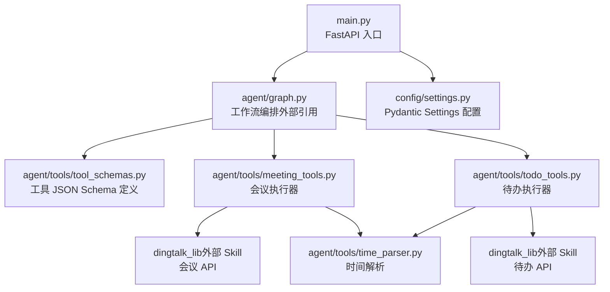
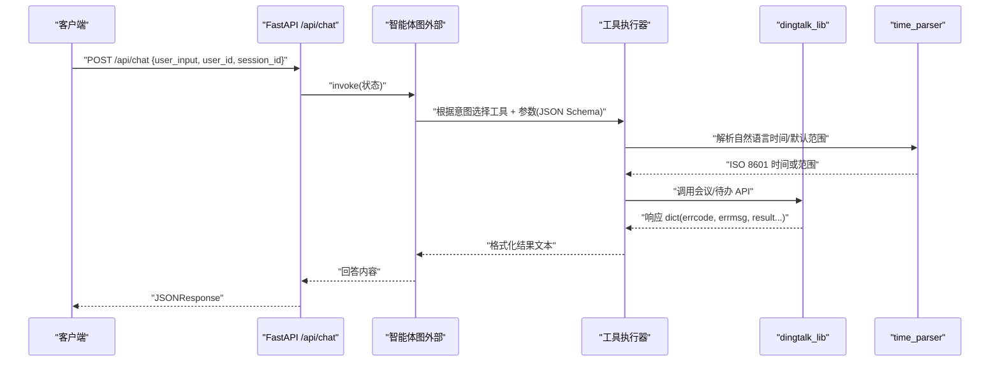
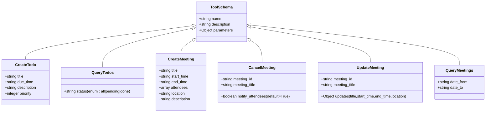
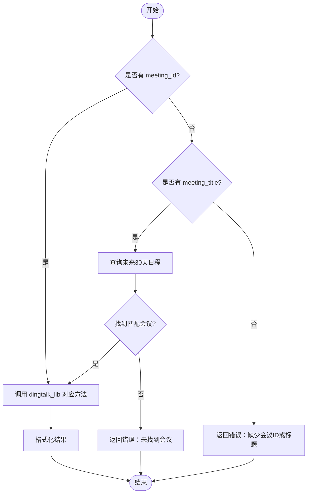
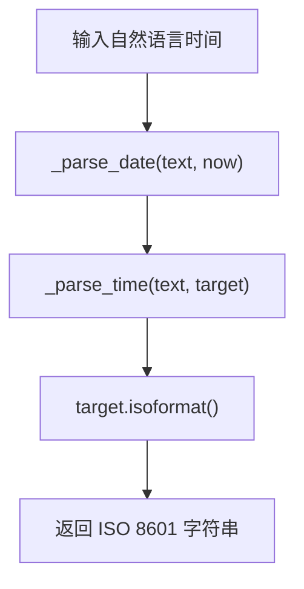
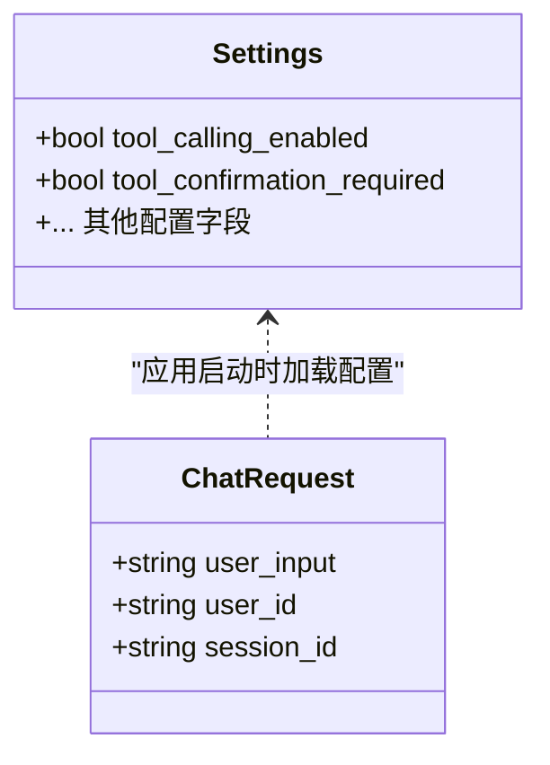
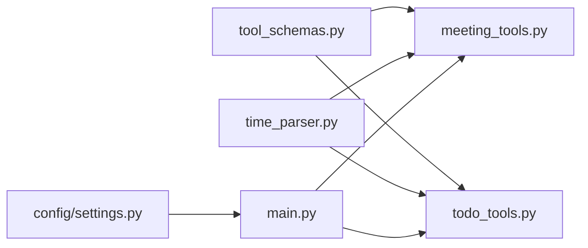

# 工具参数定义

<cite>
**本文引用的文件**
- [agent/tools/tool_schemas.py](file://agent/tools/tool_schemas.py)
- [agent/tools/meeting_tools.py](file://agent/tools/meeting_tools.py)
- [agent/tools/todo_tools.py](file://agent/tools/todo_tools.py)
- [agent/tools/time_parser.py](file://agent/tools/time_parser.py)
- [config/settings.py](file://config/settings.py)
- [main.py](file://main.py)
</cite>

## 目录
1. [简介](#简介)
2. [项目结构](#项目结构)
3. [核心组件](#核心组件)
4. [架构总览](#架构总览)
5. [详细组件分析](#详细组件分析)
6. [依赖关系分析](#依赖关系分析)
7. [性能考虑](#性能考虑)
8. [故障排查指南](#故障排查指南)
9. [结论](#结论)
10. [附录：Schema 扩展与自定义开发规范](#附录schema-扩展与自定义开发规范)

## 简介
本技术文档聚焦于“工具参数定义”，全面解析钉钉智能体助手中的工具接口参数 Schema，重点说明 Pydantic 模型的设计模式在配置与请求体中的应用，以及工具层基于 JSON Schema 的参数描述、校验与向后兼容策略。文档覆盖会议工具与待办工具的完整参数结构（包括嵌套对象、数组类型、枚举值等），并给出参数校验机制、错误提示生成、可扩展性与自定义开发规范。

## 项目结构
围绕工具参数定义的核心代码位于 agent/tools 目录下，包含：
- tool_schemas.py：集中定义所有工具的 JSON Schema（名称、描述、参数结构与必填项）
- meeting_tools.py：会议相关执行器与结果格式化
- todo_tools.py：待办相关执行器与结果格式化
- time_parser.py：自然语言时间到 ISO 8601 的转换工具，支撑时间类参数的解析与默认范围推导

此外，应用级配置使用 Pydantic Settings 管理全局开关（如是否启用工具调用、写操作是否需要确认），Web 入口 main.py 定义了聊天请求体的 Pydantic 模型，体现统一的参数校验风格。

图表来源
- [main.py:138-209](file://main.py#L138-L209)
- [agent/tools/tool_schemas.py:30-114](file://agent/tools/tool_schemas.py#L30-L114)
- [agent/tools/meeting_tools.py:17-128](file://agent/tools/meeting_tools.py#L17-L128)
- [agent/tools/todo_tools.py:18-44](file://agent/tools/todo_tools.py#L18-L44)
- [agent/tools/time_parser.py:11-63](file://agent/tools/time_parser.py#L11-L63)
- [config/settings.py:19-155](file://config/settings.py#L19-L155)

章节来源
- [main.py:138-209](file://main.py#L138-L209)
- [agent/tools/tool_schemas.py:30-114](file://agent/tools/tool_schemas.py#L30-L114)
- [config/settings.py:19-155](file://config/settings.py#L19-L155)

## 核心组件
- 工具参数 Schema（JSON Schema）：集中定义工具名、描述、参数属性、类型、枚举、必填字段与默认值，供 LLM Function Calling 抽取参数时参考与约束。
- 工具执行器：将 LLM 提取的参数转换为钉钉 API 调用所需格式，处理默认值、缺失字段回退、参会人解析、时间范围推导等。
- 时间解析器：将中文自然语言时间表达转换为 ISO 8601，支持“今天/明天/本周/下周/本月”等范围解析。
- 配置与开关：通过 Pydantic Settings 控制工具调用总开关、写操作确认策略等。
- Web 请求体：使用 Pydantic BaseModel 统一校验用户输入，保证类型安全与错误提示一致性。

章节来源
- [agent/tools/tool_schemas.py:30-114](file://agent/tools/tool_schemas.py#L30-L114)
- [agent/tools/meeting_tools.py:17-128](file://agent/tools/meeting_tools.py#L17-L128)
- [agent/tools/todo_tools.py:18-44](file://agent/tools/todo_tools.py#L18-L44)
- [agent/tools/time_parser.py:11-63](file://agent/tools/time_parser.py#L11-L63)
- [config/settings.py:151-155](file://config/settings.py#L151-L155)
- [main.py:138-143](file://main.py#L138-L143)

## 架构总览
下图展示了从 Web 请求到工具执行的参数流转过程，强调 JSON Schema 与执行器的协作关系，以及时间解析对参数补全的作用。

图表来源
- [main.py:154-209](file://main.py#L154-L209)
- [agent/tools/tool_schemas.py:30-114](file://agent/tools/tool_schemas.py#L30-L114)
- [agent/tools/meeting_tools.py:17-128](file://agent/tools/meeting_tools.py#L17-L128)
- [agent/tools/todo_tools.py:18-44](file://agent/tools/todo_tools.py#L18-L44)
- [agent/tools/time_parser.py:11-63](file://agent/tools/time_parser.py#L11-L63)

## 详细组件分析

### 工具参数 Schema（tool_schemas.py）
- 设计要点
  - 每个工具以对象形式定义 name、description、parameters（type=object，properties，required）。
  - 支持字符串、整数、布尔、数组、嵌套对象等复杂类型。
  - 通过 enum 限制可选值（如 query_todos.status）。
  - required 明确必填字段；部分字段提供 default（如 cancel_meeting.notify_attendees）。
  - 时间字段统一采用 ISO 8601 字符串，便于跨系统一致性与可解析性。
- 关键工具与参数结构
  - create_todo：title（必填）、due_time（必填）、description（可选）、priority（可选，整数）
  - query_todos：status（可选，枚举 all/pending/done）
  - create_meeting：title（必填）、start_time（必填）、end_time（可选）、attendees（可选，字符串数组）、location（可选）、description（可选）
  - cancel_meeting：meeting_id 或 meeting_title（至少其一）、notify_attendees（可选，布尔，默认 True）
  - update_meeting：meeting_id 或 meeting_title（至少其一）、updates（可选，嵌套对象，含 title/start_time/end_time/location）
  - query_meetings：date_from、date_to（可选，ISO 8601）
- 质量保证
  - 通过 JSON Schema 约束 LLM 输出，减少非法参数进入执行器。
  - 读/写工具分类集合用于后续确认流程（WRITE_TOOLS/READ_TOOLS）。

图表来源
- [agent/tools/tool_schemas.py:30-114](file://agent/tools/tool_schemas.py#L30-L114)

章节来源
- [agent/tools/tool_schemas.py:30-114](file://agent/tools/tool_schemas.py#L30-L114)

### 会议工具执行器（meeting_tools.py）
- 功能概述
  - execute_create_meeting：创建会议，自动解析参会人（姓名/手机号→钉钉用户ID），未指定结束时间则默认开始时间+1小时。
  - execute_cancel_meeting：优先按 meeting_id 取消；若无 ID 则按标题查询未来30天内的会议匹配后取消。
  - execute_update_meeting：优先按 meeting_id 修改；若无 ID 则按标题查询未来30天内的会议匹配后修改。
  - execute_query_meetings：查询会议，未指定日期范围时默认查询“本周”。
  - format_meeting_result/format_meeting_confirmation：统一结果与确认消息格式化。
- 参数处理与校验
  - 参会人列表 _resolve_attendees：支持手机号正则匹配直接查询，否则按姓名搜索；失败保留原值以便 API 跳过无效项。
  - 时间处理：_add_one_hour 为 ISO 时间加一小时；query_meetings 使用 time_parser 解析“本周”范围。
- 错误处理
  - 找不到会议时返回 errcode=-1 与明确 errmsg。
  - 缺少必要标识（meeting_id 或 meeting_title）时返回错误提示。

图表来源
- [agent/tools/meeting_tools.py:50-113](file://agent/tools/meeting_tools.py#L50-L113)
- [agent/tools/time_parser.py:29-63](file://agent/tools/time_parser.py#L29-L63)

章节来源
- [agent/tools/meeting_tools.py:17-128](file://agent/tools/meeting_tools.py#L17-L128)
- [agent/tools/time_parser.py:29-63](file://agent/tools/time_parser.py#L29-L63)

### 待办工具执行器（todo_tools.py）
- 功能概述
  - execute_create_todo：创建待办，传入 title、due_time、description、priority（默认优先级为 3）。
  - execute_query_todos：查询待办，默认状态为 pending。
  - format_todo_result/format_todo_confirmation：统一结果与确认消息格式化。
- 参数处理与校验
  - 通过 params.get 提供默认值，避免空参导致下游异常。
  - 结果中 errcode!=0 时统一返回错误信息。

章节来源
- [agent/tools/todo_tools.py:18-44](file://agent/tools/todo_tools.py#L18-L44)
- [agent/tools/todo_tools.py:47-84](file://agent/tools/todo_tools.py#L47-L84)

### 时间解析器（time_parser.py）
- 功能概述
  - parse_natural_time：将自然语言时间转为 ISO 8601 字符串。
  - parse_natural_date_range：将“今天/明天/本周/下周/本月”等范围转为 (start, end) 元组。
  - 内部 _parse_date/_parse_time：分别处理日期偏移与时间片段（上午/下午/晚上/早上、半点等）。
- 使用场景
  - 会议查询默认“本周”范围。
  - 取消/更新会议在未提供 meeting_id 时，按当前时间到未来30天进行查询匹配。

图表来源
- [agent/tools/time_parser.py:11-26](file://agent/tools/time_parser.py#L11-L26)
- [agent/tools/time_parser.py:66-119](file://agent/tools/time_parser.py#L66-L119)

章节来源
- [agent/tools/time_parser.py:11-119](file://agent/tools/time_parser.py#L11-L119)

### 配置与请求体（Pydantic 模型）
- 全局配置（Settings）
  - 使用 pydantic-settings 的 BaseSettings，从环境变量或 .env 加载。
  - 工具相关开关：tool_calling_enabled（总开关）、tool_confirmation_required（写操作需确认）。
  - 其他子系统配置（LLM、RAG、记忆、限流熔断等）均通过同一模型统一管理。
- Web 请求体（ChatRequest）
  - 使用 Pydantic BaseModel 定义 user_input、user_id、session_id，确保类型校验与默认值。
  - 在路由中统一进行安全过滤、限流、熔断检查后再进入智能体图。

图表来源
- [config/settings.py:19-155](file://config/settings.py#L19-L155)
- [main.py:138-143](file://main.py#L138-L143)

章节来源
- [config/settings.py:19-155](file://config/settings.py#L19-L155)
- [main.py:138-143](file://main.py#L138-L143)

## 依赖关系分析
- 工具 Schema 与执行器解耦：Schema 仅描述参数结构，执行器负责参数转换与业务逻辑，降低耦合度。
- 时间解析作为共享能力：被会议工具复用，提升一致性。
- 外部依赖隔离：通过 sys.path.insert 动态引入 dingtalk_lib，保持 Skill 自包含特性。
- 配置驱动行为：工具调用开关与确认策略由 Settings 控制，便于运行时调整。

图表来源
- [agent/tools/tool_schemas.py:30-114](file://agent/tools/tool_schemas.py#L30-L114)
- [agent/tools/meeting_tools.py:17-128](file://agent/tools/meeting_tools.py#L17-L128)
- [agent/tools/todo_tools.py:18-44](file://agent/tools/todo_tools.py#L18-L44)
- [agent/tools/time_parser.py:11-63](file://agent/tools/time_parser.py#L11-L63)
- [config/settings.py:151-155](file://config/settings.py#L151-L155)
- [main.py:154-209](file://main.py#L154-L209)

章节来源
- [agent/tools/tool_schemas.py:30-114](file://agent/tools/tool_schemas.py#L30-L114)
- [agent/tools/meeting_tools.py:17-128](file://agent/tools/meeting_tools.py#L17-L128)
- [agent/tools/todo_tools.py:18-44](file://agent/tools/todo_tools.py#L18-L44)
- [agent/tools/time_parser.py:11-63](file://agent/tools/time_parser.py#L11-L63)
- [config/settings.py:151-155](file://config/settings.py#L151-L155)
- [main.py:154-209](file://main.py#L154-L209)

## 性能考虑
- 时间解析开销低，主要影响在自然语言到 ISO 转换，建议缓存常用范围（如“本周”）以减少重复计算。
- 参会人解析涉及多次外部查询，建议在批量场景下合并查询或增加本地缓存。
- 默认结束时间推导（+1小时）减少用户输入负担，但需注意跨时区与夏令时的兼容性。
- 工具调用开关与确认策略可通过配置快速切换，避免不必要的网络请求与交互。

[本节为通用性能讨论，不直接分析具体文件]

## 故障排查指南
- 常见错误与定位
  - 未找到会议：检查 meeting_id 或 meeting_title 是否正确；确认查询时间范围是否合理（默认未来30天）。
  - 参会人解析失败：检查手机号格式或姓名是否存在；失败时会保留原值，最终由 API 跳过无效项。
  - 时间格式错误：确保 ISO 8601 格式；若使用自然语言，确认 time_parser 支持表达。
  - 工具未启用：检查 Settings.tool_calling_enabled 与 tool_confirmation_required。
- 日志与诊断
  - 查看工具执行器返回的 errcode 与 errmsg，快速定位失败原因。
  - 在 Web 入口中，关注安全过滤、限流、熔断阶段的错误码（403/429/503）。

章节来源
- [agent/tools/meeting_tools.py:50-113](file://agent/tools/meeting_tools.py#L50-L113)
- [agent/tools/meeting_tools.py:131-159](file://agent/tools/meeting_tools.py#L131-L159)
- [agent/tools/todo_tools.py:47-69](file://agent/tools/todo_tools.py#L47-L69)
- [main.py:163-185](file://main.py#L163-L185)

## 结论
本项目通过 JSON Schema 集中定义工具参数，结合 Pydantic 模型实现配置与请求体的强类型校验，形成从 LLM 参数抽取到执行器调用的稳定链路。会议与待办工具在参数处理上体现了良好的默认值策略、缺失字段回退与错误提示机制。时间解析器提升了用户体验，同时保证了数据一致性。通过配置开关与确认策略，系统在易用性与安全性之间取得平衡。

[本节为总结性内容，不直接分析具体文件]

## 附录：Schema 扩展与自定义开发规范
- 新增工具步骤
  - 在 tool_schemas.py 中添加新的工具 Schema（name、description、parameters），明确必填字段与类型。
  - 在对应工具模块（meeting_tools.py 或新建模块）中实现 execute_xxx(params, user_id) 与 format_xxx_result/confirmation。
  - 如需时间解析，复用 time_parser 提供的函数。
- 参数验证规则
  - 使用 JSON Schema 的 type、enum、required 等约束 LLM 输出。
  - 在执行器中使用 params.get 提供默认值，避免空参。
  - 对外部依赖调用前进行必要校验（如 meeting_id 或 meeting_title 至少其一）。
- 数据类型定义
  - 时间统一使用 ISO 8601 字符串。
  - 数组类型用于多值参数（如 attendees）。
  - 嵌套对象用于增量更新（如 updates）。
- 必填字段标识与默认值
  - required 明确必填；default 在 Schema 或执行器中设置默认值。
- 向后兼容性保证
  - 新增可选字段不影响旧版本调用。
  - 对缺失字段提供回退逻辑（如默认时间范围、默认优先级）。
  - 错误提示保持一致的 errcode/errmsg 结构。
- 自定义参数开发规范
  - 遵循现有命名约定（snake_case）。
  - 新增枚举值需在 Schema 中声明并在执行器中处理分支。
  - 新增时间表达需在 time_parser 中补充解析逻辑，并更新文档。

章节来源
- [agent/tools/tool_schemas.py:30-114](file://agent/tools/tool_schemas.py#L30-L114)
- [agent/tools/meeting_tools.py:17-128](file://agent/tools/meeting_tools.py#L17-L128)
- [agent/tools/todo_tools.py:18-44](file://agent/tools/todo_tools.py#L18-L44)
- [agent/tools/time_parser.py:11-119](file://agent/tools/time_parser.py#L11-L119)
- [config/settings.py:151-155](file://config/settings.py#L151-L155)