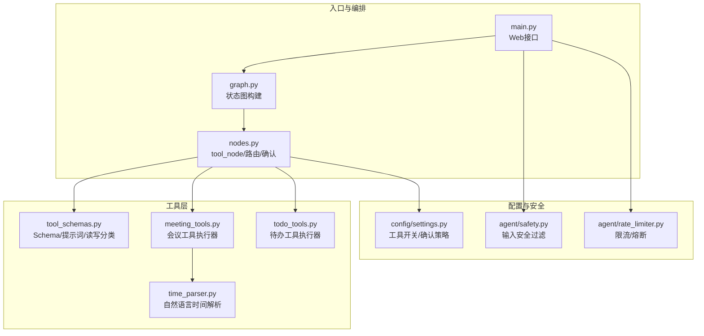
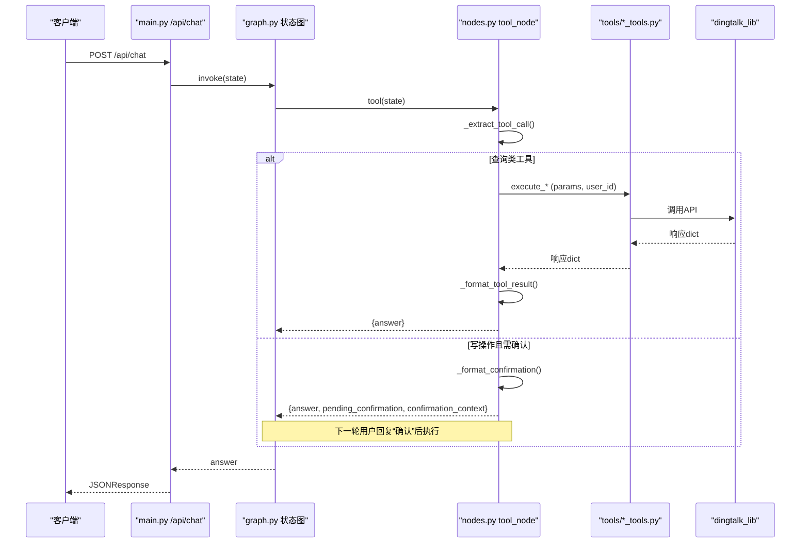
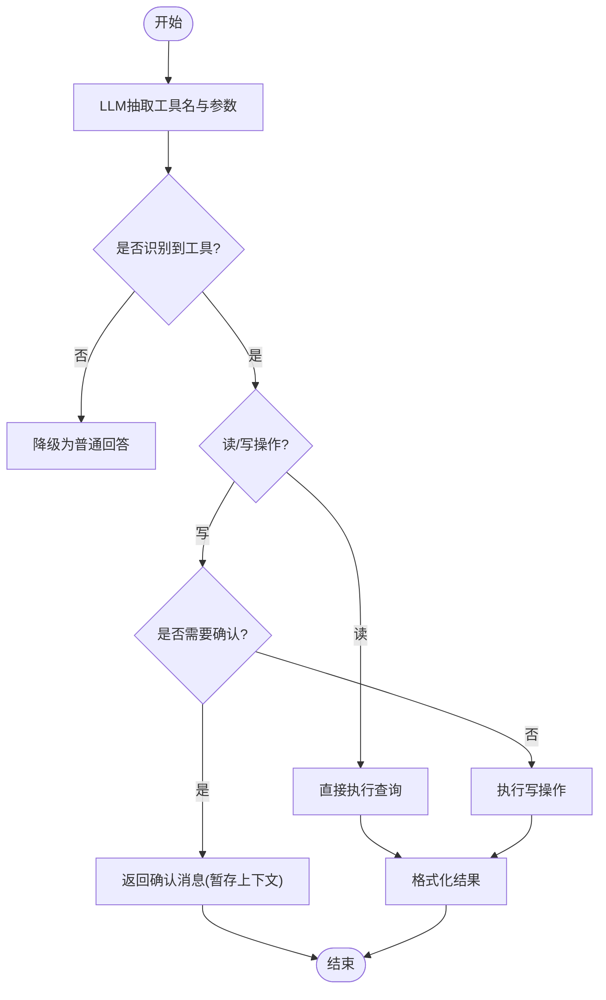
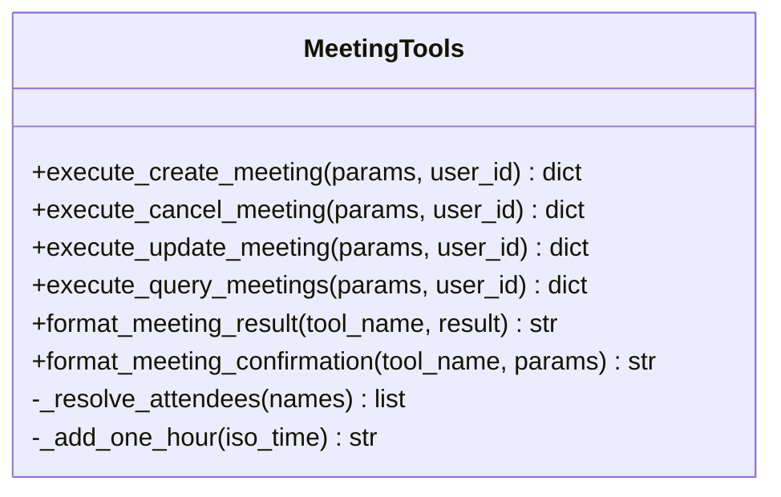
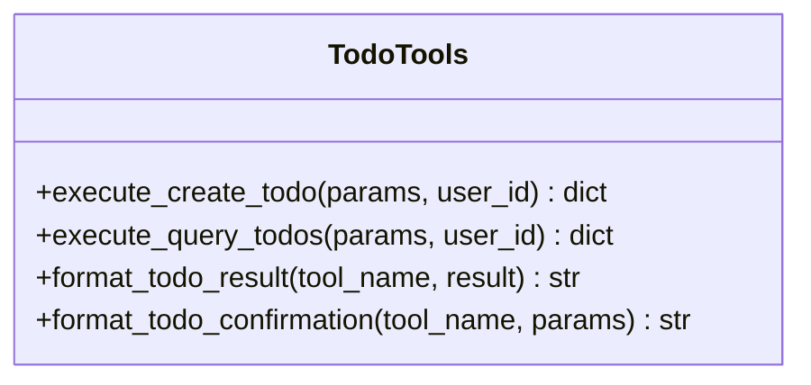
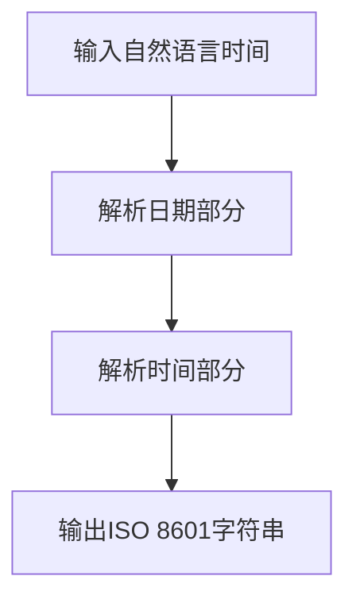
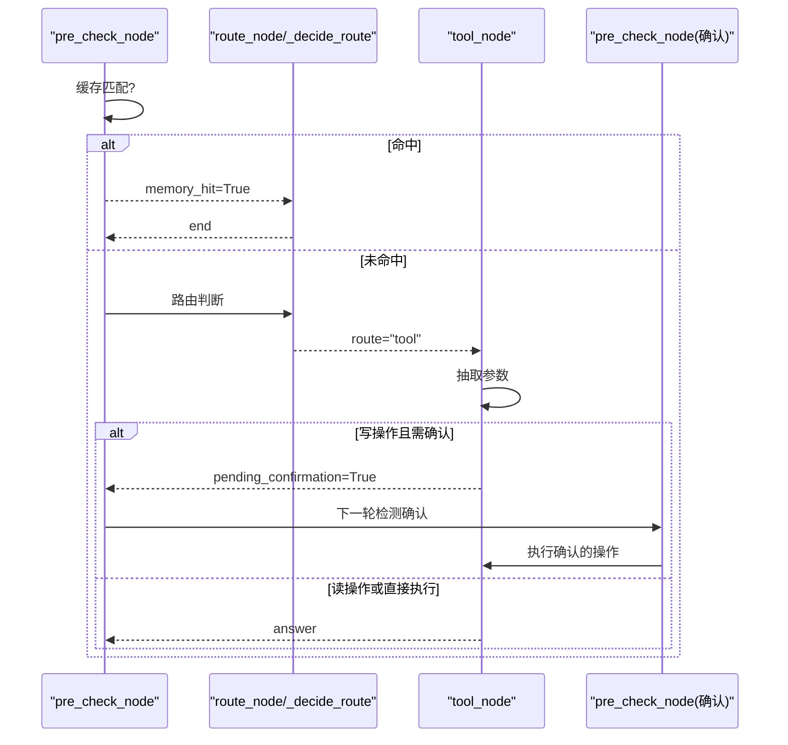
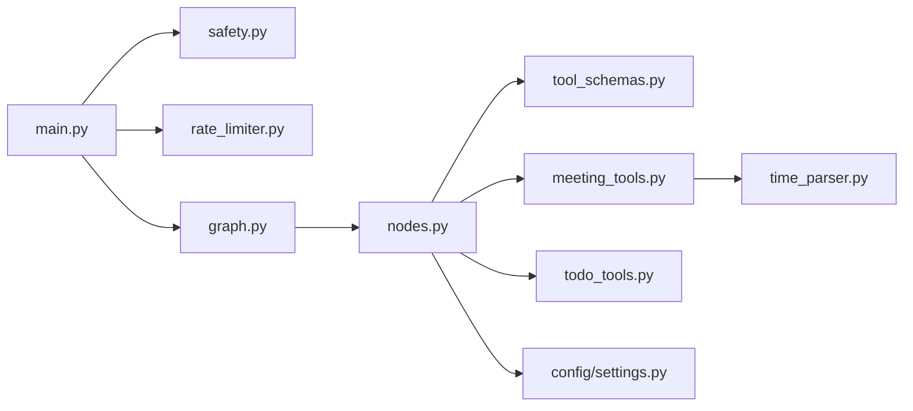

# 工具调用系统

<cite>
**本文引用的文件**
- [agent/tools/meeting_tools.py](file://agent/tools/meeting_tools.py)
- [agent/tools/todo_tools.py](file://agent/tools/todo_tools.py)
- [agent/tools/tool_schemas.py](file://agent/tools/tool_schemas.py)
- [agent/tools/time_parser.py](file://agent/tools/time_parser.py)
- [agent/nodes.py](file://agent/nodes.py)
- [agent/graph.py](file://agent/graph.py)
- [config/settings.py](file://config/settings.py)
- [main.py](file://main.py)
- [agent/safety.py](file://agent/safety.py)
- [agent/rate_limiter.py](file://agent/rate_limiter.py)
</cite>

## 目录
1. [简介](#简介)
2. [项目结构](#项目结构)
3. [核心组件](#核心组件)
4. [架构总览](#架构总览)
5. [详细组件分析](#详细组件分析)
6. [依赖关系分析](#依赖关系分析)
7. [性能与可靠性](#性能与可靠性)
8. [故障排查指南](#故障排查指南)
9. [结论](#结论)
10. [附录：工具开发指南与扩展方法](#附录工具开发指南与扩展方法)

## 简介
本技术文档聚焦于钉钉AI智能体助手中的“工具调用系统”，全面解析企业级工具（会议管理、待办事项管理）的集成实现。重点覆盖：
- 工具参数提取与确认机制
- API调用封装与结果格式化
- 工具注册与路由分发
- 错误处理策略、权限控制与安全考虑
- 工具开发与扩展方法

该系统基于LangGraph状态图编排，通过LLM进行意图识别与参数抽取，结合配置开关实现写操作的二次确认，最终调用外部dingtalk_lib完成钉钉API操作，并将结果以用户可读文本返回。

## 项目结构
工具调用系统位于 agent 子模块中，围绕 nodes.py 的工具节点展开，配合 tools 下的具体执行器与 schemas 定义，形成“意图识别 → 参数抽取 → 确认 → 执行 → 格式化”的完整链路。

图表来源
- [main.py:154-210](file://main.py#L154-L210)
- [agent/graph.py:44-102](file://agent/graph.py#L44-L102)
- [agent/nodes.py:646-780](file://agent/nodes.py#L646-L780)
- [agent/tools/tool_schemas.py:1-121](file://agent/tools/tool_schemas.py#L1-L121)
- [agent/tools/meeting_tools.py:1-225](file://agent/tools/meeting_tools.py#L1-L225)
- [agent/tools/todo_tools.py:1-84](file://agent/tools/todo_tools.py#L1-L84)
- [agent/tools/time_parser.py:1-120](file://agent/tools/time_parser.py#L1-L120)
- [config/settings.py:151-156](file://config/settings.py#L151-L156)
- [agent/safety.py:1-68](file://agent/safety.py#L1-L68)
- [agent/rate_limiter.py:1-147](file://agent/rate_limiter.py#L1-L147)

章节来源
- [main.py:154-210](file://main.py#L154-L210)
- [agent/graph.py:44-102](file://agent/graph.py#L44-L102)
- [agent/nodes.py:646-780](file://agent/nodes.py#L646-L780)
- [config/settings.py:151-156](file://config/settings.py#L151-L156)

## 核心组件
- 工具Schema与提示词：定义可用工具、参数结构与抽取提示词，区分读/写操作集合，为LLM Function Calling提供规范。
- 工具执行器：按领域划分（会议、待办），负责参数转换、调用外部API、结果格式化与确认消息生成。
- 工具节点：在LangGraph工作流中统一调度工具调用流程（抽取→确认→执行→格式化）。
- 时间解析：将中文自然语言时间转换为ISO 8601格式，支撑会议查询等场景。
- 配置与安全：工具总开关、写操作确认开关、输入安全过滤、限流与熔断。

章节来源
- [agent/tools/tool_schemas.py:1-121](file://agent/tools/tool_schemas.py#L1-L121)
- [agent/tools/meeting_tools.py:1-225](file://agent/tools/meeting_tools.py#L1-L225)
- [agent/tools/todo_tools.py:1-84](file://agent/tools/todo_tools.py#L1-L84)
- [agent/tools/time_parser.py:1-120](file://agent/tools/time_parser.py#L1-L120)
- [config/settings.py:151-156](file://config/settings.py#L151-L156)
- [agent/safety.py:1-68](file://agent/safety.py#L1-L68)
- [agent/rate_limiter.py:1-147](file://agent/rate_limiter.py#L1-L147)

## 架构总览
工具调用系统在LangGraph中的位置如下：预检查节点完成缓存匹配与路由判断；若判定为工具调用，则进入 tool 节点；tool 节点内部完成参数抽取、确认（写操作）、执行与格式化，并直接返回结果（不经过 generate）。

图表来源
- [main.py:154-210](file://main.py#L154-L210)
- [agent/graph.py:44-102](file://agent/graph.py#L44-L102)
- [agent/nodes.py:646-780](file://agent/nodes.py#L646-L780)
- [agent/tools/meeting_tools.py:17-129](file://agent/tools/meeting_tools.py#L17-L129)
- [agent/tools/todo_tools.py:18-44](file://agent/tools/todo_tools.py#L18-L44)

## 详细组件分析

### 工具Schema与参数提取
- 工具列表与参数结构：在工具Schema中定义了创建/查询待办、创建/取消/修改/查询会议等工具的参数类型、必填项与可选项，并提供抽取提示词供LLM输出结构化JSON。
- 读写分类：明确区分读操作（无需确认）与写操作（需要确认），便于后续流程分支。
- 抽取流程：tool_node 使用路由小模型从用户输入中提取工具名与参数；失败时降级为普通回答。

图表来源
- [agent/tools/tool_schemas.py:8-26](file://agent/tools/tool_schemas.py#L8-L26)
- [agent/tools/tool_schemas.py:116-121](file://agent/tools/tool_schemas.py#L116-L121)
- [agent/nodes.py:693-710](file://agent/nodes.py#L693-L710)
- [agent/nodes.py:646-691](file://agent/nodes.py#L646-L691)

章节来源
- [agent/tools/tool_schemas.py:1-121](file://agent/tools/tool_schemas.py#L1-L121)
- [agent/nodes.py:646-710](file://agent/nodes.py#L646-L710)

### 会议管理工具
- 创建会议：支持标题、开始/结束时间、参会人、地点、描述；自动补全默认时长（无结束时间时+1小时）；参会人姓名/手机号解析为钉钉用户ID。
- 取消/修改会议：优先使用 meeting_id，否则根据标题在未来30天内模糊匹配；支持通知参会人开关。
- 查询会议：支持自然语言日期范围（如“本周”），默认查询本周日程。
- 结果与确认：提供用户友好的结果文本与确认消息模板。

图表来源
- [agent/tools/meeting_tools.py:17-159](file://agent/tools/meeting_tools.py#L17-L159)
- [agent/tools/meeting_tools.py:185-225](file://agent/tools/meeting_tools.py#L185-L225)

章节来源
- [agent/tools/meeting_tools.py:17-159](file://agent/tools/meeting_tools.py#L17-L159)
- [agent/tools/meeting_tools.py:185-225](file://agent/tools/meeting_tools.py#L185-L225)

### 待办管理工具
- 创建待办：支持标题、截止时间、详情、优先级。
- 查询待办：支持按状态筛选（all/pending/done）。
- 结果与确认：提供用户友好的结果文本与确认消息模板。

图表来源
- [agent/tools/todo_tools.py:18-84](file://agent/tools/todo_tools.py#L18-L84)

章节来源
- [agent/tools/todo_tools.py:18-84](file://agent/tools/todo_tools.py#L18-L84)

### 时间解析工具
- 自然语言时间转ISO 8601：支持“明天下午3点”、“下周一上午10点”、“2小时后”等表达。
- 日期范围解析：支持“今天/明天/本周/下周/本月”等范围，返回起止时间元组。

图表来源
- [agent/tools/time_parser.py:11-63](file://agent/tools/time_parser.py#L11-L63)
- [agent/tools/time_parser.py:66-120](file://agent/tools/time_parser.py#L66-L120)

章节来源
- [agent/tools/time_parser.py:11-120](file://agent/tools/time_parser.py#L11-L120)

### 工具节点与工作流集成
- 路由判断：pre_check_node 合并问答缓存匹配与路由判断；若命中缓存直接返回；否则进入路由逻辑。
- 工具路由：当检测到工具关键词或LLM路由结果为tool时，进入 tool_node。
- 确认机制：写操作在 settings.tool_confirmation_required 开启时需用户确认；下一轮 pre_check_node 会检测 pending_confirmation 并执行确认后的操作。
- 结果返回：tool_node 直接返回 answer，不经过 generate，提升响应效率。

图表来源
- [agent/nodes.py:93-151](file://agent/nodes.py#L93-L151)
- [agent/nodes.py:154-212](file://agent/nodes.py#L154-L212)
- [agent/nodes.py:646-780](file://agent/nodes.py#L646-L780)

章节来源
- [agent/nodes.py:93-151](file://agent/nodes.py#L93-L151)
- [agent/nodes.py:154-212](file://agent/nodes.py#L154-L212)
- [agent/nodes.py:646-780](file://agent/nodes.py#L646-L780)

## 依赖关系分析
- 工具执行器依赖 dingtalk_lib（通过 skill scripts 路径动态加入 sys.path），保持 Skill 自包含特性。
- 工具节点依赖 LLM（路由小模型）进行参数抽取；主模型用于生成回答（非工具路径）。
- 配置中心集中管理工具开关、确认策略、限流与熔断等运行时行为。
- 安全与限流在 Web 入口层前置拦截，保障系统稳定性。

图表来源
- [main.py:154-210](file://main.py#L154-L210)
- [agent/safety.py:1-68](file://agent/safety.py#L1-L68)
- [agent/rate_limiter.py:1-147](file://agent/rate_limiter.py#L1-L147)
- [agent/graph.py:44-102](file://agent/graph.py#L44-L102)
- [agent/nodes.py:646-780](file://agent/nodes.py#L646-L780)
- [agent/tools/tool_schemas.py:1-121](file://agent/tools/tool_schemas.py#L1-L121)
- [agent/tools/meeting_tools.py:1-225](file://agent/tools/meeting_tools.py#L1-L225)
- [agent/tools/todo_tools.py:1-84](file://agent/tools/todo_tools.py#L1-L84)
- [agent/tools/time_parser.py:1-120](file://agent/tools/time_parser.py#L1-L120)
- [config/settings.py:151-156](file://config/settings.py#L151-L156)

章节来源
- [main.py:154-210](file://main.py#L154-L210)
- [agent/nodes.py:646-780](file://agent/nodes.py#L646-L780)
- [config/settings.py:151-156](file://config/settings.py#L151-L156)

## 性能与可靠性
- 流式与预热：启动时预热LLM连接（路由小模型与主模型），降低首请求延迟；流式接口整体超时保护，避免连接卡死。
- 检索与记忆：RAG/联网搜索失败静默降级；问答缓存命中短路生成链路，减少LLM调用。
- 限流与熔断：按用户维度滑动窗口限流；连续失败触发熔断，冷却后半开试探，恢复后重置。
- 工具调用优化：读操作直接执行；写操作可配置确认；工具结果直接返回，不经过生成节点。

章节来源
- [main.py:45-135](file://main.py#L45-L135)
- [main.py:228-314](file://main.py#L228-L314)
- [agent/rate_limiter.py:22-147](file://agent/rate_limiter.py#L22-L147)
- [agent/nodes.py:232-282](file://agent/nodes.py#L232-L282)

## 故障排查指南
- 工具参数抽取失败：检查路由小模型可用性；查看日志中“LLM 提取工具参数失败”；确认工具Schema与提示词正确。
- 写操作未生效：确认 settings.tool_confirmation_required 是否为 True；检查下一轮是否收到“确认”指令；查看 pending_confirmation 上下文。
- 会议查询为空：确认时间范围解析是否正确；检查 query_schedules 返回结构；必要时调整查询窗口。
- 参会人解析失败：检查手机号正则匹配与姓名搜索返回；失败时保留原值，API可能跳过无效ID。
- 安全拦截：检查 input_filter_enabled 与敏感词黑名单；确认 prompt 注入检测模式。
- 限流/熔断：查看 rate_limit_per_minute 与 circuit_breaker_threshold；关注健康检查端点的熔断状态。

章节来源
- [agent/nodes.py:693-710](file://agent/nodes.py#L693-L710)
- [agent/nodes.py:93-151](file://agent/nodes.py#L93-L151)
- [agent/tools/meeting_tools.py:185-225](file://agent/tools/meeting_tools.py#L185-L225)
- [agent/safety.py:35-68](file://agent/safety.py#L35-L68)
- [agent/rate_limiter.py:22-147](file://agent/rate_limiter.py#L22-L147)

## 结论
该工具调用系统以LangGraph为核心编排，结合LLM意图识别与参数抽取，实现了企业级会议与待办管理的可靠集成。通过Schema驱动的参数校验、写操作确认机制、统一的错误处理与格式化输出，以及限流熔断等稳定性保障，提供了高可用、可扩展的企业工具能力。未来可通过新增工具Schema与执行器快速扩展更多业务场景。

## 附录：工具开发指南与扩展方法
- 新增工具步骤
  1. 在 tool_schemas.py 中定义新工具的 name、description、parameters（含必填/可选字段），并在 TOOL_EXTRACT_PROMPT 中补充说明。
  2. 在 tools 目录下新增执行器模块（如 new_tools.py），实现 execute_* 函数，负责参数转换、调用外部API、结果格式化与确认消息生成。
  3. 在 nodes.py 的 _execute_tool 中注册新工具的分发逻辑；在 _format_tool_result 与 _format_confirmation 中添加对应分支。
  4. 如需时间解析，复用 time_parser.py 的能力；如需参会人解析，参考 meeting_tools.py 的 _resolve_attendees。
  5. 在 settings.py 中根据需要调整工具开关与确认策略。

- 参数提取最佳实践
  - 明确必填与可选字段，提供清晰的 description。
  - 对复杂字段（如 attendees、updates）给出示例或约束说明。
  - 使用鲁棒的解析函数（如时间、手机号正则）提高抽取成功率。

- 确认机制与权限控制
  - 写操作建议开启 tool_confirmation_required，避免误操作。
  - 可在执行前增加权限校验（如用户角色、资源归属），确保仅授权用户可执行敏感操作。
  - 对于批量或高风险操作，可增加二次确认或审批流程。

- 错误处理与安全性
  - 所有外部API调用应捕获异常并返回统一错误结构（errcode/errmsg）。
  - 对外部依赖（如 dingtalk_lib）进行隔离导入，保证Skill自包含。
  - 结合 safety.py 的输入过滤与 rate_limiter.py 的限流熔断，防止滥用与攻击。

- 性能优化建议
  - 读操作直接执行，避免不必要的确认步骤。
  - 对高频查询增加缓存（如最近会议/待办）。
  - 合理设置 LLM 重试与超时，避免长尾延迟影响用户体验。

章节来源
- [agent/tools/tool_schemas.py:1-121](file://agent/tools/tool_schemas.py#L1-L121)
- [agent/tools/meeting_tools.py:17-159](file://agent/tools/meeting_tools.py#L17-L159)
- [agent/tools/todo_tools.py:18-84](file://agent/tools/todo_tools.py#L18-L84)
- [agent/tools/time_parser.py:11-120](file://agent/tools/time_parser.py#L11-L120)
- [agent/nodes.py:712-780](file://agent/nodes.py#L712-L780)
- [config/settings.py:151-156](file://config/settings.py#L151-L156)
- [agent/safety.py:1-68](file://agent/safety.py#L1-L68)
- [agent/rate_limiter.py:1-147](file://agent/rate_limiter.py#L1-L147)